

  

<strong>Universidad Peruana de Ciencias Aplicadas</strong>

<strong>Carrera de Ingeniería de Software</strong>

 

<strong>1ACC0238</strong>

<strong>Aplicaciones para Dispositivos Móviles</strong>

NRC

<strong>4945</strong>

<h2 align="center">Informe del Trabajo Final</h2>

Docente

<strong>Mayta Guillermo, Jorge Luis</strong>

 

Equipo

<strong>RuwaLabs</strong>

Proyecto

<strong>SaludYa</strong>

 

<strong>Integrantes</strong>

<table align="center">
  <tr><th>Código</th><th>Apellidos y nombres</th></tr>
  <tr><td>u202318309</td><td>Aguilar Untiveros, Rodrigo Fabrizio</td></tr>
  <tr><td>u202319950</td><td>Meza Solórzano, Didier Sebastian</td></tr>
  <tr><td>u20241d934</td><td>Montoya Nina, Paula Fernanda</td></tr>
  <tr><td>u20241e418</td><td>Ramos Mera, Neo Daniel</td></tr>
  <tr><td>u202624323</td><td>Torres Juárez, Alisee Muriel</td></tr>
</table>

<strong>Período 202620</strong>

<strong>Septiembre 2026</strong>

---
# Registro de Versiones del Informe

| Versión | Fecha | Autor | Descripción de modificación |
| :--- | :--- | :--- | :--- |
| 1.0.0 | 08-28-26 | Montoya Nina, Paula Fernanda | Se agregó la estructura base del documento, la Carátula, registro de versiones y el formato inicial del Student Outcome. |
| 1.1.0 | 09-02-26 | Meza Solórzano, Didier Sebastian | Se creó la estructura de carpetas y archivos base del informe (chapter-01 a chapter-06, conclusions, bibliography y glossary). |
| 1.2.0 | 09-13-26 | Aguilar Untiveros, Rodrigo Fabrizio | Se agregó la sección de Software Architecture del Capítulo II: Context Level Diagrams, Container Level Diagrams, Deployment Diagrams, Context Mapping, Bounded Context Canvases, Domain Message Flows Modeling y Candidate Context Discovery. |
| 1.3.0 | 09-16-26 | Meza Solórzano, Didier Sebastian | Se agregó la evidencia de la entrevista 6 y las evidencias de entrevistas del Capítulo II. |
| 1.4.0 | 09-17-26 | Meza Solórzano, Didier Sebastian | Se agregó la evidencia de las entrevistas 5 y 2 del Capítulo II. |
| 1.5.0 | 09-17-26 | Aguilar Untiveros, Rodrigo Fabrizio | Se actualizó el Capítulo II incorporando las dos colas complementarias (Booking Order y Attendance Queue): EventStorming, Candidate Context Discovery, Domain Message Flows, Bounded Context Canvases, Context Mapping, Container Level Diagram y sus diagramas asociados. |
| 1.6.0 | 09-18-26 | Torres Juárez, Alisee Muriel | Se documentó el bounded context de Identity & Access Management (capas Domain, Interface, Application e Infrastructure), se refactorizaron encabezados de sección, se revisó la numeración y se mejoraron las descripciones de los diagramas del Capítulo II. |
| 1.7.0 | 09-18-26 | Meza Solórzano, Didier Sebastian | Se agregó información adicional del Capítulo II y se actualizó el nombre del capítulo. |

# Project Report Collaboration Insights

URL de la Organización de Github del equipo RuwaLabs: [RuwaLabs](https://github.com/RuwaLabs)

URL del Repositorio del Project Report: [upc-pre-202620-1acc0238-4945-RuwaLabs-report](https://github.com/RuwaLabs/upc-pre-202620-1acc0238-4945-RuwaLabs-report)

---

# Contenido

- [Registro de Versiones del Informe](#registro-de-versiones-del-informe)
- [Project Report Collaboration Insights](#project-report-collaboration-insights)
- [Contenido](#contenido)
- [Student Outcome](#student-outcome)
- [Capítulo I: Presentación](#capítulo-i-presentación)
  - [1.1. Startup Profile](#11-startup-profile)
    - [1.1.1. Descripción de la Startup](#111-descripción-de-la-startup)
    - [1.1.2. Perfiles de integrantes del equipo](#112-perfiles-de-integrantes-del-equipo)
  - [1.2. Solution Profile](#12-solution-profile)
    - [1.2.1. Antecedentes y problemática](#121-antecedentes-y-problemática)
    - [1.2.2. Lean UX Process](#122-lean-ux-process)
      - [1.2.2.1. Lean UX Problem Statements](#1221-lean-ux-problem-statements)
      - [1.2.2.2. Lean UX Assumptions](#1222-lean-ux-assumptions)
      - [1.2.2.3. Lean UX Hypothesis Statements](#1223-lean-ux-hypothesis-statements)
      - [1.2.2.4. Lean UX Canvas](#1224-lean-ux-canvas)
  - [1.3. Segmentos objetivo](#13-segmentos-objetivo)
- [Capítulo II: Requirements Development and Software Solution Design](#capítulo-ii-requirements-development-and-software-solution-design)
  - [2.1. Competidores](#21-competidores)
    - [2.1.1. Análisis competitivo](#211-análisis-competitivo)
    - [2.1.2. Estrategias y tácticas frente a competidores](#212-estrategias-y-tácticas-frente-a-competidores)
  - [2.2. Entrevistas](#22-entrevistas)
    - [2.2.1. Diseño de entrevistas](#221-diseño-de-entrevistas)
    - [2.2.2. Registro de entrevistas](#222-registro-de-entrevistas)
    - [2.2.3. Análisis de entrevistas](#223-análisis-de-entrevistas)
  - [2.3. Needfinding](#23-needfinding)
    - [2.3.1. User Personas](#231-user-personas)
    - [2.3.2. User Task Matrix](#232-user-task-matrix)
    - [2.3.3. User Journey Mapping](#233-user-journey-mapping)
    - [2.3.4. Empathy Mapping](#234-empathy-mapping)
    - [2.3.5. Big Picture EventStorming](#235-big-picture-eventstorming)
    - [2.3.6. Ubiquitous Language](#236-ubiquitous-language)
  - [2.4. Requirements specification](#24-requirements-specification)
    - [2.4.1. User Stories](#241-user-stories)
    - [2.4.2. Impact Mapping](#242-impact-mapping)
    - [2.4.3. Product Backlog](#243-product-backlog)
  - [2.5. Strategic-Level Domain-Driven Design](#25-strategic-level-domain-driven-design)
    - [2.5.1. EventStorming](#251-eventstorming)
      - [2.5.1.1. Candidate Context Discovery](#2511-candidate-context-discovery)
      - [2.5.1.2. Domain Message Flows Modeling](#2512-domain-message-flows-modeling)
      - [2.5.1.3. Bounded Context Canvases](#2513-bounded-context-canvases)
    - [2.5.2. Context Mapping](#252-context-mapping)
    - [2.5.3. Software Architecture](#253-software-architecture)
      - [2.5.3.1. Software Architecture Context Level Diagrams](#2531-software-architecture-context-level-diagrams)
      - [2.5.3.2. Software Architecture Container Level Diagrams](#2532-software-architecture-container-level-diagrams)
      - [2.5.3.3. Software Architecture Deployment Diagrams](#2533-software-architecture-deployment-diagrams)
  - [2.6. Tactical-Level Domain-Driven Design](#26-tactical-level-domain-driven-design)
    - [2.6.x. Bounded Context: <Bounded Context Name>](#26x-bounded-context-bounded-context-name)
      - [2.6.x.1. Domain Layer](#26x1-domain-layer)
      - [2.6.x.2. Interface Layer](#26x2-interface-layer)
      - [2.6.x.3. Application Layer](#26x3-application-layer)
      - [2.6.x.4 Infrastructure Layer](#26x4-infrastructure-layer)
      - [2.6.x.5. Bounded Context Software Architecture Component Level Diagrams](#26x5-bounded-context-software-architecture-component-level-diagrams)
      - [2.6.x.6. Bounded Context Software Architecture Code Level Diagrams](#26x6-bounded-context-software-architecture-code-level-diagrams)
        - [2.6.x.6.1. Bounded Context Domain Layer Class Diagrams](#26x61-bounded-context-domain-layer-class-diagrams)
        - [2.6.x.6.2. Bounded Context Database Design Diagram](#26x62-bounded-context-database-design-diagram)
- [Conclusiones](#conclusiones)
- [Bibliografía](#bibliografía)
- [Anexos](#anexos)

---

# Student Outcome

El curso contribuye al cumplimiento del Student Outcome ABET:

**ABET - EAC - Student Outcome 7**

**Criterio:** *La capacidad de adquirir y aplicar nuevos conocimientos según sea necesario, utilizando estrategias de aprendizaje apropiadas.*

En el siguiente cuadro se describe las acciones realizadas y enunciados de conclusiones por parte del grupo, que permiten sustentar el haber alcanzado el logro del ABET – EAC - Student Outcome 7.

<table>
  <thead>
    <tr>
      <th>Criterio específico</th>
      <th>Acciones realizadas</th>
      <th>Conclusiones</th>
    </tr>
  </thead>
  <tbody>
    <tr>
      <td width="25%">
        Actualiza conceptos y conocimientos necesarios para su desarrollo profesional y en especial para su proyecto en soluciones de software.
      </td>
      <td width="50%">
        <strong>Aguilar Untiveros, Rodrigo Fabrizio</strong>
        <ul>
          <li><strong>AV1:</strong> Apliqué nuevos conocimientos sobre EventStorming, Candidate Context Discovery, Domain Message Flows Modeling, Bounded Context Canvases, Context Mapping y el modelo C4 para documentar la arquitectura de SaludYa. Asimismo, incorporé los conceptos de las dos colas complementarias del dominio (Booking Order y Attendance Queue), refinando los bounded contexts existentes y actualizando los diagramas de EventStorming, Context Mapping y Container Level Diagram.</li>
        </ul>
       <strong>Meza Solórzano, Didier Sebastian</strong>
<ul>
  <li><strong>AV1:</strong> Apliqué nuevos conocimientos sobre la técnica 5W2H, el diagrama de Ishikawa, la metodología Lean UX, el análisis competitivo y el diseño de entrevistas para desarrollar de principio a fin la problemática, la solución y la validación con usuarios de SaludYa.</li>
</ul>
        <strong>Montoya Nina, Paula Fernanda</strong>
        <ul>
          <li><strong>AV1:</strong> Investigué y apliqué conceptos avanzados de arquitectura de software para documentar el diseño a nivel de código de los Bounded Contexts. Esto incluyó la definición técnica de controladores, servicios y repositorios, plasmando esta lógica de negocio en diagramas relacionales de base de datos y diagramas de clases precisos para el proyecto.</li>
        </ul> 
        <strong>Ramos Mera, Neo Daniel</strong>
        <ul>
          <li><strong>AV1:</strong> Apliqué nuevos conocimientos sobre el modelado táctico de Domain-Driven Design (DDD), estructurando correctamente las capas de Dominio, Aplicación, Interfaz e Infraestructura. Asimismo, aprendí y utilicé estándares de modelado C4 y UML para elaborar los diagramas de componentes, clases y base de datos de los Bounded Contexts asignados.
</li>
        </ul>
        <strong>Torres Juárez, Alisee Muriel</strong>
        <ul>
          <li><strong>AV1:</strong> Apliqué nuevos conocimientos sobre EventStorming, diagramas de usuario y la redacción de User Stories para desarrollar de principio a fin la problemática, la solución y la validación de SaludYa </li>
        </ul>
      </td>
      <td width="25%">
        
<strong>AV1:</strong> 
        Como equipo, actualizamos de forma práctica nuestros conocimientos en el análisis y modelado de software, integrando metodologías como Lean UX, EventStorming y Domain-Driven Design (DDD). Esto nos permitió diseñar una arquitectura sólida, documentada con diagramas tácticos, estratégicos y de bases de datos, alineando la solución tecnológica a las necesidades reales del sector salud.

      </td>
    </tr>
    <tr>
      <td>
        Reconoce la necesidad del aprendizaje permanente para el desempeño profesional y el desarrollo de proyectos en soluciones de software.
      </td>
      <td>
        <strong>Aguilar Untiveros, Rodrigo Fabrizio</strong>
        <ul>
          <li><strong>AV1:</strong> Reconocí la necesidad de investigar de forma autónoma técnicas de modelado estratégico y táctico que no había aplicado antes, como EventStorming y Domain-Driven Design, para sustentar con criterios arquitectónicos sólidos el diseño de SaludYa. La correcta delimitación de los bounded contexts y la identificación de las dos colas del dominio me exigieron un análisis profundo para alinear el lenguaje ubicuo con la arquitectura del sistema.</li>
        </ul>
        <strong>Meza Solórzano, Didier Sebastian</strong>
<ul>
  <li><strong>AV1:</strong> Reconocí la necesidad de seguir aprendiendo de forma autónoma metodologías que no había aplicado antes, como Lean UX y el diseño de entrevistas cualitativas, para poder sustentar con información real el desarrollo de SaludYa.</li>
</ul>
        <strong>Montoya Nina, Paula Fernanda</strong>
        <ul>
          <li><strong>AV1:</strong> Comprendí que diseñar soluciones de software requiere una constante actualización en metodologías como DDD. Buscar y estudiar información sobre patrones de integración y persistencia por mi cuenta me permitió resolver problemas técnicos complejos al definir las capas de infraestructura y dominio de SaludYa.
</li>
        </ul>
        <strong>Ramos Mera, Neo Daniel</strong>
        <ul>
          <li><strong>AV1:</strong> Reconocí la importancia de investigar de manera autónoma sobre arquitectura hexagonal y patrones de diseño. Entendí que este aprendizaje continuo es indispensable para definir correctamente entidades, agregados y repositorios, garantizando que el diseño del software sea escalable y mantenible en el entorno profesional.</li>
        </ul>
        <strong>Torres Juárez, Alisee Muriel</strong>
        <ul>
          <li><strong>AV1:</strong> Reconocí la importancia de poner en práctica herramientas y metodologías que no había aplicado antes —como el EventStorming, los diagramas de usuario y la estructuración de User Stories para sustentar y modelar con precisión el desarrollo de SaludYa. La correcta definición de las User Stories técnicas, me exigió un análisis mucho más profundo para alinear los eventos del sistema con la arquitectura tecnológica</li>
        </ul>
      </td>
      <td>
        
<strong>AV1:</strong>  El equipo reconoció que el aprendizaje autónomo es un pilar fundamental en el desarrollo del proyecto. La exigencia de investigar y dominar nuevas herramientas tecnológicas, técnicas de entrevistas y patrones arquitectónicos nos demostró que la actualización constante es la única vía para proponer soluciones de software de calidad.

      </td>
    </tr>
  </tbody>
</table>

# Capítulo 1: Presentación #

## _1.1. Startup Profile_ ##

En esta sección, se presenta una descripción general de RuwaLabs, startup orientada al desarrollo de soluciones digitales que buscan atender problemáticas reales mediante el uso de la tecnología, considerando las necesidades de los usuarios y las características del contexto en el que se desenvuelven.

### 1.1.1. Descripción de la Startup ###

En el contexto actual, donde el acceso oportuno a los servicios de salud representa un desafío para diversos sectores de la población, especialmente en establecimientos públicos de salud con una alta demanda de pacientes, RuwaLabs propone desarrollar soluciones tecnológicas orientadas a mejorar la experiencia de atención y optimizar los procesos relacionados con la gestión de citas médicas.

RuwaLabs es una startup comprometida con el desarrollo de soluciones digitales innovadoras, enfocadas en facilitar el acceso a servicios y mejorar procesos mediante el uso de tecnologías móviles. Como parte de esta iniciativa, se desarrolla **SaludYa**, una solución compuesta por aplicaciones móviles dirigidas tanto a pacientes como al personal asistencial y administrativo de establecimientos públicos de salud.

SaludYa busca reducir las dificultades asociadas a la gestión tradicional de citas médicas, como las largas colas presenciales, la alta demanda de cupos y la falta de información sobre la disponibilidad de atención. Para ello, la solución contempla funcionalidades como la reserva digital de citas, lista de espera dinámica, recordatorios de atención, gestión de citas de familiares y check-in mediante código QR.

Asimismo, SaludYa busca facilitar la gestión interna de los establecimientos de salud mediante herramientas que permitan al personal administrar citas y pacientes, visualizar el estado de la atención y mejorar el aprovechamiento de los cupos disponibles.

<table>
    <tr>
        <td> <b>Misión</b> </td>
        <td> <b>Visión</b> </td>
        <td> <b>Valores</b> </td>
    </tr>
    <tr>
        <td> Desarrollar soluciones tecnológicas accesibles e innovadoras que permitan mejorar la experiencia de los usuarios y optimizar procesos relacionados con servicios de atención, utilizando la tecnología como herramienta para resolver necesidades reales. </td>
        <td> Ser una startup reconocida por desarrollar soluciones digitales innovadoras que contribuyan a mejorar el acceso a servicios esenciales y la eficiencia de los procesos mediante el uso de tecnologías móviles. </td>
        <td> Innovación, accesibilidad, compromiso, responsabilidad y orientación al usuario. </td>
    </tr>
</table>

### 1.1.2. Perfiles de los integrantes del equipo ###

En esta sección, se presentan los perfiles de los integrantes del equipo, incluyendo sus habilidades y conocimientos técnicos relevantes para el desarrollo de **SaludYa**.

<table>
    <tr>
        <td> Foto </td>
        <td> Integrante </td>
        <td> Código </td>
        <td> Carrera </td>
        <td> Habilidades y conocimientos técnicos </td>
    </tr>
    <tr>
        <td>  </td>
        <td>Aguilar Untiveros, Rodrigo Fabrizio</td>
        <td>u202318309</td>
        <td> Ingeniería de Software </td>
        <td>Soy estudiante de Ingeniería de Software interesado en el desarrollo de aplicaciones móviles y en la construcción de soluciones tecnológicas que resuelvan necesidades reales de las personas. Me considero una persona responsable, organizada y con facilidad para trabajar en equipo, además de comprometida con la mejora continua y la aplicación de buenas prácticas de desarrollo. Durante el proyecto busco fortalecer mis conocimientos técnicos y aportar en la implementación de una solución funcional y de calidad.</td>
    </tr>
        <td>  </td>
        <td>Meza Solórzano, Didier Sebastian</td>
        <td>u202319950</td>
        <td> Ingeniería de Software </td>
        <td>Soy estudiante de Ingeniería de Software con interés en el desarrollo de aplicaciones móviles y soluciones tecnológicas orientadas a resolver problemas reales. Me considero una persona responsable, comprometida y con disposición para trabajar en equipo. Asimismo, busco aplicar buenas prácticas de desarrollo y mejorar continuamente mis conocimientos técnicos durante el desarrollo de proyectos.</td>
    </tr>
    <tr>
        <td>  </td>
        <td>Montoya Nina, Paula Fernanda</td>
        <td>u20241d934</td>
        <td> Ingeniería de Software </td>
        <td>Mi nombre es Paula Fernanda Montoya Nina, tengo 19 años y curso el 6.º ciclo de la carrera de Ingeniería de Software, con código u20241D934. Tengo un enfoque de trabajo que prioriza la planificación y el orden estructural antes de iniciar cualquier implementación técnica. Mis fortalezas son la organización de flujos de trabajo eficiente y, además, puedo desempeñar múltiples roles dentro de un proyecto, ya sea en frontend o backend, aunque prefiero dedicarme a la gestión de datos. Mi propósito es profundizar mis conocimientos en la arquitectura de Software, además de mejorar mi capacidad de colaboración en equipo para contribuir activamente en la creación de soluciones tecnológicas.</td>
    </tr>
    <tr>
        <td>  </td>
        <td>Ramos Mera, Neo Daniel</td>
        <td> u20241e418 </td>
        <td> Ingeniería de Software </td>
        <td> Mi nombre es Neo Daniel Ramos Mera, soy de la carrera de Ingeniería de Software del sexto ciclo. Me considero una persona responsable, atenta y también bastante cooperativa. La comunicación y el trabajo en equipo son fundamentales para alcanzar el éxito en cualquier proyecto. Mis áreas fuertes son la red y el backend, mi meta es especializarme en un campo en el que pueda trabajar con estos puntos. Aspiro a participar en proyectos desafiantes que reten mis habilidades y conocimientos. </td>
    </tr>
    <tr>
        <td>  </td>
        <td>Torres Juárez, Alisee Muriel</td>
        <td> U202624323 </td>
        <td> Ingeniería de Software </td>
        <td> Soy Alisee Muriel Torres Juárez, estudiante de Ingeniería de Software enfocada en la creación de soluciones tecnológicas que simplifiquen y agilicen procesos. Destaco por mi resiliencia, perseverancia y alta capacidad de adaptabilidad ante nuevos desafíos </td>
    </tr>
</table>

## 1.2. Solution Profile

En esta sección se describe el perfil de la solución propuesta por RuwaLabs, incluyendo los antecedentes y la problemática que aborda. Asimismo, se utiliza la técnica de las **5W's y 2H's** para comprender mejor el contexto, las necesidades de los usuarios y las condiciones en las que se presenta el problema.

La aplicación lleva por nombre **"SaludYa"**. El propósito de la aplicación se centra en la gestión eficiente de citas médicas en establecimientos públicos de salud, permitiendo a los pacientes acceder de forma oportuna a la reserva, seguimiento y *check-in* de sus atenciones. Al mismo tiempo, brinda al personal asistencial y administrativo herramientas para gestionar citas, pacientes y el flujo de atención.

Finalmente, **"SaludYa"** busca convertirse en una herramienta clave para conectar la gestión del paciente con la operación del establecimiento de salud, ayudando a reducir las colas presenciales, aprovechar mejor los cupos disponibles y facilitar el seguimiento de la atención. Además, permitirá contar con información oportuna y mejorar la experiencia general de acceso a los servicios de salud.

  

### 1.2.1. Antecedentes y problemática

En esta sección se presentan los antecedentes y la problemática que la solución propuesta busca abordar. Para ello, se utiliza la técnica de las **5W's y 2H's** para realizar un análisis detallado del problema y el **diagrama de Ishikawa** para identificar sus principales causas raíz.

#### Antecedentes

En los establecimientos públicos de salud existe una alta demanda de atención médica, lo que puede generar dificultades para acceder oportunamente a una cita. Los pacientes pueden encontrarse con procesos presenciales, disponibilidad limitada de cupos, tiempos de espera elevados y poca información sobre las citas disponibles. Estas dificultades pueden afectar especialmente a las personas que deben trasladarse desde zonas urbanas periféricas hacia establecimientos públicos de salud.

Actualmente, el acceso a una cita médica en establecimientos del **Ministerio de Salud (MINSA)** puede realizarse mediante diferentes canales, como la atención presencial, vía telefónica y determinados servicios digitales. La existencia de estos canales representa un avance en la digitalización del proceso; sin embargo, todavía existen oportunidades para integrar la gestión de citas, la disponibilidad de cupos, las cancelaciones, las listas de espera y el seguimiento de la atención en una experiencia única para el paciente y el personal del establecimiento.

El MINSA ha implementado iniciativas orientadas a reducir los tiempos de espera y facilitar la gestión de citas. Por ejemplo, en 2017 se implementó el sistema **"Web Colas"** en el Hospital de Emergencias Villa El Salvador, permitiendo consultar información relacionada con los tiempos de atención y la cantidad de pacientes en espera (MINSA, 2017). Esta iniciativa evidencia la necesidad de utilizar herramientas digitales para mejorar la organización de la atención y disminuir las dificultades asociadas a las colas presenciales.

Asimismo, en 2023 el MINSA informó sobre diferentes acciones destinadas a reducir los tiempos de espera en establecimientos de salud de Lima Metropolitana, entre ellas sistemas de gestión de citas, listas de espera y atención mediante plataformas web (MINSA, 2023).

En 2024, el MINSA también informó sobre el fortalecimiento del sistema de **"Citas en Línea"**, mediante el cual se generaron citas digitales en establecimientos de primer nivel de atención (MINSA, 2024). Este tipo de iniciativas demuestra que existe una tendencia hacia la digitalización del acceso a los servicios de salud.

Por otro lado, durante el primer semestre de 2025, el Hospital San Juan de Lurigancho registró más de **93 000 pacientes** que accedieron a sus citas mediante canales telefónicos (MINSA, 2025), evidenciando la demanda por mecanismos alternativos que faciliten el acceso a la atención médica.

A nivel internacional, la **Organización Mundial de la Salud (OMS)** reconoce el potencial de la salud digital para fortalecer los sistemas sanitarios, mejorar su eficiencia y contribuir a un acceso más equitativo a servicios de salud de calidad.

Frente a esta problemática, surge **"SaludYa"**, una solución tecnológica compuesta por dos aplicaciones móviles: una orientada a pacientes y otra dirigida al personal asistencial y administrativo. La solución está diseñada para reducir las colas presenciales, aprovechar mejor los cupos disponibles y facilitar el seguimiento de la atención en establecimientos públicos de salud.

#### Técnica de las 5W's y 2H's

##### What?

**¿Cuál es el problema?**

Existe dificultad para acceder de manera oportuna y eficiente a citas médicas en establecimientos públicos de salud debido a la disponibilidad limitada de cupos, los procesos presenciales y la falta de información actualizada sobre las citas disponibles.

**¿Cuál es la relación con la persona en cuestión?**

Los pacientes, especialmente aquellos que residen en zonas urbanas periféricas, enfrentan directamente esta situación al buscar una atención oportuna. Por otro lado, el personal asistencial y administrativo es responsable de gestionar las citas y el flujo de atención del establecimiento.

##### When?

**¿Cuándo sucede el problema?**

La problemática se presenta principalmente durante la búsqueda y programación de una cita, especialmente en periodos de alta demanda o cuando existe una cantidad limitada de cupos. También puede presentarse el día de la atención debido a la congestión y los tiempos de espera.

**¿Cuándo utiliza el cliente el producto?**

Los usuarios utilizan **SaludYa** como parte de su proceso habitual de búsqueda de disponibilidad, reserva de citas, seguimiento de su atención y *check-in* al llegar al establecimiento de salud.

##### Where?

**¿Dónde está el cliente cuando usa el producto?**

Los pacientes pueden acceder a la aplicación desde sus hogares, centros de trabajo o estudio, e incluso durante su desplazamiento hacia el establecimiento de salud. Por su parte, el personal asistencial y administrativo utiliza la solución dentro de los establecimientos públicos de salud.

**¿A dónde se dirige?**

La problemática afecta principalmente a pacientes que utilizan establecimientos públicos de salud, en especial a quienes residen en zonas urbanas periféricas y buscan un acceso más oportuno a la atención médica.

**¿Dónde surge el problema?**

El problema surge en establecimientos públicos de salud que aún dependen parcialmente de procesos presenciales o telefónicos, especialmente en las áreas relacionadas con admisión, gestión de citas y atención de pacientes.

##### Who?

**¿Quiénes están involucrados?**

Los principales involucrados son:

- Los pacientes que utilizan los establecimientos públicos de salud.
- Los pacientes que residen en zonas urbanas periféricas.
- El personal administrativo encargado de gestionar las citas.
- El personal asistencial encargado de atender a los pacientes.
- Los establecimientos públicos de salud que administran los procesos de atención.

##### Why?

**¿Cuál es la causa del problema?**

Las principales causas están relacionadas con:

- La alta demanda de atención médica.
- La disponibilidad limitada de cupos.
- La dependencia de procesos presenciales o telefónicos.
- La falta de información en tiempo real sobre la disponibilidad de citas.
- La gestión limitada de cancelaciones y reprogramaciones.
- La ausencia de una gestión eficiente de listas de espera.
- La existencia de procesos administrativos fragmentados.

##### How?

**¿En qué condiciones los clientes usan nuestros productos?**

Los pacientes suelen consultar diferentes canales para encontrar una cita disponible, trasladarse al establecimiento de salud o comunicarse telefónicamente. Estas acciones se realizan muchas veces en contextos de alta demanda, tiempos de espera elevados e información limitada sobre la disponibilidad de citas.

**¿Cómo prefieren los clientes acceder a nuestro producto?**

Los usuarios prefieren una aplicación móvil intuitiva que les permita consultar la disponibilidad de citas, reservar una atención, recibir recordatorios y realizar el seguimiento de su atención sin necesidad de trasladarse previamente al establecimiento o realizar llamadas telefónicas.

**¿Qué llevó al cliente a llegar a esta situación?**

La dependencia de procesos presenciales y telefónicos, la falta de información en tiempo real sobre la disponibilidad de citas y la ausencia de una gestión integrada de cupos, cancelaciones y listas de espera han llevado a los pacientes y al personal de salud a requerir soluciones digitales que permitan optimizar el acceso y la gestión de la atención.

##### How much?

**¿Cuánto impacto genera este problema en los establecimientos de salud?**

El impacto de esta problemática es significativo, ya que genera costos de tiempo y desplazamiento para los pacientes y una mayor carga operativa para el personal de los establecimientos de salud.

Además, las iniciativas implementadas por el MINSA para digitalizar las citas y reducir los tiempos de espera evidencian la importancia de optimizar estos procesos mediante herramientas tecnológicas.

### Diagrama de Ishikawa - Análisis de Causas

El **diagrama de Ishikawa**, también conocido como diagrama de espina de pescado o diagrama de causa-efecto, permite identificar y visualizar de manera sistemática las múltiples causas que contribuyen al problema central:

> **"Dificultad en el acceso oportuno y eficiente a citas médicas en establecimientos públicos de salud".**

Este análisis estructurado facilita la comprensión integral del problema y orienta el desarrollo de soluciones específicas para cada categoría de causas identificadas.

  

El diagrama identifica **seis categorías principales de causas** que contribuyen al problema:

- **Tecnología:** Sistemas de citas obsoletos o inexistentes, plataformas que pueden presentar dificultades ante una alta demanda, falta de integración entre módulos y problemas de conectividad en determinados establecimientos.

- **Procesos:** Asignación manual de citas, falta de estandarización en la gestión de turnos, procesos burocráticos que pueden generar colas presenciales y dificultades para gestionar cancelaciones o reprogramaciones.

- **Personas:** Falta de capacitación del personal administrativo, resistencia al cambio hacia herramientas digitales, diferentes niveles de conocimiento digital de los usuarios y disponibilidad limitada de personal frente a una alta demanda.

- **Métodos:** Utilización de registros manuales, ausencia de mecanismos de priorización, falta de seguimiento de pacientes en listas de espera y posibles duplicidades o inconsistencias en los registros.

- **Entorno:** Infraestructura limitada, alta demanda de pacientes, condiciones socioeconómicas que pueden dificultar el acceso y distancia entre el domicilio del paciente y el establecimiento de salud.

- **Medición:** Falta de indicadores relacionados con el ausentismo, tiempos de espera y satisfacción de los pacientes, así como disponibilidad limitada de reportes para apoyar la mejora continua.

### 1.2.2. Lean UX Process ###

#### 1.2.2.1. Lean UX Problem Statement ####

Actualmente, tanto los pacientes como el personal asistencial y administrativo de los establecimientos públicos de salud enfrentan dificultades por la dependencia de procesos presenciales y telefónicos que no permiten conocer en tiempo real la disponibilidad de citas, gestionar cancelaciones o listas de espera, ni dar seguimiento eficiente a la atención. Esto genera problemas como colas prolongadas, cupos desaprovechados, desinformación sobre la disponibilidad de citas y una carga operativa elevada para el personal. Además, muchos pacientes no cuentan con mecanismos accesibles que les permitan orientar el tipo de atención que podrían requerir antes de acudir al establecimiento.

¿Cómo podríamos diseñar una solución digital integral que permita a los pacientes reservar y gestionar sus citas médicas en tiempo real, acceder a listas de espera dinámicas y recibir orientación inicial sobre sus síntomas, mientras se brinda al personal asistencial y administrativo herramientas para gestionar el flujo de atención y aprovechar mejor los cupos disponibles?

#### 1.2.2.2. Lean UX Assumptions ####
##### 1.2.2.2.1 Business Assumptions #####

- Existe una demanda no atendida de pacientes en establecimientos públicos de salud que requieren mecanismos digitales para acceder a citas médicas de forma oportuna.
- Las dificultades de acceso a citas están vinculadas a la dependencia de procesos presenciales y telefónicos, generando una necesidad urgente de digitalización.
- El personal asistencial y administrativo de los establecimientos está interesado en herramientas que faciliten la gestión de citas y el flujo de pacientes.
- Los establecimientos públicos de salud buscan reducir tiempos de espera y mejorar el aprovechamiento de sus cupos disponibles.
- Existen iniciativas del MINSA orientadas a la digitalización de citas, lo que evidencia una tendencia favorable para la adopción de SaludYa.
  
##### 1.2.2.2.2 Business Outcomes #####

- Queremos que los establecimientos de salud reduzcan en un 30% las colas presenciales durante los primeros 6 meses de implementación.
- Buscamos aumentar en un 25% el aprovechamiento de los cupos disponibles mediante la gestión de listas de espera y cancelaciones.
- Queremos reducir en un 35% el tiempo promedio que el personal dedica a la gestión manual de citas, en un plazo de 3 meses.
- Esperamos que el 50% de los establecimientos piloto recomienden la herramienta a otras sedes dentro de los primeros 3 meses de uso.

##### 1.2.2.2.3 User Assumptions #####

- Los pacientes no cuentan actualmente con mecanismos digitales integrados, sino con canales presenciales o telefónicos fragmentados.
- Tienen interés en acceder a información oportuna sobre la disponibilidad de citas, pero no siempre cuentan con los medios para hacerlo.
- Necesitan una solución simple, rápida y accesible desde su dispositivo móvil que no requiera desplazamientos innecesarios.
- Les preocupa perder su turno o no ser informados sobre cambios en su cita.
- Valoran contar con recordatorios y una orientación inicial sobre el tipo de atención que podrían requerir.

##### 1.2.2.2.4 User Outcomes #####

- El 80% de los pacientes reportan una reducción en el tiempo dedicado a gestionar sus citas después de 3 meses de uso.
- El 70% de los pacientes disminuyen sus desplazamientos innecesarios al establecimiento gracias a la reserva y el seguimiento digital.
- Reducir en un 30% el tiempo de espera percibido por los pacientes en el establecimiento gracias al check-in mediante código QR.
- El 65% del personal administrativo reporta una mejora en el control del flujo de pacientes y el aprovechamiento de cupos.
- El 70% de los usuarios completan el proceso de reserva de una cita sin asistencia técnica en menos de 5 minutos.

##### 1.2.2.2.5 Features #####

- Si implementamos una funcionalidad que permita a los pacientes consultar disponibilidad y reservar citas médicas en tiempo real, entonces se reducirán los desplazamientos innecesarios y las colas presenciales.
- Si los pacientes cuentan con una lista de espera dinámica y reciben notificaciones ante cupos liberados por cancelaciones, entonces se aprovechará mejor la disponibilidad existente y se reducirán los tiempos de espera.
- Si el personal asistencial y administrativo dispone de una aplicación que les permita visualizar el flujo de pacientes y gestionar cambios o cancelaciones, entonces podrán optimizar la atención y reducir la carga operativa asociada a la gestión manual de citas.

#### 1.2.2.3. Lean UX Hypothesis Statements ####

- **Hypothesis Statement 1**
**Creemos que** lograremos una reducción en las colas presenciales y un mejor aprovechamiento de los cupos disponibles.
**Sabremos que** si los pacientes
**Obtienen** visibilidad en tiempo real sobre la disponibilidad de citas y la posibilidad de unirse a una lista de espera dinámica
**Cuando veamos** una solución digital que permita reservar, gestionar y recibir notificaciones sobre sus citas médicas.

- **Hypothesis Statement 2**
**Creemos que** lograremos un aumento en la satisfacción de los pacientes y una reducción en los tiempos de espera percibidos.
**Sabremos que** los pacientes
**Cuando veamos** mejor acceso a recordatorios, orientación inicial sobre síntomas y check-in mediante código QR
**Con** una funcionalidad que agilice su llegada y atención en el establecimiento.

- **Hypothesis Statement 3**
**Creemos que** lograremos una mejora en el control del flujo de atención y una reducción en la carga operativa del personal.
**Sabremos que** si el personal asistencial y administrativo
**Obtiene** la capacidad de gestionar cambios, cancelaciones y el estado de las atenciones en tiempo real
**Cuando veamos** con una aplicación que centralice la información de pacientes y citas programadas.

#### 1.2.2.4. Lean UX Canvas ####

El Lean UX Canvas es una herramienta metodológica que permite sintetizar y visualizar de manera estructurada los elementos clave del proyecto SaludYa. Este canvas facilita la comprensión integral del problema de negocio, las soluciones propuestas, los usuarios objetivo y los resultados esperados, proporcionando una base sólida para el desarrollo ágil del producto.

  
  
Lean Ux Canvas

La imagen presenta una matriz dividida en ocho secciones que abordan desde la identificación del problema de acceso a citas médicas hasta los beneficios específicos para pacientes y personal de salud. Aquí se define el problema de negocio relacionado con la dificultad de acceso oportuno a citas médicas en establecimientos públicos de salud, seguido de las ideas de solución que incluyen la reserva digital de citas, la lista de espera dinámica y el check-in mediante código QR. Los resultados empresariales se enfocan en mejorar la percepción de RuwaLabs y ayudar a los establecimientos públicos de salud a reducir colas y optimizar el aprovechamiento de sus cupos disponibles.

## _1.3. Segmentos objetivos_ ##

A continuación, se determinan los segmentos objetivos a los que va dirigida la propuesta de solución **SaludYa** para la gestión de citas médicas en establecimientos públicos de salud.

**Segmento objetivo 1: Pacientes de zonas urbanas periféricas que acuden a establecimientos públicos de salud**

- **Datos demográficos:**
  - Edad: Entre 18 y 65 años, incluyendo adultos que gestionan sus propias citas y las de familiares o dependientes (hijos, adultos mayores).
  - Ocupación: Diversa, incluyendo personas que trabajan, estudian o se dedican a labores del hogar.
  - Lugar de residencia: Zonas urbanas periféricas de Lima Metropolitana, Perú.
- **Perfil:** Pacientes que acuden con cierta frecuencia a postas, centros de salud o establecimientos materno-infantiles públicos, y que muchas veces también gestionan la atención médica de familiares o personas a su cargo.
- **Problema:** La dependencia de procesos presenciales o telefónicos para conseguir una cita genera tiempos de espera elevados, cupos limitados, desinformación sobre la disponibilidad y el riesgo de perder citas ya conseguidas por falta de recordatorios.
- **Necesidad:** Una solución digital accesible desde el celular que permita reservar citas médicas, conocer la disponibilidad en tiempo real, recibir notificaciones cuando se libere un cupo y gestionar tanto sus propias citas como las de sus familiares o dependientes.

**Segmento objetivo 2: Personal asistencial y administrativo de establecimientos públicos de salud**

- **Datos demográficos:**
  - Edad: Mayores de 18 años.
  - Ocupación: Personal administrativo, de admisión, enfermeros y técnicos de establecimientos públicos de salud.
  - Lugar de residencia: Lima Metropolitana, Perú.
- **Perfil:** Personal responsable de la gestión de citas, la atención de pacientes y el control del flujo de atención dentro de los establecimientos públicos de salud.
- **Problema:** La asignación manual de cupos, la gestión de cancelaciones, el control de pacientes que no se presentan y el seguimiento de la sala de espera generan una carga operativa elevada y dificultan la visualización del estado de la atención en tiempo real.
- **Necesidad:** Una herramienta digital que centralice la gestión de citas y pacientes, permita visualizar en tiempo real el estado de la atención y la demanda, y facilite el control de cancelaciones, inasistencias y listas de espera.

---

# Capítulo 2: Requirements Development and Software Solution Design

## 2.1. Competidores

### 2.1.1. Análisis competitivo

> **¿Por qué llevar a cabo este análisis?**  
> Mediante este análisis competitivo buscamos identificar las principales características, fortalezas, debilidades y propuestas de valor de las soluciones existentes en el mercado. Esto nos permitirá reconocer oportunidades de diferenciación y definir cómo **SaludYa** puede ofrecer un mayor valor a los pacientes y al personal de los establecimientos públicos de salud.

| **Competitive Analysis Landscape** | **SaludYa** | **Doctoralia** | **Cita Médica** | **Citas en Línea (MINSA)** |
|:---|:---:|:---:|:---:|:---:|
| **Logo** |  |  |  |  |
| **Perfil / Overview** | Es una solución compuesta por dos aplicaciones móviles que conectan a pacientes y personal de establecimientos públicos de salud, permitiendo la reserva de citas, la gestión de listas de espera y el seguimiento del flujo de atención en tiempo real. | Doctoralia es una plataforma internacional líder en reserva de citas médicas, que conecta a pacientes con más de 29 000 especialistas y clínicas privadas registrados, permitiendo agendar consultas presenciales o por videollamada. | Cita Médica es una aplicación peruana que permite reservar citas médicas en consultorios y clínicas privadas, de forma presencial o por videoconsulta. | Es una iniciativa del Ministerio de Salud (MINSA) que permite generar citas digitales en establecimientos de primer nivel de atención y hospitales seleccionados, como parte de la digitalización del Seguro Integral de Salud (SIS). |
| **Ventaja competitiva** *¿Qué valor ofrece a los clientes?* | Enfoque específico en establecimientos públicos de salud, conectando la gestión del paciente con la operación interna del establecimiento mediante lista de espera dinámica, check-in por QR y pre-filtro de síntomas. | Amplia red de especialistas verificados, videoconsultas, recordatorios automáticos y chat directo con el médico. | Consulta de precios de medicamentos y recetas en farmacias cercanas, además de recordatorios y chat privado con el médico. | Acceso gratuito y dirigido específicamente a la población que se atiende en establecimientos públicos de salud, con respaldo institucional del Estado. |
| **Perfil de Marketing** *Mercado objetivo* | Pacientes de zonas urbanas periféricas y personal asistencial y administrativo de establecimientos públicos de salud. | Pacientes que buscan atención médica privada, así como especialistas y clínicas privadas. | Pacientes que buscan atención médica privada en consultorios y clínicas de Perú. | Pacientes asegurados al SIS y usuarios de establecimientos públicos de salud en Lima y otras regiones. |
| **Estrategias de marketing** | Alianzas con establecimientos públicos de salud y difusión mediante campañas informativas y redes sociales. | Posicionamiento en redes sociales, SEO y alianzas con seguros médicos privados. | Posicionamiento en tiendas de aplicaciones (App Store, Google Play) y redes sociales. | Difusión institucional a través de comunicados del MINSA y de cada establecimiento de salud. |
| **Productos & Servicios** | App para pacientes (reserva de citas, recordatorios, lista de espera dinámica, pre-filtro de síntomas, gestión de familiares y check-in por QR) y app para personal (gestión de citas, visualización del flujo de atención y control de cancelaciones e inasistencias). | Búsqueda de especialistas por ciudad o seguro médico, reserva de citas presenciales o virtuales, recordatorios, videoconsultas y mensajería con el especialista. | Búsqueda de médicos y consultorios cercanos, reserva de citas presenciales o por videoconsulta, recordatorios y consulta de precios de medicamentos. | Registro y reserva de citas médicas de forma virtual en hospitales y centros de salud seleccionados. |
| **Perfil de Producto** *Precios & Costos* | Al estar dirigida a establecimientos públicos de salud, se plantea como un servicio sin costo directo para el paciente, con un modelo de implementación institucional. | Gratuito para pacientes; planes de suscripción mensual para profesionales y clínicas (Plus, VIP, entre otros). | Aplicación gratuita para el paciente. | Gratuito, al ser un servicio público. |
| **Canales de distribución** *Web y/o Móvil* | Web y Móvil | Web y Móvil | Móvil (iOS y Android) | Móvil (aplicaciones por hospital) y, en algunos casos, Web |
| **Fortalezas** | Conecta la experiencia del paciente con la operación interna del establecimiento, reduciendo colas y mejorando el aprovechamiento de los cupos disponibles. | Amplia base de especialistas y funcionalidades avanzadas como videoconsultas y lista de espera inteligente. | Integración de información sobre precios de medicamentos y recetas, además de comunicación directa con el médico. | Cobertura directa dentro del sistema público de salud y respaldo institucional del MINSA. |
| **Análisis SWOT — Debilidades** | Requiere una conexión estable a internet y la adopción digital del personal administrativo del establecimiento. | Enfocado en el sector privado, sin cobertura de establecimientos públicos de salud. | Enfocado únicamente en consultorios y clínicas privadas. | Cobertura limitada a determinados hospitales, sin funcionalidades como lista de espera dinámica, check-in por QR o gestión interna del flujo de atención. |
| **Análisis SWOT — Oportunidades** | Alineación con las iniciativas de digitalización del MINSA y expansión a más establecimientos públicos de salud. | Expansión hacia convenios con aseguradoras y nuevas especialidades. | Expansión hacia convenios con establecimientos públicos de salud. | Expansión a más establecimientos de salud a nivel nacional e integración de nuevas funcionalidades. |
| **Análisis SWOT — Amenazas** | Competencia de plataformas privadas ya consolidadas y resistencia al cambio en instituciones públicas. | Aparición de nuevas plataformas especializadas por sector, como establecimientos públicos. | Competencia de plataformas más consolidadas como Doctoralia. | Falta de mantenimiento o actualización tecnológica constante al depender de presupuesto público. |

### 2.1.2. Estrategias y tácticas frente a competidores ###

Una vez realizado la identificación de fortalezas, oportunidades, debilidades y amenazas con el análisis FODA de nuestros competidores en el sector del mercado, pasaremos a plantear las estrategias y tácticas para hacerle frente a estos mismos.

* Expansión de integraciones: Integrar SaludYa con los sistemas de información del MINSA y del Seguro Integral de Salud (SIS), así como con los sistemas hospitalarios (HIS) de los establecimientos, facilitando la interoperabilidad y el registro unificado de citas.

* Soporte Postventa: Brindar soporte técnico y asesoría continua al personal asistencial y administrativo, garantizando el máximo aprovechamiento de las funcionalidades y una adopción institucional sostenida en el tiempo.

* Visibilidad y seguimiento en tiempo real: Incorporar capacidades de seguimiento del flujo de pacientes, cupos y listas de espera mediante herramientas accesibles y de fácil comprensión tanto para el paciente como para el personal.

* Diferenciación por soporte y capacitación: Ofrecer capacitación digital al personal asistencial y administrativo de los establecimientos públicos de salud, muchos de los cuales presentan resistencia o poca familiaridad con herramientas tecnológicas.

* Alianzas estratégicas con el sector público: Establecer alianzas con el MINSA, redes de salud y DIRIS para promover una adopción institucional temprana y respaldada oficialmente.

* MVP enfocado en lo esencial: Iniciar con un MVP centrado en las funcionalidades esenciales —reserva de citas, lista de espera dinámica y notificaciones— para minimizar riesgos y validar la solución antes de escalar nuevas funciones.

### 2.2.2. Registro de entrevistas ###

En esta sección, se registra cada entrevista realizada. En total, se realizaron tres entrevistas por cada segmento objetivo. Se detalla el nombre del miembro entrevistador y el del entrevistado. Además, se redacta un resumen general del contenido de la entrevista realizada.

**Segmento Objetivo 1: Pacientes de zonas urbanas periféricas que acuden a establecimientos públicos de salud**

## Entrevista 1

| Entrevista | Registro |
| ----- | ----- |
|  | **Distrito:** Comas **Entrevistado:** Braulio Núñez |
| [Link](https://upcedupe-my.sharepoint.com/:v:/g/personal/u202319950_upc_edu_pe/IQA1UOjt3ewoT49AZwwO8GtcASfbhFc_OfiWOZ0V9ZzQUvU?nav=eyJyZWZlcnJhbEluZm8iOnsicmVmZXJyYWxBcHAiOiJTdHJlYW1XZWJBcHAiLCJyZWZlcnJhbFZpZXciOiJTaGFyZURpYWxvZy1MaW5rIiwicmVmZXJyYWxBcHBQbGF0Zm9ybSI6IldlYiIsInJlZmVycmFsTW9kZSI6InZpZXcifX0%3D&e=VApkCW) | **Entrevistador:** Didier Sebastián Meza Solórzano |
| Timing: Minuto 00:00-04:22 | **Resumen:** Braulio Núñez, de 24 años, es técnico de mantenimiento y acude con frecuencia al Centro de Salud Comas para llevar a su sobrino a sus controles y vacunas. Relata que, para conseguir una cita, suele madrugar desde las cuatro y media de la mañana, ya que si llega más tarde ya no encuentra cupos disponibles en pediatría, y en alguna ocasión tuvo que regresar al día siguiente por no lograr atención. Menciona que casi nunca puede resolver esto por teléfono, pues las líneas del establecimiento no responden, por lo que siempre debe acudir de forma presencial. También comenta que una vez perdió una cita ya conseguida porque no contaba con ningún recordatorio. En cuanto a tecnología, utiliza un celular Android en el que emplea con frecuencia WhatsApp, Facebook y aplicaciones de delivery, y se muestra cómodo realizando trámites desde el celular. Considera que una aplicación que le muestre la disponibilidad de citas en tiempo real, le envíe notificaciones cuando se libere un cupo y respete el horario reservado, le ahorraría mucho tiempo y evitaría que tenga que madrugar sin certeza de conseguir atención. |

**Entrevista 2**

| Entrevista | Registro |
| ----- | ----- |
| 

 | **Distrito:** Villa María del Triunfo **Entrevistado:** Yordi Salazar |
| [Link](https://upcedupe-my.sharepoint.com/:v:/g/personal/u202319950_upc_edu_pe/IQCq6uLH5lxNSpoxEAN9q1qfAVF0qgEoHWEvug_aNrID100?nav=eyJyZWZlcnJhbEluZm8iOnsicmVmZXJyYWxBcHAiOiJTdHJlYW1XZWJBcHAiLCJyZWZlcnJhbFZpZXciOiJTaGFyZURpYWxvZy1MaW5rIiwicmVmZXJyYWxBcHBQbGF0Zm9ybSI6IldlYiIsInJlZmVycmFsTW9kZSI6InZpZXcifX0%3D&e=sXQwSj) | **Entrevistador:** Didier Sebastián Meza Solórzano |
| Timing: Minuto 00:00-04:06 | **Resumen:** Yordi Salazar, de 27 años, es dueño de una tienda de abarrotes y acude junto con su madre a la posta de salud de su zona de forma mensual. Cuenta que en su última experiencia tuvo que ir hasta tres veces distintas antes de conseguir cupo, ya que las dos primeras veces ya no había disponibilidad al momento de llegar. Señala que la parte más complicada es no saber cuánta gente hay antes en la fila, y que en una ocasión perdió una cita porque solo le avisaron la fecha de forma verbal, sin ningún respaldo escrito. Cuando no logra conseguir cupo, opta por acudir a una clínica particular, aunque esto le representa un gasto adicional. En cuanto a tecnología, utiliza un celular sencillo y no se siente del todo cómodo con trámites digitales, por lo que suele apoyarse en su hijo para este tipo de gestiones. Considera que una aplicación sencilla, con letras grandes y pocos pasos, que le permita conocer la disponibilidad de citas y avisarle mediante llamada o mensaje de texto cuando se libere un cupo, sería de gran ayuda para evitar las largas colas que actualmente enfrenta. |

Entrevista 3:

| Entrevista | Registro |
| ----- | ----- |
| 

 | **Distrito:** San Juan de Lurigancho **Entrevistado:** Kevin Huamán |
| [Link](https://upcedupe-my.sharepoint.com/:v:/g/personal/u202319950_upc_edu_pe/IQAAwi-Crd0UR6aM_vPtIyU8AY5rcOh7FEgLdmqvsNkC1bU?e=JGBM7r&nav=eyJyZWZlcnJhbEluZm8iOnsicmVmZXJyYWxBcHAiOiJTdHJlYW1XZWJBcHAiLCJyZWZlcnJhbFZpZXciOiJTaGFyZURpYWxvZy1MaW5rIiwicmVmZXJyYWxBcHBQbGF0Zm9ybSI6IldlYiIsInJlZmVycmFsTW9kZSI6InZpZXcifX0%3D) | **Entrevistador:** Didier Sebastián Meza Solórzano |
| Timing: Minuto 00:00-05:35 | **Resumen:** Kevin Huamán, de 22 años, se dedica al reparto mediante aplicaciones de delivery y acude ocasionalmente al centro materno infantil de su zona. Relata que la última vez que necesitó una cita tuvo que pedir el día libre en su trabajo, ya que ni siquiera sabía que existía otra forma de agendar una atención que no fuera de manera presencial. Señala que en una oportunidad llegó al establecimiento y ya no había citas disponibles para medicina general, lo que le hizo perder tiempo de trabajo sin obtener ningún resultado. A diferencia de otros pacientes, se siente muy cómodo utilizando aplicaciones móviles, pues las emplea constantemente para su trabajo de reparto, mapas y redes sociales. Considera que una aplicación confiable, que no se cuelgue y tenga buenas reseñas, que le permita reservar su cita al toque y recibir notificaciones push cuando se libere un cupo, le permitiría organizar mejor su tiempo de trabajo y evitar viajes innecesarios solo para consultar disponibilidad. |

**Segmento Objetivo 2: Personal asistencial y administrativo de establecimientos públicos de salud**

Entrevista 4:

| Entrevista | Registro |
| ----- | ----- |
| 

 | **Distrito:** San Juan de Lurigancho **Entrevistado:** Franco Alanoca |
| [Link](https://upcedupe-my.sharepoint.com/:v:/g/personal/u202319950_upc_edu_pe/IQDwPo3p7nHzTo_3Q8Hdq5zRASpKzhsImRgOPsWf4awAsOU?e=pY3MtU&nav=eyJyZWZlcnJhbEluZm8iOnsicmVmZXJyYWxBcHAiOiJTdHJlYW1XZWJBcHAiLCJyZWZlcnJhbFZpZXciOiJTaGFyZURpYWxvZy1MaW5rIiwicmVmZXJyYWxBcHBQbGF0Zm9ybSI6IldlYiIsInJlZmVycmFsTW9kZSI6InZpZXcifX0%3D) | **Entrevistador:** Didier Sebastián Meza Solórzano |
| Timing: Minuto 00:00-06:00 | **Resumen:** Franco Alanoca, de 26 años, es técnico de admisión en un centro de salud de San Juan de Lurigancho, cargo que desempeña desde hace dos años. Su labor consiste en registrar a los pacientes conforme llegan y asignar los cupos del día según el orden de llegada, sin que exista un sistema de reserva previa. Explica que cuando los cupos se agotan simplemente se informa a los pacientes que regresen al día siguiente, y que no cuentan con un mecanismo formal para gestionar cancelaciones o inasistencias, por lo que esos cupos terminan perdiéndose. Señala que el principal problema es la desorganización que se genera cuando hay mucha demanda, especialmente en las mañanas, lo que ocasiona reclamos y un ambiente tenso. Actualmente, la gestión se apoya en cuadernos físicos y hojas de Excel, lo que en ocasiones provoca pérdida de información. Considera que contar con un sistema que muestre en tiempo real la disponibilidad de cupos y el estado de cada paciente eliminaría gran parte del registro manual repetitivo y ayudaría a evitar confusiones en la atención diaria. |

**Entrevista 5**

| Entrevista | Registro |
| ----- | ----- |
| 

 | **Distrito:** Comas **Entrevistado:** Wilmer Contreras |
| [Link](https://upcedupe-my.sharepoint.com/:v:/g/personal/u202319950_upc_edu_pe/IQBrqsrdMO0-QLVyjU8m37RyAcAk6_JKY5ZmpVbMa0_eAk8?nav=eyJyZWZlcnJhbEluZm8iOnsicmVmZXJyYWxBcHAiOiJTdHJlYW1XZWJBcHAiLCJyZWZlcnJhbFZpZXciOiJTaGFyZURpYWxvZy1MaW5rIiwicmVmZXJyYWxBcHBQbGF0Zm9ybSI6IldlYiIsInJlZmVycmFsTW9kZSI6InZpZXcifX0%3D&e=Rr8mOi) | **Entrevistador:** Didier Sebastián Meza Solórzano |
| Timing: Minuto 0:00-04:25 | **Resumen:** Wilmer Contreras, de 29 años, se desempeña como jefe de admisión en una posta de salud de Comas desde hace cinco años. Entre sus funciones se encuentra supervisar al personal de admisión, coordinar la distribución de cupos entre especialidades y atender los reclamos de los pacientes. Explica que el proceso actual depende de un cuaderno físico donde se revisa la disponibilidad y se asignan horarios aproximados que no siempre se cumplen, y que cuando los cupos se agotan se deriva a los pacientes a otros establecimientos o se les pide regresar otro día. Menciona que no existe un registro formal de cancelaciones ni de inasistencias, lo que dificulta reasignar los cupos liberados de manera oportuna. Identifica como principal problema la falta de un sistema centralizado que muestre la disponibilidad real de citas, lo que genera colas largas y personal saturado, especialmente los lunes y a inicios de mes. Considera que automatizar la asignación de cupos y las notificaciones a los pacientes sería clave para mejorar la atención y reducir la carga operativa del personal. |

**Entrevista 6**

| Entrevista | Registro |
| ----- | ----- |
|  | **Distrito:** Villa María del Triunfo **Entrevistado:** Deyvis Ochante **Edad:** 25 años |
| [Ver entrevista](https://upcedupe-my.sharepoint.com/:v:/g/personal/u202319950_upc_edu_pe/IQAxoPDUIPTuQou-upR_hnBwARbOntKKq5_cv4dAcDxMApU?nav=eyJyZWZlcnJhbEluZm8iOnsicmVmZXJyYWxBcHAiOiJTdHJlYW1XZWJBcHAiLCJyZWZlcnJhbFZpZXciOiJTaGFyZURpYWxvZy1MaW5rIiwicmVmZXJyYWxBcHBQbGF0Zm9ybSI6IldlYiIsInJlZmVycmFsTW9kZSI6IldlYiJ9fQ%3D%3D&e=JfXt3p) | **Entrevistador:** Didier Sebastián Meza Solórzano |
| **Timing:** 00:00-04:10 | **Resumen:** Deyvis Ochante, de 25 años, es técnico de enfermería encargado de la sala de espera en un centro materno infantil de Villa María del Triunfo, donde labora desde hace tres años. Su función principal es organizar el orden de atención de los pacientes y apoyar en el registro cuando es necesario. Relata que actualmente no existe un horario exacto asignado para cada paciente, y que el control de la sala de espera se realiza mediante una lista escrita a mano. Señala que el principal problema es no poder anticipar cuántos pacientes llegarán realmente cada día, lo que se agrava en las mañanas y durante campañas de vacunación. Además, indica que buscar las historias clínicas físicas de cada paciente le toma bastante tiempo, ya que en ocasiones se encuentran mal archivadas. Considera que contar con la información del paciente de forma digital, visible para todo el personal, ayudaría a reducir la dependencia del papel y a mejorar el seguimiento de la atención en los días de mayor demanda. |

### 2.2.3. Análisis de entrevistas ###

En primer lugar, con base en las tres entrevistas realizadas al primer segmento objetivo, conformado por los pacientes de zonas urbanas periféricas, se puede concluir lo siguiente:

* Los usuarios perciben que el proceso actual para conseguir una cita médica presencial no satisface sus necesidades, ya que depende de madrugar y hacer largas colas sin certeza de conseguir cupo, lo cual afecta su tiempo laboral y personal.

* Aunque algunos usuarios no han utilizado antes una aplicación para reservar citas médicas, sí manifiestan interés en contar con una herramienta digital que les permita conocer la disponibilidad en tiempo real. Consideran que esto les brindaría mayor seguridad, ahorro de tiempo y una mejor planificación de sus actividades diarias.

* Los usuarios requieren una aplicación que les permita conocer la disponibilidad de citas, recibir notificaciones ante cupos liberados y gestionar sus citas sin necesidad de acudir físicamente al establecimiento. Esta solución debe estar orientada a reducir la incertidumbre del proceso actual y facilitar el acceso oportuno a la atención médica.

A continuación, se presentan los porcentajes destacados en las respuestas de los entrevistados a las preguntas planteadas:

* Uso previo de aplicaciones para reservar citas o turnos:

  

  En esta imagen, se visualiza una relación de respuestas sobre el tema planteado. Luego del análisis a este gráfico, se concluye que la mayoría de los entrevistados nunca ha utilizado una aplicación para reservar una cita médica, aunque sí han usado aplicaciones similares para otros rubros como restaurantes o bancos.

* Comodidad realizando trámites desde el celular:

  

  En esta imagen, se visualiza una relación de respuestas sobre el tema planteado. Luego del análisis a este gráfico, se concluye que la mayoría de los entrevistados se siente cómodo realizando trámites desde su celular. Sin embargo, hay una pequeña parte que aún depende de un familiar para este tipo de gestiones.

* Utilidad de ver la disponibilidad de citas en tiempo real:

  

  En esta imagen, se visualiza una relación de respuestas sobre el tema planteado. Luego del análisis a este gráfico, se concluye que todos los entrevistados consideran muy útil poder conocer la disponibilidad de citas desde su celular antes de acudir al establecimiento.

Segundo, con base en las tres entrevistas realizadas al segundo segmento objetivo, conformado por el personal asistencial y administrativo, se puede concluir lo siguiente:

* El personal reconoce que el proceso actual de gestión de citas depende en gran medida de registros manuales, lo cual puede generar errores, pérdida de información y una atención desorganizada cuando hay mucha demanda.

* El personal enfrenta dificultades para controlar en tiempo real la disponibilidad de cupos, las cancelaciones y el flujo de pacientes en espera, lo que puede generar malentendidos, reclamos y sobrecarga operativa.

* El personal considera que contar con un sistema digital que centralice la información de los pacientes y muestre el estado de la atención en tiempo real facilitaría considerablemente su trabajo diario, permitiendo una mejor organización y un servicio más eficiente.

A continuación, se presentan los porcentajes destacados en las respuestas de los entrevistados a las preguntas planteadas:

* Sistema de gestión utilizado actualmente:

  

  En esta imagen, se visualiza una relación de respuestas sobre el tema planteado. Luego del análisis a este gráfico, se concluye que la mayoría del personal entrevistado gestiona las citas únicamente con registros en papel, mientras que una parte más pequeña combina el papel con hojas de Excel.

* Necesidad de un sistema con información en tiempo real:

  

  En esta imagen, se visualiza una relación de respuestas sobre el tema planteado. Luego del análisis a este gráfico, se concluye que todos los entrevistados consideran necesario contar con un sistema que les muestre información en tiempo real sobre los cupos y el estado de los pacientes.

* Momento del día con mayor cantidad de pacientes:

  

  En esta imagen, se visualiza una relación de respuestas sobre el tema planteado. Luego del análisis a este gráfico, se concluye que todos los entrevistados coinciden en que las mañanas son el momento de mayor afluencia de pacientes.

---

## 2.3. Needfinding

  Con el análisis de datos completado, pasamos a la fase de Needfinding (Búsqueda de Necesidades). El objetivo es empatizar con los usuarios para diseñar una solución técnica y humana que elimine fricciones administrativas y brinde tranquilidad a las familias. Mediante herramientas como User Personas, User Task Matrix, User Journey Mapping y Empathy Mapping, definiremos quiénes son nuestros usuarios, sus acciones, emociones y necesidades reales.

---

### 2.3.1. User Personas

A partir de la investigación realizada con personas de zonas periféricas y del entorno de la salud pública, se definieron dos perfiles clave de usuario. Estos representan los segmentos principales que interactúan directa e indirectamente con la plataforma: los **pacientes de zonas urbanas periféricas** que buscan un acceso ágil y oportuno a sus citas médicas, y el **personal asistencial y administrativo**, encargado de la gestión operativa diaria.

Comprender sus dinámicas cotidianas, barreras y prioridades permite diseñar una experiencia accesible, eficiente y adaptada a la realidad de la atención pública.

#### Segmento Objetivo 1: Pacientes de zonas urbanas periféricas que acuden a establecimientos públicos de salud

Kevin Huamán, de 22 años, es repartidor en San Juan de Lurigancho y domina bien la tecnología para su trabajo, pero acude poco al centro materno infantil de su zona por depender de procesos presenciales. Busca poder consultar disponibilidad y reservar citas desde su celular, y recibir notificaciones cuando se libere un cupo, evitando perder tiempo y días de trabajo yendo sin certeza de conseguir atención.

#### Segmento Objetivo 2: Personal asistencial y administrativo de establecimientos públicos de salud

Franco Alanoca, de 26 años, es técnico de admisión en un centro de salud de San Juan de Lurigancho, donde registra pacientes y asigna cupos de forma manual con cuadernos y Excel. Busca un sistema que centralice el registro y la disponibilidad de citas en tiempo real, reduzca la carga manual y permita reasignar automáticamente los cupos cancelados.

### 2.3.2. User Task Matrix

Para el siguiente análisis pensamos en dos segmentos principales los cuales podrán utilizar el software **SaludYa**: el **Paciente de zonas urbanas periféricas**, que requiere un acceso ágil para agendar citas propias o de sus dependientes, y el **Personal asistencial y administrativo**, encargado de operar la admisión, el flujo de atención y el control de cupos dentro de los establecimientos públicos de salud. Ambos interactúan con el dominio del problema desde perspectivas distintas pero complementarias, y las tareas identificadas son realizadas por cada segmento con independencia de la existencia de cualquier solución tecnológica.

| Tarea | Paciente (Zonas Periféricas) | Personal Asistencial / Administrativo | Frecuencia (Paciente) | Importancia (Paciente) | Frecuencia (Personal) | Importancia (Personal) |
| :--- | :---: | :---: | :---: | :---: | :---: | :---: |
| Consultar disponibilidad de cupos y horarios | X | X | High | High | High | High |
| Solicitar o asignar un cupo / cita médica | X | X | Medium | High | High | High |
| Registrar o gestionar citas de familiares y dependientes | X | | Medium | High | Low | Medium |
| Confirmar la asistencia o recibir recordatorios de cita | X | | Medium | High | Low | Medium |
| Realizar el check-in / registro de llegada al establecimiento | X | X | Medium | High | High | High |
| Gestionar la lista de espera y reasignación de cupos liberados | X | X | Low | High | High | High |
| Controlar el flujo y estado de la atención en sala de espera | | X | Low | Low | High | High |
| Registrar admisión y actualizar datos en registros/sistemas | | X | Low | Low | High | High |

#### Análisis del Task Matrix

A partir del User Task Matrix elaborado, se identifican los siguientes hallazgos:

* **Tareas con mayor frecuencia e importancia para ambos segmentos:** Consultar la disponibilidad de cupos, solicitar/asignar citas y realizar el registro de llegada (check-in) representan el núcleo del proceso de atención. Ambos segmentos les asignan importancia **High**, reflejando que la desinformación en tiempo real y las largas colas presenciales son los cuellos de botella principales que SaludYa busca resolver tanto para el usuario como para el personal.
* **Principales diferencias entre segmentos:** El personal asistencial y administrativo concentra sus actividades en tareas de gestión operativa interna de frecuencia **High**, como controlar el flujo de la sala de espera y registrar admisiones para evitar la pérdida de información en cuadernos o archivos físicos. En cambio, el paciente enfoca su interacción en tareas puntuales de alta importancia (**High**), como la gestión de citas para familiares dependientes y el seguimiento de recordatorios para evitar la pérdida de turnos previamente conseguidos.
* **Coincidencias relevantes:** La gestión de la lista de espera ante cancelaciones e inasistencias es percibida con importancia **High** por ambas partes. Para el personal, representa una oportunidad crítica para reducir la sobrecarga operativa y optimizar el aprovechamiento de los cupos disponibles; para el paciente, constituye el mecanismo clave para acceder a un cupo liberado de forma oportuna sin necesidad de madrugar o realizar viajes innecesarios.

---
### 2.3.3. User Journey Mapping

A partir de los hallazgos obtenidos en las entrevistas con pacientes y personal de salud, se elaboraron los User Journey Maps utilizando la herramienta UXPressia. Estos esquemas analizan la experiencia de cada segmento a lo largo del proceso de atención, contrastando las fricciones de la gestión presencial/manual actual contra las oportunidades de optimización que introduce la plataforma **SaludYa**.

#### Segmento 1: Pacientes de zonas urbanas periféricas

El recorrido de Kevin abarca cinco etapas: sintomatología, intento de reserva, espera y confirmación, check-in y atención médica. Su experiencia inicia con frustración al no obtener respuesta telefónica de la posta, mejora al reservar digitalmente desde SaludYa y recibir confirmación con QR, y culmina en alegría al evitar la cola presencial y conocer su posición real en la sala de espera.

#### Segmento 2: Personal asistencial y administrativo

El recorrido de Franco cubre cinco etapas: apertura de agenda, admisión de pacientes, liberaciones, verificación y cierre con reporte. Su experiencia pasa de la serenidad al organizar los cupos del día, a la satisfacción de una ventanilla descongestionada, hasta la total conformidad al cerrar el turno sin sobrecarga administrativa gracias a la digitalización del registro.

---

### 2.3.4. Empathy Mapping

El diseño de una solución de software orientada a la salud pública requiere comprender no solo las acciones operativas de los usuarios, sino también sus vivencias emocionales y percepciones del servicio. En este sentido, el Empathy Mapping nos permite trascender el perfil demográfico tradicional para examinar las dinámicas internas de nuestros segmentos objetivo. Al sistematizar lo que el paciente y el personal de salud oyen, ven, dicen, piensan y hacen, se identifican las barreras críticas y las expectativas del dominio. Este análisis asegura que SaludYa no solo sea una plataforma funcionalmente robusta, sino también una herramienta que genere confianza, previsibilidad y bienestar en la atención diaria.

#### Segmento 1: Pacientes de zonas urbanas periféricas

Este mapa de empatía refleja la perspectiva de Kevin como paciente: escucha constantemente que "ya no hay citas para hoy" y comentarios de otros pacientes sobre lo difícil que es conseguir cupo, observa colas largas desde temprano y líneas telefónicas que nunca contestan, y piensa que debería existir una forma de saber la disponibilidad sin tener que ir físicamente y perder un día de trabajo. Su necesidad principal es reservar su cita desde el celular y recibir la confirmación sin depender de procesos presenciales.

#### Segmento 2: Personal asistencial y administrativo de establecimientos públicos de salud

Este mapa de empatía muestra que el personal escucha reclamos por cupos agotados y presiona por acelerar la digitalización, mientras observa ventanillas saturadas y consultorios desaprovechados por inasistencias. Su dolor principal es la desorganización por el uso exclusivo de papel y Excel, y su motivación es centralizar la información en una herramienta digital que automatice la asignación de turnos.

---
### 2.3.5. Big Picture EventStorming

Para armar un sistema que funcione bien, primero hay que entender cómo trabaja el centro de salud en el día a día. El **Big Picture EventStorming** es una dinámica en equipo que nos sirve para ver todos los hechos importantes que pasan en la posta médica. Al organizar estos sucesos paso a paso, podemos descubrir en qué momentos el proceso se vuelve lento, dónde se pierden los datos o dónde se forman las largas filas de pacientes.

#### Step 1 – Free Exploration

En este primer paso, nos juntamos a hacer una lluvia de ideas para anotar absolutamente todo lo que sucede en el proceso de atención, sin importar el orden todavía. La idea fue soltar todos los eventos reales del negocio en tiempo pasado (por ejemplo: *Cita reservada* o *Check-in realizado*), sin preocuparnos por la parte técnica ni por el diseño del software.

  

#### Step 2 – Enforcing Timelines

En el segundo paso, organizamos todas las tarjetas naranjas de izquierda a derecha siguiendo la línea de tiempo real. Esto nos permitió establecer la secuencia cronológica del servicio, desde que el paciente detecta un síntoma en casa hasta que concluye la consulta y se cierra la jornada en el establecimiento de salud.

  

#### Step 3 – People and Systems (Actors & Read Models)

En este tercer paso, agrupamos el proceso por flujos de trabajo (*Workflows*) e identificamos a los **Actores** (tarjetas amarillas) que desencadenan cada acción (*Patient* y *Admission Staff*). También mapeamos la información visible o **Read Models** (tarjetas verdes) que necesitan consultar en pantalla para tomar decisiones, como la disponibilidad de cupos y el estado de la lista de espera.

  

#### Step 4 – Explicit Hotspots & Exceptions

En el paso final, identificamos los **Hotspots** (puntos críticos o dudas del negocio representados con tarjetas/rombos morados `????`). Esto nos ayudó a anticipar problemas y reglas no definidas, tales como el tiempo límite de tolerancia para el check-in QR, la gestión de pacientes sin teléfono inteligente o la confirmación de cupos liberados en la lista de espera dinámica.

  

---

### 2.3.6. Ubiquitous Language

Para garantizar una comunicación fluida y sin ambigüedades entre el equipo de desarrollo, los diseñadores de UX y los actores del dominio (pacientes y personal de salud), se formalizó el **Lenguaje Ubicuo**. Este glosario unifica los términos clave del negocio que se reflejan tanto en las interfaces de usuario como en los modelos de código del sistema.

| Ubiquitous Language (Inglés / Código) | Definición en el Dominio de SaludYa |
| :--- | :--- |
| `Patient` | Usuario final que solicita, reserva o gestiona atenciones médicas para sí mismo o para sus familiares dependientes en un centro de salud público. |
| `Admission Staff` | Usuario operativo encargado de aperturar agendas, gestionar la atención en ventanilla y monitorear el flujo de la sala de espera. |
| `Time Slot` | Intervalo de tiempo asignado a una especialidad médica para la atención de un único paciente en una fecha y horario determinado. |
| `Booking` / `Appointment` | Proceso mediante el cual un paciente asegura un cupo médico a través de la aplicación móvil antes de acudir presencialmente. |
| `Check-in` | Validación de asistencia presencial realizada por el paciente mediante el escaneo de un código QR al llegar al centro de salud. |
| `Dynamic Waitlist` | Mecanismo automatizado que gestiona las solicitudes en cola y reasigna inmediatamente los cupos liberados por cancelaciones o inasistencias. |
| `Virtual Waiting Room` / `Queue Display` | Vista en tiempo real dentro de la app que informa al paciente su posición exacta en la cola y el tiempo aproximado para su llamado. |
| `Specialty Catalog` / `Quota Available` | Catálogo estructurado de servicios médicos y horarios configurados y publicados por el centro público de salud. |

---

## 2.4. Requirements Specification

En esta sección definimos la especificación formal de requisitos para la plataforma **SaludYa**, tomando como base los hallazgos del *Needfinding* y los flujos identificados en el *EventStorming*. A través de mapeos de escenarios futuros, Historias de Usuario (*User Stories*), *Impact Mapping* y un *Product Backlog* priorizado, transformamos las necesidades del dominio público de salud en entregables técnicos y funcionales ejecutables.

---

### 2.4.1. To-Be Scenario Mapping

| Fase                                | Haciendo (Acción) | Pensando (Pensamiento) | Sintiendo (Emoción)        |
|:------------------------------------| :--- | :--- |:---------------------------|
| **1. Registro y Autenticació**      | Inicia sesión o se registra ingresando su DNI para validación automática de identidad y vincula a los menores a su cargo. | "Qué rápido es validar mi identidad con el DNI sin hacer trámites presenciales ni llenar formularios largos." | Tranquilidad y confianza |
| **2. Búsqueda y Reserva de Citas**  | Selecciona la especialidad médica, explora el calendario de disponibilidad por bloques e ingresa la reserva propia o de su menor. | "Puedo ver todos los turnos disponibles en tiempo real y elegir la franja horaria que mejor me convenga." | Comodidad y control        |
| **3. Lista de Espera Dinámica*      | Recibe una notificación de propuesta para adelantar su cita por un cupo liberado; acepta o rechaza la reasignación en su teléfono. | "Excelente que el sistema me avise para atenderme más temprano si alguien canceló su turno." | Sorpresa y satisfacción    |
| **4. Check-in Presencial por QR**   | Llega al hospital dentro del margen de tolerancia, escanea el código QR y obtiene su ticket digital con el consultorio asignado. | "Evité la cola de admisión; solo escaneo el QR, confirmo mi presencia y voy directo a la sala." | Agilidad y alivio          |
| **5. Atención y Control Operativo** | Espera el llamado al consultorio según su ticket digital mientras el sistema audita tiempos de tolerancia y confirma la atención. | "El proceso es transparente, sé exactamente a dónde ir y se respetan los horarios de atención." | Seguridad y complacencia   |
---

### 2.4.2. User Stories

#### Epics

| ID | Título de la Épica | Descripción Breve |
| :--- | :--- | :--- |
| **EP1** | Authentication & Identity Management | Registro y autenticación de usuarios con verificación oficial por DNI, vinculación de menores de edad y recuperación de contraseñas. |
| **EP2** | Appointments & Booking Engine | Consulta de disponibilidad en calendario, reserva de citas médicas para titulares o menores, y gestión de cancelaciones. |
| **EP3** | Dynamic Waitlist & Reassignment Protocol | Gestión automatizada de la lista de espera y reasignación de turnos liberados mediante propuestas de adelanto. |
| **EP4** | Arrival & QR Check-in System | Confirmación presencial de llegada mediante escaneo de código QR y emisión del ticket digital de atención. |
| **EP5** | Hospital Operations & System Configuration | Control operativo de ausencias por vencimiento de tiempo y parametrización de reglas globales e intervalos del hospital. |

#### User stories
<!-- US-01: Registro Paciente Adulto (API DNI) -->
<table>
  <thead>
    <tr>
      <th>Story ID</th>
      <th>User</th>
      <th>Priority</th>
      <th>Epic</th>
    </tr>
  </thead>
  <tbody>
    <tr>
      <td>US-01</td>
      <td>New Patient</td>
      <td>High</td>
      <td>EP-01: Authentication & Identity Management</td>
    </tr>
    <tr>
      <th>Title</th>
      <td colspan="3">Creación de Cuenta de Paciente con Verificación de Identidad por DNI</td>
    </tr>
    <tr>
      <th colspan="4">Description</th>
    </tr>
    <tr>
      <td colspan="4">
        <b>Como</b> Paciente nuevo, 
        <b>Quiero</b> registrarme ingresando mi número de DNI, nombres, apellidos, fecha de nacimiento, teléfono, correo y contraseña, 
        <b>Para</b> que el sistema alide la concordancia de mis datos con mi identidad oficial y disponga de una cuenta verficada.
      </td>
    </tr>
    <tr>
      <th colspan="4">Acceptance Criteria</th>
    </tr>
    <tr>
      <td colspan="4">
        <b>Scenario 1: Validación exitosa vía DNI</b> 
        • <b>Given</b> que el paciente ingresa un número de DNI válido y datos de contacto, 
        &nbsp;&nbsp;&nbsp;<b>When</b> el sistema valida el DNI y confirma que la información personal ingresada coincida con el registro oficial, 
        &nbsp;&nbsp;&nbsp;<b>Then</b> el sistema crea la cuenta de paciente verificada y envía un correo de bienvenida.  
        <b>Scenario 2: Incoincidencia de datos de identidad</b> 
        • <b>Given</b> que un usuario ingresa un DNI inexistente o los nombres y/o apellidos no coinciden con los datos del DNI, 
        &nbsp;&nbsp;&nbsp;<b>When</b> intenta completar el registro, 
        &nbsp;&nbsp;&nbsp;<b>Then</b> el sistema bloquea el proceso y muestra un mensaje indicando que los datos no coinciden con la identidad del titular del DNI.  
        <b>Scenario 3: Restricción por correo duplicado</b> 
        • <b>Given</b> que el correo personal ingresado ya pertenecen a una cuenta activa en el sistema,, 
        &nbsp;&nbsp;&nbsp;<b>When</b> se intenta procesar el alta, 
        &nbsp;&nbsp;&nbsp;<b>Then</b> el sistema bloquea la acción y muestra un error indicando que la identidad no coincide con el titular.
      </td>
    </tr>
  </tbody>
</table>

<!-- US-02: Creación de Cuenta de Administrador -->
<table>
  <thead>
    <tr>
      <th>Story ID</th>
      <th>User</th>
      <th>Priority</th>
      <th>Epic</th>
    </tr>
  </thead>
  <tbody>
    <tr>
      <td>US-02</td>
      <td>Super Admin</td>
      <td>High</td>
      <td>EP-01: Authentication & Identity Management</td>
    </tr>
    <tr>
      <th>Title</th>
      <td colspan="3">Creación de Cuenta de Personal Administrativo</td>
    </tr>
    <tr>
      <th colspan="4">Description</th>
    </tr>
    <tr>
      <td colspan="4">
        <b>Como</b> Administrador del Sistema, 
        <b>Quiero</b> registrar al personal administrativo ingresando su DNI, nombres, apellidos, fecha de nacimiento, teléfono, 
        <b>Para</b> otorgarle una cuenta administrativa verificada al personal administrativo
      </td>
    </tr>
    <tr>
      <th colspan="4">Acceptance Criteria</th>
    </tr>
    <tr>
      <td colspan="4">
        <b>Scenario 1: Alta exitosa de usuario administrativo</b> 
        • <b>Given</b> que un Administrador autenticado accede al módulo de gestión de personal e ingresa los datos del personal administrativo (nombres, apellidos, fecha de nacimiento, número de DNI, correo corporativo, teléfono), 
        &nbsp;&nbsp;&nbsp;<b>When</b> el sistema valida la concordancia de los datos con el DNI 
        &nbsp;&nbsp;&nbsp;<b>Then</b> genera la cuenta administrativa y envía un correo electrónico con las credenciales de acceso.  
        <b>Scenario 2: Incoincidencia de datos de identidad</b> 
        • <b>Given</b> que el administrador ingresa un DNI pero un solo dato no coincide con los registros oficiales, 
        &nbsp;&nbsp;&nbsp;<b>When</b> se intenta procesar el alta, 
        &nbsp;&nbsp;&nbsp;<b>Then</b> el sistema bloquea la acción y muestra un error indicando que la identidad no coincide con el titular.  
        <b>Scenario 3: Restricción por correo duplicado</b> 
        • <b>Given</b> que el correo institucional ingresado ya pertenecen a una cuenta activa en el sistema,, 
        &nbsp;&nbsp;&nbsp;<b>When</b> se intenta procesar el alta, 
        &nbsp;&nbsp;&nbsp;<b>Then</b> el sistema bloquea la acción y muestra un error indicando que la identidad no coincide con el titular.
      </td>
    </tr>
  </tbody>
</table>

<!-- US-03: Registro Paciente Menor / Niño -->
<table>
  <thead>
    <tr>
      <th>Story ID</th>
      <th>User</th>
      <th>Priority</th>
      <th>Epic</th>
    </tr>
  </thead>
  <tbody>
    <tr>
      <td>US-03</td>
      <td>Patient</td>
      <td>High</td>
      <td>EP-01: Authentication & Identity Management</td>
    </tr>
    <tr>
      <th>Title</th>
      <td colspan="3">Registro de Pacientes Menores de Edad (Niños)</td>
    </tr>
    <tr>
      <th colspan="4">Description</th>
    </tr>
    <tr>
      <td colspan="4">
        <b>Como</b> Paciente, 
        <b>Quiero</b> registrar y vincular a un menor de edad a mi cuenta principal ingresando su DNI, 
        <b>Para</b> gestionar las citas médicas del niño desde mi usuario.
      </td>
    </tr>
    <tr>
      <th colspan="4">Acceptance Criteria</th>
    </tr>
    <tr>
      <td colspan="4">
        <b>Scenario 1: Vinculación exitosa de menor</b> 
        • <b>Given</b> que el paciente está autenticado en su cuenta, 
        &nbsp;&nbsp;&nbsp;<b>When</b> ingresa el DNI del menor y confirma la filiación, 
        &nbsp;&nbsp;&nbsp;<b>Then</b> el sistema valida los datos del niño por su DNI y lo asocia al perfil del adulto responsable.  
        <b>Scenario 2: Menor previamente vinculado</b> 
        • <b>Given</b> que el DNI del menor ya está asociado a otra cuenta, 
        &nbsp;&nbsp;&nbsp;<b>When</b> se intenta la vinculación, 
        &nbsp;&nbsp;&nbsp;<b>Then</b> muestra una alerta para validar la tutela legal con el personal de admisión.
        <b>Scenario 3: Incoincidencia de datos de identidad</b> 
        • <b>Given</b> que el apoderado del paciente ingresa un DNI pero un solo dato no coincide con los registros oficiales, 
        &nbsp;&nbsp;&nbsp;<b>When</b> se intenta procesar el alta, 
        &nbsp;&nbsp;&nbsp;<b>Then</b> el sistema bloquea la acción y muestra un error indicando que la identidad no coincide con el titular.  
      </td>
    </tr>
  </tbody>
</table>

<!-- US-04: Recuperación de Contraseña -->
<table>
  <thead>
    <tr>
      <th>Story ID</th>
      <th>User</th>
      <th>Priority</th>
      <th>Epic</th>
    </tr>
  </thead>
  <tbody>
    <tr>
      <td>US-04</td>
      <td>Patient / Admin staff / Super Admin</td>
      <td>High</td>
      <td>EP-01: Authentication & Identity Management</td>
    </tr>
    <tr>
      <th>Title</th>
      <td colspan="3">Recuperación de Contraseña para Usuarios</td>
    </tr>
    <tr>
      <th colspan="4">Description</th>
    </tr>
    <tr>
      <td colspan="4">
        <b>Como</b> Paciente, personal administrativo o administrador, 
        <b>Quiero</b> solicitar la restauración de mi contraseña mediante un enlace seguro enviado a mi correo registrado, 
        <b>Para</b> recuperar el acceso a mi cuenta en caso de olvido.
      </td>
    </tr>
    <tr>
      <th colspan="4">Acceptance Criteria</th>
    </tr>
    <tr>
      <td colspan="4">
        <b>Scenario 1: Envíos de correo de restablecimiento</b> 
        • <b>Given</b> un correo registrado en el sistema, 
        &nbsp;&nbsp;&nbsp;<b>When</b> el usuario solicita recuperar contraseña, 
        &nbsp;&nbsp;&nbsp;<b>Then</b> envía un token temporal con vigencia de 15 minutos para definir una nueva clave.
      </td>
    </tr>
  </tbody>
</table>

<!-- US-05: Edición de Perfil -->
<table>
  <thead>
    <tr>
      <th>Story ID</th>
      <th>User</th>
      <th>Priority</th>
      <th>Epic</th>
    </tr>
  </thead>
  <tbody>
    <tr>
      <td>US-05</td>
      <td>Patient / Admin staff / Super Admin</td>
      <td>Medium</td>
      <td>EP-01: Authentication & Identity Management</td>
    </tr>
    <tr>
      <th>Title</th>
      <td colspan="3">Edición de Información Personal</td>
    </tr>
    <tr>
      <th colspan="4">Description</th>
    </tr>
    <tr>
      <td colspan="4">
        <b>Como</b> Paciente, personal administrativo o administrador, 
        <b>Quiero</b> actualizar mis datos de contacto (teléfono, correo), 
        <b>Para</b> mantener mi información de perfil al día.
      </td>
    </tr>
    <tr>
      <th colspan="4">Acceptance Criteria</th>
    </tr>
    <tr>
      <td colspan="4">
        <b>Scenario 1: Modificación de contacto</b> 
        • <b>Given</b> el usuario dentro de su sección de perfil, 
        &nbsp;&nbsp;&nbsp;<b>When</b> edita su número telefónico o correo y guarda los cambios, 
        &nbsp;&nbsp;&nbsp;<b>Then</b> el sistema actualiza la base de datos y envía una notificación de confirmación de seguridad.
      </td>
    </tr>
  </tbody>
</table>

<!-- US-06: Inicio de Sesión -->
<table>
  <thead>
    <tr>
      <th>Story ID</th>
      <th>User</th>
      <th>Priority</th>
      <th>Epic</th>
    </tr>
  </thead>
  <tbody>
    <tr>
      <td>US-06</td>
      <td>Patient / Admin staff / Super Admin</td>
      <td>High</td>
      <td>EP-01: Authentication & Identity Management</td>
    </tr>
    <tr>
      <th>Title</th>
      <td colspan="3">Inicio de Sesión por Rol</td>
    </tr>
    <tr>
      <th colspan="4">Description</th>
    </tr>
    <tr>
      <td colspan="4">
        <b>Como</b> Paciente, personal administrativo o Super Admin,  
        <b>Quiero</b> autenticarme con mi correo, contraseña y selección de rol, 
        <b>Para</b> acceder al panel de usuario correspondiente.
      </td>
    </tr>
    <tr>
      <th colspan="4">Acceptance Criteria</th>
    </tr>
    <tr>
      <td colspan="4">
        <b>Scenario 1: Login exitoso</b> 
        • <b>Given</b> credenciales válidas, 
        &nbsp;&nbsp;&nbsp;<b>When</b> se presiona "Iniciar Sesión", 
        &nbsp;&nbsp;&nbsp;<b>Then</b> otorga acceso redirigiendo al dashboard de Paciente o de Admisión.   
        <b>Scenario 2: Rechazo por credenciales inválidas o usuarios inexistentes</b> 
        • <b>Given</b> que un usuario ingresa un correo no registrado, una contraseña incorrecta o un rol no correspondiente, 
        &nbsp;&nbsp;&nbsp;<b>When</b> se presiona "Iniciar Sesión", 
        &nbsp;&nbsp;&nbsp;<b>Then</b> el sistema deniega el aceso y notifica de credenciales inválidas.
      </td>
    </tr>
  </tbody>
</table>

<!-- US-07: Visualización de Calendario y Turnos Médicos -->
<table>
  <thead>
    <tr>
      <th>Story ID</th>
      <th>User</th>
      <th>Priority</th>
      <th>Epic</th>
    </tr>
  </thead>
  <tbody>
    <tr>
      <td>US-07</td>
      <td>Patient / Admission Staff</td>
      <td>High</td>
      <td>EP-02: Appointments & Booking Engine</td>
    </tr>
    <tr>
      <th>Title</th>
      <td colspan="3">Visualización de Calendario y Horarios Disponibles</td>
    </tr>
    <tr>
      <th colspan="4">Description</th>
    </tr>
    <tr>
      <td colspan="4">
        <b>Como</b> Paciente, 
        <b>Quiero</b> seleccionar una especialidad médica y explorar el calendario de atención, 
        <b>Para</b> visualizar directamente los horarios y turnos disponibles configurados según los intervalos del hospital.
      </td>
    </tr>
    <tr>
      <th colspan="4">Acceptance Criteria</th>
    </tr>
    <tr>
      <td colspan="4">
        <b>Scenario 1: Despliegue del calendario con horarios disponibles</b> 
        • <b>Given</b> una especialidad médica seleccionada que cuenta con agenda activa, 
        <b>When</b> el paciente consulta una fecha del calendario, 
        <b>Then</b> el paciente encuentra bloques de horarios libres.  
        <b>Scenario 2: Calendario sin horarios o agenda completa</b> 
        • <b>Given</b> una especialidad médica seleccionada, 
        <b>When</b> el paciente explora una fecha sin médicos programados o con cupos agotados, 
        <b>Then</b> la ausencia de turnos para dicho día y destaca en el calendario las fechas más próximas con horarios libres.  
        <b>Scenario 3: Restricción por especialidad no seleccionada</b> 
        • <b>Given</b> que no se ha seleccionado ninguna especialidad médica, 
        <b>When</b> el paciente intenta explorar los días del calendario, 
        <b>Then</b> se deshabilita la navegación de fechas indicando la requerida selección de la especialidad.
      </td>
    </tr>
  </tbody>
</table>

<!-- US-08: Reserva de Cita Médica -->
<table>
  <thead>
    <tr>
      <th>Story ID</th>
      <th>User</th>
      <th>Priority</th>
      <th>Epic</th>
    </tr>
  </thead>
  <tbody>
    <tr>
      <td>US-08</td>
      <td>Patient / Admission Staff</td>
      <td>High</td>
      <td>EP-02: Appointments & Booking Engine</td>
    </tr>
    <tr>
      <th>Title</th>
      <td colspan="3">Reserva de Cita Médica para Titular o Menor de Edad</td>
    </tr>
    <tr>
      <th colspan="4">Description</th>
    </tr>
    <tr>
      <td colspan="4">
        <b>Como</b> Paciente titular o Personal Administrativo, 
        <b>Quiero</b> seleccionar un turno disponible del calendario e indicar si la atención es para el titular o para un menor registrado, 
        <b>Para</b> bloquear el bloque horario y agendar la cita médica.
      </td>
    </tr>
    <tr>
      <th colspan="4">Acceptance Criteria</th>
    </tr>
    <tr>
      <td colspan="4">
        <b>Scenario 1: Reserva exitosa para el paciente titular</b> 
        • <b>Given</b> un horario libre seleccionado del calendario y la indicación de que la cita corresponde al paciente titular, 
        <b>When</b> se confirma la reserva del turno, 
        <b>Then</b> el sistema asocia el bloque horario a la cuenta del titular, actualiza el turno a estado reservado y envía la notificación de confirmación.  
        <b>Scenario 2: Reserva exitosa para un menor de edad vinculado (US-03)</b> 
        • <b>Given</b> un horario libre seleccionado del calendario y la elección de un menor previamente vinculado a la cuenta del titular, 
        ;<b>When</b> se confirma la reserva del turno, 
        <b>Then</b> el sistema asigna la cita al perfil del menor, registra al titular como adulto responsable y emite el comprobante de la reserva.  
        <b>Scenario 3: Denegación por solapamiento de horario</b> 
        • <b>Given</b> que el paciente (titular o menor seleccionado) ya cuenta con una cita activa registrada en el mismo bloque horario, 
        <b>When</b> se intenta confirmar la nueva reserva, 
        <b>Then</b> el sistema rechaza la operación e informa la incompatibilidad por cruce de horarios.
      </td>
    </tr>
  </tbody>
</table>

<!-- US-09: Notificación de Cita Confirmada -->
<table>
  <thead>
    <tr>
      <th>Story ID</th>
      <th>User</th>
      <th>Priority</th>
      <th>Epic</th>
    </tr>
  </thead>
  <tbody>
    <tr>
      <td>US-09</td>
      <td>Patient</td>
      <td>Medium</td>
      <td>EP-02: Appointments & Booking Engine</td>
    </tr>
    <tr>
      <th>Title</th>
      <td colspan="3">Notificación de Cita Confirmada o Reasignada</td>
    </tr>
    <tr>
      <th colspan="4">Description</th>
    </tr>
    <tr>
      <td colspan="4">
        <b>Como</b> Paciente titular, 
        <b>Quiero</b> recibir una confirmación por correo electrónico o mensaje al reservar o reasignar una cita (propia o de un menor a cargo), 
        <b>Para</b> contar con el comprobante y los detalles de la atención médica.
      </td>
    </tr>
    <tr>
      <th colspan="4">Acceptance Criteria</th>
    </tr>
    <tr>
      <td colspan="4">
        <b>Scenario 1: Envío exitoso de confirmación de cita</b> 
        • <b>Given</b> una cita médica reservada o reasignada exitosamente para el titular o un menor vinculado, 
        <b>When</b> concluye el proceso de agendamiento, 
        <b>Then</b> el sistema envía una notificación al correo del titular conteniendo el código de reserva, nombre del paciente beneficiario, especialidad, médico, fecha y hora del turno.  
        <b>Scenario 2: Contingencia por fallo en el servicio de notificación</b> 
        • <b>Given</b> una cita médica reservada exitosamente, 
        <b>When</b> el servicio externo de correo o SMS presenta indisponibilidad, 
        <b>Then</b> el sistema registra la cita correctamente y encola la notificación para reintentar su envío automáticamente sin interrumpir la confirmación del turno.
      </td>
    </tr>
  </tbody>
</table>

<!-- US-10: Respuesta a Notificación de Adelanto de Cita -->
<table>
  <thead>
    <tr>
      <th>Story ID</th>
      <th>User</th>
      <th>Priority</th>
      <th>Epic</th>
    </tr>
  </thead>
  <tbody>
    <tr>
      <td>US-10</td>
      <td>Patient</td>
      <td>High</td>
      <td>EP-03: Dynamic Waitlist & Reassignment Protocol</td>
    </tr>
    <tr>
      <th>Title</th>
      <td colspan="3">Aceptación o Rechazo de Adelanto de Intervalo por Hueco en Cola</td>
    </tr>
    <tr>
      <th colspan="4">Description</th>
    </tr>
    <tr>
      <td colspan="4">
        <b>Como</b> Paciente citado en un intervalo posterior, 
        <b>Quiero</b> responder a la notificación de propuesta de adelanto (aceptando o negando el cambio), 
        <b>Para</b> ocupar el intervalo anterior que quedó libre o mantener mi turno programado originalmente.
      </td>
    </tr>
    <tr>
      <th colspan="4">Acceptance Criteria</th>
    </tr>
    <tr>
      <td colspan="4">
        <b>Scenario 1: Aceptación exitosa del cambio de intervalo</b> 
        • <b>Given</b> que un paciente recibe la notificación con la propuesta de adelantar su cita a un intervalo anterior disponible, 
        <b>When</b> el paciente selecciona aceptar el cambio de horario, 
        <b>Then</b> el sistema le asigna el nuevo intervalo de atención, libera su horario original para otros usuarios y confirma la reasignación.  
        <b>Scenario 2: Rechazo/Negación del cambio de intervalo</b> 
        • <b>Given</b> que un paciente recibe la notificación con la propuesta de adelantar su cita, 
        <b>When</b> el paciente selecciona denegar o rechazar el cambio, 
        <b>Then</b> el sistema mantiene su cita intacta en el intervalo original y notifica la disponibilidad al siguiente paciente en cola.  
        <b>Scenario 3: Expiración por falta de respuesta (Rechazo implícito)</b> 
        • <b>Given</b> la notificación de propuesta enviada con un tiempo límite de respuesta, 
        <b>When</b> el paciente no responde dentro del lapso establecido, 
        <b>Then</b> el sistema asume la negación del cambio, conserva la cita en su hora inicial y transmite la propuesta al posterior en cola.  
        <b>Scenario 4: Intento de aceptación sobre un cupo ya asignado</b> 
        • <b>Given</b> que la propuesta de cambio fue enviada a más de un paciente, 
        <b>When</b> el usuario intenta aceptar la propuesta pero el intervalo ya fue tomado por otro paciente, 
        <b>Then</b> el sistema notifica que el horario libre ya no se encuentra disponible y mantiene su cita sin modificaciones.
      </td>
    </tr>
  </tbody>
</table>

<!-- US-11: Check-in Presencial mediante Código QR -->
<table>
  <thead>
    <tr>
      <th>Story ID</th>
      <th>User</th>
      <th>Priority</th>
      <th>Epic</th>
    </tr>
  </thead>
  <tbody>
    <tr>
      <td>US-11</td>
      <td>Patient / Admission Staff</td>
      <td>High</td>
      <td>EP-04: Arrival & QR Check-in System</td>
    </tr>
    <tr>
      <th>Title</th>
      <td colspan="3">Registro de Llegada (Check-in) mediante Código QR</td>
    </tr>
    <tr>
      <th colspan="4">Description</th>
    </tr>
    <tr>
      <td colspan="4">
        <b>Como</b> Paciente, 
        <b>Quiero</b> registrar mi presencia procesando el código QR del establecimiento al llegar al hospital, 
        <b>Para</b> confirmar mi asistencia dentro de la ventana de tolerancia configurada por la institución y habilitar mi turno en la cola de atención.
      </td>
    </tr>
    <tr>
      <th colspan="4">Acceptance Criteria</th>
    </tr>
    <tr>
      <td colspan="4">
        <b>Scenario 1: Check-in exitoso dentro de la ventana de tolerancia del hospital</b> 
        • <b>Given</b> que un paciente con cita agendada se presenta en el establecimiento dentro del intervalo de tolerancia parametrizado por el hospital, 
        <b>When</b> procesa la validación del código QR presencial, 
        <b>Then</b> el sistema valida la cita, cambia el estado del turno a "Presente" y lo ingresa formalmente en la cola de atención del médico.  
        <b>Scenario 2: Check-in exitoso para un menor de edad a cargo (US-03)</b> 
        • <b>Given</b> un paciente titular autenticado que acompaña a su menor registrado con cita en el intervalo activo, 
        <b>When</b> procesa el código QR seleccionando la cita del menor, 
        <b>Then</b> el sistema confirma la presencia del menor y actualiza el estado de su turno a "Presente".  
        <b>Scenario 3: Denegación por tolerancia vencida (Llegada tardía)</b> 
        • <b>Given</b> que el tiempo de llegada supera el margen de tolerancia máximo permitido por la configuración del hospital, 
        <b>When</b> el paciente intenta registrar la llegada mediante el código QR, 
        <b>Then</b> el sistema deniega el check-in, marca la cita como "Inasistencia por Tolerancia Vencida" e inicia el protocolo de liberación de cupo (US-10).  
        <b>Scenario 4: Intento de Check-in fuera de la ventana horaria (Llegada muy anticipada o fecha incorrecta)</b> 
        • <b>Given</b> una cita médica programada para un horario o fecha posterior fuera del margen de anticipación permitido, 
        <b>When</b> el usuario intenta procesar el código QR, 
        <b>Then</b> el sistema rechaza la confirmación notificando que aún no se habilita la ventana de registro para dicho turno.
      </td>
    </tr>
  </tbody>
</table>

<!-- US-12: Emisión de Ticket Digital de Atención -->
<table>
  <thead>
    <tr>
      <th>Story ID</th>
      <th>User</th>
      <th>Priority</th>
      <th>Epic</th>
    </tr>
  </thead>
  <tbody>
    <tr>
      <td>US-12</td>
      <td>Patient</td>
      <td>Medium</td>
      <td>EP-04: Arrival & QR Check-in System</td>
    </tr>
    <tr>
      <th>Title</th>
      <td colspan="3">Emisión de Ticket Digital de Atención</td>
    </tr>
    <tr>
      <th colspan="4">Description</th>
    </tr>
    <tr>
      <td colspan="4">
        <b>Como</b> Paciente, 
        <b>Quiero</b> obtener un ticket digital de atención tras confirmar el check-in presencial, 
        <b>Para</b> disponer del identificador alfanumérico y los datos de la sala con los que seré llamado a consultorio.
      </td>
    </tr>
    <tr>
      <th colspan="4">Acceptance Criteria</th>
    </tr>
    <tr>
      <td colspan="4">
        <b>Scenario 1: Generación exitosa de ticket digital para el titular</b> 
        • <b>Given</b> que un paciente realiza la confirmación de llegada (check-in) exitosamente, 
        • <b>When</b> el sistema procesa el registro de presencia, 
        • <b>Then</b> emite el ticket digital con un código único de llamado, indicando la especialidad, el médico asignado, la sala de espera y el consultorio correspondiente.  
        <b>Scenario 2: Generación de ticket digital para un menor de edad (US-03)</b> 
        • <b>Given</b> que el apoderado confirma el check-in para la cita de un menor a su cargo, 
        • <b>When</b> el sistema valida la llegada, 
        • <b>Then</b> genera el ticket digital vinculando el identificador de llamado a la historia del menor y mostrando al titular como adulto responsable.  
        <b>Scenario 3: Denegación de emisión por check-in no confirmado</b> 
        • <b>Given</b> una cita que no ha registrado el check-in o se encuentra fuera de la ventana de tolerancia, 
        • <b>When</b> se intenta generar el ticket de atención, 
        • <b>Then</b> el sistema bloquea la emisión e informa que se requiere confirmar la presencia presencial previamente.
      </td>
    </tr>
  </tbody>
</table>

<!-- US-12: Ejecución del Protocolo de Ausencia y Liberación de Cupo -->
<table>
  <thead>
    <tr>
      <th>Story ID</th>
      <th>User</th>
      <th>Priority</th>
      <th>Epic</th>
    </tr>
  </thead>
  <tbody>
    <tr>
      <td>US-13</td>
      <td>Admission Staff</td>
      <td>High</td>
      <td>EP-05: Hospital Operations & System Configuration</td>
    </tr>
    <tr>
      <th>Title</th>
      <td colspan="3">Ejecución del Protocolo de Ausencia por Vencimiento de Tiempo</td>
    </tr>
    <tr>
      <th colspan="4">Description</th>
    </tr>
    <tr>
      <td colspan="4">
        <b>Como</b> Personal Administrativo, 
        <b>Quiero</b> que el sistema declare la inasistencia de un paciente cuando este no acude al ser llamado tras exceder el tiempo de espera configurado por el hospital, 
        <b>Para</b> dar por perdido su turno y abrir inmediatamente el cupo en el intervalo para los pacientes de los siguientes horarios.
      </td>
    </tr>
    <tr>
      <th colspan="4">Acceptance Criteria</th>
    </tr>
    <tr>
      <td colspan="4">
        <b>Scenario 1: Pérdida de turno y liberación de cupo por inasistencia al llamado</b> 
        • <b>Given</b> que un paciente con cita (titular o menor a cargo) es llamado a consultorio y transcurre el tiempo límite de tolerancia determinado por el hospital sin que se ingrese a la atención, 
        • <b>When</b> se registra o procesa la inasistencia en el turno, 
        • <b>Then</b> el sistema cambia el estado de la cita a "Ausente / Turno Perdido", libera definitivamente el cupo del intervalo y dispara la notificación de propuesta de adelanto a los pacientes de los intervalos posteriores (US-10).  
        <b>Scenario 2: Intento de atención sobre un turno ya declarado como ausente</b> 
        • <b>Given</b> un paciente cuyo turno fue marcado como "Ausente / Turno Perdido" por exceder el tiempo hospitalario, 
        • <b>When</b> se intenta iniciar la consulta médica para dicha cita, 
        • <b>Then</b> el sistema rechaza la operación informando la pérdida del turno y sugiriendo la reprogramación del paciente.  
        <b>Scenario 3: Cancelación del llamado por presencia a tiempo dentro del margen hospitalario</b> 
        • <b>Given</b> un paciente llamado que ingresa al consultorio dentro del tiempo determinado por el hospital, 
        • <b>When</b> se valida su ingreso a la atención médica, 
        • <b>Then</b> el sistema cambia el estado a "En Atención" y detiene el conteo del protocolo de ausencia.
      </td>
    </tr>
  </tbody>
</table>

<!-- US-13: Configuración de Parámetros Operativos del Hospital -->
<table>
  <thead>
    <tr>
      <th>Story ID</th>
      <th>User</th>
      <th>Priority</th>
      <th>Epic</th>
    </tr>
  </thead>
  <tbody>
    <tr>
      <td>US-14</td>
      <td>Super Admin</td>
      <td>High</td>
      <td>EP-05: Hospital Operations & System Configuration</td>
    </tr>
    <tr>
      <th>Title</th>
      <td colspan="3">Configuración de Reglas Operativas, Intervalos y Tiempos Límite del Hospital</td>
    </tr>
    <tr>
      <th colspan="4">Description</th>
    </tr>
    <tr>
      <td colspan="4">
        <b>Como</b> Administrador, 
        <b>Quiero</b> parametrizar los intervalos de atención (fraccionamiento 1 a 1), el máximo de pacientes por bloque, la ventana de tolerancia para check-in (hora límite de llegada), el margen máximo para la recepción de cupos adelantados, la hora límite para reservar citas y la anticipación máxima requerida para cancelaciones, 
        <b>Para</b> adaptar el comportamiento dinámico del sistema a la capacidad operativa y políticas de la institución.
      </td>
    </tr>
    <tr>
      <th colspan="4">Acceptance Criteria</th>
    </tr>
    <tr>
      <td colspan="4">
        <b>Scenario 1: Actualización exitosa de la configuración operativa global</b> 
        • <b>Given</b> un usuario autenticado con rol de Administrador, 
        • <b>When</b> actualiza y guarda los valores de intervalos de tiempo, límite de tolerancia de llegada, horario de corte para reservas y plazo de cancelación, 
        • <b>Then</b> el sistema persiste la nueva parametrización y la aplica de forma inmediata a la generación de agendas, cálculo de disponibilidad y validaciones de check-in.  
        <b>Scenario 2: Rechazo por valores de configuración inválidos o inconsistentes</b> 
        • <b>Given</b> un Administrador modificando las reglas operativas, 
        • <b>When</b> ingresa parámetros incoherentes (como una tolerancia de llegada superior a la duración del intervalo o una hora límite de cancelación posterior a la hora de la cita), 
        • <b>Then</b> el sistema bloquea el registro de la configuración e informa sobre los campos en conflicto.  
        <b>Scenario 3: Preservación de citas agendadas ante cambios de configuración</b> 
        • <b>Given</b> la modificación de los intervalos u horarios operativos del hospital, 
        • <b>When</b> se aplican los nuevos parámetros globales, 
        • <b>Then</b> el sistema mantiene intactas las citas confirmadas con anterioridad y aplica las nuevas reglas únicamente a los nuevos bloques y turnos generados.
      </td>
    </tr>
  </tbody>
</table>

<!-- US-14: Consulta y Cancelación de Citas por el Paciente -->
<table>
  <thead>
    <tr>
      <th>Story ID</th>
      <th>User</th>
      <th>Priority</th>
      <th>Epic</th>
    </tr>
  </thead>
  <tbody>
    <tr>
      <td>US-15</td>
      <td>Patient</td>
      <td>High</td>
      <td>EP-02: Appointments & Booking Engine</td>
    </tr>
    <tr>
      <th>Title</th>
      <td colspan="3">Consulta de Citas Agendadas y Cancelación Voluntaria</td>
    </tr>
    <tr>
      <th colspan="4">Description</th>
    </tr>
    <tr>
      <td colspan="4">
        <b>Como</b> Paciente titular, 
        <b>Quiero</b> consultar el historial y estado de mis citas (propias o de menores a mi cargo - US-03) y cancelar un turno dentro de la anticipación mínima parametrizada por el hospital (US-13), 
        <b>Para</b> liberar formalmente el espacio en la agenda médica cuando no sea posible asistir y posibilitar la reasignación del turno.
      </td>
    </tr>
    <tr>
      <th colspan="4">Acceptance Criteria</th>
    </tr>
    <tr>
      <td colspan="4">
        <b>Scenario 1: Cancelación exitosa dentro del plazo límite permitido</b> 
        • <b>Given</b> una cita médica activa (del titular o de un menor vinculado) cuyo tiempo restante cumple con la regla de anticipación mínima configurada por la institución, 
        • <b>When</b> el paciente efectúa la solicitud de cancelación, 
        • <b>Then</b> el sistema cambia el estado del turno a "Cancelado por el Paciente", libera la franja horaria en la agenda médica y emite el comprobante de cancelación al correo registrado.  
        <b>Scenario 2: Denegación de cancelación por superación del límite temporal</b> 
        • <b>Given</b> una cita médica agendada cuyo margen de tiempo para cancelaciones ya ha expirado según la regla operativa del hospital, 
        • <b>When</b> el paciente intenta procesar la cancelación del turno, 
        • <b>Then</b> el sistema rechaza la solicitud e indica que la gestión debe realizarse de manera presencial o directa con el personal de admisión.  
        <b>Scenario 3: Consulta de citas activas e históricas (Titular y Menores a cargo)</b> 
        • <b>Given</b> un paciente titular autenticado en el sistema, 
        • <b>When</b> consulta el registro de turnos, 
        • <b>Then</b> el sistema retorna el desglose de citas programadas, finalizadas y canceladas, discriminando si corresponden al titular o a sus menores vinculados.
      </td>
    </tr>
  </tbody>
</table>

#### Technical stories
<!-- TECH-01: Servicio de Notificaciones Transaccionales -->
<table>
  <thead>
    <tr>
      <th>Story ID</th>
      <th>User</th>
      <th>Priority</th>
      <th>Epic</th>
    </tr>
  </thead>
  <tbody>
    <tr>
      <td>TECH-01</td>
      <td>Developer</td>
      <td>High</td>
      <td>EP-01 / EP-02 / EP-03</td>
    </tr>
    <tr>
      <th>Title</th>
      <td colspan="3">Configuración de Infraestructura y Clientes para Notificaciones (Email, SMS y FCM)</td>
    </tr>
    <tr>
      <th colspan="4">Description</th>
    </tr>
    <tr>
      <td colspan="4">
        <b>Como</b> Developer, 
        <b>Quiero</b> integrar los clientes de servicios de mensajería (SMTP, Firebase Cloud Messaging y pasarela SMS), 
        <b>Para</b> proveer componentes reutilizables de envío masivo y seguro de notificaciones transaccionales a través de la arquitectura del sistema.
      </td>
    </tr>
    <tr>
      <th colspan="4">Acceptance Criteria</th>
    </tr>
    <tr>
      <td colspan="4">
        <b>Scenario 1: Envío de correo electrónico transaccional via SMTP</b> 
        • <b>Given</b> una solicitud de envío con la plantilla HTML y los datos dinámicos requeridos, 
        • <b>When</b> el servicio invoca la interfaz de transporte SMTP, 
        • <b>Then</b> la pasarela entrega el correo al destinatario y retorna una respuesta con estado `200 OK` y el ID del mensaje enviado.  
        <b>Scenario 2: Envío de alerta push a dispositivo móvil vía FCM API</b> 
        • <b>Given</b> un payload de notificación Push conteniendo el token del dispositivo destino, 
        • <b>When</b> el servicio ejecuta la petición HTTP POST hacia la API de Firebase Cloud Messaging, 
        • <b>Then</b> FCM responde con código `200 OK` confirmando la entrega del mensaje al dispositivo.  
      </td>
    </tr>
  </tbody>
</table>

 

 

<!-- TECH-03: Endpoints API REST y OpenAPI -->
<table>
  <thead>
    <tr>
      <th>Story ID</th>
      <th>User</th>
      <th>Priority</th>
      <th>Epic</th>
    </tr>
  </thead>
  <tbody>
    <tr>
      <td>TECH-02</td>
      <td>Developer</td>
      <td>High</td>
      <td>EP-05: Hospital Operations & System Configuration</td>
    </tr>
    <tr>
      <th>Title</th>
      <td colspan="3">Desarrollo de Endpoints RESTful API con Especificación OpenAPI y Seguridad RBAC</td>
    </tr>
    <tr>
      <th colspan="4">Description</th>
    </tr>
    <tr>
      <td colspan="4">
        <b>Como</b> Developer, 
        <b>Quiero</b> construir los controladores API REST e integrar la especificación OpenAPI/Swagger con control de acceso por roles, 
        <b>Para</b> exponer endpoints estandarizados, seguros y autodocumentados para los clientes del sistema.
      </td>
    </tr>
    <tr>
      <th colspan="4">Acceptance Criteria</th>
    </tr>
    <tr>
      <td colspan="4">
        <b>Scenario 1: Petición HTTP autenticada con rol autorizado (Request/Response Exitoso)</b> 
        • <b>Given</b> una solicitud HTTP `GET /api/v1/appointments` con un encabezado `Authorization: Bearer <JWT_VALIDO> </JWT_VALIDO>` que contiene el rol autorizado, 
        • <b>When</b> el controlador procesa la petición, 
        • <b>Then</b> retorna un código de estado `200 OK` junto con el payload JSON estandarizado y documentado en Swagger UI.  
        <b>Scenario 2: Denegación de acceso por rol insuficiente o token inválido</b> 
        • <b>Given</b> una solicitud a un endpoint protegida enviada con un token caducado o sin el rol requerido, 
        • <b>When</b> el middleware RBAC valida el token JWT, 
        • <b>Then</b> interrumpe la petición y responde con código HTTP `401 Unauthorized` o `403 Forbidden` según la falla.  
        <b>Scenario 3: Manejo estandarizado de errores de request (HTTP Status Codes)</b> 
        • <b>Given</b> una petición HTTP POST con un cuerpo JSON malformado o faltante de campos obligatorios, 
        • <b>When</b> el middleware de validación procesa el request, 
        • <b>Then</b> la API responde con un código `400 Bad Request` indicando la lista detallada de errores de validación por campo.
      </td>
    </tr>
  </tbody>
</table>

 

<!-- TECH-04: Cron Jobs para Control de Tolerancia -->
<table>
  <thead>
    <tr>
      <th>Story ID</th>
      <th>User</th>
      <th>Priority</th>
      <th>Epic</th>
    </tr>
  </thead>
  <tbody>
    <tr>
      <td>TECH-03</td>
      <td>Developer</td>
      <td>Medium</td>
      <td>EP-03: Dynamic Waitlist & Reassignment Protocol</td>
    </tr>
    <tr>
      <th>Title</th>
      <td colspan="3">Desarrollo de Cron Jobs en Segundo Plano para Auditoría y Control de Ausencias</td>
    </tr>
    <tr>
      <th colspan="4">Description</th>
    </tr>
    <tr>
      <td colspan="4">
        <b>Como</b> Developer, 
        <b>Quiero</b> implementar workers asíncronos programados (Cron Jobs), 
        <b>Para</b> detectar turnos cuyo tiempo de tolerancia expiró, actualizar su estado a "Ausente" y desencadenar el protocolo de reasignación.
      </td>
    </tr>
    <tr>
      <th colspan="4">Acceptance Criteria</th>
    </tr>
    <tr>
      <td colspan="4">
        <b>Scenario 1: Procesamiento y actualización masiva de citas expiradas</b> 
        • <b>Given</b> la ejecución periódica programada de la tarea en segundo plano, 
        • <b>When</b> el worker audita las citas del intervalo actual cuyo margen de tolerancia expiró sin confirmación de check-in, 
        • <b>Then</b> actualiza el estado de la entidad a "Ausente" en la base de datos registrando el timestamp de la acción.  
        <b>Scenario 2: Disparo de eventos de reasignación tras detección de ausencia</b> 
        • <b>Given</b> una cita médica marcada como "Ausente" por el worker, 
        • <b>When</b> se confirma la persistencia del nuevo estado, 
        • <b>Then</b> el worker publica el evento `AppointmentExpiredEvent` en la cola de mensajes para iniciar el protocolo de invitación a la lista de espera.  
        <b>Scenario 3: Bloqueo distribuido para evitar duplicidad de ejecución</b> 
        • <b>Given</b> múltiples réplicas del servicio ejecutándose de manera concurrente, 
        • <b>When</b> la tarea Cron se dispara simultáneamente en varios nodos, 
        • <b>Then</b> el primer worker adquiere un bloqueo distribuido (Redis/Database Lock), evitando ejecuciones duplicadas sobre los mismos registros.
      </td>
    </tr>
  </tbody>
</table>

 

<!-- TECH-05: Consumidor Asíncrono de Notificaciones -->
<table>
  <thead>
    <tr>
      <th>Story ID</th>
      <th>User</th>
      <th>Priority</th>
      <th>Epic</th>
    </tr>
  </thead>
  <tbody>
    <tr>
      <td>TECH-04</td>
      <td>Developer</td>
      <td>Medium</td>
      <td>EP-02: Appointments & Booking Engine</td>
    </tr>
    <tr>
      <th>Title</th>
      <td colspan="3">Desarrollo de Consumidor Asíncrono de Eventos de Notificaciones de Citas</td>
    </tr>
    <tr>
      <th colspan="4">Description</th>
    </tr>
    <tr>
      <td colspan="4">
        <b>Como</b> Developer, 
        <b>Quiero</b> desarrollar un consumidor asíncrono de eventos de notificaciones, 
        <b>Para</b> procesar los eventos de reserva, cancelación o reasignación de citas enviando las alertas correspondientes sin penalizar el tiempo de respuesta del API REST.
      </td>
    </tr>
    <tr>
      <th colspan="4">Acceptance Criteria</th>
    </tr>
    <tr>
      <td colspan="4">
        <b>Scenario 1: Consumo y despacho exitoso del evento de reserva (Request/Response Event)</b> 
        • <b>Given</b> el evento `AppointmentBookedEvent` publicado en la cola de notificaciones, 
        • <b>When</b> el consumidor recupera el mensaje y genera la plantilla correspondiente, 
        • <b>Then</b> efectúa el dispatch hacia el proveedor externo obteniendo un código de entrega exitoso y marcando el mensaje de la cola como procesado (`ACK`).  
        <b>Scenario 2: Manejo de fallas temporales mediante Dead Letter Queue (DLQ)</b> 
        • <b>Given</b> un fallo de conexión (5xx / Timeout) con la pasarela de notificaciones, 
        • <b>When</b> el consumidor detecta la excepción durante el procesamiento, 
        • <b>Then</b> aplica un reintento con *Exponential Backoff* y, si se supera el límite máximo de reintentos, transfiere el mensaje a la Dead Letter Queue (DLQ) registrando el log de auditoría.
      </td>
    </tr>
  </tbody>
</table>

 

<!-- TECH-06: Endpoint de Integración API DNI -->
<table>
  <thead>
    <tr>
      <th>Story ID</th>
      <th>User</th>
      <th>Priority</th>
      <th>Epic</th>
    </tr>
  </thead>
  <tbody>
    <tr>
      <td>TECH-05</td>
      <td>Developer</td>
      <td>High</td>
      <td>EP-01: Authentication & Identity Management</td>
    </tr>
    <tr>
      <th>Title</th>
      <td colspan="3">Desarrollo del Endpoint API REST para Consulta y Validación de DNI Externa</td>
    </tr>
    <tr>
      <th colspan="4">Description</th>
    </tr>
    <tr>
      <td colspan="4">
        <b>Como</b> Developer, 
        <b>Quiero</b> implementar el endpoint REST de consulta de DNI con manejo de cache y Circuit Breaker, 
        <b>Para</b> exponer un servicio de validación de identidad rápido y tolerante a fallos para el registro de usuarios.
      </td>
    </tr>
    <tr>
      <th colspan="4">Acceptance Criteria</th>
    </tr>
    <tr>
      <td colspan="4">
        <b>Scenario 1: Respuesta exitosa de validación de DNI (HTTP 200 OK)</b> 
        • <b>Given</b> una solicitud `POST /api/v1/identity/verify-dni` conteniendo un DNI de 8 dígitos válido en el cuerpo JSON, 
        • <b>When</b> la API consulta el servicio (o la capa de cache en memoria), 
        • <b>Then</b> retorna un código de estado `200 OK` con los nombres y apellidos validados en el payload JSON.  
        <b>Scenario 2: Validación de formato de entrada (HTTP 400 Bad Request)</b> 
        • <b>Given</b> una petición HTTP enviada con un DNI con formato incorrecto (menos de 8 dígitos o caracteres alfanuméricos), 
        • <b>When</b> el middleware de validación procesa el request, 
        • <b>Then</b> rechaza la petición respondiendo con un código `400 Bad Request` y el detalle del error de formato.  
        <b>Scenario 3: Respuesta ante caída o degradación del proveedor externo (HTTP 503 Service Unavailable)</b> 
        • <b>Given</b> la API externa inactiva o con el patrón Circuit Breaker en estado abierto (`Open`), 
        • <b>When</b> el frontend realiza la consulta de un DNI, 
        • <b>Then</b> el endpoint responde con un código `503 Service Unavailable` adjuntando la bandera para permitir el registro condicional en el cliente.
      </td>
    </tr>
  </tbody>
</table>
---

### 2.4.3. Impact Mapping

El mapa de impacto para nuestra plataforma de **gestión de citas médicas y control de sala de espera**, define una meta SMART: *«Optimizar la atención médica y reducir el tiempo de espera operativo; al primer año de despliegue contar con 15 clínicas afiliadas, 25 000 reservas procesadas y un 75% de confirmación de presencia vía QR»*. A partir de esta meta se explicitan los cambios de comportamiento esperados en los actores clave del sistema.

Como referencia cualitativa se emplean dos personas modelo: **Personal de Admisión** (gestión operativa y flujo en sala) y **Paciente** (reserva autónoma y confirmación de llegada). Para el primero, el mapa recoge necesidades relativas a visibilidad en tiempo real de pacientes confirmados, claridad en el llamado a consultorio, flexibilidad para aplicar prioridades o reasignaciones por imprevistos, y generación de métricas de ausentismo; para el segundo, autonomía para seleccionar especialidad y horario, confianza mediante el registro rápido por código QR sin filas presenciales, y claridad sobre su estado dentro de la cola de espera.

A partir de estos impactos se declaran entregables de producto susceptibles de materializar el cambio de conducta: catálogo de especialidades y cupos en tiempo real, módulo de inscripción a lista de espera dinámica, validador de presencia mediante lectura y verificación de hash QR con tolerancia de tiempo, monitor central para admisión con ordenamiento automático por llegada, controles manuales de reasignación y priorización preferencial, y motor analítico con exportación de reportes operativos (PDF/CSV). En el ámbito técnico y de arquitectura, se integran endpoints RESTful seguros (HTTP 200/401) para el registro de presencia y un motor de notificaciones en tiempo real para avisos instantáneos de llamados y liberación de cupos. La última dimensión del método vincula estos entregables con historias de usuario (US), historias técnicas (TS) y *spikes* (SP) en formato *Como… / quiero… / para…* (y su equivalente técnico *Objective / Given / When / Then*), asegurando la trazabilidad directa desde la meta estratégica hasta el desarrollo funcional.

  

---

### 2.4.4. Product Backlog

El Product Backlog ha sido priorizado en función del **valor directo entregado al negocio y a los usuarios**, asegurando que los entregables visibles y de alto impacto (como la Landing Page y el flujo principal de reservas) se aborden desde los primeros Sprints. La priorización sigue el principio de **valor de negocio primero**: las historias relacionadas con la propuesta de valor visible para el paciente (Landing Page, reserva de citas, check-in QR) y la operación crítica del establecimiento (gestión de cupos, lista de espera dinámica) se ubican en los primeros lugares, mientras que las historias de soporte técnico y configuración avanzada se postergan a Sprints posteriores.

#### Tabla del Product Backlog

| # Orden | User Story Id | Título | Story Points (1 / 2 / 3 / 5 / 8) | Sprint |
| :--- | :--- | :--- | :--- | :--- |
| 1 | US-07 | Visualización de Calendario y Horarios Disponibles | 5 | Sprint 1 |
| 2 | US-08 | Reserva de Cita Médica para Titular o Menor de Edad | 8 | Sprint 1 |
| 3 | US-01 | Creación de Cuenta de Paciente con Verificación de Identidad por DNI | 5 | Sprint 1 |
| 4 | US-06 | Inicio de Sesión por Rol | 3 | Sprint 1 |
| 5 | US-09 | Notificación de Cita Confirmada o Reasignada | 3 | Sprint 1 |
| 6 | US-11 | Registro de Llegada (Check-in) mediante Código QR | 8 | Sprint 2 |
| 7 | US-12 | Emisión de Ticket Digital de Atención | 3 | Sprint 2 |
| 8 | US-14 | Consulta de Citas Agendadas y Cancelación Voluntaria | 5 | Sprint 2 |
| 9 | US-10 | Aceptación o Rechazo de Adelanto de Intervalo por Hueco en Cola | 8 | Sprint 2 |
| 10 | US-03 | Registro de Pacientes Menores de Edad (Niños) | 3 | Sprint 2 |
| 11 | US-12 (TECH) | Ejecución del Protocolo de Ausencia por Vencimiento de Tiempo | 5 | Sprint 3 |
| 12 | US-13 | Configuración de Reglas Operativas, Intervalos y Tiempos Límite del Hospital | 8 | Sprint 3 |
| 13 | US-02 | Creación de Cuenta de Personal Administrativo | 3 | Sprint 3 |
| 14 | US-04 | Recuperación de Contraseña para Usuarios | 2 | Sprint 3 |
| 15 | US-05 | Edición de Información Personal | 2 | Sprint 3 |
| 16 | TECH-01 | Configuración de Infraestructura y Clientes para Notificaciones (Email, SMS y FCM) | 5 | Sprint 3 |
| 17 | TECH-02 | Desarrollo de Endpoints RESTful API con Especificación OpenAPI y Seguridad RBAC | 8 | Sprint 3 |
| 18 | TECH-03 | Desarrollo de Cron Jobs en Segundo Plano para Auditoría y Control de Ausencias | 5 | Sprint 4 |
| 19 | TECH-04 | Desarrollo de Consumidor Asíncrono de Eventos de Notificaciones de Citas | 5 | Sprint 4 |
| 20 | TECH-05 | Desarrollo del Endpoint API REST para Consulta y Validación de DNI Externa | 5 | Sprint 4 |

## 2.5. Strategic-Level Domain-Driven Design

### 2.5.1. EventStorming

Con el fin de plantear una aproximación del modelado de nivel general para el dominio del problema, se aplicó la técnica de EventStorming. Este proceso permitió al equipo comprender el flujo de eventos que ocurren dentro del dominio de la gestión de citas médicas en establecimientos públicos de salud, y definir las interacciones principales entre los actores, comandos y políticas del sistema **SaludYa**.

La sesión se realizó con una duración aproximada de **2 horas**, con la participación de los cinco integrantes del equipo RuwaLabs, utilizando **Miro** como tablero colaborativo.

**Pasos del proceso:**

**1. Identificación de los Domain Events:** En la primera fase, se identificaron los eventos clave que ocurren dentro del dominio (por ejemplo, "Cita reservada", "Cupo liberado", "Check-in realizado"). Estos se colocaron en secuencia sobre una línea de tiempo para visualizar el flujo del negocio. En esta fase se incorporaron los eventos `BookingOrder asignado`, `Paciente en cola de asistencia` y `Paciente llamado`, que reflejan la existencia de dos colas complementarias dentro del dominio: la **cola por pedido de cita** (ordenada por `bookingOrder`) y la **cola de asistencia** (ordenada por `checkInTimestamp`).

  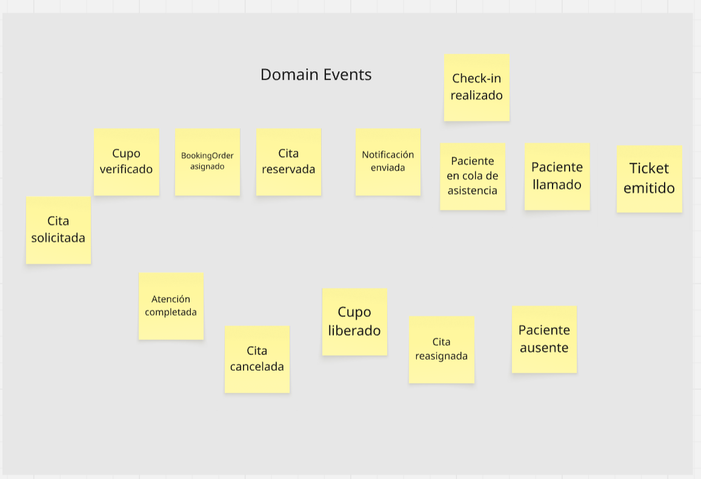

**2. Organización cronológica de los eventos:** Luego, los eventos fueron ordenados según el momento en que ocurren dentro del proceso real de atención, permitiendo entender la secuencia lógica de las operaciones desde la pre-atención hasta el cierre de la consulta. En esta línea de tiempo se distingue que el evento `BookingOrder asignado` ocurre inmediatamente después de `Cita reservada`, mientras que `Paciente en cola de asistencia` y `Paciente llamado` ocurren después de `Check-in realizado`, evidenciando que ambas colas operan en momentos distintos del flujo.

  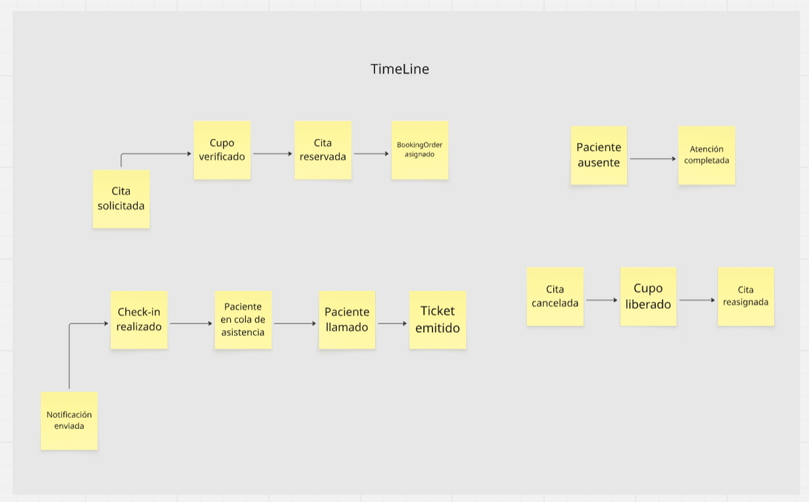

**3. Identificación de Pain Points y Pivotal Points:** En esta etapa se marcaron los **pain points**, es decir, las posibles dificultades o cuellos de botella del proceso actual, y los **pivotal points**, que representan los eventos más críticos o de cambio dentro del flujo. Se identificaron como puntos críticos la **asignación del `bookingOrder`** (que determina la prioridad en la lista de espera) y el **timeout de la waitlist** (que define el paso al siguiente paciente cuando nadie responde una propuesta de cupo liberado). Asimismo, se incorporaron como read models la **cola de asistencia** y la **lista de espera**.

  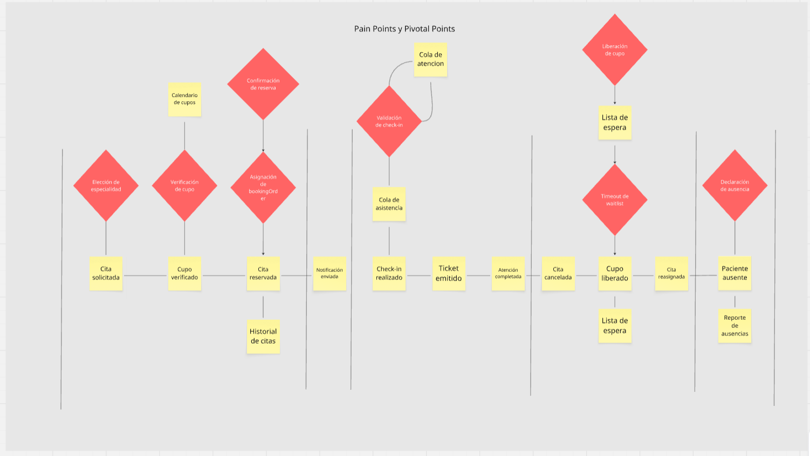

**4. Incorporación de Commands, Policies y Read Models:** Finalmente, se agregaron los **commands** (acciones que disparan eventos), las **policies** (reglas de negocio que responden a eventos) y los **read models** (consultas de información). Esto permitió obtener una visión más completa y técnica del dominio de SaludYa. En esta fase se incorporaron los commands `Asignar bookingOrder`, `Agregar a cola de asistencia` y `Llamar siguiente paciente`; las policies `Cuando se libera un cupo, notificar al paciente con menor bookingOrder` y `Cuando expira el timeout, pasar al siguiente paciente de la lista`; y los read models `Cola de asistencia` y `Lista de espera`.

  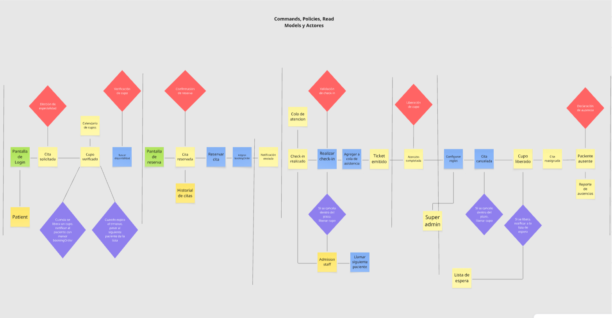

#### 2.5.1.1. Candidate Context Discovery

A partir del modelado realizado en el EventStorming, se llevó a cabo una sesión de Candidate Context Discovery con el objetivo de identificar los bounded contexts dentro del dominio de SaludYa. Para ello, se aplicó la técnica **"look-for-pivotal-events"**, que permitió detectar los eventos clave del negocio que marcan transiciones de estado y delimitan responsabilidades entre diferentes partes del proceso.

Durante la sesión, se reorganizó la línea de tiempo del EventStorming para agrupar los elementos relacionados —eventos, comandos, políticas y read models— en torno a sus respectivos aggregates. Esto facilitó distinguir los límites naturales entre los contextos y definir con mayor claridad las interacciones entre ellos.

Es importante precisar que **`Attendance Queue` no constituye un bounded context**, sino un **agregado dentro del bounded context `Arrival & QR Check-in`**. Su responsabilidad se limita a ordenar la atención presencial del día según el timestamp de check-in, y su ciclo de vida es efímero (por día y por franja horaria). De manera análoga, **`Booking Order` no constituye un bounded context**, sino un **atributo de `Appointment` dentro del bounded context `Appointments & Booking`**, cuyo propósito es determinar la prioridad de reasignación en la lista de espera dinámica. Un bounded context se justifica únicamente cuando existe lenguaje propio, reglas de negocio complejas y autonomía de modelo; ninguna de las dos colas cumple esas condiciones por separado.

Como resultado del proceso, se identificaron **cinco bounded contexts candidatos** para el dominio de SaludYa:

| # | Bounded Context | Propósito | Eventos clave |
| :--- | :--- | :--- | :--- |
| 1 | **Identity & Access Management** | Gestionar el registro, autenticación y roles de pacientes y personal administrativo. | Cuenta creada, Sesión iniciada, Menor vinculado |
| 2 | **Appointments & Booking** | Gestionar la búsqueda de disponibilidad, reserva y cancelación de citas médicas. Incluye el atributo `Booking Order`, que asigna un número secuencial a cada cita reservada. | Cita solicitada, Cupo verificado, Cita reservada, Booking Order asignado, Cita cancelada |
| 3 | **Dynamic Waitlist & Reassignment** | Gestionar la lista de espera dinámica y la reasignación de cupos liberados, ofreciendo las propuestas en orden de `bookingOrder`. | Cupo liberado, Cita reasignada, Reasignación expirada |
| 4 | **Arrival & QR Check-in** | Validar la presencia presencial del paciente, emitir el ticket digital de atención y gestionar la `Attendance Queue`. | Check-in realizado, Paciente en cola de asistencia, Paciente llamado, Ticket emitido, Paciente ausente |
| 5 | **Hospital Operations & Configuration** | Configurar parámetros operativos del establecimiento y monitorear la operación diaria. | Reglas actualizadas, Reporte generado |

A continuación se detalla, para cada bounded context, los elementos incorporados en la sesión de Candidate Context Discovery:

- **`Appointments & Booking`:** se incorpora el atributo `Booking Order` y la regla de negocio *"Toda cita reservada tiene un `bookingOrder` único por especialidad, fecha y establecimiento"*.
- **`Dynamic Waitlist & Reassignment`:** se incorporan los conceptos `Waitlist Entry` (entrada ordenada por `bookingOrder`), `Cascade Reassignment` (reasignación en cascada si nadie acepta) y `Waitlist Response Timeout` (tiempo máximo para aceptar o rechazar). La policy de reasignación se define como *"Reasignación por orden de `bookingOrder`"*.
- **`Arrival & QR Check-in`:** se incorporan los conceptos `Attendance Queue` (cola virtual ordenada por `checkInTimestamp`) y `Queue Entry` (entrada individual en la cola de asistencia). La policy asociada se define como *"Cola de asistencia ordenada por `checkInTimestamp`"*.
- **`Hospital Operations & Configuration`:** se incorpora el parámetro `waitlistResponseTimeout` (y opcionalmente `cascadeWaitlistEnabled` y `maxCapacityPerSlot`) como parte de las reglas operativas configurables por el establecimiento.

  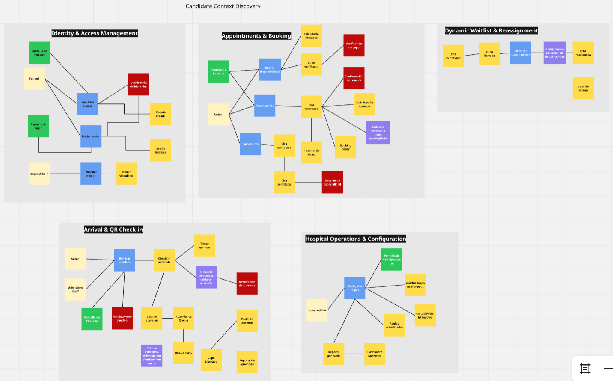

#### 2.5.1.2. Domain Message Flows Modeling

En esta sección se presentan los principales flujos de colaboración entre los bounded contexts identificados. Para ello, se utilizó la técnica de visualización **Domain Storytelling**, la cual permite describir de forma narrativa cómo los diferentes sistemas del dominio interactúan para atender los casos de uso clave del negocio. Los flujos reflejan la existencia de las dos colas complementarias del dominio: la **cola por pedido de cita** (ordenada por `bookingOrder`) y la **cola de asistencia** (ordenada por `checkInTimestamp`).

**Flow 1: Registro y autenticación de paciente**

El paciente solicita crear una nueva cuenta en el sistema ingresando su DNI y datos de contacto. El **Identity & Access Management** valida la información contra el servicio externo de RENIEC y registra el nuevo perfil verificado. Una vez completado el registro, el sistema emite el evento `Cuenta creada`. Posteriormente, cuando el paciente inicia sesión, el sistema valida sus credenciales y emite el evento `Sesión iniciada`. Finalmente, el paciente puede vincular a un menor de edad ingresando el DNI del niño, lo que genera el evento `Menor vinculado`.

| Paso | Actor | Acción | Objeto de trabajo | Bounded Context |
| :--- | :--- | :--- | :--- | :--- |
| 1 | Patient | Solicita registro | DNI y datos de contacto | Identity & Access Management |
| 2 | Identity & Access Management | Valida identidad | RENIEC API | Identity & Access Management |
| 3 | Identity & Access Management | Crea cuenta | Cuenta creada | Identity & Access Management |
| 4 | Patient | Inicia sesión | Credenciales | Identity & Access Management |
| 5 | Identity & Access Management | Valida sesión | Sesión iniciada | Identity & Access Management |
| 6 | Patient | Vincula menor | DNI del menor | Identity & Access Management |
| 7 | Identity & Access Management | Registra vínculo | Menor vinculado | Identity & Access Management |

**Flow 2: Reserva de cita médica para el titular**

El paciente inicia sesión en la aplicación y selecciona una especialidad médica. El **Appointments & Booking** consulta el `Calendario de cupos` y verifica la disponibilidad de horarios. El paciente selecciona un `Time Slot` disponible y confirma la reserva. El **Appointments & Booking** registra la cita, asigna un `bookingOrder` único por especialidad, fecha y establecimiento, emite el evento `Cita reservada` y envía una notificación de confirmación al paciente. Si no hay cupo disponible, el sistema registra al paciente en la lista de espera con su respectivo `bookingOrder`.

| Paso | Actor | Acción | Objeto de trabajo | Bounded Context |
| :--- | :--- | :--- | :--- | :--- |
| 1 | Patient | Inicia sesión | Credenciales | Identity & Access Management |
| 2 | Patient | Selecciona especialidad | Especialidad médica | Appointments & Booking |
| 3 | Appointments & Booking | Consulta disponibilidad | Calendario de cupos | Appointments & Booking |
| 4 | Appointments & Booking | Verifica cupo | Cupo verificado | Appointments & Booking |
| 5 | Patient | Confirma reserva | Time Slot | Appointments & Booking |
| 6 | Appointments & Booking | Registra cita | Cita reservada | Appointments & Booking |
| 7 | Appointments & Booking | Asigna bookingOrder | Booking Order asignado | Appointments & Booking |
| 8 | Appointments & Booking | Notifica confirmación | Notificación enviada | Appointments & Booking |
| 9 | Appointments & Booking | Registra en lista de espera (si no hay cupo) | Waitlist Entry | Dynamic Waitlist & Reassignment |

**Flow 3: Reserva de cita médica para un menor a cargo**

El paciente titular inicia sesión y selecciona a un menor previamente vinculado a su cuenta. El **Appointments & Booking** consulta el `Calendario de cupos` para la especialidad pediátrica. El paciente confirma la reserva del `Time Slot` seleccionado. El **Appointments & Booking** registra la cita vinculando al menor como beneficiario y al titular como adulto responsable, asigna el `bookingOrder` correspondiente, emite el evento `Cita reservada` y notifica al titular.

| Paso | Actor | Acción | Objeto de trabajo | Bounded Context |
| :--- | :--- | :--- | :--- | :--- |
| 1 | Patient | Inicia sesión | Credenciales | Identity & Access Management |
| 2 | Patient | Selecciona menor | Menor vinculado | Identity & Access Management |
| 3 | Patient | Selecciona especialidad | Especialidad pediátrica | Appointments & Booking |
| 4 | Appointments & Booking | Consulta disponibilidad | Calendario de cupos | Appointments & Booking |
| 5 | Patient | Confirma reserva | Time Slot para menor | Appointments & Booking |
| 6 | Appointments & Booking | Registra cita | Cita reservada (menor) | Appointments & Booking |
| 7 | Appointments & Booking | Asigna bookingOrder | Booking Order asignado | Appointments & Booking |
| 8 | Appointments & Booking | Notifica confirmación | Notificación enviada | Appointments & Booking |

**Flow 4: Check-in presencial mediante código QR**

El paciente llega al establecimiento de salud con su cita programada. El **Arrival & QR Check-in** valida el código QR escaneado, verificando que la cita se encuentre dentro de la ventana de tolerancia configurada. Si la validación es exitosa, el sistema emite el evento `Check-in realizado`, crea un `Queue Entry` en la `Attendance Queue` del `Time Slot` correspondiente, y calcula la posición del paciente en función de su `checkInTimestamp`. Finalmente, se emite el ticket digital con el identificador de llamado, la posición en la cola de asistencia y el tiempo estimado de espera, y se notifica al paciente que ha sido ingresado a la cola.

| Paso | Actor | Acción | Objeto de trabajo | Bounded Context |
| :--- | :--- | :--- | :--- | :--- |
| 1 | Patient | Llega al establecimiento | — | — |
| 2 | Patient | Escanea código QR | Código QR | Arrival & QR Check-in |
| 3 | Arrival & QR Check-in | Valida tolerancia | Cita y tiempo | Arrival & QR Check-in |
| 4 | Arrival & QR Check-in | Registra presencia | Check-in realizado | Arrival & QR Check-in |
| 5 | Arrival & QR Check-in | Crea entrada en cola | Queue Entry | Arrival & QR Check-in |
| 6 | Arrival & QR Check-in | Calcula posición | Posición en Attendance Queue | Arrival & QR Check-in |
| 7 | Arrival & QR Check-in | Emite ticket | Ticket emitido | Arrival & QR Check-in |
| 8 | Arrival & QR Check-in | Notifica posición | Notificación enviada | Arrival & QR Check-in |

**Flow 5: Cancelación de cita y liberación de cupo**

El paciente accede al historial de sus citas y cancela una cita activa. El **Appointments & Booking** verifica que la cancelación se realice dentro del plazo mínimo configurado. El sistema registra el evento `Cita cancelada` y transfiere el cupo al **Dynamic Waitlist & Reassignment**. Este emite el evento `Cupo liberado` y notifica al paciente con el **menor `bookingOrder`** de la `Lista de espera` correspondiente. Si el paciente acepta la propuesta dentro del `waitlistResponseTimeout`, se registra el evento `Cita reasignada`. Si rechaza o no responde, se notifica al siguiente paciente con menor `bookingOrder`. Si nadie acepta y `cascadeWaitlistEnabled` está activo, el cupo se ofrece a los pacientes del siguiente `Time Slot` de la misma especialidad y fecha.

| Paso | Actor | Acción | Objeto de trabajo | Bounded Context |
| :--- | :--- | :--- | :--- | :--- |
| 1 | Patient | Cancela cita | Cita activa | Appointments & Booking |
| 2 | Appointments & Booking | Verifica plazo | Reglas de cancelación | Appointments & Booking |
| 3 | Appointments & Booking | Registra cancelación | Cita cancelada | Appointments & Booking |
| 4 | Appointments & Booking | Libera cupo | Cupo liberado | Dynamic Waitlist & Reassignment |
| 5 | Dynamic Waitlist & Reassignment | Notifica al menor bookingOrder | Waitlist Offer Sent | Dynamic Waitlist & Reassignment |
| 6 | Patient | Acepta propuesta | Waitlist Offer Accepted | Dynamic Waitlist & Reassignment |
| 7 | Dynamic Waitlist & Reassignment | Registra reasignación | Cita reasignada | Dynamic Waitlist & Reassignment |
| 8 | Dynamic Waitlist & Reassignment | Expira propuesta (si no responde) | Waitlist Offer Expired | Dynamic Waitlist & Reassignment |
| 9 | Dynamic Waitlist & Reassignment | Activa cascada (si nadie acepta) | Cascade Reassignment | Dynamic Waitlist & Reassignment |

**Flow 6: Declaración de ausencia por vencimiento de tolerancia**

El personal de admisión llama al paciente a consultorio, pero este no se presenta. El **Arrival & QR Check-in** verifica que el tiempo de tolerancia ha expirado sin registrar el ingreso. El sistema emite el evento `Paciente ausente` y registra el turno como perdido. El **Dynamic Waitlist & Reassignment** libera el cupo y notifica al paciente con el **menor `bookingOrder`** de la lista de espera, iniciando el protocolo de reasignación. Si nadie acepta dentro del `waitlistResponseTimeout`, se activa la cascada si corresponde.

| Paso | Actor | Acción | Objeto de trabajo | Bounded Context |
| :--- | :--- | :--- | :--- | :--- |
| 1 | Admission Staff | Llama al paciente | — | Arrival & QR Check-in |
| 2 | Arrival & QR Check-in | Verifica tolerancia | Tiempo de tolerancia | Arrival & QR Check-in |
| 3 | Arrival & QR Check-in | Declara ausencia | Paciente ausente | Arrival & QR Check-in |
| 4 | Arrival & QR Check-in | Libera cupo | Cupo liberado | Dynamic Waitlist & Reassignment |
| 5 | Dynamic Waitlist & Reassignment | Notifica al menor bookingOrder | Waitlist Offer Sent | Dynamic Waitlist & Reassignment |
| 6 | Patient | Acepta propuesta | Waitlist Offer Accepted | Dynamic Waitlist & Reassignment |
| 7 | Dynamic Waitlist & Reassignment | Registra reasignación | Cita reasignada | Dynamic Waitlist & Reassignment |

**Flow 7: Configuración operativa del establecimiento**

El administrador accede al panel de configuración de la aplicación. El **Hospital Operations & Configuration** permite parametrizar los intervalos de atención, la ventana de tolerancia para check-in, el margen de cancelación, los horarios de corte, el `waitlistResponseTimeout`, el `cascadeWaitlistEnabled` y la `maxCapacityPerSlot`. El sistema emite el evento `Reglas actualizadas` y aplica los nuevos parámetros a los bloques y turnos generados a partir de ese momento. Finalmente, el administrador puede consultar el `Dashboard operativo` con indicadores de ocupación, ausentismo y demanda.

| Paso | Actor | Acción | Objeto de trabajo | Bounded Context |
| :--- | :--- | :--- | :--- | :--- |
| 1 | Super Admin | Accede a configuración | Panel de administración | Hospital Operations & Configuration |
| 2 | Super Admin | Parametriza reglas | Intervalos, tolerancias, waitlistResponseTimeout, cascadeWaitlistEnabled | Hospital Operations & Configuration |
| 3 | Hospital Operations & Configuration | Actualiza parámetros | Reglas actualizadas | Hospital Operations & Configuration |
| 4 | Hospital Operations & Configuration | Aplica cambios | Nuevos bloques y turnos | Hospital Operations & Configuration |
| 5 | Super Admin | Consulta métricas | Dashboard operativo | Hospital Operations & Configuration |

Estos flujos permiten visualizar la colaboración entre los bounded contexts, asegurando una comunicación clara entre sistemas y un entendimiento compartido de los procesos del dominio de SaludYa. En particular, se evidencia que la **cola por pedido de cita** se gestiona como atributo dentro de `Appointments & Booking` y se consume desde `Dynamic Waitlist & Reassignment` para determinar la prioridad de reasignación, mientras que la **cola de asistencia** se gestiona como agregado dentro de `Arrival & QR Check-in` para ordenar el llamado a consultorio el día de la cita.

#### 2.5.1.3. Bounded Context Canvases

Para la presente sección, elaboramos el Bounded Context Canvas de cada uno de los Bounded Context candidatos que identificamos. Aplicamos el modelo versión 5 propuesto por el Domain Driven Design Group.
En cada uno de los canvases registramos las secciones específicas como el Context Overview Definition, Business Rules Distillation y el Ubiquitous Language, identificando claramente el tipo de Bounded Context y sus interacciones de entrada y salida con otros contextos.

## Bounded Context Canvas – Identity & Access Management

**Context Overview Definition**

Se encarga del registro, autenticación, vinculación de menores y gestión de roles de los usuarios en la aplicación SaludYa. Permite validar la identidad de los pacientes y el personal administrativo antes de acceder a los módulos principales del sistema.

**Capability Analysis**

- Registro de nuevos pacientes con verificación de DNI.
- Inicio y cierre de sesión por rol.
- Recuperación de contraseña.
- Edición de perfil de usuario.
- Vinculación de menores de edad a la cuenta del titular.
- Alta de personal administrativo por parte del Super Admin.

**Capability Layering**

- Capa de presentación: Pantallas móviles de registro, login y perfil.
- Capa de dominio: Lógica de autenticación, validación de identidad y gestión de roles.
- Capa de infraestructura: Integración con la API externa de RENIEC y con el servicio de autenticación JWT.

**Dependencies Capture**

Depende del servicio externo de RENIEC para la validación de identidad y del sistema de notificaciones para confirmar el registro, la recuperación de contraseña y la vinculación de menores.

**Design Critique**

El contexto está bien delimitado y desacoplado del resto de bounded contexts. Solo maneja autenticación e identidad, sin interferir en la lógica de reservas o atención. La integración con RENIEC y la gestión de roles por tipo de usuario son sus principales fortalezas.

| **Sección** | **Contenido** |
| :--- | :--- |
| **Name** | Identity & Access Management |
| **Purpose** | Se encarga del registro, autenticación, vinculación de menores y gestión de roles de los usuarios en la aplicación SaludYa. Permite validar la identidad de los pacientes y el personal administrativo antes de acceder a los módulos principales del sistema. |
| **Strategic Classification** | **Domain:** Generic · **Business Model:** Engagement Creator · **Evolution:** Product · **Role Type:** Execution Context |
| **Domain Roles** | Execution Context |
| **Inbound Communication** | **Collaborator:** RENIEC API · **Messages:** Validación de identidad por DNI   **Collaborator:** Patient · **Messages:** Solicitud de registro y login   **Collaborator:** Super Admin · **Messages:** Alta de personal administrativo |
| **Outbound Communication** | **Messages:** Usuario autenticado · **Collaborator:** Appointments & Booking, Arrival & QR Check-in   **Messages:** Cuenta creada · **Collaborator:** Patient   **Messages:** Menor vinculado · **Collaborator:** Appointments & Booking   **Messages:** Sesión iniciada · **Collaborator:** Patient |
| **Ubiquitous Language** | **Cuenta:** Perfil verificado de un usuario en el sistema.   **Rol:** Tipo de usuario: Patient, Admission Staff o Super Admin.   **Menor vinculado:** Paciente menor de edad asociado a la cuenta de un adulto responsable.   **Verificación de identidad:** Validación de los datos del usuario contra el servicio externo de RENIEC.   **Sesión:** Periodo de acceso autenticado a la aplicación. |
| **Business Decisions** | Toda cuenta debe estar verificada con un DNI válido antes de permitir el acceso.   Un menor solo puede ser vinculado a un adulto responsable registrado.   Las credenciales se manejan con tokens JWT con expiración controlada.   El correo registrado debe ser único en el sistema. |
| **Assumptions** | Los usuarios cuentan con un DNI válido y vigente.   El servicio externo de RENIEC está disponible para la validación. |
| **Verification Metrics** | Tasa de registro exitoso de nuevos pacientes.   Porcentaje de cuentas verificadas correctamente por DNI.   Tiempo promedio de autenticación. |
| **Open Questions** | ¿Se implementará autenticación biométrica en futuras versiones?   ¿Cómo se gestionará la recuperación de cuenta en caso de pérdida del correo? |

## Bounded Context Canvas – Appointments & Booking

**Context Overview Definition**

Gestiona la búsqueda de disponibilidad, reserva y cancelación de citas médicas en establecimientos públicos de salud. Permite a los pacientes reservar citas para sí mismos o para menores a cargo, respetando los parámetros operativos configurados por cada establecimiento. Incluye el atributo `Booking Order`, que asigna un número secuencial a cada cita reservada y determina la prioridad en la lista de espera dinámica.

**Capability Analysis**

- Consulta de disponibilidad en tiempo real.
- Reserva de citas para el titular o para un menor vinculado.
- Asignación de `bookingOrder` a cada cita reservada.
- Cancelación de citas dentro del plazo permitido.
- Notificación de confirmación de reserva.
- Gestión del historial de citas.

**Capability Layering**

- Capa de presentación: Pantallas de búsqueda, reserva e historial de citas.
- Capa de dominio: Lógica de asignación de cupos, asignación de `bookingOrder`, validación de solapamientos y cancelaciones.
- Capa de infraestructura: Integración con la base de datos de agendas y con el sistema de notificaciones.

**Dependencies Capture**

Depende de Identity & Access Management para validar la sesión del usuario, de Hospital Operations & Configuration para conocer los parámetros operativos, y del sistema de notificaciones para confirmar reservas y cancelaciones.

**Design Critique**

El contexto concentra el mayor valor de negocio del sistema y tiene un ciclo de vida bien definido. Su principal desafío es la gestión concurrente de cupos y la prevención de solapamientos de horario. La incorporación del `bookingOrder` como atributo le permite alimentar al contexto `Dynamic Waitlist & Reassignment` con un criterio de prioridad objetivo y trazable. Está preparado para escalar hacia reprogramación automática y sugerencias inteligentes de horarios.

| **Sección** | **Contenido** |
| :--- | :--- |
| **Name** | Appointments & Booking |
| **Purpose** | Gestiona la búsqueda de disponibilidad, reserva y cancelación de citas médicas en establecimientos públicos de salud. Permite a los pacientes reservar citas para sí mismos o para menores a cargo, respetando los parámetros operativos configurados por cada establecimiento. Incluye el atributo `Booking Order`. |
| **Strategic Classification** | **Domain:** Core · **Business Model:** Engagement Creator · **Evolution:** Product · **Role Type:** Execution Context |
| **Domain Roles** | Execution Context |
| **Inbound Communication** | **Collaborator:** Identity & Access Management · **Messages:** Usuario autenticado   **Collaborator:** Patient · **Messages:** Búsqueda de disponibilidad y reserva   **Collaborator:** Hospital Operations & Configuration · **Messages:** Parámetros operativos |
| **Outbound Communication** | **Messages:** Cita reservada (con `bookingOrder`) · **Collaborator:** Patient, Dynamic Waitlist & Reassignment   **Messages:** Cita cancelada · **Collaborator:** Dynamic Waitlist & Reassignment   **Messages:** Notificación enviada · **Collaborator:** Patient   **Messages:** Cupo verificado · **Collaborator:** Patient |
| **Ubiquitous Language** | **Time Slot:** Intervalo de tiempo asignado a una especialidad para la atención de un único paciente.   **Booking / Appointment:** Reserva de un cupo médico realizada por el paciente.   **Booking Order:** Número secuencial que representa el orden en que se solicitó una cita. Determina la prioridad en la lista de espera.   **Specialty Catalog:** Catálogo de servicios médicos publicados por el establecimiento.   **Quota Available:** Cupos disponibles en un intervalo de tiempo.   **Tolerancia de cancelación:** Tiempo mínimo antes de la cita en el que se permite cancelar. |
| **Business Decisions** | Toda cita reservada tiene un `bookingOrder` único por especialidad, fecha y establecimiento.   No se permite reservar dos citas en el mismo intervalo de tiempo para el mismo paciente.   Las cancelaciones solo se permiten dentro del plazo configurado por el hospital.   Un menor solo puede tener una cita activa en el mismo intervalo.   La confirmación de reserva se envía al correo del titular, incluso si la cita es para un menor. |
| **Assumptions** | Los establecimientos publican su catálogo de especialidades y cupos en el sistema.   El paciente cuenta con un dispositivo con acceso a internet para reservar. |
| **Verification Metrics** | Número de citas reservadas por día.   Tasa de cancelación dentro del plazo permitido.   Porcentaje de reservas realizadas sin asistencia técnica. |
| **Open Questions** | ¿Se permitirá reprogramación automática de citas en futuras versiones?   ¿Cómo se gestionará la sobreventa de cupos en caso de error del sistema? |

## Bounded Context Canvas – Dynamic Waitlist & Reassignment

**Context Overview Definition**

Gestiona la lista de espera dinámica del sistema, reasigna los cupos liberados por cancelaciones o ausencias, y notifica oportunidades de adelanto a los pacientes en espera. La reasignación se ofrece por orden de `bookingOrder`, es decir, al paciente que reservó primero. Si nadie acepta dentro del `waitlistResponseTimeout`, y `cascadeWaitlistEnabled` está activo, el cupo pasa a los pacientes del siguiente `Time Slot` de la misma especialidad y fecha.

**Capability Analysis**

- Registro de pacientes en lista de espera por especialidad.
- Detección de cupos liberados por cancelación o ausencia.
- Envío de propuestas de adelanto al paciente con menor `bookingOrder`.
- Reasignación automática de cupos aceptados.
- Gestión de expiración de propuestas no respondidas.
- Activación de la cascada de reasignación si nadie acepta.

**Capability Layering**

- Capa de presentación: Notificaciones push y en pantalla dentro de la app móvil.
- Capa de dominio: Lógica de priorización por `bookingOrder`, temporización y asignación de cupos.
- Capa de infraestructura: Integración con el sistema de notificaciones y con la agenda médica.

**Dependencies Capture**

Depende de Appointments & Booking para recibir los eventos de cancelación, de Arrival & QR Check-in para recibir los eventos de ausencia, y del sistema de notificaciones para enviar las propuestas a los pacientes en espera.

**Design Critique**

El contexto está bien delimitado y su lógica de reasignación es altamente automatizable. El uso del `bookingOrder` como criterio de prioridad le otorga objetividad y trazabilidad al proceso. La gestión de expiración por tiempo, el control de respuestas concurrentes y la activación de la cascada son sus principales desafíos técnicos. Su diseño desacoplado permite agregar políticas de priorización (por gravedad, antigüedad o vulnerabilidad) en futuras versiones.

| **Sección** | **Contenido** |
| :--- | :--- |
| **Name** | Dynamic Waitlist & Reassignment |
| **Purpose** | Gestiona la lista de espera dinámica del sistema, reasigna los cupos liberados por cancelaciones o ausencias, y notifica oportunidades de adelanto a los pacientes en espera. La reasignación se ofrece por orden de `bookingOrder`. Si nadie acepta dentro del `waitlistResponseTimeout`, y `cascadeWaitlistEnabled` está activo, el cupo pasa a los pacientes del siguiente `Time Slot` de la misma especialidad y fecha. |
| **Strategic Classification** | **Domain:** Core · **Business Model:** Engagement Creator · **Evolution:** Product · **Role Type:** Execution Context |
| **Domain Roles** | Execution Context |
| **Inbound Communication** | **Collaborator:** Appointments & Booking · **Messages:** Cita cancelada   **Collaborator:** Arrival & QR Check-in · **Messages:** Paciente ausente   **Collaborator:** Patient · **Messages:** Aceptación o rechazo de propuesta |
| **Outbound Communication** | **Messages:** Waitlist Offer Sent · **Collaborator:** Patient en lista de espera   **Messages:** Waitlist Offer Accepted · **Collaborator:** Appointments & Booking, Patient   **Messages:** Waitlist Offer Expired · **Collaborator:** Patient   **Messages:** Cascade Reassignment · **Collaborator:** Appointments & Booking |
| **Ubiquitous Language** | **Dynamic Waitlist:** Mecanismo automatizado que gestiona las solicitudes en cola.   **Waitlist Entry:** Entrada en la lista de espera dinámica, ordenada por `bookingOrder`.   **Cascade Reassignment:** Reasignación en cascada: si nadie en la lista de espera acepta, el cupo pasa al siguiente `Time Slot` de la misma especialidad y fecha.   **Waitlist Response Timeout:** Tiempo máximo para aceptar o rechazar una propuesta de cupo liberado.   **Propuesta de adelanto:** Oferta de un cupo liberado enviada a un paciente en espera.   **Cupo liberado:** Turno disponible tras una cancelación o ausencia.   **Reasignación:** Acción de asignar el cupo liberado a otro paciente. |
| **Business Decisions** | La reasignación se ofrece por orden de `bookingOrder`, no por hora de solicitud.   Toda propuesta de adelanto expira automáticamente tras el `waitlistResponseTimeout` configurado.   Si dos pacientes aceptan el mismo cupo, se asigna al primero que respondió.   El paciente que rechaza una propuesta conserva su cita original.   Si nadie en la lista de espera acepta y `cascadeWaitlistEnabled` está activo, el cupo se ofrece a los pacientes del siguiente `Time Slot` de la misma especialidad y fecha.   La cascada solo aplica dentro del mismo día y especialidad. |
| **Assumptions** | Los pacientes en lista de espera tienen configurado al menos un canal de notificación activo.   El sistema puede procesar múltiples respuestas concurrentes. |
| **Verification Metrics** | Porcentaje de cupos liberados reasignados exitosamente.   Tiempo promedio de respuesta de los pacientes ante una propuesta.   Tasa de aceptación de propuestas de adelanto.   Porcentaje de cascadas activadas exitosamente. |
| **Open Questions** | ¿Se implementará un sistema de priorización por gravedad del caso?   ¿Cómo se gestionará la reasignación en caso de fallo del servicio de notificaciones? |

## Bounded Context Canvas – Arrival & QR Check-in

**Context Overview Definition**

Valida la presencia presencial del paciente en el establecimiento de salud mediante el escaneo de un código QR, gestiona la `Attendance Queue` (cola virtual ordenada por `checkInTimestamp`), emite el ticket digital de atención y declara la ausencia del paciente cuando excede el tiempo de tolerancia configurado. La `Attendance Queue` es un agregado interno de este contexto, no un bounded context independiente.

**Capability Analysis**

- Validación del código QR al llegar al establecimiento.
- Verificación de la ventana de tolerancia.
- Creación de un `Queue Entry` en la `Attendance Queue` del `Time Slot`.
- Cálculo de la posición del paciente según su `checkInTimestamp`.
- Emisión del ticket digital con posición en la cola.
- Actualización de la cola de atención.
- Declaración de ausencia por vencimiento de tolerancia.

**Capability Layering**

- Capa de presentación: Pantalla de check-in, visualización del ticket digital y consulta de posición en la cola.
- Capa de dominio: Lógica de validación temporal, cálculo de posición, declaración de ausencia y control de tolerancia.
- Capa de infraestructura: Integración con el lector de códigos QR y con el servicio de generación de tickets.

**Dependencies Capture**

Depende de Identity & Access Management para validar la sesión del paciente, de Appointments & Booking para verificar la existencia de la cita, y del sistema de notificaciones para informar al paciente sobre el estado de su atención.

**Design Critique**

El contexto tiene un alcance claro y su flujo principal (validar → crear Queue Entry → calcular posición → emitir ticket → actualizar cola) es sencillo y bien delimitado. La `Attendance Queue` se modela como agregado interno, evitando la creación innecesaria de un bounded context. Su principal desafío es la precisión del control de tolerancia y la integración con dispositivos sin smartphone. El diseño permite agregar mecanismos alternativos de check-in (reconocimiento facial, código de barras) en el futuro.

| **Sección** | **Contenido** |
| :--- | :--- |
| **Name** | Arrival & QR Check-in |
| **Purpose** | Valida la presencia presencial del paciente en el establecimiento de salud mediante el escaneo de un código QR, gestiona la `Attendance Queue` (cola virtual ordenada por `checkInTimestamp`), emite el ticket digital de atención y declara la ausencia del paciente cuando excede el tiempo de tolerancia configurado. |
| **Strategic Classification** | **Domain:** Core · **Business Model:** Engagement Creator · **Evolution:** Product · **Role Type:** Execution Context |
| **Domain Roles** | Execution Context |
| **Inbound Communication** | **Collaborator:** Identity & Access Management · **Messages:** Usuario autenticado   **Collaborator:** Appointments & Booking · **Messages:** Cita reservada   **Collaborator:** Patient · **Messages:** Escaneo de código QR   **Collaborator:** Admission Staff · **Messages:** Llamado a consultorio |
| **Outbound Communication** | **Messages:** CheckInCompleted (incluye `attendanceQueueId` y `position`) · **Collaborator:** Appointments & Booking, Patient   **Messages:** Ticket emitido · **Collaborator:** Patient   **Messages:** Paciente ausente · **Collaborator:** Dynamic Waitlist & Reassignment   **Messages:** Cola de atención · **Collaborator:** Admission Staff |
| **Ubiquitous Language** | **Check-in:** Validación de asistencia presencial mediante código QR.   **Ventana de tolerancia:** Intervalo de tiempo configurado para permitir el check-in.   **Attendance Queue:** Cola virtual dentro de un `Time Slot` que ordena a los pacientes según su timestamp de check-in.   **Queue Entry:** Entrada individual en la cola de asistencia. Contiene `appointmentId`, `checkInTimestamp`, `position`, `status`.   **Ticket digital:** Comprobante con identificador de llamado, posición en la cola y datos de atención.   **Cola de atención:** Lista ordenada de pacientes presentes en el establecimiento.   **Ausencia:** Estado del paciente que no se presentó dentro de la tolerancia. |
| **Business Decisions** | El check-in solo es válido dentro de la ventana de tolerancia configurada por el hospital.   La cola de asistencia se ordena por `checkInTimestamp`.   Un paciente no puede tener dos `QueueEntry` activas en la misma `AttendanceQueue`.   Si un paciente es marcado como `Absent`, su posición se elimina y los demás se reordenan.   Un paciente que excede la tolerancia es declarado ausente automáticamente.   El ticket digital solo se emite si el check-in fue confirmado y muestra la posición en la cola de asistencia. |
| **Assumptions** | El establecimiento cuenta con códigos QR visibles en la recepción.   El paciente porta un dispositivo móvil con la aplicación instalada. |
| **Verification Metrics** | Porcentaje de check-ins exitosos dentro de la tolerancia.   Tasa de ausencias registradas por día.   Tiempo promedio entre check-in y llamado a consultorio. |
| **Open Questions** | ¿Se implementará check-in mediante reconocimiento facial?   ¿Cómo se gestionará el check-in de pacientes sin smartphone? |

## Bounded Context Canvas – Hospital Operations & Configuration

**Context Overview Definition**

Configura los parámetros operativos de cada establecimiento de salud (intervalos de atención, tolerancias, plazos de cancelación, `waitlistResponseTimeout`, `cascadeWaitlistEnabled`, `maxCapacityPerSlot`) y proporciona dashboards y reportes para monitorear la operación diaria, el ausentismo y la demanda de servicios.

**Capability Analysis**

- Configuración de intervalos y fraccionamientos de atención.
- Definición de ventanas de tolerancia para check-in.
- Configuración de plazos y márgenes operativos (cancelación, reserva, adelanto).
- Configuración de `waitlistResponseTimeout` y `cascadeWaitlistEnabled`.
- Configuración de `maxCapacityPerSlot`.
- Generación de reportes operativos.
- Visualización de dashboards de ocupación y ausentismo.
- Aplicación de nuevas reglas a bloques y turnos futuros.

**Capability Layering**

- Capa de presentación: Panel de configuración y dashboard operativo.
- Capa de dominio: Lógica de validación de parámetros y aplicación de reglas operativas.
- Capa de infraestructura: Integración con la base de datos de configuración y con el motor de reportes.

**Dependencies Capture**

Depende de Identity & Access Management para autorizar al Super Admin, y recibe datos desde Appointments & Booking y Arrival & QR Check-in para alimentar los dashboards y reportes.

**Design Critique**

El contexto cumple un rol de soporte esencial para el resto del sistema. Su diseño desacoplado permite que cada establecimiento configure sus propias reglas sin afectar a los demás. La incorporación de parámetros como `waitlistResponseTimeout` y `cascadeWaitlistEnabled` le permite controlar el comportamiento de la lista de espera dinámica sin acoplarse a su lógica interna. Su principal desafío es la preservación de citas ya confirmadas cuando se modifica la configuración operativa. Su evolución natural apunta hacia analítica predictiva y reportes comparativos entre establecimientos.

| **Sección** | **Contenido** |
| :--- | :--- |
| **Name** | Hospital Operations & Configuration |
| **Purpose** | Configura los parámetros operativos de cada establecimiento de salud (intervalos de atención, tolerancias, plazos de cancelación, `waitlistResponseTimeout`, `cascadeWaitlistEnabled`, `maxCapacityPerSlot`) y proporciona dashboards y reportes para monitorear la operación diaria, el ausentismo y la demanda de servicios. |
| **Strategic Classification** | **Domain:** Supporting · **Business Model:** Engagement Creator · **Evolution:** Product · **Role Type:** Execution Context |
| **Domain Roles** | Execution Context |
| **Inbound Communication** | **Collaborator:** Identity & Access Management · **Messages:** Usuario autenticado (Super Admin)   **Collaborator:** Arrival & QR Check-in · **Messages:** Datos de atención y ausencias   **Collaborator:** Appointments & Booking · **Messages:** Datos de reservas y cancelaciones |
| **Outbound Communication** | **Messages:** Reglas actualizadas (incluye `waitlistResponseTimeout`, `cascadeWaitlistEnabled`, `maxCapacityPerSlot`) · **Collaborator:** Appointments & Booking, Arrival & QR Check-in, Dynamic Waitlist & Reassignment   **Messages:** Reporte generado · **Collaborator:** Super Admin   **Messages:** Dashboard operativo · **Collaborator:** Super Admin |
| **Ubiquitous Language** | **Intervalo de atención:** Bloque de tiempo asignado a cada paciente en la agenda médica.   **Ventana de tolerancia:** Tiempo máximo permitido para que un paciente realice check-in.   **Regla operativa:** Parámetro configurable del establecimiento (horarios, cupos, plazos).   **waitlistResponseTimeout:** Tiempo máximo para aceptar o rechazar una propuesta de cupo liberado.   **cascadeWaitlistEnabled:** Parámetro que habilita la reasignación en cascada si nadie acepta.   **maxCapacityPerSlot:** Número máximo de pacientes por `Time Slot`.   **Dashboard operativo:** Panel con indicadores clave de la operación diaria.   **Reporte:** Documento exportable con métricas de atención, ausentismo y demanda. |
| **Business Decisions** | Los cambios de configuración solo aplican a los nuevos bloques, no afectan citas ya confirmadas.   Los parámetros inválidos o inconsistentes son rechazados por el sistema.   Solo el Super Admin puede modificar las reglas operativas del establecimiento.   Los reportes se generan con datos anonimizados. |
| **Assumptions** | El establecimiento cuenta con un responsable administrativo capacitado en el uso del panel.   Los datos de atención se registran correctamente en el sistema. |
| **Verification Metrics** | Número de configuraciones actualizadas por mes.   Frecuencia de uso del dashboard operativo.   Porcentaje de reportes exportados por el personal administrativo. |
| **Open Questions** | ¿Se implementará un módulo de analítica predictiva en futuras versiones?   ¿Cómo se integrará el dashboard con los sistemas HIS existentes? |

Estos canvases permiten visualizar de forma estructurada las responsabilidades, reglas de negocio, lenguaje común y métricas de verificación de cada bounded context, asegurando un entendimiento compartido entre los miembros del equipo y facilitando la comunicación con los stakeholders del dominio de SaludYa. Asimismo, se evidencia que las dos colas complementarias del dominio quedan correctamente ubicadas: la cola por pedido de cita como atributo (`Booking Order`) dentro de `Appointments & Booking`, y la cola de asistencia como agregado (`Attendance Queue`) dentro de `Arrival & QR Check-in`.

### 2.5.2. Context Mapping

El proceso de Context Mapping nos permitió analizar y definir las relaciones estructurales y los patrones de integración entre los bounded contexts del sistema SaludYa. Este análisis fue clave para garantizar una comunicación clara, minimizar dependencias innecesarias y mantener una alta cohesión interna dentro de cada contexto.

**Análisis del proceso**

Durante la elaboración de los context maps, el equipo se planteó las siguientes preguntas para refinar los límites y relaciones entre los bounded contexts:

- **¿Qué pasaría si movemos ciertas capacidades del Identity & Access Management al Appointments & Booking?**

  Se descartó esta opción, ya que se perdería la independencia del módulo de autenticación y se generaría una sobrecarga innecesaria en el proceso de reserva. La autenticación debe ser un servicio transversal consumido por el resto de contextos.

- **¿Qué pasaría si descomponemos el Appointments & Booking en subcontextos separados para reservas y cancelaciones?**

  Se concluyó que no era necesario, ya que ambos flujos comparten las mismas reglas de negocio, aggregates y políticas de agenda. Descomponerlo generaría duplicidad y aumentaría la complejidad de coordinación.

- **¿Qué pasaría si el Arrival & QR Check-in dependiera directamente del Appointments & Booking?**

  Se determinó mantener la dependencia mediante **eventos de dominio** (`Cita reservada`, `Cita cancelada`) para evitar acoplamientos fuertes y permitir que el check-in funcione de manera desacoplada.

- **¿Qué pasaría si creamos un servicio compartido para la gestión de notificaciones?**

  Se decidió implementar una comunicación **event-driven** con un **Shared Kernel** (plantillas, canales y prioridades compartidas), dado que varios contextos requieren enviar mensajes al usuario final: Identity & Access Management (confirmaciones de cuenta), Appointments & Booking (confirmación de reservas), Dynamic Waitlist (propuestas de adelanto) y Arrival & QR Check-in (ticket emitido).

- **¿Qué pasaría si aislamos el core de reservas y movemos la configuración a un contexto aparte?**

  Se confirmó la separación actual: **Hospital Operations & Configuration** funciona como contexto de soporte que parametriza el comportamiento de los contextos core sin acoplarse a su lógica interna.

**Patrones de integración aplicados**

A partir del análisis, se definieron los siguientes patrones de relación entre los bounded contexts de SaludYa:

| Bounded Context origen | Bounded Context destino | Patrón | Justificación |
| :--- | :--- | :--- | :--- |
| Identity & Access Management | RENIEC API (externo) | **ACL** | Se traduce el modelo externo de RENIEC al modelo interno de identidad. |
| Identity & Access Management | Appointments & Booking | **Shared Kernel** | Comparten el modelo de identidad y sesión activa del paciente. |
| Identity & Access Management | Arrival & QR Check-in | **Shared Kernel** | Comparten la validación de sesión para el check-in. |
| Identity & Access Management | Hospital Operations & Configuration | **Shared Kernel** | Comparten el modelo de roles para autorizar al Super Admin. |
| Appointments & Booking | Dynamic Waitlist & Reassignment | **Customer/Supplier** | Booking publica eventos que Waitlist consume. |
| Appointments & Booking | Arrival & QR Check-in | **Customer/Supplier** | Booking publica eventos que Check-in consume. |
| Arrival & QR Check-in | Dynamic Waitlist & Reassignment | **Customer/Supplier** | Check-in publica el evento de ausencia que Waitlist consume. |
| Hospital Operations & Configuration | Appointments & Booking | **Conformist** | Booking adopta el modelo de parámetros operativos sin traducirlo. |
| Hospital Operations & Configuration | Arrival & QR Check-in | **Conformist** | Check-in adopta el modelo de tolerancias sin traducirlo. |

**Mensajes intercambiados entre bounded contexts**

A continuación se detallan los mensajes que se intercambian entre los bounded contexts, reflejando la existencia de las dos colas complementarias del dominio:

| Mensaje | Bounded Context origen | Bounded Context destino | Contenido |
| :--- | :--- | :--- | :--- |
| `AppointmentBooked` | Appointments & Booking | Dynamic Waitlist & Reassignment, Arrival & QR Check-in | Incluye `bookingOrder` de la cita reservada. |
| `CheckInCompleted` | Arrival & QR Check-in | Appointments & Booking, Patient | Incluye `attendanceQueueId` y `position` del paciente en la cola de asistencia. |
| `WaitlistOfferSent` | Dynamic Waitlist & Reassignment | Patient | Propuesta de cupo liberado enviada al paciente con menor `bookingOrder`. |
| `WaitlistOfferAccepted` | Dynamic Waitlist & Reassignment | Appointments & Booking, Patient | Confirmación de aceptación del cupo liberado. |
| `WaitlistOfferExpired` | Dynamic Waitlist & Reassignment | Patient | Expiración del `waitlistResponseTimeout` sin respuesta del paciente. |
| `CascadeReassignment` | Dynamic Waitlist & Reassignment | Appointments & Booking | Activación de la cascada si nadie en la lista de espera acepta el cupo. |

**Leyenda de patrones:**

- **ACL (Anticorruption Layer):** Capa de traducción entre el modelo externo y el modelo interno.
- **SK (Shared Kernel):** Modelo compartido entre dos o más contextos.
- **CF (Conformist):** Un contexto adopta el modelo de otro sin traducirlo.
- **C/S (Customer/Supplier):** Relación donde el supplier publica y el customer consume.

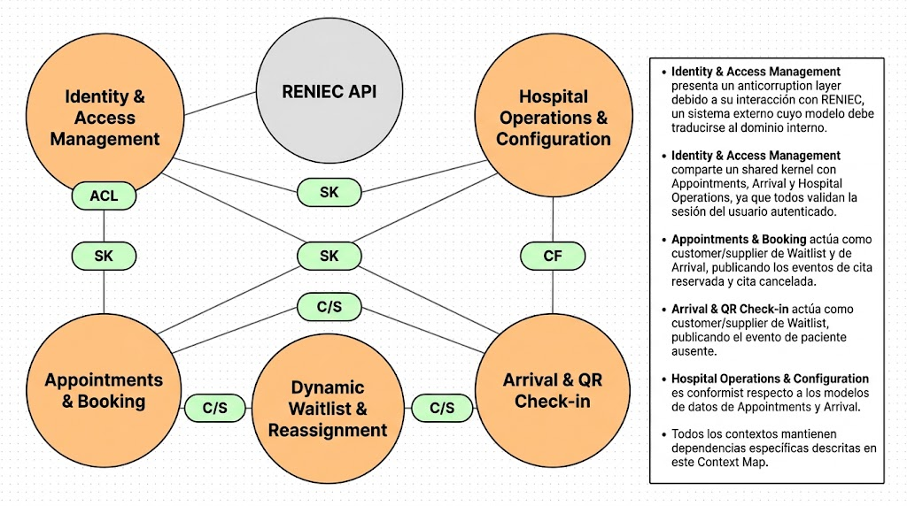

### 2.5.3. Software Architecture

#### 2.5.3.1. Context Level Diagram

En el Software Architecture Context Diagram se pueden apreciar los componentes más importantes que interactúan con el sistema SaludYa, así como los usuarios principales y las funciones que desempeñan dentro del ecosistema de gestión de citas médicas en establecimientos públicos de salud.

El sistema SaludYa interactúa con tres tipos de usuarios principales: los **pacientes** que reservan y gestionan citas médicas, el **personal de admisión** que controla el flujo de atención en el establecimiento, y el **Super Admin** que configura los parámetros operativos del sistema. Asimismo, el sistema se integra con cuatro servicios externos: **RENIEC API** para la validación de identidad por DNI, **Firebase Cloud Messaging** para el envío de notificaciones push, un **Servicio de Correo** para notificaciones transaccionales, y una **Pasarela SMS** para el envío de mensajes de texto.

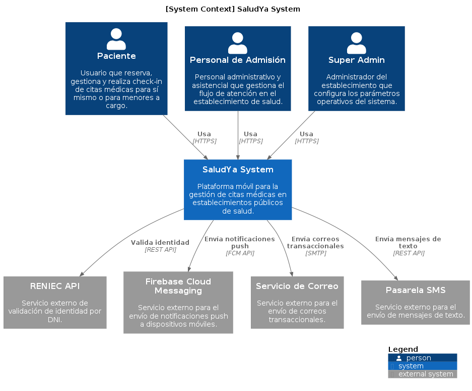

#### 2.5.3.2. Container Level Diagram

En el Software Architecture Container Diagram se detalla la estructura interna del sistema SaludYa, mostrando los contenedores principales que lo componen y cómo se comunican entre sí. Este nivel de abstracción permite visualizar las decisiones tecnológicas y la distribución de responsabilidades dentro del sistema.

El sistema SaludYa está compuesto por dos aplicaciones móviles (una para pacientes y otra para el personal de admisión), un API Gateway que centraliza las peticiones, un Backend API que orquesta la lógica de negocio de los bounded contexts, una base de datos PostgreSQL para la persistencia, Spring Events para la comunicación asíncrona entre contextos, y un worker de Cron Jobs que ejecuta tareas programadas como la expiración de tolerancias y la reasignación automática de cupos.

El Backend API incluye internamente los módulos `AttendanceQueue` (que gestiona la cola de asistencia ordenada por `checkInTimestamp`) y `Waitlist` (que gestiona la lista de espera dinámica ordenada por `bookingOrder` y la cascada de reasignación). La base de datos incorpora las tablas `attendance_queue_entries` y `waitlist_entries`, y la tabla `appointments` incluye el campo `booking_order` que determina la prioridad de reasignación.

El Backend API se integra con cuatro servicios externos: **RENIEC API** para la validación de identidad por DNI, **Firebase Cloud Messaging** para el envío de notificaciones push, un **Servicio de Correo** para notificaciones transaccionales, y una **Pasarela SMS** para el envío de mensajes de texto a los pacientes que no cuentan con smartphone.

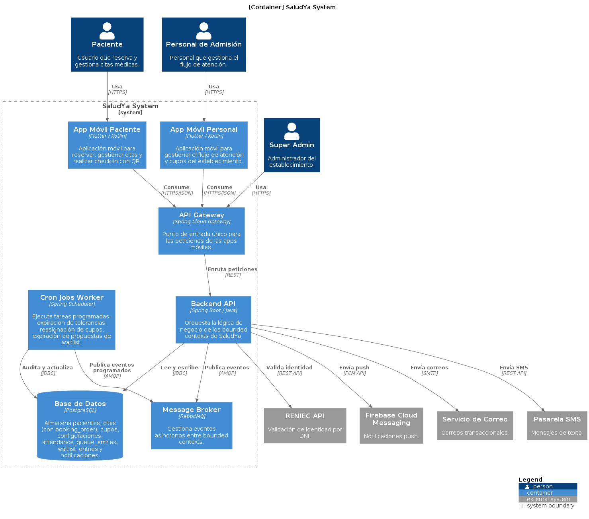

#### 2.5.3.3. Deployment Diagram

En el Software Architecture Deployment Diagram se muestra la distribución física de los contenedores del sistema SaludYa sobre la infraestructura tecnológica que los aloja. Este diagrama permite visualizar cómo se despliegan las aplicaciones móviles, los servicios del backend y los componentes de infraestructura en los diferentes nodos del sistema.

El despliegue de SaludYa se distribuye en tres entornos principales. En primer lugar, las **aplicaciones móviles** se ejecutan directamente en los dispositivos de los usuarios: la app del paciente en smartphones Android/iOS, y la app del personal de admisión en smartphones o tablets del establecimiento. En segundo lugar, el **backend del sistema** se despliega en una infraestructura cloud (AWS o GCP) compuesta por un servidor de aplicaciones con contenedores Docker que alojan el API Gateway, el Backend API y los Cron Jobs y un servidor de base de datos PostgreSQL. Finalmente, el sistema se integra con **servicios externos** como RENIEC API para la validación de identidad, Firebase Cloud Messaging para notificaciones push, el servicio de correo SMTP para notificaciones transaccionales, y una pasarela SMS.

Esta arquitectura de despliegue permite escalar horizontalmente los servicios del backend según la demanda, mantener la comunicación asíncrona entre bounded contexts mediante el message broker, y garantizar la disponibilidad de los servicios críticos mediante la infraestructura cloud.

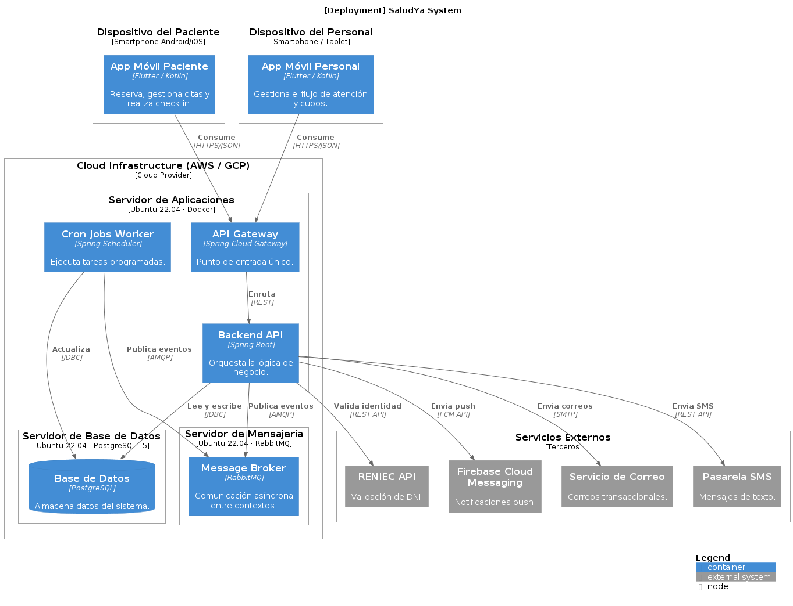

## 2.6. Tactical-Level Domain-Driven Design

### 2.6.1. Bounded Context: Identity & Access Management

El **bounded context de Identity & Access Management** gestiona el registro, autenticación, vinculación de menores y gestión de roles de los usuarios en SaludYa. Permite validar la identidad de los pacientes y del personal administrativo antes de acceder a los módulos principales del sistema.

#### 2.6.1.1. Domain Layer

La capa de **Domain** representa el núcleo del negocio de identidad. Aquí se definen las entidades, value objects, enums, aggregates, factories e interfaces que encapsulan las reglas de negocio.

##### UserAccount (Aggregate Root)

**Atributos:**
`id`, `email: Email`, `password: PasswordHash`, `role: Role`, `isActive`, `createdAt`

**Métodos:**
- `validatePassword(password)` → verifica si la contraseña ingresada coincide con la almacenada.
- `assignRole(role)` → asigna un rol al usuario.
- `activate()` / `deactivate()` → controlan si el usuario puede iniciar sesión.

**Propósito:**
Representa la cuenta de acceso al sistema. Es aggregate root porque agrupa la lógica de autenticación y estado del usuario.

---

##### Patient (Aggregate Root)

**Atributos:**
`id`, `idUser`, `dni: Dni`, `name`, `lastname`, `birthDate`, `phone`

**Métodos:**
- `updateContactInfo(phone, email)` → actualiza los datos de contacto.
- `isMinor()` → retorna `true` si el paciente es menor de edad.

**Propósito:**
Representa el perfil del paciente. Es aggregate root porque agrupa la información personal del paciente.

---

##### PatientMinor (Entity)

**Atributos:**
`id`, `idPatient`, `idTutor`

**Métodos:**
- `validateTutor(tutorId)` → valida que el tutor sea un adulto responsable registrado.

**Propósito:**
Vincula a un menor de edad con un adulto responsable (tutor).

---

##### Email (Value Object)

**Atributos:**
`value`

**Métodos:**
- `isValid()` → valida el formato del correo.

**Propósito:**
Encapsula el correo electrónico como value object inmutable.

---

##### Dni (Value Object)

**Atributos:**
`value`

**Métodos:**
- `isValid()` → valida que el DNI tenga 8 dígitos.

**Propósito:**
Encapsula el DNI como value object inmutable.

---

##### PasswordHash (Value Object)

**Atributos:**
`value`

**Propósito:**
Encapsula el hash de la contraseña como value object inmutable.

---

##### Role (Enum)

**Valores posibles:**
`PATIENT`, `ADMISSION_STAFF`, `SUPER_ADMIN`

**Propósito:**
Define los tipos de usuario del sistema.

---

##### UserAccountFactory (Factory)

**Métodos:**
- `createPatientAccount(email, password, dni, name, lastname, birthDate, phone): UserAccount`
- `createStaffAccount(email, password, dni, name, lastname): UserAccount`

**Propósito:**
Encapsula la creación de cuentas de usuario, validando los datos y asignando el rol correspondiente.

---

##### UserAccountRepository (Interface)

**Métodos:**
- `save(userAccount: UserAccount): UserAccount`
- `findById(id: Int): UserAccount?`
- `findByEmail(email: String): UserAccount?`
- `updateStatus(id: Int, isActive: Boolean)`

**Propósito:**
Define las operaciones de persistencia para cuentas de usuario.

---

##### PatientRepository (Interface)

**Métodos:**
- `save(patient: Patient): Patient`
- `findById(id: Int): Patient?`
- `findByDni(dni: String): Patient?`
- `findByUserId(userId: Int): Patient?`
- `saveMinor(patientMinor: PatientMinor): PatientMinor`
- `findMinorsByTutor(tutorId: Int): List<PatientMinor>`

**Propósito:**
Define las operaciones de persistencia para pacientes y menores vinculados.

---

##### EventPublisher (Interface)

**Métodos:**
- `publish(event: DomainEvent)`

**Propósito:**
Define la interfaz para publicar eventos de dominio. La implementación concreta usa Spring Events.

---

#### 2.6.1.2. Interface Layer

La **Interface Layer** expone las funcionalidades del bounded context mediante endpoints REST.

##### UserAccountsController (REST API Controller)

**Endpoints:**
- `POST /api/v1/user-accounts` → Registra un nuevo paciente con verificación de DNI.
- `POST /api/v1/user-accounts/login` → Inicia sesión y genera token JWT.
- `POST /api/v1/user-accounts/logout` → Cierra sesión.
- `POST /api/v1/user-accounts/recover-password` → Solicita recuperación de contraseña.
- `GET /api/v1/user-accounts/{id}` → Obtiene el perfil del usuario autenticado.
- `PUT /api/v1/user-accounts/{id}` → Actualiza datos de contacto.
- `POST /api/v1/user-accounts/staff` → Crea cuenta de personal administrativo.

**Explicación:**
Este controlador gestiona las operaciones sobre el aggregate `UserAccount`.

---

##### PatientsController (REST API Controller)

**Endpoints:**
- `GET /api/v1/patients/{id}` → Obtiene el perfil de un paciente.
- `PUT /api/v1/patients/{id}` → Actualiza datos del paciente.
- `GET /api/v1/patients/{id}/minors` → Lista los menores vinculados al tutor.

**Explicación:**
Este controlador gestiona las operaciones sobre el aggregate `Patient`.

---

##### PatientMinorsController (REST API Controller)

**Endpoints:**
- `POST /api/v1/patient-minors` → Vincula un menor a la cuenta del titular.
- `GET /api/v1/patient-minors/{id}` → Obtiene el detalle del vínculo.
- `DELETE /api/v1/patient-minors/{id}` → Desvincula un menor.

**Explicación:**
Este controlador gestiona las operaciones sobre la entity `PatientMinor`.

---

##### IamContextFacade (Facade / ACL)

**Métodos:**
- `getUserById(id): UserAccount?`
- `getPatientById(id): Patient?`
- `getMinorsByTutor(tutorId): List<PatientMinor>`

**Propósito:**
Punto de entrada interno para otros bounded contexts. Evita que otros contextos accedan directamente a los repositorios de IAM.

---

#### 2.6.1.3. Application Layer

La **Application Layer** orquesta los casos de uso del dominio mediante **Command Services** y **Query Services**. Los **Command Handlers** viven dentro de los Command Services, y los **Event Handlers** en `application/internal/eventhandlers/`.

##### UserAccountCommandService (Interface)

**Métodos (Command Handlers):**
- `registerPatient(command: RegisterPatientCommand): Patient`
- `login(command: LoginCommand): AuthResult`
- `logout(command: LogoutCommand): void`
- `recoverPassword(command: RecoverPasswordCommand): void`
- `updateProfile(command: UpdateProfileCommand): Patient`
- `createStaffAccount(command: CreateStaffAccountCommand): UserAccount`

**Propósito:**
Define los comandos relacionados con la cuenta de usuario.

---

##### PatientCommandService (Interface)

**Métodos (Command Handlers):**
- `linkMinor(command: LinkMinorCommand): PatientMinor`
- `unlinkMinor(command: UnlinkMinorCommand): void`

**Propósito:**
Define los comandos relacionados con el paciente y sus menores vinculados.

---

##### UserAccountQueryService (Interface)

**Métodos (Query Handlers):**
- `getById(id: Int): UserAccount?`
- `getByEmail(email: String): UserAccount?`

**Propósito:**
Define las consultas relacionadas con la cuenta de usuario.

---

##### PatientQueryService (Interface)

**Métodos (Query Handlers):**
- `getById(id: Int): Patient?`
- `getByDni(dni: String): Patient?`
- `getMinorsByTutor(tutorId: Int): List<PatientMinor>`

**Propósito:**
Define las consultas relacionadas con el paciente.

---

##### UserAccountCommandServiceImpl (Implementation)

**Responsabilidad:** Implementar los comandos de cuenta de usuario.

**Flujo de `registerPatient`:**
1. Recibe los datos del paciente.
2. Valida el DNI contra el servicio externo RENIEC mediante `ReniecService` (ACL).
3. Valida que el correo no esté duplicado.
4. Crea la cuenta de usuario con rol `PATIENT` usando `UserAccountFactory`.
5. Crea el perfil de paciente.
6. Publica el evento `PatientRegisteredEvent`.
7. Notifica al paciente vía `NotificationAdapter`.

---

##### PatientCommandServiceImpl (Implementation)

**Responsabilidad:** Implementar los comandos de paciente.

**Flujo de `linkMinor`:**
1. Recibe el DNI del menor.
2. Valida el DNI contra RENIEC.
3. Valida que el menor no esté vinculado a otra cuenta.
4. Crea el `PatientMinor` asociando al tutor.
5. Publica el evento `MinorLinkedEvent`.
6. Notifica al tutor.

---

##### PatientRegisteredEventHandler (Event Handler)

**Responsabilidad:** Reaccionar al evento `PatientRegisteredEvent`.
**Flujo:**
1. Escucha el evento.
2. Envía el correo de bienvenida.
3. Registra la acción en el log de auditoría.

---

##### MinorLinkedEventHandler (Event Handler)

**Responsabilidad:** Reaccionar al evento `MinorLinkedEvent`.
**Flujo:**
1. Escucha el evento.
2. Notifica al tutor que la vinculación fue exitosa.
3. Registra la acción en el log de auditoría.

---

#### 2.6.1.4. Infrastructure Layer

La capa de **Infrastructure** contiene las implementaciones concretas.

##### UserAccountRepositoryImpl
**Implementa:** `UserAccountRepository`
**Tecnología:** Spring Data JPA + PostgreSQL
**Explicación:**
Ejecuta operaciones sobre la tabla `users`. Mapea entidades del dominio a entidades JPA.

---

##### PatientRepositoryImpl
**Implementa:** `PatientRepository`
**Tecnología:** Spring Data JPA + PostgreSQL
**Explicación:**
Ejecuta operaciones sobre las tablas `patients` y `patient_minors`.

---

##### ReniecService (ACL)
**Función:**
Valida la identidad por DNI contra el servicio externo de RENIEC.
**Tecnología:** REST Client (RestTemplate / WebClient)
**Explicación:**
Implementa un Anticorruption Layer (ACL) que traduce el modelo externo de RENIEC al modelo interno de identidad.

---

##### BCryptHashingService
**Función:**
Hashea y valida contraseñas con BCrypt.
**Tecnología:** BCrypt

---

##### TokenServiceImpl
**Función:**
Genera y valida tokens JWT.
**Tecnología:** java-jwt / jjwt

---

##### WebSecurityConfiguration
**Función:**
Configura Spring Security, filtros de autorización y pipeline de autenticación.
**Tecnología:** Spring Security

---

##### BearerAuthorizationRequestFilter
**Función:**
Filtra las peticiones HTTP y valida el token Bearer en cada request.
**Tecnología:** Spring Security

---

##### NotificationAdapter
**Función:**
Envía notificaciones al usuario (correo de bienvenida, recuperación de contraseña).
**Tecnología:** SMTP + Firebase Cloud Messaging

---

##### SpringEventPublisherImpl
**Implementa:** `EventPublisher`
**Función:**
Publica eventos de dominio usando Spring Events.
**Tecnología:** `ApplicationEventPublisher` de Spring

---

#### 2.6.1.5. Bounded Context Software Architecture Component Level Diagrams

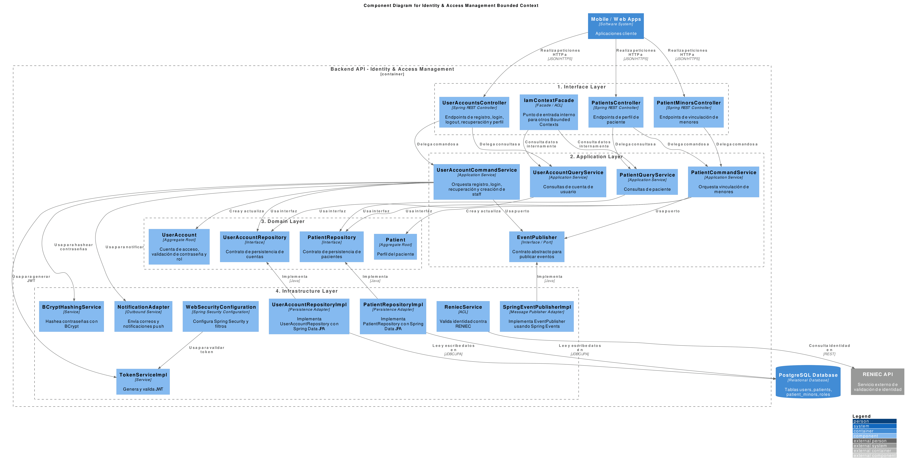

---
El diagrama de componentes del bounded context Identity & Access Management muestra la organización interna del Backend API en sus cuatro capas: Interface, Application, Domain e Infrastructure. Se aprecian los controladores REST, los servicios de aplicación, los aggregates del dominio, las interfaces de repositorio y los adapters de infraestructura, junto con sus dependencias y la comunicación con la base de datos PostgreSQL y los servicios externos.

#### 2.6.1.6. Bounded Context Software Architecture Code Level Diagrams

##### 2.6.1.6.1. Bounded Context Domain Layer Class Diagrams

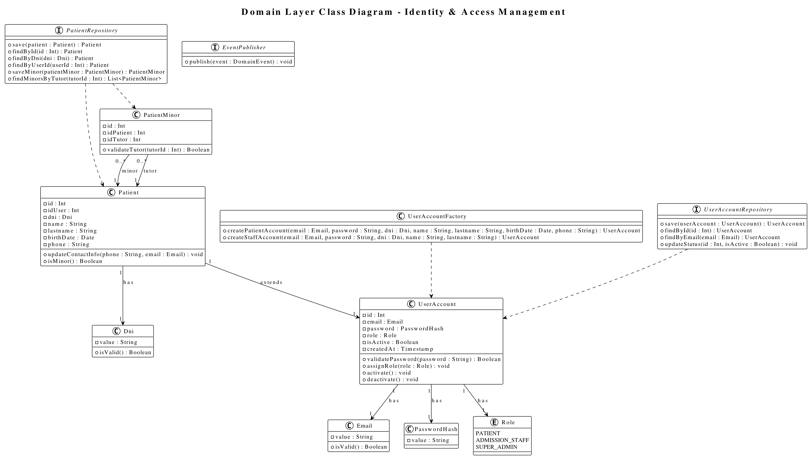

---
El diagrama de clases del dominio del bounded context Identity & Access Management representa los aggregates, entities, value objects, enums, factory e interfaces de repositorio que encapsulan las reglas de negocio de identidad. Se muestran las relaciones entre UserAccount, Patient y PatientMinor, junto con los value objects Email, Dni y PasswordHash, el enum Role y la factory UserAccountFactory.

##### 2.6.1.6.2. Bounded Context Database Design Diagram

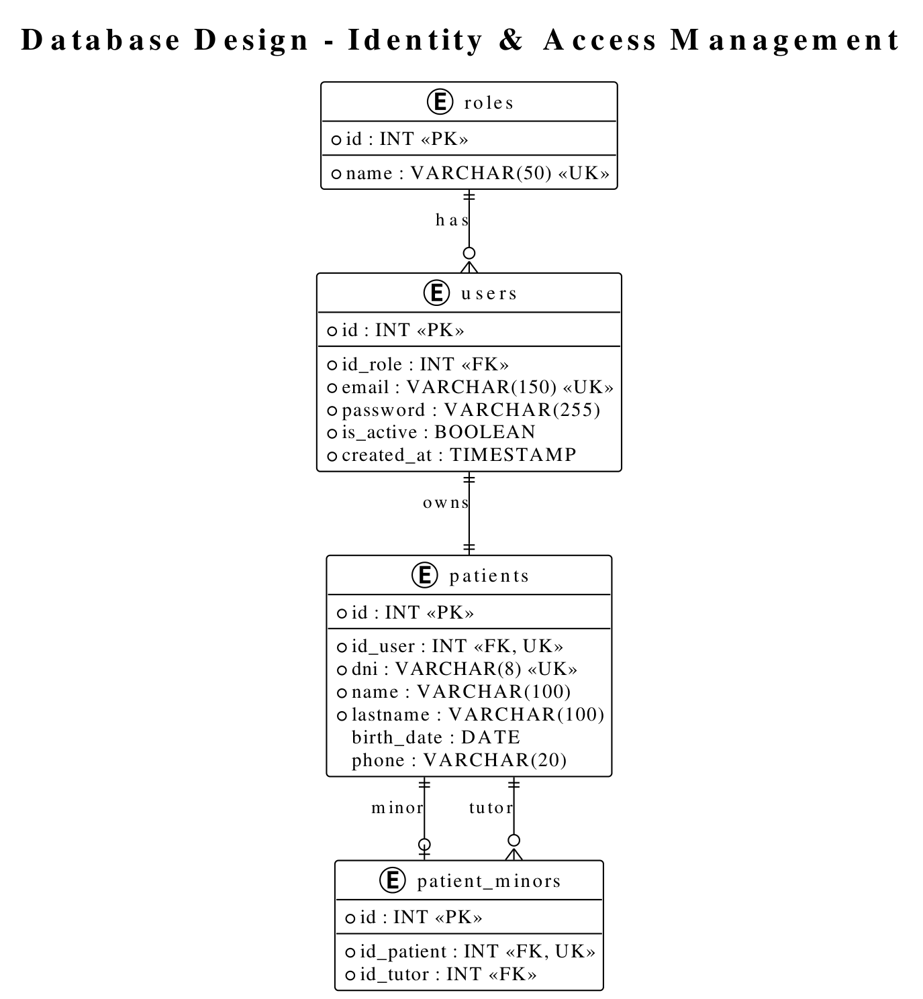

---
El diagrama de base de datos del bounded context Identity & Access Management muestra las tablas roles, users, patients y patient_minors, junto con sus columnas, claves primarias, claves foráneas y restricciones de unicidad. Las relaciones reflejan la estructura de identidad: un rol tiene muchos usuarios, un usuario tiene un solo paciente, y un paciente puede ser tutor de muchos menores.

---

### 2.6.2. Bounded Context: Appointments & Booking

El **bounded context de Appointments & Booking** gestiona el ciclo de vida de una cita médica: consulta de disponibilidad, reserva, confirmación y cancelación. Es el responsable de la **cola de pedido de cita** (`booking_order`), que define la prioridad del paciente para asumir cupos liberados.

#### 2.6.2.1. Domain Layer

La capa de **Domain** representa el núcleo del negocio de reserva de citas. Aquí se definen las entidades, value objects, enums, aggregates, factories, domain services, domain events e interfaces que encapsulan las reglas de negocio.

##### Appointment (Aggregate Root)

**Atributos:**
`id`, `idTimeSlot`, `idPatient`, `bookingOrder: BookingOrder`, `status: AppointmentStatus`, `createdAt`, `updatedAt`

**Métodos:**
- `cancel()` → cambia el estado a `CANCELLED` si está dentro del plazo permitido.
- `markAsAbsent()` → cambia el estado a `ABSENT`.
- `markAsAttended()` → cambia el estado a `ATTENDED`.
- `isActive()` → retorna `true` si el estado es `RESERVED` o `CONFIRMED`.
- `canBeCancelled(deadlineHours)` → valida si aún está dentro del plazo de cancelación.

**Propósito:**
Representa una cita médica reservada. Es aggregate root porque agrupa el `bookingOrder` y controla el ciclo de vida de la cita.

---

##### TimeSlot (Aggregate Root)

**Atributos:**
`id`, `idDoctor`, `date`, `startHour`, `endHour`, `maxCapacity`, `currentBookings`, `status: TimeSlotStatus`

**Métodos:**
- `hasAvailableCapacity()` → retorna `true` si `currentBookings < maxCapacity`.
- `incrementBookings()` → aumenta `currentBookings` en 1.
- `decrementBookings()` → disminuye `currentBookings` en 1.
- `isFull()` → retorna `true` si `currentBookings >= maxCapacity`.
- `isExpired()` → retorna `true` si la fecha y hora ya pasaron.

**Propósito:**
Representa un bloque horario concreto de un médico en una fecha. Es aggregate root porque controla la capacidad y el estado del bloque.

---

##### Doctor (Entity)

**Atributos:**
`id`, `idSpecialty`, `name`, `lastname`

**Propósito:**
Representa a un médico dentro del catálogo.

---

##### Specialty (Entity)

**Atributos:**
`id`, `name`, `description`

**Propósito:**
Representa una especialidad médica dentro del catálogo.

---

##### BookingOrder (Value Object)

**Atributos:**
`value`, `idSpecialty`

**Propósito:**
Encapsula el número secuencial de reserva por especialidad. Es inmutable una vez asignado.

---

##### AppointmentStatus (Enum)

**Valores posibles:**
`RESERVED`, `CONFIRMED`, `CANCELLED`, `ABSENT`, `ATTENDED`, `EXPIRED`

**Propósito:**
Define los estados del ciclo de vida de una cita.

---

##### TimeSlotStatus (Enum)

**Valores posibles:**
`AVAILABLE`, `FULL`, `CANCELLED`

**Propósito:**
Define el estado de disponibilidad de un bloque horario.

---

##### AppointmentFactory (Factory)

**Métodos:**
- `createAppointment(timeSlot, patient, bookingOrder): Appointment`

**Propósito:**
Encapsula la creación de citas, validando que el `time_slot` tenga capacidad.

---

##### BookingDomainService (Domain Service)

**Métodos:**
- `calculateNextBookingOrder(specialtyId): Int`
- `validateNoOverlap(patientId, timeSlot): Boolean`

**Propósito:**
Encapsula la lógica de negocio que no pertenece a una sola entidad:
- `calculateNextBookingOrder`: calcula el siguiente número secuencial por especialidad.
- `validateNoOverlap`: valida que el paciente no tenga otra cita activa en el mismo bloque horario.

---

##### AppointmentRepository (Interface)

**Métodos:**
- `save(appointment: Appointment): Appointment`
- `findById(id: Int): Appointment?`
- `findByPatient(patientId: Int): List<Appointment>`
- `findByTimeSlot(timeSlotId: Int): List<Appointment>`
- `findActiveBySpecialty(specialtyId: Int): List<Appointment>`
- `getNextBookingOrderBySpecialty(specialtyId: Int): Int`
- `updateStatus(id: Int, status: AppointmentStatus)`

**Propósito:**
Define las operaciones de persistencia para citas.

---

##### TimeSlotRepository (Interface)

**Métodos:**
- `save(timeSlot: TimeSlot): TimeSlot`
- `findById(id: Int): TimeSlot?`
- `findAvailableBySpecialty(specialtyId: Int, date: Date): List<TimeSlot>`
- `findByDoctorAndDate(doctorId: Int, date: Date): List<TimeSlot>`
- `incrementBookings(id: Int)`
- `decrementBookings(id: Int)`

**Propósito:**
Define las operaciones de persistencia para bloques horarios.

---

##### EventPublisher (Interface)

**Métodos:**
- `publish(event: DomainEvent)`

**Propósito:**
Define la interfaz para publicar eventos de dominio. La implementación concreta usa Spring Events.

---

##### AppointmentBookedEvent (Domain Event)

**Atributos:**
`appointmentId`, `timeSlotId`, `patientId`, `bookingOrder`, `bookedAt`

**Propósito:**
Representa el hecho de negocio de que se reservó una nueva cita.

---

##### AppointmentCancelledEvent (Domain Event)

**Atributos:**
`appointmentId`, `freedTimeSlotId`, `cancelledAt`

**Propósito:**
Representa el hecho de negocio de que una cita fue cancelada y su cupo quedó libre.

---

##### AppointmentAbsentEvent (Domain Event)

**Atributos:**
`appointmentId`, `freedTimeSlotId`, `absentAt`

**Propósito:**
Representa el hecho de negocio de que un paciente no se presentó a su cita.

---

#### 2.6.2.2. Interface Layer

La **Interface Layer** expone las funcionalidades del bounded context mediante endpoints REST.

##### AppointmentsController (REST API Controller)

**Endpoints:**
- `POST /api/v1/appointments` → Reserva una nueva cita.
- `GET /api/v1/appointments/{id}` → Obtiene el detalle de una cita.
- `GET /api/v1/appointments/patient/{patientId}` → Lista citas de un paciente.
- `DELETE /api/v1/appointments/{id}` → Cancela una cita dentro del plazo permitido.

**Explicación:**
Este controlador gestiona las operaciones sobre el aggregate `Appointment`.

---

##### TimeSlotsController (REST API Controller)

**Endpoints:**
- `GET /api/v1/time-slots?doctorId={id}&date={date}` → Lista bloques horarios disponibles.
- `GET /api/v1/time-slots/{id}` → Obtiene el detalle de un bloque horario.

**Explicación:**
Este controlador gestiona las operaciones sobre el aggregate `TimeSlot`.

---

##### SpecialtiesController (REST API Controller)

**Endpoints:**
- `GET /api/v1/specialties` → Lista especialidades disponibles.
- `GET /api/v1/specialties/{id}` → Obtiene el detalle de una especialidad.

**Explicación:**
Este controlador gestiona las operaciones sobre la entity `Specialty`.

---

##### DoctorsController (REST API Controller)

**Endpoints:**
- `GET /api/v1/doctors?specialtyId={id}` → Lista médicos de una especialidad.
- `GET /api/v1/doctors/{id}` → Obtiene el detalle de un médico.

**Explicación:**
Este controlador gestiona las operaciones sobre la entity `Doctor`.

---

#### 2.6.2.3. Application Layer

La **Application Layer** orquesta los casos de uso del dominio mediante **Command Services** y **Query Services**. Los **Command Handlers** viven dentro de los Command Services, y los **Event Handlers** en `application/internal/eventhandlers/`.

##### AppointmentCommandService (Interface)

**Métodos (Command Handlers):**
- `bookAppointment(command: BookAppointmentCommand): Appointment`
- `cancelAppointment(command: CancelAppointmentCommand): Appointment`
- `liberateSlot(command: LiberateSlotCommand): void`

**Propósito:**
Define los comandos relacionados con la cita.

---

##### TimeSlotCommandService (Interface)

**Métodos (Command Handlers):**
- `createTimeSlot(command: CreateTimeSlotCommand): TimeSlot`
- `updateCapacity(command: UpdateCapacityCommand): TimeSlot`

**Propósito:**
Define los comandos relacionados con el bloque horario.

---

##### AppointmentQueryService (Interface)

**Métodos (Query Handlers):**
- `getById(id: Int): Appointment?`
- `getByPatient(patientId: Int): List<Appointment>`
- `getByTimeSlot(timeSlotId: Int): List<Appointment>`

**Propósito:**
Define las consultas relacionadas con la cita.

---

##### TimeSlotQueryService (Interface)

**Métodos (Query Handlers):**
- `getAvailableBySpecialty(specialtyId: Int, date: Date): List<TimeSlot>`
- `getByDoctorAndDate(doctorId: Int, date: Date): List<TimeSlot>`

**Propósito:**
Define las consultas relacionadas con el bloque horario.

---

##### AppointmentCommandServiceImpl (Implementation)

**Responsabilidad:** Implementar los comandos de cita.

**Flujo de `bookAppointment`:**
1. Recibe `patientId` y `timeSlotId`.
2. Lee la configuración del hospital.
3. Valida que el `time_slot` tenga capacidad disponible.
4. Valida que la hora actual esté antes del `bookingCutoffTime`.
5. Calcula el `bookingOrder` con `BookingDomainService.calculateNextBookingOrder`.
6. Valida que no haya solapamiento con `BookingDomainService.validateNoOverlap`.
7. Crea el `Appointment` con estado `RESERVED` usando `AppointmentFactory`.
8. Incrementa `current_bookings`.
9. Publica el evento `AppointmentBookedEvent`.
10. Notifica al paciente.

**Flujo de `cancelAppointment`:**
1. Recibe `appointmentId`.
2. Busca la cita.
3. Lee `cancellationDeadlineHours`.
4. Valida que la cancelación esté dentro del plazo.
5. Cambia el estado a `CANCELLED`.
6. Decrementa `current_bookings`.
7. Publica el evento `AppointmentCancelledEvent`.
8. Notifica al paciente.

---

##### AppointmentCancelledEventHandler (Event Handler)

**Responsabilidad:** Reaccionar al evento `AppointmentCancelledEvent`.
**Flujo:**
1. Escucha el evento.
2. Dispara el protocolo de reasignación en el bounded context `Reassignment`.
3. Registra la acción en el log de auditoría.

---

##### AppointmentAbsentEventHandler (Event Handler)

**Responsabilidad:** Reaccionar al evento `AppointmentAbsentEvent`.
**Flujo:**
1. Escucha el evento.
2. Dispara el protocolo de reasignación en el bounded context `Reassignment`.
3. Registra la acción en el log de auditoría.

---

#### 2.6.2.4. Infrastructure Layer

La capa de **Infrastructure** contiene las implementaciones concretas.

##### AppointmentRepositoryImpl
**Implementa:** `AppointmentRepository`
**Tecnología:** Spring Data JPA + PostgreSQL
**Explicación:**
Ejecuta operaciones sobre la tabla `appointments`. Implementa el cálculo de `booking_order` secuencial por especialidad.

---

##### TimeSlotRepositoryImpl
**Implementa:** `TimeSlotRepository`
**Tecnología:** Spring Data JPA + PostgreSQL
**Explicación:**
Ejecuta operaciones sobre la tabla `time_slots`.

---

##### HospitalConfigurationRepositoryImpl
**Implementa:** `HospitalConfigurationRepository`
**Tecnología:** Spring Data JPA + PostgreSQL
**Explicación:**
Lee la configuración del hospital (`maxCapacityPerSlot`, `bookingOrderScope`, `bookingCutoffTime`, `cancellationDeadlineHours`).

---

##### NotificationAdapter
**Función:**
Envía notificaciones de confirmación, cancelación o reasignación.
**Tecnología:** SMTP + Firebase Cloud Messaging

---

##### SpringEventPublisherImpl
**Implementa:** `EventPublisher`
**Función:**
Publica eventos de dominio usando Spring Events.
**Tecnología:** `ApplicationEventPublisher` de Spring

---

#### 2.6.2.5. Bounded Context Software Architecture Component Level Diagrams

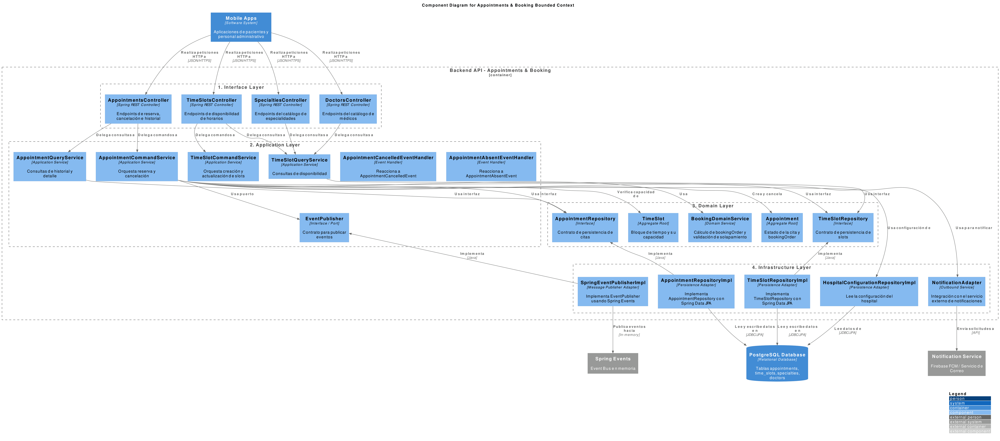

---
El diagrama de componentes del bounded context Appointments & Booking muestra la organización interna del Backend API en sus cuatro capas. En la Interface Layer, los controladores exponen los endpoints REST para reservar, cancelar, consultar disponibilidad y explorar el catálogo médico. En la Application Layer, los Command Services y Query Services orquestan los casos de uso, junto con los Event Handlers que reaccionan a eventos de cancelación y ausencia. En la Domain Layer, los aggregates Appointment y TimeSlot encapsulan las reglas de negocio, junto con el BookingDomainService. En la Infrastructure Layer, los adapters implementan la persistencia con Spring Data JPA, la publicación de eventos con Spring Events y el envío de notificaciones.

#### 2.6.2.6. Bounded Context Software Architecture Code Level Diagrams

##### 2.6.2.6.1. Bounded Context Domain Layer Class Diagrams

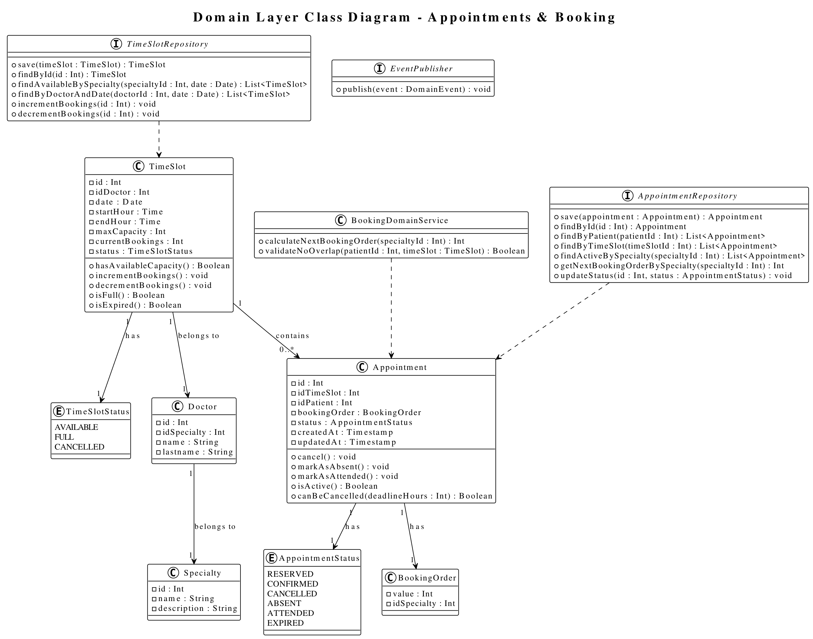

---
El diagrama de clases del dominio del bounded context Appointments & Booking representa los aggregates, entities, value objects, enums, domain service e interfaces de repositorio que encapsulan las reglas de negocio de reserva de citas. Se muestran las relaciones entre Appointment, TimeSlot, Doctor y Specialty, junto con el value object BookingOrder, los enums AppointmentStatus y TimeSlotStatus, y el BookingDomainService.

##### 2.6.2.6.2. Bounded Context Database Design Diagram

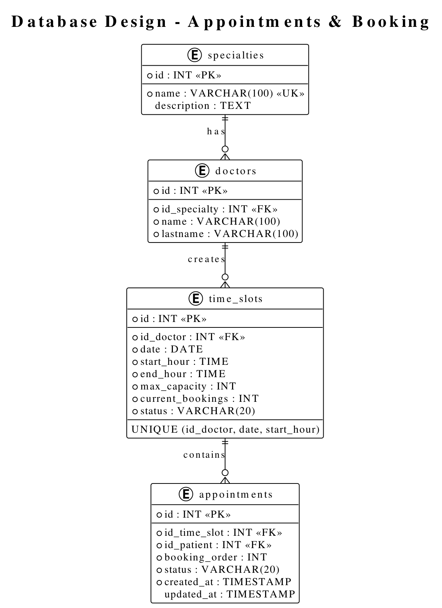

---
El diagrama de base de datos del bounded context Appointments & Booking muestra las tablas specialties, doctors, time_slots y appointments, junto con sus columnas, claves primarias, claves foráneas y restricciones de unicidad. Las relaciones reflejan la estructura del catálogo médico y la reserva de citas: una especialidad tiene muchos doctores, un doctor tiene muchos bloques horarios, y un bloque horario contiene muchas citas.

---

### 2.6.3. Bounded Context: Reassignment

El **bounded context de Reassignment** gestiona la reasignación de cupos liberados por cancelaciones o ausencias. La reasignación opera sobre la **cola de pedido** (`appointments` ordenadas por `booking_order`). No existe lista de espera externa. Cuando se libera un cupo en un `Time Slot X`, el sistema busca en todos los `appointments` de la misma especialidad que no estén en el `Time Slot X`, ordenados por `booking_order`, y notifica al primero. Si rechaza o no responde, pasa al siguiente. Si nadie acepta, el cupo se pierde.

#### 2.6.3.1. Domain Layer

La capa de **Domain** representa el núcleo del negocio de reasignación de cupos liberados. Aquí se definen las entidades, value objects, enums, aggregates, domain services, domain events e interfaces que encapsulan las reglas de negocio.

##### ReassignmentOffer (Aggregate Root)

**Atributos:**
`id`, `idAppointment`, `idFreedTimeSlot`, `idOriginalAppointment`, `status: ReassignmentStatus`, `offeredAt`, `respondedAt`, `expiresAt`

**Métodos:**
- `accept()` → cambia el estado a `ACCEPTED` y registra `respondedAt`.
- `reject()` → cambia el estado a `REJECTED` y registra `respondedAt`.
- `expire()` → cambia el estado a `EXPIRED` si pasó `expiresAt`.
- `isPending()` → retorna `true` si el estado es `PENDING`.
- `isExpired()` → valida si `expiresAt < now()`.

**Propósito:**
Representa una oferta de reasignación enviada a un paciente de la cola de pedido. Es aggregate root porque controla el ciclo de vida de la oferta.

---

##### ReassignmentStatus (Enum)

**Valores posibles:**
`PENDING`, `ACCEPTED`, `REJECTED`, `EXPIRED`

**Propósito:**
Define el estado de una oferta de reasignación.

---

##### ReassignmentDomainService (Domain Service)

**Métodos:**
- `findNextCandidate(specialtyId, freedTimeSlotId): Appointment?`

**Propósito:**
Encapsula la lógica de búsqueda del siguiente candidato en la cola de pedido. Internamente consulta todos los `appointments` de la especialidad con estado `RESERVED` o `CONFIRMED`, excluye los que están en el `Time Slot X`, y los ordena por `booking_order` ascendente para retornar el primero.

---

##### ReassignmentOfferRepository (Interface)

**Métodos:**
- `save(offer: ReassignmentOffer): ReassignmentOffer`
- `findById(id: Int): ReassignmentOffer?`
- `findPendingByAppointment(appointmentId: Int): List<ReassignmentOffer>`
- `findExpiredOffers(): List<ReassignmentOffer>`
- `updateStatus(id: Int, status: ReassignmentStatus)`

**Propósito:**
Define las operaciones de persistencia para ofertas de reasignación.

---

##### EventPublisher (Interface)

**Métodos:**
- `publish(event: DomainEvent)`

**Propósito:**
Define la interfaz para publicar eventos de dominio. La implementación concreta usa Spring Events.

---

##### ReassignmentOfferSentEvent (Domain Event)

**Atributos:**
`offerId`, `appointmentId`, `freedTimeSlotId`, `offeredAt`

**Propósito:**
Representa el hecho de negocio de que se envió una oferta de reasignación a un paciente de la cola de pedido.

---

##### ReassignmentOfferAcceptedEvent (Domain Event)

**Atributos:**
`offerId`, `appointmentId`, `acceptedAt`

**Propósito:**
Representa el hecho de negocio de que un paciente aceptó una oferta de reasignación.

---

##### ReassignmentOfferRejectedEvent (Domain Event)

**Atributos:**
`offerId`, `appointmentId`, `rejectedAt`

**Propósito:**
Representa el hecho de negocio de que un paciente rechazó una oferta de reasignación.

---

##### ReassignmentOfferExpiredEvent (Domain Event)

**Atributos:**
`offerId`, `appointmentId`, `expiredAt`

**Propósito:**
Representa el hecho de negocio de que una oferta de reasignación expiró sin respuesta.

---

#### 2.6.3.2. Interface Layer

La **Interface Layer** expone las funcionalidades del bounded context mediante endpoints REST y consumers de eventos.

##### ReassignmentOffersController (REST API Controller)

**Endpoints:**
- `GET /api/v1/reassignment-offers/pending` → Lista ofertas pendientes del paciente autenticado.
- `POST /api/v1/reassignment-offers/{id}/accept` → Acepta una oferta.
- `POST /api/v1/reassignment-offers/{id}/reject` → Rechaza una oferta.

**Explicación:**
Este controlador gestiona las operaciones sobre el aggregate `ReassignmentOffer`.

---

##### AppointmentCancelledEventConsumer (Event Consumer)

**Función:**
Escucha el evento `AppointmentCancelledEvent` publicado por `Appointments & Booking`.
**Tecnología:** `@EventListener` de Spring

---

##### AppointmentAbsentEventConsumer (Event Consumer)

**Función:**
Escucha el evento `AppointmentAbsentEvent` publicado por `Arrival & QR Check-in`.
**Tecnología:** `@EventListener` de Spring

---

#### 2.6.3.3. Application Layer

La **Application Layer** orquesta los casos de uso del dominio mediante **Command Services** y **Query Services**. Los **Command Handlers** viven dentro de los Command Services, y los **Event Handlers** en `application/internal/eventhandlers/`.

##### ReassignmentCommandService (Interface)

**Métodos (Command Handlers):**
- `sendReassignmentOffer(command: SendReassignmentOfferCommand): ReassignmentOffer`
- `acceptReassignment(command: AcceptReassignmentCommand): void`
- `rejectReassignment(command: RejectReassignmentCommand): void`
- `expireReassignment(command: ExpireReassignmentCommand): void`

**Propósito:**
Define los comandos relacionados con la reasignación.

---

##### ReassignmentQueryService (Interface)

**Métodos (Query Handlers):**
- `getPendingByAppointment(appointmentId: Int): List<ReassignmentOffer>`
- `getById(id: Int): ReassignmentOffer?`

**Propósito:**
Define las consultas relacionadas con la reasignación.

---

##### ReassignmentCommandServiceImpl (Implementation)

**Responsabilidad:** Implementar los comandos de reasignación.

**Flujo de `sendReassignmentOffer`:**
1. Recibe `idFreedTimeSlot` e `idOriginalAppointment`.
2. Lee `reassignmentResponseTimeoutMin` de la configuración.
3. Busca el siguiente candidato con `ReassignmentDomainService.findNextCandidate`.
4. Crea un `ReassignmentOffer` con `expiresAt = now + timeout`.
5. Publica el evento `ReassignmentOfferSentEvent`.
6. Envía notificación al paciente.

**Flujo de `acceptReassignment`:**
1. Recibe `offerId`.
2. Valida que esté `PENDING` y no expirada.
3. Cambia el estado a `ACCEPTED`.
4. Actualiza el `appointment` del paciente con el nuevo `time_slot`.
5. Publica el evento `ReassignmentOfferAcceptedEvent`.
6. Notifica al paciente.

**Flujo de `rejectReassignment`:**
1. Recibe `offerId`.
2. Cambia el estado a `REJECTED`.
3. Publica el evento `ReassignmentOfferRejectedEvent`.
4. Dispara `sendReassignmentOffer` para el siguiente candidato.

**Flujo de `expireReassignment`:**
1. Busca ofertas `PENDING` con `expiresAt < now()`.
2. Cambia el estado a `EXPIRED`.
3. Publica el evento `ReassignmentOfferExpiredEvent`.
4. Dispara `sendReassignmentOffer` para el siguiente candidato.

---

##### AppointmentCancelledEventHandler (Event Handler)

**Responsabilidad:** Reaccionar al evento `AppointmentCancelledEvent`.
**Flujo:**
1. Escucha el evento.
2. Dispara `sendReassignmentOffer`.
3. Registra la acción en el log de auditoría.

---

##### AppointmentAbsentEventHandler (Event Handler)

**Responsabilidad:** Reaccionar al evento `AppointmentAbsentEvent`.
**Flujo:**
1. Escucha el evento.
2. Dispara `sendReassignmentOffer`.
3. Registra la acción en el log de auditoría.

---

#### 2.6.3.4. Infrastructure Layer

La capa de **Infrastructure** contiene las implementaciones concretas.

##### ReassignmentOfferRepositoryImpl
**Implementa:** `ReassignmentOfferRepository`
**Tecnología:** Spring Data JPA + PostgreSQL
**Explicación:**
Ejecuta operaciones sobre la tabla `reassignment_offers`.

---

##### HospitalConfigurationRepositoryImpl
**Implementa:** `HospitalConfigurationRepository`
**Tecnología:** Spring Data JPA + PostgreSQL
**Explicación:**
Lee `reassignmentResponseTimeoutMin` de la configuración del hospital.

---

##### NotificationAdapter
**Función:**
Envía notificaciones de ofertas de reasignación al paciente.
**Tecnología:** SMTP + Firebase Cloud Messaging

---

##### SpringEventPublisherImpl
**Implementa:** `EventPublisher`
**Función:**
Publica eventos de dominio usando Spring Events.
**Tecnología:** `ApplicationEventPublisher` de Spring

---

##### ReassignmentExpirationScheduler
**Función:**
Ejecuta periódicamente `expireReassignment` para expirar ofertas no respondidas.
**Tecnología:** `@Scheduled` de Spring

---

#### 2.6.3.5. Bounded Context Software Architecture Component Level Diagrams

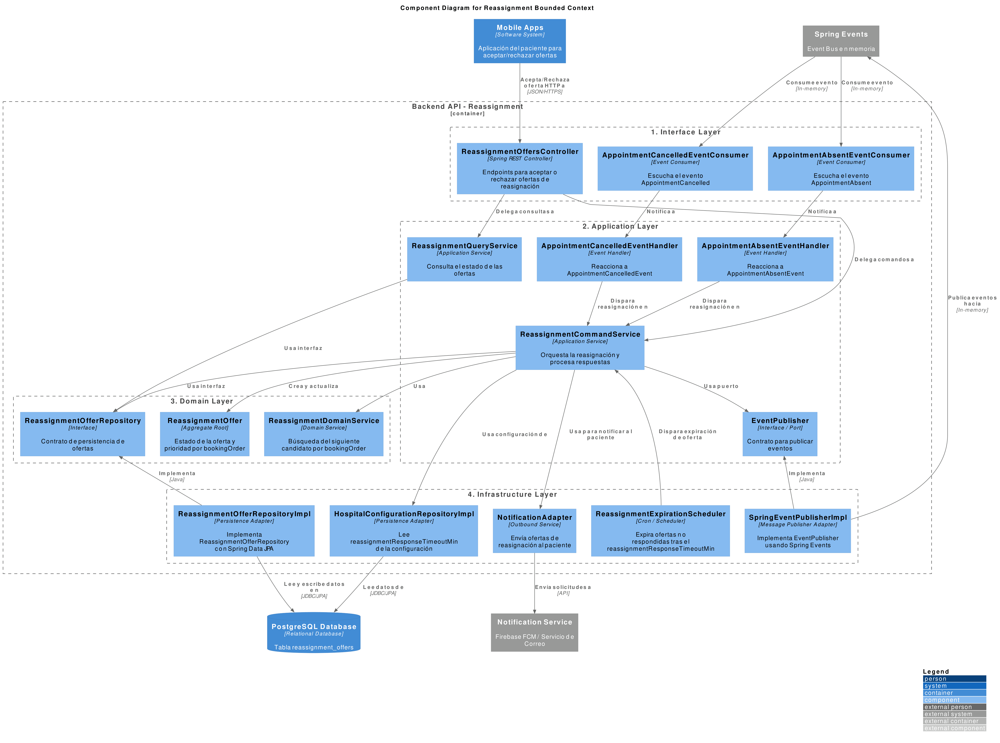

---
El diagrama de componentes del bounded context Reassignment muestra la organización interna del Backend API en sus cuatro capas. En la Interface Layer, el ReassignmentOffersController expone los endpoints REST para aceptar o rechazar ofertas de reasignación, mientras que los Event Consumers escuchan los eventos AppointmentCancelled y AppointmentAbsent publicados por otros bounded contexts. En la Application Layer, el ReassignmentCommandService orquesta la reasignación, junto con los Event Handlers que reaccionan a los eventos de cancelación y ausencia. En la Domain Layer, el aggregate ReassignmentOffer encapsula las reglas de negocio, junto con el ReassignmentDomainService (que busca el siguiente candidato por bookingOrder) y la interfaz ReassignmentOfferRepository. En la Infrastructure Layer, los adapters implementan la persistencia con Spring Data JPA (ReassignmentOfferRepositoryImpl, HospitalConfigurationRepositoryImpl), la publicación de eventos con Spring Events (SpringEventPublisherImpl), el envío de notificaciones (NotificationAdapter) y la expiración automática de ofertas (ReassignmentExpirationScheduler). La comunicación con la base de datos PostgreSQL se realiza mediante JDBC/JPA.

#### 2.6.3.6. Bounded Context Software Architecture Code Level Diagrams

##### 2.6.3.6.1. Bounded Context Domain Layer Class Diagrams

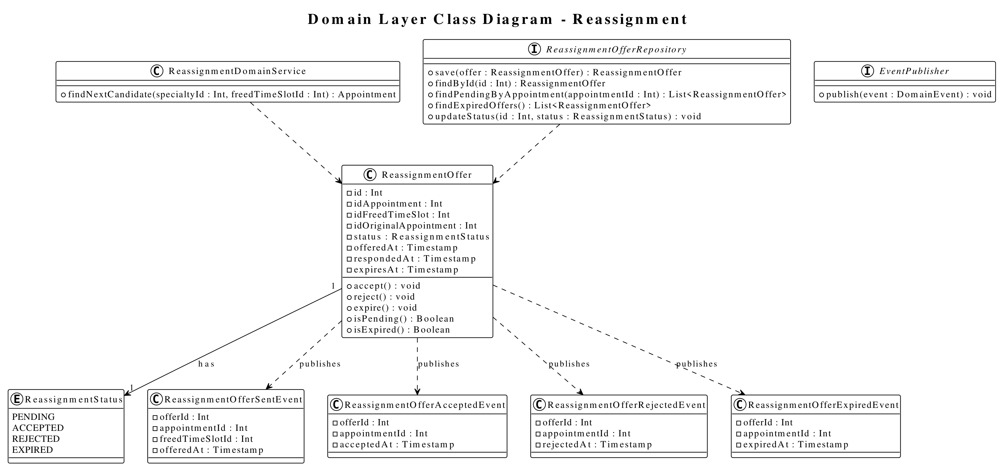

---
El diagrama de clases del dominio del bounded context Reassignment representa el aggregate root ReassignmentOffer que encapsula el estado de la oferta y la prioridad por bookingOrder, junto con el enum ReassignmentStatus que define los estados posibles (PENDING, ACCEPTED, REJECTED, EXPIRED). Se muestran los cuatro Domain Events que publica el aggregate (ReassignmentOfferSentEvent, ReassignmentOfferAcceptedEvent, ReassignmentOfferRejectedEvent, ReassignmentOfferExpiredEvent), el ReassignmentDomainService que encapsula la lógica de búsqueda del siguiente candidato, y las interfaces ReassignmentOfferRepository y EventPublisher que definen los contratos de persistencia y publicación de eventos.

##### 2.6.3.6.2. Bounded Context Database Design Diagram

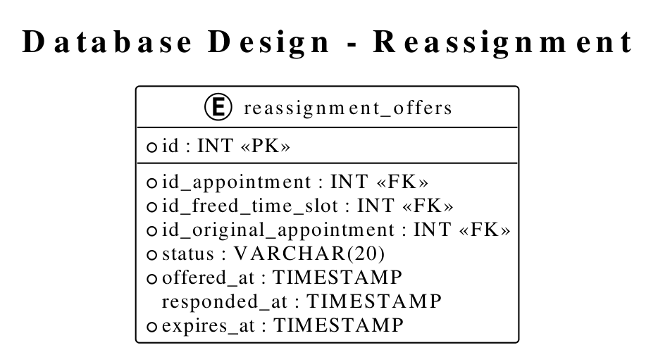

---
El diagrama de base de datos del bounded context Reassignment muestra la tabla reassignment_offers, que almacena las ofertas de reasignación enviadas a los pacientes de la cola de pedido. La tabla incluye tres foreign keys hacia appointments (el paciente que recibe la oferta y la cita original que se liberó) y una foreign key hacia time_slots (el cupo liberado), junto con el estado de la oferta, los timestamps de envío, respuesta y expiración.

---

### 2.6.4. Bounded Context: Arrival & QR Check-in

El **bounded context de Arrival & QR Check-in** gestiona la llegada física del paciente al establecimiento de salud, la validación del código QR y la **cola de asistencia** (`attendance_queue`), que ordena a los pacientes por orden de llegada dentro de cada `time_slot`. Cuando el paciente escanea el código QR, el sistema valida el token firmado por el propio backend, registra su presencia, lo ingresa a la cola de asistencia y emite el ticket digital con su posición. Si el paciente no se presenta dentro de la ventana de tolerancia o no responde al llamado, el sistema declara su ausencia y libera el cupo.

#### 2.6.4.1. Domain Layer

La capa de **Domain** representa el núcleo del negocio de llegada y check-in. Aquí se definen las entidades, value objects, enums, aggregates, factories, domain services e interfaces que encapsulan las reglas de la cola de asistencia y la validación de presencia.

##### CheckIn (Aggregate Root)

**Atributos:**
`id`, `idAppointment`, `qrToken`, `status: CheckInStatus`, `checkedInAt`

**Métodos:**
- `isValid()` → retorna `true` si el estado es `VALID`.
- `expire()` → cambia el estado a `EXPIRED`.
- `invalidate()` → cambia el estado a `INVALID`.

**Propósito:**
Representa la validación de presencia física del paciente. Es aggregate root porque controla el ciclo de vida del check-in.

---

##### AttendanceQueue (Aggregate Root)

**Atributos:**
`id`, `idTimeSlot`, `date`, `status: AttendanceQueueStatus`

**Métodos:**
- `open()` → cambia el estado a `OPEN`.
- `close()` → cambia el estado a `CLOSED`.
- `pause()` → cambia el estado a `PAUSED`.
- `getEntriesOrdered()` → retorna las entradas ordenadas por `position`.

**Propósito:**
Representa la fila de asistencia de un `time_slot` en una fecha. Es aggregate root porque agrupa las `QueueEntry`.

---

##### QueueEntry (Entity)

**Atributos:**
`id`, `idAttendanceQueue`, `idCheckIn`, `position`, `status: QueueEntryStatus`, `calledAt`, `attendedAt`

**Métodos:**
- `call()` → cambia el estado a `CALLED`.
- `startAttention()` → cambia el estado a `IN_ATTENTION`.
- `markAsAttended()` → cambia el estado a `ATTENDED`.
- `markAsAbsent()` → cambia el estado a `ABSENT`.
- `isWaiting()` → retorna `true` si el estado es `WAITING`.

**Propósito:**
Representa a cada persona en la fila de asistencia.

---

##### QueuePosition (Value Object)

**Atributos:**
`value`, `totalInQueue`

**Propósito:**
Encapsula la posición del paciente en la cola de asistencia. Es inmutable y se calcula por timestamp de check-in.

---

##### CheckInStatus (Enum)

**Valores posibles:**
`VALID`, `EXPIRED`, `INVALID`

**Propósito:**
Define el estado de la validación del check-in.

---

##### AttendanceQueueStatus (Enum)

**Valores posibles:**
`OPEN`, `CLOSED`, `PAUSED`

**Propósito:**
Define el estado de la fila de asistencia.

---

##### QueueEntryStatus (Enum)

**Valores posibles:**
`WAITING`, `CALLED`, `IN_ATTENTION`, `ATTENDED`, `ABSENT`

**Propósito:**
Define el estado de cada entrada en la cola de asistencia.

---

##### CheckInFactory (Factory)

**Métodos:**
- `createCheckIn(appointment, qrToken): CheckIn`

**Propósito:**
Encapsula la creación de un check-in, validando que la cita exista.

---

##### QueueDomainService (Domain Service)

**Métodos:**
- `calculatePosition(attendanceQueueId): Int`
- `validateToleranceWindow(checkInTime, timeSlot): Boolean`

**Propósito:**
Encapsula la lógica de cálculo de posición en la cola y la validación de la ventana de tolerancia.

---

##### CheckInRepository (Interface)

**Métodos:**
- `save(checkIn: CheckIn): CheckIn`
- `findById(id: Int): CheckIn?`
- `findByAppointment(appointmentId: Int): CheckIn?`
- `findByQRToken(qrToken: String): CheckIn?`
- `updateStatus(id: Int, status: CheckInStatus)`

**Propósito:**
Define las operaciones de persistencia para check-ins.

---

##### AttendanceQueueRepository (Interface)

**Métodos:**
- `save(queue: AttendanceQueue): AttendanceQueue`
- `findById(id: Int): AttendanceQueue?`
- `findByTimeSlotAndDate(timeSlotId: Int, date: Date): AttendanceQueue?`
- `createIfNotExists(timeSlotId: Int, date: Date): AttendanceQueue`
- `updateStatus(id: Int, status: AttendanceQueueStatus)`

**Propósito:**
Define las operaciones de persistencia para colas de asistencia.

---

##### QueueEntryRepository (Interface)

**Métodos:**
- `save(entry: QueueEntry): QueueEntry`
- `findById(id: Int): QueueEntry?`
- `findByAttendanceQueue(queueId: Int): List<QueueEntry>`
- `getNextPosition(queueId: Int): Int`
- `updateStatus(id: Int, status: QueueEntryStatus)`
- `findExpiredCalledEntries(toleranceMinutes: Int): List<QueueEntry>`

**Propósito:**
Define las operaciones de persistencia para entradas de la cola.

---

##### EventPublisher (Interface)

**Métodos:**
- `publish(event: DomainEvent)`

**Propósito:**
Define la interfaz para publicar eventos de dominio. La implementación concreta usa Spring Events.

---

##### CheckInCompletedEvent (Domain Event)

**Atributos:**
`checkInId`, `appointmentId`, `attendanceQueueId`, `position`, `completedAt`

**Propósito:**
Representa el hecho de negocio de que un paciente completó su check-in y fue ingresado a la cola de asistencia.

---

##### PatientCalledEvent (Domain Event)

**Atributos:**
`queueEntryId`, `attendanceQueueId`, `position`, `calledAt`

**Propósito:**
Representa el hecho de negocio de que un paciente fue llamado a consultorio.

---

##### PatientAbsentEvent (Domain Event)

**Atributos:**
`queueEntryId`, `appointmentId`, `freedTimeSlotId`, `absentAt`

**Propósito:**
Representa el hecho de negocio de que un paciente fue declarado ausente por no presentarse al llamado.

---

#### 2.6.4.2. Interface Layer

La **Interface Layer** expone las funcionalidades del bounded context mediante endpoints REST.

##### CheckInsController (REST API Controller)

**Endpoints:**
- `POST /api/v1/check-ins/qr` → Valida el QR y registra el check-in.
- `GET /api/v1/check-ins/{id}` → Obtiene el detalle del check-in.
- `GET /api/v1/check-ins/appointment/{appointmentId}` → Obtiene el check-in de una cita.

**Explicación:**
Este controlador gestiona las operaciones sobre el aggregate `CheckIn`.

---

##### AttendanceQueuesController (REST API Controller)

**Endpoints:**
- `GET /api/v1/attendance-queues/{id}` → Obtiene el estado de la cola.
- `GET /api/v1/attendance-queues/{id}/entries` → Lista las entradas de la cola.
- `POST /api/v1/attendance-queues/{id}/call-next` → Llama al siguiente paciente.

**Explicación:**
Este controlador gestiona las operaciones sobre el aggregate `AttendanceQueue`.

---

##### QueueEntriesController (REST API Controller)

**Endpoints:**
- `GET /api/v1/queue-entries/{id}` → Obtiene el detalle de una entrada.
- `POST /api/v1/queue-entries/{id}/absent` → Marca una entrada como ausente.

**Explicación:**
Este controlador gestiona las operaciones sobre la entity `QueueEntry`.

---

#### 2.6.4.3. Application Layer

La **Application Layer** orquesta los casos de uso del dominio mediante **Command Services** y **Query Services**. Los **Command Handlers** viven dentro de los Command Services, y los **Event Handlers** en `application/internal/eventhandlers/`.

##### CheckInCommandService (Interface)

**Métodos (Command Handlers):**
- `validateQR(command: ValidateQRCommand): CheckInResult`
- `registerCheckIn(command: RegisterCheckInCommand): QueueEntry`
- `declareAbsence(command: DeclareAbsenceCommand): void`
- `detectAbsences(): void`

**Propósito:**
Define los comandos relacionados con el check-in.

---

##### QueueCommandService (Interface)

**Métodos (Command Handlers):**
- `callNextPatient(command: CallNextPatientCommand): QueueEntry`

**Propósito:**
Define los comandos relacionados con la cola de asistencia.

---

##### CheckInQueryService (Interface)

**Métodos (Query Handlers):**
- `getById(id: Int): CheckIn?`
- `getByAppointment(appointmentId: Int): CheckIn?`

**Propósito:**
Define las consultas relacionadas con el check-in.

---

##### QueueQueryService (Interface)

**Métodos (Query Handlers):**
- `getQueuePosition(checkInId: Int): QueuePosition`
- `getQueueEntries(queueId: Int): List<QueueEntry>`

**Propósito:**
Define las consultas relacionadas con la cola.

---

##### CheckInCommandServiceImpl (Implementation)

**Responsabilidad:** Implementar los comandos de check-in.

**Flujo de `validateQR`:**
1. Recibe `qrToken`.
2. Lee `checkInToleranceMinutes` de la configuración.
3. Busca la cita asociada al QR.
4. Valida el estado y la ventana de tolerancia con `QueueDomainService.validateToleranceWindow`.
5. Retorna el resultado.

**Flujo de `registerCheckIn`:**
1. Crea el `CheckIn` con estado `VALID` usando `CheckInFactory`.
2. Crea o recupera la `AttendanceQueue`.
3. Calcula la `position` con `QueueDomainService.calculatePosition`.
4. Crea el `QueueEntry` con estado `WAITING`.
5. Actualiza la cita a `CONFIRMED`.
6. Publica el evento `CheckInCompletedEvent`.
7. Notifica al paciente con su posición.

**Flujo de `declareAbsence`:**
1. Lee `postCallToleranceMinutes` de la configuración.
2. Valida que el `QueueEntry` esté `CALLED`.
3. Cambia el estado a `ABSENT`.
4. Publica el evento `PatientAbsentEvent`.
5. Dispara la reasignación.

---

##### QueueCommandServiceImpl (Implementation)

**Responsabilidad:** Implementar los comandos de cola.

**Flujo de `callNextPatient`:**
1. Busca el primer `QueueEntry` con estado `WAITING`.
2. Cambia su estado a `CALLED`.
3. Publica el evento `PatientCalledEvent`.
4. Notifica al paciente.

---

##### CheckInCompletedEventHandler (Event Handler)

**Responsabilidad:** Reaccionar al evento `CheckInCompletedEvent`.
**Flujo:**
1. Escucha el evento.
2. Notifica al paciente que ha sido ingresado a la cola.
3. Registra la acción en el log de auditoría.

---

##### PatientCalledEventHandler (Event Handler)

**Responsabilidad:** Reaccionar al evento `PatientCalledEvent`.
**Flujo:**
1. Escucha el evento.
2. Envía una notificación push al paciente.
3. Registra la acción en el log de auditoría.

---

#### 2.6.4.4. Infrastructure Layer

La capa de **Infrastructure** contiene las implementaciones concretas.

##### CheckInRepositoryImpl
**Implementa:** `CheckInRepository`
**Tecnología:** Spring Data JPA + PostgreSQL
**Explicación:**
Ejecuta operaciones sobre la tabla `check_ins`.

---

##### AttendanceQueueRepositoryImpl
**Implementa:** `AttendanceQueueRepository`
**Tecnología:** Spring Data JPA + PostgreSQL
**Explicación:**
Ejecuta operaciones sobre la tabla `attendance_queues`.

---

##### QueueEntryRepositoryImpl
**Implementa:** `QueueEntryRepository`
**Tecnología:** Spring Data JPA + PostgreSQL
**Explicación:**
Ejecuta operaciones sobre la tabla `queue_entries`.

---

##### HospitalConfigurationRepositoryImpl
**Implementa:** `HospitalConfigurationRepository`
**Tecnología:** Spring Data JPA + PostgreSQL
**Explicación:**
Lee `checkInToleranceMinutes`, `postCallToleranceMinutes` y `attendanceQueueVisible` de la configuración del hospital.

---

##### JwtQRValidator (Utility)
**Función:**
Valida el token QR firmado por el backend usando JWT.
**Tecnología:** java-jwt / jjwt
**Explicación:**
Verifica la firma y la expiración del `qrToken` generado por el backend al confirmar la reserva. No se comunica con ningún sistema externo.

---

##### TicketGenerationAdapter
**Función:**
Genera el ticket digital con identificador de llamado y posición en la cola.
**Tecnología:** iText / Kotlin PDF

---

##### NotificationAdapter
**Función:**
Envía notificaciones al paciente (check-in completado, llamado a consultorio).
**Tecnología:** SMTP + Firebase Cloud Messaging

---

##### SpringEventPublisherImpl
**Implementa:** `EventPublisher`
**Función:**
Publica eventos de dominio usando Spring Events.
**Tecnología:** `ApplicationEventPublisher` de Spring

---

##### AbsenceDetectionScheduler
**Función:**
Ejecuta periódicamente `detectAbsences` para detectar ausencias automáticamente.
**Tecnología:** `@Scheduled` de Spring

---

#### 2.6.4.5. Bounded Context Software Architecture Component Level Diagrams

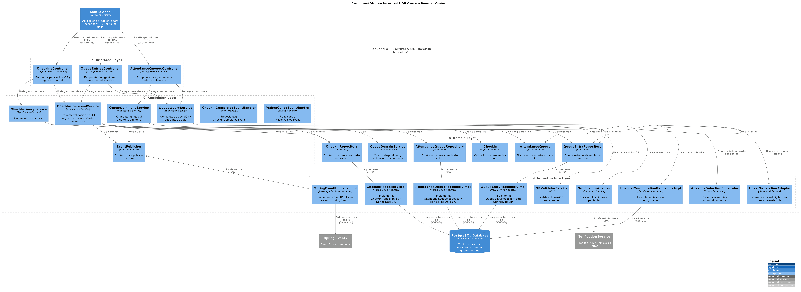

---
El diagrama de componentes del bounded context Arrival & QR Check-in muestra la organización interna del Backend API en sus cuatro capas. En la Interface Layer, los controladores CheckInsController, AttendanceQueuesController y QueueEntriesController exponen los endpoints REST para validar el QR, registrar el check-in y gestionar la cola de asistencia. En la Application Layer, los Command Services y Query Services orquestan los casos de uso, junto con los Event Handlers que reaccionan a los eventos de check-in completado y paciente llamado. En la Domain Layer, los aggregates CheckIn y AttendanceQueue encapsulan las reglas de negocio, junto con el QueueDomainService (que calcula la posición y valida la tolerancia) y las interfaces de repositorio. En la Infrastructure Layer, los adapters implementan la persistencia con Spring Data JPA (CheckInRepositoryImpl, AttendanceQueueRepositoryImpl, QueueEntryRepositoryImpl, HospitalConfigurationRepositoryImpl), la validación del QR firmado por el backend (JwtQRValidator), la generación del ticket digital (TicketGenerationAdapter), el envío de notificaciones (NotificationAdapter), la publicación de eventos con Spring Events (SpringEventPublisherImpl) y la detección automática de ausencias (AbsenceDetectionScheduler). La comunicación con la base de datos PostgreSQL se realiza mediante JDBC/JPA.

#### 2.6.4.6. Bounded Context Software Architecture Code Level Diagrams

##### 2.6.4.6.1. Bounded Context Domain Layer Class Diagrams

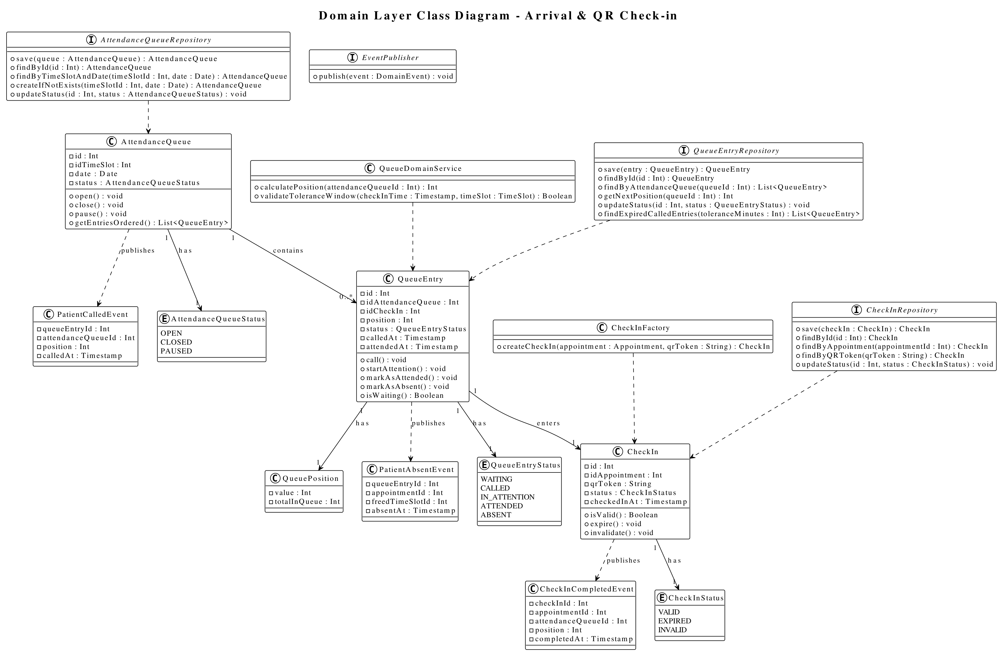

---
El diagrama de clases del dominio del bounded context Arrival & QR Check-in representa los aggregates root CheckIn y AttendanceQueue, junto con la entity QueueEntry y el value object QueuePosition. Se muestran los enums CheckInStatus, AttendanceQueueStatus y QueueEntryStatus que definen los estados posibles de cada componente, la factory CheckInFactory que encapsula la creación de check-ins, el QueueDomainService que encapsula el cálculo de posición y la validación de la ventana de tolerancia, y las interfaces CheckInRepository, AttendanceQueueRepository, QueueEntryRepository y EventPublisher que definen los contratos de persistencia y publicación de eventos. Se muestran también los tres Domain Events que publica el aggregate: CheckInCompletedEvent, PatientCalledEvent y PatientAbsentEvent.

##### 2.6.4.6.2. Bounded Context Database Design Diagram

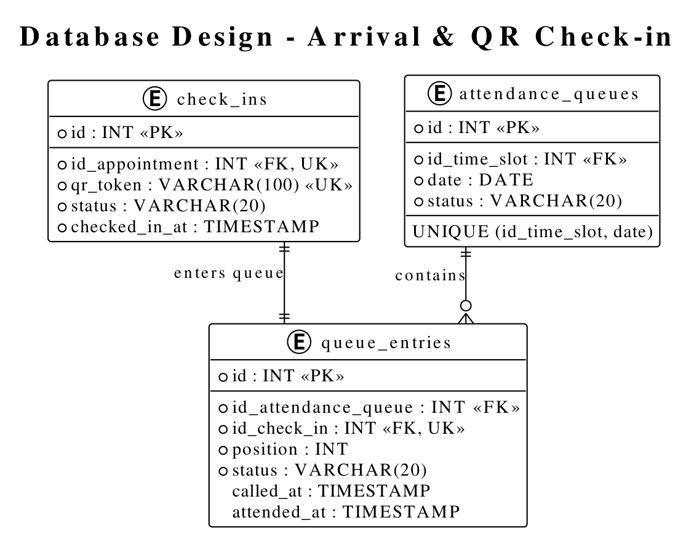

---
El diagrama de base de datos del bounded context Arrival & QR Check-in muestra las tablas check_ins, attendance_queues y queue_entries, junto con sus columnas, claves primarias, claves foráneas y restricciones de unicidad. La tabla check_ins almacena la validación de presencia del paciente con una foreign key hacia appointments. La tabla attendance_queues representa la fila de asistencia por time_slot y fecha, con una foreign key hacia time_slots. La tabla queue_entries almacena las entradas individuales de cada paciente en la cola, con foreign keys hacia attendance_queues y check_ins, y un campo position que determina el orden de atención por timestamp de check-in.

---

### 2.6.5. Bounded Context: Hospital Operations & Configuration

El **bounded context de Hospital Operations & Configuration** gestiona la configuración operativa del establecimiento de salud y provee dashboards y reportes para monitorear la operación diaria, el ausentismo y la demanda de servicios. Parametriza el comportamiento de los demás bounded contexts mediante reglas configurables como la capacidad máxima por bloque horario, las tolerancias de check-in y post-llamado, el tiempo de respuesta para la reasignación y los plazos de reserva y cancelación.

#### 2.6.5.1. Domain Layer

La capa de **Domain** representa el núcleo del negocio de configuración y operación del hospital. Aquí se definen las entidades, value objects, enums e interfaces que encapsulan las reglas operativas.

##### HospitalConfiguration (Aggregate Root)

**Atributos:**
`id`, `maxCapacityPerSlot`, `bookingOrderScope: BookingOrderScope`, `checkInToleranceMinutes`, `postCallToleranceMinutes`, `reassignmentResponseTimeoutMin`, `bookingCutoffTime`, `cancellationDeadlineHours`, `attendanceQueueVisible`, `updatedAt`

**Métodos:**
- `updateMaxCapacity(value)` → valida que sea mayor a 0 y actualiza la capacidad máxima por bloque.
- `updateTolerances(checkIn, postCall)` → valida que sean mayores o iguales a 0 y actualiza las tolerancias.
- `updateReassignmentTimeout(value)` → valida que sea mayor o igual a 0 y actualiza el timeout de reasignación.
- `updateBookingCutoffTime(value)` → actualiza la hora límite para reservar citas.
- `updateCancellationDeadline(value)` → actualiza el plazo mínimo para cancelar citas.
- `validate()` → valida que todos los parámetros sean coherentes entre sí.

**Propósito:**
Representa la configuración operativa del establecimiento. Es aggregate root porque agrupa todos los parámetros operativos que parametrizan el comportamiento de los demás bounded contexts.

---

##### BookingOrderScope (Enum)

**Valores posibles:**
`GLOBAL`, `PER_SPECIALTY`

**Propósito:**
Define si el `bookingOrder` se calcula de forma global al establecimiento o por especialidad.

---

##### HospitalConfigurationRepository (Interface)

**Métodos:**
- `save(config: HospitalConfiguration): HospitalConfiguration`
- `findDefault(): HospitalConfiguration?`
- `update(config: HospitalConfiguration): HospitalConfiguration`

**Propósito:**
Define las operaciones de persistencia para la configuración del hospital.

---

##### EventPublisher (Interface)

**Métodos:**
- `publish(event: DomainEvent)`

**Propósito:**
Define la interfaz para publicar eventos de dominio. La implementación concreta usa Spring Events.

---

#### 2.6.5.2. Interface Layer

La **Interface Layer** expone las funcionalidades del bounded context mediante endpoints REST.

##### ConfigurationController (REST API Controller)

**Endpoints:**
- `GET /api/v1/config` → Obtiene la configuración actual del hospital.
- `PUT /api/v1/config` → Actualiza la configuración operativa.
- `GET /api/v1/config/reports` → Genera un reporte operativo en PDF/CSV.
- `GET /api/v1/config/dashboard` → Obtiene métricas operativas del hospital.

**Explicación:**
Este controlador gestiona las operaciones sobre el aggregate `HospitalConfiguration`, incluyendo la consulta y actualización de parámetros, la generación de reportes y la visualización de métricas en el dashboard.

---

#### 2.6.5.3. Application Layer

La **Application Layer** orquesta los casos de uso del dominio mediante **Command Services** y **Query Services**. Los **Command Handlers** viven dentro de los Command Services, y los **Event Handlers** en `application/internal/eventhandlers/`.

##### ConfigurationCommandService (Interface)

**Métodos (Command Handlers):**
- `updateConfiguration(command: UpdateConfigurationCommand): HospitalConfiguration`

**Propósito:**
Define los comandos relacionados con la configuración operativa.

---

##### ConfigurationQueryService (Interface)

**Métodos (Query Handlers):**
- `getConfiguration(): HospitalConfiguration?`
- `generateReport(query: GenerateReportQuery): Report`
- `getDashboard(query: GetDashboardQuery): Dashboard`

**Propósito:**
Define las consultas relacionadas con la configuración, reportes y dashboard.

---

##### ConfigurationCommandServiceImpl (Implementation)

**Responsabilidad:** Implementar los comandos de configuración.

**Flujo de `updateConfiguration`:**
1. Recibe los nuevos parámetros de configuración.
2. Valida que los parámetros sean coherentes usando el método `validate()` del aggregate.
3. Actualiza la configuración en el repositorio.
4. Publica el evento `ConfigurationUpdatedEvent`.
5. Retorna la configuración actualizada.

---

##### ConfigurationUpdatedEventHandler (Event Handler)

**Responsabilidad:** Reaccionar al evento `ConfigurationUpdatedEvent`.
**Flujo:**
1. Escucha el evento `ConfigurationUpdatedEvent`.
2. Actualiza la caché local de los bounded contexts que consumen la configuración.
3. Registra la acción en el log de auditoría.

---

#### 2.6.5.4. Infrastructure Layer

La capa de **Infrastructure** contiene las implementaciones concretas.

##### HospitalConfigurationRepositoryImpl
**Implementa:** `HospitalConfigurationRepository`
**Tecnología:** Spring Data JPA + PostgreSQL
**Explicación:**
Ejecuta operaciones sobre la tabla `hospital_configurations`. Como es un singleton, siempre retorna el único registro existente.

---

##### ReportGeneratorAdapter
**Función:**
Genera reportes operativos en formato PDF y CSV a partir de los datos de atención, ausentismo y demanda.
**Tecnología:** iText / Apache POI

---

##### SpringEventPublisherImpl
**Implementa:** `EventPublisher`
**Función:**
Publica eventos de dominio usando Spring Events.
**Tecnología:** `ApplicationEventPublisher` de Spring

---

#### 2.6.5.5. Bounded Context Software Architecture Component Level Diagrams

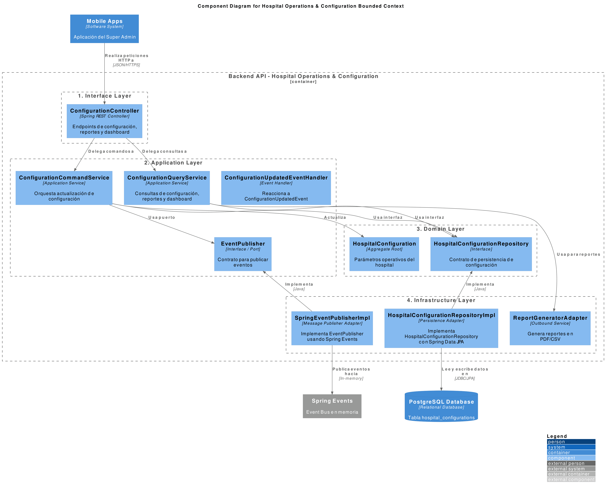

El diagrama de componentes del bounded context Hospital Operations & Configuration muestra la organización interna del Backend API en sus cuatro capas. En la Interface Layer, el ConfigurationController expone los endpoints REST para consultar y actualizar la configuración, generar reportes y visualizar el dashboard. En la Application Layer, los Command Services y Query Services orquestan los casos de uso, junto con el ConfigurationUpdatedEventHandler que reacciona a los cambios de configuración. En la Domain Layer, el aggregate HospitalConfiguration encapsula las reglas operativas del establecimiento, junto con la interfaz HospitalConfigurationRepository. En la Infrastructure Layer, los adapters implementan la persistencia con Spring Data JPA (HospitalConfigurationRepositoryImpl), la generación de reportes (ReportGeneratorAdapter) y la publicación de eventos con Spring Events (SpringEventPublisherImpl). La comunicación con la base de datos PostgreSQL se realiza mediante JDBC/JPA.

#### 2.6.5.6. Bounded Context Software Architecture Code Level Diagrams

##### 2.6.5.6.1. Bounded Context Domain Layer Class Diagrams

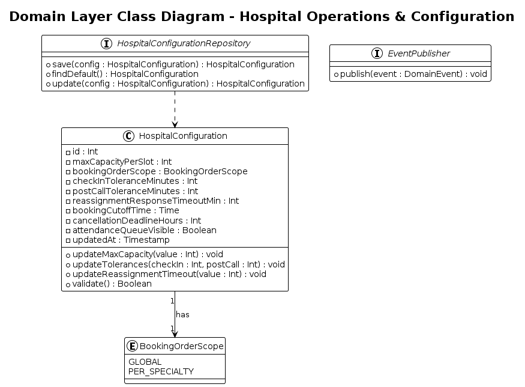

El diagrama de clases del dominio del bounded context Hospital Operations & Configuration representa el aggregate root HospitalConfiguration que encapsula los parámetros operativos del establecimiento, junto con el enum BookingOrderScope que define el alcance del bookingOrder, la interfaz HospitalConfigurationRepository que define el contrato de persistencia y la interfaz EventPublisher que define el contrato para publicar eventos de dominio.

##### 2.6.5.6.2. Bounded Context Database Design Diagram

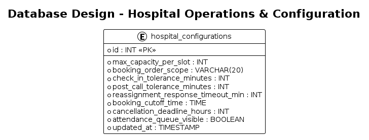

El diagrama de base de datos del bounded context Hospital Operations & Configuration muestra la tabla hospital_configurations, que almacena los parámetros operativos del establecimiento. La tabla es un singleton, es decir, contiene un único registro que define la configuración global del hospital. Los campos incluyen la capacidad máxima por bloque horario, el alcance del bookingOrder, las tolerancias de check-in y post-llamado, el timeout de reasignación, la hora de corte para reservas, el plazo de cancelación y la visibilidad de la cola de asistencia.

# Conclusiones

## Conclusiones y recomendaciones

A partir del análisis realizado y de la validación de las hipótesis planteadas, se presentan las siguientes conclusiones y recomendaciones:

### Conclusiones

- La problemática planteada sobre la ineficiencia en el acceso a citas en establecimientos públicos de salud se confirmó a través del análisis de contexto y entrevistas, demostrando que la dependencia exclusiva de canales presenciales o telefónicos genera colas prolongadas y desinformación.

- El supuesto de negocio respecto a la demanda no atendida por soluciones digitales fue validado con éxito, dado que todos los pacientes entrevistados consideraron de alta utilidad consultar la disponibilidad de cupos en tiempo real desde sus dispositivos.

- Al contrastar las suposiciones con el comportamiento real del segmento de pacientes, se evidenció que la mayoría no ha utilizado aplicaciones médicas previamente. Sin embargo, se sienten cómodos realizando trámites desde sus celulares, lo que confirma la viabilidad de adopción de la plataforma.

- Las hipótesis operativas orientadas a mejorar el control del flujo de atención fueron validadas por el personal administrativo, quienes confirmaron que la gestión manual actual mediante cuadernos y hojas de cálculo provoca pérdida de información y desorganización operativa.

- Se concluye que la lista de espera dinámica y las notificaciones automatizadas responden directamente a los criterios de éxito del proyecto, asegurando el reaprovechamiento de cupos cancelados y mitigando los viajes innecesarios de los usuarios.

- La hipótesis sobre la reducción del tiempo de espera percibido es respaldada por la estructuración técnica del sistema, el cual incluye un mecanismo de registro de llegada (*check-in*) por código QR diseñado para descongestionar las ventanillas físicas.

### Recomendaciones

- **Despliegue incremental basado en el Product Backlog:** Se recomienda ejecutar la priorización del MVP definida en los Sprints 1 y 2, liberando inicialmente el motor de reservas (*Appointments & Booking*), la validación de identidad y el *check-in* por QR, debido a que estos componentes representan el núcleo de valor para descongestionar el flujo presencial de pacientes.

- **Evolución hacia la Reprogramación Inteligente:** Para futuras versiones, se recomienda integrar un sistema de sugerencias inteligentes de horarios y la posibilidad de reprogramación automática, con el objetivo de resolver de manera proactiva los cruces de agenda y mejorar la experiencia del módulo central de citas.

- **Ampliación de mecanismos de Check-in:** A partir de las oportunidades identificadas en el contexto *Arrival & QR Check-in*, se recomienda evaluar en futuras versiones mecanismos alternativos de validación, como el reconocimiento facial, para facilitar el acceso de pacientes que no cuenten con un dispositivo móvil al momento de su atención.

