

  

<strong>Universidad Peruana de Ciencias Aplicadas</strong>

<strong>Carrera de Ingeniería de Software</strong>

 

<strong>1ACC0238</strong>

<strong>Aplicaciones para Dispositivos Móviles</strong>

NRC

<strong>4945</strong>

<h2 align="center" style="text-align:center">Informe del Trabajo Final</h2>

Docente

<strong>Mayta Guillermo, Jorge Luis</strong>

 

Equipo

<strong>RuwaLabs</strong>

Proyecto

<strong>SaludYa</strong>

 

<strong>Integrantes</strong>

<table align="center" style="margin-left:auto;margin-right:auto">
  <tr><th>Código</th><th>Apellidos y nombres</th></tr>
  <tr><td>u202318309</td><td>Aguilar Untiveros, Rodrigo Fabrizio</td></tr>
  <tr><td>u202319950</td><td>Meza Solórzano, Didier Sebastian</td></tr>
  <tr><td>u20241d934</td><td>Montoya Nina, Paula Fernanda</td></tr>
  <tr><td>u20241e418</td><td>Ramos Mera, Neo Daniel</td></tr>
  <tr><td>u202624323</td><td>Torres Juárez, Alisee Muriel</td></tr>
</table>

<strong>Período 202620</strong>

<strong>Septiembre 2026</strong>

---
<!-- pdf-pagebreak -->
# Registro de Versiones del Informe

El registro de versiones permite seguir las fechas, los responsables y las modificaciones realizadas durante la elaboración del informe, como se detalla en la [Tabla 1](#tabla-1).

**Tabla 1**

*Historial de versiones del reporte*

| Versión | Fecha | Autor | Descripción de modificación |
| :--- | :--- | :--- | :--- |
| 1.0.0 | 08-28-26 | Montoya Nina, Paula Fernanda | Se agregó la estructura base del documento, la Carátula, registro de versiones y el formato inicial del Student Outcome. |
| 1.1.0 | 09-02-26 | Meza Solórzano, Didier Sebastian | Se creó la estructura de carpetas y archivos base del informe (chapter-01 a chapter-06, conclusions, bibliography y glossary). |
| 1.2.0 | 09-13-26 | Aguilar Untiveros, Rodrigo Fabrizio | Se agregó la sección de Software Architecture del Capítulo II: Context Level Diagrams, Container Level Diagrams, Deployment Diagrams, Context Mapping, Bounded Context Canvases, Domain Message Flows Modeling y Candidate Context Discovery. |
| 1.3.0 | 09-16-26 | Meza Solórzano, Didier Sebastian | Se agregó la evidencia de la entrevista 6 y las evidencias de entrevistas del Capítulo II. |
| 1.4.0 | 09-17-26 | Meza Solórzano, Didier Sebastian | Se agregó la evidencia de las entrevistas 5 y 2 del Capítulo II. |
| 1.5.0 | 09-17-26 | Aguilar Untiveros, Rodrigo Fabrizio | Se actualizó el Capítulo II incorporando las dos colas complementarias (Booking Order y Attendance Queue): EventStorming, Candidate Context Discovery, Domain Message Flows, Bounded Context Canvases, Context Mapping, Container Level Diagram y sus diagramas asociados. |
| 1.6.0 | 09-18-26 | Torres Juárez, Alisee Muriel | Se documentó el bounded context de Identity & Access Management (capas Domain, Interface, Application e Infrastructure), se refactorizaron encabezados de sección, se revisó la numeración y se mejoraron las descripciones de los diagramas del Capítulo II. |
| 1.7.0 | 09-18-26 | Meza Solórzano, Didier Sebastian | Se agregó información adicional del Capítulo II y se actualizó el nombre del capítulo. |
| 1.8.0 | 09-18-26 | Ramos Mera, Neo Daniel | Se agregó información al apartado Tactical-Level Domain-Driven Design. |
| 1.9.0 | 09-18-26 | Montoya Nina, Paula Fernanda | Se agregó información al apartado Tactical-Level Domain-Driven Design. |

*Nota. Elaboración del equipo RuwaLabs para el proyecto SaludYa.*

<!-- pdf-pagebreak -->
# Project Report Collaboration Insights

**Figura 1**

*Colaboración en GitHub: evidencia 1*

*Nota. Captura del registro de colaboración del repositorio en GitHub.*

Las capturas del repositorio documentan la participación del equipo y permiten revisar el registro de contribuciones al informe, como se observa en la [Figura 1](#figura-1) y la [Figura 2](#figura-2).

**Figura 2**

*Colaboración en GitHub: evidencia 2*

*Nota. Captura del registro de colaboración del repositorio en GitHub.*

<!-- pdf-pagebreak -->

**Figura 3**

*Colaboración en GitHub: evidencia 3*

*Nota. Captura del registro de colaboración del repositorio en GitHub.*

La actividad del equipo en GitHub queda registrada en la organización [RuwaLabs](https://github.com/RuwaLabs), como se observa en la [Figura 3](#figura-3).

URL del Repositorio del Project Report: [upc-pre-202620-1acc0238-4945-RuwaLabs-report](https://github.com/RuwaLabs/upc-pre-202620-1acc0238-4945-RuwaLabs-report)

---
<!-- pdf-pagebreak -->
# Contenido

- [Registro de Versiones del Informe](#registro-de-versiones-del-informe)
- [Project Report Collaboration Insights](#project-report-collaboration-insights)
- [Contenido](#contenido)
- [Student Outcome](#student-outcome)
- [Objetivos SMART](#objetivos-smart)
- [Capítulo I: Presentación](#capítulo-i-presentación)
  - [1.1. Startup Profile](#11-startup-profile)
    - [1.1.1. Descripción de la Startup](#111-descripción-de-la-startup)
    - [1.1.2. Perfiles de integrantes del equipo](#112-perfiles-de-integrantes-del-equipo)
  - [1.2. Solution Profile](#12-solution-profile)
    - [1.2.1. Antecedentes y problemática](#121-antecedentes-y-problemática)
    - [1.2.2. Lean UX Process](#122-lean-ux-process)
      - [1.2.2.1. Lean UX Problem Statements](#1221-lean-ux-problem-statements)
      - [1.2.2.2. Lean UX Assumptions](#1222-lean-ux-assumptions)
      - [1.2.2.3. Lean UX Hypothesis Statements](#1223-lean-ux-hypothesis-statements)
      - [1.2.2.4. Lean UX Canvas](#1224-lean-ux-canvas)
  - [1.3. Segmentos objetivo](#13-segmentos-objetivo)
- [Capítulo II: Requirements Development and Software Solution Design](#capítulo-ii-requirements-development-and-software-solution-design)
  - [2.1. Competidores](#21-competidores)
    - [2.1.1. Análisis competitivo](#211-análisis-competitivo)
    - [2.1.2. Estrategias y tácticas frente a competidores](#212-estrategias-y-tácticas-frente-a-competidores)
  - [2.2. Entrevistas](#22-entrevistas)
    - [2.2.1. Diseño de entrevistas](#221-diseño-de-entrevistas)
    - [2.2.2. Registro de entrevistas](#222-registro-de-entrevistas)
    - [2.2.3. Análisis de entrevistas](#223-análisis-de-entrevistas)
  - [2.3. Needfinding](#23-needfinding)
    - [2.3.1. User Personas](#231-user-personas)
    - [2.3.2. User Task Matrix](#232-user-task-matrix)
    - [2.3.3. User Journey Mapping](#233-user-journey-mapping)
    - [2.3.4. Empathy Mapping](#234-empathy-mapping)
    - [2.3.5. Big Picture EventStorming](#235-big-picture-eventstorming)
    - [2.3.6. Ubiquitous Language](#236-ubiquitous-language)
  - [2.4. Requirements specification](#24-requirements-specification)
    - [2.4.1. User Stories](#241-user-stories)
    - [2.4.2. Impact Mapping](#242-impact-mapping)
    - [2.4.3. Product Backlog](#243-product-backlog)
  - [2.5. Strategic-Level Domain-Driven Design](#25-strategic-level-domain-driven-design)
    - [2.5.1. EventStorming](#251-eventstorming)
      - [2.5.1.1. Candidate Context Discovery](#2511-candidate-context-discovery)
      - [2.5.1.2. Domain Message Flows Modeling](#2512-domain-message-flows-modeling)
      - [2.5.1.3. Bounded Context Canvases](#2513-bounded-context-canvases)
    - [2.5.2. Context Mapping](#252-context-mapping)
    - [2.5.3. Software Architecture](#253-software-architecture)
      - [2.5.3.1. Software Architecture Context Level Diagrams](#2531-software-architecture-context-level-diagrams)
      - [2.5.3.2. Software Architecture Container Level Diagrams](#2532-software-architecture-container-level-diagrams)
      - [2.5.3.3. Software Architecture Deployment Diagrams](#2533-software-architecture-deployment-diagrams)
  - [2.6. Tactical-Level Domain-Driven Design](#26-tactical-level-domain-driven-design)
    - [2.6.1. Bounded Context: Identity & Access Management](#261-bounded-context-identity--access-management)
      - [2.6.1.1. Domain Layer](#2611-domain-layer)
      - [2.6.1.2. Interface Layer](#2612-interface-layer)
      - [2.6.1.3. Application Layer](#2613-application-layer)
      - [2.6.1.4. Infrastructure Layer](#2614-infrastructure-layer)
      - [2.6.1.5. Bounded Context Software Architecture Component Level Diagrams](#2615-bounded-context-software-architecture-component-level-diagrams)
      - [2.6.1.6. Bounded Context Software Architecture Code Level Diagrams](#2616-bounded-context-software-architecture-code-level-diagrams)
        - [2.6.1.6.1. Bounded Context Domain Layer Class Diagrams](#26161-bounded-context-domain-layer-class-diagrams)
        - [2.6.1.6.2. Bounded Context Database Design Diagram](#26162-bounded-context-database-design-diagram)
    - [2.6.2. Bounded Context: Appointments & Booking](#262-bounded-context-appointments--booking)
      - [2.6.2.1. Domain Layer](#2621-domain-layer)
      - [2.6.2.2. Interface Layer](#2622-interface-layer)
      - [2.6.2.3. Application Layer](#2623-application-layer)
      - [2.6.2.4. Infrastructure Layer](#2624-infrastructure-layer)
      - [2.6.2.5. Bounded Context Software Architecture Component Level Diagrams](#2625-bounded-context-software-architecture-component-level-diagrams)
      - [2.6.2.6. Bounded Context Software Architecture Code Level Diagrams](#2626-bounded-context-software-architecture-code-level-diagrams)
        - [2.6.2.6.1. Bounded Context Domain Layer Class Diagrams](#26261-bounded-context-domain-layer-class-diagrams)
        - [2.6.2.6.2. Bounded Context Database Design Diagram](#26262-bounded-context-database-design-diagram)
    - [2.6.3. Bounded Context: Reassignment](#263-bounded-context-reassignment)
      - [2.6.3.1. Domain Layer](#2631-domain-layer)
      - [2.6.3.2. Interface Layer](#2632-interface-layer)
      - [2.6.3.3. Application Layer](#2633-application-layer)
      - [2.6.3.4. Infrastructure Layer](#2634-infrastructure-layer)
      - [2.6.3.5. Bounded Context Software Architecture Component Level Diagrams](#2635-bounded-context-software-architecture-component-level-diagrams)
      - [2.6.3.6. Bounded Context Software Architecture Code Level Diagrams](#2636-bounded-context-software-architecture-code-level-diagrams)
        - [2.6.3.6.1. Bounded Context Domain Layer Class Diagrams](#26361-bounded-context-domain-layer-class-diagrams)
        - [2.6.3.6.2. Bounded Context Database Design Diagram](#26362-bounded-context-database-design-diagram)
    - [2.6.4. Bounded Context: Arrival & QR Check-in](#264-bounded-context-arrival--qr-check-in)
      - [2.6.4.1. Domain Layer](#2641-domain-layer)
      - [2.6.4.2. Interface Layer](#2642-interface-layer)
      - [2.6.4.3. Application Layer](#2643-application-layer)
      - [2.6.4.4. Infrastructure Layer](#2644-infrastructure-layer)
      - [2.6.4.5. Bounded Context Software Architecture Component Level Diagrams](#2645-bounded-context-software-architecture-component-level-diagrams)
      - [2.6.4.6. Bounded Context Software Architecture Code Level Diagrams](#2646-bounded-context-software-architecture-code-level-diagrams)
        - [2.6.4.6.1. Bounded Context Domain Layer Class Diagrams](#26461-bounded-context-domain-layer-class-diagrams)
        - [2.6.4.6.2. Bounded Context Database Design Diagram](#26462-bounded-context-database-design-diagram)
    - [2.6.5. Bounded Context: Hospital Operations & Configuration](#265-bounded-context-hospital-operations--configuration)
      - [2.6.5.1. Domain Layer](#2651-domain-layer)
      - [2.6.5.2. Interface Layer](#2652-interface-layer)
      - [2.6.5.3. Application Layer](#2653-application-layer)
      - [2.6.5.4. Infrastructure Layer](#2654-infrastructure-layer)
      - [2.6.5.5. Bounded Context Software Architecture Component Level Diagrams](#2655-bounded-context-software-architecture-component-level-diagrams)
      - [2.6.5.6. Bounded Context Software Architecture Code Level Diagrams](#2656-bounded-context-software-architecture-code-level-diagrams)
        - [2.6.5.6.1. Bounded Context Domain Layer Class Diagrams](#26561-bounded-context-domain-layer-class-diagrams)
        - [2.6.5.6.2. Bounded Context Database Design Diagram](#26562-bounded-context-database-design-diagram)
- [Conclusiones](#conclusiones)
- [Bibliografía](#bibliografía)
- [Anexos](#anexos)

---

<!-- pdf-pagebreak -->

# Student Outcome

El curso contribuye al cumplimiento del Student Outcome ABET:
**ABET - EAC - Student Outcome 7**
**Criterio:** *La capacidad de adquirir y aplicar nuevos conocimientos según sea necesario, utilizando estrategias de aprendizaje apropiadas.*
En el siguiente cuadro se describe las acciones realizadas y enunciados de conclusiones por parte del grupo, que permiten sustentar el haber alcanzado el logro del ABET – EAC - Student Outcome 7, como se detalla en la [Tabla 2](#tabla-2).

**Tabla 2**

*Acciones y conclusiones para el Student Outcome 7*

<table>
  <thead>
    <tr style="break-inside:auto">
      <th>Criterio específico</th>
      <th>Acciones realizadas</th>
      <th>Conclusiones</th>
    </tr>
  </thead>
  <tbody>
    <tr style="break-inside:auto">
      <td width="25%">
        Actualiza conceptos y conocimientos necesarios para su desarrollo profesional y en especial para su proyecto en soluciones de software.
      </td>
      <td width="50%">
        <strong>Aguilar Untiveros, Rodrigo Fabrizio</strong>
        <ul>
          <li><strong>AV1:</strong> Apliqué nuevos conocimientos sobre EventStorming, Candidate Context Discovery, Domain Message Flows Modeling, Bounded Context Canvases, Context Mapping y el modelo C4 para documentar la arquitectura de SaludYa. Asimismo, incorporé los conceptos de las dos colas complementarias del dominio (Booking Order y Attendance Queue), refinando los bounded contexts existentes y actualizando los diagramas de EventStorming, Context Mapping y Container Level Diagram.</li>
        </ul>
       <strong>Meza Solórzano, Didier Sebastian</strong>
<ul>
  <li><strong>AV1:</strong> Apliqué nuevos conocimientos sobre la técnica 5W2H, el diagrama de Ishikawa, la metodología Lean UX, el análisis competitivo y el diseño de entrevistas para desarrollar de principio a fin la problemática, la solución y la validación con usuarios de SaludYa.</li>
</ul>
        <strong>Montoya Nina, Paula Fernanda</strong>
        <ul>
          <li><strong>AV1:</strong> Investigué y apliqué conceptos avanzados de arquitectura de software para documentar el diseño a nivel de código de los Bounded Contexts. Esto incluyó la definición técnica de controladores, servicios y repositorios, plasmando esta lógica de negocio en diagramas relacionales de base de datos y diagramas de clases precisos para el proyecto.</li>
        </ul> 
        <strong>Ramos Mera, Neo Daniel</strong>
        <ul>
          <li><strong>AV1:</strong> Apliqué nuevos conocimientos sobre el modelado táctico de Domain-Driven Design (DDD), estructurando correctamente las capas de Dominio, Aplicación, Interfaz e Infraestructura. Asimismo, aprendí y utilicé estándares de modelado C4 y UML para elaborar los diagramas de componentes, clases y base de datos de los Bounded Contexts asignados.
</li>
        </ul>
        <strong>Torres Juárez, Alisee Muriel</strong>
        <ul>
          <li><strong>AV1:</strong> Apliqué nuevos conocimientos sobre EventStorming, diagramas de usuario y la redacción de User Stories para desarrollar de principio a fin la problemática, la solución y la validación de SaludYa </li>
        </ul>
      </td>
      <td width="25%">
        
<strong>AV1:</strong> 
        Como equipo, actualizamos de forma práctica nuestros conocimientos en el análisis y modelado de software, integrando metodologías como Lean UX, EventStorming y Domain-Driven Design (DDD). Esto nos permitió diseñar una arquitectura sólida, documentada con diagramas tácticos, estratégicos y de bases de datos, alineando la solución tecnológica a las necesidades reales del sector salud.

      </td>
    </tr>
    <tr style="break-inside:auto">
      <td>
        Reconoce la necesidad del aprendizaje permanente para el desempeño profesional y el desarrollo de proyectos en soluciones de software.
      </td>
      <td>
        <strong>Aguilar Untiveros, Rodrigo Fabrizio</strong>
        <ul>
          <li><strong>AV1:</strong> Reconocí la necesidad de investigar de forma autónoma técnicas de modelado estratégico y táctico que no había aplicado antes, como EventStorming y Domain-Driven Design, para sustentar con criterios arquitectónicos sólidos el diseño de SaludYa. La correcta delimitación de los bounded contexts y la identificación de las dos colas del dominio me exigieron un análisis profundo para alinear el lenguaje ubicuo con la arquitectura del sistema.</li>
        </ul>
        <strong>Meza Solórzano, Didier Sebastian</strong>
<ul>
  <li><strong>AV1:</strong> Reconocí la necesidad de seguir aprendiendo de forma autónoma metodologías que no había aplicado antes, como Lean UX y el diseño de entrevistas cualitativas, para poder sustentar con información real el desarrollo de SaludYa.</li>
</ul>
        <strong>Montoya Nina, Paula Fernanda</strong>
        <ul>
          <li><strong>AV1:</strong> Comprendí que diseñar soluciones de software requiere una constante actualización en metodologías como DDD. Buscar y estudiar información sobre patrones de integración y persistencia por mi cuenta me permitió resolver problemas técnicos complejos al definir las capas de infraestructura y dominio de SaludYa.
</li>
        </ul>
        <strong>Ramos Mera, Neo Daniel</strong>
        <ul>
          <li><strong>AV1:</strong> Reconocí la importancia de investigar de manera autónoma sobre arquitectura hexagonal y patrones de diseño. Entendí que este aprendizaje continuo es indispensable para definir correctamente entidades, agregados y repositorios, garantizando que el diseño del software sea escalable y mantenible en el entorno profesional.</li>
        </ul>
        <strong>Torres Juárez, Alisee Muriel</strong>
        <ul>
          <li><strong>AV1:</strong> Reconocí la importancia de poner en práctica herramientas y metodologías que no había aplicado antes —como el EventStorming, los diagramas de usuario y la estructuración de User Stories para sustentar y modelar con precisión el desarrollo de SaludYa. La correcta definición de las User Stories técnicas, me exigió un análisis mucho más profundo para alinear los eventos del sistema con la arquitectura tecnológica</li>
        </ul>
      </td>
      <td>
        
<strong>AV1:</strong>  El equipo reconoció que el aprendizaje autónomo es un pilar fundamental en el desarrollo del proyecto. La exigencia de investigar y dominar nuevas herramientas tecnológicas, técnicas de entrevistas y patrones arquitectónicos nos demostró que la actualización constante es la única vía para proponer soluciones de software de calidad.

      </td>
    </tr>
  </tbody>
</table>

*Nota. Elaboración del equipo RuwaLabs para el proyecto SaludYa.*

<!-- pdf-pagebreak -->

# Objetivos SMART

En esta sección, cada integrante del equipo formula un plan de desarrollo profesional posterior a su graduación, compuesto por al menos dos objetivos **SMART**. Cada objetivo es **específico** (s), **medible** (m), **alcanzable** (a), **relevante** (r) y cuenta con un **plazo** definido (t), con el fin de evidenciar de manera clara y cuantificable cómo cada miembro planea mantener un crecimiento profesional continuo una vez finalizada su carrera.

## Objetivos SMART – Aguilar Untiveros, Rodrigo Fabrizio

**Plan de desarrollo profesional:** Consolidar su perfil como desarrollador de aplicaciones móviles e insertarse en el mercado laboral tecnológico, fortaleciendo sus competencias mediante certificaciones y experiencia práctica, como se detalla en la [Tabla 3](#tabla-3).

**Tabla 3**

*Objetivos SMART – Aguilar Untiveros, Rodrigo Fabrizio*

| N.º | Objetivo SMART | Plazo |
|:---:|:---|:---|
| 1 | Obtener la certificación *Google Associate Android Developer* para especializarme en el desarrollo de aplicaciones móviles nativas, completando un plan de estudio de 8 horas semanales y aprobando el examen oficial con una puntuación superior a 80/100. | Diciembre 2027 |
| 2 | Incorporarme como desarrollador móvil en una empresa de tecnología peruana, postulando a un mínimo de 10 ofertas por mes y participando en al menos 3 procesos de selección por trimestre hasta concretar mi primera contratación. | 12 meses tras la graduación |

*Nota. Elaboración del equipo RuwaLabs para el proyecto SaludYa.*

## Objetivos SMART – Meza Solórzano, Didier Sebastian

**Plan de desarrollo profesional:** Especializarse en el desarrollo multiplataforma y complementar su formación con estudios de posgrado orientados al desarrollo de software móvil, como se detalla en la [Tabla 4](#tabla-4).

**Tabla 4**

*Objetivos SMART – Meza Solórzano, Didier Sebastian*

| N.º | Objetivo SMART | Plazo |
|:---:|:---|:---|
| 1 | Obtener la certificación oficial de *Flutter Developer* para dominar el desarrollo multiplataforma, desarrollando al menos 3 proyectos publicados en GitHub y aprobando la evaluación con un puntaje mínimo de 75/100. | Diciembre 2027 |
| 2 | Iniciar un posgrado o especialización en desarrollo de software móvil, aprobando los primeros 4 ciclos con un promedio ponderado no menor a 16/20 y manteniendo una dedicación de 10 horas semanales de estudio. | 2028 |

*Nota. Elaboración del equipo RuwaLabs para el proyecto SaludYa.*

<!-- pdf-pagebreak -->
## Objetivos SMART – Montoya Nina, Paula Fernanda

**Plan de desarrollo profesional:** Profundizar en la ingeniería y gestión de datos y en la arquitectura de software, combinando certificaciones técnicas con una maestría orientada a la especialización, como se detalla en la [Tabla 5](#tabla-5).

**Tabla 5**

*Objetivos SMART – Montoya Nina, Paula Fernanda*

| N.º | Objetivo SMART | Plazo |
|:---:|:---|:---|
| 1 | Obtener la certificación *Google Cloud Professional Data Engineer* para especializarme en la gestión de datos, mediante un plan de estudio de 6 horas semanales y la aprobación del examen oficial con un puntaje mínimo de 70/100. | Diciembre 2027 |
| 2 | Iniciar una maestría en Arquitectura de Software, culminando los dos primeros semestres con un promedio no menor a 16/20 y publicando un proyecto de arquitectura de datos al finalizar cada semestre. | 2027 |

*Nota. Elaboración del equipo RuwaLabs para el proyecto SaludYa.*

## Objetivos SMART – Ramos Mera, Neo Daniel

**Plan de desarrollo profesional:** Consolidar su perfil en redes y desarrollo backend, integrando certificaciones técnicas con experiencia laboral especializada, como se detalla en la [Tabla 6](#tabla-6).

**Tabla 6**

*Objetivos SMART – Ramos Mera, Neo Daniel*

| N.º | Objetivo SMART | Plazo |
|:---:|:---|:---|
| 1 | Obtener la certificación *Cisco Certified Network Associate (CCNA)* para fortalecer mis competencias en redes, completando 120 horas de laboratorio y aprobando el examen oficial 200-301 en el primer intento. | Junio 2027 |
| 2 | Desempeñarme como desarrollador backend en una empresa tecnológica, consolidando al menos una certificación cloud (AWS o Azure) y participando en un mínimo de 8 procesos de selección anuales. | 18 meses tras la graduación |

*Nota. Elaboración del equipo RuwaLabs para el proyecto SaludYa.*

## Objetivos SMART – Torres Juárez, Alisee Muriel

**Plan de desarrollo profesional:** Orientar su crecimiento hacia la gestión de proyectos tecnológicos, complementando su perfil técnico con certificaciones y estudios de especialización, como se detalla en la [Tabla 7](#tabla-7).

**Tabla 7**

*Objetivos SMART – Torres Juárez, Alisee Muriel*

| N.º | Objetivo SMART | Plazo |
|:---:|:---|:---|
| 1 | Obtener la certificación *Professional Scrum Master I (PSM I)* para fortalecer mis competencias en gestión de proyectos, aprobando el examen oficial con una puntuación mínima de 85% y gestionando al menos un proyecto académico bajo el marco Scrum. | Diciembre 2026 |
| 2 | Ingresar a un programa de especialización en gestión de proyectos tecnológicos, aprobando los dos primeros ciclos con un promedio no menor a 16/20 y liderando al menos un proyecto real durante el programa. | 2027 |

*Nota. Elaboración del equipo RuwaLabs para el proyecto SaludYa.*

<!-- pdf-pagebreak -->

# Capítulo 1: Presentación #

## 1.1. Startup Profile ##

En esta sección, se presenta una descripción general de RuwaLabs, startup orientada al desarrollo de soluciones digitales que buscan atender problemáticas reales mediante el uso de la tecnología, considerando las necesidades de los usuarios y las características del contexto en el que se desenvuelven.

### 1.1.1. Descripción de la Startup ###

En el contexto actual, donde el acceso oportuno a los servicios de salud representa un desafío para diversos sectores de la población, especialmente en establecimientos públicos de salud con una alta demanda de pacientes, RuwaLabs propone desarrollar soluciones tecnológicas orientadas a mejorar la experiencia de atención y optimizar los procesos relacionados con la gestión de citas médicas.

RuwaLabs es una startup comprometida con el desarrollo de soluciones digitales innovadoras, enfocadas en facilitar el acceso a servicios y mejorar procesos mediante el uso de tecnologías móviles. Como parte de esta iniciativa, se desarrolla **SaludYa**, una solución compuesta por aplicaciones móviles dirigidas tanto a pacientes como al personal asistencial y administrativo de establecimientos públicos de salud.

SaludYa busca reducir las dificultades asociadas a la gestión tradicional de citas médicas, como las largas colas presenciales, la alta demanda de cupos y la falta de información sobre la disponibilidad de atención. Para ello, la solución contempla funcionalidades como la reserva digital de citas, lista de espera dinámica, recordatorios de atención, gestión de citas de familiares y check-in mediante código QR.

Asimismo, SaludYa busca facilitar la gestión interna de los establecimientos de salud mediante herramientas que permitan al personal administrar citas y pacientes, visualizar el estado de la atención y mejorar el aprovechamiento de los cupos disponibles, como se detalla en la [Tabla 8](#tabla-8).

**Tabla 8**

*Misión, visión y valores de RuwaLabs*

<table>
    <tr>
        <th>Misión</th>
        <th>Visión</th>
        <th>Valores</th>
    </tr>
    <tr>
        <td> Desarrollar soluciones tecnológicas accesibles e innovadoras que permitan mejorar la experiencia de los usuarios y optimizar procesos relacionados con servicios de atención, utilizando la tecnología como herramienta para resolver necesidades reales. </td>
        <td> Ser una startup reconocida por desarrollar soluciones digitales innovadoras que contribuyan a mejorar el acceso a servicios esenciales y la eficiencia de los procesos mediante el uso de tecnologías móviles. </td>
        <td> Innovación, accesibilidad, compromiso, responsabilidad y orientación al usuario. </td>
    </tr>
</table>

*Nota. Elaboración del equipo RuwaLabs para el proyecto SaludYa.*

<!-- pdf-pagebreak -->
### 1.1.2. Perfiles de los integrantes del equipo ###

En esta sección, se presentan los perfiles de los integrantes del equipo, incluyendo sus habilidades y conocimientos técnicos relevantes para el desarrollo de **SaludYa**, como se detalla en la [Tabla 9](#tabla-9).

**Tabla 9**

*Perfiles de los integrantes del equipo*

<table>
    <tr>
        <th> Foto </th>
        <th> Integrante </th>
        <th> Código </th>
        <th> Carrera </th>
        <th> Habilidades y conocimientos técnicos </th>
    </tr>
    <tr>
        <td>  </td>
        <td>Aguilar Untiveros, Rodrigo Fabrizio</td>
        <td>u202318309</td>
        <td> Ingeniería de Software </td>
        <td>Soy estudiante de Ingeniería de Software interesado en el desarrollo de aplicaciones móviles y en la construcción de soluciones tecnológicas que resuelvan necesidades reales de las personas. Me considero una persona responsable, organizada y con facilidad para trabajar en equipo, además de comprometida con la mejora continua y la aplicación de buenas prácticas de desarrollo. Durante el proyecto busco fortalecer mis conocimientos técnicos y aportar en la implementación de una solución funcional y de calidad.</td>
    </tr>
        <td>  </td>
        <td>Meza Solórzano, Didier Sebastian</td>
        <td>u202319950</td>
        <td> Ingeniería de Software </td>
        <td>Soy estudiante de Ingeniería de Software interesado en el desarrollo de aplicaciones móviles y en soluciones tecnológicas orientadas a resolver problemas reales. Me considero una persona responsable, comprometida y con disposición para trabajar en equipo. Asimismo, busco aplicar buenas prácticas de desarrollo y mejorar continuamente mis conocimientos técnicos durante el desarrollo de proyectos.</td>
    </tr>
    <tr>
        <td>  </td>
        <td>Montoya Nina, Paula Fernanda</td>
        <td>u20241d934</td>
        <td> Ingeniería de Software </td>
        <td>Soy estudiante de Ingeniería de Software, interesada en la gestión de datos y en la arquitectura de Software. Tengo un enfoque de trabajo que prioriza la planificación y el orden estructural antes de iniciar cualquier implementación técnica. Mis fortalezas son la organización de flujos de trabajo eficiente y, además, puedo desempeñar múltiples roles dentro de un proyecto, ya sea en frontend o backend, aunque prefiero dedicarme a la gestión de datos. Mi propósito es profundizar mis conocimientos en la arquitectura de Software, además de mejorar mi capacidad de colaboración en equipo para contribuir activamente en la creación de soluciones tecnológicas.</td>
    </tr>
    <tr>
        <td>  </td>
        <td>Ramos Mera, Neo Daniel</td>
        <td> u20241e418 </td>
        <td> Ingeniería de Software </td>
        <td> Soy estudiante de Ingeniería de Software, interesado en la red y el backend. Me considero una persona responsable, atenta y también bastante cooperativa, ya que la comunicación y el trabajo en equipo son fundamentales para alcanzar el éxito en cualquier proyecto. Mi meta es especializarme en un campo en el que pueda trabajar con estos puntos, por lo que aspiro a participar en proyectos desafiantes que reten mis habilidades y conocimientos. </td>
    </tr>
    <tr>
        <td>  </td>
        <td>Torres Juárez, Alisee Muriel</td>
        <td> U202624323 </td>
        <td> Ingeniería de Software </td>
        <td> Soy estudiante de Ingeniería de Software interesada en la creación de soluciones tecnológicas que simplifiquen y agilicen procesos. Destaco por mi resiliencia, perseverancia y alta capacidad de adaptabilidad ante nuevos desafíos. </td>
    </tr>
</table>

*Nota. Elaboración del equipo RuwaLabs para el proyecto SaludYa.*

<!-- pdf-pagebreak -->

## 1.2. Solution Profile

En esta sección se describe el perfil de la solución propuesta por RuwaLabs, incluyendo los antecedentes y la problemática que aborda. Asimismo, se utiliza la técnica de las **5W's y 2H's** para comprender mejor el contexto, las necesidades de los usuarios y las condiciones en las que se presenta el problema.

La aplicación lleva por nombre **"SaludYa"**. El propósito de la aplicación se centra en la gestión eficiente de citas médicas en establecimientos públicos de salud, permitiendo a los pacientes acceder de forma oportuna a la reserva, seguimiento y *check-in* de sus atenciones. Al mismo tiempo, brinda al personal asistencial y administrativo herramientas para gestionar citas, pacientes y el flujo de atención.

Finalmente, **"SaludYa"** busca convertirse en una herramienta clave para conectar la gestión del paciente con la operación del establecimiento de salud, ayudando a reducir las colas presenciales, aprovechar mejor los cupos disponibles y facilitar el seguimiento de la atención. Además, permitirá contar con información oportuna y mejorar la experiencia general de acceso a los servicios de salud, como se observa en la [Figura 4](#figura-4).

**Figura 4**

*Identidad visual de SaludYa*

  

*Nota. Elaboración del equipo RuwaLabs para el proyecto SaludYa.*

### 1.2.1. Antecedentes y problemática

En esta sección se presentan los antecedentes y la problemática que la solución propuesta busca abordar. Para ello, se utiliza la técnica de las **5W's y 2H's** para realizar un análisis detallado del problema y el **diagrama de Ishikawa** para identificar sus principales causas raíz.

#### Antecedentes

En los establecimientos públicos de salud existe una alta demanda de atención médica, lo que puede generar dificultades para acceder oportunamente a una cita. Los pacientes pueden encontrarse con procesos presenciales, disponibilidad limitada de cupos, tiempos de espera elevados y poca información sobre las citas disponibles. Estas dificultades pueden afectar especialmente a las personas que deben trasladarse desde zonas urbanas periféricas hacia establecimientos públicos de salud.

Actualmente, el acceso a una cita médica en establecimientos del **Ministerio de Salud (MINSA)** puede realizarse mediante diferentes canales, como la atención presencial, vía telefónica y determinados servicios digitales. La existencia de estos canales representa un avance en la digitalización del proceso; sin embargo, todavía existen oportunidades para integrar la gestión de citas, la disponibilidad de cupos, las cancelaciones, las listas de espera y el seguimiento de la atención en una experiencia única para el paciente y el personal del establecimiento.

El MINSA ha implementado iniciativas orientadas a reducir los tiempos de espera y facilitar la gestión de citas. Por ejemplo, en 2017 se implementó el sistema **"Web Colas"** en el Hospital de Emergencias Villa El Salvador, permitiendo consultar información relacionada con los tiempos de atención y la cantidad de pacientes en espera (MINSA, 2017). Esta iniciativa evidencia la necesidad de utilizar herramientas digitales para mejorar la organización de la atención y disminuir las dificultades asociadas a las colas presenciales.

Asimismo, en 2023 el MINSA informó sobre diferentes acciones destinadas a reducir los tiempos de espera en establecimientos de salud de Lima Metropolitana, entre ellas sistemas de gestión de citas, listas de espera y atención mediante plataformas web (MINSA, 2023).

En 2024, el MINSA también informó sobre el fortalecimiento del sistema de **"Citas en Línea"**, mediante el cual se generaron citas digitales en establecimientos de primer nivel de atención (MINSA, 2024). Este tipo de iniciativas demuestra que existe una tendencia hacia la digitalización del acceso a los servicios de salud.

Por otro lado, durante el primer semestre de 2025, el Hospital San Juan de Lurigancho registró más de **93 000 pacientes** que accedieron a sus citas mediante canales telefónicos (MINSA, 2025), evidenciando la demanda por mecanismos alternativos que faciliten el acceso a la atención médica.

A nivel internacional, la **Organización Mundial de la Salud (OMS)** reconoce el potencial de la salud digital para fortalecer los sistemas sanitarios, mejorar su eficiencia y contribuir a un acceso más equitativo a servicios de salud de calidad.

Frente a esta problemática, surge **"SaludYa"**, una solución tecnológica compuesta por dos aplicaciones móviles: una orientada a pacientes y otra dirigida al personal asistencial y administrativo. La solución está diseñada para reducir las colas presenciales, aprovechar mejor los cupos disponibles y facilitar el seguimiento de la atención en establecimientos públicos de salud.

#### Técnica de las 5W's y 2H's

##### What?

**¿Cuál es el problema?**

Existe dificultad para acceder de manera oportuna y eficiente a citas médicas en establecimientos públicos de salud debido a la disponibilidad limitada de cupos, los procesos presenciales y la falta de información actualizada sobre las citas disponibles.

**¿Cuál es la relación con la persona en cuestión?**

Los pacientes, especialmente aquellos que residen en zonas urbanas periféricas, enfrentan directamente esta situación al buscar una atención oportuna. Por otro lado, el personal asistencial y administrativo es responsable de gestionar las citas y el flujo de atención del establecimiento.

##### When?

**¿Cuándo sucede el problema?**

La problemática se presenta principalmente durante la búsqueda y programación de una cita, especialmente en periodos de alta demanda o cuando existe una cantidad limitada de cupos. También puede presentarse el día de la atención debido a la congestión y los tiempos de espera.

**¿Cuándo utiliza el cliente el producto?**

Los usuarios utilizan **SaludYa** como parte de su proceso habitual de búsqueda de disponibilidad, reserva de citas, seguimiento de su atención y *check-in* al llegar al establecimiento de salud.

##### Where?

**¿Dónde está el cliente cuando usa el producto?**

Los pacientes pueden acceder a la aplicación desde sus hogares, centros de trabajo o estudio, e incluso durante su desplazamiento hacia el establecimiento de salud. Por su parte, el personal asistencial y administrativo utiliza la solución dentro de los establecimientos públicos de salud.

**¿A dónde se dirige?**

La problemática afecta principalmente a pacientes que utilizan establecimientos públicos de salud, en especial a quienes residen en zonas urbanas periféricas y buscan un acceso más oportuno a la atención médica.

**¿Dónde surge el problema?**

El problema surge en establecimientos públicos de salud que aún dependen parcialmente de procesos presenciales o telefónicos, especialmente en las áreas relacionadas con admisión, gestión de citas y atención de pacientes.

##### Who?

**¿Quiénes están involucrados?**

Los principales involucrados son:

- Los pacientes que utilizan los establecimientos públicos de salud.
- Los pacientes que residen en zonas urbanas periféricas.
- El personal administrativo encargado de gestionar las citas.
- El personal asistencial encargado de atender a los pacientes.
- Los establecimientos públicos de salud que administran los procesos de atención.

##### Why?

**¿Cuál es la causa del problema?**

Las principales causas están relacionadas con:

- La alta demanda de atención médica.
- La disponibilidad limitada de cupos.
- La dependencia de procesos presenciales o telefónicos.
- La falta de información en tiempo real sobre la disponibilidad de citas.
- La gestión limitada de cancelaciones y reprogramaciones.
- La ausencia de una gestión eficiente de listas de espera.
- La existencia de procesos administrativos fragmentados.

##### How?

**¿En qué condiciones los clientes usan nuestros productos?**

Los pacientes suelen consultar diferentes canales para encontrar una cita disponible, trasladarse al establecimiento de salud o comunicarse telefónicamente. Estas acciones se realizan muchas veces en contextos de alta demanda, tiempos de espera elevados e información limitada sobre la disponibilidad de citas.

**¿Cómo prefieren los clientes acceder a nuestro producto?**

Los usuarios prefieren una aplicación móvil intuitiva que les permita consultar la disponibilidad de citas, reservar una atención, recibir recordatorios y realizar el seguimiento de su atención sin necesidad de trasladarse previamente al establecimiento o realizar llamadas telefónicas.

**¿Qué llevó al cliente a llegar a esta situación?**

La dependencia de procesos presenciales y telefónicos, la falta de información en tiempo real sobre la disponibilidad de citas y la ausencia de una gestión integrada de cupos, cancelaciones y listas de espera han llevado a los pacientes y al personal de salud a requerir soluciones digitales que permitan optimizar el acceso y la gestión de la atención.

<!-- pdf-pagebreak -->
##### How much?

**¿Cuánto impacto genera este problema en los establecimientos de salud?**

El impacto de esta problemática es significativo, ya que genera costos de tiempo y desplazamiento para los pacientes y una mayor carga operativa para el personal de los establecimientos de salud.

Además, las iniciativas implementadas por el MINSA para digitalizar las citas y reducir los tiempos de espera evidencian la importancia de optimizar estos procesos mediante herramientas tecnológicas.

### Diagrama de Ishikawa - Análisis de Causas

El **diagrama de Ishikawa**, también conocido como diagrama de espina de pescado o diagrama de causa-efecto, permite identificar y visualizar de manera sistemática las múltiples causas que contribuyen al problema central:

> **"Dificultad en el acceso oportuno y eficiente a citas médicas en establecimientos públicos de salud".**

Este análisis estructurado facilita la comprensión integral del problema y orienta el desarrollo de soluciones específicas para cada categoría de causas identificadas.

**Figura 5**

*Diagrama de Ishikawa: causas de las dificultades para acceder a citas médicas*

  

*Nota. Elaboración del equipo RuwaLabs para el proyecto SaludYa.*

El diagrama identifica **seis categorías principales de causas** que contribuyen al problema, como se observa en la [Figura 5](#figura-5):

- **Tecnología:** Sistemas de citas obsoletos o inexistentes, plataformas que pueden presentar dificultades ante una alta demanda, falta de integración entre módulos y problemas de conectividad en determinados establecimientos.

- **Procesos:** Asignación manual de citas, falta de estandarización en la gestión de turnos, procesos burocráticos que pueden generar colas presenciales y dificultades para gestionar cancelaciones o reprogramaciones.

- **Personas:** Falta de capacitación del personal administrativo, resistencia al cambio hacia herramientas digitales, diferentes niveles de conocimiento digital de los usuarios y disponibilidad limitada de personal frente a una alta demanda.

- **Métodos:** Utilización de registros manuales, ausencia de mecanismos de priorización, falta de seguimiento de pacientes en listas de espera y posibles duplicidades o inconsistencias en los registros.

- **Entorno:** Infraestructura limitada, alta demanda de pacientes, condiciones socioeconómicas que pueden dificultar el acceso y distancia entre el domicilio del paciente y el establecimiento de salud.

- **Medición:** Falta de indicadores relacionados con el ausentismo, tiempos de espera y satisfacción de los pacientes, así como disponibilidad limitada de reportes para apoyar la mejora continua.

### 1.2.2. Lean UX Process ###

#### 1.2.2.1. Lean UX Problem Statement ####

Actualmente, tanto los pacientes como el personal asistencial y administrativo de los establecimientos públicos de salud enfrentan dificultades por la dependencia de procesos presenciales y telefónicos que no permiten conocer en tiempo real la disponibilidad de citas, gestionar cancelaciones o listas de espera, ni dar seguimiento eficiente a la atención. Esto genera problemas como colas prolongadas, cupos desaprovechados, desinformación sobre la disponibilidad de citas y una carga operativa elevada para el personal. Además, muchos pacientes no cuentan con mecanismos accesibles que les permitan orientar el tipo de atención que podrían requerir antes de acudir al establecimiento.

¿Cómo podríamos diseñar una solución digital integral que permita a los pacientes reservar y gestionar sus citas médicas en tiempo real, acceder a listas de espera dinámicas y recibir orientación inicial sobre sus síntomas, mientras se brinda al personal asistencial y administrativo herramientas para gestionar el flujo de atención y aprovechar mejor los cupos disponibles?

#### 1.2.2.2. Lean UX Assumptions ####
##### 1.2.2.2.1 Business Assumptions #####

- Existe una demanda no atendida de pacientes en establecimientos públicos de salud que requieren mecanismos digitales para acceder a citas médicas de forma oportuna.
- Las dificultades de acceso a citas están vinculadas a la dependencia de procesos presenciales y telefónicos, generando una necesidad urgente de digitalización.
- El personal asistencial y administrativo de los establecimientos está interesado en herramientas que faciliten la gestión de citas y el flujo de pacientes.
- Los establecimientos públicos de salud buscan reducir tiempos de espera y mejorar el aprovechamiento de sus cupos disponibles.
- Existen iniciativas del MINSA orientadas a la digitalización de citas, lo que evidencia una tendencia favorable para la adopción de SaludYa.

<!-- pdf-pagebreak -->
##### 1.2.2.2.2 Business Outcomes #####

- Queremos que los establecimientos de salud reduzcan en un 30% las colas presenciales durante los primeros 6 meses de implementación.
- Buscamos aumentar en un 25% el aprovechamiento de los cupos disponibles mediante la gestión de listas de espera y cancelaciones.
- Queremos reducir en un 35% el tiempo promedio que el personal dedica a la gestión manual de citas, en un plazo de 3 meses.
- Esperamos que el 50% de los establecimientos piloto recomienden la herramienta a otras sedes dentro de los primeros 3 meses de uso.

##### 1.2.2.2.3 User Assumptions #####

- Los pacientes no cuentan actualmente con mecanismos digitales integrados, sino con canales presenciales o telefónicos fragmentados.
- Tienen interés en acceder a información oportuna sobre la disponibilidad de citas, pero no siempre cuentan con los medios para hacerlo.
- Necesitan una solución simple, rápida y accesible desde su dispositivo móvil que no requiera desplazamientos innecesarios.
- Les preocupa perder su turno o no ser informados sobre cambios en su cita.
- Valoran contar con recordatorios y una orientación inicial sobre el tipo de atención que podrían requerir.

##### 1.2.2.2.4 User Outcomes #####

- El 80% de los pacientes reportan una reducción en el tiempo dedicado a gestionar sus citas después de 3 meses de uso.
- El 70% de los pacientes disminuyen sus desplazamientos innecesarios al establecimiento gracias a la reserva y el seguimiento digital.
- Reducir en un 30% el tiempo de espera percibido por los pacientes en el establecimiento gracias al check-in mediante código QR.
- El 65% del personal administrativo reporta una mejora en el control del flujo de pacientes y el aprovechamiento de cupos.
- El 70% de los usuarios completan el proceso de reserva de una cita sin asistencia técnica en menos de 5 minutos.

##### 1.2.2.2.5 Features #####

- Si implementamos una funcionalidad que permita a los pacientes consultar disponibilidad y reservar citas médicas en tiempo real, entonces se reducirán los desplazamientos innecesarios y las colas presenciales.
- Si los pacientes cuentan con una lista de espera dinámica y reciben notificaciones ante cupos liberados por cancelaciones, entonces se aprovechará mejor la disponibilidad existente y se reducirán los tiempos de espera.
- Si el personal asistencial y administrativo dispone de una aplicación que les permita visualizar el flujo de pacientes y gestionar cambios o cancelaciones, entonces podrán optimizar la atención y reducir la carga operativa asociada a la gestión manual de citas.

#### 1.2.2.3. Lean UX Hypothesis Statements ####

- **Hypothesis Statement 1**
**Creemos que** lograremos una reducción en las colas presenciales y un mejor aprovechamiento de los cupos disponibles.
**Sabremos que** si los pacientes
**Obtienen** visibilidad en tiempo real sobre la disponibilidad de citas y la posibilidad de unirse a una lista de espera dinámica
**Cuando veamos** una solución digital que permita reservar, gestionar y recibir notificaciones sobre sus citas médicas.

- **Hypothesis Statement 2**
**Creemos que** lograremos un aumento en la satisfacción de los pacientes y una reducción en los tiempos de espera percibidos.
**Sabremos que** los pacientes
**Cuando veamos** mejor acceso a recordatorios, orientación inicial sobre síntomas y check-in mediante código QR
**Con** una funcionalidad que agilice su llegada y atención en el establecimiento.

- **Hypothesis Statement 3**
**Creemos que** lograremos una mejora en el control del flujo de atención y una reducción en la carga operativa del personal.
**Sabremos que** si el personal asistencial y administrativo
**Obtiene** la capacidad de gestionar cambios, cancelaciones y el estado de las atenciones en tiempo real
**Cuando veamos** con una aplicación que centralice la información de pacientes y citas programadas.

<!-- pdf-pagebreak -->
#### 1.2.2.4. Lean UX Canvas ####

El Lean UX Canvas es una herramienta metodológica que permite sintetizar y visualizar de manera estructurada los elementos clave del proyecto SaludYa. Este canvas facilita la comprensión integral del problema de negocio, las soluciones propuestas, los usuarios objetivo y los resultados esperados, proporcionando una base sólida para el desarrollo ágil del producto.

**Figura 6**

*Lean UX Canvas de SaludYa*

*Nota. Elaboración del equipo RuwaLabs para el proyecto SaludYa.*

  
Lean Ux Canvas

La imagen presenta una matriz dividida en ocho secciones que abordan desde la identificación del problema de acceso a citas médicas hasta los beneficios específicos para pacientes y personal de salud. Aquí se define el problema de negocio relacionado con la dificultad de acceso oportuno a citas médicas en establecimientos públicos de salud, seguido de las ideas de solución que incluyen la reserva digital de citas, la lista de espera dinámica y el check-in mediante código QR. Los resultados empresariales se enfocan en mejorar la percepción de RuwaLabs y ayudar a los establecimientos públicos de salud a reducir colas y optimizar el aprovechamiento de sus cupos disponibles, como se observa en la [Figura 6](#figura-6).

## 1.3. Segmentos objetivos ##

A continuación, se determinan los segmentos objetivos a los que va dirigida la propuesta de solución **SaludYa** para la gestión de citas médicas en establecimientos públicos de salud.

**Segmento objetivo 1: Pacientes de zonas urbanas periféricas que acuden a establecimientos públicos de salud**

- **Datos demográficos:**
  - Edad: Entre 18 y 65 años, incluyendo adultos que gestionan sus propias citas y las de familiares o dependientes (hijos, adultos mayores).
  - Ocupación: Diversa, incluyendo personas que trabajan, estudian o se dedican a labores del hogar.
  - Lugar de residencia: Zonas urbanas periféricas de Lima Metropolitana, Perú.
- **Perfil:** Pacientes que acuden con cierta frecuencia a postas, centros de salud o establecimientos materno-infantiles públicos, y que muchas veces también gestionan la atención médica de familiares o personas a su cargo.
- **Problema:** La dependencia de procesos presenciales o telefónicos para conseguir una cita genera tiempos de espera elevados, cupos limitados, desinformación sobre la disponibilidad y el riesgo de perder citas ya conseguidas por falta de recordatorios.
- **Necesidad:** Una solución digital accesible desde el celular que permita reservar citas médicas, conocer la disponibilidad en tiempo real, recibir notificaciones cuando se libere un cupo y gestionar tanto sus propias citas como las de sus familiares o dependientes.

**Segmento objetivo 2: Personal asistencial y administrativo de establecimientos públicos de salud**

- **Datos demográficos:**
  - Edad: Mayores de 18 años.
  - Ocupación: Personal administrativo, de admisión, enfermeros y técnicos de establecimientos públicos de salud.
  - Lugar de residencia: Lima Metropolitana, Perú.
- **Perfil:** Personal responsable de la gestión de citas, la atención de pacientes y el control del flujo de atención dentro de los establecimientos públicos de salud.
- **Problema:** La asignación manual de cupos, la gestión de cancelaciones, el control de pacientes que no se presentan y el seguimiento de la sala de espera generan una carga operativa elevada y dificultan la visualización del estado de la atención en tiempo real.
- **Necesidad:** Una herramienta digital que centralice la gestión de citas y pacientes, permita visualizar en tiempo real el estado de la atención y la demanda, y facilite el control de cancelaciones, inasistencias y listas de espera.

<!-- pdf-pagebreak -->

# Capítulo II: Requirements Development and Software Solution Design

## 2.1. Competidores

### 2.1.1. Análisis competitivo

> **¿Por qué llevar a cabo este análisis?**  
> Mediante este análisis competitivo buscamos identificar las principales características, fortalezas, debilidades y propuestas de valor de las soluciones existentes en el mercado. Esto nos permitirá reconocer oportunidades de diferenciación y definir cómo **SaludYa** puede ofrecer un mayor valor a los pacientes y al personal de los establecimientos públicos de salud, como se detalla en la [Tabla 10](#tabla-10) y la [Figura 7](#figura-7), la [Figura 8](#figura-8), la [Figura 9](#figura-9) y la [Figura 10](#figura-10).

**Tabla 10**

*Análisis competitivo de SaludYa, Doctoralia, Cita Médica y MINSA*

| **Competitive Analysis Landscape**                             |                                                                                                                               **SaludYa**                                                                                                                               |                                                                                                            **Doctoralia**                                                                                                             |                                                                    **Cita Médica**                                                                     |                                                                                                      **Citas en Línea (MINSA)**                                                                                                       |
| :------------------------------------------------------------- | :---------------------------------------------------------------------------------------------------------------------------------------------------------------------------------------------------------------------------------------------------------------------: | :-----------------------------------------------------------------------------------------------------------------------------------------------------------------------------------------------------------------------------------: | :----------------------------------------------------------------------------------------------------------------------------------------------------: | :-----------------------------------------------------------------------------------------------------------------------------------------------------------------------------------------------------------------------------------: |
| **Logo**                                                       |                                                                                                                          <strong>Figura 7</strong> <em>Logotipo de SaludYa</em>                                                                                                                           |                                                                                            <strong>Figura 8</strong> <em>Logotipo de Doctoralia</em>                                                                                              |                                                    <strong>Figura 9</strong> <em>Logotipo de Cita Médica</em>                                                      |                                                                                              <strong>Figura 10</strong> <em>Logotipo del MINSA</em>                                                                                                |
| **Perfil / Overview**                                          |        Es una solución compuesta por dos aplicaciones móviles que conectan a pacientes y personal de establecimientos públicos de salud, permitiendo la reserva de citas, la gestión de listas de espera y el seguimiento del flujo de atención en tiempo real.         | Doctoralia es una plataforma internacional líder en reserva de citas médicas, que conecta a pacientes con más de 29 000 especialistas y clínicas privadas registrados, permitiendo agendar consultas presenciales o por videollamada. | Cita Médica es una aplicación peruana que permite reservar citas médicas en consultorios y clínicas privadas, de forma presencial o por videoconsulta. | Es una iniciativa del Ministerio de Salud (MINSA) que permite generar citas digitales en establecimientos de primer nivel de atención y hospitales seleccionados, como parte de la digitalización del Seguro Integral de Salud (SIS). |
| **Ventaja competitiva** *¿Qué valor ofrece a los clientes?* |                         Enfoque específico en establecimientos públicos de salud, conectando la gestión del paciente con la operación interna del establecimiento mediante lista de espera dinámica, check-in por QR y pre-filtro de síntomas.                          |                                                           Amplia red de especialistas verificados, videoconsultas, recordatorios automáticos y chat directo con el médico.                                                            |               Consulta de precios de medicamentos y recetas en farmacias cercanas, además de recordatorios y chat privado con el médico.               |                                        Acceso gratuito y dirigido específicamente a la población que se atiende en establecimientos públicos de salud, con respaldo institucional del Estado.                                         |
| **Perfil de Marketing** *Mercado objetivo*                  |                                                                          Pacientes de zonas urbanas periféricas y personal asistencial y administrativo de establecimientos públicos de salud.                                                                          |                                                                       Pacientes que buscan atención médica privada, así como especialistas y clínicas privadas.                                                                       |                                    Pacientes que buscan atención médica privada en consultorios y clínicas de Perú.                                    |                                                                Pacientes asegurados al SIS y usuarios de establecimientos públicos de salud en Lima y otras regiones.                                                                 |
| **Estrategias de marketing**                                   |                                                                               Alianzas con establecimientos públicos de salud y difusión mediante campañas informativas y redes sociales.                                                                               |                                                                            Posicionamiento en redes sociales, SEO y alianzas con seguros médicos privados.                                                                            |                                 Posicionamiento en tiendas de aplicaciones (App Store, Google Play) y redes sociales.                                  |                                                                     Difusión institucional a través de comunicados del MINSA y de cada establecimiento de salud.                                                                      |
| **Productos & Servicios**                                      | App para pacientes (reserva de citas, recordatorios, lista de espera dinámica, pre-filtro de síntomas, gestión de familiares y check-in por QR) y app para personal (gestión de citas, visualización del flujo de atención y control de cancelaciones e inasistencias). |                                   Búsqueda de especialistas por ciudad o seguro médico, reserva de citas presenciales o virtuales, recordatorios, videoconsultas y mensajería con el especialista.                                    |  Búsqueda de médicos y consultorios cercanos, reserva de citas presenciales o por videoconsulta, recordatorios y consulta de precios de medicamentos.  |                                                                 Registro y reserva de citas médicas de forma virtual en hospitales y centros de salud seleccionados.                                                                  |
| **Perfil de Producto** *Precios & Costos*                   |                                                 Al estar dirigida a establecimientos públicos de salud, se plantea como un servicio sin costo directo para el paciente, con un modelo de implementación institucional.                                                  |                                                            Gratuito para pacientes; planes de suscripción mensual para profesionales y clínicas (Plus, VIP, entre otros).                                                             |                                                         Aplicación gratuita para el paciente.                                                          |                                                                                                 Gratuito, al ser un servicio público.                                                                                                 |
| **Canales de distribución** *Web y/o Móvil*                 |                                                                                                                               Web y Móvil                                                                                                                               |                                                                                                              Web y Móvil                                                                                                              |                                                                 Móvil (iOS y Android)                                                                  |                                                                                      Móvil (aplicaciones por hospital) y, en algunos casos, Web                                                                                       |
| **Fortalezas**                                                 |                                                       Conecta la experiencia del paciente con la operación interna del establecimiento, reduciendo colas y mejorando el aprovechamiento de los cupos disponibles.                                                       |                                                              Amplia base de especialistas y funcionalidades avanzadas como videoconsultas y lista de espera inteligente.                                                              |                   Integración de información sobre precios de medicamentos y recetas, además de comunicación directa con el médico.                    |                                                                       Cobertura directa dentro del sistema público de salud y respaldo institucional del MINSA.                                                                       |
| **Análisis SWOT — Debilidades**                                |                                                                             Requiere una conexión estable a internet y la adopción digital del personal administrativo del establecimiento.                                                                             |                                                                          Enfocado en el sector privado, sin cobertura de establecimientos públicos de salud.                                                                          |                                                Enfocado únicamente en consultorios y clínicas privadas.                                                |                                       Cobertura limitada a determinados hospitales, sin funcionalidades como lista de espera dinámica, check-in por QR o gestión interna del flujo de atención.                                       |
| **Análisis SWOT — Oportunidades**                              |                                                                            Alineación con las iniciativas de digitalización del MINSA y expansión a más establecimientos públicos de salud.                                                                             |                                                                                  Expansión hacia convenios con aseguradoras y nuevas especialidades.                                                                                  |                                           Expansión hacia convenios con establecimientos públicos de salud.                                            |                                                                  Expansión a más establecimientos de salud a nivel nacional e integración de nuevas funcionalidades.                                                                  |
| **Análisis SWOT — Amenazas**                                   |                                                                                 Competencia de plataformas privadas ya consolidadas y resistencia al cambio en instituciones públicas.                                                                                  |                                                                      Aparición de nuevas plataformas especializadas por sector, como establecimientos públicos.                                                                       |                                              Competencia de plataformas más consolidadas como Doctoralia.                                              |                                                                   Falta de mantenimiento o actualización tecnológica constante al depender de presupuesto público.                                                                    |

*Nota. Elaboración del equipo RuwaLabs para el proyecto SaludYa.*

<!-- pdf-pagebreak -->
### 2.1.2. Estrategias y tácticas frente a competidores

Una vez realizado la identificación de fortalezas, oportunidades, debilidades y amenazas con el análisis FODA de nuestros competidores en el sector del mercado, pasaremos a plantear las estrategias y tácticas para hacerle frente a estos mismos.

* Expansión de integraciones: Integrar SaludYa con los sistemas de información del MINSA y del Seguro Integral de Salud (SIS), así como con los sistemas hospitalarios (HIS) de los establecimientos, facilitando la interoperabilidad y el registro unificado de citas.

* Soporte Postventa: Brindar soporte técnico y asesoría continua al personal asistencial y administrativo, garantizando el máximo aprovechamiento de las funcionalidades y una adopción institucional sostenida en el tiempo.

* Visibilidad y seguimiento en tiempo real: Incorporar capacidades de seguimiento del flujo de pacientes, cupos y listas de espera mediante herramientas accesibles y de fácil comprensión tanto para el paciente como para el personal.

* Diferenciación por soporte y capacitación: Ofrecer capacitación digital al personal asistencial y administrativo de los establecimientos públicos de salud, muchos de los cuales presentan resistencia o poca familiaridad con herramientas tecnológicas.

* Alianzas estratégicas con el sector público: Establecer alianzas con el MINSA, redes de salud y DIRIS para promover una adopción institucional temprana y respaldada oficialmente.

* MVP enfocado en lo esencial: Iniciar con un MVP centrado en las funcionalidades esenciales —reserva de citas, lista de espera dinámica y notificaciones— para minimizar riesgos y validar la solución antes de escalar nuevas funciones.

## 2.2. Entrevistas

### 2.2.1. Diseño de entrevistas

Las entrevistas fueron diseñadas como guías semiestructuradas, considerando tres entrevistas por cada segmento objetivo: pacientes de zonas urbanas periféricas y personal asistencial y administrativo de establecimientos públicos de salud.

### 2.2.2. Registro de entrevistas

En esta sección, se registra cada entrevista realizada. En total, se realizaron tres entrevistas por cada segmento objetivo. Se detalla el nombre del miembro entrevistador y el del entrevistado. Además, se redacta un resumen general del contenido de la entrevista realizada.

**Segmento Objetivo 1: Pacientes de zonas urbanas periféricas que acuden a establecimientos públicos de salud**

<!-- pdf-pagebreak -->

** Entrevista 1 ** 

La entrevista a Braulio Núñez recoge su experiencia con la gestión de citas médicas y las necesidades identificadas para SaludYa, como se detalla en la [Tabla 11](#tabla-11) y la [Figura 11](#figura-11).

**Tabla 11**

*Ficha de entrevista — Registro de la entrevista a Braulio Núñez*

| Entrevista                                                                                                                                                                                                                                                                                                                      | Registro                                                                                                                                                                                                                                                                                                                                                                                                                                                                                                                                                                                                                                                                                                                                                                                                                                                                                                                                                                                                                                                                                                                                                            |
| ------------------------------------------------------------------------------------------------------------------------------------------------------------------------------------------------------------------------------------------------------------------------------------------------------------------------------- | ------------------------------------------------------------------------------------------------------------------------------------------------------------------------------------------------------------------------------------------------------------------------------------------------------------------------------------------------------------------------------------------------------------------------------------------------------------------------------------------------------------------------------------------------------------------------------------------------------------------------------------------------------------------------------------------------------------------------------------------------------------------------------------------------------------------------------------------------------------------------------------------------------------------------------------------------------------------------------------------------------------------------------------------------------------------------------------------------------------------------------------------------------------------- |
| <strong>Figura 11</strong> <em>Registro de la entrevista a Braulio Núñez</em>  <small>Nota. Evidencia de las entrevistas realizadas por el equipo RuwaLabs; vídeos en el Anexo A.</small>            | **Distrito:** Comas **Entrevistado:** Braulio Núñez                                                                                                                                                                                                                                                                                                                                                                                                                                                                                                                                                                                                                                                                                                                                                                                                                                                                                                                                                                                                                                                                                                              |
| [Link](https://upcedupe-my.sharepoint.com/:v:/g/personal/u202319950_upc_edu_pe/IQA1UOjt3ewoT49AZwwO8GtcASfbhFc_OfiWOZ0V9ZzQUvU?nav=eyJyZWZlcnJhbEluZm8iOnsicmVmZXJyYWxBcHAiOiJTdHJlYW1XZWJBcHAiLCJyZWZlcnJhbFZpZXciOiJTaGFyZURpYWxvZy1MaW5rIiwicmVmZXJyYWxBcHBQbGF0Zm9ybSI6IldlYiIsInJlZmVycmFsTW9kZSI6InZpZXcifX0%3D&e=VApkCW) | **Entrevistador:** Didier Sebastián Meza Solórzano                                                                                                                                                                                                                                                                                                                                                                                                                                                                                                                                                                                                                                                                                                                                                                                                                                                                                                                                                                                                                                                                                                                  |
| Timing: Minuto 00:00-04:22                                                                                                                                                                                                                                                                                                      | **Resumen:** Braulio Núñez, de 24 años, es técnico de mantenimiento y acude con frecuencia al Centro de Salud Comas para llevar a su sobrino a sus controles y vacunas. Relata que, para conseguir una cita, suele madrugar desde las cuatro y media de la mañana, ya que si llega más tarde ya no encuentra cupos disponibles en pediatría, y en alguna ocasión tuvo que regresar al día siguiente por no lograr atención. Menciona que casi nunca puede resolver esto por teléfono, pues las líneas del establecimiento no responden, por lo que siempre debe acudir de forma presencial. También comenta que una vez perdió una cita ya conseguida porque no contaba con ningún recordatorio. En cuanto a tecnología, utiliza un celular Android en el que emplea con frecuencia WhatsApp, Facebook y aplicaciones de delivery, y se muestra cómodo realizando trámites desde el celular. Considera que una aplicación que le muestre la disponibilidad de citas en tiempo real, le envíe notificaciones cuando se libere un cupo y respete el horario reservado, le ahorraría mucho tiempo y evitaría que tenga que madrugar sin certeza de conseguir atención. |

*Nota. Elaboración del equipo RuwaLabs para el proyecto SaludYa.*

<!-- pdf-pagebreak -->

**Entrevista 2**

La entrevista a Yordi Salazar recoge su experiencia con la gestión de citas médicas y las necesidades identificadas para SaludYa, como se detalla en la [Tabla 12](#tabla-12) y la [Figura 12](#figura-12).

**Tabla 12**

*Ficha de entrevista — Registro de la entrevista a Yordi Salazar*

| Entrevista | Registro |
| ----- | ----- |
| 
<strong>Figura 12</strong> <em>Registro de la entrevista a Yordi Salazar</em>  <small>Nota. Evidencia de las entrevistas realizadas por el equipo RuwaLabs; vídeos en el Anexo A.</small>
 | **Distrito:** Villa María del Triunfo **Entrevistado:** Yordi Salazar |
| [Link](https://upcedupe-my.sharepoint.com/:v:/g/personal/u202319950_upc_edu_pe/IQCq6uLH5lxNSpoxEAN9q1qfAVF0qgEoHWEvug_aNrID100?nav=eyJyZWZlcnJhbEluZm8iOnsicmVmZXJyYWxBcHAiOiJTdHJlYW1XZWJBcHAiLCJyZWZlcnJhbFZpZXciOiJTaGFyZURpYWxvZy1MaW5rIiwicmVmZXJyYWxBcHBQbGF0Zm9ybSI6IldlYiIsInJlZmVycmFsTW9kZSI6InZpZXcifX0%3D&e=sXQwSj) | **Entrevistador:** Didier Sebastián Meza Solórzano |
| Timing: Minuto 00:00-04:06 | **Resumen:** Yordi Salazar, de 27 años, es dueño de una tienda de abarrotes y acude junto con su madre a la posta de salud de su zona de forma mensual. Cuenta que en su última experiencia tuvo que ir hasta tres veces distintas antes de conseguir cupo, ya que las dos primeras veces ya no había disponibilidad al momento de llegar. Señala que la parte más complicada es no saber cuánta gente hay antes en la fila, y que en una ocasión perdió una cita porque solo le avisaron la fecha de forma verbal, sin ningún respaldo escrito. Cuando no logra conseguir cupo, opta por acudir a una clínica particular, aunque esto le representa un gasto adicional. En cuanto a tecnología, utiliza un celular sencillo y no se siente del todo cómodo con trámites digitales, por lo que suele apoyarse en su hijo para este tipo de gestiones. Considera que una aplicación sencilla, con letras grandes y pocos pasos, que le permita conocer la disponibilidad de citas y avisarle mediante llamada o mensaje de texto cuando se libere un cupo, sería de gran ayuda para evitar las largas colas que actualmente enfrenta. |

*Nota. Elaboración del equipo RuwaLabs para el proyecto SaludYa.*

<!-- pdf-pagebreak -->

Entrevista 3:

La entrevista a Kevin Huamán recoge su experiencia con la gestión de citas médicas y las necesidades identificadas para SaludYa, como se detalla en la [Tabla 13](#tabla-13) y la [Figura 13](#figura-13).

**Tabla 13**

*Ficha de entrevista — Registro de la entrevista a Kevin Huamán*

| Entrevista | Registro |
| ----- | ----- |
| 
<strong>Figura 13</strong> <em>Registro de la entrevista a Kevin Huamán</em>  <small>Nota. Evidencia de las entrevistas realizadas por el equipo RuwaLabs; vídeos en el Anexo A.</small>
 | **Distrito:** San Juan de Lurigancho **Entrevistado:** Kevin Huamán |
| [Link](https://upcedupe-my.sharepoint.com/:v:/g/personal/u202319950_upc_edu_pe/IQAAwi-Crd0UR6aM_vPtIyU8AY5rcOh7FEgLdmqvsNkC1bU?e=JGBM7r&nav=eyJyZWZlcnJhbEluZm8iOnsicmVmZXJyYWxBcHAiOiJTdHJlYW1XZWJBcHAiLCJyZWZlcnJhbFZpZXciOiJTaGFyZURpYWxvZy1MaW5rIiwicmVmZXJyYWxBcHBQbGF0Zm9ybSI6IldlYiIsInJlZmVycmFsTW9kZSI6InZpZXcifX0%3D) | **Entrevistador:** Didier Sebastián Meza Solórzano |
| Timing: Minuto 00:00-05:35 | **Resumen:** Kevin Huamán, de 22 años, se dedica al reparto mediante aplicaciones de delivery y acude ocasionalmente al centro materno infantil de su zona. Relata que la última vez que necesitó una cita tuvo que pedir el día libre en su trabajo, ya que ni siquiera sabía que existía otra forma de agendar una atención que no fuera de manera presencial. Señala que en una oportunidad llegó al establecimiento y ya no había citas disponibles para medicina general, lo que le hizo perder tiempo de trabajo sin obtener ningún resultado. A diferencia de otros pacientes, se siente muy cómodo utilizando aplicaciones móviles, pues las emplea constantemente para su trabajo de reparto, mapas y redes sociales. Considera que una aplicación confiable, que no se cuelgue y tenga buenas reseñas, que le permita reservar su cita al toque y recibir notificaciones push cuando se libere un cupo, le permitiría organizar mejor su tiempo de trabajo y evitar viajes innecesarios solo para consultar disponibilidad. |

*Nota. Elaboración del equipo RuwaLabs para el proyecto SaludYa.*

**Segmento Objetivo 2: Personal asistencial y administrativo de establecimientos públicos de salud**

<!-- pdf-pagebreak -->

Entrevista 4:

La entrevista a Franco Alanoca recoge su experiencia con la gestión de citas médicas y las necesidades identificadas para SaludYa, como se detalla en la [Tabla 14](#tabla-14) y la [Figura 14](#figura-14).

**Tabla 14**

*Ficha de entrevista — Registro de la entrevista a Franco Alanoca*

| Entrevista | Registro |
| ----- | ----- |
| 
<strong>Figura 14</strong> <em>Registro de la entrevista a Franco Alanoca</em>  <small>Nota. Evidencia de las entrevistas realizadas por el equipo RuwaLabs; vídeos en el Anexo A.</small>
 | **Distrito:** San Juan de Lurigancho **Entrevistado:** Franco Alanoca |
| [Link](https://upcedupe-my.sharepoint.com/:v:/g/personal/u202319950_upc_edu_pe/IQDwPo3p7nHzTo_3Q8Hdq5zRASpKzhsImRgOPsWf4awAsOU?e=pY3MtU&nav=eyJyZWZlcnJhbEluZm8iOnsicmVmZXJyYWxBcHAiOiJTdHJlYW1XZWJBcHAiLCJyZWZlcnJhbFZpZXciOiJTaGFyZURpYWxvZy1MaW5rIiwicmVmZXJyYWxBcHBQbGF0Zm9ybSI6IldlYiIsInJlZmVycmFsTW9kZSI6InZpZXcifX0%3D) | **Entrevistador:** Didier Sebastián Meza Solórzano |
| Timing: Minuto 00:00-06:00 | **Resumen:** Franco Alanoca, de 26 años, es técnico de admisión en un centro de salud de San Juan de Lurigancho, cargo que desempeña desde hace dos años. Su labor consiste en registrar a los pacientes conforme llegan y asignar los cupos del día según el orden de llegada, sin que exista un sistema de reserva previa. Explica que cuando los cupos se agotan simplemente se informa a los pacientes que regresen al día siguiente, y que no cuentan con un mecanismo formal para gestionar cancelaciones o inasistencias, por lo que esos cupos terminan perdiéndose. Señala que el principal problema es la desorganización que se genera cuando hay mucha demanda, especialmente en las mañanas, lo que ocasiona reclamos y un ambiente tenso. Actualmente, la gestión se apoya en cuadernos físicos y hojas de Excel, lo que en ocasiones provoca pérdida de información. Considera que contar con un sistema que muestre en tiempo real la disponibilidad de cupos y el estado de cada paciente eliminaría gran parte del registro manual repetitivo y ayudaría a evitar confusiones en la atención diaria. |

*Nota. Elaboración del equipo RuwaLabs para el proyecto SaludYa.*

<!-- pdf-pagebreak -->

**Entrevista 5**

La entrevista a Wilmer Contreras recoge su experiencia con la gestión de citas médicas y las necesidades identificadas para SaludYa, como se detalla en la [Tabla 15](#tabla-15) y la [Figura 15](#figura-15).

**Tabla 15**

*Ficha de entrevista — Registro de la entrevista a Wilmer Contreras*

| Entrevista | Registro |
| ----- | ----- |
| 
<strong>Figura 15</strong> <em>Registro de la entrevista a Wilmer Contreras</em>  <small>Nota. Evidencia de las entrevistas realizadas por el equipo RuwaLabs; vídeos en el Anexo A.</small>
 | **Distrito:** Comas **Entrevistado:** Wilmer Contreras |
| [Link](https://upcedupe-my.sharepoint.com/:v:/g/personal/u202319950_upc_edu_pe/IQBrqsrdMO0-QLVyjU8m37RyAcAk6_JKY5ZmpVbMa0_eAk8?nav=eyJyZWZlcnJhbEluZm8iOnsicmVmZXJyYWxBcHAiOiJTdHJlYW1XZWJBcHAiLCJyZWZlcnJhbFZpZXciOiJTaGFyZURpYWxvZy1MaW5rIiwicmVmZXJyYWxBcHBQbGF0Zm9ybSI6IldlYiIsInJlZmVycmFsTW9kZSI6InZpZXcifX0%3D&e=Rr8mOi) | **Entrevistador:** Didier Sebastián Meza Solórzano |
| Timing: Minuto 0:00-04:25 | **Resumen:** Wilmer Contreras, de 29 años, se desempeña como jefe de admisión en una posta de salud de Comas desde hace cinco años. Entre sus funciones se encuentra supervisar al personal de admisión, coordinar la distribución de cupos entre especialidades y atender los reclamos de los pacientes. Explica que el proceso actual depende de un cuaderno físico donde se revisa la disponibilidad y se asignan horarios aproximados que no siempre se cumplen, y que cuando los cupos se agotan se deriva a los pacientes a otros establecimientos o se les pide regresar otro día. Menciona que no existe un registro formal de cancelaciones ni de inasistencias, lo que dificulta reasignar los cupos liberados de manera oportuna. Identifica como principal problema la falta de un sistema centralizado que muestre la disponibilidad real de citas, lo que genera colas largas y personal saturado, especialmente los lunes y a inicios de mes. Considera que automatizar la asignación de cupos y las notificaciones a los pacientes sería clave para mejorar la atención y reducir la carga operativa del personal. |

*Nota. Elaboración del equipo RuwaLabs para el proyecto SaludYa.*

<!-- pdf-pagebreak -->

Figura 20
**Entrevista 6**

**Tabla 16**

*Ficha de entrevista — Registro de la entrevista a Deyvis Ochante*

| Entrevista | Registro |
| ----- | ----- |
| <strong>Figura 16</strong> <em>Registro de la entrevista a Deyvis Ochante</em>  <small>Nota. Evidencia de las entrevistas realizadas por el equipo RuwaLabs; vídeos en el Anexo A.</small> | **Distrito:** Villa María del Triunfo **Entrevistado:** Deyvis Ochante **Edad:** 25 años |
| [Ver entrevista](https://upcedupe-my.sharepoint.com/:v:/g/personal/u202319950_upc_edu_pe/IQAxoPDUIPTuQou-upR_hnBwARbOntKKq5_cv4dAcDxMApU?nav=eyJyZWZlcnJhbEluZm8iOnsicmVmZXJyYWxBcHAiOiJTdHJlYW1XZWJBcHAiLCJyZWZlcnJhbFZpZXciOiJTaGFyZURpYWxvZy1MaW5rIiwicmVmZXJyYWxBcHBQbGF0Zm9ybSI6IldlYiIsInJlZmVycmFsTW9kZSI6IldlYiJ9fQ%3D%3D&e=JfXt3p) | **Entrevistador:** Didier Sebastián Meza Solórzano |
| **Timing:** 00:00-04:10 | **Resumen:** Deyvis Ochante, de 25 años, es técnico de enfermería encargado de la sala de espera en un centro materno infantil de Villa María del Triunfo, donde labora desde hace tres años. Su función principal es organizar el orden de atención de los pacientes y apoyar en el registro cuando es necesario. Relata que actualmente no existe un horario exacto asignado para cada paciente, y que el control de la sala de espera se realiza mediante una lista escrita a mano. Señala que el principal problema es no poder anticipar cuántos pacientes llegarán realmente cada día, lo que se agrava en las mañanas y durante campañas de vacunación. Además, indica que buscar las historias clínicas físicas de cada paciente le toma bastante tiempo, ya que en ocasiones se encuentran mal archivadas. Considera que contar con la información del paciente de forma digital, visible para todo el personal, ayudaría a reducir la dependencia del papel y a mejorar el seguimiento de la atención en los días de mayor demanda. |

*Nota. Elaboración del equipo RuwaLabs para el proyecto SaludYa.*

Los vídeos que respaldan las entrevistas se reúnen en el [Anexo A](#anexo-a-vídeos-de-entrevistas-realizadas), como se detalla en la [Tabla 16](#tabla-16) y la [Figura 16](#figura-16).

### 2.2.3. Análisis de entrevistas

En primer lugar, con base en las tres entrevistas realizadas al primer segmento objetivo, conformado por los pacientes de zonas urbanas periféricas, se puede concluir lo siguiente:

* Los usuarios perciben que el proceso actual para conseguir una cita médica presencial no satisface sus necesidades, ya que depende de madrugar y hacer largas colas sin certeza de conseguir cupo, lo cual afecta su tiempo laboral y personal.

* Aunque algunos usuarios no han utilizado antes una aplicación para reservar citas médicas, sí manifiestan interés en contar con una herramienta digital que les permita conocer la disponibilidad en tiempo real. Consideran que esto les brindaría mayor seguridad, ahorro de tiempo y una mejor planificación de sus actividades diarias.

* Los usuarios requieren una aplicación que les permita conocer la disponibilidad de citas, recibir notificaciones ante cupos liberados y gestionar sus citas sin necesidad de acudir físicamente al establecimiento. Esta solución debe estar orientada a reducir la incertidumbre del proceso actual y facilitar el acceso oportuno a la atención médica.

A continuación, se presentan los porcentajes destacados en las respuestas de los entrevistados a las preguntas planteadas:

* Uso previo de aplicaciones para reservar citas o turnos:

**Figura 17**

*Uso de aplicaciones móviles para reservar citas entre los pacientes entrevistados*

*Nota. Elaboración del equipo RuwaLabs a partir de las entrevistas documentadas en el Anexo A.*

  En esta imagen, se visualiza una relación de respuestas sobre el tema planteado. Luego del análisis a este gráfico, se concluye que la mayoría de los entrevistados nunca ha utilizado una aplicación para reservar una cita médica, aunque sí han usado aplicaciones similares para otros rubros como restaurantes o bancos, como se observa en la [Figura 17](#figura-17).

* Comodidad realizando trámites desde el celular:

**Figura 18**

*Comodidad de los pacientes entrevistados al utilizar el celular*

*Nota. Elaboración del equipo RuwaLabs a partir de las entrevistas documentadas en el Anexo A.*

  En esta imagen, se visualiza una relación de respuestas sobre el tema planteado. Luego del análisis a este gráfico, se concluye que la mayoría de los entrevistados se siente cómodo realizando trámites desde su celular. Sin embargo, hay una pequeña parte que aún depende de un familiar para este tipo de gestiones, como se observa en la [Figura 18](#figura-18).

* Utilidad de ver la disponibilidad de citas en tiempo real:

**Figura 19**

*Utilidad percibida de consultar la disponibilidad de citas*

*Nota. Elaboración del equipo RuwaLabs a partir de las entrevistas documentadas en el Anexo A.*

  En esta imagen, se visualiza una relación de respuestas sobre el tema planteado. Luego del análisis a este gráfico, se concluye que todos los entrevistados consideran muy útil poder conocer la disponibilidad de citas desde su celular antes de acudir al establecimiento, como se observa en la [Figura 19](#figura-19).

Segundo, con base en las tres entrevistas realizadas al segundo segmento objetivo, conformado por el personal asistencial y administrativo, se puede concluir lo siguiente:

* El personal reconoce que el proceso actual de gestión de citas depende en gran medida de registros manuales, lo cual puede generar errores, pérdida de información y una atención desorganizada cuando hay mucha demanda.

* El personal enfrenta dificultades para controlar en tiempo real la disponibilidad de cupos, las cancelaciones y el flujo de pacientes en espera, lo que puede generar malentendidos, reclamos y sobrecarga operativa.

* El personal considera que contar con un sistema digital que centralice la información de los pacientes y muestre el estado de la atención en tiempo real facilitaría considerablemente su trabajo diario, permitiendo una mejor organización y un servicio más eficiente.

A continuación, se presentan los porcentajes destacados en las respuestas de los entrevistados a las preguntas planteadas:

* Sistema de gestión utilizado actualmente:

<!-- pdf-pagebreak -->

**Figura 20**

*Sistema actual de gestión de citas del personal entrevistado*

*Nota. Elaboración del equipo RuwaLabs a partir de las entrevistas documentadas en el Anexo A.*

  En esta imagen, se visualiza una relación de respuestas sobre el tema planteado. Luego del análisis a este gráfico, se concluye que la mayoría del personal entrevistado gestiona las citas únicamente con registros en papel, mientras que una parte más pequeña combina el papel con hojas de Excel, como se observa en la [Figura 20](#figura-20).

* Necesidad de un sistema con información en tiempo real:

**Figura 21**

*Necesidad de un sistema digital según el personal entrevistado*

*Nota. Elaboración del equipo RuwaLabs a partir de las entrevistas documentadas en el Anexo A.*

  En esta imagen, se visualiza una relación de respuestas sobre el tema planteado. Luego del análisis a este gráfico, se concluye que todos los entrevistados consideran necesario contar con un sistema que les muestre información en tiempo real sobre los cupos y el estado de los pacientes, como se observa en la [Figura 21](#figura-21).

* Momento del día con mayor cantidad de pacientes:

<!-- pdf-pagebreak -->

**Figura 22**

*Especialidades de mayor demanda según las entrevistas al personal*

*Nota. Elaboración del equipo RuwaLabs a partir de las entrevistas documentadas en el Anexo A.*

  En esta imagen, se visualiza una relación de respuestas sobre el tema planteado. Luego del análisis a este gráfico, se concluye que todos los entrevistados coinciden en que las mañanas son el momento de mayor afluencia de pacientes, como se observa en la [Figura 22](#figura-22).

---

## 2.3. Needfinding

  Con el análisis de datos completado, pasamos a la fase de Needfinding (Búsqueda de Necesidades). El objetivo es empatizar con los usuarios para diseñar una solución técnica y humana que elimine fricciones administrativas y brinde tranquilidad a las familias. Mediante herramientas como User Personas, User Task Matrix, User Journey Mapping y Empathy Mapping, definiremos quiénes son nuestros usuarios, sus acciones, emociones y necesidades reales.

---

### 2.3.1. User Personas

A partir de la investigación realizada con personas de zonas periféricas y del entorno de la salud pública, se definieron dos perfiles clave de usuario. Estos representan los segmentos principales que interactúan directa e indirectamente con la plataforma: los **pacientes de zonas urbanas periféricas** que buscan un acceso ágil y oportuno a sus citas médicas, y el **personal asistencial y administrativo**, encargado de la gestión operativa diaria.

Comprender sus dinámicas cotidianas, barreras y prioridades permite diseñar una experiencia accesible, eficiente y adaptada a la realidad de la atención pública.

<!-- pdf-pagebreak -->
#### Segmento Objetivo 1: Pacientes de zonas urbanas periféricas que acuden a establecimientos públicos de salud

**Figura 23**

*User persona del paciente*

*Nota. Elaboración del equipo RuwaLabs para el proyecto SaludYa.*

Kevin Huamán, de 22 años, es repartidor en San Juan de Lurigancho y domina bien la tecnología para su trabajo, pero acude poco al centro materno infantil de su zona por depender de procesos presenciales. Busca poder consultar disponibilidad y reservar citas desde su celular, y recibir notificaciones cuando se libere un cupo, evitando perder tiempo y días de trabajo yendo sin certeza de conseguir atención, como se observa en la [Figura 23](#figura-23).

<!-- pdf-pagebreak -->
#### Segmento Objetivo 2: Personal asistencial y administrativo de establecimientos públicos de salud

**Figura 24**

*User persona del personal asistencial y administrativo*

*Nota. Elaboración del equipo RuwaLabs para el proyecto SaludYa.*

Franco Alanoca, de 26 años, es técnico de admisión en un centro de salud de San Juan de Lurigancho, donde registra pacientes y asigna cupos de forma manual con cuadernos y Excel. Busca un sistema que centralice el registro y la disponibilidad de citas en tiempo real, reduzca la carga manual y permita reasignar automáticamente los cupos cancelados, como se observa en la [Figura 24](#figura-24).

### 2.3.2. User Task Matrix

Para el siguiente análisis pensamos en dos segmentos principales los cuales podrán utilizar el software **SaludYa**: el **Paciente de zonas urbanas periféricas**, que requiere un acceso ágil para agendar citas propias o de sus dependientes, y el **Personal asistencial y administrativo**, encargado de operar la admisión, el flujo de atención y el control de cupos dentro de los establecimientos públicos de salud. Ambos interactúan con el dominio del problema desde perspectivas distintas pero complementarias, y las tareas identificadas son realizadas por cada segmento con independencia de la existencia de cualquier solución tecnológica, como se detalla en la [Tabla 17](#tabla-17).

<!-- pdf-pagebreak -->

**Tabla 17**

*User Task Matrix*

| Tarea | Paciente (Zonas Periféricas) | Personal Asistencial / Administrativo | Frecuencia (Paciente) | Importancia (Paciente) | Frecuencia (Personal) | Importancia (Personal) |
| :--- | :---: | :---: | :---: | :---: | :---: | :---: |
| Consultar disponibilidad de cupos y horarios | X | X | High | High | High | High |
| Solicitar o asignar un cupo / cita médica | X | X | Medium | High | High | High |
| Registrar o gestionar citas de familiares y dependientes | X | | Medium | High | Low | Medium |
| Confirmar la asistencia o recibir recordatorios de cita | X | | Medium | High | Low | Medium |
| Realizar el check-in / registro de llegada al establecimiento | X | X | Medium | High | High | High |
| Gestionar la lista de espera y reasignación de cupos liberados | X | X | Low | High | High | High |
| Controlar el flujo y estado de la atención en sala de espera | | X | Low | Low | High | High |
| Registrar admisión y actualizar datos en registros/sistemas | | X | Low | Low | High | High |

*Nota. Elaboración del equipo RuwaLabs para el proyecto SaludYa.*

#### Análisis del Task Matrix

A partir del User Task Matrix elaborado, se identifican los siguientes hallazgos:

* **Tareas con mayor frecuencia e importancia para ambos segmentos:** Consultar la disponibilidad de cupos, solicitar/asignar citas y realizar el registro de llegada (check-in) representan el núcleo del proceso de atención. Ambos segmentos les asignan importancia **High**, reflejando que la desinformación en tiempo real y las largas colas presenciales son los cuellos de botella principales que SaludYa busca resolver tanto para el usuario como para el personal.
* **Principales diferencias entre segmentos:** El personal asistencial y administrativo concentra sus actividades en tareas de gestión operativa interna de frecuencia **High**, como controlar el flujo de la sala de espera y registrar admisiones para evitar la pérdida de información en cuadernos o archivos físicos. En cambio, el paciente enfoca su interacción en tareas puntuales de alta importancia (**High**), como la gestión de citas para familiares dependientes y el seguimiento de recordatorios para evitar la pérdida de turnos previamente conseguidos.
* **Coincidencias relevantes:** La gestión de la lista de espera ante cancelaciones e inasistencias es percibida con importancia **High** por ambas partes. Para el personal, representa una oportunidad crítica para reducir la sobrecarga operativa y optimizar el aprovechamiento de los cupos disponibles; para el paciente, constituye el mecanismo clave para acceder a un cupo liberado de forma oportuna sin necesidad de madrugar o realizar viajes innecesarios.

---
### 2.3.3. User Journey Mapping

A partir de los hallazgos obtenidos en las entrevistas con pacientes y personal de salud, se elaboraron los User Journey Maps utilizando la herramienta UXPressia. Estos esquemas analizan la experiencia de cada segmento a lo largo del proceso de atención, contrastando las fricciones de la gestión presencial/manual actual contra las oportunidades de optimización que introduce la plataforma **SaludYa**.

#### Segmento 1: Pacientes de zonas urbanas periféricas

**Figura 25**

*User journey del paciente*

*Nota. Elaboración del equipo RuwaLabs para el proyecto SaludYa.*

El recorrido de Kevin abarca cinco etapas: sintomatología, intento de reserva, espera y confirmación, check-in y atención médica. Su experiencia inicia con frustración al no obtener respuesta telefónica de la posta, mejora al reservar digitalmente desde SaludYa y recibir confirmación con QR, y culmina en alegría al evitar la cola presencial y conocer su posición real en la sala de espera, como se observa en la [Figura 25](#figura-25).

<!-- pdf-pagebreak -->
#### Segmento 2: Personal asistencial y administrativo

**Figura 26**

*User journey del personal asistencial y administrativo*

*Nota. Elaboración del equipo RuwaLabs para el proyecto SaludYa.*

El recorrido de Franco cubre cinco etapas: apertura de agenda, admisión de pacientes, liberaciones, verificación y cierre con reporte. Su experiencia pasa de la serenidad al organizar los cupos del día, a la satisfacción de una ventanilla descongestionada, hasta la total conformidad al cerrar el turno sin sobrecarga administrativa gracias a la digitalización del registro, como se observa en la [Figura 26](#figura-26).

<!-- pdf-pagebreak -->

### 2.3.4. Empathy Mapping

El diseño de una solución de software orientada a la salud pública requiere comprender no solo las acciones operativas de los usuarios, sino también sus vivencias emocionales y percepciones del servicio. En este sentido, el Empathy Mapping nos permite trascender el perfil demográfico tradicional para examinar las dinámicas internas de nuestros segmentos objetivo. Al sistematizar lo que el paciente y el personal de salud oyen, ven, dicen, piensan y hacen, se identifican las barreras críticas y las expectativas del dominio. Este análisis asegura que SaludYa no solo sea una plataforma funcionalmente robusta, sino también una herramienta que genere confianza, previsibilidad y bienestar en la atención diaria.

#### Segmento 1: Pacientes de zonas urbanas periféricas

**Figura 27**

*Empathy Map - Paciente de Zonas Periféricas*

*Nota. Elaboración del equipo RuwaLabs para el proyecto SaludYa.*

Este mapa de empatía refleja la perspectiva de Kevin como paciente: escucha constantemente que "ya no hay citas para hoy" y comentarios de otros pacientes sobre lo difícil que es conseguir cupo, observa colas largas desde temprano y líneas telefónicas que nunca contestan, y piensa que debería existir una forma de saber la disponibilidad sin tener que ir físicamente y perder un día de trabajo. Su necesidad principal es reservar su cita desde el celular y recibir la confirmación sin depender de procesos presenciales, como se observa en la [Figura 27](#figura-27).

<!-- pdf-pagebreak -->
#### Segmento 2: Personal asistencial y administrativo de establecimientos públicos de salud

**Figura 28**

*Empathy Map - Personal Asistencial y Administrativo*

*Nota. Elaboración del equipo RuwaLabs para el proyecto SaludYa.*

Este mapa de empatía muestra que el personal escucha reclamos por cupos agotados y presiona por acelerar la digitalización, mientras observa ventanillas saturadas y consultorios desaprovechados por inasistencias. Su dolor principal es la desorganización por el uso exclusivo de papel y Excel, y su motivación es centralizar la información en una herramienta digital que automatice la asignación de turnos, como se observa en la [Figura 28](#figura-28).

---
### 2.3.5. Big Picture EventStorming

Para armar un sistema que funcione bien, primero hay que entender cómo trabaja el centro de salud en el día a día. El **Big Picture EventStorming** es una dinámica en equipo que nos sirve para ver todos los hechos importantes que pasan en la posta médica. Al organizar estos sucesos paso a paso, podemos descubrir en qué momentos el proceso se vuelve lento, dónde se pierden los datos o dónde se forman las largas filas de pacientes.

#### Step 1 – Free Exploration

En este primer paso, nos juntamos a hacer una lluvia de ideas para anotar absolutamente todo lo que sucede en el proceso de atención, sin importar el orden todavía. La idea fue soltar todos los eventos reales del negocio en tiempo pasado (por ejemplo: *Cita reservada* o *Check-in realizado*), sin preocuparnos por la parte técnica ni por el diseño del software, como se observa en la [Figura 29](#figura-29).

**Figura 29**

*Big Picture EventStorming - Step 1 Free Exploration*

  

*Nota. Elaboración del equipo RuwaLabs para el proyecto SaludYa.*

<!-- pdf-pagebreak -->
#### Step 2 – Enforcing Timelines

En el segundo paso, organizamos todas las tarjetas naranjas de izquierda a derecha siguiendo la línea de tiempo real. Esto nos permitió establecer la secuencia cronológica del servicio, desde que el paciente detecta un síntoma en casa hasta que concluye la consulta y se cierra la jornada en el establecimiento de salud, como se observa en la [Figura 30](#figura-30).

**Figura 30**

*Big Picture EventStorming: organización de la línea temporal*

  

*Nota. Elaboración del equipo RuwaLabs para el proyecto SaludYa.*

#### Step 3 – People and Systems (Actors & Read Models)

En este tercer paso, agrupamos el proceso por flujos de trabajo (*Workflows*) e identificamos a los **Actores** (tarjetas amarillas) que desencadenan cada acción (*Patient* y *Admission Staff*). También mapeamos la información visible o **Read Models** (tarjetas verdes) que necesitan consultar en pantalla para tomar decisiones, como la disponibilidad de cupos y el estado de la lista de espera, como se observa en la [Figura 31](#figura-31).

**Figura 31**

*Step 3 - People and Systems*

  

*Nota. Elaboración del equipo RuwaLabs para el proyecto SaludYa.*

#### Step 4 – Explicit Hotspots & Exceptions

En el paso final, identificamos los **Hotspots** (puntos críticos o dudas del negocio representados con tarjetas/rombos morados `????`). Esto nos ayudó a anticipar problemas y reglas no definidas, tales como el tiempo límite de tolerancia para el check-in QR, la gestión de pacientes sin teléfono inteligente o la confirmación de cupos liberados en la lista de espera dinámica, como se observa en la [Figura 32](#figura-32).

<!-- pdf-pagebreak -->

**Figura 32**

*Step 4 - Hotspots and Exceptions*

  

*Nota. Elaboración del equipo RuwaLabs para el proyecto SaludYa.*

---

### 2.3.6. Ubiquitous Language

Para garantizar una comunicación fluida y sin ambigüedades entre el equipo de desarrollo, los diseñadores de UX y los actores del dominio (pacientes y personal de salud), se formalizó el **Lenguaje Ubicuo**. Este glosario unifica los términos clave del negocio que se reflejan tanto en las interfaces de usuario como en los modelos de código del sistema, como se detalla en la [Tabla 18](#tabla-18).

**Tabla 18**

*Ubiquitous Language*

| Ubiquitous Language (Inglés / Código) | Definición en el Dominio de SaludYa |
| :--- | :--- |
| `Patient` | Usuario final que solicita, reserva o gestiona atenciones médicas para sí mismo o para sus familiares dependientes en un centro de salud público. |
| `Admission Staff` | Usuario operativo encargado de aperturar agendas, gestionar la atención en ventanilla y monitorear el flujo de la sala de espera. |
| `Time Slot` | Intervalo de tiempo asignado a una especialidad médica para la atención de un único paciente en una fecha y horario determinado. |
| `Booking` / `Appointment` | Proceso mediante el cual un paciente asegura un cupo médico a través de la aplicación móvil antes de acudir presencialmente. |
| `Check-in` | Validación de asistencia presencial realizada por el paciente mediante el escaneo de un código QR al llegar al centro de salud. |
| `Reassignment` | Mecanismo automatizado que reasigna los cupos liberados por inasistencias a los pacientes de la cola de reserva, en orden de `bookingOrder`, formando una cadena de reasignación. |
| `Virtual Waiting Room` / `Queue Display` | Vista en tiempo real dentro de la app que informa al paciente su posición exacta en la cola y el tiempo aproximado para su llamado. |
| `Specialty Catalog` / `Quota Available` | Catálogo estructurado de servicios médicos y horarios configurados y publicados por el centro público de salud. |

*Nota. Elaboración del equipo RuwaLabs para el proyecto SaludYa.*

---

## 2.4. Requirements specification

En esta sección definimos la especificación formal de requisitos para la plataforma **SaludYa**, tomando como base los hallazgos del *Needfinding* y los flujos identificados en el *EventStorming*. A través de mapeos de escenarios futuros, Historias de Usuario (*User Stories*), *Impact Mapping* y un *Product Backlog* priorizado, transformamos las necesidades del dominio público de salud en entregables técnicos y funcionales ejecutables.

---

#### To-Be Scenario Mapping

El escenario propuesto relaciona las acciones del paciente con sus pensamientos y emociones durante el registro, la reserva, la reasignación y la atención médica, como se detalla en la [Tabla 19](#tabla-19).

**Tabla 19**

*To-Be Scenario Mapping*

| Fase                                | Haciendo (Acción) | Pensando (Pensamiento) | Sintiendo (Emoción)        |
|:------------------------------------| :--- | :--- |:---------------------------|
| **1. Registro y Autenticación**      | Inicia sesión o se registra ingresando su DNI para validación automática de identidad y vincula a los menores a su cargo. | "Qué rápido es validar mi identidad con el DNI sin hacer trámites presenciales ni llenar formularios largos." | Tranquilidad y confianza |
| **2. Búsqueda y Reserva de Citas**  | Selecciona la especialidad médica, explora el calendario de disponibilidad por bloques e ingresa la reserva propia o de su menor. | "Puedo ver todos los turnos disponibles en tiempo real y elegir la franja horaria que mejor me convenga." | Comodidad y control        |
| **3. Reasignación de Citas**      | Recibe una notificación de propuesta para adelantar su cita por un cupo liberado; acepta o rechaza la reasignación en su teléfono. | "Excelente que el sistema me avise para atenderme más temprano si alguien canceló su turno." | Sorpresa y satisfacción    |
| **4. Check-in Presencial por QR**   | Llega al hospital dentro del margen de tolerancia, escanea el código QR y obtiene su ticket digital con el consultorio asignado. | "Evité la cola de admisión; solo escaneo el QR, confirmo mi presencia y voy directo a la sala." | Agilidad y alivio          |
| **5. Atención y Control Operativo** | Espera el llamado al consultorio según su ticket digital mientras el sistema audita tiempos de tolerancia y confirma la atención. | "El proceso es transparente, sé exactamente a dónde ir y se respetan los horarios de atención." | Seguridad y complacencia   |

*Nota. Elaboración del equipo RuwaLabs para el proyecto SaludYa.*

---

### 2.4.1. User Stories

#### Epics

Las épicas agrupan las historias de usuario según las capacidades de SaludYa y permiten delimitar los objetivos de cada área funcional, como se detalla en la [Tabla 20](#tabla-20).

**Tabla 20**

*Epics*

| ID | Título de la Épica | Descripción Breve |
| :--- | :--- | :--- |
| **EP0** | Plataforma de Presentación y Captación | Sitio web estático (Landing Page) orientado a la captación de pacientes potenciales, la explicación de la propuesta de valor y la redirección de descarga de las aplicaciones móviles. |
| **EP1** | Authentication & Identity Management | Registro y autenticación de usuarios con verificación oficial por DNI, vinculación de menores de edad y recuperación de contraseñas. |
| **EP2** | Appointments & Booking Engine | Consulta de disponibilidad en calendario, reserva de citas médicas para titulares o menores, y gestión de cancelaciones. |
| **EP3** | Reassignment Protocol | Gestión automatizada de la reasignación de cupos liberados por ausencias, ofreciendo propuestas de adelanto a los pacientes de la cola de reserva en orden de `bookingOrder`. |
| **EP4** | Arrival & QR Check-in System | Confirmación presencial de llegada mediante escaneo de código QR, gestión de la cola de asistencia y emisión del ticket digital de atención. |
| **EP5** | Hospital Operations & System Configuration | Control operativo de ausencias por vencimiento de tiempo, parametrización de reglas globales e intervalos del hospital, y visualización del dashboard operativo. |

*Nota. Elaboración del equipo RuwaLabs para el proyecto SaludYa.*

#### User stories
<!-- ===== LANDING PAGE ===== --> <!-- US-00: Visualización de Propuesta de Valor en Landing Page -->

**US-00: Visualización de Propuesta de Valor en Landing Page**

<table> <thead style="display:table-row-group"> <tr> <th>Story ID</th> <th>User</th> <th>Priority</th> <th>Epic</th> </tr> </thead> <tbody> <tr> <td>US-00</td> <td>Paciente potencial</td> <td>High</td> <td>EP0: Plataforma de Presentación y Captación</td> </tr> <tr> <th>Title</th> <td colspan="3">Visualización de Propuesta de Valor en Landing Page</td> </tr> <tr> <th colspan="4">Description</th> </tr> <tr> <td colspan="4"> <b>Como</b> Paciente potencial,  <b>Quiero</b> visualizar la propuesta de valor y los beneficios de SaludYa en el sitio web público,  <b>Para</b> comprender cómo la plataforma optimiza la gestión de mis citas médicas y decidir descargar la aplicación móvil.</td> </tr> <tr> <th colspan="4">Acceptance Criteria</th> </tr> <tr> <td colspan="4"> <b>Scenario 1: Visualización de la propuesta de valor y enlaces de descarga</b>  • <b>Given</b> que un paciente potencial accede a la dirección web pública de la plataforma,  &nbsp;&nbsp;&nbsp;<b>When</b> navega por la página principal,  &nbsp;&nbsp;&nbsp;<b>Then</b> el sistema presenta de forma estructurada los beneficios de SaludYa y habilita los enlaces de descarga hacia las tiendas de aplicaciones móviles.   <b>Scenario 2: Reproducción de material audiovisual institucional</b>  • <b>Given</b> que el paciente potencial explora la página principal,  &nbsp;&nbsp;&nbsp;<b>When</b> accede a las secciones de presentación audiovisual,  &nbsp;&nbsp;&nbsp;<b>Then</b> el sistema reproduce los videos explicativos del producto (About-the-Product) y del equipo creador (About-the-Team).  

</tbody> </table>

*Nota. Elaboración del equipo RuwaLabs para el proyecto SaludYa.*

 <!-- ===== HUs DE PACIENTES (US-01 a US-29) ===== --> <!-- US-01: Verificación de Identidad por DNI -->

**US-01: Verificación de Identidad por DNI**

<table> <thead style="display:table-row-group"> <tr> <th>Story ID</th> <th>User</th> <th>Priority</th> <th>Epic</th> </tr> </thead> <tbody> <tr> <td>US-01</td> <td>Paciente</td> <td>High</td> <td>EP1: Authentication & Identity Management</td> </tr> <tr> <th>Title</th> <td colspan="3">Verificación de Identidad por DNI</td> </tr> <tr> <th colspan="4">Description</th> </tr> <tr> <td colspan="4"> <b>Como</b> Paciente,  <b>Quiero</b> verificar mi identidad ingresando mi DNI, nombres, apellidos y fecha de nacimiento,  <b>Para</b> que el sistema confirme que mis datos coinciden con mi identidad oficial antes de crear mi cuenta.</td> </tr> <tr> <th colspan="4">Acceptance Criteria</th> </tr> <tr> <td colspan="4"> <b>Scenario 1: Validación exitosa de identidad</b>  • <b>Given</b> que el paciente aún sin cuenta ingresa un DNI de 8 dígitos y nombres, apellidos y fecha de nacimiento,  &nbsp;&nbsp;&nbsp;<b>When</b> el sistema consulta el registro oficial y los datos coinciden,  &nbsp;&nbsp;&nbsp;<b>Then</b> el sistema marca la identidad como verificada y habilita la continuación del registro.   <b>Scenario 2: Incoincidencia de datos de identidad</b>  • <b>Given</b> que el paciente ingresa un DNI inexistente o datos que no coinciden con el registro oficial,  &nbsp;&nbsp;&nbsp;<b>When</b> el sistema consulta el registro oficial,  &nbsp;&nbsp;&nbsp;<b>Then</b> el sistema rechaza la verificación, indica que los datos no coinciden con el titular del DNI y permite corregirlos.   <b>Scenario 3: Formato de DNI inválido</b>  • <b>Given</b> que el paciente ingresa un número de documento que no tiene 8 dígitos numéricos,  &nbsp;&nbsp;&nbsp;<b>When</b> solicita la verificación,  &nbsp;&nbsp;&nbsp;<b>Then</b> el sistema la rechaza sin consultar el registro oficial e indica el formato esperado.   <b>Scenario 4: Servicio de validación de identidad no disponible</b>  • <b>Given</b> que el servicio externo de validación de identidad no responde,  &nbsp;&nbsp;&nbsp;<b>When</b> el paciente solicita la verificación,  &nbsp;&nbsp;&nbsp;<b>Then</b> el sistema informa que no pudo verificar la identidad, no habilita la continuación y permite reintentar más tarde.  

</tbody> </table>

*Nota. Elaboración del equipo RuwaLabs para el proyecto SaludYa.*

 <!-- US-02: Registro de Credenciales de Acceso -->

**US-02: Registro de Credenciales de Acceso**

<table> <thead style="display:table-row-group"> <tr> <th>Story ID</th> <th>User</th> <th>Priority</th> <th>Epic</th> </tr> </thead> <tbody> <tr> <td>US-02</td> <td>Paciente</td> <td>High</td> <td>EP1: Authentication & Identity Management</td> </tr> <tr> <th>Title</th> <td colspan="3">Registro de Credenciales de Acceso</td> </tr> <tr> <th colspan="4">Description</th> </tr> <tr> <td colspan="4"> <b>Como</b> Paciente,  <b>Quiero</b> registrar mi correo, contraseña y número de celular una vez verificada mi identidad,  <b>Para</b> contar con las credenciales con las que accederé a mi cuenta.</td> </tr> <tr> <th colspan="4">Acceptance Criteria</th> </tr> <tr> <td colspan="4"> <b>Scenario 1: Credenciales válidas</b>  • <b>Given</b> que el paciente con identidad verificada ingresa un correo disponible, una contraseña con su confirmación idéntica y un celular de 9 dígitos,  &nbsp;&nbsp;&nbsp;<b>When</b> solicita continuar con el registro,  &nbsp;&nbsp;&nbsp;<b>Then</b> el sistema envía un código de verificación de 6 dígitos por SMS al celular indicado.   <b>Scenario 2: Correo ya registrado</b>  • <b>Given</b> que el correo ingresado pertenece a otra cuenta,  &nbsp;&nbsp;&nbsp;<b>When</b> el paciente solicita continuar,  &nbsp;&nbsp;&nbsp;<b>Then</b> el sistema rechaza el registro e indica que el correo ya está en uso.   <b>Scenario 3: Contraseñas que no coinciden</b>  • <b>Given</b> que la contraseña y su confirmación son diferentes,  &nbsp;&nbsp;&nbsp;<b>When</b> el paciente solicita continuar,  &nbsp;&nbsp;&nbsp;<b>Then</b> el sistema rechaza el registro e indica que las contraseñas no coinciden.   <b>Scenario 4: Formato de correo o celular inválido</b>  • <b>Given</b> que el correo o el celular tiene un formato inválido,  &nbsp;&nbsp;&nbsp;<b>When</b> el paciente solicita continuar,  &nbsp;&nbsp;&nbsp;<b>Then</b> el sistema rechaza el registro e identifica el dato inválido.  

</tbody> </table>

*Nota. Elaboración del equipo RuwaLabs para el proyecto SaludYa.*

 <!-- US-03: Verificación de Celular y Creación de Cuenta -->

**US-03: Verificación de Celular y Creación de Cuenta**

<table> <thead style="display:table-row-group"> <tr> <th>Story ID</th> <th>User</th> <th>Priority</th> <th>Epic</th> </tr> </thead> <tbody> <tr> <td>US-03</td> <td>Paciente</td> <td>High</td> <td>EP1: Authentication & Identity Management</td> </tr> <tr> <th>Title</th> <td colspan="3">Verificación de Celular y Creación de Cuenta</td> </tr> <tr> <th colspan="4">Description</th> </tr> <tr> <td colspan="4"> <b>Como</b> Paciente,  <b>Quiero</b> ingresar el código de 6 dígitos enviado a mi celular,  <b>Para</b> confirmar mi número y obtener mi cuenta de paciente verificada.</td> </tr> <tr> <th colspan="4">Acceptance Criteria</th> </tr> <tr> <td colspan="4"> <b>Scenario 1: Código válido</b>  • <b>Given</b> que el paciente recibió un código de verificación vigente,  &nbsp;&nbsp;&nbsp;<b>When</b> ingresa el código correcto,  &nbsp;&nbsp;&nbsp;<b>Then</b> el sistema confirma el celular, crea la cuenta de paciente verificada y envía un correo de bienvenida.   <b>Scenario 2: Código incorrecto</b>  • <b>Given</b> que el paciente ingresa un código distinto al enviado,  &nbsp;&nbsp;&nbsp;<b>When</b> solicita completar el registro,  &nbsp;&nbsp;&nbsp;<b>Then</b> el sistema no crea la cuenta, indica que el código es incorrecto y permite reintentar.   <b>Scenario 3: Reenvío de código</b>  • <b>Given</b> que el paciente no recibió el código,  &nbsp;&nbsp;&nbsp;<b>When</b> solicita un nuevo código,  &nbsp;&nbsp;&nbsp;<b>Then</b> el sistema envía un código nuevo al mismo celular e invalida el anterior.  

</tbody> </table>

*Nota. Elaboración del equipo RuwaLabs para el proyecto SaludYa.*

 <!-- US-04: Inicio de Sesión del Paciente -->

**US-04: Inicio de Sesión del Paciente**

<table> <thead style="display:table-row-group"> <tr> <th>Story ID</th> <th>User</th> <th>Priority</th> <th>Epic</th> </tr> </thead> <tbody> <tr> <td>US-04</td> <td>Paciente</td> <td>High</td> <td>EP1: Authentication & Identity Management</td> </tr> <tr> <th>Title</th> <td colspan="3">Inicio de Sesión del Paciente</td> </tr> <tr> <th colspan="4">Description</th> </tr> <tr> <td colspan="4"> <b>Como</b> Paciente,  <b>Quiero</b> iniciar sesión con mi correo y contraseña,  <b>Para</b> acceder a mi cuenta de paciente.</td> </tr> <tr> <th colspan="4">Acceptance Criteria</th> </tr> <tr> <td colspan="4"> <b>Scenario 1: Inicio de sesión exitoso</b>  • <b>Given</b> que el paciente ingresa credenciales válidas de una cuenta activa,  &nbsp;&nbsp;&nbsp;<b>When</b> envía sus credenciales,  &nbsp;&nbsp;&nbsp;<b>Then</b> el sistema otorga el acceso y abre su sesión.   <b>Scenario 2: Credenciales inválidas</b>  • <b>Given</b> que el paciente ingresa un correo no registrado o una contraseña incorrecta,  &nbsp;&nbsp;&nbsp;<b>When</b> envía sus credenciales,  &nbsp;&nbsp;&nbsp;<b>Then</b> el sistema deniega el acceso e informa credenciales inválidas sin precisar cuál dato falló.   <b>Scenario 3: Cuenta inactiva</b>  • <b>Given</b> que el paciente ingresa credenciales válidas de una cuenta inactiva,  &nbsp;&nbsp;&nbsp;<b>When</b> envía sus credenciales,  &nbsp;&nbsp;&nbsp;<b>Then</b> el sistema deniega el acceso e indica consultar con el personal de admisión.  

</tbody> </table>

*Nota. Elaboración del equipo RuwaLabs para el proyecto SaludYa.*

 <!-- US-05: Selección de Especialidad Médica -->

**US-05: Selección de Especialidad Médica**

<table> <thead style="display:table-row-group"> <tr> <th>Story ID</th> <th>User</th> <th>Priority</th> <th>Epic</th> </tr> </thead> <tbody> <tr> <td>US-05</td> <td>Paciente</td> <td>High</td> <td>EP2: Appointments & Booking Engine</td> </tr> <tr> <th>Title</th> <td colspan="3">Selección de Especialidad Médica</td> </tr> <tr> <th colspan="4">Description</th> </tr> <tr> <td colspan="4"> <b>Como</b> Paciente,  <b>Quiero</b> buscar y seleccionar una especialidad médica,  <b>Para</b> consultar su disponibilidad de atención.</td> </tr> <tr> <th colspan="4">Acceptance Criteria</th> </tr> <tr> <td colspan="4"> <b>Scenario 1: Selección de especialidad</b>  • <b>Given</b> que el catálogo contiene especialidades publicadas,  &nbsp;&nbsp;&nbsp;<b>When</b> el paciente selecciona una especialidad,  &nbsp;&nbsp;&nbsp;<b>Then</b> el sistema habilita la consulta de disponibilidad de esa especialidad.   <b>Scenario 2: Búsqueda sin coincidencias</b>  • <b>Given</b> que el término buscado no coincide con ninguna especialidad publicada,  &nbsp;&nbsp;&nbsp;<b>When</b> el paciente realiza la búsqueda,  &nbsp;&nbsp;&nbsp;<b>Then</b> el sistema indica que no encontró la especialidad y permite volver al catálogo completo.   <b>Scenario 3: Consulta sin especialidad seleccionada</b>  • <b>Given</b> que el paciente no ha seleccionado una especialidad,  &nbsp;&nbsp;&nbsp;<b>When</b> intenta consultar fechas,  &nbsp;&nbsp;&nbsp;<b>Then</b> el sistema impide la consulta e indica que debe seleccionar una especialidad.  

</tbody> </table>

*Nota. Elaboración del equipo RuwaLabs para el proyecto SaludYa.*

 <!-- US-06: Consulta de Horarios Disponibles -->

**US-06: Consulta de Horarios Disponibles**

<table> <thead style="display:table-row-group"> <tr> <th>Story ID</th> <th>User</th> <th>Priority</th> <th>Epic</th> </tr> </thead> <tbody> <tr> <td>US-06</td> <td>Paciente</td> <td>High</td> <td>EP2: Appointments & Booking Engine</td> </tr> <tr> <th>Title</th> <td colspan="3">Consulta de Horarios Disponibles</td> </tr> <tr> <th colspan="4">Description</th> </tr> <tr> <td colspan="4"> <b>Como</b> Paciente,  <b>Quiero</b> consultar los horarios libres de una fecha para la especialidad elegida,  <b>Para</b> elegir el turno que mejor se ajuste a mi tiempo.</td> </tr> <tr> <th colspan="4">Acceptance Criteria</th> </tr> <tr> <td colspan="4"> <b>Scenario 1: Horarios libres de la fecha</b>  • <b>Given</b> que el paciente seleccionó una especialidad con agenda activa,  &nbsp;&nbsp;&nbsp;<b>When</b> consulta una fecha,  &nbsp;&nbsp;&nbsp;<b>Then</b> el sistema presenta los bloques horarios con cupos libres de esa fecha.   <b>Scenario 2: Fecha sin turnos o con cupos agotados</b>  • <b>Given</b> que la fecha no tiene bloques programados o sus cupos están agotados,  &nbsp;&nbsp;&nbsp;<b>When</b> el paciente la consulta,  &nbsp;&nbsp;&nbsp;<b>Then</b> el sistema indica que no hay turnos y resalta las fechas más próximas con horarios libres.  

</tbody> </table>

*Nota. Elaboración del equipo RuwaLabs para el proyecto SaludYa.*

 <!-- US-07: Reserva de Cita para el Paciente -->

**US-07: Reserva de Cita para el Paciente**

<table> <thead style="display:table-row-group"> <tr> <th>Story ID</th> <th>User</th> <th>Priority</th> <th>Epic</th> </tr> </thead> <tbody> <tr> <td>US-07</td> <td>Paciente</td> <td>High</td> <td>EP2: Appointments & Booking Engine</td> </tr> <tr> <th>Title</th> <td colspan="3">Reserva de Cita para el Paciente</td> </tr> <tr> <th colspan="4">Description</th> </tr> <tr> <td colspan="4"> <b>Como</b> Paciente,  <b>Quiero</b> reservar un turno disponible para mí,  <b>Para</b> asegurar mi atención médica en la fecha y hora elegidas.</td> </tr> <tr> <th colspan="4">Acceptance Criteria</th> </tr> <tr> <td colspan="4"> <b>Scenario 1: Reserva exitosa</b>  • <b>Given</b> que el paciente autenticado selecciona un horario con cupo libre,  &nbsp;&nbsp;&nbsp;<b>When</b> confirma la reserva,  &nbsp;&nbsp;&nbsp;<b>Then</b> el sistema registra la cita en estado reservado, descuenta el cupo y asigna un código de reserva único.   <b>Scenario 2: Horario ocupado por otro paciente</b>  • <b>Given</b> que el cupo seleccionado fue ocupado por otro paciente antes de confirmar,  &nbsp;&nbsp;&nbsp;<b>When</b> el paciente confirma la reserva,  &nbsp;&nbsp;&nbsp;<b>Then</b> el sistema rechaza la reserva, informa que el horario ya no está disponible y permite elegir otro.   <b>Scenario 3: Solapamiento de horario</b>  • <b>Given</b> que el paciente ya tiene una cita activa en el mismo bloque horario,  &nbsp;&nbsp;&nbsp;<b>When</b> intenta confirmar una nueva reserva,  &nbsp;&nbsp;&nbsp;<b>Then</b> el sistema rechaza la reserva e informa el cruce de horarios.   <b>Scenario 4: Reserva fuera de la hora límite</b>  • <b>Given</b> que se superó la hora límite para reservar configurada por el establecimiento,  &nbsp;&nbsp;&nbsp;<b>When</b> el paciente intenta confirmar la reserva,  &nbsp;&nbsp;&nbsp;<b>Then</b> el sistema rechaza la reserva e informa la hora límite vigente.  

</tbody> </table>

*Nota. Elaboración del equipo RuwaLabs para el proyecto SaludYa.*

 <!-- US-08: Recepción de Confirmación de Cita por Correo -->

**US-08: Recepción de Confirmación de Cita por Correo**

<table> <thead style="display:table-row-group"> <tr> <th>Story ID</th> <th>User</th> <th>Priority</th> <th>Epic</th> </tr> </thead> <tbody> <tr> <td>US-08</td> <td>Paciente</td> <td>Medium</td> <td>EP2: Appointments & Booking Engine</td> </tr> <tr> <th>Title</th> <td colspan="3">Recepción de Confirmación de Cita por Correo</td> </tr> <tr> <th colspan="4">Description</th> </tr> <tr> <td colspan="4"> <b>Como</b> Paciente,  <b>Quiero</b> recibir por correo la confirmación de mi cita,  <b>Para</b> contar con el comprobante y los detalles de mi atención.</td> </tr> <tr> <th colspan="4">Acceptance Criteria</th> </tr> <tr> <td colspan="4"> <b>Scenario 1: Envío de confirmación</b>  • <b>Given</b> que una cita fue reservada exitosamente,  &nbsp;&nbsp;&nbsp;<b>When</b> concluye el proceso de reserva,  &nbsp;&nbsp;&nbsp;<b>Then</b> el sistema envía al correo del paciente el código de reserva, el paciente beneficiario, la especialidad, el médico, la fecha y la hora.   <b>Scenario 2: Servicio de correo no disponible</b>  • <b>Given</b> que el servicio externo de correo no responde,  &nbsp;&nbsp;&nbsp;<b>When</b> concluye el proceso de reserva,  &nbsp;&nbsp;&nbsp;<b>Then</b> el sistema conserva la cita confirmada y reintenta el envío automáticamente.  

</tbody> </table>

*Nota. Elaboración del equipo RuwaLabs para el proyecto SaludYa.*

 <!-- US-09: Consulta de Citas Agendadas -->

**US-09: Consulta de Citas Agendadas**

<table> <thead style="display:table-row-group"> <tr> <th>Story ID</th> <th>User</th> <th>Priority</th> <th>Epic</th> </tr> </thead> <tbody> <tr> <td>US-09</td> <td>Paciente</td> <td>High</td> <td>EP2: Appointments & Booking Engine</td> </tr> <tr> <th>Title</th> <td colspan="3">Consulta de Citas Agendadas</td> </tr> <tr> <th colspan="4">Description</th> </tr> <tr> <td colspan="4"> <b>Como</b> Paciente,  <b>Quiero</b> consultar mis citas programadas, finalizadas y canceladas,  <b>Para</b> conocer el estado y el detalle de mi atención.</td> </tr> <tr> <th colspan="4">Acceptance Criteria</th> </tr> <tr> <td colspan="4"> <b>Scenario 1: Listado de citas</b>  • <b>Given</b> que el paciente autenticado tiene citas registradas,  &nbsp;&nbsp;&nbsp;<b>When</b> consulta sus citas,  &nbsp;&nbsp;&nbsp;<b>Then</b> el sistema retorna las citas programadas, finalizadas y canceladas con su estado.   <b>Scenario 2: Sin citas registradas</b>  • <b>Given</b> que el paciente no tiene citas registradas,  &nbsp;&nbsp;&nbsp;<b>When</b> consulta sus citas,  &nbsp;&nbsp;&nbsp;<b>Then</b> el sistema indica que no hay citas registradas.   <b>Scenario 3: Error en la consulta</b>  • <b>Given</b> que la información no puede cargarse por una falla del servicio,  &nbsp;&nbsp;&nbsp;<b>When</b> el paciente consulta sus citas,  &nbsp;&nbsp;&nbsp;<b>Then</b> el sistema informa el error y permite reintentar la consulta.  

</tbody> </table>

*Nota. Elaboración del equipo RuwaLabs para el proyecto SaludYa.*

 <!-- US-10: Cancelación de Cita -->

**US-10: Cancelación de Cita**

<table> <thead style="display:table-row-group"> <tr> <th>Story ID</th> <th>User</th> <th>Priority</th> <th>Epic</th> </tr> </thead> <tbody> <tr> <td>US-10</td> <td>Paciente</td> <td>High</td> <td>EP2: Appointments & Booking Engine</td> </tr> <tr> <th>Title</th> <td colspan="3">Cancelación de Cita</td> </tr> <tr> <th colspan="4">Description</th> </tr> <tr> <td colspan="4"> <b>Como</b> Paciente,  <b>Quiero</b> cancelar una cita agendada,  <b>Para</b> liberar el cupo cuando no pueda asistir.</td> </tr> <tr> <th colspan="4">Acceptance Criteria</th> </tr> <tr> <td colspan="4"> <b>Scenario 1: Cancelación dentro del plazo</b>  • <b>Given</b> que la cita está activa y cumple la anticipación mínima de cancelación configurada,  &nbsp;&nbsp;&nbsp;<b>When</b> el paciente confirma la cancelación,  &nbsp;&nbsp;&nbsp;<b>Then</b> el sistema cambia el estado de la cita a cancelada por el paciente, libera el cupo y envía el comprobante de cancelación al correo registrado.   <b>Scenario 2: Cancelación fuera del plazo</b>  • <b>Given</b> que la anticipación mínima de cancelación ya venció,  &nbsp;&nbsp;&nbsp;<b>When</b> el paciente intenta cancelar,  &nbsp;&nbsp;&nbsp;<b>Then</b> el sistema rechaza la cancelación e indica gestionarla de forma presencial con el personal de admisión.   <b>Scenario 3: Cita no activa</b>  • <b>Given</b> que la cita ya fue cancelada, atendida o declarada ausente,  &nbsp;&nbsp;&nbsp;<b>When</b> el paciente intenta cancelarla,  &nbsp;&nbsp;&nbsp;<b>Then</b> el sistema rechaza la solicitud e informa el estado actual de la cita.  

</tbody> </table>

*Nota. Elaboración del equipo RuwaLabs para el proyecto SaludYa.*

 <!-- US-11: Consulta del Código QR de la Reserva -->

**US-11: Consulta del Código QR de la Reserva**

<table> <thead style="display:table-row-group"> <tr> <th>Story ID</th> <th>User</th> <th>Priority</th> <th>Epic</th> </tr> </thead> <tbody> <tr> <td>US-11</td> <td>Paciente</td> <td>High</td> <td>EP4: Arrival & QR Check-in System</td> </tr> <tr> <th>Title</th> <td colspan="3">Consulta del Código QR de la Reserva</td> </tr> <tr> <th colspan="4">Description</th> </tr> <tr> <td colspan="4"> <b>Como</b> Paciente,  <b>Quiero</b> consultar el código QR de mi reserva,  <b>Para</b> presentarlo al personal de admisión al llegar al establecimiento.</td> </tr> <tr> <th colspan="4">Acceptance Criteria</th> </tr> <tr> <td colspan="4"> <b>Scenario 1: Código QR disponible</b>  • <b>Given</b> que el paciente tiene una cita activa,  &nbsp;&nbsp;&nbsp;<b>When</b> consulta su reserva,  &nbsp;&nbsp;&nbsp;<b>Then</b> el sistema proporciona el código QR asociado a la reserva y su código de reserva.   <b>Scenario 2: Cita no activa</b>  • <b>Given</b> que la cita fue cancelada o ya finalizó,  &nbsp;&nbsp;&nbsp;<b>When</b> el paciente consulta su reserva,  &nbsp;&nbsp;&nbsp;<b>Then</b> el sistema no proporciona el código QR e informa el estado de la cita.  

</tbody> </table>

*Nota. Elaboración del equipo RuwaLabs para el proyecto SaludYa.*

 <!-- US-12: Consulta del Ticket Digital de Atención -->

**US-12: Consulta del Ticket Digital de Atención**

<table> <thead style="display:table-row-group"> <tr> <th>Story ID</th> <th>User</th> <th>Priority</th> <th>Epic</th> </tr> </thead> <tbody> <tr> <td>US-12</td> <td>Paciente</td> <td>Medium</td> <td>EP4: Arrival & QR Check-in System</td> </tr> <tr> <th>Title</th> <td colspan="3">Consulta del Ticket Digital de Atención</td> </tr> <tr> <th colspan="4">Description</th> </tr> <tr> <td colspan="4"> <b>Como</b> Paciente,  <b>Quiero</b> consultar mi ticket digital de atención,  <b>Para</b> conocer mi código de turno y el consultorio donde seré atendido.</td> </tr> <tr> <th colspan="4">Acceptance Criteria</th> </tr> <tr> <td colspan="4"> <b>Scenario 1: Ticket disponible</b>  • <b>Given</b> que la llegada del paciente fue registrada,  &nbsp;&nbsp;&nbsp;<b>When</b> consulta su ticket,  &nbsp;&nbsp;&nbsp;<b>Then</b> el sistema muestra el código de turno, la especialidad, el profesional, la sala y el consultorio.   <b>Scenario 2: Llegada no registrada</b>  • <b>Given</b> que el paciente no tiene llegada registrada,  &nbsp;&nbsp;&nbsp;<b>When</b> consulta su ticket,  &nbsp;&nbsp;&nbsp;<b>Then</b> el sistema indica que se requiere registrar la llegada presencial.   <b>Scenario 3: Turno finalizado</b>  • <b>Given</b> que el turno ya fue atendido o declarado ausente,  &nbsp;&nbsp;&nbsp;<b>When</b> el paciente consulta su ticket,  &nbsp;&nbsp;&nbsp;<b>Then</b> el sistema muestra el estado final del turno.  

</tbody> </table>

*Nota. Elaboración del equipo RuwaLabs para el proyecto SaludYa.*

 <!-- US-13: Consulta de Posición en la Cola de Atención -->

**US-13: Consulta de Posición en la Cola de Atención**

<table> <thead style="display:table-row-group"> <tr> <th>Story ID</th> <th>User</th> <th>Priority</th> <th>Epic</th> </tr> </thead> <tbody> <tr> <td>US-13</td> <td>Paciente</td> <td>High</td> <td>EP4: Arrival & QR Check-in System</td> </tr> <tr> <th>Title</th> <td colspan="3">Consulta de Posición en la Cola de Atención</td> </tr> <tr> <th colspan="4">Description</th> </tr> <tr> <td colspan="4"> <b>Como</b> Paciente,  <b>Quiero</b> consultar mi posición en la cola de atención,  <b>Para</b> estimar el momento en que seré llamado.</td> </tr> <tr> <th colspan="4">Acceptance Criteria</th> </tr> <tr> <td colspan="4"> <b>Scenario 1: Posición en la cola</b>  • <b>Given</b> que el paciente tiene un turno activo en la cola y la posición de cola es visible según la regla del establecimiento,  &nbsp;&nbsp;&nbsp;<b>When</b> consulta su posición,  &nbsp;&nbsp;&nbsp;<b>Then</b> el sistema muestra su posición y el total de pacientes, ordenados por hora de llegada.   <b>Scenario 2: Posición de cola no visible</b>  • <b>Given</b> que el establecimiento configuró la posición de cola como no visible,  &nbsp;&nbsp;&nbsp;<b>When</b> el paciente consulta su posición,  &nbsp;&nbsp;&nbsp;<b>Then</b> el sistema no revela la posición e informa únicamente el estado del turno.   <b>Scenario 3: Sin llegada registrada</b>  • <b>Given</b> que el paciente no tiene llegada registrada,  &nbsp;&nbsp;&nbsp;<b>When</b> consulta su posición,  &nbsp;&nbsp;&nbsp;<b>Then</b> el sistema indica que no registra presencia en la cola.   <b>Scenario 4: Turno finalizado</b>  • <b>Given</b> que el turno ya fue atendido o declarado ausente,  &nbsp;&nbsp;&nbsp;<b>When</b> el paciente consulta su posición,  &nbsp;&nbsp;&nbsp;<b>Then</b> el sistema indica que ya no se encuentra en la cola.  

</tbody> </table>

*Nota. Elaboración del equipo RuwaLabs para el proyecto SaludYa.*

 <!-- US-14: Recepción de Notificación de Llamado a Consultorio -->

**US-14: Recepción de Notificación de Llamado a Consultorio**

<table> <thead style="display:table-row-group"> <tr> <th>Story ID</th> <th>User</th> <th>Priority</th> <th>Epic</th> </tr> </thead> <tbody> <tr> <td>US-14</td> <td>Paciente</td> <td>High</td> <td>EP4: Arrival & QR Check-in System</td> </tr> <tr> <th>Title</th> <td colspan="3">Recepción de Notificación de Llamado a Consultorio</td> </tr> <tr> <th colspan="4">Description</th> </tr> <tr> <td colspan="4"> <b>Como</b> Paciente,  <b>Quiero</b> recibir una notificación cuando me llamen a consultorio,  <b>Para</b> dirigirme a atención sin depender de un aviso manual.</td> </tr> <tr> <th colspan="4">Acceptance Criteria</th> </tr> <tr> <td colspan="4"> <b>Scenario 1: Notificación de llamado</b>  • <b>Given</b> que el personal de admisión registra el llamado del paciente,  &nbsp;&nbsp;&nbsp;<b>When</b> se registra el llamado,  &nbsp;&nbsp;&nbsp;<b>Then</b> el sistema envía al paciente una notificación con el consultorio asignado y el plazo para acudir.   <b>Scenario 2: Canal de notificación no disponible</b>  • <b>Given</b> que el canal de notificación no responde,  &nbsp;&nbsp;&nbsp;<b>When</b> se registra el llamado,  &nbsp;&nbsp;&nbsp;<b>Then</b> el sistema registra el intento y reintenta el envío sin detener la cola.  

</tbody> </table>

*Nota. Elaboración del equipo RuwaLabs para el proyecto SaludYa.*

 <!-- US-15: Vinculación de un Menor de Edad -->

**US-15: Vinculación de un Menor de Edad**

<table> <thead style="display:table-row-group"> <tr> <th>Story ID</th> <th>User</th> <th>Priority</th> <th>Epic</th> </tr> </thead> <tbody> <tr> <td>US-15</td> <td>Paciente</td> <td>Medium</td> <td>EP1: Authentication & Identity Management</td> </tr> <tr> <th>Title</th> <td colspan="3">Vinculación de un Menor de Edad</td> </tr> <tr> <th colspan="4">Description</th> </tr> <tr> <td colspan="4"> <b>Como</b> Paciente,  <b>Quiero</b> vincular a un menor a mi cuenta ingresando su DNI, nombres, apellidos y fecha de nacimiento,  <b>Para</b> gestionar sus citas médicas desde mi propia cuenta.</td> </tr> <tr> <th colspan="4">Acceptance Criteria</th> </tr> <tr> <td colspan="4"> <b>Scenario 1: Vinculación exitosa</b>  • <b>Given</b> que el paciente titular autenticado ingresa datos de un menor de 18 años que coinciden con el registro oficial,  &nbsp;&nbsp;&nbsp;<b>When</b> confirma ser su adulto responsable,  &nbsp;&nbsp;&nbsp;<b>Then</b> el sistema asocia al menor con la cuenta del titular.   <b>Scenario 2: Menor ya vinculado a otra cuenta</b>  • <b>Given</b> que el DNI del menor ya está asociado a otra cuenta,  &nbsp;&nbsp;&nbsp;<b>When</b> el titular intenta vincularlo,  &nbsp;&nbsp;&nbsp;<b>Then</b> el sistema rechaza la vinculación e indica validar la tutela legal con el personal de admisión.   <b>Scenario 3: Edad no válida</b>  • <b>Given</b> que el DNI corresponde a una persona de 18 años o más,  &nbsp;&nbsp;&nbsp;<b>When</b> el titular intenta vincularla,  &nbsp;&nbsp;&nbsp;<b>Then</b> el sistema rechaza la vinculación e indica que la edad no es válida.   <b>Scenario 4: Incoincidencia de datos del menor</b>  • <b>Given</b> que los datos ingresados no coinciden con el registro oficial,  &nbsp;&nbsp;&nbsp;<b>When</b> el titular intenta vincular al menor,  &nbsp;&nbsp;&nbsp;<b>Then</b> el sistema rechaza la vinculación e indica que la identidad no coincide.  

</tbody> </table>

*Nota. Elaboración del equipo RuwaLabs para el proyecto SaludYa.*

 <!-- US-16: Reserva de Cita para un Menor Vinculado -->

**US-16: Reserva de Cita para un Menor Vinculado**

<table> <thead style="display:table-row-group"> <tr> <th>Story ID</th> <th>User</th> <th>Priority</th> <th>Epic</th> </tr> </thead> <tbody> <tr> <td>US-16</td> <td>Paciente</td> <td>Medium</td> <td>EP2: Appointments & Booking Engine</td> </tr> <tr> <th>Title</th> <td colspan="3">Reserva de Cita para un Menor Vinculado</td> </tr> <tr> <th colspan="4">Description</th> </tr> <tr> <td colspan="4"> <b>Como</b> Paciente,  <b>Quiero</b> reservar un turno disponible para un menor vinculado a mi cuenta,  <b>Para</b> asegurar la atención médica del menor.</td> </tr> <tr> <th colspan="4">Acceptance Criteria</th> </tr> <tr> <td colspan="4"> <b>Scenario 1: Reserva exitosa para el menor</b>  • <b>Given</b> que el paciente titular selecciona un horario con cupo libre y un menor vinculado,  &nbsp;&nbsp;&nbsp;<b>When</b> confirma la reserva,  &nbsp;&nbsp;&nbsp;<b>Then</b> el sistema asigna la cita al menor, registra al titular como adulto responsable y asigna un código de reserva único.   <b>Scenario 2: Solapamiento de horario del menor</b>  • <b>Given</b> que el menor ya tiene una cita activa en el mismo bloque horario,  &nbsp;&nbsp;&nbsp;<b>When</b> el titular intenta confirmar la reserva,  &nbsp;&nbsp;&nbsp;<b>Then</b> el sistema rechaza la reserva e informa el cruce de horarios.   <b>Scenario 3: Menor no vinculado</b>  • <b>Given</b> que el menor seleccionado no está vinculado a la cuenta del titular,  &nbsp;&nbsp;&nbsp;<b>When</b> el titular intenta reservar,  &nbsp;&nbsp;&nbsp;<b>Then</b> el sistema rechaza la reserva e indica que el menor no está vinculado.  

</tbody> </table>

*Nota. Elaboración del equipo RuwaLabs para el proyecto SaludYa.*

 <!-- US-17: Consulta de Menores Vinculados -->

**US-17: Consulta de Menores Vinculados**

<table> <thead style="display:table-row-group"> <tr> <th>Story ID</th> <th>User</th> <th>Priority</th> <th>Epic</th> </tr> </thead> <tbody> <tr> <td>US-17</td> <td>Paciente</td> <td>Medium</td> <td>EP1: Authentication & Identity Management</td> </tr> <tr> <th>Title</th> <td colspan="3">Consulta de Menores Vinculados</td> </tr> <tr> <th colspan="4">Description</th> </tr> <tr> <td colspan="4"> <b>Como</b> Paciente,  <b>Quiero</b> consultar la lista de menores vinculados a mi cuenta,  <b>Para</b> identificar a quiénes puedo gestionar citas.</td> </tr> <tr> <th colspan="4">Acceptance Criteria</th> </tr> <tr> <td colspan="4"> <b>Scenario 1: Lista de menores</b>  • <b>Given</b> que el paciente titular tiene menores vinculados,  &nbsp;&nbsp;&nbsp;<b>When</b> consulta sus menores vinculados,  &nbsp;&nbsp;&nbsp;<b>Then</b> el sistema retorna el nombre, la edad y el DNI enmascarado de cada menor.   <b>Scenario 2: Sin menores vinculados</b>  • <b>Given</b> que el paciente titular no tiene menores vinculados,  &nbsp;&nbsp;&nbsp;<b>When</b> consulta sus menores vinculados,  &nbsp;&nbsp;&nbsp;<b>Then</b> el sistema indica que no hay menores vinculados.  

</tbody> </table>

*Nota. Elaboración del equipo RuwaLabs para el proyecto SaludYa.*

 <!-- US-18: Consulta del Perfil de un Menor -->

**US-18: Consulta del Perfil de un Menor**

<table> <thead style="display:table-row-group"> <tr> <th>Story ID</th> <th>User</th> <th>Priority</th> <th>Epic</th> </tr> </thead> <tbody> <tr> <td>US-18</td> <td>Paciente</td> <td>Medium</td> <td>EP1: Authentication & Identity Management</td> </tr> <tr> <th>Title</th> <td colspan="3">Consulta del Perfil de un Menor</td> </tr> <tr> <th colspan="4">Description</th> </tr> <tr> <td colspan="4"> <b>Como</b> Paciente,  <b>Quiero</b> consultar el perfil de un menor vinculado,  <b>Para</b> revisar sus datos y mi condición de adulto responsable.</td> </tr> <tr> <th colspan="4">Acceptance Criteria</th> </tr> <tr> <td colspan="4"> <b>Scenario 1: Perfil del menor</b>  • <b>Given</b> que el menor está vinculado a la cuenta del titular,  &nbsp;&nbsp;&nbsp;<b>When</b> el titular consulta su perfil,  &nbsp;&nbsp;&nbsp;<b>Then</b> el sistema muestra el nombre, el DNI enmascarado, la fecha de nacimiento y el adulto responsable.   <b>Scenario 2: Menor no vinculado a la cuenta</b>  • <b>Given</b> que el menor no está vinculado a la cuenta del paciente,  &nbsp;&nbsp;&nbsp;<b>When</b> el paciente intenta consultar su perfil,  &nbsp;&nbsp;&nbsp;<b>Then</b> el sistema deniega el acceso a los datos del menor.  

</tbody> </table>

*Nota. Elaboración del equipo RuwaLabs para el proyecto SaludYa.*

 <!-- US-19: Desvinculación de un Menor de Edad -->

**US-19: Desvinculación de un Menor de Edad**

<table> <thead style="display:table-row-group"> <tr> <th>Story ID</th> <th>User</th> <th>Priority</th> <th>Epic</th> </tr> </thead> <tbody> <tr> <td>US-19</td> <td>Paciente</td> <td>Medium</td> <td>EP1: Authentication & Identity Management</td> </tr> <tr> <th>Title</th> <td colspan="3">Desvinculación de un Menor de Edad</td> </tr> <tr> <th colspan="4">Description</th> </tr> <tr> <td colspan="4"> <b>Como</b> Paciente,  <b>Quiero</b> desvincular a un menor de mi cuenta,  <b>Para</b> que deje de estar disponible para agendar citas desde mi cuenta.</td> </tr> <tr> <th colspan="4">Acceptance Criteria</th> </tr> <tr> <td colspan="4"> <b>Scenario 1: Desvinculación confirmada</b>  • <b>Given</b> que el paciente titular tiene un menor vinculado y confirma la desvinculación,  &nbsp;&nbsp;&nbsp;<b>When</b> el sistema procesa la solicitud,  &nbsp;&nbsp;&nbsp;<b>Then</b> el sistema elimina el vínculo y el menor deja de estar disponible para agendar citas.   <b>Scenario 2: Desvinculación no confirmada</b>  • <b>Given</b> que el titular solicitó la desvinculación y esta requiere confirmación,  &nbsp;&nbsp;&nbsp;<b>When</b> el titular no confirma,  &nbsp;&nbsp;&nbsp;<b>Then</b> el sistema conserva el vínculo sin realizar cambios.  

</tbody> </table>

*Nota. Elaboración del equipo RuwaLabs para el proyecto SaludYa.*

 <!-- US-20: Aceptación de Adelanto de Cita -->

**US-20: Aceptación de Adelanto de Cita**

<table> <thead style="display:table-row-group"> <tr> <th>Story ID</th> <th>User</th> <th>Priority</th> <th>Epic</th> </tr> </thead> <tbody> <tr> <td>US-20</td> <td>Paciente</td> <td>High</td> <td>EP3: Reassignment Protocol</td> </tr> <tr> <th>Title</th> <td colspan="3">Aceptación de Adelanto de Cita</td> </tr> <tr> <th colspan="4">Description</th> </tr> <tr> <td colspan="4"> <b>Como</b> Paciente,  <b>Quiero</b> aceptar la propuesta de adelantar mi cita a un intervalo liberado,  <b>Para</b> ser atendido más temprano.</td> </tr> <tr> <th colspan="4">Acceptance Criteria</th> </tr> <tr> <td colspan="4"> <b>Scenario 1: Adelanto aceptado</b>  • <b>Given</b> que el paciente recibió una propuesta de adelanto vigente,  &nbsp;&nbsp;&nbsp;<b>When</b> acepta el cambio,  &nbsp;&nbsp;&nbsp;<b>Then</b> el sistema le asigna el intervalo anterior, libera su horario original y confirma la reasignación.   <b>Scenario 2: Intervalo ya asignado a otro paciente</b>  • <b>Given</b> que otro paciente aceptó antes la misma propuesta,  &nbsp;&nbsp;&nbsp;<b>When</b> el paciente intenta aceptar,  &nbsp;&nbsp;&nbsp;<b>Then</b> el sistema informa que el horario ya no está disponible y mantiene su cita sin cambios.  

</tbody> </table>

*Nota. Elaboración del equipo RuwaLabs para el proyecto SaludYa.*

 <!-- US-21: Rechazo de Adelanto de Cita -->

**US-21: Rechazo de Adelanto de Cita**

<table> <thead style="display:table-row-group"> <tr> <th>Story ID</th> <th>User</th> <th>Priority</th> <th>Epic</th> </tr> </thead> <tbody> <tr> <td>US-21</td> <td>Paciente</td> <td>Medium</td> <td>EP3: Reassignment Protocol</td> </tr> <tr> <th>Title</th> <td colspan="3">Rechazo de Adelanto de Cita</td> </tr> <tr> <th colspan="4">Description</th> </tr> <tr> <td colspan="4"> <b>Como</b> Paciente,  <b>Quiero</b> rechazar la propuesta de adelantar mi cita,  <b>Para</b> mantener mi turno programado originalmente.</td> </tr> <tr> <th colspan="4">Acceptance Criteria</th> </tr> <tr> <td colspan="4"> <b>Scenario 1: Adelanto rechazado</b>  • <b>Given</b> que el paciente recibió una propuesta de adelanto vigente,  &nbsp;&nbsp;&nbsp;<b>When</b> rechaza el cambio,  &nbsp;&nbsp;&nbsp;<b>Then</b> el sistema mantiene su cita en el intervalo original y ofrece el cupo al siguiente paciente según el orden de reserva.   <b>Scenario 2: Propuesta sin respuesta</b>  • <b>Given</b> que venció el plazo de respuesta a la reasignación configurado,  &nbsp;&nbsp;&nbsp;<b>When</b> el paciente no responde,  &nbsp;&nbsp;&nbsp;<b>Then</b> el sistema asume el rechazo, conserva su cita y ofrece el cupo al siguiente paciente según el orden de reserva.  

</tbody> </table>

*Nota. Elaboración del equipo RuwaLabs para el proyecto SaludYa.*

 <!-- US-22: Salida Voluntaria de la Cola de Atención -->

**US-22: Salida Voluntaria de la Cola de Atención**

<table> <thead style="display:table-row-group"> <tr> <th>Story ID</th> <th>User</th> <th>Priority</th> <th>Epic</th> </tr> </thead> <tbody> <tr> <td>US-22</td> <td>Paciente</td> <td>Medium</td> <td>EP4: Arrival & QR Check-in System</td> </tr> <tr> <th>Title</th> <td colspan="3">Salida Voluntaria de la Cola de Atención</td> </tr> <tr> <th colspan="4">Description</th> </tr> <tr> <td colspan="4"> <b>Como</b> Paciente,  <b>Quiero</b> dejar la cola de atención confirmando mi decisión,  <b>Para</b> no ocupar un lugar cuando ya no puedo esperar.</td> </tr> <tr> <th colspan="4">Acceptance Criteria</th> </tr> <tr> <td colspan="4"> <b>Scenario 1: Salida confirmada</b>  • <b>Given</b> que el paciente tiene un turno activo en la cola y confirma su salida,  &nbsp;&nbsp;&nbsp;<b>When</b> el sistema procesa la solicitud,  &nbsp;&nbsp;&nbsp;<b>Then</b> el sistema lo retira de la cola, recalcula la posición de los demás pacientes y conserva la reserva sin cancelarla.   <b>Scenario 2: Salida no confirmada</b>  • <b>Given</b> que el paciente solicitó salir y esto requiere confirmación,  &nbsp;&nbsp;&nbsp;<b>When</b> no confirma,  &nbsp;&nbsp;&nbsp;<b>Then</b> el sistema lo mantiene en la cola con su posición actual.   <b>Scenario 3: Sin turno activo en la cola</b>  • <b>Given</b> que el paciente no tiene un turno activo en la cola,  &nbsp;&nbsp;&nbsp;<b>When</b> intenta salir de la cola,  &nbsp;&nbsp;&nbsp;<b>Then</b> el sistema indica que no registra un turno activo.  

</tbody> </table>

*Nota. Elaboración del equipo RuwaLabs para el proyecto SaludYa.*

 <!-- US-23: Solicitud de Enlace de Recuperación de Contraseña -->

**US-23: Solicitud de Enlace de Recuperación de Contraseña**

<table> <thead style="display:table-row-group"> <tr> <th>Story ID</th> <th>User</th> <th>Priority</th> <th>Epic</th> </tr> </thead> <tbody> <tr> <td>US-23</td> <td>Paciente</td> <td>High</td> <td>EP1: Authentication & Identity Management</td> </tr> <tr> <th>Title</th> <td colspan="3">Solicitud de Enlace de Recuperación de Contraseña</td> </tr> <tr> <th colspan="4">Description</th> </tr> <tr> <td colspan="4"> <b>Como</b> Paciente,  <b>Quiero</b> solicitar un enlace de recuperación a mi correo registrado,  <b>Para</b> poder definir una nueva contraseña de forma segura.</td> </tr> <tr> <th colspan="4">Acceptance Criteria</th> </tr> <tr> <td colspan="4"> <b>Scenario 1: Envío del enlace</b>  • <b>Given</b> que el correo ingresado pertenece a una cuenta registrada,  &nbsp;&nbsp;&nbsp;<b>When</b> el paciente solicita la recuperación,  &nbsp;&nbsp;&nbsp;<b>Then</b> el sistema envía un enlace temporal con vigencia de 15 minutos.   <b>Scenario 2: Correo no registrado</b>  • <b>Given</b> que el correo ingresado no pertenece a ninguna cuenta,  &nbsp;&nbsp;&nbsp;<b>When</b> el paciente solicita la recuperación,  &nbsp;&nbsp;&nbsp;<b>Then</b> el sistema no genera enlace y responde con un mensaje genérico sin revelar la existencia de la cuenta.   <b>Scenario 3: Solicitud de nuevo enlace</b>  • <b>Given</b> que el paciente ya solicitó un enlace previamente,  &nbsp;&nbsp;&nbsp;<b>When</b> solicita uno nuevo,  &nbsp;&nbsp;&nbsp;<b>Then</b> el sistema genera un enlace nuevo e invalida el anterior.  

</tbody> </table>

*Nota. Elaboración del equipo RuwaLabs para el proyecto SaludYa.*

 <!-- US-24: Restablecimiento de Contraseña -->

**US-24: Restablecimiento de Contraseña**

<table> <thead style="display:table-row-group"> <tr> <th>Story ID</th> <th>User</th> <th>Priority</th> <th>Epic</th> </tr> </thead> <tbody> <tr> <td>US-24</td> <td>Paciente</td> <td>High</td> <td>EP1: Authentication & Identity Management</td> </tr> <tr> <th>Title</th> <td colspan="3">Restablecimiento de Contraseña</td> </tr> <tr> <th colspan="4">Description</th> </tr> <tr> <td colspan="4"> <b>Como</b> Paciente,  <b>Quiero</b> definir una nueva contraseña mediante el enlace recibido,  <b>Para</b> recuperar el acceso a mi cuenta.</td> </tr> <tr> <th colspan="4">Acceptance Criteria</th> </tr> <tr> <td colspan="4"> <b>Scenario 1: Contraseña actualizada</b>  • <b>Given</b> que el enlace de recuperación está vigente y el paciente ingresa una contraseña con su confirmación idéntica,  &nbsp;&nbsp;&nbsp;<b>When</b> solicita guardar la contraseña,  &nbsp;&nbsp;&nbsp;<b>Then</b> el sistema actualiza la contraseña e indica que ya puede iniciar sesión.   <b>Scenario 2: Contraseñas que no coinciden</b>  • <b>Given</b> que la contraseña y su confirmación son diferentes,  &nbsp;&nbsp;&nbsp;<b>When</b> el paciente solicita guardar,  &nbsp;&nbsp;&nbsp;<b>Then</b> el sistema rechaza el cambio e indica que las contraseñas no coinciden.   <b>Scenario 3: Enlace expirado</b>  • <b>Given</b> que transcurrieron más de 15 minutos desde la emisión del enlace,  &nbsp;&nbsp;&nbsp;<b>When</b> el paciente intenta definir la contraseña,  &nbsp;&nbsp;&nbsp;<b>Then</b> el sistema rechaza la operación, indica que el enlace expiró y requiere una nueva solicitud.  

</tbody> </table>

*Nota. Elaboración del equipo RuwaLabs para el proyecto SaludYa.*

 <!-- US-25: Solicitud de Ayuda por Pérdida de Acceso a la Cuenta -->

**US-25: Solicitud de Ayuda por Pérdida de Acceso a la Cuenta**

<table> <thead style="display:table-row-group"> <tr> <th>Story ID</th> <th>User</th> <th>Priority</th> <th>Epic</th> </tr> </thead> <tbody> <tr> <td>US-25</td> <td>Paciente</td> <td>Medium</td> <td>EP1: Authentication & Identity Management</td> </tr> <tr> <th>Title</th> <td colspan="3">Solicitud de Ayuda por Pérdida de Acceso a la Cuenta</td> </tr> <tr> <th colspan="4">Description</th> </tr> <tr> <td colspan="4"> <b>Como</b> Paciente,  <b>Quiero</b> solicitar ayuda indicando mi DNI y un correo de contacto alternativo,  <b>Para</b> recuperar mi cuenta cuando no tengo acceso a mi correo ni a mi celular.</td> </tr> <tr> <th colspan="4">Acceptance Criteria</th> </tr> <tr> <td colspan="4"> <b>Scenario 1: Solicitud registrada</b>  • <b>Given</b> que el paciente ingresa su DNI y un correo de contacto válido,  &nbsp;&nbsp;&nbsp;<b>When</b> envía la solicitud,  &nbsp;&nbsp;&nbsp;<b>Then</b> el sistema registra la solicitud para que un agente restablezca las credenciales previa verificación de identidad.   <b>Scenario 2: Datos incompletos o inválidos</b>  • <b>Given</b> que el DNI o el correo de contacto falta o tiene formato inválido,  &nbsp;&nbsp;&nbsp;<b>When</b> el paciente envía la solicitud,  &nbsp;&nbsp;&nbsp;<b>Then</b> el sistema rechaza la solicitud e identifica el dato a corregir.  

</tbody> </table>

*Nota. Elaboración del equipo RuwaLabs para el proyecto SaludYa.*

 <!-- US-26: Consulta del Perfil del Paciente -->

**US-26: Consulta del Perfil del Paciente**

<table> <thead style="display:table-row-group"> <tr> <th>Story ID</th> <th>User</th> <th>Priority</th> <th>Epic</th> </tr> </thead> <tbody> <tr> <td>US-26</td> <td>Paciente</td> <td>Medium</td> <td>EP1: Authentication & Identity Management</td> </tr> <tr> <th>Title</th> <td colspan="3">Consulta del Perfil del Paciente</td> </tr> <tr> <th colspan="4">Description</th> </tr> <tr> <td colspan="4"> <b>Como</b> Paciente,  <b>Quiero</b> consultar mis datos de identidad y de contacto,  <b>Para</b> verificar la información registrada en mi cuenta.</td> </tr> <tr> <th colspan="4">Acceptance Criteria</th> </tr> <tr> <td colspan="4"> <b>Scenario 1: Datos del perfil</b>  • <b>Given</b> que el paciente tiene sesión iniciada,  &nbsp;&nbsp;&nbsp;<b>When</b> consulta su perfil,  &nbsp;&nbsp;&nbsp;<b>Then</b> el sistema muestra su nombre, el DNI con solo los últimos 4 dígitos visibles, el estado de identidad verificada, su correo y su celular.  

</tbody> </table>

*Nota. Elaboración del equipo RuwaLabs para el proyecto SaludYa.*

 <!-- US-27: Edición de Datos de Contacto -->

**US-27: Edición de Datos de Contacto**

<table> <thead style="display:table-row-group"> <tr> <th>Story ID</th> <th>User</th> <th>Priority</th> <th>Epic</th> </tr> </thead> <tbody> <tr> <td>US-27</td> <td>Paciente</td> <td>Medium</td> <td>EP1: Authentication & Identity Management</td> </tr> <tr> <th>Title</th> <td colspan="3">Edición de Datos de Contacto</td> </tr> <tr> <th colspan="4">Description</th> </tr> <tr> <td colspan="4"> <b>Como</b> Paciente,  <b>Quiero</b> actualizar mi correo y mi número de celular,  <b>Para</b> mantener mis datos de contacto al día.</td> </tr> <tr> <th colspan="4">Acceptance Criteria</th> </tr> <tr> <td colspan="4"> <b>Scenario 1: Actualización exitosa</b>  • <b>Given</b> que el paciente ingresa un correo disponible y un celular válido,  &nbsp;&nbsp;&nbsp;<b>When</b> guarda los cambios,  &nbsp;&nbsp;&nbsp;<b>Then</b> el sistema actualiza sus datos de contacto y envía una notificación de seguridad.   <b>Scenario 2: Correo ya registrado</b>  • <b>Given</b> que el correo ingresado pertenece a otra cuenta,  &nbsp;&nbsp;&nbsp;<b>When</b> el paciente guarda los cambios,  &nbsp;&nbsp;&nbsp;<b>Then</b> el sistema rechaza la actualización e indica que el correo ya está en uso.   <b>Scenario 3: Formato de contacto inválido</b>  • <b>Given</b> que el correo o el celular tiene un formato inválido,  &nbsp;&nbsp;&nbsp;<b>When</b> el paciente guarda los cambios,  &nbsp;&nbsp;&nbsp;<b>Then</b> el sistema rechaza la actualización e identifica el dato inválido.   <b>Scenario 4: Intento de modificar datos de identidad</b>  • <b>Given</b> que el paciente intenta modificar su DNI, nombres, apellidos o fecha de nacimiento,  &nbsp;&nbsp;&nbsp;<b>When</b> guarda los cambios,  &nbsp;&nbsp;&nbsp;<b>Then</b> el sistema rechaza el cambio, pues los datos de identidad no se modifican.  

</tbody> </table>

*Nota. Elaboración del equipo RuwaLabs para el proyecto SaludYa.*

 <!-- US-28: Cierre de Sesión del Paciente -->

**US-28: Cierre de Sesión del Paciente**

<table> <thead style="display:table-row-group"> <tr> <th>Story ID</th> <th>User</th> <th>Priority</th> <th>Epic</th> </tr> </thead> <tbody> <tr> <td>US-28</td> <td>Paciente</td> <td>Medium</td> <td>EP1: Authentication & Identity Management</td> </tr> <tr> <th>Title</th> <td colspan="3">Cierre de Sesión del Paciente</td> </tr> <tr> <th colspan="4">Description</th> </tr> <tr> <td colspan="4"> <b>Como</b> Paciente,  <b>Quiero</b> cerrar mi sesión,  <b>Para</b> proteger el acceso a mi cuenta al terminar de usar la aplicación.</td> </tr> <tr> <th colspan="4">Acceptance Criteria</th> </tr> <tr> <td colspan="4"> <b>Scenario 1: Cierre de sesión confirmado</b>  • <b>Given</b> que el paciente tiene sesión iniciada y confirma el cierre,  &nbsp;&nbsp;&nbsp;<b>When</b> el sistema procesa la solicitud,  &nbsp;&nbsp;&nbsp;<b>Then</b> el sistema finaliza la sesión e invalida el token de acceso.   <b>Scenario 2: Cierre de sesión no confirmado</b>  • <b>Given</b> que el paciente solicitó cerrar sesión y esto requiere confirmación,  &nbsp;&nbsp;&nbsp;<b>When</b> no confirma,  &nbsp;&nbsp;&nbsp;<b>Then</b> el sistema conserva la sesión activa.  

</tbody> </table>

*Nota. Elaboración del equipo RuwaLabs para el proyecto SaludYa.*

 <!-- US-29: Aviso de Sesión Expirada -->

**US-29: Aviso de Sesión Expirada**

<table> <thead style="display:table-row-group"> <tr> <th>Story ID</th> <th>User</th> <th>Priority</th> <th>Epic</th> </tr> </thead> <tbody> <tr> <td>US-29</td> <td>Paciente</td> <td>Medium</td> <td>EP1: Authentication & Identity Management</td> </tr> <tr> <th>Title</th> <td colspan="3">Aviso de Sesión Expirada</td> </tr> <tr> <th colspan="4">Description</th> </tr> <tr> <td colspan="4"> <b>Como</b> Paciente,  <b>Quiero</b> ser informado cuando mi sesión ha expirado,  <b>Para</b> volver a iniciar sesión de forma segura.</td> </tr> <tr> <th colspan="4">Acceptance Criteria</th> </tr> <tr> <td colspan="4"> <b>Scenario 1: Sesión expirada</b>  • <b>Given</b> que el token de acceso del paciente venció,  &nbsp;&nbsp;&nbsp;<b>When</b> intenta realizar una acción,  &nbsp;&nbsp;&nbsp;<b>Then</b> el sistema rechaza la acción, informa que la sesión expiró y requiere un nuevo inicio de sesión.  

</tbody> </table>

*Nota. Elaboración del equipo RuwaLabs para el proyecto SaludYa.*

 <!-- ===== HUs DE ADMINISTRADORES: Super Admin y Personal de Admisión ===== --> <!-- US-30: Inicio de Sesión del Super Admin -->

**US-30: Inicio de Sesión del Super Admin**

<table> <thead style="display:table-row-group"> <tr> <th>Story ID</th> <th>User</th> <th>Priority</th> <th>Epic</th> </tr> </thead> <tbody> <tr> <td>US-30</td> <td>Super Admin</td> <td>High</td> <td>EP1: Authentication & Identity Management</td> </tr> <tr> <th>Title</th> <td colspan="3">Inicio de Sesión del Super Admin</td> </tr> <tr> <th colspan="4">Description</th> </tr> <tr> <td colspan="4"> <b>Como</b> Super Admin,  <b>Quiero</b> iniciar sesión con mi correo y contraseña,  <b>Para</b> acceder a la configuración del sistema.</td> </tr> <tr> <th colspan="4">Acceptance Criteria</th> </tr> <tr> <td colspan="4"> <b>Scenario 1: Inicio de sesión exitoso</b>  • <b>Given</b> que el Super Admin ingresa credenciales válidas de una cuenta activa,  &nbsp;&nbsp;&nbsp;<b>When</b> envía sus credenciales,  &nbsp;&nbsp;&nbsp;<b>Then</b> el sistema otorga el acceso con el rol de Super Admin.   <b>Scenario 2: Credenciales inválidas</b>  • <b>Given</b> que ingresa un correo no registrado, una contraseña incorrecta o un rol que no corresponde,  &nbsp;&nbsp;&nbsp;<b>When</b> envía sus credenciales,  &nbsp;&nbsp;&nbsp;<b>Then</b> el sistema deniega el acceso e informa credenciales inválidas.   <b>Scenario 3: Cuenta inactiva</b>  • <b>Given</b> que ingresa credenciales válidas de una cuenta inactiva,  &nbsp;&nbsp;&nbsp;<b>When</b> envía sus credenciales,  &nbsp;&nbsp;&nbsp;<b>Then</b> el sistema deniega el acceso e informa que la cuenta está inactiva.  

</tbody> </table>

*Nota. Elaboración del equipo RuwaLabs para el proyecto SaludYa.*

 <!-- US-31: Creación de Cuenta de Personal de Admisión -->

**US-31: Creación de Cuenta de Personal de Admisión**

<table> <thead style="display:table-row-group"> <tr> <th>Story ID</th> <th>User</th> <th>Priority</th> <th>Epic</th> </tr> </thead> <tbody> <tr> <td>US-31</td> <td>Super Admin</td> <td>High</td> <td>EP1: Authentication & Identity Management</td> </tr> <tr> <th>Title</th> <td colspan="3">Creación de Cuenta de Personal de Admisión</td> </tr> <tr> <th colspan="4">Description</th> </tr> <tr> <td colspan="4"> <b>Como</b> Super Admin,  <b>Quiero</b> registrar al personal de admisión con su DNI, nombres, apellidos, fecha de nacimiento, correo corporativo y teléfono,  <b>Para</b> otorgarle una cuenta verificada para operar el establecimiento.</td> </tr> <tr> <th colspan="4">Acceptance Criteria</th> </tr> <tr> <td colspan="4"> <b>Scenario 1: Alta exitosa</b>  • <b>Given</b> que el Super Admin autenticado ingresa datos que coinciden con el registro oficial y un correo corporativo disponible,  &nbsp;&nbsp;&nbsp;<b>When</b> registra al personal,  &nbsp;&nbsp;&nbsp;<b>Then</b> el sistema crea la cuenta de personal de admisión y envía las credenciales de acceso por correo.   <b>Scenario 2: Incoincidencia de datos de identidad</b>  • <b>Given</b> que algún dato ingresado no coincide con el registro oficial,  &nbsp;&nbsp;&nbsp;<b>When</b> el Super Admin intenta registrar,  &nbsp;&nbsp;&nbsp;<b>Then</b> el sistema rechaza el alta e indica que la identidad no coincide con el titular.   <b>Scenario 3: Correo duplicado</b>  • <b>Given</b> que el correo ingresado ya pertenece a una cuenta activa,  &nbsp;&nbsp;&nbsp;<b>When</b> el Super Admin intenta registrar,  &nbsp;&nbsp;&nbsp;<b>Then</b> el sistema rechaza el alta e indica que el correo ya está registrado.  

</tbody> </table>

*Nota. Elaboración del equipo RuwaLabs para el proyecto SaludYa.*

 <!-- US-32: Inicio de Sesión del Personal de Admisión -->

**US-32: Inicio de Sesión del Personal de Admisión**

<table> <thead style="display:table-row-group"> <tr> <th>Story ID</th> <th>User</th> <th>Priority</th> <th>Epic</th> </tr> </thead> <tbody> <tr> <td>US-32</td> <td>Personal de Admisión</td> <td>High</td> <td>EP1: Authentication & Identity Management</td> </tr> <tr> <th>Title</th> <td colspan="3">Inicio de Sesión del Personal de Admisión</td> </tr> <tr> <th colspan="4">Description</th> </tr> <tr> <td colspan="4"> <b>Como</b> Personal de Admisión,  <b>Quiero</b> iniciar sesión con mi correo y contraseña,  <b>Para</b> acceder a las herramientas de operación del establecimiento.</td> </tr> <tr> <th colspan="4">Acceptance Criteria</th> </tr> <tr> <td colspan="4"> <b>Scenario 1: Inicio de sesión exitoso</b>  • <b>Given</b> que el personal de admisión ingresa credenciales válidas de una cuenta activa,  &nbsp;&nbsp;&nbsp;<b>When</b> envía sus credenciales,  &nbsp;&nbsp;&nbsp;<b>Then</b> el sistema otorga el acceso con el rol de Personal de Admisión.   <b>Scenario 2: Credenciales inválidas</b>  • <b>Given</b> que ingresa un correo no registrado, una contraseña incorrecta o un rol que no corresponde,  &nbsp;&nbsp;&nbsp;<b>When</b> envía sus credenciales,  &nbsp;&nbsp;&nbsp;<b>Then</b> el sistema deniega el acceso e informa credenciales inválidas.   <b>Scenario 3: Cuenta inactiva</b>  • <b>Given</b> que ingresa credenciales válidas de una cuenta inactiva,  &nbsp;&nbsp;&nbsp;<b>When</b> envía sus credenciales,  &nbsp;&nbsp;&nbsp;<b>Then</b> el sistema deniega el acceso e informa que la cuenta está inactiva.  

</tbody> </table>

*Nota. Elaboración del equipo RuwaLabs para el proyecto SaludYa.*

 <!-- US-33: Configuración de la Duración de los Intervalos de Atención -->

**US-33: Configuración de la Duración de los Intervalos de Atención**

<table> <thead style="display:table-row-group"> <tr> <th>Story ID</th> <th>User</th> <th>Priority</th> <th>Epic</th> </tr> </thead> <tbody> <tr> <td>US-33</td> <td>Super Admin</td> <td>High</td> <td>EP5: Hospital Operations & System Configuration</td> </tr> <tr> <th>Title</th> <td colspan="3">Configuración de la Duración de los Intervalos de Atención</td> </tr> <tr> <th colspan="4">Description</th> </tr> <tr> <td colspan="4"> <b>Como</b> Super Admin,  <b>Quiero</b> definir la duración de cada intervalo de atención,  <b>Para</b> adaptar la agenda a la operación del establecimiento.</td> </tr> <tr> <th colspan="4">Acceptance Criteria</th> </tr> <tr> <td colspan="4"> <b>Scenario 1: Intervalo actualizado</b>  • <b>Given</b> que el Super Admin ingresa una duración válida coherente con la tolerancia de llegada,  &nbsp;&nbsp;&nbsp;<b>When</b> guarda el intervalo,  &nbsp;&nbsp;&nbsp;<b>Then</b> el sistema aplica la duración a los nuevos bloques y conserva las citas confirmadas.   <b>Scenario 2: Duración incoherente</b>  • <b>Given</b> que la tolerancia de llegada es mayor que la duración ingresada,  &nbsp;&nbsp;&nbsp;<b>When</b> el Super Admin intenta guardar,  &nbsp;&nbsp;&nbsp;<b>Then</b> el sistema rechaza el cambio e indica el conflicto.  

</tbody> </table>

*Nota. Elaboración del equipo RuwaLabs para el proyecto SaludYa.*

 <!-- US-34: Edición de una Regla Operativa del Establecimiento -->

**US-34: Edición de una Regla Operativa del Establecimiento**

<table> <thead style="display:table-row-group"> <tr> <th>Story ID</th> <th>User</th> <th>Priority</th> <th>Epic</th> </tr> </thead> <tbody> <tr> <td>US-34</td> <td>Super Admin</td> <td>High</td> <td>EP5: Hospital Operations & System Configuration</td> </tr> <tr> <th>Title</th> <td colspan="3">Edición de una Regla Operativa del Establecimiento</td> </tr> <tr> <th colspan="4">Description</th> </tr> <tr> <td colspan="4"> <b>Como</b> Super Admin,  <b>Quiero</b> modificar el valor de una regla operativa (capacidad por bloque, tolerancia de llegada, plazo después de llamada, respuesta a reasignación, hora límite para reservar o anticipación para cancelar),  <b>Para</b> adaptar el sistema a la capacidad y a las políticas de la institución.</td> </tr> <tr> <th colspan="4">Acceptance Criteria</th> </tr> <tr> <td colspan="4"> <b>Scenario 1: Regla actualizada</b>  • <b>Given</b> que el Super Admin ingresa un valor válido para la regla,  &nbsp;&nbsp;&nbsp;<b>When</b> guarda el cambio,  &nbsp;&nbsp;&nbsp;<b>Then</b> el sistema persiste el valor, lo aplica a la operación y conserva las reservas confirmadas.   <b>Scenario 2: Valor inválido</b>  • <b>Given</b> que el valor ingresado es cero, no numérico o incoherente con la duración del intervalo,  &nbsp;&nbsp;&nbsp;<b>When</b> el Super Admin intenta guardar,  &nbsp;&nbsp;&nbsp;<b>Then</b> el sistema rechaza el cambio e indica el campo en conflicto.  

</tbody> </table>

*Nota. Elaboración del equipo RuwaLabs para el proyecto SaludYa.*

 <!-- US-35: Consulta de Reglas Operativas Vigentes -->

**US-35: Consulta de Reglas Operativas Vigentes**

<table> <thead style="display:table-row-group"> <tr> <th>Story ID</th> <th>User</th> <th>Priority</th> <th>Epic</th> </tr> </thead> <tbody> <tr> <td>US-35</td> <td>Super Admin</td> <td>Medium</td> <td>EP5: Hospital Operations & System Configuration</td> </tr> <tr> <th>Title</th> <td colspan="3">Consulta de Reglas Operativas Vigentes</td> </tr> <tr> <th colspan="4">Description</th> </tr> <tr> <td colspan="4"> <b>Como</b> Super Admin,  <b>Quiero</b> consultar las reglas operativas vigentes del establecimiento,  <b>Para</b> conocer cómo está configurado el sistema.</td> </tr> <tr> <th colspan="4">Acceptance Criteria</th> </tr> <tr> <td colspan="4"> <b>Scenario 1: Reglas vigentes</b>  • <b>Given</b> que el Super Admin está autenticado,  &nbsp;&nbsp;&nbsp;<b>When</b> consulta las reglas del establecimiento,  &nbsp;&nbsp;&nbsp;<b>Then</b> el sistema retorna el valor vigente de cada regla: capacidad por bloque, tolerancia de llegada, plazo después de llamada, respuesta a reasignación, hora límite para reservar, anticipación para cancelar, prioridad de reasignación y posición de cola visible.  

</tbody> </table>

*Nota. Elaboración del equipo RuwaLabs para el proyecto SaludYa.*

 <!-- US-36: Selección de Especialidad en la Agenda Operativa -->

**US-36: Selección de Especialidad en la Agenda Operativa**

<table> <thead style="display:table-row-group"> <tr> <th>Story ID</th> <th>User</th> <th>Priority</th> <th>Epic</th> </tr> </thead> <tbody> <tr> <td>US-36</td> <td>Personal de Admisión</td> <td>High</td> <td>EP2: Appointments & Booking Engine</td> </tr> <tr> <th>Title</th> <td colspan="3">Selección de Especialidad en la Agenda Operativa</td> </tr> <tr> <th colspan="4">Description</th> </tr> <tr> <td colspan="4"> <b>Como</b> Personal de Admisión,  <b>Quiero</b> buscar y seleccionar una especialidad,  <b>Para</b> consultar su calendario operativo.</td> </tr> <tr> <th colspan="4">Acceptance Criteria</th> </tr> <tr> <td colspan="4"> <b>Scenario 1: Selección de especialidad</b>  • <b>Given</b> que el catálogo contiene especialidades publicadas,  &nbsp;&nbsp;&nbsp;<b>When</b> el personal selecciona una especialidad,  &nbsp;&nbsp;&nbsp;<b>Then</b> el sistema habilita el calendario operativo de esa especialidad.   <b>Scenario 2: Búsqueda sin coincidencias</b>  • <b>Given</b> que el término buscado no coincide con ninguna especialidad,  &nbsp;&nbsp;&nbsp;<b>When</b> el personal realiza la búsqueda,  &nbsp;&nbsp;&nbsp;<b>Then</b> el sistema indica que no encontró la especialidad y permite volver al catálogo completo.  

</tbody> </table>

*Nota. Elaboración del equipo RuwaLabs para el proyecto SaludYa.*

 <!-- US-37: Consulta del Calendario Operativo -->

**US-37: Consulta del Calendario Operativo**

<table> <thead style="display:table-row-group"> <tr> <th>Story ID</th> <th>User</th> <th>Priority</th> <th>Epic</th> </tr> </thead> <tbody> <tr> <td>US-37</td> <td>Personal de Admisión</td> <td>High</td> <td>EP2: Appointments & Booking Engine</td> </tr> <tr> <th>Title</th> <td colspan="3">Consulta del Calendario Operativo</td> </tr> <tr> <th colspan="4">Description</th> </tr> <tr> <td colspan="4"> <b>Como</b> Personal de Admisión,  <b>Quiero</b> consultar el calendario mensual de una especialidad,  <b>Para</b> identificar las fechas con bloques programados.</td> </tr> <tr> <th colspan="4">Acceptance Criteria</th> </tr> <tr> <td colspan="4"> <b>Scenario 1: Fechas con bloques</b>  • <b>Given</b> que la especialidad seleccionada tiene agenda activa,  &nbsp;&nbsp;&nbsp;<b>When</b> el personal consulta un mes,  &nbsp;&nbsp;&nbsp;<b>Then</b> el sistema identifica las fechas que tienen bloques programados.   <b>Scenario 2: Fecha sin bloques</b>  • <b>Given</b> que la fecha consultada no tiene bloques programados,  &nbsp;&nbsp;&nbsp;<b>When</b> el personal la consulta,  &nbsp;&nbsp;&nbsp;<b>Then</b> el sistema indica que no hay bloques para esa fecha.  

</tbody> </table>

*Nota. Elaboración del equipo RuwaLabs para el proyecto SaludYa.*

 <!-- US-38: Consulta de Bloques del Día -->

**US-38: Consulta de Bloques del Día**

<table> <thead style="display:table-row-group"> <tr> <th>Story ID</th> <th>User</th> <th>Priority</th> <th>Epic</th> </tr> </thead> <tbody> <tr> <td>US-38</td> <td>Personal de Admisión</td> <td>High</td> <td>EP2: Appointments & Booking Engine</td> </tr> <tr> <th>Title</th> <td colspan="3">Consulta de Bloques del Día</td> </tr> <tr> <th colspan="4">Description</th> </tr> <tr> <td colspan="4"> <b>Como</b> Personal de Admisión,  <b>Quiero</b> consultar los bloques horarios de un día,  <b>Para</b> conocer la ocupación de la agenda.</td> </tr> <tr> <th colspan="4">Acceptance Criteria</th> </tr> <tr> <td colspan="4"> <b>Scenario 1: Bloques del día</b>  • <b>Given</b> que existen bloques en la fecha y especialidad seleccionadas,  &nbsp;&nbsp;&nbsp;<b>When</b> el personal consulta el día,  &nbsp;&nbsp;&nbsp;<b>Then</b> el sistema retorna cada bloque con su horario, profesional, consultorio, reservas, capacidad y estado.  

</tbody> </table>

*Nota. Elaboración del equipo RuwaLabs para el proyecto SaludYa.*

 <!-- US-39: Consulta del Detalle de un Bloque -->

**US-39: Consulta del Detalle de un Bloque**

<table> <thead style="display:table-row-group"> <tr> <th>Story ID</th> <th>User</th> <th>Priority</th> <th>Epic</th> </tr> </thead> <tbody> <tr> <td>US-39</td> <td>Personal de Admisión</td> <td>High</td> <td>EP2: Appointments & Booking Engine</td> </tr> <tr> <th>Title</th> <td colspan="3">Consulta del Detalle de un Bloque</td> </tr> <tr> <th colspan="4">Description</th> </tr> <tr> <td colspan="4"> <b>Como</b> Personal de Admisión,  <b>Quiero</b> consultar el detalle de un bloque horario,  <b>Para</b> revisar su capacidad, reservas y estado.</td> </tr> <tr> <th colspan="4">Acceptance Criteria</th> </tr> <tr> <td colspan="4"> <b>Scenario 1: Detalle del bloque</b>  • <b>Given</b> que el bloque existe en la agenda,  &nbsp;&nbsp;&nbsp;<b>When</b> el personal consulta su detalle,  &nbsp;&nbsp;&nbsp;<b>Then</b> el sistema retorna el horario, la especialidad, el profesional, el consultorio, la capacidad, las reservas y el estado.  

</tbody> </table>

*Nota. Elaboración del equipo RuwaLabs para el proyecto SaludYa.*

 <!-- US-40: Consulta de Horario por Profesional -->

**US-40: Consulta de Horario por Profesional**

<table> <thead style="display:table-row-group"> <tr> <th>Story ID</th> <th>User</th> <th>Priority</th> <th>Epic</th> </tr> </thead> <tbody> <tr> <td>US-40</td> <td>Personal de Admisión</td> <td>Medium</td> <td>EP2: Appointments & Booking Engine</td> </tr> <tr> <th>Title</th> <td colspan="3">Consulta de Horario por Profesional</td> </tr> <tr> <th colspan="4">Description</th> </tr> <tr> <td colspan="4"> <b>Como</b> Personal de Admisión,  <b>Quiero</b> consultar los bloques de un profesional con sus cupos disponibles,  <b>Para</b> seleccionar el bloque que corresponde.</td> </tr> <tr> <th colspan="4">Acceptance Criteria</th> </tr> <tr> <td colspan="4"> <b>Scenario 1: Bloques del profesional</b>  • <b>Given</b> que el profesional pertenece a la especialidad seleccionada,  &nbsp;&nbsp;&nbsp;<b>When</b> el personal consulta su horario,  &nbsp;&nbsp;&nbsp;<b>Then</b> el sistema retorna sus bloques con los cupos disponibles de cada uno.   <b>Scenario 2: Bloque sin cupos</b>  • <b>Given</b> que un bloque del profesional no tiene cupos disponibles,  &nbsp;&nbsp;&nbsp;<b>When</b> el personal intenta seleccionarlo,  &nbsp;&nbsp;&nbsp;<b>Then</b> el sistema lo identifica como sin cupos y no permite la selección.  

</tbody> </table>

*Nota. Elaboración del equipo RuwaLabs para el proyecto SaludYa.*

 <!-- US-41: Consulta de Pacientes con Reserva en un Bloque -->

**US-41: Consulta de Pacientes con Reserva en un Bloque**

<table> <thead style="display:table-row-group"> <tr> <th>Story ID</th> <th>User</th> <th>Priority</th> <th>Epic</th> </tr> </thead> <tbody> <tr> <td>US-41</td> <td>Personal de Admisión</td> <td>Medium</td> <td>EP2: Appointments & Booking Engine</td> </tr> <tr> <th>Title</th> <td colspan="3">Consulta de Pacientes con Reserva en un Bloque</td> </tr> <tr> <th colspan="4">Description</th> </tr> <tr> <td colspan="4"> <b>Como</b> Personal de Admisión,  <b>Quiero</b> consultar los pacientes que tienen reserva en un bloque,  <b>Para</b> saber quiénes deben llegar y en qué estado se encuentran.</td> </tr> <tr> <th colspan="4">Acceptance Criteria</th> </tr> <tr> <td colspan="4"> <b>Scenario 1: Pacientes con reserva</b>  • <b>Given</b> que el bloque tiene reservas registradas,  &nbsp;&nbsp;&nbsp;<b>When</b> el personal consulta la lista,  &nbsp;&nbsp;&nbsp;<b>Then</b> el sistema retorna cada paciente con su código de reserva, si es titular o menor con su representante, y su estado de llegada o atención.  

</tbody> </table>

*Nota. Elaboración del equipo RuwaLabs para el proyecto SaludYa.*

 <!-- US-42: Edición de un Bloque Horario -->

**US-42: Edición de un Bloque Horario**

<table> <thead style="display:table-row-group"> <tr> <th>Story ID</th> <th>User</th> <th>Priority</th> <th>Epic</th> </tr> </thead> <tbody> <tr> <td>US-42</td> <td>Personal de Admisión</td> <td>Medium</td> <td>EP2: Appointments & Booking Engine</td> </tr> <tr> <th>Title</th> <td colspan="3">Edición de un Bloque Horario</td> </tr> <tr> <th colspan="4">Description</th> </tr> <tr> <td colspan="4"> <b>Como</b> Personal de Admisión,  <b>Quiero</b> modificar la hora de inicio, la especialidad, el profesional o el estado de un bloque,  <b>Para</b> mantener la agenda alineada con la operación real.</td> </tr> <tr> <th colspan="4">Acceptance Criteria</th> </tr> <tr> <td colspan="4"> <b>Scenario 1: Bloque actualizado</b>  • <b>Given</b> que el cambio no entra en conflicto con reservas confirmadas ni con otro bloque del profesional,  &nbsp;&nbsp;&nbsp;<b>When</b> el personal confirma el cambio,  &nbsp;&nbsp;&nbsp;<b>Then</b> el sistema guarda los nuevos datos del bloque.   <b>Scenario 2: Cambio incompatible</b>  • <b>Given</b> que el cambio entra en conflicto con reservas confirmadas u otro bloque del profesional,  &nbsp;&nbsp;&nbsp;<b>When</b> el personal confirma el cambio,  &nbsp;&nbsp;&nbsp;<b>Then</b> el sistema rechaza el cambio e indica que debe revisar el bloque.  

</tbody> </table>

*Nota. Elaboración del equipo RuwaLabs para el proyecto SaludYa.*

 <!-- US-43: Registro de Llegada por Escaneo de QR -->

**US-43: Registro de Llegada por Escaneo de QR**

<table> <thead style="display:table-row-group"> <tr> <th>Story ID</th> <th>User</th> <th>Priority</th> <th>Epic</th> </tr> </thead> <tbody> <tr> <td>US-43</td> <td>Personal de Admisión</td> <td>High</td> <td>EP4: Arrival & QR Check-in System</td> </tr> <tr> <th>Title</th> <td colspan="3">Registro de Llegada por Escaneo de QR</td> </tr> <tr> <th colspan="4">Description</th> </tr> <tr> <td colspan="4"> <b>Como</b> Personal de Admisión,  <b>Quiero</b> registrar la llegada de un paciente escaneando el código QR de su reserva,  <b>Para</b> confirmar su presencia y generar su ticket de atención.</td> </tr> <tr> <th colspan="4">Acceptance Criteria</th> </tr> <tr> <td colspan="4"> <b>Scenario 1: Llegada confirmada</b>  • <b>Given</b> que el código QR corresponde a una reserva vigente y el paciente llega dentro de la tolerancia configurada,  &nbsp;&nbsp;&nbsp;<b>When</b> el personal escanea el código,  &nbsp;&nbsp;&nbsp;<b>Then</b> el sistema registra la llegada, genera el ticket del paciente y lo ingresa en la cola de atención.   <b>Scenario 2: Reserva no vigente o inexistente</b>  • <b>Given</b> que el código QR no corresponde a una reserva vigente,  &nbsp;&nbsp;&nbsp;<b>When</b> el personal escanea el código,  &nbsp;&nbsp;&nbsp;<b>Then</b> el sistema rechaza el registro y no ingresa al paciente en la cola.   <b>Scenario 3: Llegada fuera de la tolerancia</b>  • <b>Given</b> que el paciente llega fuera de la tolerancia configurada,  &nbsp;&nbsp;&nbsp;<b>When</b> el personal escanea el código,  &nbsp;&nbsp;&nbsp;<b>Then</b> el sistema rechaza el registro e informa que el horario de la reserva no permite la llegada.  

</tbody> </table>

*Nota. Elaboración del equipo RuwaLabs para el proyecto SaludYa.*

 <!-- US-44: Registro de Llegada por Código Manual -->

**US-44: Registro de Llegada por Código Manual**

<table> <thead style="display:table-row-group"> <tr> <th>Story ID</th> <th>User</th> <th>Priority</th> <th>Epic</th> </tr> </thead> <tbody> <tr> <td>US-44</td> <td>Personal de Admisión</td> <td>Medium</td> <td>EP4: Arrival & QR Check-in System</td> </tr> <tr> <th>Title</th> <td colspan="3">Registro de Llegada por Código Manual</td> </tr> <tr> <th colspan="4">Description</th> </tr> <tr> <td colspan="4"> <b>Como</b> Personal de Admisión,  <b>Quiero</b> registrar la llegada de un paciente ingresando el código de su reserva,  <b>Para</b> confirmar su presencia cuando no es posible escanear el QR.</td> </tr> <tr> <th colspan="4">Acceptance Criteria</th> </tr> <tr> <td colspan="4"> <b>Scenario 1: Llegada confirmada por código</b>  • <b>Given</b> que el código corresponde a una reserva vigente dentro del horario permitido,  &nbsp;&nbsp;&nbsp;<b>When</b> el personal ingresa el código,  &nbsp;&nbsp;&nbsp;<b>Then</b> el sistema registra la llegada, genera el ticket del paciente y lo ingresa en la cola.   <b>Scenario 2: Código inválido</b>  • <b>Given</b> que el código no existe o no corresponde al horario permitido,  &nbsp;&nbsp;&nbsp;<b>When</b> el personal ingresa el código,  &nbsp;&nbsp;&nbsp;<b>Then</b> el sistema rechaza el registro e indica revisar el código.  

</tbody> </table>

*Nota. Elaboración del equipo RuwaLabs para el proyecto SaludYa.*

 <!-- US-45: Consulta de la Cola de Atención Presencial -->

**US-45: Consulta de la Cola de Atención Presencial**

<table> <thead style="display:table-row-group"> <tr> <th>Story ID</th> <th>User</th> <th>Priority</th> <th>Epic</th> </tr> </thead> <tbody> <tr> <td>US-45</td> <td>Personal de Admisión</td> <td>High</td> <td>EP4: Arrival & QR Check-in System</td> </tr> <tr> <th>Title</th> <td colspan="3">Consulta de la Cola de Atención Presencial</td> </tr> <tr> <th colspan="4">Description</th> </tr> <tr> <td colspan="4"> <b>Como</b> Personal de Admisión,  <b>Quiero</b> consultar la cola de pacientes presentes de un consultorio,  <b>Para</b> conocer el orden de atención.</td> </tr> <tr> <th colspan="4">Acceptance Criteria</th> </tr> <tr> <td colspan="4"> <b>Scenario 1: Cola con pacientes</b>  • <b>Given</b> que existen pacientes con llegada registrada,  &nbsp;&nbsp;&nbsp;<b>When</b> el personal consulta la cola,  &nbsp;&nbsp;&nbsp;<b>Then</b> el sistema retorna los pacientes ordenados por hora de llegada con su número de turno y estado.   <b>Scenario 2: Cola vacía</b>  • <b>Given</b> que no hay llegadas registradas,  &nbsp;&nbsp;&nbsp;<b>When</b> el personal consulta la cola,  &nbsp;&nbsp;&nbsp;<b>Then</b> el sistema indica que no hay pacientes en espera.  

</tbody> </table>

*Nota. Elaboración del equipo RuwaLabs para el proyecto SaludYa.*

 <!-- US-46: Llamado del Siguiente Paciente -->

**US-46: Llamado del Siguiente Paciente**

<table> <thead style="display:table-row-group"> <tr> <th>Story ID</th> <th>User</th> <th>Priority</th> <th>Epic</th> </tr> </thead> <tbody> <tr> <td>US-46</td> <td>Personal de Admisión</td> <td>High</td> <td>EP4: Arrival & QR Check-in System</td> </tr> <tr> <th>Title</th> <td colspan="3">Llamado del Siguiente Paciente</td> </tr> <tr> <th colspan="4">Description</th> </tr> <tr> <td colspan="4"> <b>Como</b> Personal de Admisión,  <b>Quiero</b> llamar al siguiente paciente de la cola,  <b>Para</b> que se dirija al consultorio dentro del plazo establecido.</td> </tr> <tr> <th colspan="4">Acceptance Criteria</th> </tr> <tr> <td colspan="4"> <b>Scenario 1: Llamado registrado</b>  • <b>Given</b> que existe un paciente en espera en primer lugar de la cola,  &nbsp;&nbsp;&nbsp;<b>When</b> el personal lo llama,  &nbsp;&nbsp;&nbsp;<b>Then</b> el sistema registra la hora del llamado, cambia el estado del paciente a llamado e inicia el plazo para acudir configurado.   <b>Scenario 2: Sin pacientes en espera</b>  • <b>Given</b> que no hay pacientes en espera en la cola,  &nbsp;&nbsp;&nbsp;<b>When</b> el personal intenta llamar al siguiente,  &nbsp;&nbsp;&nbsp;<b>Then</b> el sistema informa que no hay pacientes por llamar.  

</tbody> </table>

*Nota. Elaboración del equipo RuwaLabs para el proyecto SaludYa.*

 <!-- US-47: Inicio de Atención de un Paciente Llamado -->

**US-47: Inicio de Atención de un Paciente Llamado**

<table> <thead style="display:table-row-group"> <tr> <th>Story ID</th> <th>User</th> <th>Priority</th> <th>Epic</th> </tr> </thead> <tbody> <tr> <td>US-47</td> <td>Personal de Admisión</td> <td>High</td> <td>EP4: Arrival & QR Check-in System</td> </tr> <tr> <th>Title</th> <td colspan="3">Inicio de Atención de un Paciente Llamado</td> </tr> <tr> <th colspan="4">Description</th> </tr> <tr> <td colspan="4"> <b>Como</b> Personal de Admisión,  <b>Quiero</b> iniciar la atención del paciente que acudió al consultorio,  <b>Para</b> registrar que el paciente está siendo atendido.</td> </tr> <tr> <th colspan="4">Acceptance Criteria</th> </tr> <tr> <td colspan="4"> <b>Scenario 1: Atención iniciada</b>  • <b>Given</b> que el paciente llamado se encuentra en el consultorio dentro del plazo,  &nbsp;&nbsp;&nbsp;<b>When</b> el personal inicia la atención,  &nbsp;&nbsp;&nbsp;<b>Then</b> el sistema cambia el estado del turno a en atención y detiene el conteo del plazo.   <b>Scenario 2: Atención iniciada con plazo vencido</b>  • <b>Given</b> que el plazo venció pero el paciente aún no fue marcado ausente,  &nbsp;&nbsp;&nbsp;<b>When</b> el personal inicia la atención,  &nbsp;&nbsp;&nbsp;<b>Then</b> el sistema cambia el estado del turno a en atención.   <b>Scenario 3: Turno ya declarado ausente</b>  • <b>Given</b> que el turno fue declarado ausente,  &nbsp;&nbsp;&nbsp;<b>When</b> el personal intenta iniciar la atención,  &nbsp;&nbsp;&nbsp;<b>Then</b> el sistema rechaza la operación e informa que el turno se perdió.  

</tbody> </table>

*Nota. Elaboración del equipo RuwaLabs para el proyecto SaludYa.*

 <!-- US-48: Finalización de la Atención de un Paciente -->

**US-48: Finalización de la Atención de un Paciente**

<table> <thead style="display:table-row-group"> <tr> <th>Story ID</th> <th>User</th> <th>Priority</th> <th>Epic</th> </tr> </thead> <tbody> <tr> <td>US-48</td> <td>Personal de Admisión</td> <td>High</td> <td>EP4: Arrival & QR Check-in System</td> </tr> <tr> <th>Title</th> <td colspan="3">Finalización de la Atención de un Paciente</td> </tr> <tr> <th colspan="4">Description</th> </tr> <tr> <td colspan="4"> <b>Como</b> Personal de Admisión,  <b>Quiero</b> finalizar la atención de un paciente,  <b>Para</b> retirarlo de la cola y continuar con el siguiente.</td> </tr> <tr> <th colspan="4">Acceptance Criteria</th> </tr> <tr> <td colspan="4"> <b>Scenario 1: Atención finalizada</b>  • <b>Given</b> que el turno del paciente está en atención,  &nbsp;&nbsp;&nbsp;<b>When</b> el personal finaliza la atención,  &nbsp;&nbsp;&nbsp;<b>Then</b> el sistema cambia el estado a atendido, retira al paciente de la cola y habilita el llamado del siguiente.  

</tbody> </table>

*Nota. Elaboración del equipo RuwaLabs para el proyecto SaludYa.*

 <!-- US-49: Registro de Ausencia de un Paciente -->

**US-49: Registro de Ausencia de un Paciente**

<table> <thead style="display:table-row-group"> <tr> <th>Story ID</th> <th>User</th> <th>Priority</th> <th>Epic</th> </tr> </thead> <tbody> <tr> <td>US-49</td> <td>Personal de Admisión</td> <td>High</td> <td>EP5: Hospital Operations & System Configuration</td> </tr> <tr> <th>Title</th> <td colspan="3">Registro de Ausencia de un Paciente</td> </tr> <tr> <th colspan="4">Description</th> </tr> <tr> <td colspan="4"> <b>Como</b> Personal de Admisión,  <b>Quiero</b> marcar como ausente a un paciente que no acudió tras ser llamado,  <b>Para</b> liberar su cupo según las reglas del establecimiento.</td> </tr> <tr> <th colspan="4">Acceptance Criteria</th> </tr> <tr> <td colspan="4"> <b>Scenario 1: Ausencia confirmada</b>  • <b>Given</b> que el plazo posterior al llamado se cumplió sin que el paciente ingresara al consultorio,  &nbsp;&nbsp;&nbsp;<b>When</b> el personal confirma la ausencia,  &nbsp;&nbsp;&nbsp;<b>Then</b> el sistema marca el turno como ausente, retira al paciente de la cola y libera el cupo.   <b>Scenario 2: Plazo aún vigente</b>  • <b>Given</b> que el plazo posterior al llamado no se cumplió,  &nbsp;&nbsp;&nbsp;<b>When</b> el personal intenta marcar la ausencia,  &nbsp;&nbsp;&nbsp;<b>Then</b> el sistema rechaza la operación e informa el tiempo restante.   <b>Scenario 3: Atención ya iniciada</b>  • <b>Given</b> que la atención del paciente ya fue iniciada,  &nbsp;&nbsp;&nbsp;<b>When</b> el personal intenta marcar la ausencia,  &nbsp;&nbsp;&nbsp;<b>Then</b> el sistema rechaza la operación.  

</tbody> </table>

*Nota. Elaboración del equipo RuwaLabs para el proyecto SaludYa.*

 <!-- US-50: Consulta de Citas Canceladas del Día -->

**US-50: Consulta de Citas Canceladas del Día**

<table> <thead style="display:table-row-group"> <tr> <th>Story ID</th> <th>User</th> <th>Priority</th> <th>Epic</th> </tr> </thead> <tbody> <tr> <td>US-50</td> <td>Personal de Admisión</td> <td>Medium</td> <td>EP2: Appointments & Booking Engine</td> </tr> <tr> <th>Title</th> <td colspan="3">Consulta de Citas Canceladas del Día</td> </tr> <tr> <th colspan="4">Description</th> </tr> <tr> <td colspan="4"> <b>Como</b> Personal de Admisión,  <b>Quiero</b> consultar las citas canceladas del día,  <b>Para</b> conocer qué cupos fueron liberados.</td> </tr> <tr> <th colspan="4">Acceptance Criteria</th> </tr> <tr> <td colspan="4"> <b>Scenario 1: Cancelaciones del día</b>  • <b>Given</b> que existen cancelaciones registradas en el día,  &nbsp;&nbsp;&nbsp;<b>When</b> el personal consulta las citas canceladas,  &nbsp;&nbsp;&nbsp;<b>Then</b> el sistema retorna la especialidad, el paciente, el horario, el momento de la cancelación y el estado del cupo.   <b>Scenario 2: Sin cancelaciones</b>  • <b>Given</b> que no hay cancelaciones registradas en el día,  &nbsp;&nbsp;&nbsp;<b>When</b> el personal consulta las citas canceladas,  &nbsp;&nbsp;&nbsp;<b>Then</b> el sistema indica que no hay citas canceladas.  

</tbody> </table>

*Nota. Elaboración del equipo RuwaLabs para el proyecto SaludYa.*

 <!-- US-51: Visualización de Indicadores del Día -->

**US-51: Visualización de Indicadores del Día**

<table> <thead style="display:table-row-group"> <tr> <th>Story ID</th> <th>User</th> <th>Priority</th> <th>Epic</th> </tr> </thead> <tbody> <tr> <td>US-51</td> <td>Personal de Admisión</td> <td>High</td> <td>EP5: Hospital Operations & System Configuration</td> </tr> <tr> <th>Title</th> <td colspan="3">Visualización de Indicadores del Día</td> </tr> <tr> <th colspan="4">Description</th> </tr> <tr> <td colspan="4"> <b>Como</b> Personal de Admisión,  <b>Quiero</b> consultar las citas programadas, pendientes, canceladas e inasistencias del día junto con el resumen de atención,  <b>Para</b> monitorear el flujo de citas e incidencias del establecimiento.</td> </tr> <tr> <th colspan="4">Acceptance Criteria</th> </tr> <tr> <td colspan="4"> <b>Scenario 1: Indicadores del día</b>  • <b>Given</b> que existen citas registradas en el día,  &nbsp;&nbsp;&nbsp;<b>When</b> el personal consulta los indicadores,  &nbsp;&nbsp;&nbsp;<b>Then</b> el sistema retorna las citas programadas, pendientes, canceladas, las inasistencias, las citas atendidas y los cupos recuperados, con su hora de actualización.   <b>Scenario 2: Día sin actividad</b>  • <b>Given</b> que la fecha consultada no tiene citas ni incidencias,  &nbsp;&nbsp;&nbsp;<b>When</b> el personal consulta los indicadores,  &nbsp;&nbsp;&nbsp;<b>Then</b> el sistema retorna todos los indicadores en cero.  

</tbody> </table>

*Nota. Elaboración del equipo RuwaLabs para el proyecto SaludYa.*

 <!-- US-52: Visualización de Demanda por Especialidad -->

**US-52: Visualización de Demanda por Especialidad**

<table> <thead style="display:table-row-group"> <tr> <th>Story ID</th> <th>User</th> <th>Priority</th> <th>Epic</th> </tr> </thead> <tbody> <tr> <td>US-52</td> <td>Personal de Admisión</td> <td>Medium</td> <td>EP5: Hospital Operations & System Configuration</td> </tr> <tr> <th>Title</th> <td colspan="3">Visualización de Demanda por Especialidad</td> </tr> <tr> <th colspan="4">Description</th> </tr> <tr> <td colspan="4"> <b>Como</b> Personal de Admisión,  <b>Quiero</b> consultar la cantidad de reservas del día por especialidad,  <b>Para</b> identificar las especialidades con mayor demanda.</td> </tr> <tr> <th colspan="4">Acceptance Criteria</th> </tr> <tr> <td colspan="4"> <b>Scenario 1: Demanda por especialidad</b>  • <b>Given</b> que existen reservas registradas en el día,  &nbsp;&nbsp;&nbsp;<b>When</b> el personal consulta la demanda,  &nbsp;&nbsp;&nbsp;<b>Then</b> el sistema retorna el total de reservas y las reservas de cada especialidad.  

</tbody> </table>

*Nota. Elaboración del equipo RuwaLabs para el proyecto SaludYa.*

 <!-- US-53: Exportación de Reporte Operativo -->

**US-53: Exportación de Reporte Operativo**

<table> <thead style="display:table-row-group"> <tr> <th>Story ID</th> <th>User</th> <th>Priority</th> <th>Epic</th> </tr> </thead> <tbody> <tr> <td>US-53</td> <td>Personal de Admisión</td> <td>Medium</td> <td>EP5: Hospital Operations & System Configuration</td> </tr> <tr> <th>Title</th> <td colspan="3">Exportación de Reporte Operativo</td> </tr> <tr> <th colspan="4">Description</th> </tr> <tr> <td colspan="4"> <b>Como</b> Personal de Admisión,  <b>Quiero</b> exportar un reporte en PDF o CSV indicando el rango de fechas y la especialidad,  <b>Para</b> contar con la información del periodo fuera de la aplicación.</td> </tr> <tr> <th colspan="4">Acceptance Criteria</th> </tr> <tr> <td colspan="4"> <b>Scenario 1: Reporte generado</b>  • <b>Given</b> que el personal indica un rango de fechas válido y una especialidad o todas,  &nbsp;&nbsp;&nbsp;<b>When</b> solicita la exportación en PDF o CSV,  &nbsp;&nbsp;&nbsp;<b>Then</b> el sistema genera el archivo con reservas, atenciones, ausencias, demanda y reasignaciones del periodo.   <b>Scenario 2: Rango de fechas inválido</b>  • <b>Given</b> que la fecha inicial es posterior a la fecha final,  &nbsp;&nbsp;&nbsp;<b>When</b> el personal solicita la exportación,  &nbsp;&nbsp;&nbsp;<b>Then</b> el sistema rechaza la solicitud e indica corregir las fechas.  
</tbody> </table>

*Nota. Elaboración del equipo RuwaLabs para el proyecto SaludYa.*

#### Technical stories
<!-- TECH-01: Servicio de Notificaciones Transaccionales -->

**TECH-01: Configuración de Infraestructura y Clientes para Notificaciones (Email, SMS y FCM)**

<table>
  <thead style="display:table-row-group">
    <tr>
      <th>Story ID</th>
      <th>User</th>
      <th>Priority</th>
      <th>Epic</th>
    </tr>
  </thead>
  <tbody>
    <tr>
      <td>TECH-01</td>
      <td>Developer</td>
      <td>High</td>
      <td>EP1 / EP2 / EP3</td>
    </tr>
    <tr>
      <th>Title</th>
      <td colspan="3">Configuración de Infraestructura y Clientes para Notificaciones (Email, SMS y FCM)</td>
    </tr>
    <tr>
      <th colspan="4">Description</th>
    </tr>
    <tr>
      <td colspan="4">
        <b>Como</b> Developer, 
        <b>Quiero</b> integrar los clientes de servicios de mensajería (SMTP, Firebase Cloud Messaging y pasarela SMS), 
        <b>Para</b> proveer componentes reutilizables de envío masivo y seguro de notificaciones transaccionales a través de la arquitectura del sistema.</td>
    </tr>
    <tr>
      <th colspan="4">Acceptance Criteria</th>
    </tr>
    <tr>
      <td colspan="4">
        <b>Scenario 1: Envío de correo electrónico transaccional via SMTP</b> 
        • <b>Given</b> una solicitud de envío con la plantilla HTML y los datos dinámicos requeridos, 
        &nbsp;&nbsp;&nbsp;<b>When</b> el servicio invoca la interfaz de transporte SMTP, 
        &nbsp;&nbsp;&nbsp;<b>Then</b> la pasarela entrega el correo al destinatario y retorna una respuesta con estado `200 OK` y el ID del mensaje enviado.  
        <b>Scenario 2: Envío de alerta push a dispositivo móvil vía FCM API</b> 
        • <b>Given</b> un payload de notificación Push conteniendo el token del dispositivo destino, 
        &nbsp;&nbsp;&nbsp;<b>When</b> el servicio ejecuta la petición HTTP POST hacia la API de Firebase Cloud Messaging, 
        &nbsp;&nbsp;&nbsp;<b>Then</b> FCM responde con código `200 OK` confirmando la entrega del mensaje al dispositivo.  
      </td>
    </tr>
  </tbody>
</table>

*Nota. Elaboración del equipo RuwaLabs para el proyecto SaludYa.*

 

<!-- TECH-02: Endpoints API REST y OpenAPI -->

**TECH-02: Desarrollo de Endpoints RESTful API con Especificación OpenAPI y Seguridad RBAC**

<table>
  <thead style="display:table-row-group">
    <tr>
      <th>Story ID</th>
      <th>User</th>
      <th>Priority</th>
      <th>Epic</th>
    </tr>
  </thead>
  <tbody>
    <tr>
      <td>TECH-02</td>
      <td>Developer</td>
      <td>High</td>
      <td>EP5: Hospital Operations & System Configuration</td>
    </tr>
    <tr>
      <th>Title</th>
      <td colspan="3">Desarrollo de Endpoints RESTful API con Especificación OpenAPI y Seguridad RBAC</td>
    </tr>
    <tr>
      <th colspan="4">Description</th>
    </tr>
    <tr>
      <td colspan="4">
        <b>Como</b> Developer, 
        <b>Quiero</b> construir los controladores API REST e integrar la especificación OpenAPI/Swagger con control de acceso por roles, 
        <b>Para</b> exponer endpoints estandarizados, seguros y autodocumentados para los clientes del sistema.</td>
    </tr>
    <tr>
      <th colspan="4">Acceptance Criteria</th>
    </tr>
    <tr>
      <td colspan="4">
        <b>Scenario 1: Petición HTTP autenticada con rol autorizado (Request/Response Exitoso)</b> 
        • <b>Given</b> una solicitud HTTP `GET /api/v1/appointments` con un encabezado `Authorization: Bearer <JWT_VALIDO>` que contiene el rol autorizado, 
        &nbsp;&nbsp;&nbsp;<b>When</b> el controlador procesa la petición, 
        &nbsp;&nbsp;&nbsp;<b>Then</b> retorna un código de estado `200 OK` junto con el payload JSON estandarizado y documentado en Swagger UI.  
        <b>Scenario 2: Denegación de acceso por rol insuficiente o token inválido</b> 
        • <b>Given</b> una solicitud a un endpoint protegido enviada con un token caducado o sin el rol requerido, 
        &nbsp;&nbsp;&nbsp;<b>When</b> el middleware RBAC valida el token JWT, 
        &nbsp;&nbsp;&nbsp;<b>Then</b> el sistema interrumpe la petición y responde con código HTTP `401 Unauthorized` o `403 Forbidden` según la falla.  
        <b>Scenario 3: Manejo estandarizado de errores de request (HTTP Status Codes)</b> 
        • <b>Given</b> una petición HTTP POST con un cuerpo JSON malformado o faltante de campos obligatorios, 
        &nbsp;&nbsp;&nbsp;<b>When</b> el middleware de validación procesa el request, 
        &nbsp;&nbsp;&nbsp;<b>Then</b> la API responde con un código `400 Bad Request` indicando la lista detallada de errores de validación por campo.  
      </td>
    </tr>
  </tbody>
</table>

*Nota. Elaboración del equipo RuwaLabs para el proyecto SaludYa.*

 

<!-- TECH-03: Cron Jobs para Control de Tolerancia -->

**TECH-03: Desarrollo de Cron Jobs en Segundo Plano para Auditoría y Control de Ausencias**

<table>
  <thead style="display:table-row-group">
    <tr>
      <th>Story ID</th>
      <th>User</th>
      <th>Priority</th>
      <th>Epic</th>
    </tr>
  </thead>
  <tbody>
    <tr>
      <td>TECH-03</td>
      <td>Developer</td>
      <td>Medium</td>
      <td>EP3: Reassignment Protocol</td>
    </tr>
    <tr>
      <th>Title</th>
      <td colspan="3">Desarrollo de Cron Jobs en Segundo Plano para Auditoría y Control de Ausencias</td>
    </tr>
    <tr>
      <th colspan="4">Description</th>
    </tr>
    <tr>
      <td colspan="4">
        <b>Como</b> Developer, 
        <b>Quiero</b> implementar workers asíncronos programados (Cron Jobs), 
        <b>Para</b> detectar turnos cuyo tiempo de tolerancia expiró, actualizar su estado a "Ausente" y desencadenar el protocolo de reasignación.</td>
    </tr>
    <tr>
      <th colspan="4">Acceptance Criteria</th>
    </tr>
    <tr>
      <td colspan="4">
        <b>Scenario 1: Procesamiento y actualización masiva de citas expiradas</b> 
        • <b>Given</b> la ejecución periódica programada de la tarea en segundo plano, 
        &nbsp;&nbsp;&nbsp;<b>When</b> el worker audita las citas del intervalo actual cuyo margen de tolerancia expiró sin confirmación de check-in, 
        &nbsp;&nbsp;&nbsp;<b>Then</b> el sistema actualiza el estado de la entidad a "Ausente" en la base de datos registrando el timestamp de la acción.  
        <b>Scenario 2: Disparo de eventos de reasignación tras detección de ausencia</b> 
        • <b>Given</b> una cita médica marcada como "Ausente" por el worker, 
        &nbsp;&nbsp;&nbsp;<b>When</b> se confirma la persistencia del nuevo estado, 
        &nbsp;&nbsp;&nbsp;<b>Then</b> el worker publica el evento `AppointmentExpiredEvent` en la cola de mensajes para iniciar el protocolo de reasignación de cupos.  
        <b>Scenario 3: Bloqueo distribuido para evitar duplicidad de ejecución</b> 
        • <b>Given</b> múltiples réplicas del servicio ejecutándose de manera concurrente, 
        &nbsp;&nbsp;&nbsp;<b>When</b> la tarea Cron se dispara simultáneamente en varios nodos, 
        &nbsp;&nbsp;&nbsp;<b>Then</b> el primer worker adquiere un bloqueo distribuido (Redis/Database Lock), evitando ejecuciones duplicadas sobre los mismos registros.  
      </td>
    </tr>
  </tbody>
</table>

*Nota. Elaboración del equipo RuwaLabs para el proyecto SaludYa.*

 

<!-- TECH-04: Consumidor Asíncrono de Notificaciones -->

**TECH-04: Desarrollo de Consumidor Asíncrono de Eventos de Notificaciones de Citas**

<table>
  <thead style="display:table-row-group">
    <tr>
      <th>Story ID</th>
      <th>User</th>
      <th>Priority</th>
      <th>Epic</th>
    </tr>
  </thead>
  <tbody>
    <tr>
      <td>TECH-04</td>
      <td>Developer</td>
      <td>Medium</td>
      <td>EP2: Appointments & Booking Engine</td>
    </tr>
    <tr>
      <th>Title</th>
      <td colspan="3">Desarrollo de Consumidor Asíncrono de Eventos de Notificaciones de Citas</td>
    </tr>
    <tr>
      <th colspan="4">Description</th>
    </tr>
    <tr>
      <td colspan="4">
        <b>Como</b> Developer, 
        <b>Quiero</b> desarrollar un consumidor asíncrono de eventos de notificaciones, 
        <b>Para</b> procesar los eventos de reserva, cancelación o reasignación de citas enviando las alertas correspondientes sin penalizar el tiempo de respuesta del API REST.</td>
    </tr>
    <tr>
      <th colspan="4">Acceptance Criteria</th>
    </tr>
    <tr>
      <td colspan="4">
        <b>Scenario 1: Consumo y despacho exitoso del evento de reserva (Request/Response Event)</b> 
        • <b>Given</b> el evento `AppointmentBookedEvent` publicado en la cola de notificaciones, 
        &nbsp;&nbsp;&nbsp;<b>When</b> el consumidor recupera el mensaje y genera la plantilla correspondiente, 
        &nbsp;&nbsp;&nbsp;<b>Then</b> el sistema efectúa el dispatch hacia el proveedor externo obteniendo un código de entrega exitoso y marcando el mensaje de la cola como procesado (`ACK`).  
        <b>Scenario 2: Manejo de fallas temporales mediante Dead Letter Queue (DLQ)</b> 
        • <b>Given</b> un fallo de conexión (5xx / Timeout) con la pasarela de notificaciones, 
        &nbsp;&nbsp;&nbsp;<b>When</b> el consumidor detecta la excepción durante el procesamiento, 
        &nbsp;&nbsp;&nbsp;<b>Then</b> el sistema aplica un reintento con *Exponential Backoff* y, si se supera el límite máximo de reintentos, transfiere el mensaje a la Dead Letter Queue (DLQ) registrando el log de auditoría.  
      </td>
    </tr>
  </tbody>
</table>

*Nota. Elaboración del equipo RuwaLabs para el proyecto SaludYa.*

 

<!-- TECH-05: Endpoint de Integración API DNI -->

**TECH-05: Desarrollo del Endpoint API REST para Consulta y Validación de DNI Externa**

<table>
  <thead style="display:table-row-group">
    <tr>
      <th>Story ID</th>
      <th>User</th>
      <th>Priority</th>
      <th>Epic</th>
    </tr>
  </thead>
  <tbody>
    <tr>
      <td>TECH-05</td>
      <td>Developer</td>
      <td>High</td>
      <td>EP1: Authentication & Identity Management</td>
    </tr>
    <tr>
      <th>Title</th>
      <td colspan="3">Desarrollo del Endpoint API REST para Consulta y Validación de DNI Externa</td>
    </tr>
    <tr>
      <th colspan="4">Description</th>
    </tr>
    <tr>
      <td colspan="4">
        <b>Como</b> Developer, 
        <b>Quiero</b> implementar el endpoint REST de consulta de DNI con manejo de cache y Circuit Breaker, 
        <b>Para</b> exponer un servicio de validación de identidad rápido y tolerante a fallos para el registro de usuarios.</td>
    </tr>
    <tr>
      <th colspan="4">Acceptance Criteria</th>
    </tr>
    <tr>
      <td colspan="4">
        <b>Scenario 1: Respuesta exitosa de validación de DNI (HTTP 200 OK)</b> 
        • <b>Given</b> una solicitud `POST /api/v1/identity/verify-dni` conteniendo un DNI de 8 dígitos válido en el cuerpo JSON, 
        &nbsp;&nbsp;&nbsp;<b>When</b> la API consulta el servicio (o la capa de cache en memoria), 
        &nbsp;&nbsp;&nbsp;<b>Then</b> el sistema retorna un código de estado `200 OK` con los nombres y apellidos validados en el payload JSON.  
        <b>Scenario 2: Validación de formato de entrada (HTTP 400 Bad Request)</b> 
        • <b>Given</b> una petición HTTP enviada con un DNI con formato incorrecto (menos de 8 dígitos o caracteres alfanuméricos), 
        &nbsp;&nbsp;&nbsp;<b>When</b> el middleware de validación procesa el request, 
        &nbsp;&nbsp;&nbsp;<b>Then</b> el sistema rechaza la petición respondiendo con un código `400 Bad Request` y el detalle del error de formato.  
        <b>Scenario 3: Respuesta ante caída o degradación del proveedor externo (HTTP 503 Service Unavailable)</b> 
        • <b>Given</b> la API externa inactiva o con el patrón Circuit Breaker en estado abierto (`Open`), 
        &nbsp;&nbsp;&nbsp;<b>When</b> el frontend realiza la consulta de un DNI, 
        &nbsp;&nbsp;&nbsp;<b>Then</b> el endpoint responde con un código `503 Service Unavailable` adjuntando la bandera para permitir el registro condicional en el cliente.  
      </td>
    </tr>
  </tbody>
</table>

*Nota. Elaboración del equipo RuwaLabs para el proyecto SaludYa.*

---

### 2.4.2. Impact Mapping

El mapa de impacto para nuestra plataforma de **gestión de citas médicas y control de sala de espera**, define una meta SMART: *«Optimizar la atención médica y reducir el tiempo de espera operativo; al primer año de despliegue contar con 15 clínicas afiliadas, 25 000 reservas procesadas y un 75% de confirmación de presencia vía QR»*. A partir de esta meta se explicitan los cambios de comportamiento esperados en los actores clave del sistema.

Como referencia cualitativa se emplean dos personas modelo: **Personal de Admisión** (gestión operativa y flujo en sala) y **Paciente** (reserva autónoma y confirmación de llegada). Para el primero, el mapa recoge necesidades relativas a visibilidad en tiempo real de pacientes confirmados, claridad en el llamado a consultorio, flexibilidad para aplicar prioridades o reasignaciones por imprevistos, y generación de métricas de ausentismo; para el segundo, autonomía para seleccionar especialidad y horario, confianza mediante el registro rápido por código QR sin filas presenciales, y claridad sobre su estado dentro de la cola de espera.

A partir de estos impactos se declaran entregables de producto susceptibles de materializar el cambio de conducta: catálogo de especialidades y cupos en tiempo real, protocolo de reasignación de cupos liberados por orden de `bookingOrder`, validador de presencia mediante lectura y verificación de hash QR con tolerancia de tiempo, monitor central para admisión con ordenamiento automático por llegada, dashboard operativo con indicadores de citas programadas, citas pendientes, citas canceladas e inasistencias del día, y motor analítico con exportación de reportes operativos (PDF/CSV). En el ámbito técnico y de arquitectura, se integran endpoints RESTful seguros (HTTP 200/401) para el registro de presencia y un motor de notificaciones en tiempo real para avisos instantáneos de llamados y liberación de cupos. La última dimensión del método vincula estos entregables con historias de usuario (US), historias técnicas (TS) y *spikes* (SP) en formato *Como… / quiero… / para…* (y su equivalente técnico *Objective / Given / When / Then*), asegurando la trazabilidad directa desde la meta estratégica hasta el desarrollo funcional, como se observa en la [Figura 33](#figura-33).

**Figura 33**

*Impact Mapping de SaludYa*

  

*Nota. Elaboración del equipo RuwaLabs para el proyecto SaludYa.*

---

### 2.4.3. Product Backlog

El Product Backlog ha sido priorizado en función del **valor directo entregado al negocio y a los usuarios**, asegurando que los entregables visibles y de alto impacto (como la Landing Page y el flujo principal de reservas) se aborden desde los primeros Sprints. La priorización sigue el principio de **valor de negocio primero**: las historias relacionadas con la propuesta de valor visible para el paciente (Landing Page, reserva de citas, check-in QR) y la operación crítica del establecimiento (gestión de cupos, reasignación de turnos liberados y dashboard operativo) se ubican en los primeros lugares, mientras que las historias de soporte técnico y configuración avanzada se postergan a Sprints posteriores.

#### Tabla del Product Backlog

El backlog ordena las historias de usuario por prioridad e identifica su rol, alcance, estimación en story points y sprint previsto, como se detalla en la [Tabla 21](#tabla-21).

**Tabla 21**

*Product Backlog de SaludYa*

| # Orden | User Story Id | Rol                  | Título                                                                             | Story Points (1 / 2 / 3 / 5 / 8) | Sprint   |
| :------ | :------------ | :------------------- | :--------------------------------------------------------------------------------- | :------------------------------- | :------- |
| 1       | US-00         | Paciente potencial   | Visualización de Propuesta de Valor en Landing Page                                | 2                                | Sprint 1 |
| 2       | US-01         | Paciente             | Verificación de Identidad por DNI                                                  | 5                                | Sprint 1 |
| 3       | US-02         | Paciente             | Registro de Credenciales de Acceso                                                 | 3                                | Sprint 1 |
| 4       | US-03         | Paciente             | Verificación de Celular y Creación de Cuenta                                       | 5                                | Sprint 1 |
| 5       | US-04         | Paciente             | Inicio de Sesión del Paciente                                                      | 3                                | Sprint 1 |
| 6       | US-05         | Paciente             | Selección de Especialidad Médica                                                   | 2                                | Sprint 1 |
| 7       | US-06         | Paciente             | Consulta de Horarios Disponibles                                                   | 5                                | Sprint 1 |
| 8       | US-07         | Paciente             | Reserva de Cita para el Paciente                                                   | 8                                | Sprint 1 |
| 9       | US-08         | Paciente             | Recepción de Confirmación de Cita por Correo                                       | 3                                | Sprint 1 |
| 10      | US-09         | Paciente             | Consulta de Citas Agendadas                                                        | 3                                | Sprint 1 |
| 11      | US-10         | Paciente             | Cancelación de Cita                                                                | 5                                | Sprint 1 |
| 12      | US-11         | Paciente             | Consulta del Código QR de la Reserva                                               | 2                                | Sprint 1 |
| 13      | US-12         | Paciente             | Consulta del Ticket Digital de Atención                                            | 3                                | Sprint 1 |
| 14      | US-13         | Paciente             | Consulta de Posición en la Cola de Atención                                        | 3                                | Sprint 1 |
| 15      | US-14         | Paciente             | Recepción de Notificación de Llamado a Consultorio                                 | 3                                | Sprint 1 |
| 16      | US-15         | Paciente             | Vinculación de un Menor de Edad                                                    | 5                                | Sprint 1 |
| 17      | US-16         | Paciente             | Reserva de Cita para un Menor Vinculado                                            | 5                                | Sprint 1 |
| 18      | US-17         | Paciente             | Consulta de Menores Vinculados                                                     | 2                                | Sprint 1 |
| 19      | US-18         | Paciente             | Consulta del Perfil de un Menor                                                    | 2                                | Sprint 1 |
| 20      | US-19         | Paciente             | Desvinculación de un Menor de Edad                                                 | 2                                | Sprint 1 |
| 21      | US-20         | Paciente             | Aceptación de Adelanto de Cita                                                     | 5                                | Sprint 1 |
| 22      | US-21         | Paciente             | Rechazo de Adelanto de Cita                                                        | 3                                | Sprint 1 |
| 23      | US-22         | Paciente             | Salida Voluntaria de la Cola de Atención                                           | 3                                | Sprint 1 |
| 24      | US-23         | Paciente             | Solicitud de Enlace de Recuperación de Contraseña                                  | 3                                | Sprint 1 |
| 25      | US-24         | Paciente             | Restablecimiento de Contraseña                                                     | 3                                | Sprint 1 |
| 26      | US-25         | Paciente             | Solicitud de Ayuda por Pérdida de Acceso a la Cuenta                               | 2                                | Sprint 1 |
| 27      | US-26         | Paciente             | Consulta del Perfil del Paciente                                                   | 2                                | Sprint 1 |
| 28      | US-27         | Paciente             | Edición de Datos de Contacto                                                       | 3                                | Sprint 1 |
| 29      | US-28         | Paciente             | Cierre de Sesión del Paciente                                                      | 2                                | Sprint 1 |
| 30      | US-29         | Paciente             | Aviso de Sesión Expirada                                                           | 2                                | Sprint 1 |
| 31      | US-30         | Super Admin          | Inicio de Sesión del Super Admin                                                   | 3                                | Sprint 2 |
| 32      | US-31         | Super Admin          | Creación de Cuenta de Personal de Admisión                                         | 3                                | Sprint 2 |
| 33      | US-32         | Personal de Admisión | Inicio de Sesión del Personal de Admisión                                          | 3                                | Sprint 2 |
| 34      | US-33         | Super Admin          | Configuración de la Duración de los Intervalos de Atención                         | 3                                | Sprint 2 |
| 35      | US-34         | Super Admin          | Edición de una Regla Operativa del Establecimiento                                 | 5                                | Sprint 2 |
| 36      | US-35         | Super Admin          | Consulta de Reglas Operativas Vigentes                                             | 2                                | Sprint 2 |
| 37      | US-36         | Personal de Admisión | Selección de Especialidad en la Agenda Operativa                                   | 2                                | Sprint 2 |
| 38      | US-37         | Personal de Admisión | Consulta del Calendario Operativo                                                  | 3                                | Sprint 2 |
| 39      | US-38         | Personal de Admisión | Consulta de Bloques del Día                                                        | 3                                | Sprint 2 |
| 40      | US-39         | Personal de Admisión | Consulta del Detalle de un Bloque                                                  | 2                                | Sprint 2 |
| 41      | US-40         | Personal de Admisión | Consulta de Horario por Profesional                                                | 3                                | Sprint 2 |
| 42      | US-41         | Personal de Admisión | Consulta de Pacientes con Reserva en un Bloque                                     | 2                                | Sprint 2 |
| 43      | US-42         | Personal de Admisión | Edición de un Bloque Horario                                                       | 5                                | Sprint 2 |
| 44      | US-43         | Personal de Admisión | Registro de Llegada por Escaneo de QR                                              | 8                                | Sprint 2 |
| 45      | US-44         | Personal de Admisión | Registro de Llegada por Código Manual                                              | 3                                | Sprint 2 |
| 46      | US-45         | Personal de Admisión | Consulta de la Cola de Atención Presencial                                         | 3                                | Sprint 3 |
| 47      | US-46         | Personal de Admisión | Llamado del Siguiente Paciente                                                     | 5                                | Sprint 3 |
| 48      | US-47         | Personal de Admisión | Inicio de Atención de un Paciente Llamado                                          | 3                                | Sprint 3 |
| 49      | US-48         | Personal de Admisión | Finalización de la Atención de un Paciente                                         | 3                                | Sprint 3 |
| 50      | US-49         | Personal de Admisión | Registro de Ausencia de un Paciente                                                | 5                                | Sprint 3 |
| 51      | US-50         | Personal de Admisión | Consulta de Citas Canceladas del Día                                               | 2                                | Sprint 3 |
| 52      | US-51         | Personal de Admisión | Visualización de Indicadores del Día                                               | 5                                | Sprint 3 |
| 53      | US-52         | Personal de Admisión | Visualización de Demanda por Especialidad                                          | 3                                | Sprint 3 |
| 54      | US-53         | Personal de Admisión | Exportación de Reporte Operativo                                                   | 5                                | Sprint 3 |
| 55      | TECH-01       | Developer            | Configuración de Infraestructura y Clientes para Notificaciones (Email, SMS y FCM) | 5                                | Sprint 4 |
| 56      | TECH-02       | Developer            | Desarrollo de Endpoints RESTful API con Especificación OpenAPI y Seguridad RBAC    | 8                                | Sprint 4 |
| 57      | TECH-03       | Developer            | Desarrollo de Cron Jobs en Segundo Plano para Auditoría y Control de Ausencias     | 5                                | Sprint 4 |
| 58      | TECH-04       | Developer            | Desarrollo de Consumidor Asíncrono de Eventos de Notificaciones de Citas           | 5                                | Sprint 4 |
| 59      | TECH-05       | Developer            | Desarrollo del Endpoint API REST para Consulta y Validación de DNI Externa         | 5                                | Sprint 4 |

*Nota. Elaboración del equipo RuwaLabs para el proyecto SaludYa.*

## 2.5. Strategic-Level Domain-Driven Design

### 2.5.1. EventStorming

Con el fin de plantear una aproximación del modelado de nivel general para el dominio del problema, se aplicó la técnica de EventStorming. Este proceso permitió al equipo comprender el flujo de eventos que ocurren dentro del dominio de la gestión de citas médicas en establecimientos públicos de salud, y definir las interacciones principales entre los actores, comandos y políticas del sistema **SaludYa**.

La sesión se realizó con una duración aproximada de **2 horas**, con la participación de los cinco integrantes del equipo RuwaLabs, utilizando **Miro** como tablero colaborativo.

**Pasos del proceso:**

**1. Identificación de los Domain Events:** En la primera fase, se identificaron los eventos clave que ocurren dentro del dominio (por ejemplo, "Appointment booked", "Slot released", "Check-in completed"). Estos se colocaron en secuencia sobre una línea de tiempo para visualizar el flujo del negocio. En esta fase se incorporaron los eventos `Booking Order assigned`, `Patient in attendance queue` y `Patient called`, que reflejan la existencia de dos colas complementarias dentro del dominio: la **cola por pedido de cita** (ordenada por `Booking Order`) y la **cola de asistencia** (ordenada por `checkInTimestamp`).

**Figura 34**

*EventStorming - Domain Events*

  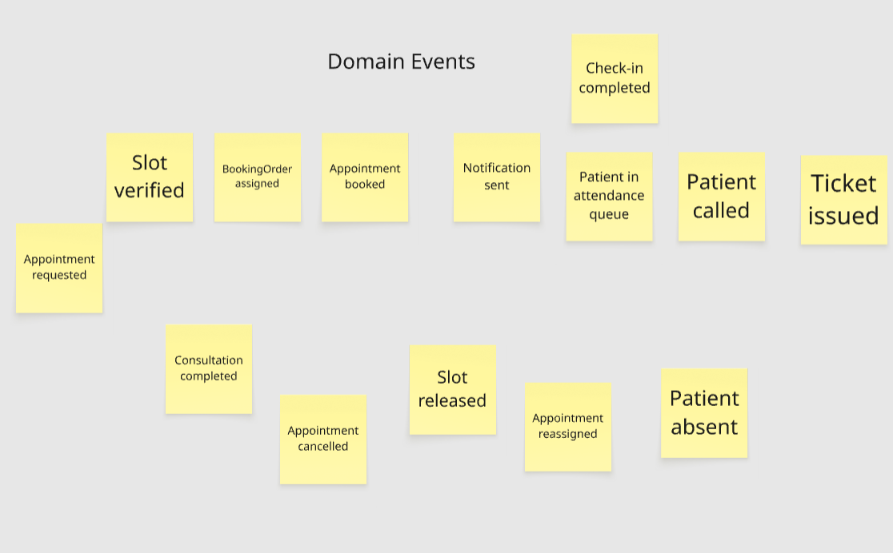

*Nota. Elaboración del equipo RuwaLabs para el proyecto SaludYa.*

**2. Organización cronológica de los eventos:** Luego, los eventos fueron ordenados según el momento en que ocurren dentro del proceso real de atención, permitiendo entender la secuencia lógica de las operaciones desde la pre-atención hasta el cierre de la consulta. En esta línea de tiempo se distingue que el evento `Booking Order assigned` ocurre inmediatamente después de `Appointment booked`, mientras que `Patient in attendance queue` y `Patient called` ocurren después de `Check-in completed`, evidenciando que ambas colas operan en momentos distintos del flujo, como se observa en la [Figura 34](#figura-34).

**Figura 35**

*EventStorming - Timeline*

  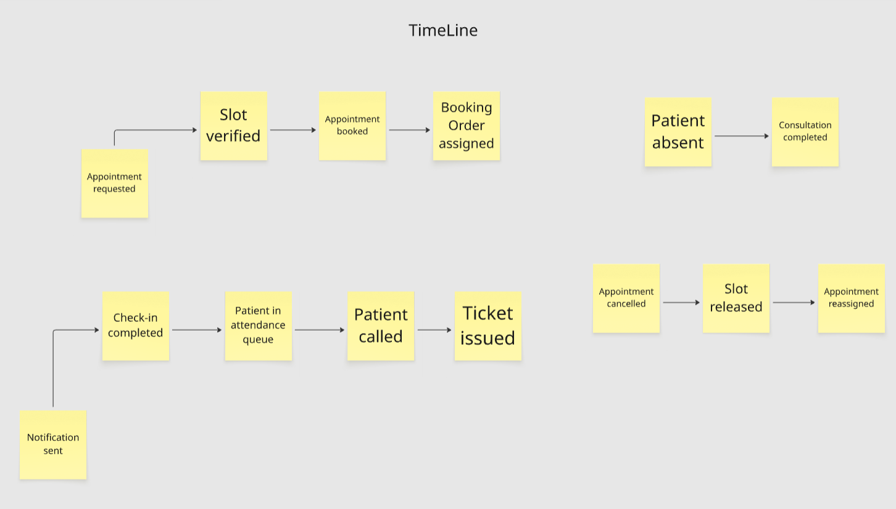

*Nota. Elaboración del equipo RuwaLabs para el proyecto SaludYa.*

**3. Identificación de Pain Points y Pivotal Points:** En esta etapa se marcaron los **pain points**, es decir, las posibles dificultades o cuellos de botella del proceso actual, y los **pivotal points**, que representan los eventos más críticos o de cambio dentro del flujo. Se identificaron como puntos críticos la **asignación del `Booking Order`** (que determina la prioridad en la lista de espera) y el **waitlist timeout** (que define el paso al siguiente paciente cuando nadie responde una propuesta de cupo liberado). Asimismo, se incorporaron como read models la **attendance queue** y la **waitlist**, como se observa en la [Figura 35](#figura-35).

**Figura 36**

*EventStorming - Pain Points y Pivotal Points*

  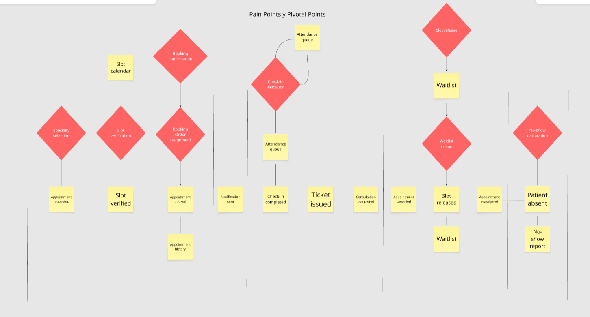

*Nota. Elaboración del equipo RuwaLabs para el proyecto SaludYa.*

**4. Incorporación de Commands, Policies y Read Models:** Finalmente, se agregaron los **commands** (acciones que disparan eventos), las **policies** (reglas de negocio que responden a eventos) y los **read models** (consultas de información). Esto permitió obtener una visión más completa y técnica del dominio de SaludYa. En esta fase se incorporaron los commands `Assign Booking Order`, `Add to attendance queue` y `Call next patient`; las policies `When a slot is released, notify the patient with the lowest Booking Order`, `When the timeout expires, move to the next patient in the list` y `If cancelled within the allowed time, release the slot`; y los read models `Attendance Queue` y `Waitlist`, como se observa en la [Figura 36](#figura-36) y la [Figura 37](#figura-37).

**Figura 37**

*EventStorming - Commands, Policies y Read Models*

  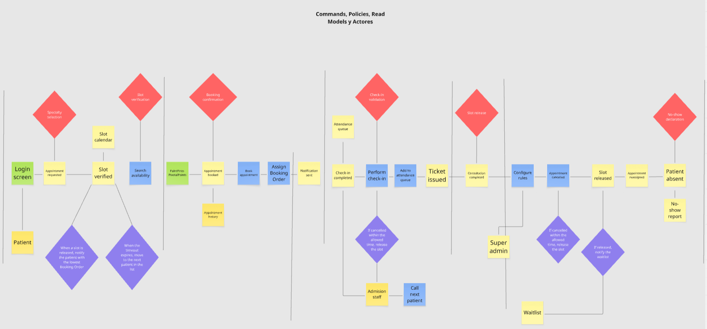

*Nota. Elaboración del equipo RuwaLabs para el proyecto SaludYa.*

#### 2.5.1.1. Candidate Context Discovery

A partir del modelado realizado en el EventStorming, se llevó a cabo una sesión de Candidate Context Discovery con el objetivo de identificar los bounded contexts dentro del dominio de SaludYa. Para ello, se aplicó la técnica **"look-for-pivotal-events"**, que permitió detectar los eventos clave del negocio que marcan transiciones de estado y delimitan responsabilidades entre diferentes partes del proceso.

Durante la sesión, se reorganizó la línea de tiempo del EventStorming para agrupar los elementos relacionados —eventos, comandos, políticas y read models— en torno a sus respectivos aggregates. Esto facilitó distinguir los límites naturales entre los contextos y definir con mayor claridad las interacciones entre ellos.

Es importante precisar que **`Attendance Queue` no constituye un bounded context**, sino un **agregado dentro del bounded context `Arrival & QR Check-in`**. Su responsabilidad se limita a ordenar la atención presencial del día según el timestamp de check-in, y su ciclo de vida es efímero (por día y por franja horaria). De manera análoga, **`Booking Order` no constituye un bounded context**, sino un **atributo de `Appointment` dentro del bounded context `Appointments & Booking`**, cuyo propósito es determinar la prioridad de reasignación en la lista de espera dinámica. Un bounded context se justifica únicamente cuando existe lenguaje propio, reglas de negocio complejas y autonomía de modelo; ninguna de las dos colas cumple esas condiciones por separado.

Como resultado del proceso, se identificaron **cinco bounded contexts candidatos** para el dominio de SaludYa:

**Tabla 22**

*Candidate Context Discovery*

| # | Bounded Context | Propósito | Eventos clave |
| :--- | :--- | :--- | :--- |
| 1 | **Identity & Access Management** | Gestionar el registro, autenticación y roles de pacientes y personal administrativo. | Account created, Session started, Minor linked |
| 2 | **Appointments & Booking** | Gestionar la búsqueda de disponibilidad, reserva y cancelación de citas médicas. Incluye el atributo `Booking Order`, que asigna un número secuencial a cada cita reservada. | Appointment requested, Slot verified, Appointment booked, Booking Order assigned, Appointment cancelled |
| 3 | **Dynamic Waitlist & Reassignment** | Gestionar la lista de espera dinámica y la reasignación de cupos liberados, ofreciendo las propuestas en orden de `Booking Order`. | Slot released, Appointment reassigned, Reassignment expired |
| 4 | **Arrival & QR Check-in** | Validar la presencia presencial del paciente, emitir el ticket digital de atención y gestionar la `Attendance Queue`. | Check-in completed, Patient in attendance queue, Patient called, Ticket issued, Patient absent |
| 5 | **Hospital Operations & Configuration** | Configurar parámetros operativos del establecimiento y monitorear la operación diaria. | Rules updated, Report generated |

*Nota. Elaboración del equipo RuwaLabs para el proyecto SaludYa.*

A continuación se detalla, para cada bounded context, los elementos incorporados en la sesión de Candidate Context Discovery, como se detalla en la [Tabla 22](#tabla-22):

- **`Appointments & Booking`:** se incorpora el atributo `Booking Order` y la regla de negocio *"Every booked appointment has a unique Booking Order per specialty, date and facility"*.
- **`Dynamic Waitlist & Reassignment`:** se incorporan los conceptos `Waitlist Entry` (entrada ordenada por `Booking Order`), `Cascade Reassignment` (reasignación en cascada si nadie acepta) y `Waitlist Response Timeout` (tiempo máximo para aceptar o rechazar). La policy de reasignación se define como *"Reassignment by Booking Order"*.
- **`Arrival & QR Check-in`:** se incorporan los conceptos `Attendance Queue` (cola virtual ordenada por `checkInTimestamp`) y `Queue Entry` (entrada individual en la cola de asistencia). La policy asociada se define como *"Attendance Queue sorted by checkInTimestamp"*.
- **`Hospital Operations & Configuration`:** se incorpora el parámetro `waitlistResponseTimeout` (y opcionalmente `cascadeWaitlistEnabled` y `maxCapacityPerSlot`) como parte de las reglas operativas configurables por el establecimiento.

La identificación de bounded contexts delimita las responsabilidades de identidad, reservas, reasignación, llegada y configuración operativa dentro del dominio de SaludYa, como se observa en la [Figura 38](#figura-38).

**Figura 38**

*Candidate Context Discovery - Bounded Contexts identificados*

  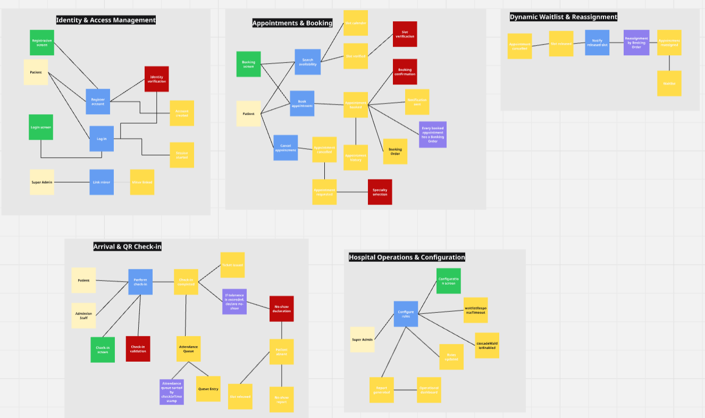

*Nota. Elaboración del equipo RuwaLabs para el proyecto SaludYa.*

#### 2.5.1.2. Domain Message Flows Modeling

En esta sección se presentan los principales flujos de colaboración entre los bounded contexts, modelados con la técnica de **Domain Message Flow Modelling** propuesta por ddd-crew. Cada diagrama muestra los comandos, eventos y queries que fluyen entre actores, bounded contexts y sistemas para un escenario específico, incluyendo el nombre del mensaje, su orden y los datos que transporta.

Los flujos reflejan las dos colas complementarias del dominio: la **cola por pedido de cita** (ordenada por `bookingOrder`) y la **cola de asistencia** (ordenada por `checkInTimestamp`).

**Flow 1: Registro y autenticación de paciente**

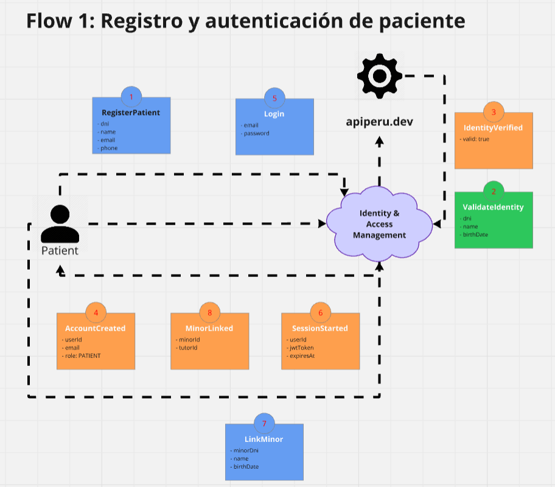

El paciente ejecuta `RegisterPatient`; **Identity & Access Management** valida la identidad con `ValidateIdentity` contra **ApiPeru.dev** (ACL hacia RENIEC) y responde con `IdentityVerified` → `AccountCreated`. Luego `Login` → `SessionStarted`, y `LinkMinor` → `MinorLinked`.

**Flow 2: Reserva de cita médica para el titular**

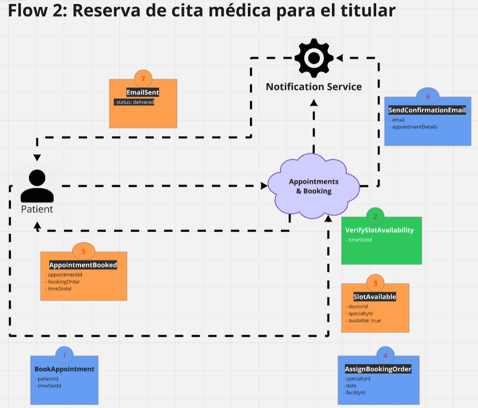

El paciente ejecuta `BookAppointment`; **Appointments & Booking** valida con `VerifySlotAvailability` → `SlotAvailable`, asigna el `AssignBookingOrder` y emite `AppointmentBooked`. Finalmente notifica al paciente vía `SendConfirmationEmail` → `EmailSent`.

**Flow 3: Reserva de cita médica para un menor a cargo**

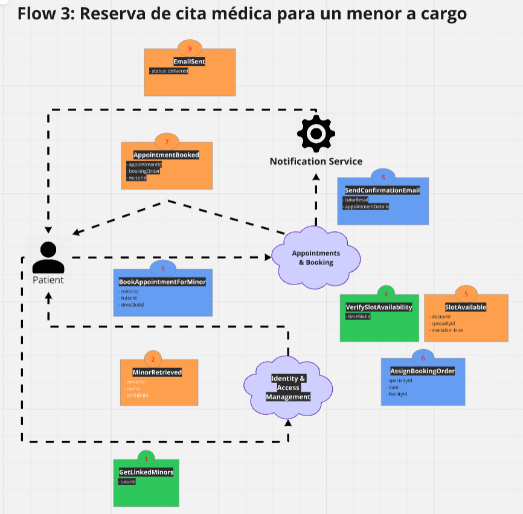

El titular ejecuta `GetLinkedMinors` (IAM) → `MinorRetrieved`, y luego `BookAppointmentForMinor` con el `minorId`. **Appointments & Booking** valida con `VerifySlotAvailability` → `SlotAvailable`, asigna el `bookingOrder` y emite `AppointmentBooked`, notificando al tutor.

**Flow 4: Check-in presencial mediante código QR**

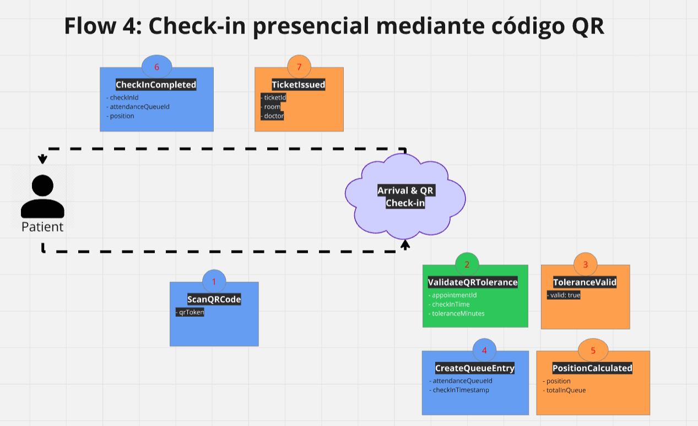

El paciente ejecuta `ScanQRCode`; **Arrival & QR Check-in** valida con `ValidateQRTolerance` → `ToleranceValid`, crea la entrada con `CreateQueueEntry`, calcula la posición (`PositionCalculated`) y emite `CheckInCompleted` y `TicketIssued`.

**Flow 5: Cancelación de cita y liberación de cupo**

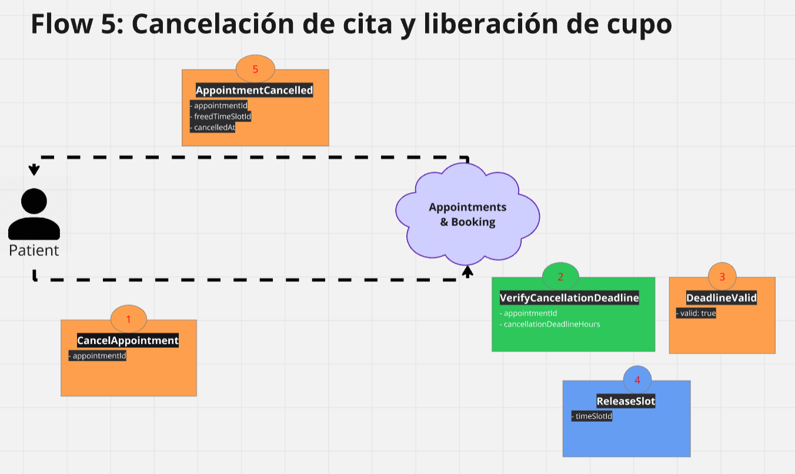

El paciente ejecuta `CancelAppointment`; **Appointments & Booking** valida con `VerifyCancellationDeadline` → `DeadlineValid`, ejecuta `ReleaseSlot` y emite `AppointmentCancelled`.

> **Nota:** la cancelación **no dispara reasignación**. Solo la ausencia presencial lo hace (ver Flow 6).

**Flow 6a: Declaración de ausencia**

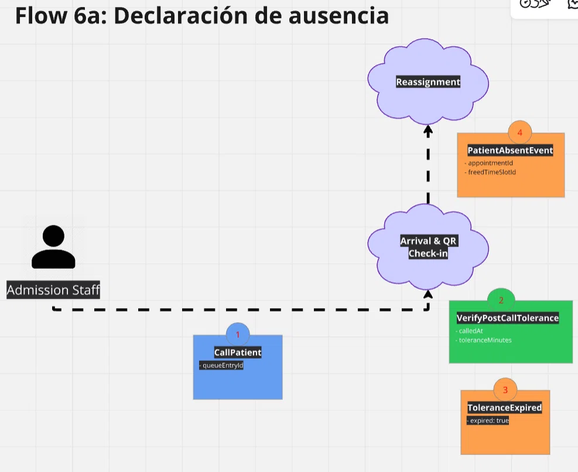

El personal de admisión ejecuta `CallPatient`; **Arrival & QR Check-in** valida con `VerifyPostCallTolerance` → `ToleranceExpired`, y emite `PatientAbsentEvent` hacia **Reassignment**.

**Flow 6b: Reasignación en cadena**

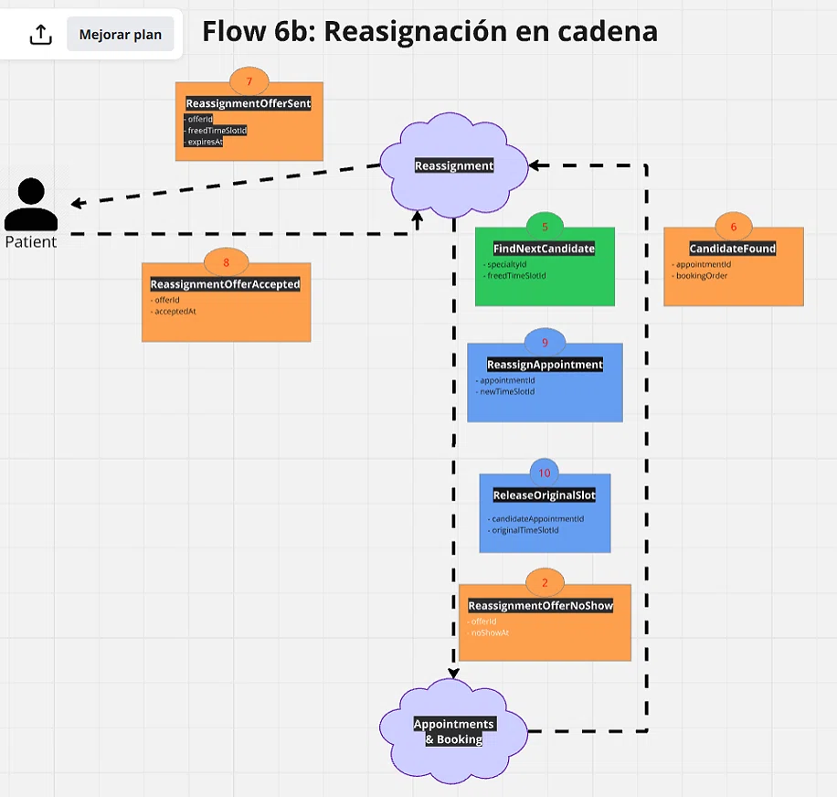

**Reassignment** ejecuta `FindNextCandidate` en **Appointments & Booking** → `CandidateFound`, envía `ReassignmentOfferSent` al paciente, quien responde con `ReassignmentOfferAccepted`. **Reassignment** ejecuta `ReassignAppointment` y `ReleaseOriginalSlot` para liberar el slot del candidato y re-ofrecerlo al siguiente (cadena). Si el candidato acepta y no llega, se emite `ReassignmentOfferNoShow`.

**Flow 7: Configuración operativa del establecimiento**

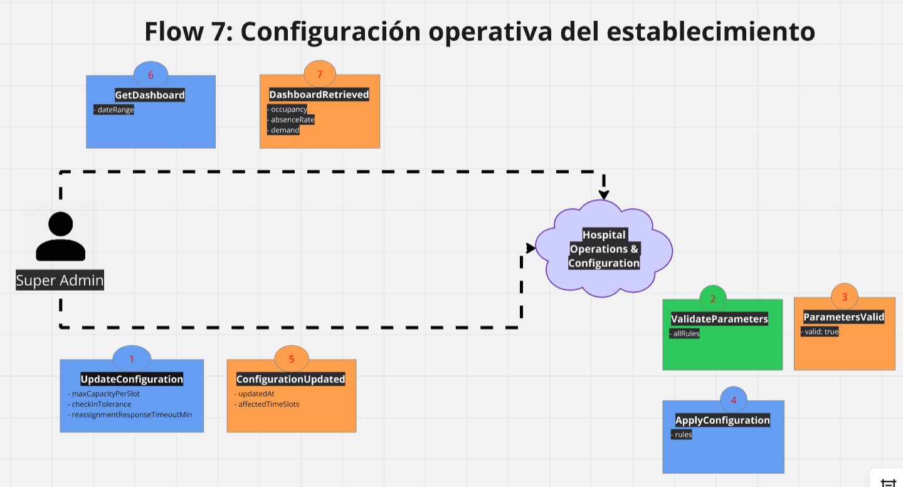

El Super Admin ejecuta `UpdateConfiguration`; **Hospital Operations & Configuration** valida con `ValidateParameters` → `ParametersValid`, aplica con `ApplyConfiguration` y emite `ConfigurationUpdated`. Finalmente, `GetDashboard` → `DashboardRetrieved`.

En conjunto, los flujos evidencian que la **cola por pedido de cita** se gestiona como atributo dentro de `Appointments & Booking` y se consume desde `Reassignment` para priorizar la reasignación, mientras que la **cola de asistencia** se gestiona como agregado dentro de `Arrival & QR Check-in` para ordenar el llamado a consultorio.

#### 2.5.1.3. Bounded Context Canvases

Para la presente sección, elaboramos el Bounded Context Canvas de cada uno de los Bounded Context candidatos que identificamos. Aplicamos el modelo **versión 5** propuesto por el Domain Driven Design Group, que permite documentar cada contexto desde una perspectiva estratégica y táctica, cubriendo el propósito, la clasificación estratégica, las comunicaciones de entrada y salida, el lenguaje ubicuo, las decisiones de negocio, los supuestos, las métricas de verificación y las preguntas abiertas.

En cada uno de los canvases registramos las secciones específicas como el **Context Overview Definition**, **Business Rules Distillation** y el **Ubiquitous Language**, identificando claramente el tipo de Bounded Context y sus interacciones de entrada y salida con otros contextos. El resultado se presenta a continuación para cada uno de los cinco bounded contexts identificados en la sección 2.5.1.1.

**Bounded Context Canvas – Identity & Access Management**

El bounded context **Identity & Access Management** gestiona el registro, autenticación, vinculación de menores y gestión de roles de los usuarios en SaludYa. Se clasifica como *Generic* con rol *Execution Context*, e interactúa principalmente con `Patient`, `Super Admin` y el servicio externo **ApiPeru.dev** (Anticorruption Layer hacia RENIEC) para la validación de identidad.

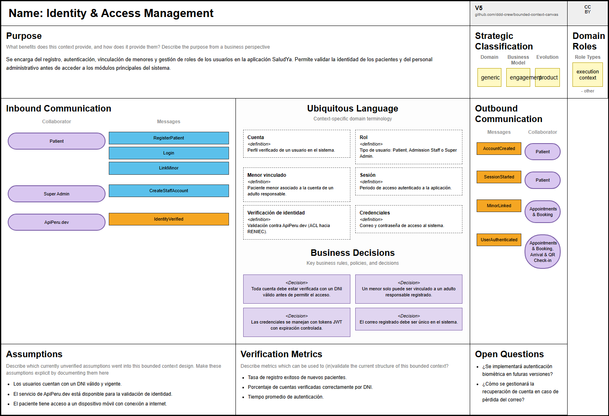

*Nota. Elaboración del equipo RuwaLabs para el proyecto SaludYa.*

**Bounded Context Canvas – Appointments & Booking**

El bounded context **Appointments & Booking** gestiona la búsqueda de disponibilidad, reserva y cancelación de citas médicas. Se clasifica como *Core* con rol *Execution Context*, e incorpora el atributo `Booking Order`, que asigna un número secuencial a cada cita reservada y determina la prioridad en la cola de reserva consumida por `Reassignment`.

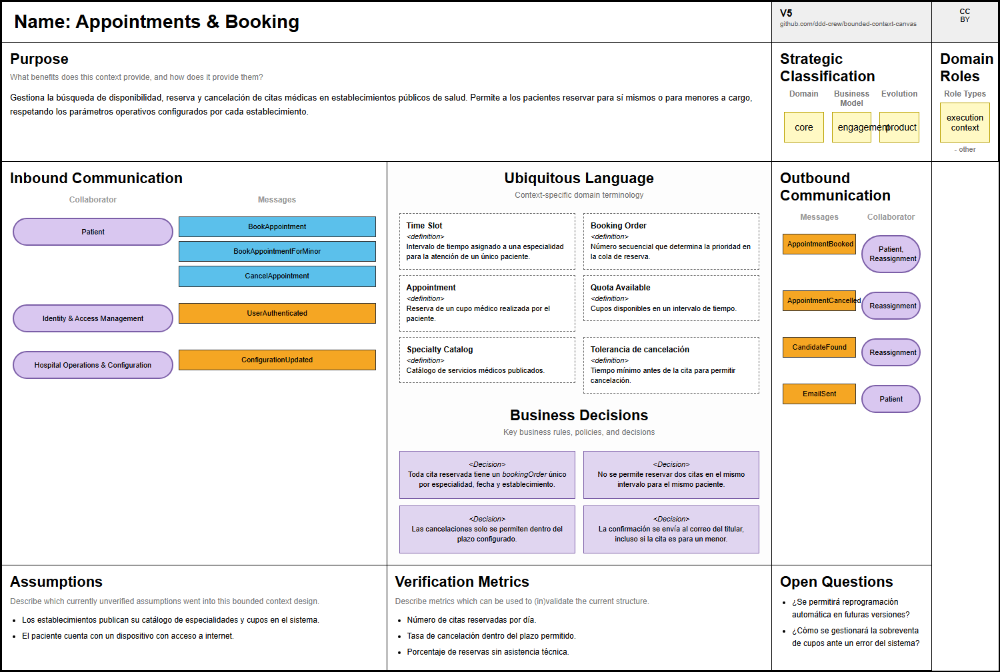

*Nota. Elaboración del equipo RuwaLabs para el proyecto SaludYa.*

**Bounded Context Canvas – Reassignment**

El bounded context **Reassignment** gestiona la cola de reserva del sistema y reasigna los cupos liberados por **ausencias**, notificando oportunidades de adelanto a los pacientes. Se clasifica como *Core* con rol *Execution Context*, y aplica una **cadena de reasignación** en la que el candidato que acepta libera su slot original, el cual se re-ofrece al siguiente paciente de la cola.

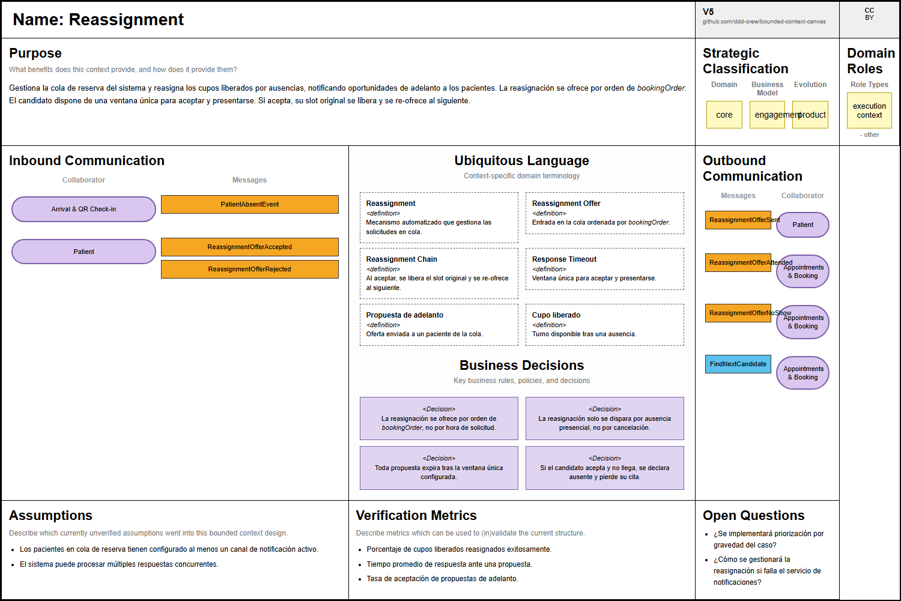

*Nota. Elaboración del equipo RuwaLabs para el proyecto SaludYa.*

**Bounded Context Canvas – Arrival & QR Check-in**

El bounded context **Arrival & QR Check-in** valida la presencia presencial del paciente mediante el escaneo de un código QR, gestiona la `Attendance Queue` (cola virtual ordenada por `checkInTimestamp`), emite el ticket digital y declara la ausencia del paciente cuando excede la tolerancia configurada. Se clasifica como *Core* con rol *Execution Context*.

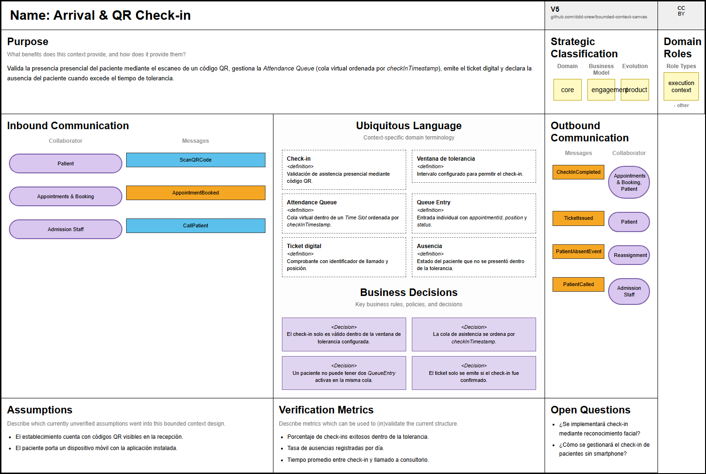

*Nota. Elaboración del equipo RuwaLabs para el proyecto SaludYa.*

**Bounded Context Canvas – Hospital Operations & Configuration**

El bounded context **Hospital Operations & Configuration** configura los parámetros operativos de cada establecimiento de salud (intervalos de atención, tolerancias, plazos de cancelación, `reassignmentResponseTimeoutMin`, `maxCapacityPerSlot`) y proporciona dashboards y reportes para monitorear la operación diaria, el ausentismo y la demanda. Se clasifica como *Supporting* con rol *Execution Context*.

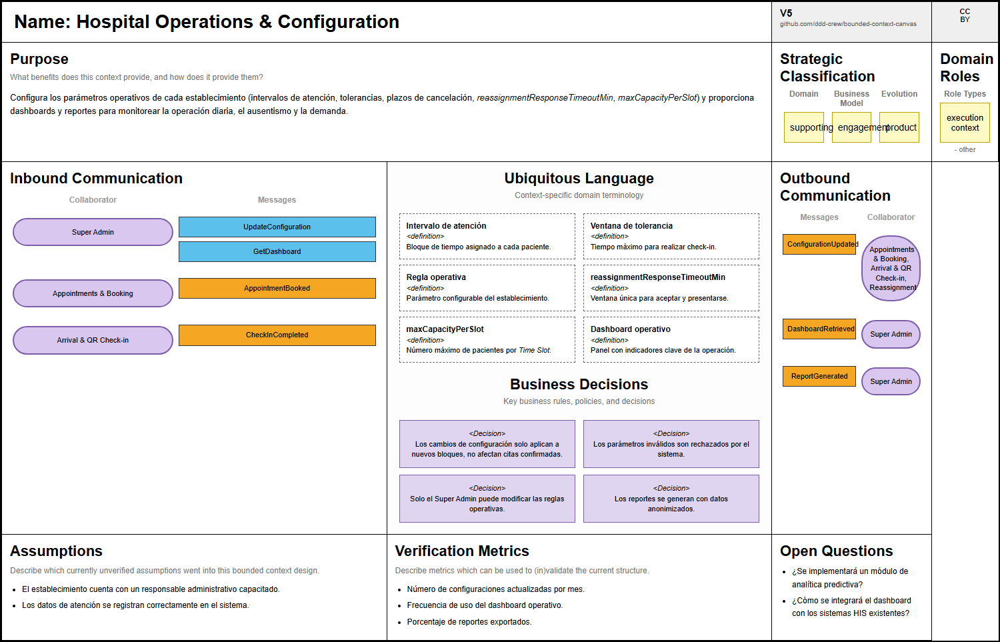

*Nota. Elaboración del equipo RuwaLabs para el proyecto SaludYa.*

Los canvases presentados permiten visualizar de forma estructurada las responsabilidades, reglas de negocio, lenguaje común y métricas de verificación de cada bounded context, asegurando un entendimiento compartido entre los miembros del equipo y facilitando la comunicación con los stakeholders del dominio de SaludYa. Asimismo, se evidencia que las dos colas complementarias del dominio quedan correctamente ubicadas: la **cola por pedido de cita** como atributo (`Booking Order`) dentro de `Appointments & Booking`, y la **cola de asistencia** como agregado (`Attendance Queue`) dentro de `Arrival & QR Check-in`. Esta separación permite que cada contexto mantenga su propio lenguaje ubicuo y sus reglas de negocio sin acoplarse innecesariamente al resto del sistema.

### 2.5.2. Context Mapping

El proceso de Context Mapping nos permitió analizar y definir las relaciones estructurales y los patrones de integración entre los bounded contexts del sistema SaludYa. Este análisis fue clave para garantizar una comunicación clara, minimizar dependencias innecesarias y mantener una alta cohesión interna dentro de cada contexto.

**Análisis del proceso**

Durante la elaboración de los context maps, el equipo se planteó las siguientes preguntas para refinar los límites y relaciones entre los bounded contexts:

- **¿Qué pasaría si movemos ciertas capacidades del Identity & Access Management al Appointments & Booking?**

  Se descartó esta opción, ya que se perdería la independencia del módulo de autenticación y se generaría una sobrecarga innecesaria en el proceso de reserva. La autenticación debe ser un servicio transversal consumido por el resto de contextos.

- **¿Qué pasaría si descomponemos el Appointments & Booking en subcontextos separados para reservas y cancelaciones?**

  Se concluyó que no era necesario, ya que ambos flujos comparten las mismas reglas de negocio, aggregates y políticas de agenda. Descomponerlo generaría duplicidad y aumentaría la complejidad de coordinación.

- **¿Qué pasaría si el Arrival & QR Check-in dependiera directamente del Appointments & Booking?**

  Se determinó mantener la dependencia mediante **eventos de dominio** (`Cita reservada`, `Cita cancelada`) para evitar acoplamientos fuertes y permitir que el check-in funcione de manera desacoplada.

- **¿Qué pasaría si creamos un servicio compartido para la gestión de notificaciones?**

  Se decidió implementar una comunicación **event-driven** con un **Shared Kernel** (plantillas, canales y prioridades compartidas), dado que varios contextos requieren enviar mensajes al usuario final: Identity & Access Management (confirmaciones de cuenta), Appointments & Booking (confirmación de reservas), Reassignment (propuestas de adelanto) y Arrival & QR Check-in (ticket emitido).

- **¿Qué pasaría si aislamos el core de reservas y movemos la configuración a un contexto aparte?**

  Se confirmó la separación actual: **Hospital Operations & Configuration** funciona como contexto de soporte que parametriza el comportamiento de los contextos core sin acoplarse a su lógica interna.

**Patrones de integración aplicados**

A partir del análisis, se definieron los siguientes patrones de relación entre los bounded contexts de SaludYa, como se detalla en la [Tabla 35](#tabla-35):

**Tabla 35**

*Context Mapping: patrones y relaciones entre contextos*

| Bounded Context origen | Bounded Context destino | Patrón | Justificación |
| :--- | :--- | :--- | :--- |
| Identity & Access Management | RENIEC API (externo) | **ACL** | Se traduce el modelo externo de RENIEC al modelo interno de identidad. |
| Identity & Access Management | Appointments & Booking | **Shared Kernel** | Comparten el modelo de identidad y sesión activa del paciente. |
| Identity & Access Management | Arrival & QR Check-in | **Shared Kernel** | Comparten la validación de sesión para el check-in. |
| Identity & Access Management | Hospital Operations & Configuration | **Shared Kernel** | Comparten el modelo de roles para autorizar al Super Admin. |
| Arrival & QR Check-in | Reassignment | **Customer/Supplier** | Check-in publica el evento de ausencia (`PatientAbsentEvent`) que Reassignment consume. |
| Hospital Operations & Configuration | Appointments & Booking | **Conformist** | Booking adopta el modelo de parámetros operativos sin traducirlo. |
| Hospital Operations & Configuration | Arrival & QR Check-in | **Conformist** | Check-in adopta el modelo de tolerancias sin traducirlo. |

*Nota. Elaboración del equipo RuwaLabs para el proyecto SaludYa.*

**Mensajes intercambiados entre bounded contexts**

A continuación se detallan los mensajes que se intercambian entre los bounded contexts, reflejando la existencia de las dos colas complementarias del dominio, como se detalla en la [Tabla 36](#tabla-36):

**Tabla 36**

*Context Mapping: mensajes entre contextos*

| Mensaje | Bounded Context origen | Bounded Context destino | Contenido |
| :--- | :--- | :--- | :--- |
| `AppointmentBooked` | Appointments & Booking | Arrival & QR Check-in | Incluye `bookingOrder` de la cita reservada. |
| `PatientAbsentEvent` | Arrival & QR Check-in | Reassignment | Evento de ausencia presencial que dispara la reasignación. |
| `CheckInCompleted` | Arrival & QR Check-in | Appointments & Booking, Patient | Incluye `attendanceQueueId` y `position` del paciente en la cola de asistencia. |
| `ReassignmentOfferSent` | Reassignment | Patient | Propuesta de cupo liberado enviada al paciente con menor `bookingOrder`. |
| `ReassignmentOfferAccepted` | Reassignment | Appointments & Booking, Patient | Confirmación de aceptación del cupo liberado (mueve la cita y libera el slot original). |
| `ReassignmentOfferRejected` | Reassignment | Patient | Rechazo del cupo liberado; se ofrece al siguiente candidato. |
| `ReassignmentOfferExpired` | Reassignment | Patient | Expiración de la ventana única sin respuesta del paciente. |
| `ReassignmentOfferAttended` | Reassignment | Appointments & Booking | El candidato aceptó y llegó; cierra la oferta. |
| `ReassignmentOfferNoShow` | Reassignment | Appointments & Booking | El candidato aceptó y no llegó; marca su cita como ausente. |

*Nota. Elaboración del equipo RuwaLabs para el proyecto SaludYa.*

**Leyenda de patrones:**

- **ACL (Anticorruption Layer):** Capa de traducción entre el modelo externo y el modelo interno.
- **SK (Shared Kernel):** Modelo compartido entre dos o más contextos.
- **CF (Conformist):** Un contexto adopta el modelo de otro sin traducirlo.
- **C/S (Customer/Supplier):** Relación donde el supplier publica y el customer consume.

El mapa de contextos relaciona las áreas del dominio y sus dependencias para explicar cómo colaboran los componentes de SaludYa, como se observa en la [Figura 39](#figura-39).

**Figura 39**

*Mapa de relaciones entre bounded contexts de SaludYa*

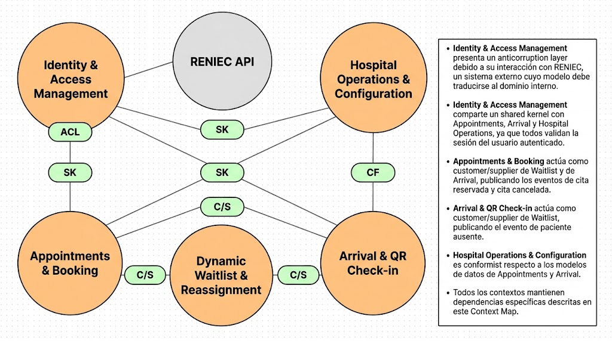

*Nota. Elaboración del equipo RuwaLabs para el proyecto SaludYa.*

### 2.5.3. Software Architecture

#### 2.5.3.1. Software Architecture Context Level Diagrams

En el Software Architecture Context Diagram se pueden apreciar los componentes más importantes que interactúan con el sistema SaludYa, así como los usuarios principales y las funciones que desempeñan dentro del ecosistema de gestión de citas médicas en establecimientos públicos de salud.

El sistema SaludYa interactúa con tres tipos de usuarios principales: los **pacientes** que reservan y gestionan citas médicas, el **personal de admisión** que controla el flujo de atención en el establecimiento, y el **Super Admin** que configura los parámetros operativos del sistema. Asimismo, el sistema se integra con cuatro servicios externos: **RENIEC API** para la validación de identidad por DNI, **Firebase Cloud Messaging** para el envío de notificaciones push, un **Servicio de Correo** para notificaciones transaccionales, y una **Pasarela SMS** para el envío de mensajes de texto, como se observa en la [Figura 40](#figura-40).

**Figura 40**

*Diagrama C4 de contexto de SaludYa*

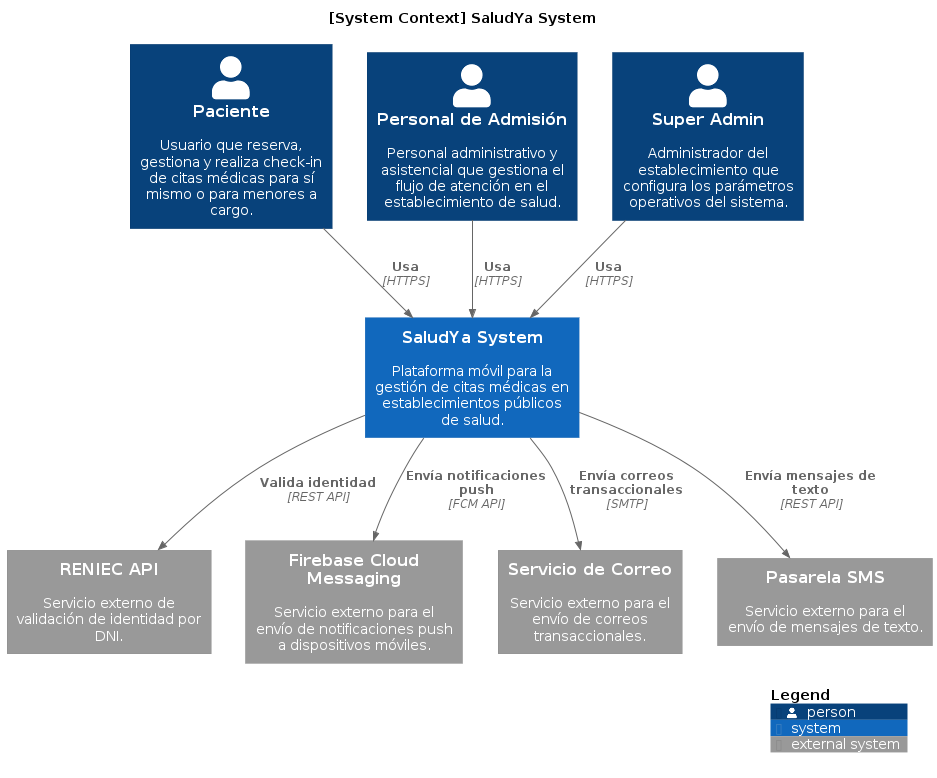

*Nota. Elaboración del equipo RuwaLabs para el proyecto SaludYa.*

#### 2.5.3.2. Software Architecture Container Level Diagrams

En el Software Architecture Container Diagram se detalla la estructura interna del sistema SaludYa, mostrando los contenedores principales que lo componen y cómo se comunican entre sí. Este nivel de abstracción permite visualizar las decisiones tecnológicas y la distribución de responsabilidades dentro del sistema.

El sistema SaludYa está compuesto por dos aplicaciones móviles (una para pacientes y otra para el personal de admisión), un API Gateway que centraliza las peticiones, un Backend API que orquesta la lógica de negocio de los bounded contexts, una base de datos PostgreSQL para la persistencia, un Message Broker RabbitMQ para la comunicación asíncrona entre contextos, y un worker de Cron Jobs que ejecuta tareas programadas como la expiración de tolerancias, la reasignación de cupos y la expiración de propuestas de la cola de reserva.

El Backend API orquesta internamente la lógica de los cinco bounded contexts del sistema, incluyendo la gestión de la cola de asistencia ordenada por `checkInTimestamp` y la cola de reserva ordenada por `bookingOrder`. La base de datos PostgreSQL incorpora las tablas `attendance_queue_entries` y `reassignment_offers`, y la tabla `appointments` incluye el campo `booking_order` que determina la prioridad de reasignación.

El Backend API se integra con cuatro servicios externos: **RENIEC API** para la validación de identidad por DNI, **Firebase Cloud Messaging** para el envío de notificaciones push, un **Servicio de Correo** para notificaciones transaccionales, y una **Pasarela SMS** para el envío de mensajes de texto a los pacientes que no cuentan con smartphone, como se observa en la [Figura 41](#figura-41).

**Figura 41**

*Diagrama C4 de contenedores de SaludYa*

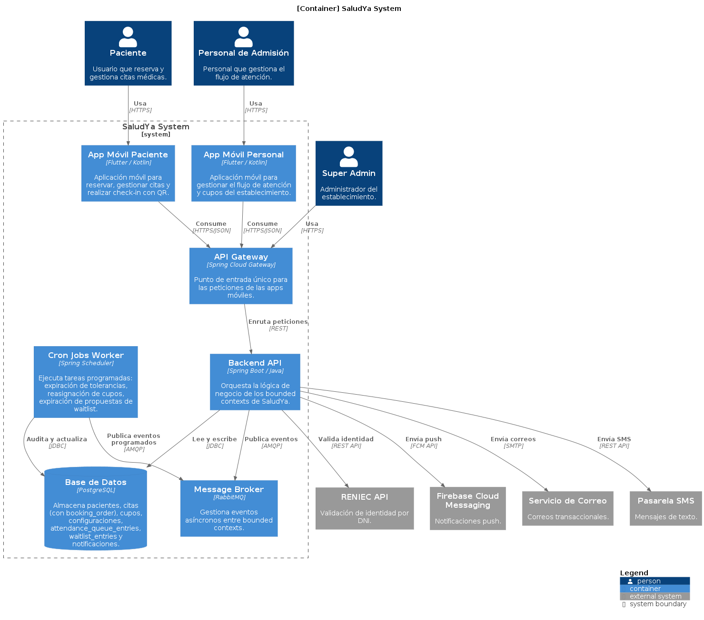

*Nota. Elaboración del equipo RuwaLabs para el proyecto SaludYa.*

#### 2.5.3.3. Software Architecture Deployment Diagrams

En el Software Architecture Deployment Diagram se muestra la distribución física de los contenedores del sistema SaludYa sobre la infraestructura tecnológica que los aloja. Este diagrama permite visualizar cómo se despliegan las aplicaciones móviles, los servicios del backend y los componentes de infraestructura en los diferentes nodos del sistema.

El despliegue de SaludYa se distribuye en tres entornos principales. En primer lugar, las **aplicaciones móviles** se ejecutan directamente en los dispositivos de los usuarios: la app del paciente en smartphones Android/iOS, y la app del personal de admisión en smartphones o tablets del establecimiento. En segundo lugar, el **backend del sistema** se despliega en una infraestructura cloud (AWS o GCP) compuesta por un servidor de aplicaciones con contenedores Docker que alojan el API Gateway, el Backend API y los Cron Jobs y un servidor de base de datos PostgreSQL. Finalmente, el sistema se integra con **servicios externos** como RENIEC API para la validación de identidad, Firebase Cloud Messaging para notificaciones push, el servicio de correo SMTP para notificaciones transaccionales, y una pasarela SMS.

Esta arquitectura de despliegue permite escalar horizontalmente los servicios del backend según la demanda, mantener la comunicación asíncrona entre bounded contexts mediante el message broker, y garantizar la disponibilidad de los servicios críticos mediante la infraestructura cloud, como se observa en la [Figura 42](#figura-42).

**Figura 42**

*Diagrama C4 de despliegue de SaludYa*

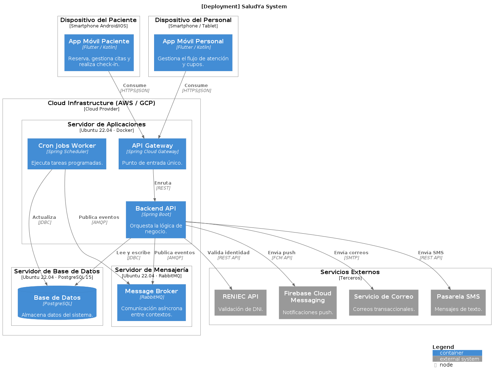

*Nota. Elaboración del equipo RuwaLabs para el proyecto SaludYa.*

## 2.6. Tactical-Level Domain-Driven Design

### 2.6.1. Bounded Context: Identity & Access Management

El **bounded context de Identity & Access Management** gestiona el registro, autenticación, vinculación de menores y gestión de roles de los usuarios en SaludYa. Permite validar la identidad de los pacientes y del personal administrativo antes de acceder a los módulos principales del sistema.

#### 2.6.1.1. Domain Layer

La capa de **Domain** representa el núcleo del negocio de identidad. Aquí se definen las entidades, value objects, enums, aggregates, factories e interfaces que encapsulan las reglas de negocio.

##### UserAccount (Aggregate Root)

**Atributos:**
`id`, `email: Email`, `password: PasswordHash`, `role: Role`, `isActive`, `createdAt`

**Métodos:**
- `validatePassword(password)` → verifica si la contraseña ingresada coincide con la almacenada.
- `assignRole(role)` → asigna un rol al usuario.
- `activate()` / `deactivate()` → controlan si el usuario puede iniciar sesión.

**Propósito:**
Representa la cuenta de acceso al sistema. Es aggregate root porque agrupa la lógica de autenticación y estado del usuario.

---

##### Patient (Aggregate Root)

**Atributos:**
`id`, `idUser`, `dni: Dni`, `name`, `lastname`, `birthDate`, `phone`

**Métodos:**
- `updateContactInfo(phone, email)` → actualiza los datos de contacto.
- `isMinor()` → retorna `true` si el paciente es menor de edad.

**Propósito:**
Representa el perfil del paciente. Es aggregate root porque agrupa la información personal del paciente.

---

##### PatientMinor (Entity)

**Atributos:**
`id`, `idPatient`, `idTutor`

**Métodos:**
- `validateTutor(tutorId)` → valida que el tutor sea un adulto responsable registrado.

**Propósito:**
Vincula a un menor de edad con un adulto responsable (tutor).

---

##### Email (Value Object)

**Atributos:**
`value`

**Métodos:**
- `isValid()` → valida el formato del correo.

**Propósito:**
Encapsula el correo electrónico como value object inmutable.

---

##### Dni (Value Object)

**Atributos:**
`value`

**Métodos:**
- `isValid()` → valida que el DNI tenga 8 dígitos.

**Propósito:**
Encapsula el DNI como value object inmutable.

---

##### PasswordHash (Value Object)

**Atributos:**
`value`

**Propósito:**
Encapsula el hash de la contraseña como value object inmutable.

---

##### Role (Enum)

**Valores posibles:**
`PATIENT`, `ADMISSION_STAFF`, `SUPER_ADMIN`

**Propósito:**
Define los tipos de usuario del sistema.

---

##### UserAccountFactory (Factory)

**Métodos:**
- `createPatientAccount(email, password, dni, name, lastname, birthDate, phone): UserAccount`
- `createStaffAccount(email, password, dni, name, lastname): UserAccount`

**Propósito:**
Encapsula la creación de cuentas de usuario, validando los datos y asignando el rol correspondiente.

---

##### UserAccountRepository (Interface)

**Métodos:**
- `save(userAccount: UserAccount): UserAccount`
- `findById(id: Int): UserAccount?`
- `findByEmail(email: String): UserAccount?`
- `updateStatus(id: Int, isActive: Boolean)`

**Propósito:**
Define las operaciones de persistencia para cuentas de usuario.

---

##### PatientRepository (Interface)

**Métodos:**
- `save(patient: Patient): Patient`
- `findById(id: Int): Patient?`
- `findByDni(dni: String): Patient?`
- `findByUserId(userId: Int): Patient?`
- `saveMinor(patientMinor: PatientMinor): PatientMinor`
- `findMinorsByTutor(tutorId: Int): List<PatientMinor>`

**Propósito:**
Define las operaciones de persistencia para pacientes y menores vinculados.

---

##### EventPublisher (Interface)

**Métodos:**
- `publish(event: DomainEvent)`

**Propósito:**
Define la interfaz para publicar eventos de dominio. La implementación concreta usa Spring Events.

---

#### 2.6.1.2. Interface Layer

La **Interface Layer** expone las funcionalidades del bounded context mediante endpoints REST.

##### UserAccountsController (REST API Controller)

**Endpoints:**
- `POST /api/v1/user-accounts` → Registra un nuevo paciente con verificación de DNI.
- `POST /api/v1/user-accounts/login` → Inicia sesión y genera token JWT.
- `POST /api/v1/user-accounts/logout` → Cierra sesión.
- `POST /api/v1/user-accounts/recover-password` → Solicita recuperación de contraseña.
- `GET /api/v1/user-accounts/{id}` → Obtiene el perfil del usuario autenticado.
- `PUT /api/v1/user-accounts/{id}` → Actualiza datos de contacto.
- `POST /api/v1/user-accounts/staff` → Crea cuenta de personal administrativo.

**Explicación:**
Este controlador gestiona las operaciones sobre el aggregate `UserAccount`.

---

##### PatientsController (REST API Controller)

**Endpoints:**
- `GET /api/v1/patients/{id}` → Obtiene el perfil de un paciente.
- `PUT /api/v1/patients/{id}` → Actualiza datos del paciente.
- `GET /api/v1/patients/{id}/minors` → Lista los menores vinculados al tutor.

**Explicación:**
Este controlador gestiona las operaciones sobre el aggregate `Patient`.

---

##### PatientMinorsController (REST API Controller)

**Endpoints:**
- `POST /api/v1/patient-minors` → Vincula un menor a la cuenta del titular.
- `GET /api/v1/patient-minors/{id}` → Obtiene el detalle del vínculo.
- `DELETE /api/v1/patient-minors/{id}` → Desvincula un menor.

**Explicación:**
Este controlador gestiona las operaciones sobre la entity `PatientMinor`.

---

##### IamContextFacade (Facade / ACL)

**Métodos:**
- `getUserById(id): UserAccount?`
- `getPatientById(id): Patient?`
- `getMinorsByTutor(tutorId): List<PatientMinor>`

**Propósito:**
Punto de entrada interno para otros bounded contexts. Evita que otros contextos accedan directamente a los repositorios de IAM.

---

#### 2.6.1.3. Application Layer

La **Application Layer** orquesta los casos de uso del dominio mediante **Command Services** y **Query Services**. Los **Command Handlers** viven dentro de los Command Services, y los **Event Handlers** en `application/internal/eventhandlers/`.

##### UserAccountCommandService (Interface)

**Métodos (Command Handlers):**
- `registerPatient(command: RegisterPatientCommand): Patient`
- `login(command: LoginCommand): AuthResult`
- `logout(command: LogoutCommand): void`
- `recoverPassword(command: RecoverPasswordCommand): void`
- `updateProfile(command: UpdateProfileCommand): Patient`
- `createStaffAccount(command: CreateStaffAccountCommand): UserAccount`

**Propósito:**
Define los comandos relacionados con la cuenta de usuario.

---

##### PatientCommandService (Interface)

**Métodos (Command Handlers):**
- `linkMinor(command: LinkMinorCommand): PatientMinor`
- `unlinkMinor(command: UnlinkMinorCommand): void`

**Propósito:**
Define los comandos relacionados con el paciente y sus menores vinculados.

---

##### UserAccountQueryService (Interface)

**Métodos (Query Handlers):**
- `getById(id: Int): UserAccount?`
- `getByEmail(email: String): UserAccount?`

**Propósito:**
Define las consultas relacionadas con la cuenta de usuario.

---

##### PatientQueryService (Interface)

**Métodos (Query Handlers):**
- `getById(id: Int): Patient?`
- `getByDni(dni: String): Patient?`
- `getMinorsByTutor(tutorId: Int): List<PatientMinor>`

**Propósito:**
Define las consultas relacionadas con el paciente.

---

##### UserAccountCommandServiceImpl (Implementation)

**Responsabilidad:** Implementar los comandos de cuenta de usuario.

**Flujo de `registerPatient`:**
1. Recibe los datos del paciente.
2. Valida el DNI contra el servicio externo RENIEC mediante `ReniecService` (ACL).
3. Valida que el correo no esté duplicado.
4. Crea la cuenta de usuario con rol `PATIENT` usando `UserAccountFactory`.
5. Crea el perfil de paciente.
6. Publica el evento `PatientRegisteredEvent`.
7. Notifica al paciente vía `NotificationAdapter`.

---

##### PatientCommandServiceImpl (Implementation)

**Responsabilidad:** Implementar los comandos de paciente.

**Flujo de `linkMinor`:**
1. Recibe el DNI del menor.
2. Valida el DNI contra RENIEC.
3. Valida que el menor no esté vinculado a otra cuenta.
4. Crea el `PatientMinor` asociando al tutor.
5. Publica el evento `MinorLinkedEvent`.
6. Notifica al tutor.

---

##### PatientRegisteredEventHandler (Event Handler)

**Responsabilidad:** Reaccionar al evento `PatientRegisteredEvent`.
**Flujo:**
1. Escucha el evento.
2. Envía el correo de bienvenida.
3. Registra la acción en el log de auditoría.

---

##### MinorLinkedEventHandler (Event Handler)

**Responsabilidad:** Reaccionar al evento `MinorLinkedEvent`.
**Flujo:**
1. Escucha el evento.
2. Notifica al tutor que la vinculación fue exitosa.
3. Registra la acción en el log de auditoría.

---

#### 2.6.1.4. Infrastructure Layer

La capa de **Infrastructure** contiene las implementaciones concretas.

##### UserAccountRepositoryImpl
**Implementa:** `UserAccountRepository`
**Tecnología:** Spring Data JPA + PostgreSQL
**Explicación:**
Ejecuta operaciones sobre la tabla `users`. Mapea entidades del dominio a entidades JPA.

---

##### PatientRepositoryImpl
**Implementa:** `PatientRepository`
**Tecnología:** Spring Data JPA + PostgreSQL
**Explicación:**
Ejecuta operaciones sobre las tablas `patients` y `patient_minors`.

---

##### ReniecService (ACL)
**Función:**
Valida la identidad por DNI contra el servicio externo de RENIEC.
**Tecnología:** REST Client (RestTemplate / WebClient)
**Explicación:**
Implementa un Anticorruption Layer (ACL) que traduce el modelo externo de RENIEC al modelo interno de identidad.

---

##### BCryptHashingService
**Función:**
Hashea y valida contraseñas con BCrypt.
**Tecnología:** BCrypt

---

##### TokenServiceImpl
**Función:**
Genera y valida tokens JWT.
**Tecnología:** java-jwt / jjwt

---

##### WebSecurityConfiguration
**Función:**
Configura Spring Security, filtros de autorización y pipeline de autenticación.
**Tecnología:** Spring Security

---

##### BearerAuthorizationRequestFilter
**Función:**
Filtra las peticiones HTTP y valida el token Bearer en cada request.
**Tecnología:** Spring Security

---

##### NotificationAdapter
**Función:**
Envía notificaciones al usuario (correo de bienvenida, recuperación de contraseña).
**Tecnología:** SMTP + Firebase Cloud Messaging

---

##### SpringEventPublisherImpl
**Implementa:** `EventPublisher`
**Función:**
Publica eventos de dominio usando Spring Events.
**Tecnología:** `ApplicationEventPublisher` de Spring

---

#### 2.6.1.5. Bounded Context Software Architecture Component Level Diagrams

**Figura 43**

*Diagrama de componentes — IAM*

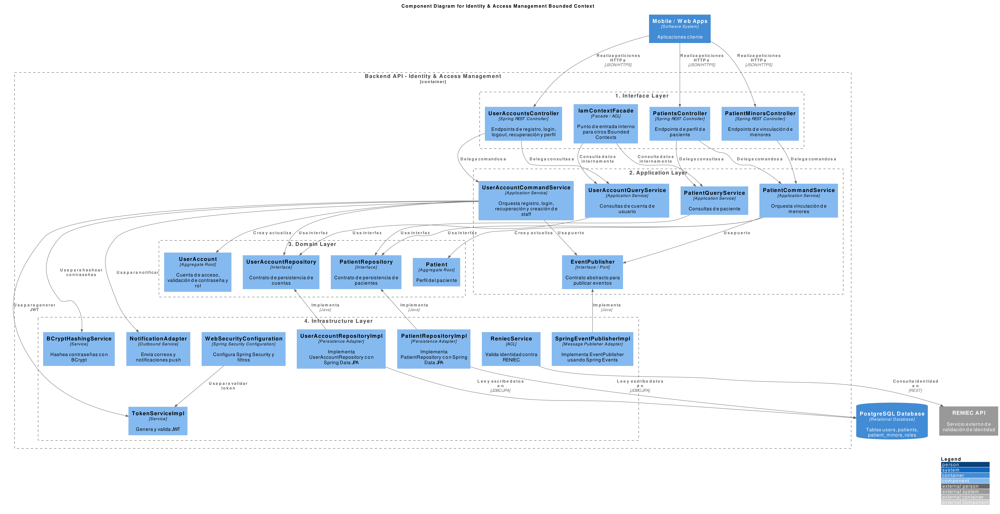

*Nota. Elaboración del equipo RuwaLabs para el proyecto SaludYa.*

---
El diagrama de componentes del bounded context Identity & Access Management muestra la organización interna del Backend API en sus cuatro capas: Interface, Application, Domain e Infrastructure. Se aprecian los controladores REST, los servicios de aplicación, los aggregates del dominio, las interfaces de repositorio y los adapters de infraestructura, junto con sus dependencias y la comunicación con la base de datos PostgreSQL y los servicios externos, como se observa en la [Figura 43](#figura-43).

#### 2.6.1.6. Bounded Context Software Architecture Code Level Diagrams

##### 2.6.1.6.1. Bounded Context Domain Layer Class Diagrams

**Figura 44**

*Diagrama de clases — IAM*

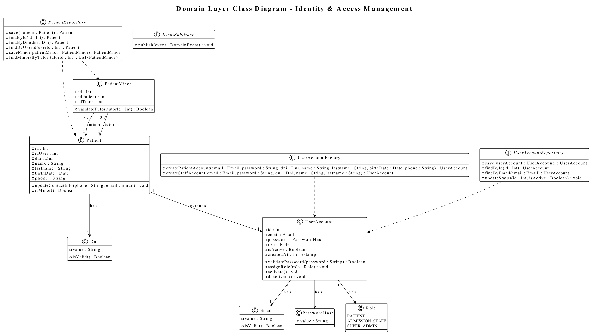

*Nota. Elaboración del equipo RuwaLabs para el proyecto SaludYa.*

---
El diagrama de clases del dominio del bounded context Identity & Access Management representa los aggregates, entities, value objects, enums, factory e interfaces de repositorio que encapsulan las reglas de negocio de identidad. Se muestran las relaciones entre UserAccount, Patient y PatientMinor, junto con los value objects Email, Dni y PasswordHash, el enum Role y la factory UserAccountFactory, como se observa en la [Figura 44](#figura-44).

##### 2.6.1.6.2. Bounded Context Database Design Diagram

**Figura 45**

*Diagrama de base de datos — IAM*

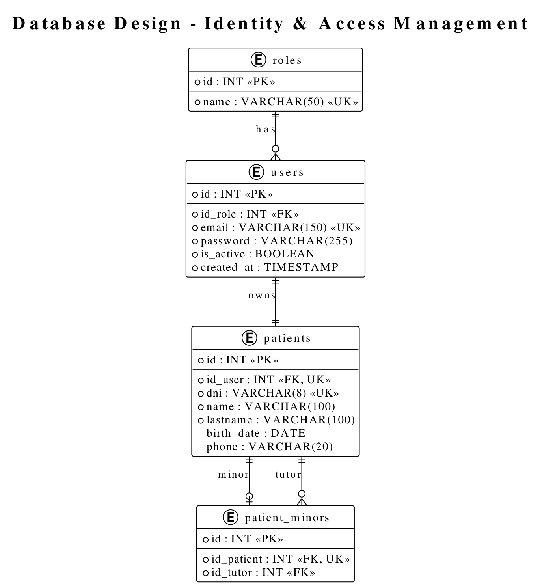

*Nota. Elaboración del equipo RuwaLabs para el proyecto SaludYa.*

---
El diagrama de base de datos del bounded context Identity & Access Management muestra las tablas roles, users, patients y patient_minors, junto con sus columnas, claves primarias, claves foráneas y restricciones de unicidad. Las relaciones reflejan la estructura de identidad: un rol tiene muchos usuarios, un usuario tiene un solo paciente, y un paciente puede ser tutor de muchos menores, como se observa en la [Figura 45](#figura-45).

---

### 2.6.2. Bounded Context: Appointments & Booking

El **bounded context de Appointments & Booking** gestiona el ciclo de vida de una cita médica: consulta de disponibilidad, reserva, confirmación y cancelación. Es el responsable de la **cola de pedido de cita** (`booking_order`), que define la prioridad del paciente para asumir cupos liberados.

#### 2.6.2.1. Domain Layer

La capa de **Domain** representa el núcleo del negocio de reserva de citas. Aquí se definen las entidades, value objects, enums, aggregates, domain events e interfaces que encapsulan las reglas de negocio.

##### Appointment (Aggregate Root)

**Atributos:**
`id`, `timeSlotId`, `patientId`, `bookingOrder: BookingOrder`, `status: AppointmentStatus`, `createdAt`, `updatedAt`

**Métodos:**
- `create(timeSlotId, patientId, bookingOrder)` → crea una nueva cita en estado `RESERVED` (factory method estático).
- `rehydrate(id, timeSlotId, patientId, bookingOrder, status, createdAt, updatedAt)` → reconstruye la cita desde su estado persistido.
- `cancel()` → cambia el estado a `CANCELLED` y registra el evento `AppointmentCancelledEvent`.
- `markAsAbsent()` → cambia el estado a `ABSENT` y registra el evento `AppointmentAbsentEvent`.
- `markAsAttended()` → cambia el estado a `ATTENDED`.
- `confirm()` → cambia el estado de `RESERVED` a `CONFIRMED`.
- `expire()` → cambia el estado a `EXPIRED`.
- `isActive()` → retorna `true` si el estado es `RESERVED` o `CONFIRMED`.
- `canBeCancelled(scheduledAt, deadlineHours)` → valida si aún está dentro del plazo de cancelación.

**Propósito:**
Representa una cita médica reservada. Es aggregate root porque agrupa el `bookingOrder` y controla el ciclo de vida de la cita.

---

##### TimeSlot (Aggregate Root)

**Atributos:**
`id`, `doctorId`, `date`, `startHour`, `endHour`, `maxCapacity`, `currentBookings`, `status: TimeSlotStatus`

**Métodos:**
- `create(doctorId, date, startHour, endHour, maxCapacity)` → crea un bloque horario en estado `AVAILABLE` (factory method estático).
- `rehydrate(id, doctorId, date, startHour, endHour, maxCapacity, currentBookings, status)` → reconstruye el bloque desde su estado persistido.
- `hasAvailableCapacity()` → retorna `true` si `currentBookings < maxCapacity`.
- `incrementBookings()` → aumenta `currentBookings` en 1.
- `decrementBookings()` → disminuye `currentBookings` en 1.
- `updateMaxCapacity(newMaxCapacity)` → actualiza la capacidad máxima, validando que no sea menor que `currentBookings`.
- `isFull()` → retorna `true` si `currentBookings >= maxCapacity`.
- `isExpired()` → retorna `true` si la fecha y hora ya pasaron.
- `cancel()` → cambia el estado a `CANCELLED`.

**Propósito:**
Representa un bloque horario concreto de un médico en una fecha. Es aggregate root porque controla la capacidad y el estado del bloque.

---

##### Doctor (Aggregate)

**Atributos:**
`id`, `specialtyId`, `name`, `lastname`

**Métodos:**
- `create(specialtyId, name, lastname)` → crea un médico (factory method estático).
- `rehydrate(id, specialtyId, name, lastname)` → reconstruye el médico desde su estado persistido.

**Propósito:**
Representa a un médico dentro del catálogo.

---

##### Specialty (Aggregate)

**Atributos:**
`id`, `name`, `description`

**Métodos:**
- `create(name, description)` → crea una especialidad (factory method estático).
- `rehydrate(id, name, description)` → reconstruye la especialidad desde su estado persistido.

**Propósito:**
Representa una especialidad médica dentro del catálogo.

---

##### BookingOrder (Value Object)

**Atributos:**
`value`

**Propósito:**
Encapsula el número secuencial de reserva. Es inmutable una vez asignado. El alcance "por especialidad" se resuelve al calcular el siguiente valor mediante `getNextBookingOrderBySpecialty`.

---

##### AppointmentStatus (Enum)

**Valores posibles:**
`RESERVED`, `CONFIRMED`, `CANCELLED`, `ABSENT`, `ATTENDED`, `EXPIRED`

**Propósito:**
Define los estados del ciclo de vida de una cita. Las transiciones hacia `ATTENDED` y `ABSENT` son disparadas por el bounded context `Arrival & QR Check-in`, y `EXPIRED` por un job programado.

---

##### TimeSlotStatus (Enum)

**Valores posibles:**
`AVAILABLE`, `FULL`, `CANCELLED`

**Propósito:**
Define el estado de disponibilidad de un bloque horario.

---

##### AppointmentRepository (Interface)

**Métodos:**
- `save(appointment: Appointment): Appointment`
- `findById(id: Long): Appointment?`
- `findByPatientId(patientId: Long): List<Appointment>`
- `findByTimeSlotId(timeSlotId: Long): List<Appointment>`
- `findActiveBySpecialtyId(specialtyId: Long): List<Appointment>`
- `getNextBookingOrderBySpecialty(specialtyId: Long): int`
- `existsActiveByPatientAndTimeSlot(patientId: Long, timeSlotId: Long): Boolean`
- `updateStatus(id: Long, status: AppointmentStatus)`
- `existsById(id: Long): Boolean`
- `deleteById(id: Long)`

**Propósito:**
Define las operaciones de persistencia para citas.

---

##### TimeSlotRepository (Interface)

**Métodos:**
- `save(timeSlot: TimeSlot): TimeSlot`
- `findById(id: Long): TimeSlot?`
- `findAvailableBySpecialty(specialtyId: Long, date: LocalDate): List<TimeSlot>`
- `findByDoctorAndDate(doctorId: Long, date: LocalDate): List<TimeSlot>`
- `existsById(id: Long): Boolean`

**Propósito:**
Define las operaciones de persistencia para bloques horarios.

---

##### SpecialtyRepository (Interface)

**Métodos:**
- `save(specialty: Specialty): Specialty`
- `findById(id: Long): Specialty?`
- `findAll(): List<Specialty>`
- `existsById(id: Long): Boolean`

**Propósito:**
Define las operaciones de persistencia para el catálogo de especialidades.

---

##### DoctorRepository (Interface)

**Métodos:**
- `save(doctor: Doctor): Doctor`
- `findById(id: Long): Doctor?`
- `findBySpecialtyId(specialtyId: Long): List<Doctor>`
- `findAll(): List<Doctor>`
- `existsById(id: Long): Boolean`

**Propósito:**
Define las operaciones de persistencia para el catálogo de médicos.

---

> **Nota sobre eventos de dominio:** `AppointmentBookedEvent`, `AppointmentCancelledEvent` y `AppointmentAbsentEvent` son registrados por el aggregate `Appointment` mediante `registerDomainEvent(...)` y publicados por el persistence adapter al guardar, usando `ApplicationEventPublisher` de Spring.

---

##### AppointmentBookedEvent (Domain Event)

**Atributos:**
`appointmentId`, `timeSlotId`, `patientId`, `bookingOrder`, `bookedAt`

**Propósito:**
Representa el hecho de negocio de que se reservó una nueva cita.

---

##### AppointmentCancelledEvent (Domain Event)

**Atributos:**
`appointmentId`, `freedTimeSlotId`, `cancelledAt`

**Propósito:**
Representa el hecho de negocio de que una cita fue cancelada y su cupo quedó libre.

---

##### AppointmentAbsentEvent (Domain Event)

**Atributos:**
`appointmentId`, `freedTimeSlotId`, `absentAt`

**Propósito:**
Representa el hecho de negocio de que un paciente no se presentó a su cita.

---

#### 2.6.2.2. Interface Layer

La **Interface Layer** expone las funcionalidades del bounded context mediante endpoints REST.

##### AppointmentsController (REST API Controller)

**Endpoints:**
- `POST /api/v1/appointments` → Reserva una nueva cita.
- `GET /api/v1/appointments/{id}` → Obtiene el detalle de una cita.
- `GET /api/v1/appointments/patient/{patientId}` → Lista citas de un paciente.
- `DELETE /api/v1/appointments/{id}` → Cancela una cita.

**Explicación:**
Este controlador gestiona las operaciones sobre el aggregate `Appointment`.

---

##### TimeSlotsController (REST API Controller)

**Endpoints:**
- `GET /api/v1/time-slots/available?specialtyId={id}&date={date}` → Lista bloques horarios disponibles de una especialidad.
- `GET /api/v1/time-slots?doctorId={id}&date={date}` → Lista bloques horarios de un médico en una fecha.
- `GET /api/v1/time-slots/{id}` → Obtiene el detalle de un bloque horario.
- `POST /api/v1/time-slots` → Crea un bloque horario.
- `PUT /api/v1/time-slots/{id}/capacity` → Actualiza la capacidad de un bloque horario.

**Explicación:**
Este controlador gestiona las operaciones sobre el aggregate `TimeSlot`.

---

##### SpecialtiesController (REST API Controller)

**Endpoints:**
- `GET /api/v1/specialties` → Lista especialidades disponibles.
- `GET /api/v1/specialties/{id}` → Obtiene el detalle de una especialidad.

**Explicación:**
Este controlador gestiona las operaciones sobre el aggregate `Specialty`.

---

##### DoctorsController (REST API Controller)

**Endpoints:**
- `GET /api/v1/doctors?specialtyId={id}` → Lista médicos de una especialidad.
- `GET /api/v1/doctors/{id}` → Obtiene el detalle de un médico.

**Explicación:**
Este controlador gestiona las operaciones sobre el aggregate `Doctor`.

---

#### 2.6.2.3. Application Layer

La **Application Layer** orquesta los casos de uso del dominio mediante **Command Services** y **Query Services**. Los command services retornan `Result<T, ApplicationError>` (patrón Result del módulo `shared`).

##### AppointmentCommandService (Interface)

**Métodos (Command Handlers):**
- `book(command: BookAppointmentCommand): Result<Appointment, ApplicationError>`
- `cancel(command: CancelAppointmentCommand): Result<Appointment, ApplicationError>`

**Propósito:**
Define los comandos relacionados con la cita.

---

##### TimeSlotCommandService (Interface)

**Métodos (Command Handlers):**
- `create(command: CreateTimeSlotCommand): Result<TimeSlot, ApplicationError>`
- `updateCapacity(command: UpdateTimeSlotCapacityCommand): Result<TimeSlot, ApplicationError>`

**Propósito:**
Define los comandos relacionados con el bloque horario.

---

##### AppointmentQueryService (Interface)

**Métodos (Query Handlers):**
- `getById(id: Long): Appointment?`
- `getByPatient(patientId: Long): List<Appointment>`
- `getByTimeSlot(timeSlotId: Long): List<Appointment>`

**Propósito:**
Define las consultas relacionadas con la cita.

---

##### TimeSlotQueryService (Interface)

**Métodos (Query Handlers):**
- `getById(id: Long): TimeSlot?`
- `getAvailableBySpecialty(specialtyId: Long, date: LocalDate): List<TimeSlot>`
- `getByDoctorAndDate(doctorId: Long, date: LocalDate): List<TimeSlot>`

**Propósito:**
Define las consultas relacionadas con el bloque horario.

---

##### SpecialtyQueryService (Interface)

**Métodos (Query Handlers):**
- `getAll(): List<Specialty>`
- `getById(id: Long): Specialty?`

**Propósito:**
Define las consultas relacionadas con el catálogo de especialidades.

---

##### DoctorQueryService (Interface)

**Métodos (Query Handlers):**
- `getBySpecialty(specialtyId: Long): List<Doctor>`
- `getById(id: Long): Doctor?`

**Propósito:**
Define las consultas relacionadas con el catálogo de médicos.

---

##### AppointmentCommandServiceImpl (Implementation)

**Responsabilidad:** Implementar los comandos de cita.

**Flujo de `book`:**
1. Recibe `patientId` y `timeSlotId`.
2. Carga el `TimeSlot` y valida que tenga capacidad disponible (`hasAvailableCapacity`).
3. Valida que no haya solapamiento (`existsActiveByPatientAndTimeSlot`).
4. Carga el `Doctor` del slot para obtener la `specialtyId`.
5. Calcula el siguiente `bookingOrder` con `getNextBookingOrderBySpecialty`.
6. Crea el `Appointment` en estado `RESERVED` con `Appointment.create(...)`.
7. Incrementa `current_bookings` y guarda el `TimeSlot`.
8. Guarda el `Appointment`; el adapter publica el evento `AppointmentBookedEvent`.

**Flujo de `cancel`:**
1. Recibe `appointmentId`.
2. Busca la cita.
3. Valida que esté activa (`isActive`).
4. Cambia el estado a `CANCELLED` con `cancel()`, que registra el evento `AppointmentCancelledEvent`.
5. Decrementa `current_bookings`.
6. Guarda el `Appointment`; el adapter publica el evento `AppointmentCancelledEvent`.

> **Nota:** la validación del plazo (`cancellationDeadlineHours`) proviene del bounded context `Hospital Operations & Configuration` y se integra mediante un ACL (pendiente).

---

> **Nota:** la reasignación de cupos liberados **por ausencia** es responsabilidad del bounded context `Reassignment`, que escucha `PatientAbsentEvent` publicado por `Arrival & QR Check-in`. La cancelación de una cita **no** dispara reasignación (solo libera el cupo para reserva externa). Este contexto no implementa handlers propios para reasignación.

---

##### TimeSlotCommandServiceImpl (Implementation)

**Responsabilidad:** Implementar los comandos de bloque horario.

**Flujo de `create`:**
1. Recibe `doctorId`, `date`, `startHour`, `endHour` y `maxCapacity`.
2. Crea el `TimeSlot` en estado `AVAILABLE` con `TimeSlot.create(...)`.
3. Guarda el `TimeSlot`.

**Flujo de `updateCapacity`:**
1. Recibe `timeSlotId` y `maxCapacity`.
2. Busca el `TimeSlot`.
3. Actualiza la capacidad con `updateMaxCapacity(...)`, validando que no sea menor que `currentBookings`.
4. Guarda el `TimeSlot`.

---

#### 2.6.2.4. Infrastructure Layer

La capa de **Infrastructure** contiene las implementaciones concretas.

##### AppointmentPersistenceAdapter
**Implementa:** `AppointmentRepository`
**Tecnología:** Spring Data JPA + PostgreSQL
**Explicación:**
Ejecuta operaciones sobre la tabla `appointments`, implementa el cálculo de `booking_order` secuencial por especialidad y publica los domain events del aggregate (`AppointmentBookedEvent`, `AppointmentCancelledEvent`, `AppointmentAbsentEvent`) vía `ApplicationEventPublisher` de Spring tras persistir.

---

##### TimeSlotPersistenceAdapter
**Implementa:** `TimeSlotRepository`
**Tecnología:** Spring Data JPA + PostgreSQL
**Explicación:**
Ejecuta operaciones sobre la tabla `time_slots`.

---

##### SpecialtyPersistenceAdapter
**Implementa:** `SpecialtyRepository`
**Tecnología:** Spring Data JPA + PostgreSQL
**Explicación:**
Ejecuta operaciones sobre la tabla `specialties`.

---

##### DoctorPersistenceAdapter
**Implementa:** `DoctorRepository`
**Tecnología:** Spring Data JPA + PostgreSQL
**Explicación:**
Ejecuta operaciones sobre la tabla `doctors`.

---

##### NotificationAdapter
**Función:**
Envía notificaciones de confirmación y cancelación al paciente.
**Tecnología:** SMTP
**Explicación:**
Requiere un ACL hacia el bounded context `Identity & Access Management` para obtener el correo del paciente. Su implementación está pendiente.

---

#### 2.6.2.5. Bounded Context Software Architecture Component Level Diagrams

**Figura 46**

*Diagrama de componentes — Appointment*

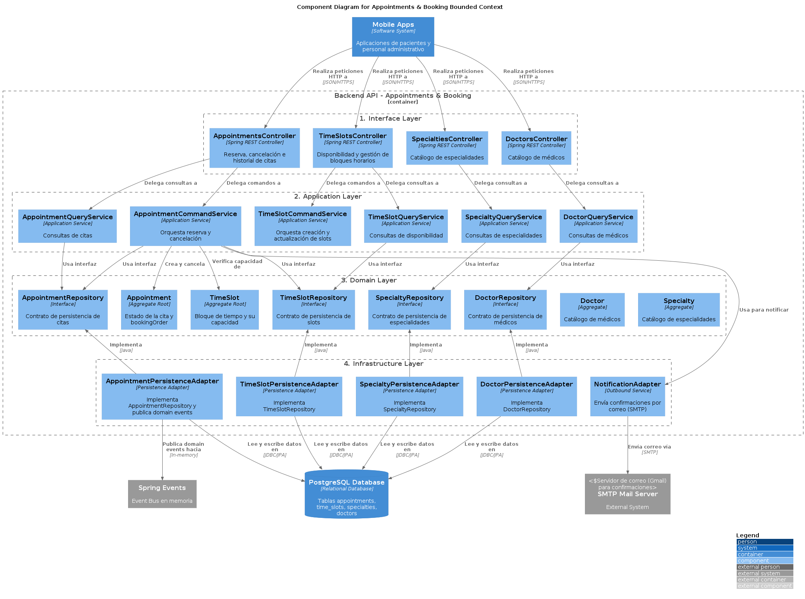

*Nota. Elaboración del equipo RuwaLabs para el proyecto SaludYa.*

---
El diagrama de componentes del bounded context Appointments & Booking muestra la organización interna del Backend API en sus cuatro capas. En la Interface Layer, los controladores exponen los endpoints REST para reservar, cancelar, consultar disponibilidad, gestionar bloques horarios y explorar el catálogo médico. En la Application Layer, los Command Services y Query Services orquestan los casos de uso. En la Domain Layer, los aggregates Appointment y TimeSlot encapsulan las reglas de negocio, junto con los aggregates Doctor y Specialty y los domain events. En la Infrastructure Layer, los adapters implementan la persistencia con Spring Data JPA y la publicación de eventos de dominio con `ApplicationEventPublisher` de Spring, como se observa en la [Figura 46](#figura-46).

#### 2.6.2.6. Bounded Context Software Architecture Code Level Diagrams

##### 2.6.2.6.1. Bounded Context Domain Layer Class Diagrams

**Figura 47**

*Diagrama de clases — Appointment*

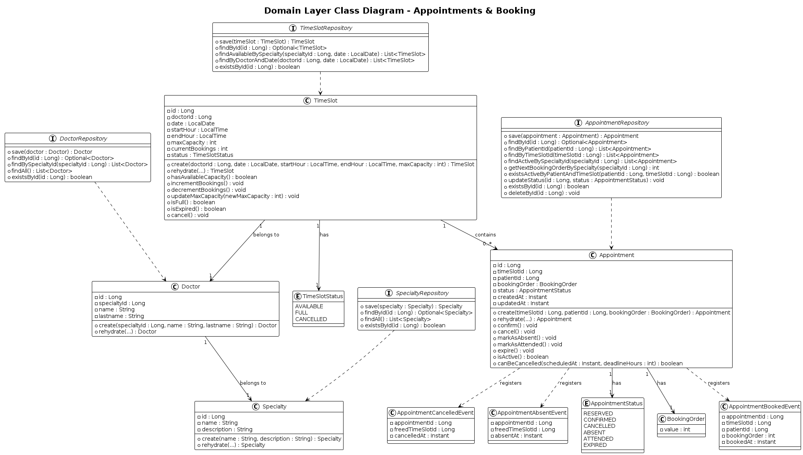

*Nota. Elaboración del equipo RuwaLabs para el proyecto SaludYa.*

---
El diagrama de clases del dominio del bounded context Appointments & Booking representa los aggregates, value objects, enums, domain events e interfaces de repositorio que encapsulan las reglas de negocio de reserva de citas. Se muestran las relaciones entre Appointment, TimeSlot, Doctor y Specialty, junto con el value object BookingOrder, los enums AppointmentStatus y TimeSlotStatus, los domain events y los repositorios, como se observa en la [Figura 47](#figura-47).

##### 2.6.2.6.2. Bounded Context Database Design Diagram

**Figura 48**

*Diagrama de base de datos — Appointment*

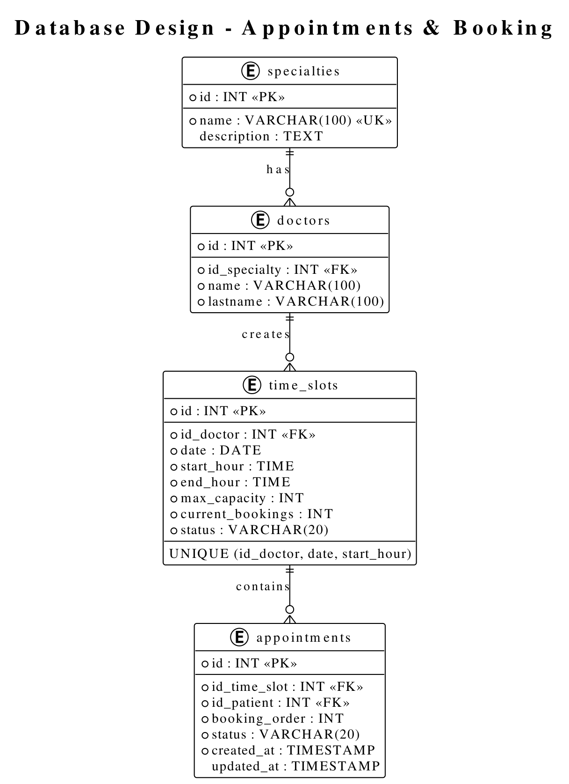

*Nota. Elaboración del equipo RuwaLabs para el proyecto SaludYa.*

---
El diagrama de base de datos del bounded context Appointments & Booking muestra las tablas specialties, doctors, time_slots y appointments, junto con sus columnas, claves primarias, claves foráneas y restricciones de unicidad. Las relaciones reflejan la estructura del catálogo médico y la reserva de citas: una especialidad tiene muchos doctores, un doctor tiene muchos bloques horarios, y un bloque horario contiene muchas citas, como se observa en la [Figura 48](#figura-48).

---

### 2.6.3. Bounded Context: Reassignment

El **bounded context de Reassignment** gestiona la reasignación de cupos liberados por **ausencias** presenciales. La reasignación opera sobre la **cola de reserva** (`appointments` ordenadas por `booking_order`); no existe lista de espera externa ni cascada hacia otros `Time Slot`. Cuando un paciente no se presenta y es declarado ausente, el sistema toma al siguiente paciente de la misma especialidad (por `booking_order`) y le ofrece el cupo liberado. El candidato dispone de una **ventana única** (`expiresAt`) para aceptar **y** presentarse. Si acepta y llega, se reasigna; al abandonar su slot original, este se libera y se re-ofrece al siguiente, formando una **cadena de reasignación**. Si rechaza o no responde, se pasa al siguiente candidato. Si acepta pero no llega, se declara ausente. Si nadie en la cola acepta, el cupo se cierra. La cancelación de citas **no** dispara este flujo.

#### 2.6.3.1. Domain Layer

La capa de **Domain** representa el núcleo del negocio de reasignación. Aquí se definen el aggregate root, el enum y los domain events (records inmutables) que encapsulan las reglas de negocio.

##### ReassignmentOffer (Aggregate Root)

**Atributos:**
`id`, `appointmentId`, `originalAppointmentId`, `freedTimeSlotId`, `candidateTimeSlotId`, `status: ReassignmentStatus`, `offeredAt`, `respondedAt`, `expiresAt`

**Métodos:**
- `offer(appointmentId, originalAppointmentId, freedTimeSlotId, candidateTimeSlotId, expiresAt)` → factory que crea una oferta `PENDING`.
- `onOffered()` → registra `ReassignmentOfferSentEvent` (tras persistir, cuando ya existe el `id`).
- `accept()` → valida `PENDING` y no expirada; cambia a `ACCEPTED` y registra `respondedAt` y `ReassignmentOfferAcceptedEvent`.
- `reject()` → valida `PENDING`; cambia a `REJECTED` y registra `ReassignmentOfferRejectedEvent`.
- `expire()` → valida `PENDING` y `expiresAt < now`; cambia a `EXPIRED` y registra `ReassignmentOfferExpiredEvent`.
- `markArrived()` → valida `ACCEPTED`; cambia a `ATTENDED` y registra `ReassignmentOfferAttendedEvent`.
- `markNoShow()` → valida `ACCEPTED` y `expiresAt < now`; cambia a `ABSENT` y registra `ReassignmentOfferNoShowEvent`.
- `isPending()`, `isAccepted()`, `isExpired()` → predicados de estado.

**Propósito:**
Representa una oferta de reasignación enviada a un candidato de la cola de reserva. Es aggregate root porque controla el ciclo de vida completo de la oferta. Los identificadores de `Appointment` y `TimeSlot` se modelan como `Long` planos para no acoplar la persistencia entre bounded contexts.

---

##### ReassignmentStatus (Enum)

**Valores posibles:**
`PENDING`, `ACCEPTED`, `REJECTED`, `EXPIRED`, `ATTENDED`, `ABSENT`

**Propósito:**
Define los estados del ciclo de vida de una oferta de reasignación.

---

##### ReassignmentOfferRepository (Interface)

**Métodos:**
- `save(offer: ReassignmentOffer): ReassignmentOffer`
- `findById(id: Long): Optional<ReassignmentOffer>`
- `findPendingByAppointment(appointmentId: Long): List<ReassignmentOffer>`
- `findExpiredOffers(): List<ReassignmentOffer>`
- `findAcceptedOverdue(): List<ReassignmentOffer>`

**Propósito:**
Define las operaciones de persistencia para ofertas de reasignación.

---

##### Domain Events (records)

Los domain events son **records inmutables** publicados por el persistence adapter vía `ApplicationEventPublisher` de Spring. El agregado los registra con `registerDomainEvent(...)` (heredado de `AbstractDomainAggregateRoot`).

- **ReassignmentOfferSentEvent:** `offerId`, `appointmentId`, `freedTimeSlotId`, `offeredAt` — se envió una oferta.
- **ReassignmentOfferAcceptedEvent:** `offerId`, `appointmentId`, `freedTimeSlotId`, `originalAppointmentId`, `candidateTimeSlotId`, `acceptedAt` — el candidato aceptó (lleva el snapshot para que Booking mueva la cita y libere el slot original).
- **ReassignmentOfferRejectedEvent:** `offerId`, `appointmentId`, `freedTimeSlotId`, `originalAppointmentId`, `rejectedAt` — el candidato rechazó.
- **ReassignmentOfferExpiredEvent:** `offerId`, `appointmentId`, `freedTimeSlotId`, `originalAppointmentId`, `expiredAt` — la oferta expiró sin respuesta.
- **ReassignmentOfferAttendedEvent:** `offerId`, `appointmentId`, `attendedAt` — el candidato aceptó y llegó.
- **ReassignmentOfferNoShowEvent:** `offerId`, `appointmentId`, `freedTimeSlotId`, `noShowAt` — el candidato aceptó y no llegó.

> **Nota:** la búsqueda del siguiente candidato (`findNextCandidate`) no es un domain service: se resuelve mediante un ACL hacia `Appointments & Booking`, porque consulta datos de otro bounded context.

---

#### 2.6.3.2. Interface Layer

La **Interface Layer** expone las funcionalidades del bounded context mediante endpoints REST y un consumer de eventos.

##### ReassignmentOffersController (REST API Controller)

**Endpoints:**
- `GET /api/v1/reassignment-offers/pending?appointmentId={id}` → Lista ofertas pendientes de un candidato.
- `POST /api/v1/reassignment-offers/{id}/accept` → Acepta una oferta.
- `POST /api/v1/reassignment-offers/{id}/reject` → Rechaza una oferta.

**Explicación:**
Este controlador gestiona las operaciones sobre el aggregate `ReassignmentOffer`.

---

##### PatientAbsentEventConsumer (Event Consumer)

**Función:**
Escucha el evento `PatientAbsentEvent` publicado por `Arrival & QR Check-in` y dispara el protocolo de reasignación.
**Tecnología:** `@EventListener` de Spring

---

#### 2.6.3.3. Application Layer

La **Application Layer** orquesta los casos de uso mediante **Command Services** y **Query Services**. Los command services retornan `Result<T, ApplicationError>` (patrón Result del módulo `shared`), y los **Event Handlers** viven en `application/internal/eventhandlers/`.

##### ReassignmentCommandService (Interface)

**Métodos (Command Handlers):**
- `sendReassignmentOffer(command: SendReassignmentOfferCommand): Optional<Long>` — dispara la reasignación y devuelve el id de la oferta creada (vacío si no hay candidato).
- `acceptReassignment(command: AcceptReassignmentCommand): Result<ReassignmentOffer, ApplicationError>`
- `rejectReassignment(command: RejectReassignmentCommand): Result<ReassignmentOffer, ApplicationError>`

**Propósito:**
Define los comandos relacionados con la reasignación.

---

##### ReassignmentQueryService (Interface)

**Métodos (Query Handlers):**
- `getPendingByAppointment(appointmentId: Long): List<ReassignmentOffer>`
- `getById(id: Long): Optional<ReassignmentOffer>`

**Propósito:**
Define las consultas relacionadas con la reasignación.

---

##### AppointmentLookupService (ACL / Outbound)

**Métodos:**
- `findNextCandidateByBookingOrder(freedTimeSlotId): Optional<Long>` — devuelve el `appointmentId` del siguiente candidato por `bookingOrder`.
- `timeSlotOfAppointment(appointmentId): Long` — devuelve el slot actual del candidato.

**Propósito:**
Puerto de acceso a `Appointments & Booking`. Implementación en memoria (pendiente de conectar a la facade real).

---

##### HospitalConfigurationService (ACL / Outbound)

**Métodos:**
- `reassignmentResponseTimeoutMinutes(): int`

**Propósito:**
Puerto de acceso a `Hospital Operations & Configuration` para la ventana única. Implementación en memoria (pendiente).

---

##### ReassignmentCommandServiceImpl (Implementation)

**Responsabilidad:** Implementar los comandos de reasignación.

**Flujo de `sendReassignmentOffer`:**
1. Recibe `originalAppointmentId` y `freedTimeSlotId`.
2. Busca el siguiente candidato con `AppointmentLookupService.findNextCandidateByBookingOrder`.
3. Si no hay candidato, no hace nada (el cupo se cierra).
4. Lee la ventana única con `HospitalConfigurationService.reassignmentResponseTimeoutMinutes`.
5. Calcula `expiresAt = now + ventana` y obtiene `candidateTimeSlotId`.
6. Crea la oferta `PENDING` con `ReassignmentOffer.offer(...)` y la guarda (publica `ReassignmentOfferSentEvent`).

**Flujo de `acceptReassignment`:**
1. Busca la oferta; valida que esté `PENDING` y no expirada.
2. Llama `accept()` (cambia a `ACCEPTED`) y guarda (publica `ReassignmentOfferAcceptedEvent`).
3. El handler de `AcceptedEvent` libera el slot original del candidato y reinicia la cadena.

**Flujo de `rejectReassignment`:**
1. Busca la oferta; valida que esté `PENDING`.
2. Llama `reject()` y guarda (publica `ReassignmentOfferRejectedEvent`).

---

##### Event Handlers

- **PatientAbsentEventHandler** — escucha `PatientAbsentEvent` y dispara `sendReassignmentOffer`.
- **ReassignmentOfferAcceptedEventHandler** — escucha `AcceptedEvent` y re-ofrece el slot original del candidato (cadena).
- **ReassignmentOfferRejectedEventHandler** — escucha `RejectedEvent` y ofrece el mismo slot al siguiente candidato.
- **ReassignmentOfferExpiredEventHandler** — escucha `ExpiredEvent` y ofrece el mismo slot al siguiente candidato.
- **ReassignmentOfferNoShowEventHandler** — escucha `NoShowEvent` y cierra el cupo (Booking marcará la cita como ausente).

---

#### 2.6.3.4. Infrastructure Layer

La capa de **Infrastructure** contiene las implementaciones concretas.

##### ReassignmentOfferRepositoryImpl
**Implementa:** `ReassignmentOfferRepository`
**Tecnología:** Spring Data JPA + PostgreSQL
**Explicación:**
Ejecuta operaciones sobre la tabla `reassignment_offers` y publica los domain events del aggregate vía `ApplicationEventPublisher` de Spring tras persistir.

---

##### ReassignmentExpirationScheduler
**Función:**
Ejecuta periódicamente dos tareas: (1) expira las ofertas `PENDING` cuya ventana venció, y (2) marca como `ABSENT` las ofertas `ACCEPTED` cuya ventana venció sin llegada.
**Tecnología:** `@Scheduled` de Spring

---

##### NotificationAdapter
**Función:**
Envía notificaciones de ofertas de reasignación al paciente (pendiente de implementación; se integrará consumiendo los domain events).
**Tecnología:** SMTP + Firebase Cloud Messaging

---

#### 2.6.3.5. Bounded Context Software Architecture Component Level Diagrams

**Figura 49**

*Diagrama de componentes — Reassignment*

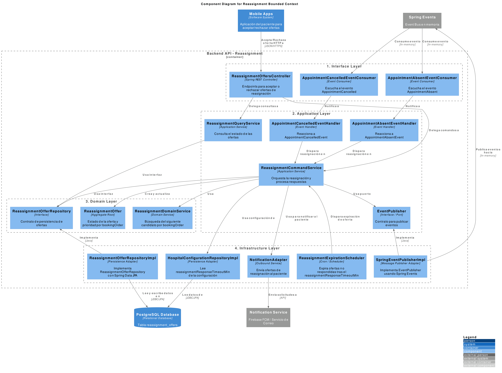

*Nota. Elaboración del equipo RuwaLabs para el proyecto SaludYa.*

---
El diagrama de componentes del bounded context Reassignment muestra la organización interna del Backend API en sus cuatro capas. En la Interface Layer, el ReassignmentOffersController expone los endpoints REST para aceptar o rechazar ofertas, y el PatientAbsentEventConsumer escucha el evento de ausencia de Arrival. En la Application Layer, los Command Services y Query Services orquestan los casos de uso, junto con los Event Handlers que hacen avanzar la cadena de reasignación y los ACLs (AppointmentLookupService y HospitalConfigurationService). En la Domain Layer, el aggregate ReassignmentOffer encapsula las reglas de negocio, junto con el enum ReassignmentStatus, los domain events y la interfaz ReassignmentOfferRepository. En la Infrastructure Layer, los adapters implementan la persistencia con Spring Data JPA (ReassignmentOfferRepositoryImpl) y la expiración automática de ofertas (ReassignmentExpirationScheduler). La comunicación con la base de datos PostgreSQL se realiza mediante JDBC/JPA, como se observa en la [Figura 49](#figura-49).

#### 2.6.3.6. Bounded Context Software Architecture Code Level Diagrams

##### 2.6.3.6.1. Bounded Context Domain Layer Class Diagrams

**Figura 50**

*Diagrama de clases — Reassignment*

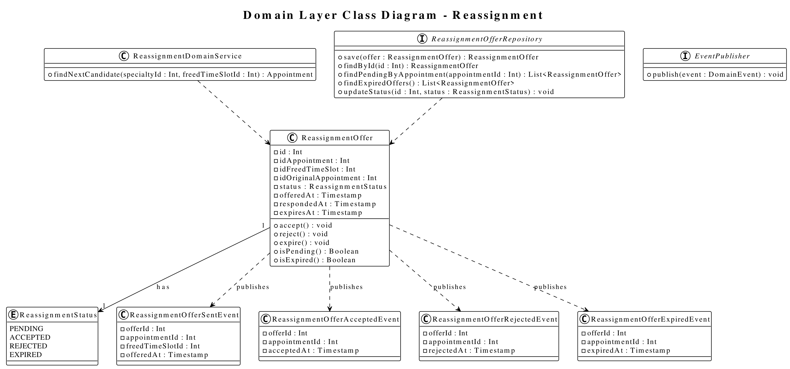

*Nota. Elaboración del equipo RuwaLabs para el proyecto SaludYa.*

---
El diagrama de clases del dominio del bounded context Reassignment representa el aggregate root ReassignmentOffer que encapsula el estado de la oferta, junto con el enum ReassignmentStatus que define los estados posibles (PENDING, ACCEPTED, REJECTED, EXPIRED, ATTENDED, ABSENT). Se muestran los seis Domain Events (records) que publica el aggregate (ReassignmentOfferSentEvent, ReassignmentOfferAcceptedEvent, ReassignmentOfferRejectedEvent, ReassignmentOfferExpiredEvent, ReassignmentOfferAttendedEvent, ReassignmentOfferNoShowEvent) y la interfaz ReassignmentOfferRepository, como se observa en la [Figura 50](#figura-50).

##### 2.6.3.6.2. Bounded Context Database Design Diagram

**Figura 51**

*Diagrama de base de datos — Reassignment*

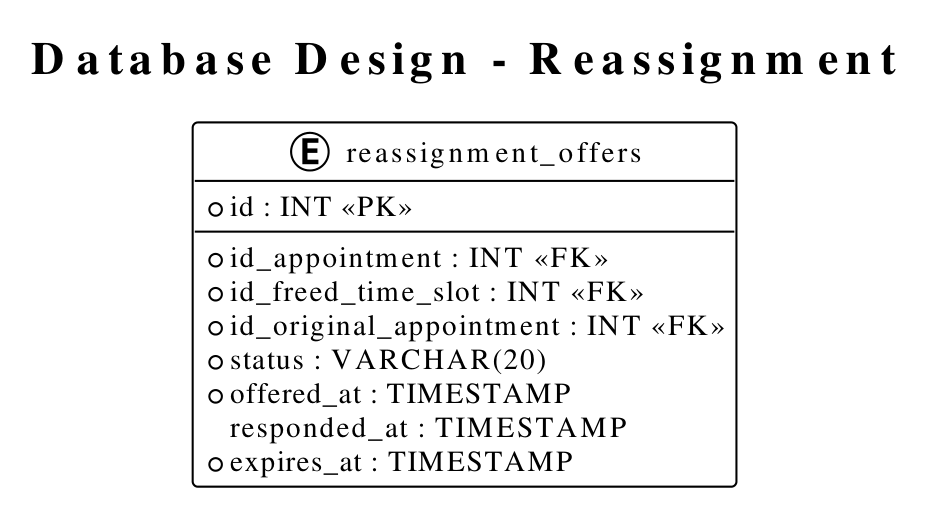

*Nota. Elaboración del equipo RuwaLabs para el proyecto SaludYa.*

---
El diagrama de base de datos del bounded context Reassignment muestra la tabla reassignment_offers, que almacena las ofertas de reasignación enviadas a los pacientes de la cola de reserva. La tabla incluye dos foreign keys hacia appointments (el paciente candidato y la cita original liberada) y dos foreign keys hacia time_slots (el cupo liberado y el slot actual del candidato), junto con el estado de la oferta y los timestamps de envío, respuesta y expiración, como se observa en la [Figura 51](#figura-51).

---

### 2.6.4. Bounded Context: Arrival & QR Check-in

El **bounded context de Arrival & QR Check-in** gestiona la llegada física del paciente al establecimiento de salud, la validación del código QR y la **cola de asistencia** (`attendance_queue`), que ordena a los pacientes por orden de llegada dentro de cada `time_slot`. Cuando el paciente escanea el código QR, el sistema valida el token firmado por el propio backend, registra su presencia, lo ingresa a la cola de asistencia y emite el ticket digital con su posición. Si el paciente no se presenta dentro de la ventana de tolerancia o no responde al llamado, el sistema declara su ausencia y libera el cupo.

#### 2.6.4.1. Domain Layer

La capa de **Domain** representa el núcleo del negocio de llegada y check-in. Aquí se definen las entidades, value objects, enums, aggregates, factories, domain services e interfaces que encapsulan las reglas de la cola de asistencia y la validación de presencia.

##### CheckIn (Aggregate Root)

**Atributos:**
`id`, `idAppointment`, `qrToken`, `status: CheckInStatus`, `checkedInAt`

**Métodos:**
- `isValid()` → retorna `true` si el estado es `VALID`.
- `expire()` → cambia el estado a `EXPIRED`.
- `invalidate()` → cambia el estado a `INVALID`.

**Propósito:**
Representa la validación de presencia física del paciente. Es aggregate root porque controla el ciclo de vida del check-in.

---

##### AttendanceQueue (Aggregate Root)

**Atributos:**
`id`, `idTimeSlot`, `date`, `status: AttendanceQueueStatus`

**Métodos:**
- `open()` → cambia el estado a `OPEN`.
- `close()` → cambia el estado a `CLOSED`.
- `pause()` → cambia el estado a `PAUSED`.
- `getEntriesOrdered()` → retorna las entradas ordenadas por `position`.

**Propósito:**
Representa la fila de asistencia de un `time_slot` en una fecha. Es aggregate root porque agrupa las `QueueEntry`.

---

##### QueueEntry (Entity)

**Atributos:**
`id`, `idAttendanceQueue`, `idCheckIn`, `position`, `status: QueueEntryStatus`, `calledAt`, `attendedAt`

**Métodos:**
- `call()` → cambia el estado a `CALLED`.
- `startAttention()` → cambia el estado a `IN_ATTENTION`.
- `markAsAttended()` → cambia el estado a `ATTENDED`.
- `markAsAbsent()` → cambia el estado a `ABSENT`.
- `isWaiting()` → retorna `true` si el estado es `WAITING`.

**Propósito:**
Representa a cada persona en la fila de asistencia.

---

##### QueuePosition (Value Object)

**Atributos:**
`value`, `totalInQueue`

**Propósito:**
Encapsula la posición del paciente en la cola de asistencia. Es inmutable y se calcula por timestamp de check-in.

---

##### CheckInStatus (Enum)

**Valores posibles:**
`VALID`, `EXPIRED`, `INVALID`

**Propósito:**
Define el estado de la validación del check-in.

---

##### AttendanceQueueStatus (Enum)

**Valores posibles:**
`OPEN`, `CLOSED`, `PAUSED`

**Propósito:**
Define el estado de la fila de asistencia.

---

##### QueueEntryStatus (Enum)

**Valores posibles:**
`WAITING`, `CALLED`, `IN_ATTENTION`, `ATTENDED`, `ABSENT`

**Propósito:**
Define el estado de cada entrada en la cola de asistencia.

---

##### CheckInFactory (Factory)

**Métodos:**
- `createCheckIn(appointment, qrToken): CheckIn`

**Propósito:**
Encapsula la creación de un check-in, validando que la cita exista.

---

##### QueueDomainService (Domain Service)

**Métodos:**
- `calculatePosition(attendanceQueueId): Int`
- `validateToleranceWindow(checkInTime, timeSlot): Boolean`

**Propósito:**
Encapsula la lógica de cálculo de posición en la cola y la validación de la ventana de tolerancia.

---

##### CheckInRepository (Interface)

**Métodos:**
- `save(checkIn: CheckIn): CheckIn`
- `findById(id: Int): CheckIn?`
- `findByAppointment(appointmentId: Int): CheckIn?`
- `findByQRToken(qrToken: String): CheckIn?`
- `updateStatus(id: Int, status: CheckInStatus)`

**Propósito:**
Define las operaciones de persistencia para check-ins.

---

##### AttendanceQueueRepository (Interface)

**Métodos:**
- `save(queue: AttendanceQueue): AttendanceQueue`
- `findById(id: Int): AttendanceQueue?`
- `findByTimeSlotAndDate(timeSlotId: Int, date: Date): AttendanceQueue?`
- `createIfNotExists(timeSlotId: Int, date: Date): AttendanceQueue`
- `updateStatus(id: Int, status: AttendanceQueueStatus)`

**Propósito:**
Define las operaciones de persistencia para colas de asistencia.

---

##### QueueEntryRepository (Interface)

**Métodos:**
- `save(entry: QueueEntry): QueueEntry`
- `findById(id: Int): QueueEntry?`
- `findByAttendanceQueue(queueId: Int): List<QueueEntry>`
- `getNextPosition(queueId: Int): Int`
- `updateStatus(id: Int, status: QueueEntryStatus)`
- `findExpiredCalledEntries(toleranceMinutes: Int): List<QueueEntry>`

**Propósito:**
Define las operaciones de persistencia para entradas de la cola.

---

##### EventPublisher (Interface)

**Métodos:**
- `publish(event: DomainEvent)`

**Propósito:**
Define la interfaz para publicar eventos de dominio. La implementación concreta usa Spring Events.

---

##### CheckInCompletedEvent (Domain Event)

**Atributos:**
`checkInId`, `appointmentId`, `attendanceQueueId`, `position`, `completedAt`

**Propósito:**
Representa el hecho de negocio de que un paciente completó su check-in y fue ingresado a la cola de asistencia.

---

##### PatientCalledEvent (Domain Event)

**Atributos:**
`queueEntryId`, `attendanceQueueId`, `position`, `calledAt`

**Propósito:**
Representa el hecho de negocio de que un paciente fue llamado a consultorio.

---

##### PatientAbsentEvent (Domain Event)

**Atributos:**
`queueEntryId`, `appointmentId`, `freedTimeSlotId`, `absentAt`

**Propósito:**
Representa el hecho de negocio de que un paciente fue declarado ausente por no presentarse al llamado.

---

#### 2.6.4.2. Interface Layer

La **Interface Layer** expone las funcionalidades del bounded context mediante endpoints REST.

##### CheckInsController (REST API Controller)

**Endpoints:**
- `POST /api/v1/check-ins/qr` → Valida el QR y registra el check-in.
- `GET /api/v1/check-ins/{id}` → Obtiene el detalle del check-in.
- `GET /api/v1/check-ins/appointment/{appointmentId}` → Obtiene el check-in de una cita.

**Explicación:**
Este controlador gestiona las operaciones sobre el aggregate `CheckIn`.

---

##### AttendanceQueuesController (REST API Controller)

**Endpoints:**
- `GET /api/v1/attendance-queues/{id}` → Obtiene el estado de la cola.
- `GET /api/v1/attendance-queues/{id}/entries` → Lista las entradas de la cola.
- `POST /api/v1/attendance-queues/{id}/call-next` → Llama al siguiente paciente.

**Explicación:**
Este controlador gestiona las operaciones sobre el aggregate `AttendanceQueue`.

---

##### QueueEntriesController (REST API Controller)

**Endpoints:**
- `GET /api/v1/queue-entries/{id}` → Obtiene el detalle de una entrada.
- `POST /api/v1/queue-entries/{id}/absent` → Marca una entrada como ausente.

**Explicación:**
Este controlador gestiona las operaciones sobre la entity `QueueEntry`.

---

#### 2.6.4.3. Application Layer

La **Application Layer** orquesta los casos de uso del dominio mediante **Command Services** y **Query Services**. Los **Command Handlers** viven dentro de los Command Services, y los **Event Handlers** en `application/internal/eventhandlers/`.

##### CheckInCommandService (Interface)

**Métodos (Command Handlers):**
- `validateQR(command: ValidateQRCommand): CheckInResult`
- `registerCheckIn(command: RegisterCheckInCommand): QueueEntry`
- `declareAbsence(command: DeclareAbsenceCommand): void`
- `detectAbsences(): void`

**Propósito:**
Define los comandos relacionados con el check-in.

---

##### QueueCommandService (Interface)

**Métodos (Command Handlers):**
- `callNextPatient(command: CallNextPatientCommand): QueueEntry`

**Propósito:**
Define los comandos relacionados con la cola de asistencia.

---

##### CheckInQueryService (Interface)

**Métodos (Query Handlers):**
- `getById(id: Int): CheckIn?`
- `getByAppointment(appointmentId: Int): CheckIn?`

**Propósito:**
Define las consultas relacionadas con el check-in.

---

##### QueueQueryService (Interface)

**Métodos (Query Handlers):**
- `getQueuePosition(checkInId: Int): QueuePosition`
- `getQueueEntries(queueId: Int): List<QueueEntry>`

**Propósito:**
Define las consultas relacionadas con la cola.

---

##### CheckInCommandServiceImpl (Implementation)

**Responsabilidad:** Implementar los comandos de check-in.

**Flujo de `validateQR`:**
1. Recibe `qrToken`.
2. Lee `checkInToleranceMinutes` de la configuración.
3. Busca la cita asociada al QR.
4. Valida el estado y la ventana de tolerancia con `QueueDomainService.validateToleranceWindow`.
5. Retorna el resultado.

**Flujo de `registerCheckIn`:**
1. Crea el `CheckIn` con estado `VALID` usando `CheckInFactory`.
2. Crea o recupera la `AttendanceQueue`.
3. Calcula la `position` con `QueueDomainService.calculatePosition`.
4. Crea el `QueueEntry` con estado `WAITING`.
5. Actualiza la cita a `CONFIRMED`.
6. Publica el evento `CheckInCompletedEvent`.
7. Notifica al paciente con su posición.

**Flujo de `declareAbsence`:**
1. Lee `postCallToleranceMinutes` de la configuración.
2. Valida que el `QueueEntry` esté `CALLED`.
3. Cambia el estado a `ABSENT`.
4. Publica el evento `PatientAbsentEvent`.
5. Dispara la reasignación.

---

##### QueueCommandServiceImpl (Implementation)

**Responsabilidad:** Implementar los comandos de cola.

**Flujo de `callNextPatient`:**
1. Busca el primer `QueueEntry` con estado `WAITING`.
2. Cambia su estado a `CALLED`.
3. Publica el evento `PatientCalledEvent`.
4. Notifica al paciente.

---

##### CheckInCompletedEventHandler (Event Handler)

**Responsabilidad:** Reaccionar al evento `CheckInCompletedEvent`.
**Flujo:**
1. Escucha el evento.
2. Notifica al paciente que ha sido ingresado a la cola.
3. Registra la acción en el log de auditoría.

---

##### PatientCalledEventHandler (Event Handler)

**Responsabilidad:** Reaccionar al evento `PatientCalledEvent`.
**Flujo:**
1. Escucha el evento.
2. Envía una notificación push al paciente.
3. Registra la acción en el log de auditoría.

---

#### 2.6.4.4. Infrastructure Layer

La capa de **Infrastructure** contiene las implementaciones concretas.

##### CheckInRepositoryImpl
**Implementa:** `CheckInRepository`
**Tecnología:** Spring Data JPA + PostgreSQL
**Explicación:**
Ejecuta operaciones sobre la tabla `check_ins`.

---

##### AttendanceQueueRepositoryImpl
**Implementa:** `AttendanceQueueRepository`
**Tecnología:** Spring Data JPA + PostgreSQL
**Explicación:**
Ejecuta operaciones sobre la tabla `attendance_queues`.

---

##### QueueEntryRepositoryImpl
**Implementa:** `QueueEntryRepository`
**Tecnología:** Spring Data JPA + PostgreSQL
**Explicación:**
Ejecuta operaciones sobre la tabla `queue_entries`.

---

##### HospitalConfigurationRepositoryImpl
**Implementa:** `HospitalConfigurationRepository`
**Tecnología:** Spring Data JPA + PostgreSQL
**Explicación:**
Lee `checkInToleranceMinutes`, `postCallToleranceMinutes` y `attendanceQueueVisible` de la configuración del hospital.

---

##### JwtQRValidator (Utility)
**Función:**
Valida el token QR firmado por el backend usando JWT.
**Tecnología:** java-jwt / jjwt
**Explicación:**
Verifica la firma y la expiración del `qrToken` generado por el backend al confirmar la reserva. No se comunica con ningún sistema externo.

---

##### TicketGenerationAdapter
**Función:**
Genera el ticket digital con identificador de llamado y posición en la cola.
**Tecnología:** iText / Kotlin PDF

---

##### NotificationAdapter
**Función:**
Envía notificaciones al paciente (check-in completado, llamado a consultorio).
**Tecnología:** SMTP + Firebase Cloud Messaging

---

##### SpringEventPublisherImpl
**Implementa:** `EventPublisher`
**Función:**
Publica eventos de dominio usando Spring Events.
**Tecnología:** `ApplicationEventPublisher` de Spring

---

##### AbsenceDetectionScheduler
**Función:**
Ejecuta periódicamente `detectAbsences` para detectar ausencias automáticamente.
**Tecnología:** `@Scheduled` de Spring

---

#### 2.6.4.5. Bounded Context Software Architecture Component Level Diagrams

**Figura 52**

*Diagrama de componentes — Arrival*

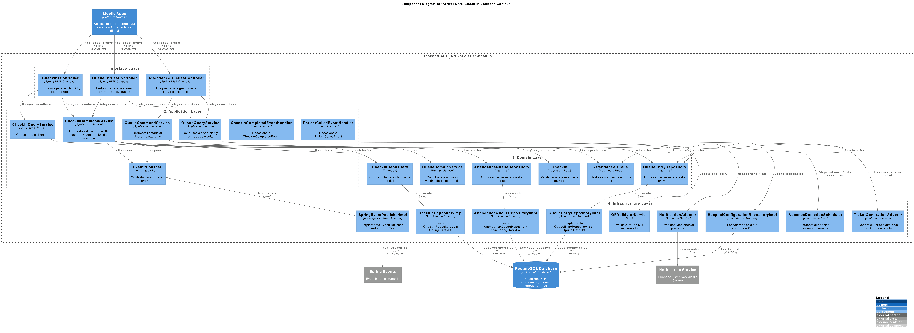

*Nota. Elaboración del equipo RuwaLabs para el proyecto SaludYa.*

---
El diagrama de componentes del bounded context Arrival & QR Check-in muestra la organización interna del Backend API en sus cuatro capas. En la Interface Layer, los controladores CheckInsController, AttendanceQueuesController y QueueEntriesController exponen los endpoints REST para validar el QR, registrar el check-in y gestionar la cola de asistencia. En la Application Layer, los Command Services y Query Services orquestan los casos de uso, junto con los Event Handlers que reaccionan a los eventos de check-in completado y paciente llamado. En la Domain Layer, los aggregates CheckIn y AttendanceQueue encapsulan las reglas de negocio, junto con el QueueDomainService (que calcula la posición y valida la tolerancia) y las interfaces de repositorio. En la Infrastructure Layer, los adapters implementan la persistencia con Spring Data JPA (CheckInRepositoryImpl, AttendanceQueueRepositoryImpl, QueueEntryRepositoryImpl, HospitalConfigurationRepositoryImpl), la validación del QR firmado por el backend (JwtQRValidator), la generación del ticket digital (TicketGenerationAdapter), el envío de notificaciones (NotificationAdapter), la publicación de eventos con Spring Events (SpringEventPublisherImpl) y la detección automática de ausencias (AbsenceDetectionScheduler). La comunicación con la base de datos PostgreSQL se realiza mediante JDBC/JPA, como se observa en la [Figura 52](#figura-52).

#### 2.6.4.6. Bounded Context Software Architecture Code Level Diagrams

##### 2.6.4.6.1. Bounded Context Domain Layer Class Diagrams

**Figura 53**

*Diagrama de clases — Arrival*

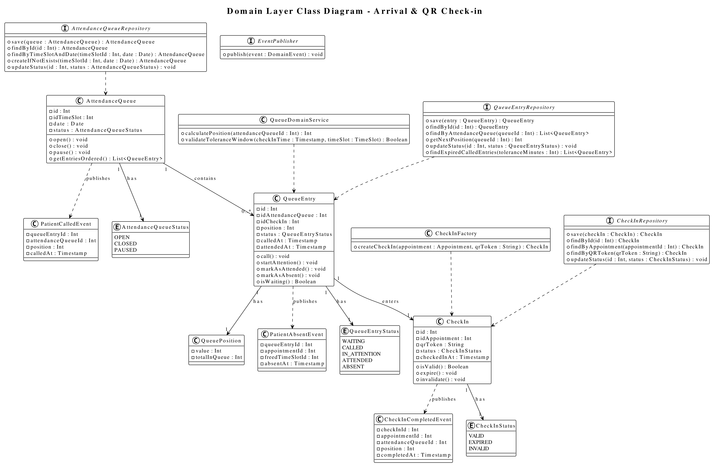

*Nota. Elaboración del equipo RuwaLabs para el proyecto SaludYa.*

---
El diagrama de clases del dominio del bounded context Arrival & QR Check-in representa los aggregates root CheckIn y AttendanceQueue, junto con la entity QueueEntry y el value object QueuePosition. Se muestran los enums CheckInStatus, AttendanceQueueStatus y QueueEntryStatus que definen los estados posibles de cada componente, la factory CheckInFactory que encapsula la creación de check-ins, el QueueDomainService que encapsula el cálculo de posición y la validación de la ventana de tolerancia, y las interfaces CheckInRepository, AttendanceQueueRepository, QueueEntryRepository y EventPublisher que definen los contratos de persistencia y publicación de eventos. Se muestran también los tres Domain Events que publica el aggregate: CheckInCompletedEvent, PatientCalledEvent y PatientAbsentEvent, como se observa en la [Figura 53](#figura-53).

##### 2.6.4.6.2. Bounded Context Database Design Diagram

**Figura 54**

*Diagrama de base de datos — Arrival*

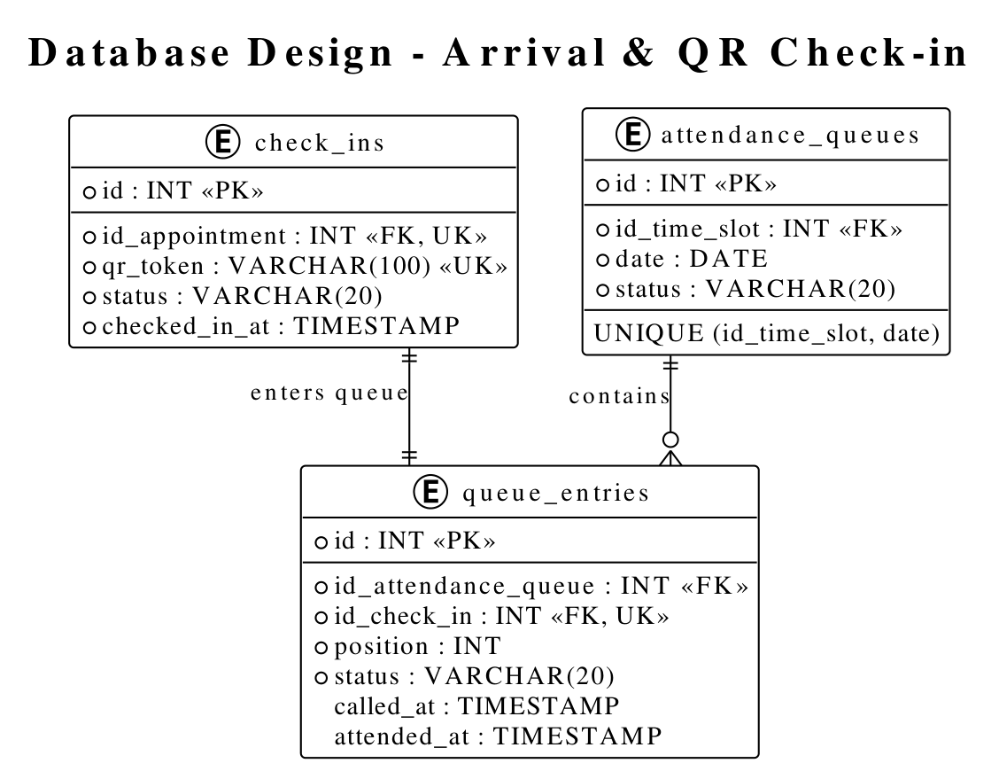

*Nota. Elaboración del equipo RuwaLabs para el proyecto SaludYa.*

---
El diagrama de base de datos del bounded context Arrival & QR Check-in muestra las tablas check_ins, attendance_queues y queue_entries, junto con sus columnas, claves primarias, claves foráneas y restricciones de unicidad. La tabla check_ins almacena la validación de presencia del paciente con una foreign key hacia appointments. La tabla attendance_queues representa la fila de asistencia por time_slot y fecha, con una foreign key hacia time_slots. La tabla queue_entries almacena las entradas individuales de cada paciente en la cola, con foreign keys hacia attendance_queues y check_ins, y un campo position que determina el orden de atención por timestamp de check-in, como se observa en la [Figura 54](#figura-54).

---

### 2.6.5. Bounded Context: Hospital Operations & Configuration

El **bounded context de Hospital Operations & Configuration** gestiona la configuración operativa del establecimiento de salud y provee dashboards y reportes para monitorear la operación diaria, el ausentismo y la demanda de servicios. Parametriza el comportamiento de los demás bounded contexts mediante reglas configurables como la capacidad máxima por bloque horario, las tolerancias de check-in y post-llamado, el tiempo de respuesta para la reasignación y los plazos de reserva y cancelación.

#### 2.6.5.1. Domain Layer

La capa de **Domain** representa el núcleo del negocio de configuración y operación del hospital. Aquí se definen las entidades, value objects, enums e interfaces que encapsulan las reglas operativas.

##### HospitalConfiguration (Aggregate Root)

**Atributos:**
`id`, `maxCapacityPerSlot`, `bookingOrderScope: BookingOrderScope`, `checkInToleranceMinutes`, `postCallToleranceMinutes`, `reassignmentResponseTimeoutMin`, `bookingCutoffTime`, `cancellationDeadlineHours`, `attendanceQueueVisible`, `updatedAt`

**Métodos:**
- `updateMaxCapacity(value)` → valida que sea mayor a 0 y actualiza la capacidad máxima por bloque.
- `updateTolerances(checkIn, postCall)` → valida que sean mayores o iguales a 0 y actualiza las tolerancias.
- `updateReassignmentTimeout(value)` → valida que sea mayor o igual a 0 y actualiza el timeout de reasignación.
- `updateBookingCutoffTime(value)` → actualiza la hora límite para reservar citas.
- `updateCancellationDeadline(value)` → actualiza el plazo mínimo para cancelar citas.
- `validate()` → valida que todos los parámetros sean coherentes entre sí.

**Propósito:**
Representa la configuración operativa del establecimiento. Es aggregate root porque agrupa todos los parámetros operativos que parametrizan el comportamiento de los demás bounded contexts.

---

##### BookingOrderScope (Enum)

**Valores posibles:**
`GLOBAL`, `PER_SPECIALTY`

**Propósito:**
Define si el `bookingOrder` se calcula de forma global al establecimiento o por especialidad.

---

##### HospitalConfigurationRepository (Interface)

**Métodos:**
- `save(config: HospitalConfiguration): HospitalConfiguration`
- `findDefault(): HospitalConfiguration?`
- `update(config: HospitalConfiguration): HospitalConfiguration`

**Propósito:**
Define las operaciones de persistencia para la configuración del hospital.

---

##### EventPublisher (Interface)

**Métodos:**
- `publish(event: DomainEvent)`

**Propósito:**
Define la interfaz para publicar eventos de dominio. La implementación concreta usa Spring Events.

---

#### 2.6.5.2. Interface Layer

La **Interface Layer** expone las funcionalidades del bounded context mediante endpoints REST.

##### ConfigurationController (REST API Controller)

**Endpoints:**
- `GET /api/v1/config` → Obtiene la configuración actual del hospital.
- `PUT /api/v1/config` → Actualiza la configuración operativa.
- `GET /api/v1/config/reports` → Genera un reporte operativo en PDF/CSV.
- `GET /api/v1/config/dashboard` → Obtiene métricas operativas del hospital.

**Explicación:**
Este controlador gestiona las operaciones sobre el aggregate `HospitalConfiguration`, incluyendo la consulta y actualización de parámetros, la generación de reportes y la visualización de métricas en el dashboard.

---

#### 2.6.5.3. Application Layer

La **Application Layer** orquesta los casos de uso del dominio mediante **Command Services** y **Query Services**. Los **Command Handlers** viven dentro de los Command Services, y los **Event Handlers** en `application/internal/eventhandlers/`.

##### ConfigurationCommandService (Interface)

**Métodos (Command Handlers):**
- `updateConfiguration(command: UpdateConfigurationCommand): HospitalConfiguration`

**Propósito:**
Define los comandos relacionados con la configuración operativa.

---

##### ConfigurationQueryService (Interface)

**Métodos (Query Handlers):**
- `getConfiguration(): HospitalConfiguration?`
- `generateReport(query: GenerateReportQuery): Report`
- `getDashboard(query: GetDashboardQuery): Dashboard`

**Propósito:**
Define las consultas relacionadas con la configuración, reportes y dashboard.

---

##### ConfigurationCommandServiceImpl (Implementation)

**Responsabilidad:** Implementar los comandos de configuración.

**Flujo de `updateConfiguration`:**
1. Recibe los nuevos parámetros de configuración.
2. Valida que los parámetros sean coherentes usando el método `validate()` del aggregate.
3. Actualiza la configuración en el repositorio.
4. Publica el evento `ConfigurationUpdatedEvent`.
5. Retorna la configuración actualizada.

---

##### ConfigurationUpdatedEventHandler (Event Handler)

**Responsabilidad:** Reaccionar al evento `ConfigurationUpdatedEvent`.
**Flujo:**
1. Escucha el evento `ConfigurationUpdatedEvent`.
2. Actualiza la caché local de los bounded contexts que consumen la configuración.
3. Registra la acción en el log de auditoría.

---

#### 2.6.5.4. Infrastructure Layer

La capa de **Infrastructure** contiene las implementaciones concretas.

##### HospitalConfigurationRepositoryImpl
**Implementa:** `HospitalConfigurationRepository`
**Tecnología:** Spring Data JPA + PostgreSQL
**Explicación:**
Ejecuta operaciones sobre la tabla `hospital_configurations`. Como es un singleton, siempre retorna el único registro existente.

---

##### ReportGeneratorAdapter
**Función:**
Genera reportes operativos en formato PDF y CSV a partir de los datos de atención, ausentismo y demanda.
**Tecnología:** iText / Apache POI

---

##### SpringEventPublisherImpl
**Implementa:** `EventPublisher`
**Función:**
Publica eventos de dominio usando Spring Events.
**Tecnología:** `ApplicationEventPublisher` de Spring

---

#### 2.6.5.5. Bounded Context Software Architecture Component Level Diagrams

**Figura 55**

*Diagrama de componentes — Hospital Operations & Configuration*

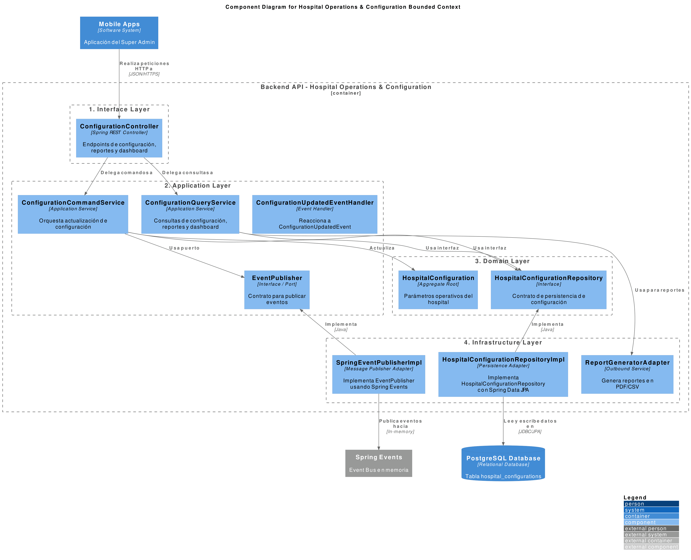

*Nota. Elaboración del equipo RuwaLabs para el proyecto SaludYa.*

El diagrama de componentes del bounded context Hospital Operations & Configuration muestra la organización interna del Backend API en sus cuatro capas. En la Interface Layer, el ConfigurationController expone los endpoints REST para consultar y actualizar la configuración, generar reportes y visualizar el dashboard. En la Application Layer, los Command Services y Query Services orquestan los casos de uso, junto con el ConfigurationUpdatedEventHandler que reacciona a los cambios de configuración. En la Domain Layer, el aggregate HospitalConfiguration encapsula las reglas operativas del establecimiento, junto con la interfaz HospitalConfigurationRepository. En la Infrastructure Layer, los adapters implementan la persistencia con Spring Data JPA (HospitalConfigurationRepositoryImpl), la generación de reportes (ReportGeneratorAdapter) y la publicación de eventos con Spring Events (SpringEventPublisherImpl). La comunicación con la base de datos PostgreSQL se realiza mediante JDBC/JPA, como se observa en la [Figura 55](#figura-55).

#### 2.6.5.6. Bounded Context Software Architecture Code Level Diagrams

##### 2.6.5.6.1. Bounded Context Domain Layer Class Diagrams

**Figura 56**

*Diagrama de clases — Hospital Operations & Configuration*

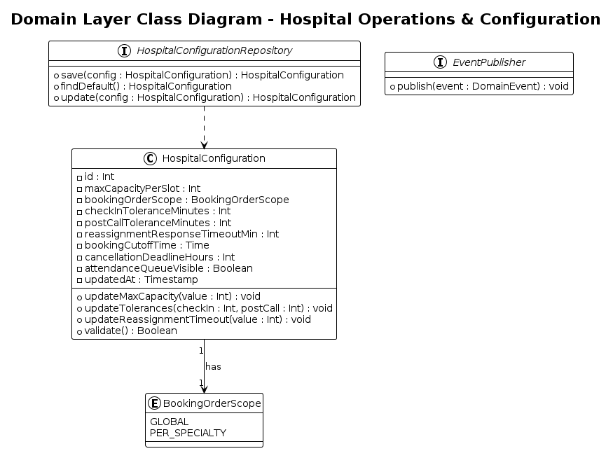

*Nota. Elaboración del equipo RuwaLabs para el proyecto SaludYa.*

El diagrama de clases del dominio del bounded context Hospital Operations & Configuration representa el aggregate root HospitalConfiguration que encapsula los parámetros operativos del establecimiento, junto con el enum BookingOrderScope que define el alcance del bookingOrder, la interfaz HospitalConfigurationRepository que define el contrato de persistencia y la interfaz EventPublisher que define el contrato para publicar eventos de dominio, como se observa en la [Figura 56](#figura-56).

##### 2.6.5.6.2. Bounded Context Database Design Diagram

**Figura 57**

*Diagrama de base de datos — Hospital Operations & Configuration*

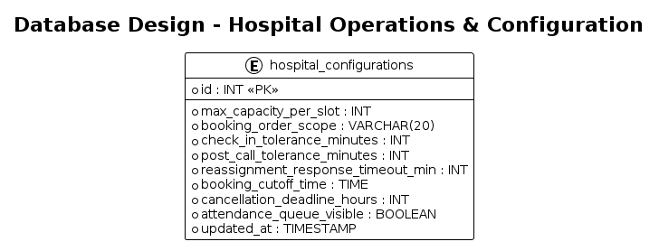

*Nota. Elaboración del equipo RuwaLabs para el proyecto SaludYa.*

El diagrama de base de datos del bounded context Hospital Operations & Configuration muestra la tabla hospital_configurations, que almacena los parámetros operativos del establecimiento. La tabla es un singleton, es decir, contiene un único registro que define la configuración global del hospital. Los campos incluyen la capacidad máxima por bloque horario, el alcance del bookingOrder, las tolerancias de check-in y post-llamado, el timeout de reasignación, la hora de corte para reservas, el plazo de cancelación y la visibilidad de la cola de asistencia, como se observa en la [Figura 57](#figura-57).

## 3.1.1. Style Guidelines

### 3.1.1.1. General Style Guidelines

Las presentes guías de estilo establecen los lineamientos visuales y de comunicación que rigen la identidad de **SaludYa**, producto digital desarrollado por la startup **RuwaLabs**. Su propósito es garantizar consistencia en todos los productos de la solución (Landing Page, aplicaciones móviles para pacientes y personal de salud, y servicios web), facilitando el trabajo colaborativo del equipo y asegurando una experiencia coherente para los usuarios.

Las decisiones aquí documentadas se sustentan en los principios de diseño inclusivo, accesibilidad (a11y) e internacionalización (i18n) establecidos en el proyecto, y toman como referencia buenas prácticas de Design Systems reconocidos, adaptadas al contexto de los establecimientos públicos de salud del Perú.

#### Branding

La identidad de marca de SaludYa se construye sobre los siguientes elementos:

**Tabla 37**

*Branding*

| Elemento | Descripción |
|:---|:---|
| Nombre | SaludYa |
| Startup | RuwaLabs |
| Logotipo | Isotipo con icono de salud (cruz/maleta) en color primario, acompañado del nombre "SaludYa" en tipografía sans-serif |
| Isotipo | Símbolo gráfico que representa el acceso ágil a la salud, usado en favicon, app icon y elementos de navegación |
| Tagline | "Citas médicas sin colas para el Perú" |
| Tono de comunicación | Formal pero cercano, empático, claro y directo |
| Público objetivo | Pacientes de zonas urbanas periféricas y personal asistencial/administrativo de establecimientos públicos de salud |
| Valores de marca | Accesibilidad, transparencia, colaboración e impacto social |

*Nota. Elaboración del equipo RuwaLabs para el proyecto SaludYa.*

El logotipo se utiliza en el header y footer del Landing Page, así como en las pantallas de inicio de sesión de ambas aplicaciones móviles. Su versión reducida (`--logo-height-sm`) se emplea en contextos donde el espacio es limitado, como la versión móvil del Landing Page, como se detalla en la [Tabla 37](#tabla-37).

#### Typography

La tipografía seleccionada prioriza la legibilidad en pantallas de distintos tamaños y en contextos de baja iluminación, frecuentes en establecimientos de salud.

##### Landing Page (web)

**Tabla 38**

*Typography — Landing Page (web)*

| Elemento | Fuente | Tamaño | Peso | Uso |
|:---|:---|:---|:---|:---|
| Fuente base | Segoe UI / Helvetica Neue / Arial | 1rem | 400 | Texto general, párrafos |
| Fuente de títulos | Segoe UI / Helvetica Neue / Arial | Variable | 700 | Encabezados h1–h4 |
| h1 | — | 2.5rem | 700 | Título principal del Hero |
| h2 | — | 2rem | 700 | Títulos de sección |
| h3 | — | 1.35rem | 700 | Títulos de tarjetas y subsecciones |
| h4 | — | 1.1rem | 600 | Subtítulos internos |
| Interlineado | — | 1.6 | — | Cuerpo de texto |
| Interlineado títulos | — | 1.25 | — | Encabezados |

*Nota. Elaboración del equipo RuwaLabs para el proyecto SaludYa.*

La elección de fuentes del sistema (Segoe UI, Helvetica Neue, Arial) responde a criterios de rendimiento, disponibilidad multiplataforma y familiaridad para el usuario, evitando dependencias externas que afecten la carga del Landing Page, como se detalla en la [Tabla 38](#tabla-38).

##### Aplicaciones móviles (Android)

**Tabla 39**

*Typography — Aplicaciones móviles (Android)*

| Elemento | Fuente | Tamaño | Peso | Uso |
|:---|:---|:---|:---|:---|
| Fuente base | Inter | Variable | 400 | Texto general |
| Fuente de títulos | Inter | Variable | 600 | Encabezados y énfasis |
| Body Bold Large | Inter | 18sp / 150% (27sp) | 600 | Cuerpo destacado, títulos de tarjeta |
| Body Extra Small | Inter | 12sp / 150% (18sp) | 400 | Texto secundario, captions |

*Nota. Elaboración del equipo RuwaLabs para el proyecto SaludYa.*

En las aplicaciones móviles se utiliza la familia **Inter** con `letter-spacing` negativo en textos destacados (`-0.18px` en Body Bold Large) y `font-feature-settings: 'calt' off` para desactivar ligaduras contextuales. Los tamaños se expresan en **sp** (scale-independent pixels), conforme a las guías de Material Design para Android, como se detalla en la [Tabla 39](#tabla-39).

#### Colors

La paleta de colores de SaludYa se inspira en el sector salud, utilizando tonos verdes que transmiten confianza, bienestar y cercanía, complementados con un acento amarillo para elementos de foco y llamadas de atención.

##### Landing Page (web)

La paleta establece los colores de marca y los tonos utilizados en fondos, textos y estados de los componentes; estos criterios se aplican a landing page (web), como se detalla en la [Tabla 40](#tabla-40).

**Tabla 40**

*Colors — Landing Page (web)*

| Color | Código HEX | Uso principal |
|:---|:---|:---|
| Primario | `#0b8f6b` | Botones, enlaces, iconos, acentos |
| Primario oscuro | `#076e52` | Hover de botones, títulos de tarjetas |
| Primario claro | `#e6f5f0` | Fondos de sección, hover de navegación |
| Acento | `#ffb703` | Foco visible, detalles de marca |
| Texto | `#1c2b2a` | Texto principal |
| Texto atenuado | `#56706d` | Párrafos secundarios, roles |
| Fondo | `#ffffff` | Fondo base |
| Fondo alterno | `#f4faf8` | Secciones alternas |
| Borde | `#d8e6e2` | Bordes de tarjetas y separadores |
| Peligro | `#c0392b` | Mensajes de error (formularios) |
| Blanco | `#ffffff` | Texto sobre fondos oscuros |
| Footer | `#0d2722` | Fondo del pie de página |

*Nota. Elaboración del equipo RuwaLabs para el proyecto SaludYa.*

##### Aplicaciones móviles (Android)

**Tabla 41**

*Colors — Aplicaciones móviles (Android)*

| Token | Código HEX | Uso principal |
|:---|:---|:---|
| WF White | `#FFFFFF` | Fondo base, superficies |
| WF 100 | `#F7F9FC` | Fondo alterno muy claro |
| WF 200 | `#EDF0F7` | Fondos de tarjetas y contenedores |
| WF 300 | `#E2E7F0` | Separadores suaves |
| WF 400 | `#CBD2E0` | Bordes suaves, elementos inactivos |
| WF 600 | `#717D96` | Texto secundario |
| WF 700 | `#4A5468` | Texto de énfasis medio |
| WF 800 | `#2D3648` | Texto principal, bordes |
| WF 900 | `#1A202C` | Texto de máximo contraste |
| Negro | `#000000` | Texto en superficies claras |
| Gris claro | `#D9D9D9` | Placeholders, elementos deshabilitados |

*Nota. Elaboración del equipo RuwaLabs para el proyecto SaludYa.*

Los colores fueron seleccionados para cumplir con el nivel de contraste **WCAG AA**, garantizando legibilidad para personas con baja visión o daltonismo, como se detalla en la [Tabla 41](#tabla-41).

#### Spacing

##### Landing Page (web)

Se define una escala de espaciado consistente basada en múltiplos de 0.25rem, aplicada a márgenes, padding y separación entre elementos en el Landing Page, como se detalla en la [Tabla 42](#tabla-42).

**Tabla 42**

*Spacing — Landing Page (web)*

| Variable | Valor | Uso |
|:---|:---|:---|
| `--space-1` | 0.25rem | Separaciones mínimas |
| `--space-2` | 0.5rem | Padding interno de botones pequeños |
| `--space-3` | 0.75rem | Separación entre elementos inline |
| `--space-4` | 1rem | Padding estándar |
| `--space-5` | 1.5rem | Separación entre bloques |
| `--space-6` | 2rem | Separación entre secciones |

*Nota. Elaboración del equipo RuwaLabs para el proyecto SaludYa.*

##### Aplicaciones móviles (Android)

**Tabla 43**

*Spacing — Aplicaciones móviles (Android)*

| Token | Valor | Uso |
|:---|:---|:---|
| `--space-1` | 2dp | Separaciones mínimas, bordes internos |
| `--space-2` | 8dp | Gap entre íconos y texto, separación inline |
| `--space-3` | 11dp | Padding vertical de contenedores pequeños |
| `--space-4` | 12dp | Padding interno de botones y cards |
| `--space-5` | 28dp | Padding horizontal de secciones |
| `--space-6` | 45dp | Separación entre bloques principales |

*Nota. Elaboración del equipo RuwaLabs para el proyecto SaludYa.*

Los valores en **dp** (density-independent pixels) provienen directamente de los tokens definidos en Figma y se aplican a padding, márgenes y gaps en las aplicaciones móviles, como se detalla en la [Tabla 43](#tabla-43).

#### Border Radius

##### Landing Page (web)

Los radios de esquina mantienen una forma consistente en botones, tarjetas y otros contenedores de la interfaz; estos criterios se aplican a landing page (web), como se detalla en la [Tabla 44](#tabla-44).

**Tabla 44**

*Border Radius — Landing Page (web)*

| Variable | Valor | Uso |
|:---|:---|:---|
| `--radius-sm` | 6px | Botones pequeños, badges |
| `--radius-md` | 12px | Botones, tarjetas |
| `--radius-lg` | 20px | Contenedores destacados, hero |

*Nota. Elaboración del equipo RuwaLabs para el proyecto SaludYa.*

##### Aplicaciones móviles (Android)

**Tabla 45**

*Border Radius — Aplicaciones móviles (Android)*

| Token | Valor | Uso |
|:---|:---|:---|
| `--radius-sm` | 12dp | Cards superiores (radio superior únicamente) |
| `--radius-md` | 12dp | Botones y contenedores estándar |

*Nota. Elaboración del equipo RuwaLabs para el proyecto SaludYa.*

En las aplicaciones móviles los contenedores principales utilizan un radio superior de **12dp** (`border-radius: 12dp 12dp 0 0`), reservado para cards ancladas a la parte inferior de la pantalla, como se detalla en la [Tabla 45](#tabla-45).

#### Shadows

##### Landing Page (web)

Las sombras distinguen las superficies y refuerzan la jerarquía visual de tarjetas y elementos elevados; estos criterios se aplican a landing page (web), como se detalla en la [Tabla 46](#tabla-46).

**Tabla 46**

*Shadows — Landing Page (web)*

| Variable | Valor | Uso |
|:---|:---|:---|
| `--shadow-sm` | `0 1px 3px rgba(0, 0, 0, 0.08)` | Tarjetas en reposo |
| `--shadow-md` | `0 6px 18px rgba(11, 143, 107, 0.12)` | Tarjetas en hover, menú móvil |
| `--shadow-lg` | `0 12px 32px rgba(11, 143, 107, 0.18)` | Hero, elementos destacados |

*Nota. Elaboración del equipo RuwaLabs para el proyecto SaludYa.*

##### Aplicaciones móviles (Android)

Las aplicaciones móviles **no emplean sombras** en su diseño actual. La jerarquía visual se resuelve mediante contraste de color, bordes y espaciado, siguiendo un enfoque flat consistente con los wireframes de alta fidelidad definidos en Figma.

#### Tone of Voice

El tono de comunicación de SaludYa se define a partir de cuatro dimensiones:

**Tabla 47**

*Tone of Voice*

| Dimensión | Elección | Justificación |
|:---|:---|:---|
| Divertido / Serio | Serio con toques cercanos | El contexto de salud requiere credibilidad, pero se busca cercanía con el paciente |
| Formal / Casual | Formal | Se comunica con usuarios de diversos niveles educativos y con personal institucional |
| Respetuoso / Irreverente | Respetuoso | Se aborda un tema sensible como la salud pública |
| Entusiasta / Sereno | Sereno | Se transmite confianza y estabilidad, evitando promesas exageradas |

*Nota. Elaboración del equipo RuwaLabs para el proyecto SaludYa.*

El lenguaje empleado en el Landing Page y las aplicaciones evita tecnicismos innecesarios, prioriza frases cortas y utiliza un vocabulario accesible para ambos segmentos objetivo, como se detalla en la [Tabla 47](#tabla-47).

#### Iconography

Se utiliza la librería **Font Awesome 6.5.2** para la iconografía del Landing Page, seleccionando iconos universales y reconocibles, como se detalla en la [Tabla 48](#tabla-48):

**Tabla 48**

*Iconography*

| Icono | Uso |
|:---|:---|
| `fa-circle-check` | Bullets de beneficios en el Hero |
| `fa-bullseye` | Misión en la sección Sobre nosotros |
| `fa-eye` | Visión en la sección Sobre nosotros |
| `fa-universal-access` | Valor de accesibilidad |
| `fa-shield-halved` | Valor de transparencia |
| `fa-handshake` | Valor de colaboración |
| `fa-heart-pulse` | Valor de impacto social |

*Nota. Elaboración del equipo RuwaLabs para el proyecto SaludYa.*

#### Design System de referencia

Las decisiones visuales de SaludYa toman como referencia principios de **Material Design** (jerarquía, elevación, uso del color) y buenas prácticas de Design Systems accesibles, adaptadas al contexto peruano y a las restricciones técnicas del proyecto (rendimiento en redes móviles, compatibilidad con dispositivos de gama media y baja).

## 3.1.2. Information Architecture

La arquitectura de información de **SaludYa** define la manera en que se organiza, etiqueta, navega y busca el contenido en los productos digitales que forman parte de la solución: el Landing Page, la aplicación móvil para pacientes y la aplicación móvil para el personal de salud. Su objetivo es que los visitantes y usuarios encuentren sin esfuerzo la información o funcionalidad que necesitan, reduciendo la carga cognitiva y facilitando la adopción del producto.

Las decisiones aquí documentadas se sustentan en los principios de diseño inclusivo, accesibilidad (a11y) e internacionalización (i18n), y consideran las características de ambos segmentos objetivo: pacientes de zonas urbanas periféricas y personal asistencial y administrativo de establecimientos públicos de salud.

### 3.1.2.1. Organization Systems

La organización del contenido en SaludYa combina distintos sistemas según el tipo de información y el objetivo del usuario en cada producto.

#### Landing Page

La organización de las secciones agrupa la información según las tareas del usuario y define la jerarquía de acceso a cada función; estos criterios se aplican a landing page, como se detalla en la [Tabla 49](#tabla-49).

**Tabla 49**

*Organization Systems — Landing Page*

| Sección | Sistema de organización | Justificación |
|:---|:---|:---|
| Header | Jerárquico + matricial | Menú horizontal con enlaces principales y selector de idioma; organización matricial por categorías de contenido |
| Hero | Jerárquico | Prioriza mensaje principal, subtítulo, CTAs y beneficios en orden de importancia |
| Problema | Jerárquico | Tres tarjetas con igual jerarquía, organizadas por tema |
| Solución | Jerárquico | Dos bloques comparativos (paciente vs. personal) con listas de funcionalidades |
| Videos | Cronológico | Dos bloques secuenciales: About the Product y About the Team |
| Modelo de negocio | Jerárquico | Tres tarjetas con igual jerarquía |
| Testimonios | Alfabético | Seis tarjetas organizadas por nombre del entrevistado |
| Sobre nosotros | Jerárquico | Misión, visión, valores y equipo en orden de relevancia |
| Descarga | Jerárquico | Botones de tiendas como acción principal |
| Footer | Jerárquico | Cuatro columnas organizadas por categoría (marca, enlaces, proyecto, contacto) |

*Nota. Elaboración del equipo RuwaLabs para el proyecto SaludYa.*

#### Aplicación móvil para pacientes

La organización de las secciones agrupa la información según las tareas del usuario y define la jerarquía de acceso a cada función; estos criterios se aplican a aplicación móvil para pacientes, como se detalla en la [Tabla 50](#tabla-50).

**Tabla 50**

*Organization Systems — Aplicación móvil para pacientes*

| Sección | Sistema de organización | Justificación |
|:---|:---|:---|
| Inicio | Jerárquico | Accesos rápidos a reserva, lista de espera y citas próximas |
| Reserva de citas | Secuencial (step-by-step) | Flujo paso a paso: especialidad → establecimiento → fecha → confirmación |
| Lista de espera | Cronológico | Orden por fecha de inscripción y disponibilidad |
| Mis citas | Cronológico | Orden por fecha de atención |
| Familiares a cargo | Alfabético | Orden por nombre del familiar |
| Perfil | Jerárquico | Datos personales, notificaciones y configuración |

*Nota. Elaboración del equipo RuwaLabs para el proyecto SaludYa.*

#### Aplicación móvil para personal de salud

La organización de las secciones agrupa la información según las tareas del usuario y define la jerarquía de acceso a cada función; estos criterios se aplican a aplicación móvil para personal de salud, como se detalla en la [Tabla 51](#tabla-51).

**Tabla 51**

*Organization Systems — Aplicación móvil para personal de salud*

| Sección | Sistema de organización | Justificación |
|:---|:---|:---|
| Panel principal | Jerárquico | Resumen del flujo de atención del día |
| Gestión de citas | Cronológico | Orden por hora de atención |
| Lista de espera | Cronológico | Orden por fecha de inscripción |
| Cancelaciones e inasistencias | Cronológico | Orden por fecha del evento |
| Pacientes | Alfabético | Orden por apellido |
| Reportes | Jerárquico | Acceso a métricas y exportación |

*Nota. Elaboración del equipo RuwaLabs para el proyecto SaludYa.*

#### Esquemas de categorización aplicados

- **Alfabético:** testimonios, pacientes, familiares a cargo.
- **Cronológico:** citas, lista de espera, cancelaciones, reportes por fecha.
- **Por tópicos:** secciones del Landing Page (problema, solución, modelo de negocio).
- **Según audiencia:** separación entre app pacientes y app personal de salud.
- **Jerárquico:** estructura general de navegación en todos los productos.

### 3.1.2.2. Labelling Systems

Las etiquetas de SaludYa buscan ser simples, claras y libres de ambigüedad, empleando el mínimo número de palabras posible y un vocabulario accesible para ambos segmentos objetivo.

#### Landing Page

Las etiquetas permiten reconocer las secciones y acciones mediante nombres que expresan su función dentro de la aplicación; estos criterios se aplican a landing page, como se detalla en la [Tabla 52](#tabla-52).

**Tabla 52**

*Labelling Systems — Landing Page*

| Etiqueta | Representa |
|:---|:---|
| Producto | Sección con el problema y la solución |
| Videos | Bloque con los videos About the Product y About the Team |
| Testimonios | Citas de entrevistados |
| Sobre nosotros | Información de la startup y el equipo |
| Descargar app | CTA principal hacia las tiendas |
| ES / EN | Selector de idioma |

*Nota. Elaboración del equipo RuwaLabs para el proyecto SaludYa.*

#### Aplicación móvil para pacientes

Las etiquetas permiten reconocer las secciones y acciones mediante nombres que expresan su función dentro de la aplicación; estos criterios se aplican a aplicación móvil para pacientes, como se detalla en la [Tabla 53](#tabla-53).

**Tabla 53**

*Labelling Systems — Aplicación móvil para pacientes*

| Etiqueta | Representa |
|:---|:---|
| Inicio | Pantalla principal |
| Reservar cita | Inicio del flujo de reserva |
| Lista de espera | Inscripción y seguimiento de cupos |
| Mis citas | Citas reservadas por el paciente |
| Familiares | Gestión de dependientes |
| Perfil | Datos personales y configuración |

*Nota. Elaboración del equipo RuwaLabs para el proyecto SaludYa.*

#### Aplicación móvil para personal de salud

Las etiquetas permiten reconocer las secciones y acciones mediante nombres que expresan su función dentro de la aplicación; estos criterios se aplican a aplicación móvil para personal de salud, como se detalla en la [Tabla 54](#tabla-54).

**Tabla 54**

*Labelling Systems — Aplicación móvil para personal de salud*

| Etiqueta | Representa |
|:---|:---|
| Panel | Resumen del día |
| Citas | Gestión de citas del establecimiento |
| Lista de espera | Pacientes en espera de cupo |
| Cancelaciones | Registro de cancelaciones e inasistencias |
| Pacientes | Búsqueda y consulta de pacientes |
| Reportes | Métricas y exportación |

*Nota. Elaboración del equipo RuwaLabs para el proyecto SaludYa.*

#### Asociaciones entre etiquetas

- **Reservar cita** se asocia con **Lista de espera** cuando no hay cupos disponibles.
- **Mis citas** se asocia con **Cancelaciones** en la app del personal.
- **Familiares** se asocia con **Reservar cita** para agendar a nombre de un dependiente.
- **Perfil** se asocia con **Notificaciones** y **Configuración**.

### 3.1.2.3. SEO Tags and Meta Tags

Los SEO Tags y Meta Tags del Landing Page se definen en el `<head>` del documento y buscan posicionar el sitio en buscadores para consultas relacionadas con citas médicas en establecimientos públicos de salud del Perú.

#### Landing Page

Los títulos, las descripciones y los metadatos identifican SaludYa y describen su propuesta de valor en buscadores y tiendas de aplicaciones; estos criterios se aplican a landing page, como se detalla en la [Tabla 55](#tabla-55).

**Tabla 55**

*SEO Tags and Meta Tags — Landing Page*

| Tag | Valor |
|:---|:---|
| Title | SaludYa — Citas médicas sin colas |
| Meta Description | SaludYa — Plataforma digital que conecta pacientes y personal de establecimientos públicos de salud en Perú. Reserva de citas, lista de espera dinámica y check-in por QR. |
| Meta Keywords | SaludYa, citas médicas, MINSA, SIS, salud pública Perú, reserva de citas, lista de espera, RuwaLabs |
| Meta Author | RuwaLabs |
| Meta Robots | index, follow |
| Open Graph Title | SaludYa — Citas médicas sin colas |
| Open Graph Description | Reserva tu cita, recibe avisos de cupos liberados y llega justo a tu atención. Para pacientes y personal de establecimientos públicos de salud. |
| Open Graph Image | `assets/img/icon-saludya.png` |
| Open Graph Type | website |
| Open Graph URL | https://saludya.pe/ |
| Twitter Card | summary_large_image |
| Twitter Title | SaludYa — Citas médicas sin colas |
| Twitter Description | Reserva de citas, lista de espera dinámica y check-in por QR para establecimientos públicos de salud. |
| Twitter Image | `assets/img/icon-saludya.png` |

*Nota. Elaboración del equipo RuwaLabs para el proyecto SaludYa.*

#### ASO (App Store Optimization)

Los títulos, las descripciones y los metadatos identifican SaludYa y describen su propuesta de valor en buscadores y tiendas de aplicaciones; estos criterios se aplican a aso (app store optimization), como se detalla en la [Tabla 56](#tabla-56).

**Tabla 56**

*SEO Tags and Meta Tags — ASO (App Store Optimization)*

| Elemento | App pacientes | App personal de salud |
|:---|:---|:---|
| App Title | SaludYa — Citas médicas | SaludYa Staff — Gestión de citas |
| App Subtitle | Reserva sin colas | Gestión del flujo de atención |
| App Keywords | citas médicas, MINSA, SIS, salud pública, reserva, lista de espera | gestión de citas, personal de salud, MINSA, SIS, flujo de atención |
| App Description | Reserva tu cita en establecimientos públicos de salud, recibe avisos de cupos liberados y gestiona a tus familiares a cargo. | Administra las citas, la lista de espera y el flujo de atención de tu establecimiento de salud en tiempo real. |

*Nota. Elaboración del equipo RuwaLabs para el proyecto SaludYa.*

### 3.1.2.4. Searching Systems

Los sistemas de búsqueda de SaludYa están diseñados para evitar que el usuario se pierda entre el volumen de información, ofreciendo filtros claros y resultados consistentes.

#### Landing Page

Las opciones de búsqueda relacionan las consultas del usuario con los filtros disponibles y los resultados que ofrece cada sección; estos criterios se aplican a landing page, como se detalla en la [Tabla 57](#tabla-57).

**Tabla 57**

*Searching Systems — Landing Page*

| Acción | Descripción |
|:---|:---|
| Navegación por anclas | Enlaces del header que llevan a secciones específicas (Producto, Videos, Testimonios, Sobre nosotros) |
| Selector de idioma | Búsqueda de contenido en ES o EN |
| Scroll suave | Desplazamiento con compensación de altura del header |

*Nota. Elaboración del equipo RuwaLabs para el proyecto SaludYa.*

#### Aplicación móvil para pacientes

Las opciones de búsqueda relacionan las consultas del usuario con los filtros disponibles y los resultados que ofrece cada sección; estos criterios se aplican a aplicación móvil para pacientes, como se detalla en la [Tabla 58](#tabla-58).

**Tabla 58**

*Searching Systems — Aplicación móvil para pacientes*

| Búsqueda | Filtros disponibles | Resultado |
|:---|:---|:---|
| Buscar establecimiento | Distrito, especialidad | Lista de establecimientos con disponibilidad |
| Buscar especialidad | Establecimiento, disponibilidad | Lista de especialidades y cupos |
| Buscar cita | Fecha, especialidad, establecimiento | Lista de citas reservadas |
| Buscar familiar | Nombre | Ficha del familiar a cargo |

*Nota. Elaboración del equipo RuwaLabs para el proyecto SaludYa.*

#### Aplicación móvil para personal de salud

Las opciones de búsqueda relacionan las consultas del usuario con los filtros disponibles y los resultados que ofrece cada sección; estos criterios se aplican a aplicación móvil para personal de salud, como se detalla en la [Tabla 59](#tabla-59).

**Tabla 59**

*Searching Systems — Aplicación móvil para personal de salud*

| Búsqueda | Filtros disponibles | Resultado |
|:---|:---|:---|
| Buscar paciente | Apellido, DNI, historia clínica | Ficha del paciente |
| Buscar cita | Fecha, especialidad, estado | Lista de citas |
| Buscar cancelación | Fecha, especialidad | Registro de cancelaciones |
| Buscar cupo liberado | Fecha, especialidad | Lista de cupos disponibles |

*Nota. Elaboración del equipo RuwaLabs para el proyecto SaludYa.*

#### Visualización de resultados

Los resultados se muestran en listas ordenadas cronológica o alfabéticamente, con indicadores visuales de estado (disponible, reservado, cancelado, atendido) y opciones de acción directa (reservar, cancelar, confirmar).

### 3.1.2.5. Navigation Systems

Los sistemas de navegación de SaludYa guían al usuario a través del Landing Page y las aplicaciones móviles, permitiéndole cumplir sus metas e interactuar de forma satisfactoria con el producto.

#### Landing Page

La navegación conecta las secciones mediante accesos, menús y recorridos que permiten completar las tareas del usuario; estos criterios se aplican a landing page, como se detalla en la [Tabla 60](#tabla-60).

**Tabla 60**

*Navigation Systems — Landing Page*

| Acción | Descripción |
|:---|:---|
| Navegación sticky | El header permanece visible al hacer scroll |
| Menú de anclas | Enlaces directos a secciones |
| Botón hamburguesa | En vista móvil, despliega el menú verticalmente |
| Scroll suave | Desplazamiento con compensación del header |
| Enlace activo | Resaltado del enlace correspondiente a la sección visible |
| Selector de idioma | Cambio dinámico ES/EN sin recargar la página |

*Nota. Elaboración del equipo RuwaLabs para el proyecto SaludYa.*

#### Aplicación móvil para pacientes

La navegación conecta las secciones mediante accesos, menús y recorridos que permiten completar las tareas del usuario; estos criterios se aplican a aplicación móvil para pacientes, como se detalla en la [Tabla 61](#tabla-61).

**Tabla 61**

*Navigation Systems — Aplicación móvil para pacientes*

| Acción | Descripción |
|:---|:---|
| Barra de navegación inferior | Accesos a Inicio, Reservar, Mis citas, Familiares y Perfil |
| Flujo secuencial | Reserva paso a paso con retroceso y confirmación |
| Notificaciones push | Avisos de cupos liberados y recordatorios |
| Check-in por QR | Acceso rápido a la atención el día de la cita |

*Nota. Elaboración del equipo RuwaLabs para el proyecto SaludYa.*

#### Aplicación móvil para personal de salud

La navegación conecta las secciones mediante accesos, menús y recorridos que permiten completar las tareas del usuario; estos criterios se aplican a aplicación móvil para personal de salud, como se detalla en la [Tabla 62](#tabla-62).

**Tabla 62**

*Navigation Systems — Aplicación móvil para personal de salud*

| Acción | Descripción |
|:---|:---|
| Barra de navegación inferior | Accesos a Panel, Citas, Lista de espera, Pacientes y Reportes |
| Filtros por fecha y especialidad | Segmentación del flujo de atención |
| Actualización en tiempo real | Visualización del estado de cada paciente |
| Reasignación de cupos | Acción directa sobre cupos liberados |

*Nota. Elaboración del equipo RuwaLabs para el proyecto SaludYa.*

#### Recorrido del usuario

1. El visitante llega al Landing Page y comprende el problema y la solución.
2. Revisa los videos y testimonios de validación.
3. Conoce el equipo y el modelo de negocio.
4. Descarga la aplicación correspondiente a su perfil.
5. En la app, navega por las secciones principales mediante la barra inferior.
6. Completa sus tareas (reservar, gestionar, consultar) con flujos claros y retroalimentación visual.

### 3.1.2.1. Organization Systems

La organización del contenido en SaludYa combina distintos sistemas según el tipo de información y el objetivo del usuario en cada producto. Se aplican principios de organización visual (jerárquica, secuencial y matricial) y esquemas de categorización (alfabético, cronológico, por tópicos y según audiencia), buscando siempre reducir la carga cognitiva y facilitar el acceso a la información.

#### Landing Page

La organización de las secciones agrupa la información según las tareas del usuario y define la jerarquía de acceso a cada función; estos criterios se aplican a landing page, como se detalla en la [Tabla 63](#tabla-63).

**Tabla 63**

*Organization Systems — Landing Page*

| Sección | Sistema de organización visual | Esquema de categorización | Justificación |
|:---|:---|:---|:---|
| Header | Jerárquico + matricial | Por tópicos | Menú horizontal con enlaces principales y selector de idioma; organización matricial por categorías de contenido |
| Hero | Jerárquico | Por tópicos | Prioriza mensaje principal, subtítulo, CTAs y beneficios en orden de importancia |
| Problema | Jerárquico | Por tópicos | Tres tarjetas con igual jerarquía, organizadas por tema |
| Solución | Jerárquico | Según audiencia | Dos bloques comparativos (paciente vs. personal) con listas de funcionalidades |
| Videos | Secuencial | Cronológico | Dos bloques secuenciales: About the Product y About the Team |
| Modelo de negocio | Jerárquico | Por tópicos | Tres tarjetas con igual jerarquía |
| Testimonios | Matricial | Alfabético | Seis tarjetas organizadas por nombre del entrevistado |
| Sobre nosotros | Jerárquico | Por tópicos | Misión, visión, valores y equipo en orden de relevancia |
| Descarga | Jerárquico | Por tópicos | Botones de tiendas como acción principal |
| Footer | Jerárquico | Por tópicos | Cuatro columnas organizadas por categoría (marca, enlaces, proyecto, contacto) |

*Nota. Elaboración del equipo RuwaLabs para el proyecto SaludYa.*

#### Aplicación móvil para pacientes

La organización de las secciones agrupa la información según las tareas del usuario y define la jerarquía de acceso a cada función; estos criterios se aplican a aplicación móvil para pacientes, como se detalla en la [Tabla 64](#tabla-64).

**Tabla 64**

*Organization Systems — Aplicación móvil para pacientes*

| Sección | Sistema de organización visual | Esquema de categorización | Justificación |
|:---|:---|:---|:---|
| Inicio | Jerárquico | Por tópicos | Accesos rápidos a reserva, lista de espera y citas próximas |
| Reserva de citas | Secuencial (step-by-step) | Cronológico | Flujo paso a paso: especialidad → establecimiento → fecha → confirmación |
| Lista de espera | Secuencial | Cronológico | Orden por fecha de inscripción y disponibilidad |
| Mis citas | Jerárquico | Cronológico | Orden por fecha de atención |
| Familiares a cargo | Jerárquico | Alfabético | Orden por nombre del familiar |
| Perfil | Jerárquico | Por tópicos | Datos personales, notificaciones y configuración |

*Nota. Elaboración del equipo RuwaLabs para el proyecto SaludYa.*

#### Aplicación móvil para personal de salud

La organización de las secciones agrupa la información según las tareas del usuario y define la jerarquía de acceso a cada función; estos criterios se aplican a aplicación móvil para personal de salud, como se detalla en la [Tabla 65](#tabla-65).

**Tabla 65**

*Organization Systems — Aplicación móvil para personal de salud*

| Sección | Sistema de organización visual | Esquema de categorización | Justificación |
|:---|:---|:---|:---|
| Panel principal | Jerárquico | Por tópicos | Resumen del flujo de atención del día |
| Gestión de citas | Jerárquico | Cronológico | Orden por hora de atención |
| Lista de espera | Secuencial | Cronológico | Orden por fecha de inscripción |
| Cancelaciones e inasistencias | Jerárquico | Cronológico | Orden por fecha del evento |
| Pacientes | Jerárquico | Alfabético | Orden por apellido |
| Reportes | Jerárquico | Cronológico | Acceso a métricas y exportación por fecha |

*Nota. Elaboración del equipo RuwaLabs para el proyecto SaludYa.*

#### Esquemas de categorización aplicados

- **Alfabético:** testimonios en el Landing Page, pacientes y familiares a cargo en las aplicaciones.
- **Cronológico:** citas, lista de espera, cancelaciones, reportes y videos.
- **Por tópicos:** secciones del Landing Page (problema, solución, modelo de negocio, equipo) y pantallas principales de las aplicaciones.
- **Según audiencia:** separación entre la app para pacientes y la app para personal de salud, y bloques diferenciados en la sección Solución del Landing Page.
- **Jerárquico:** estructura general de navegación en todos los productos, priorizando la información más relevante para el usuario.
- **Secuencial:** flujos paso a paso en la reserva de citas y en la inscripción a la lista de espera.
- **Matricial:** grid de testimonios en el Landing Page, donde el usuario puede explorar varias tarjetas sin un orden estricto.

### 3.1.2.2. Labelling Systems

Las etiquetas de SaludYa buscan ser simples, claras y libres de ambigüedad, empleando el mínimo número de palabras posible y un vocabulario accesible para ambos segmentos objetivo. Se prioriza el uso de términos del dominio de la salud y de la gestión de citas, evitando tecnicismos innecesarios y anglicismos.

#### Landing Page

Las etiquetas permiten reconocer las secciones y acciones mediante nombres que expresan su función dentro de la aplicación; estos criterios se aplican a landing page, como se detalla en la [Tabla 66](#tabla-66).

**Tabla 66**

*Labelling Systems — Landing Page*

| Etiqueta | Representa |
|:---|:---|
| Producto | Sección con el problema y la solución |
| Videos | Bloque con los videos About the Product y About the Team |
| Testimonios | Citas de entrevistados |
| Sobre nosotros | Información de la startup y el equipo |
| Descargar app | CTA principal hacia las tiendas |
| ES / EN | Selector de idioma |
| Google Play | Botón de descarga para Android |
| App Store | Botón de descarga para iOS |

*Nota. Elaboración del equipo RuwaLabs para el proyecto SaludYa.*

#### Aplicación móvil para pacientes

Las etiquetas permiten reconocer las secciones y acciones mediante nombres que expresan su función dentro de la aplicación; estos criterios se aplican a aplicación móvil para pacientes, como se detalla en la [Tabla 67](#tabla-67).

**Tabla 67**

*Labelling Systems — Aplicación móvil para pacientes*

| Etiqueta | Representa |
|:---|:---|
| Inicio | Pantalla principal con accesos rápidos |
| Reservar cita | Inicio del flujo de reserva |
| Lista de espera | Inscripción y seguimiento de cupos |
| Mis citas | Citas reservadas por el paciente |
| Familiares | Gestión de dependientes |
| Perfil | Datos personales y configuración |
| Check-in QR | Acceso rápido el día de la cita |

*Nota. Elaboración del equipo RuwaLabs para el proyecto SaludYa.*

#### Aplicación móvil para personal de salud

Las etiquetas permiten reconocer las secciones y acciones mediante nombres que expresan su función dentro de la aplicación; estos criterios se aplican a aplicación móvil para personal de salud, como se detalla en la [Tabla 68](#tabla-68).

**Tabla 68**

*Labelling Systems — Aplicación móvil para personal de salud*

| Etiqueta | Representa |
|:---|:---|
| Panel | Resumen del día |
| Citas | Gestión de citas del establecimiento |
| Lista de espera | Pacientes en espera de cupo |
| Cancelaciones | Registro de cancelaciones e inasistencias |
| Pacientes | Búsqueda y consulta de pacientes |
| Reportes | Métricas y exportación |
| Reasignar cupo | Acción sobre cupos liberados |

*Nota. Elaboración del equipo RuwaLabs para el proyecto SaludYa.*

#### Asociaciones entre etiquetas

- **Reservar cita** se asocia con **Lista de espera** cuando no hay cupos disponibles.
- **Mis citas** se asocia con **Cancelaciones** en la app del personal.
- **Familiares** se asocia con **Reservar cita** para agendar a nombre de un dependiente.
- **Perfil** se asocia con **Notificaciones** y **Configuración**.
- **Check-in QR** se asocia con **Mis citas** el día de la atención.

### 3.1.2.3. SEO Tags and Meta Tags

Los SEO Tags y Meta Tags del Landing Page se definen en el `<head>` del documento y buscan posicionar el sitio en buscadores para consultas relacionadas con citas médicas en establecimientos públicos de salud del Perú. Asimismo, se definen los elementos de ASO (App Store Optimization) para las aplicaciones móviles publicadas en Google Play y App Store.

#### Landing Page

Los títulos, las descripciones y los metadatos identifican SaludYa y describen su propuesta de valor en buscadores y tiendas de aplicaciones; estos criterios se aplican a landing page, como se detalla en la [Tabla 69](#tabla-69).

**Tabla 69**

*SEO Tags and Meta Tags — Landing Page*

| Tag | Valor |
|:---|:---|
| Title | SaludYa — Citas médicas sin colas |
| Meta Description | SaludYa — Plataforma digital que conecta pacientes y personal de establecimientos públicos de salud en Perú. Reserva de citas, lista de espera dinámica y check-in por QR. |
| Meta Keywords | SaludYa, citas médicas, MINSA, SIS, salud pública Perú, reserva de citas, lista de espera, RuwaLabs |
| Meta Author | RuwaLabs |
| Meta Robots | index, follow |
| Open Graph Title | SaludYa — Citas médicas sin colas |
| Open Graph Description | Reserva tu cita, recibe avisos de cupos liberados y llega justo a tu atención. Para pacientes y personal de establecimientos públicos de salud. |
| Open Graph Image | `assets/img/icon-saludya.png` |
| Open Graph Type | website |
| Open Graph URL | https://saludya.pe/ |
| Twitter Card | summary_large_image |
| Twitter Title | SaludYa — Citas médicas sin colas |
| Twitter Description | Reserva de citas, lista de espera dinámica y check-in por QR para establecimientos públicos de salud. |
| Twitter Image | `assets/img/icon-saludya.png` |

*Nota. Elaboración del equipo RuwaLabs para el proyecto SaludYa.*

#### ASO (App Store Optimization)

Los títulos, las descripciones y los metadatos identifican SaludYa y describen su propuesta de valor en buscadores y tiendas de aplicaciones; estos criterios se aplican a aso (app store optimization), como se detalla en la [Tabla 70](#tabla-70).

**Tabla 70**

*SEO Tags and Meta Tags — ASO (App Store Optimization)*

| Elemento | App pacientes | App personal de salud |
|:---|:---|:---|
| App Title | SaludYa — Citas médicas | SaludYa Staff — Gestión de citas |
| App Subtitle | Reserva sin colas | Gestión del flujo de atención |
| App Keywords | citas médicas, MINSA, SIS, salud pública, reserva, lista de espera | gestión de citas, personal de salud, MINSA, SIS, flujo de atención |
| App Description | Reserva tu cita en establecimientos públicos de salud, recibe avisos de cupos liberados y gestiona a tus familiares a cargo. | Administra las citas, la lista de espera y el flujo de atención de tu establecimiento de salud en tiempo real. |

*Nota. Elaboración del equipo RuwaLabs para el proyecto SaludYa.*

### 3.1.2.4. Searching Systems

Los sistemas de búsqueda de SaludYa están diseñados para evitar que el usuario se pierda entre el volumen de información, ofreciendo filtros claros, resultados consistentes y opciones de acción directa sobre los elementos encontrados.

#### Landing Page

Las opciones de búsqueda relacionan las consultas del usuario con los filtros disponibles y los resultados que ofrece cada sección; estos criterios se aplican a landing page, como se detalla en la [Tabla 71](#tabla-71).

**Tabla 71**

*Searching Systems — Landing Page*

| Acción | Descripción |
|:---|:---|
| Navegación por anclas | Enlaces del header que llevan a secciones específicas (Producto, Videos, Testimonios, Sobre nosotros) |
| Selector de idioma | Búsqueda de contenido en ES o EN |
| Scroll suave | Desplazamiento con compensación de altura del header |

*Nota. Elaboración del equipo RuwaLabs para el proyecto SaludYa.*

#### Aplicación móvil para pacientes

Las opciones de búsqueda relacionan las consultas del usuario con los filtros disponibles y los resultados que ofrece cada sección; estos criterios se aplican a aplicación móvil para pacientes, como se detalla en la [Tabla 72](#tabla-72).

**Tabla 72**

*Searching Systems — Aplicación móvil para pacientes*

| Búsqueda | Filtros disponibles | Resultado |
|:---|:---|:---|
| Buscar establecimiento | Distrito, especialidad | Lista de establecimientos con disponibilidad |
| Buscar especialidad | Establecimiento, disponibilidad | Lista de especialidades y cupos |
| Buscar cita | Fecha, especialidad, establecimiento | Lista de citas reservadas |
| Buscar familiar | Nombre | Ficha del familiar a cargo |

*Nota. Elaboración del equipo RuwaLabs para el proyecto SaludYa.*

#### Aplicación móvil para personal de salud

Las opciones de búsqueda relacionan las consultas del usuario con los filtros disponibles y los resultados que ofrece cada sección; estos criterios se aplican a aplicación móvil para personal de salud, como se detalla en la [Tabla 73](#tabla-73).

**Tabla 73**

*Searching Systems — Aplicación móvil para personal de salud*

| Búsqueda | Filtros disponibles | Resultado |
|:---|:---|:---|
| Buscar paciente | Apellido, DNI, historia clínica | Ficha del paciente |
| Buscar cita | Fecha, especialidad, estado | Lista de citas |
| Buscar cancelación | Fecha, especialidad | Registro de cancelaciones |
| Buscar cupo liberado | Fecha, especialidad | Lista de cupos disponibles |

*Nota. Elaboración del equipo RuwaLabs para el proyecto SaludYa.*

#### Visualización de resultados

Los resultados se muestran en listas ordenadas cronológica o alfabéticamente, con indicadores visuales de estado (disponible, reservado, cancelado, atendido) y opciones de acción directa (reservar, cancelar, confirmar).

### 3.1.2.5. Navigation Systems

Los sistemas de navegación de SaludYa guían al usuario a través del Landing Page y las aplicaciones móviles, permitiéndole cumplir sus metas e interactuar de forma satisfactoria con el producto. Las decisiones de navegación se alinean con la arquitectura de información y los sistemas de búsqueda previamente definidos.

#### Landing Page

La navegación conecta las secciones mediante accesos, menús y recorridos que permiten completar las tareas del usuario; estos criterios se aplican a landing page, como se detalla en la [Tabla 74](#tabla-74).

**Tabla 74**

*Navigation Systems — Landing Page*

| Acción | Descripción |
|:---|:---|
| Navegación sticky | El header permanece visible al hacer scroll |
| Menú de anclas | Enlaces directos a secciones |
| Botón hamburguesa | En vista móvil, despliega el menú verticalmente |
| Scroll suave | Desplazamiento con compensación del header |
| Enlace activo | Resaltado del enlace correspondiente a la sección visible |
| Selector de idioma | Cambio dinámico ES/EN sin recargar la página |

*Nota. Elaboración del equipo RuwaLabs para el proyecto SaludYa.*

#### Aplicación móvil para pacientes

La navegación conecta las secciones mediante accesos, menús y recorridos que permiten completar las tareas del usuario; estos criterios se aplican a aplicación móvil para pacientes, como se detalla en la [Tabla 75](#tabla-75).

**Tabla 75**

*Navigation Systems — Aplicación móvil para pacientes*

| Acción | Descripción |
|:---|:---|
| Barra de navegación inferior | Accesos a Inicio, Reservar, Mis citas, Familiares y Perfil |
| Flujo secuencial | Reserva paso a paso con retroceso y confirmación |
| Notificaciones push | Avisos de cupos liberados y recordatorios |
| Check-in por QR | Acceso rápido a la atención el día de la cita |

*Nota. Elaboración del equipo RuwaLabs para el proyecto SaludYa.*

#### Aplicación móvil para personal de salud

La navegación conecta las secciones mediante accesos, menús y recorridos que permiten completar las tareas del usuario; estos criterios se aplican a aplicación móvil para personal de salud, como se detalla en la [Tabla 76](#tabla-76).

**Tabla 76**

*Navigation Systems — Aplicación móvil para personal de salud*

| Acción | Descripción |
|:---|:---|
| Barra de navegación inferior | Accesos a Panel, Citas, Lista de espera, Pacientes y Reportes |
| Filtros por fecha y especialidad | Segmentación del flujo de atención |
| Actualización en tiempo real | Visualización del estado de cada paciente |
| Reasignación de cupos | Acción directa sobre cupos liberados |

*Nota. Elaboración del equipo RuwaLabs para el proyecto SaludYa.*

#### Recorrido del usuario

1. El visitante llega al Landing Page y comprende el problema y la solución.
2. Revisa los videos y testimonios de validación.
3. Conoce el equipo y el modelo de negocio.
4. Descarga la aplicación correspondiente a su perfil.
5. En la app, navega por las secciones principales mediante la barra inferior.
6. Completa sus tareas (reservar, gestionar, consultar) con flujos claros y retroalimentación visual.

<!-- pdf-pagebreak -->

# 3.1.3. Landing Page UI Design

## 3.1.3.1. Landing Page Wireframe

Los wireframes del Landing Page fueron elaborados en **Figma** para las versiones **Desktop Web Browser** y **Mobile Web Browser**, con el objetivo de definir previamente la estructura, distribución de contenidos, jerarquía visual y navegación de la interfaz antes de desarrollar los mock-ups de alta fidelidad.

### Estructura general del wireframe

La estructura del Landing Page se organizó en diez secciones principales, siguiendo un flujo orientado a presentar el problema, introducir la solución y facilitar el acceso a la aplicación:

1. **Header / Navbar:** contiene el logotipo, menú de navegación, selector de idioma ES/EN y botón principal de descarga. En dispositivos móviles, el menú se adapta mediante un botón desplegable.
2. **Hero:** presenta el mensaje principal de la solución, una descripción breve, botones de acción, beneficios principales e imagen representativa.
3. **Problema:** presenta tres situaciones identificadas durante la investigación: incertidumbre al solicitar una cita, pérdida de cupos disponibles y procesos administrativos en papel.
4. **Solución:** presenta las funcionalidades principales de las aplicaciones destinadas a pacientes y personal de salud.
5. **Videos:** incorpora contenido audiovisual relacionado con el producto y el equipo de desarrollo.
6. **Modelo de negocio:** presenta las principales modalidades de implementación y servicios asociados a la solución.
7. **Testimonios:** presenta opiniones y experiencias obtenidas de los entrevistados.
8. **Sobre nosotros:** presenta la misión, visión, valores y miembros del equipo de RuwaLabs.
9. **Descarga:** incluye los accesos correspondientes a Google Play y App Store.
10. **Footer:** contiene el logotipo, enlaces de navegación, información del proyecto, medios de contacto y derechos de autor.

### Wireframe Desktop Web Browser

Las vistas del wireframe distribuyen las secciones de la landing page para su consulta desde un navegador de escritorio, como se detalla en la [Tabla 77](#tabla-77).

**Tabla 77**

*Wireframe Desktop Web Browser*

| Vista | Secciones destacadas |
|:---|:---|
| Vista superior | Header, Hero, Problema y Solución |
| Vista inferior | Videos, Modelo de negocio y Testimonios |

*Nota. Elaboración del equipo RuwaLabs para el proyecto SaludYa.*

**Figura 58**

*Wireframe Desktop - Vista superior*

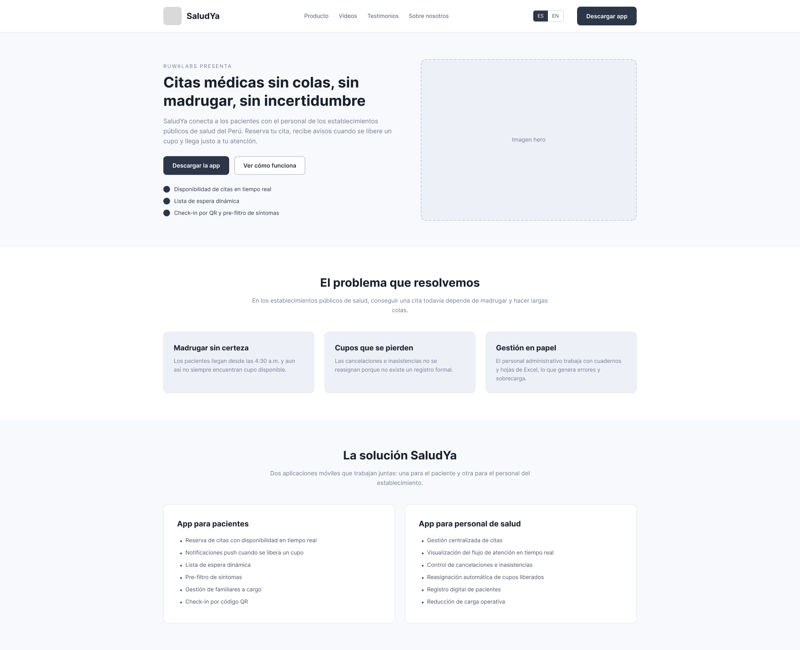

*Nota. Elaboración del equipo RuwaLabs para el proyecto SaludYa.*

La vista inferior permite revisar la distribución de las secciones finales de la landing page en escritorio, como se observa en la [Figura 58](#figura-58) y la [Figura 59](#figura-59).

**Figura 59**

*Wireframe Desktop - Vista inferior*

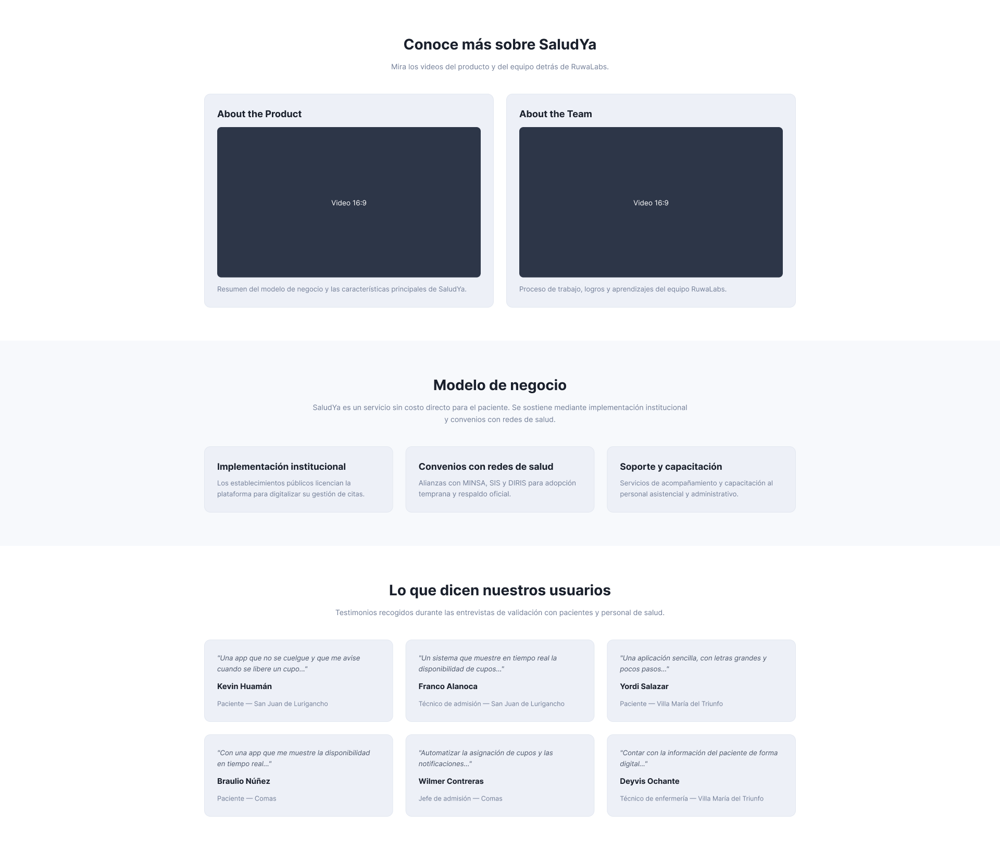

*Nota. Elaboración del equipo RuwaLabs para el proyecto SaludYa.*

### Wireframe Mobile Web Browser

Las vistas del wireframe distribuyen las secciones de la landing page para su consulta desde un navegador móvil, como se detalla en la [Tabla 78](#tabla-78).

**Tabla 78**

*Wireframe Mobile Web Browser*

| Vista | Secciones destacadas |
|:---|:---|
| Vista superior | Header, Hero, Problema y Solución |
| Vista inferior | Videos, Modelo de negocio y Testimonios |

*Nota. Elaboración del equipo RuwaLabs para el proyecto SaludYa.*

**Figura 60**

*Wireframe Mobile - Vista superior*

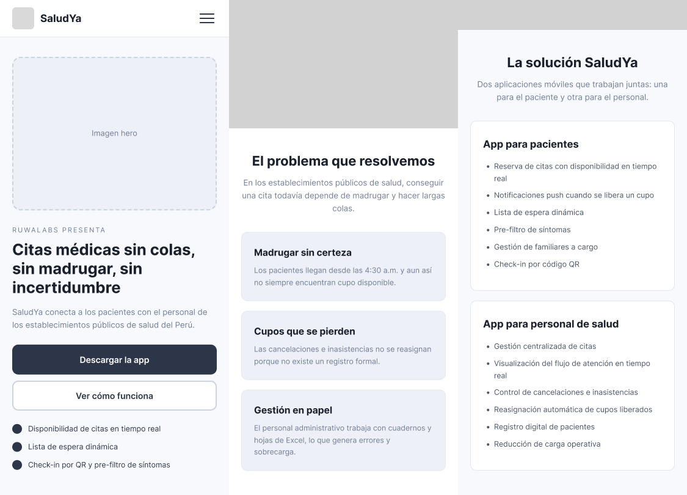

*Nota. Elaboración del equipo RuwaLabs para el proyecto SaludYa.*

La vista inferior permite revisar la distribución de las secciones finales de la landing page en móvil, como se observa en la [Figura 60](#figura-60) y la [Figura 61](#figura-61).

**Figura 61**

*Wireframe Mobile - Vista inferior*

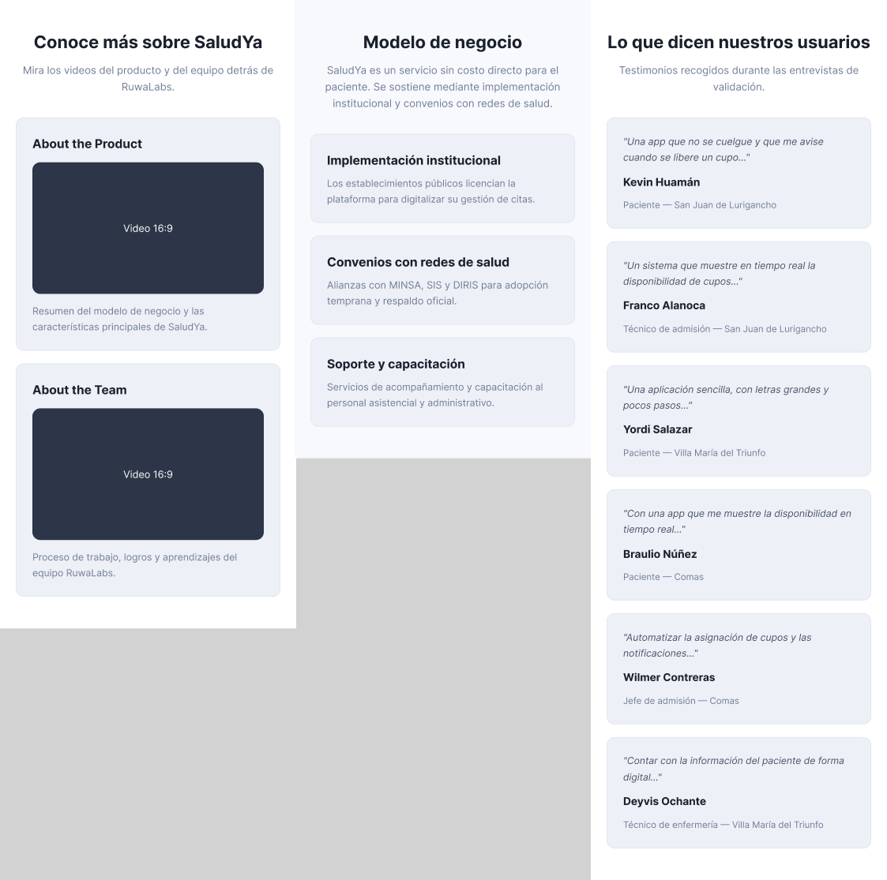

*Nota. Elaboración del equipo RuwaLabs para el proyecto SaludYa.*

### Principios de diseño aplicados

- **Jerarquía visual:** se establecieron diferentes niveles tipográficos y variaciones de fondo para diferenciar títulos, contenidos y secciones.
- **Diseño inclusivo:** se consideraron contraste adecuado, tipografía legible, áreas de interacción apropiadas y estados de foco visibles.
- **Arquitectura de información:** la organización sigue una secuencia de problema → solución → evidencia → equipo → descarga, facilitando la comprensión progresiva del producto.
- **Consistencia visual:** se mantuvieron criterios uniformes de espaciado, tamaños, radios y componentes a lo largo de la interfaz.
- **Diseño responsive:** la estructura fue adaptada para mantener la legibilidad y funcionalidad tanto en pantallas de escritorio como en dispositivos móviles.

## 3.1.3.2. Landing Page Mock-up

Los mock-ups fueron desarrollados en **Figma** a partir de la estructura definida en los wireframes y aplicando el **Design System de SaludYa**. Este sistema establece los criterios visuales utilizados para mantener consistencia en colores, tipografía, espaciado, componentes e interacción.

### Design System aplicado

El sistema de diseño reúne los colores, la tipografía y los criterios visuales utilizados para mantener una identidad consistente en la landing page, como se detalla en la [Tabla 79](#tabla-79).

**Tabla 79**

*Design System aplicado*

| Elemento | Valor | Aplicación |
|:---|:---|:---|
| Color primario | `#0b8f6b` | Botones, enlaces e iconos |
| Color primario oscuro | `#076e52` | Estados hover y elementos destacados |
| Color primario claro | `#e6f5f0` | Fondos de sección y estados hover |
| Color de acento | `#ffb703` | Indicadores de foco y elementos de énfasis |
| Texto principal | `#1c2b2a` | Títulos y contenido principal |
| Texto secundario | `#56706d` | Descripciones y contenido complementario |
| Fondos | `#ffffff` / `#f4faf8` | Fondo principal y secciones alternas |
| Borde | `#d8e6e2` | Tarjetas, controles y separadores |
| Tipografía | Segoe UI / Helvetica Neue / Arial | Títulos y contenido |
| Radios | 6px / 12px / 20px | Tarjetas, botones y contenedores |
| Sombras | sm / md / lg | Jerarquía y profundidad visual |

*Nota. Elaboración del equipo RuwaLabs para el proyecto SaludYa.*

### Mock-up Desktop Web Browser

Las vistas del mockup distribuyen las secciones de la landing page para su consulta desde un navegador de escritorio, como se detalla en la [Tabla 80](#tabla-80).

**Tabla 80**

*Mock-up Desktop Web Browser*

| Vista | Secciones destacadas |
|:---|:---|
| Vista superior | Header, Hero, Problema y Solución |
| Vista inferior | Videos, Modelo de negocio y Testimonios |

*Nota. Elaboración del equipo RuwaLabs para el proyecto SaludYa.*

**Figura 62**

*Mock-up Desktop - Vista superior*

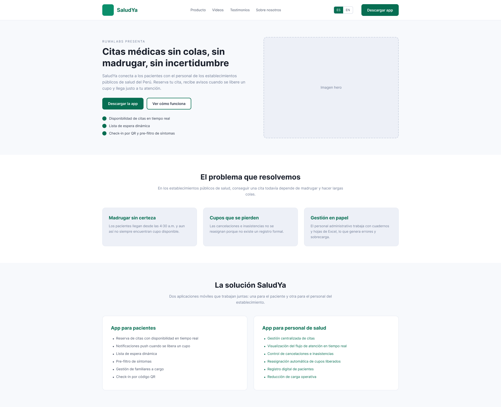

*Nota. Elaboración del equipo RuwaLabs para el proyecto SaludYa.*

La vista inferior permite revisar la distribución de las secciones finales de la landing page en escritorio, como se observa en la [Figura 62](#figura-62) y la [Figura 63](#figura-63).

**Figura 63**

*Mock-up Desktop - Vista inferior*

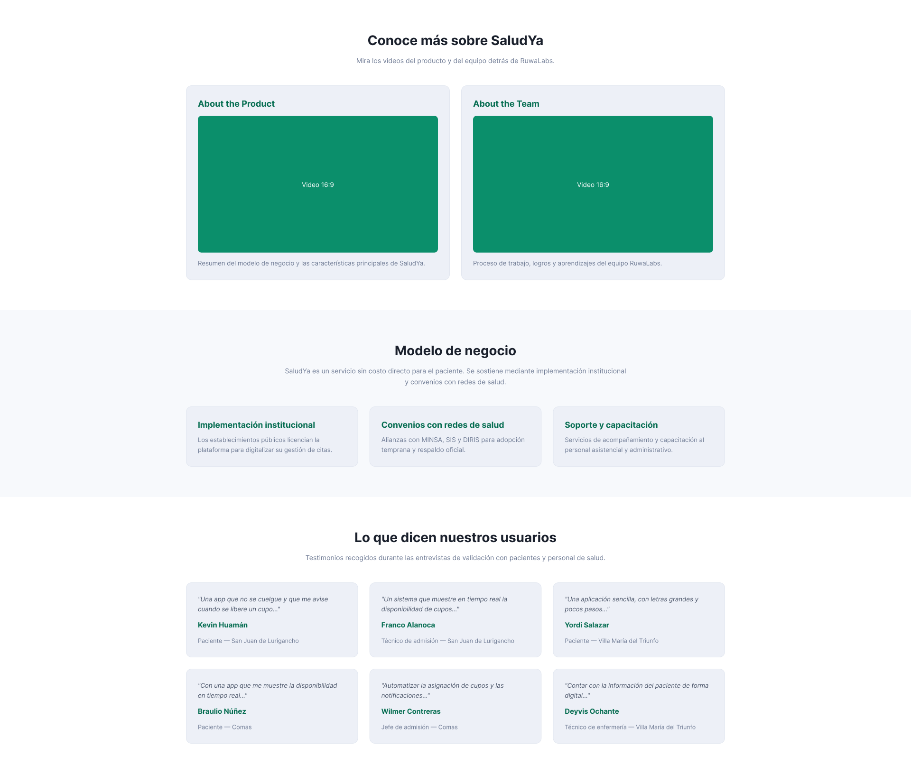

*Nota. Elaboración del equipo RuwaLabs para el proyecto SaludYa.*

### Mock-up Mobile Web Browser

Las vistas del mockup distribuyen las secciones de la landing page para su consulta desde un navegador móvil, como se detalla en la [Tabla 81](#tabla-81).

**Tabla 81**

*Mock-up Mobile Web Browser*

| Vista | Secciones destacadas |
|:---|:---|
| Vista superior | Header, Hero, Problema y Solución |
| Vista inferior | Videos, Modelo de negocio y Testimonios |

*Nota. Elaboración del equipo RuwaLabs para el proyecto SaludYa.*

**Figura 64**

*Mock-up Mobile - Vista superior*

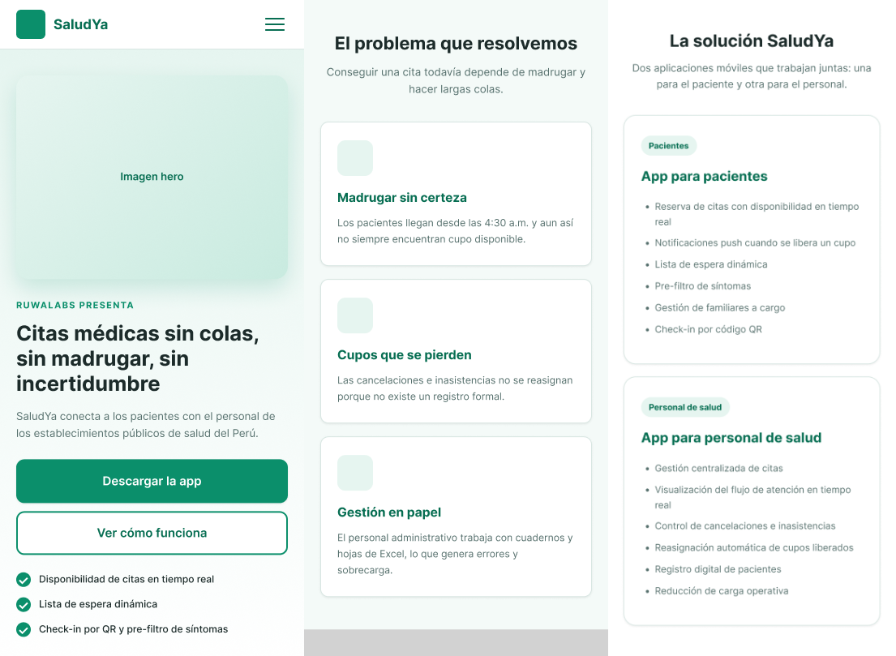

*Nota. Elaboración del equipo RuwaLabs para el proyecto SaludYa.*

La vista inferior permite revisar la distribución de las secciones finales de la landing page en móvil, como se observa en la [Figura 64](#figura-64) y la [Figura 65](#figura-65).

**Figura 65**

*Mock-up Mobile - Vista inferior*

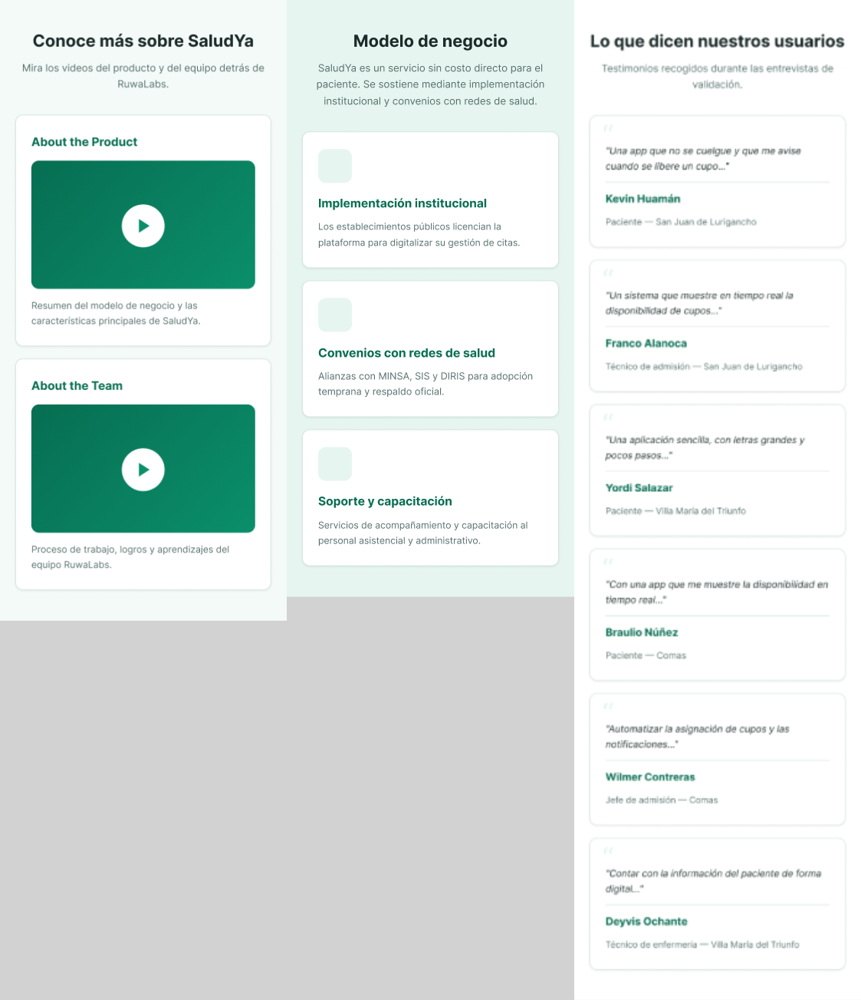

*Nota. Elaboración del equipo RuwaLabs para el proyecto SaludYa.*

### Aplicación del Design System y diseño inclusivo

Los criterios de diseño combinan la identidad visual de SaludYa con decisiones de legibilidad y accesibilidad para facilitar el uso de la interfaz, como se detalla en la [Tabla 82](#tabla-82).

**Tabla 82**

*Aplicación del Design System y diseño inclusivo*

| Criterio | Aplicación |
|:---|:---|
| Branding | Uso consistente del logotipo y de la paleta cromática de SaludYa |
| Tipografía | Jerarquía visual clara, tamaño legible e interlineado adecuado |
| Colores | Contraste adecuado para facilitar la lectura y diferenciación de acciones |
| Espaciado | Escala uniforme de márgenes, rellenos y separación entre componentes |
| Diseño inclusivo | Etiquetas accesibles, textos alternativos, áreas de interacción adecuadas y soporte para reducción de movimiento |
| Internacionalización | Selector ES/EN para adaptar dinámicamente los contenidos |
| Navegación | Menú sticky y desplazamiento suave entre las diferentes secciones |
| Responsive | Adaptación de estructura, componentes y contenidos a diferentes tamaños de pantalla |

*Nota. Elaboración del equipo RuwaLabs para el proyecto SaludYa.*

### Componentes reutilizables

Los componentes reutilizables definen la apariencia y los estados de botones, tarjetas y controles para mantener su comportamiento consistente entre pantallas, como se detalla en la [Tabla 83](#tabla-83).

**Tabla 83**

*Componentes reutilizables*

| Componente | Descripción | Estados |
|:---|:---|:---|
| Botón primario | Botón de acción principal con fondo verde y texto blanco | Default, hover, focus |
| Botón secundario | Botón con fondo transparente y borde del color primario | Default, hover, focus |
| Tarjeta | Contenedor para información con borde y sombra | Default, hover |
| Testimonio | Tarjeta destinada a mostrar opiniones y citas de usuarios | Default |
| Miembro del equipo | Componente con fotografía, nombre y rol | Default, hover |
| Selector de idioma | Control para alternar entre español e inglés | Activo, inactivo |
| Menú de navegación | Control responsive para mostrar u ocultar las opciones de navegación | Cerrado, abierto |

*Nota. Elaboración del equipo RuwaLabs para el proyecto SaludYa.*

### Landing Page implementado

El diseño definido en los wireframes y mock-ups fue posteriormente trasladado a una implementación funcional. Esta versión permite visualizar la aplicación de los lineamientos establecidos en el Design System y comprobar la adaptación de la interfaz a diferentes tamaños de pantalla, como se observa en la [Figura 66](#figura-66).

**Figura 66**

*Landing Page de SaludYa - Implementación*

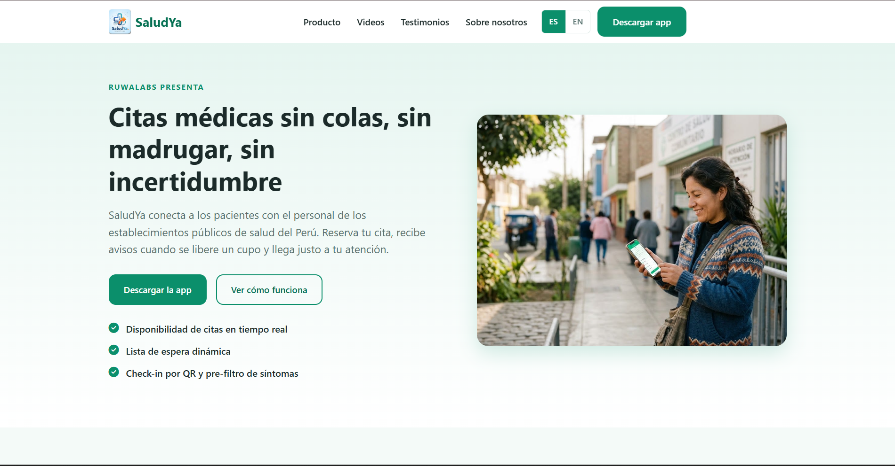

*Nota. Elaboración del equipo RuwaLabs para el proyecto SaludYa.*

**Landing Page de SaludYa:**

https://ruwalabs.github.io/saludya-landing/

### Conclusión de la sección

Los wireframes y mock-ups del Landing Page evidencian la aplicación coherente del Design System, los principios de diseño inclusivo y la arquitectura de información. La propuesta comunica el modelo de negocio de RuwaLabs, el problema que resuelve SaludYa y los beneficios para ambos segmentos objetivo, facilitando la conversión del visitante hacia la descarga de las aplicaciones móviles. La inclusión de internacionalización y accesibilidad garantiza una experiencia inclusiva y consistente.

#### 3.1.4.3. Mobile Applications Mock-ups

En este entregable se presentan los mock-ups de alta fidelidad de la aplicación móvil de SaludYa para el paciente, incluyendo la gestión de citas de menores a su cargo. El diseño parte de los wireframes del equipo y las historias de usuario del reporte. Los recorridos del personal de admisión, Super Admin, configuración operativa y exportación de reportes quedan pendientes para una entrega posterior.

La identidad visual utiliza el verde primario `#0B8F6B`, fondos claros y tipografía Inter. Las pantallas tienen un tamaño de referencia de 375 × 812 píxeles; los botones principales, una altura de 48 píxeles y esquinas de 12 píxeles. Se incluyen estados de confirmación, error y ausencia de información. Los datos son ficticios y las imágenes representan el diseño de la experiencia.

**Sección Autenticación y Registro — Identity & Access Management**

**Figura 67**

*Bienvenida y registro del paciente*

  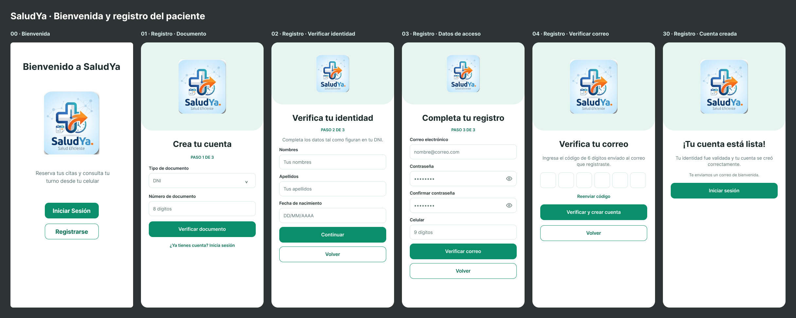

*Nota. Elaboración del equipo RuwaLabs para el proyecto SaludYa.*

Presenta la bienvenida, el ingreso del DNI, la verificación de datos personales y el registro del correo, contraseña y celular. Los botones de acceso y registro se agrupan en la bienvenida. La cuenta se verifica mediante un código enviado al correo electrónico registrado. El celular se conserva como dato de contacto; no se utiliza verificación por SMS, como se observa en la [Figura 67](#figura-67).

**Figura 68**

*Acceso y recuperación de la cuenta del paciente*

  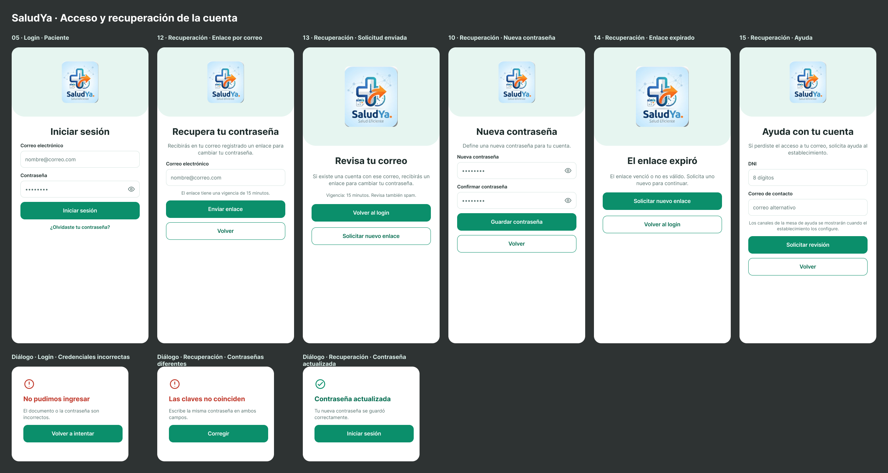

*Nota. Elaboración del equipo RuwaLabs para el proyecto SaludYa.*

El paciente inicia sesión con su correo y contraseña. El rol de este recorrido es Paciente y no se ofrece un selector de perfiles administrativos. La recuperación envía un enlace al correo registrado, con vigencia de 15 minutos; se muestran la solicitud enviada, el enlace vencido, la nueva contraseña y los errores de acceso, como se observa en la [Figura 68](#figura-68).

**Sección Dashboard del Paciente**

**Figura 69**

*Inicio, citas pendientes e historial del paciente*

  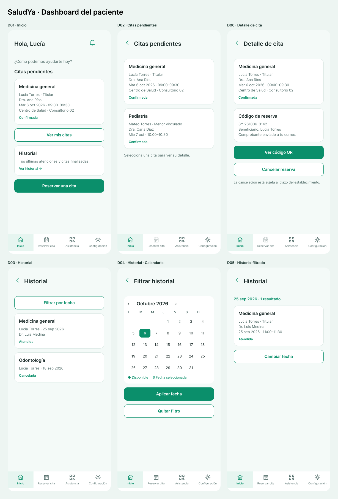

*Nota. Elaboración del equipo RuwaLabs para el proyecto SaludYa.*

El inicio reúne las citas pendientes, el acceso al historial y la reserva de una nueva cita. La campana de notificaciones se ubica en el extremo derecho de la cabecera. Las tarjetas identifican al beneficiario, la especialidad, el profesional, la fecha y el estado de la cita. Se incluyen el filtro por fecha, el detalle de la reserva y los estados sin citas o con error de carga, como se observa en la [Figura 69](#figura-69).

**Sección Reserva de Citas**

**Figura 70**

*Selección de especialidad, beneficiario, fecha, profesional y horario*

  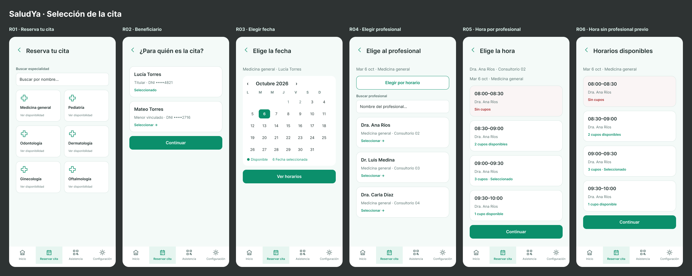

*Nota. Elaboración del equipo RuwaLabs para el proyecto SaludYa.*

El paciente selecciona la especialidad, al titular o menor vinculado y una fecha disponible. Puede elegir primero al profesional o consultar directamente los horarios mediante la opción ubicada antes de la lista. Los horarios sin cupos se distinguen con texto y color de estado y no permiten selección, como se observa en la [Figura 70](#figura-70).

**Figura 71**

*Resumen, confirmación y estados de la reserva*

  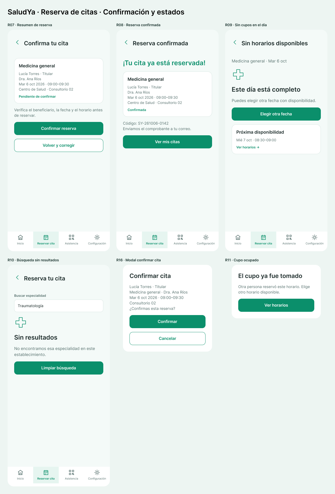

*Nota. Elaboración del equipo RuwaLabs para el proyecto SaludYa.*

El resumen permite revisar los datos antes de confirmar la cita. La reserva confirmada muestra su código identificador y los detalles de atención. Los estados alternativos contemplan cupos ocupados, cruces de horarios, falta de disponibilidad y restricciones de cancelación. Un fallo en el envío del comprobante no anula la reserva, como se observa en la [Figura 71](#figura-71).

**Sección Check-in y Atención del Paciente**

**Figura 72**

*Registro de llegada, escaneo del QR del establecimiento, ticket y cola*

  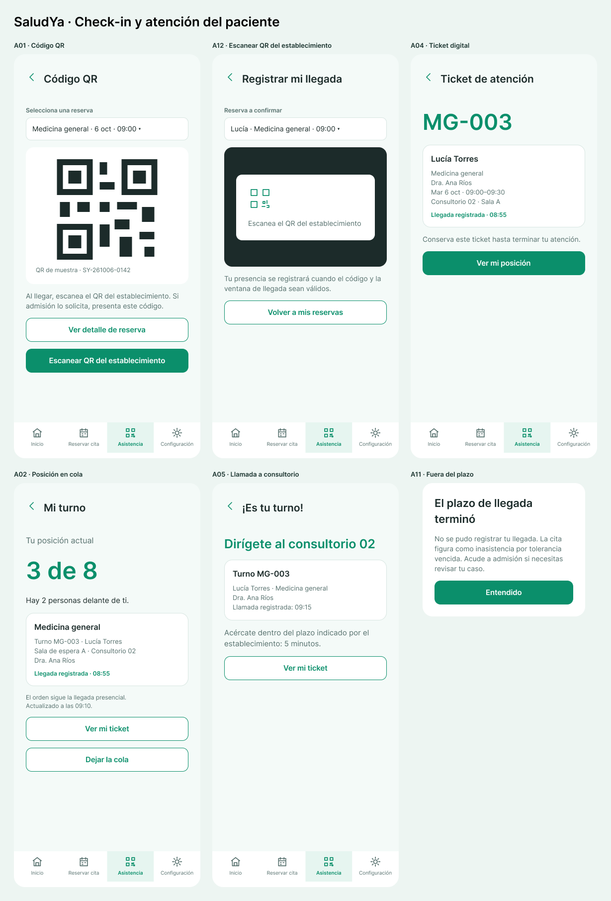

*Nota. Elaboración del equipo RuwaLabs para el proyecto SaludYa.*

Para registrar su llegada, el paciente selecciona una reserva y escanea el QR ubicado en el establecimiento, conforme a US-12. La aplicación valida la cita y la ventana de tolerancia antes de confirmar la presencia. Este recorrido no solicita presentar un QR personal generado al reservar, como se observa en la [Figura 72](#figura-72).

Después del check-in se habilitan el ticket digital y la posición en la cola, ordenada por llegada presencial. Para los menores se identifica al beneficiario y a su representante. Se muestran el llamado a consultorio, la atención finalizada, la ausencia y los errores de QR o de horario. La variante que ocultaba la posición de la cola queda fuera de este entregable.

**Sección Configuración y Perfil del Paciente**

**Figura 73**

*Configuración, datos personales y actualización del contacto*

  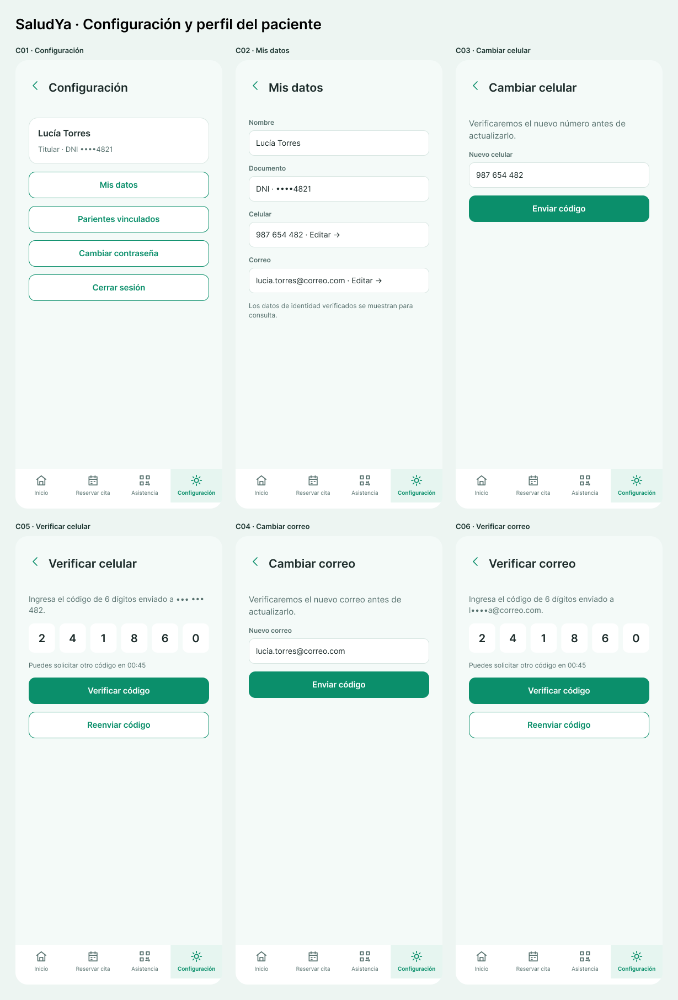

*Nota. Elaboración del equipo RuwaLabs para el proyecto SaludYa.*

El paciente consulta sus datos y actualiza su celular o correo. El nuevo correo se verifica con un código enviado a esa dirección. Para cambiar el celular, confirma la operación mediante un código enviado al correo registrado; el número se mantiene como dato de contacto. Se presentan los estados de actualización, código incorrecto o vencido y datos inválidos. La identidad verificada permanece como información de consulta, como se observa en la [Figura 73](#figura-73).

**Sección Gestión de Menores Vinculados**

**Figura 74**

*Vinculación, verificación y gestión de menores a cargo*

  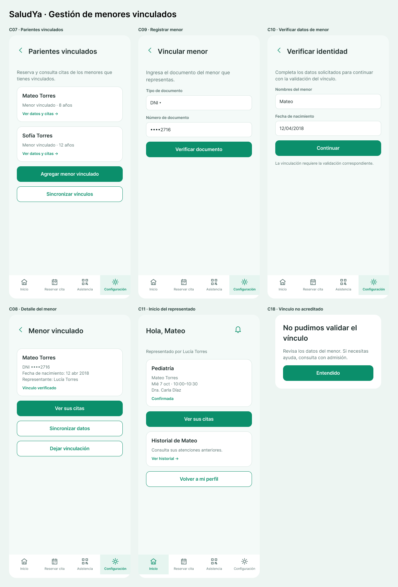

*Nota. Elaboración del equipo RuwaLabs para el proyecto SaludYa.*

El titular consulta sus menores vinculados, registra un menor y verifica sus datos para gestionar sus citas. Se incluyen el detalle del menor, el inicio del representado, la lista vacía, las restricciones de vinculación y la confirmación de desvinculación, como se observa en la [Figura 74](#figura-74).

**Sección Notificaciones y Reasignación de Citas**

**Figura 75**

*Notificaciones y ofertas de reasignación de citas*

  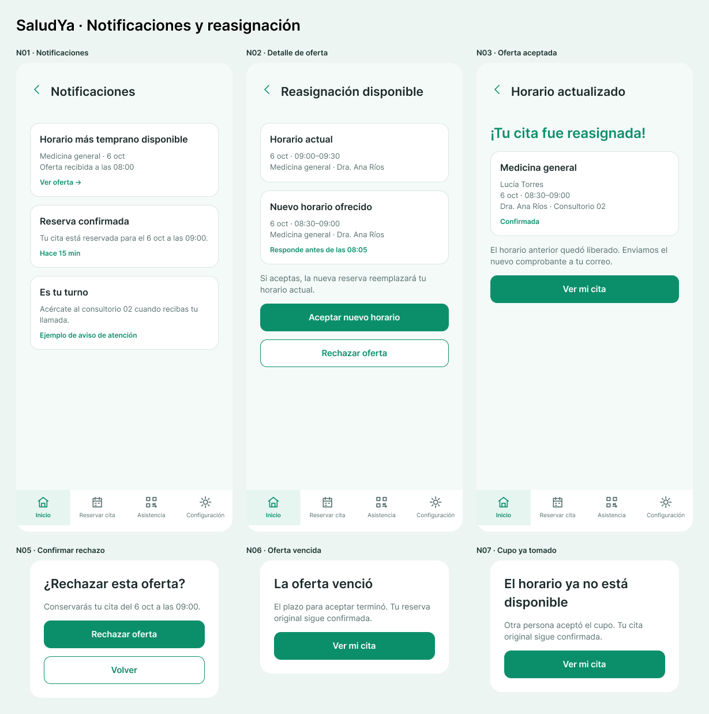

*Nota. Elaboración del equipo RuwaLabs para el proyecto SaludYa.*

Las notificaciones informan sobre reservas, llamados y propuestas de adelanto. El paciente compara el horario actual con el ofrecido y acepta o rechaza la propuesta dentro del plazo. El rechazo, el vencimiento de la oferta o la ocupación del cupo conservan la reserva original, como se observa en la [Figura 75](#figura-75).

**Archivo de diseño**

[Mobile Application Mockups — SaludYa](https://www.figma.com/design/9Or15PiTxTluzSQouONYqH/Mobile-Application-Mockups?node-id=2-2)

#### 3.1.4.4. Mobile Applications User Flow Diagrams

Los user flow diagrams describen los recorridos del paciente y del titular que gestiona citas de menores a su cargo. Se elaboraron a partir de los mock-ups corregidos y las historias de usuario del reporte, manteniendo el alcance de este entregable.

Se presentan 15 objetivos mediante 30 diagramas. Cada objetivo incluye un **Happy Path**, correspondiente al recorrido esperado, y sus **Unhappy Paths**, con errores, restricciones y decisiones alternativas. La lectura es de izquierda a derecha: los extremos redondeados representan inicio o resultado, los rectángulos indican pantallas o acciones, los rombos muestran decisiones y las flechas enlazan los pasos.

Los recorridos comprenden registro, acceso, recuperación, perfil, menores, citas, reasignación, llegada, ticket, cola y sesión. No se incluyen los flujos del personal de admisión ni de administración.

- **User Goal 1:** Registrarse como paciente.

**Happy Path**

El paciente accede a Bienvenida, selecciona Registrarse e ingresa su DNI y datos personales. Tras validar su identidad, completa los datos de acceso y verifica su correo mediante el código recibido por email. El recorrido finaliza con la cuenta creada, como se observa en la [Figura 76](#figura-76).

**Figura 76**

*Registrarse como paciente — recorrido esperado*

  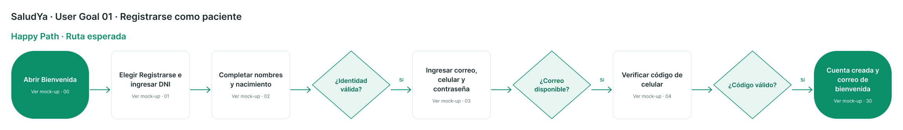

*Nota. Elaboración del equipo RuwaLabs para el proyecto SaludYa.*

**Unhappy Paths**

Se consideran datos de identidad no coincidentes, correo registrado, código incorrecto e indisponibilidad del servicio de identidad. El paciente corrige sus datos o reintenta la validación antes de crear la cuenta, como se observa en la [Figura 77](#figura-77).

**Figura 77**

*Registrarse como paciente — errores y alternativas*

  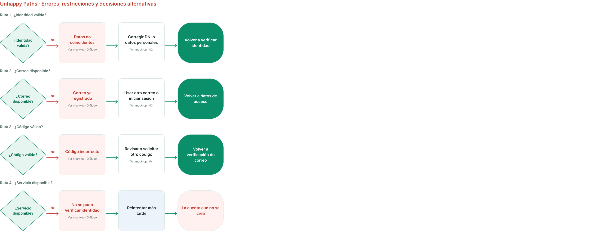

*Nota. Elaboración del equipo RuwaLabs para el proyecto SaludYa.*

- **User Goal 2:** Iniciar sesión como paciente.

**Happy Path**

El paciente ingresa su correo y contraseña. Si la cuenta está activa y las credenciales son válidas, accede a Inicio. El recorrido corresponde exclusivamente al paciente, sin selección de perfiles administrativos, como se observa en la [Figura 78](#figura-78).

**Figura 78**

*Iniciar sesión como paciente — recorrido esperado*

  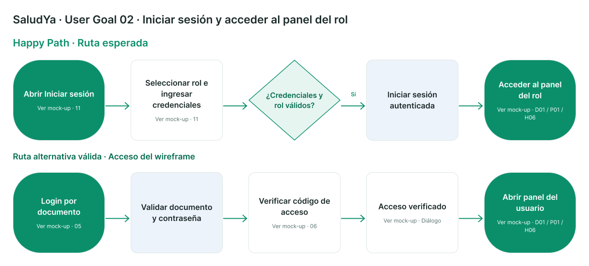

*Nota. Elaboración del equipo RuwaLabs para el proyecto SaludYa.*

**Unhappy Paths**

Las credenciales incorrectas mantienen al paciente en el acceso. Para una cuenta inactiva se indica la consulta con admisión. El acceso se realiza por correo y contraseña, sin verificación por SMS, como se observa en la [Figura 79](#figura-79).

**Figura 79**

*Iniciar sesión como paciente — errores y alternativas*

  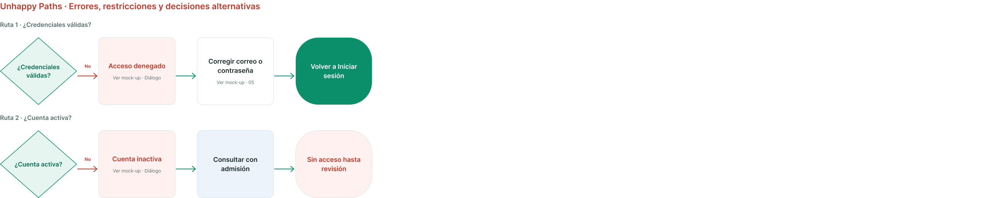

*Nota. Elaboración del equipo RuwaLabs para el proyecto SaludYa.*

- **User Goal 3:** Recuperar la contraseña.

**Happy Path**

El paciente solicita la recuperación con su correo registrado. La aplicación muestra una confirmación genérica; el enlace recibido permite definir una nueva contraseña durante sus 15 minutos de vigencia, como se observa en la [Figura 80](#figura-80).

**Figura 80**

*Recuperar la contraseña — recorrido esperado*

  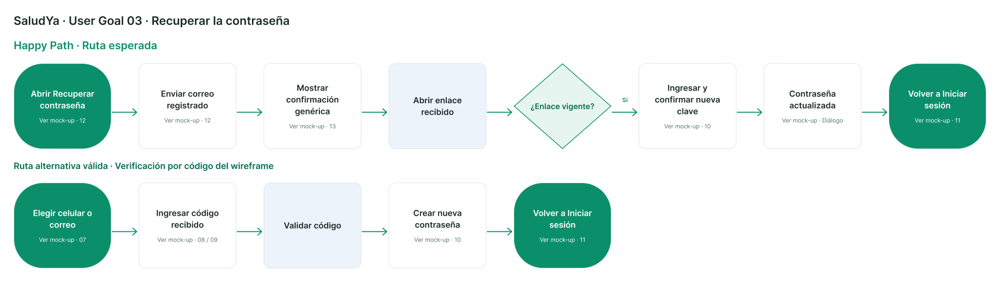

*Nota. Elaboración del equipo RuwaLabs para el proyecto SaludYa.*

**Unhappy Paths**

Se presentan enlaces vencidos o inválidos, contraseñas diferentes y pérdida de acceso al correo. Un correo no registrado recibe una respuesta genérica y no genera token. La recuperación asistida requiere verificar la identidad del paciente, como se observa en la [Figura 81](#figura-81).

**Figura 81**

*Recuperar la contraseña — errores y alternativas*

  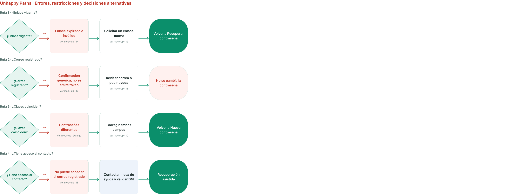

*Nota. Elaboración del equipo RuwaLabs para el proyecto SaludYa.*

- **User Goal 4:** Vincular o desvincular a un menor.

**Happy Path**

El titular ingresa los datos del menor y confirma su vinculación después de verificar identidad y filiación. Desde el detalle puede consultar sus citas o confirmar la desvinculación, como se observa en la [Figura 82](#figura-82).

**Figura 82**

*Vincular o desvincular a un menor — recorrido esperado*

  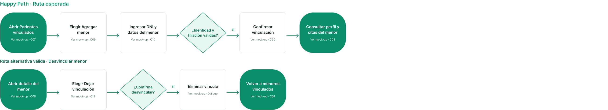

*Nota. Elaboración del equipo RuwaLabs para el proyecto SaludYa.*

**Unhappy Paths**

Se representan vínculos existentes, datos o edad inválidos y cancelación de la desvinculación. Cuando se requiere revisión de tutela, el titular consulta con admisión, como se observa en la [Figura 83](#figura-83).

**Figura 83**

*Vincular o desvincular a un menor — errores y alternativas*

  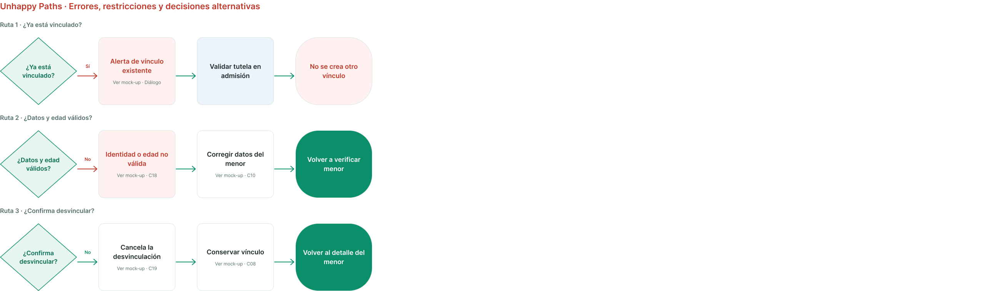

*Nota. Elaboración del equipo RuwaLabs para el proyecto SaludYa.*

- **User Goal 5:** Actualizar el correo o celular del perfil.

**Happy Path**

El paciente consulta sus datos y modifica su correo o celular. Si cambia el correo, verifica la nueva dirección; si cambia el celular, confirma la operación con un código enviado al correo registrado. El recorrido finaliza con la actualización y su confirmación, como se observa en la [Figura 84](#figura-84).

**Figura 84**

*Actualizar el correo o celular del perfil — recorrido esperado*

  

*Nota. Elaboración del equipo RuwaLabs para el proyecto SaludYa.*

**Unhappy Paths**

Se consideran formatos inválidos, correo duplicado y códigos incorrectos o vencidos. El paciente corrige el dato o solicita un nuevo código por correo. Los datos de identidad permanecen de consulta, como se observa en la [Figura 85](#figura-85).

**Figura 85**

*Actualizar el correo o celular del perfil — errores y alternativas*

  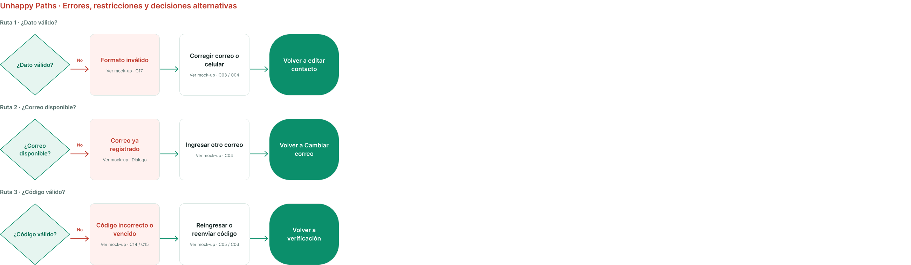

*Nota. Elaboración del equipo RuwaLabs para el proyecto SaludYa.*

- **User Goal 6:** Consultar disponibilidad de citas.

**Happy Path**

El paciente selecciona una especialidad y una fecha. Consulta profesionales y horarios disponibles; la alternativa de elegir por horario se encuentra antes de la lista de profesionales, como se observa en la [Figura 86](#figura-86).

**Figura 86**

*Consultar disponibilidad de citas — recorrido esperado*

  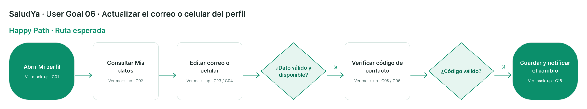

*Nota. Elaboración del equipo RuwaLabs para el proyecto SaludYa.*

**Unhappy Paths**

Una búsqueda sin resultados permite cambiar el texto. Si no hay cupos para el día, el paciente vuelve al calendario y elige otra fecha. Los horarios sin cupos no se seleccionan, como se observa en la [Figura 87](#figura-87).

**Figura 87**

*Consultar disponibilidad de citas — errores y alternativas*

  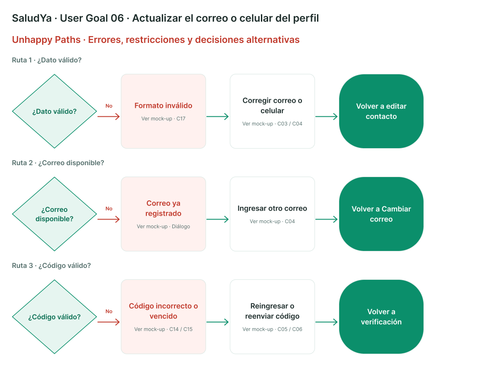

*Nota. Elaboración del equipo RuwaLabs para el proyecto SaludYa.*

- **User Goal 7:** Reservar una cita y recibir confirmación.

**Happy Path**

El titular indica el beneficiario, elige fecha, profesional y horario y revisa el resumen. Al confirmar, recibe el código de reserva y el comprobante de la cita, como se observa en la [Figura 88](#figura-88).

**Figura 88**

*Reservar una cita y recibir confirmación — recorrido esperado*

  

*Nota. Elaboración del equipo RuwaLabs para el proyecto SaludYa.*

**Unhappy Paths**

Se contemplan un cupo tomado, una cita coincidente, cancelación de la confirmación y fallo en el envío del comprobante. Si el correo queda pendiente, la reserva continúa confirmada, como se observa en la [Figura 89](#figura-89).

**Figura 89**

*Reservar una cita y recibir confirmación — errores y alternativas*

  

*Nota. Elaboración del equipo RuwaLabs para el proyecto SaludYa.*

- **User Goal 8:** Consultar citas, detalles e historial.

**Happy Path**

Desde Inicio, el paciente consulta citas pendientes o historial, aplica un filtro por fecha y abre el detalle de una cita propia o de un menor, como se observa en la [Figura 90](#figura-90).

**Figura 90**

*Consultar citas, detalles e historial — recorrido esperado*

  

*Nota. Elaboración del equipo RuwaLabs para el proyecto SaludYa.*

**Unhappy Paths**

Se presentan ausencia de citas, error de carga y necesidad de seleccionar al menor representado. El paciente puede reservar, reintentar la consulta o cambiar de beneficiario, como se observa en la [Figura 91](#figura-91).

**Figura 91**

*Consultar citas, detalles e historial — errores y alternativas*

  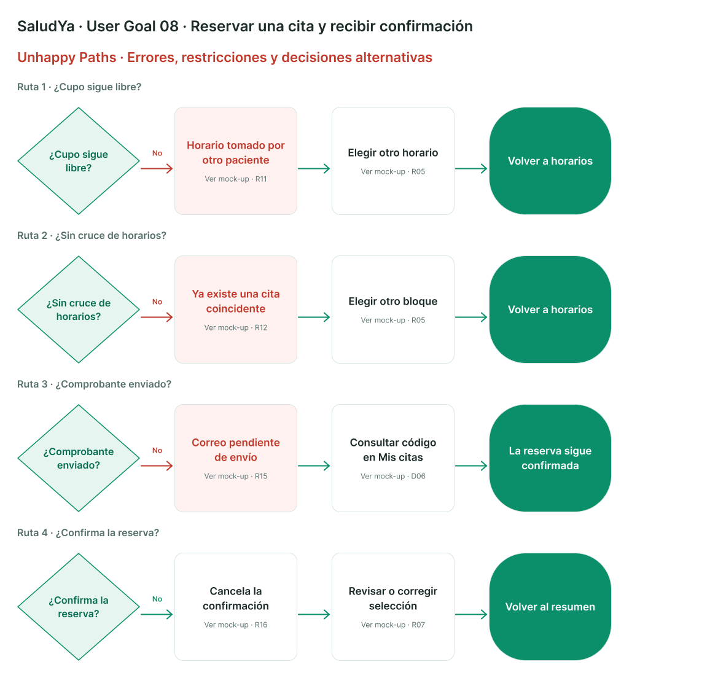

*Nota. Elaboración del equipo RuwaLabs para el proyecto SaludYa.*

- **User Goal 9:** Cancelar una reserva dentro del plazo.

**Happy Path**

El paciente abre el detalle de una reserva y solicita cancelarla. Dentro del plazo permitido, confirma la operación y consulta el estado Cancelada, como se observa en la [Figura 92](#figura-92).

**Figura 92**

*Cancelar una reserva dentro del plazo — recorrido esperado*

  

*Nota. Elaboración del equipo RuwaLabs para el proyecto SaludYa.*

**Unhappy Paths**

Fuera del plazo, la reserva sigue activa y se indica la consulta con admisión. Si cancela la confirmación, conserva la cita. Cancelar una reserva se distingue de dejar la cola presencial, como se observa en la [Figura 93](#figura-93).

**Figura 93**

*Cancelar una reserva dentro del plazo — errores y alternativas*

  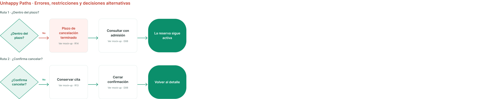

*Nota. Elaboración del equipo RuwaLabs para el proyecto SaludYa.*

- **User Goal 10:** Responder a una oferta de adelanto.

**Happy Path**

El paciente recibe una oferta de adelanto, compara ambos horarios y acepta mientras la oferta y el cupo siguen vigentes. El nuevo horario reemplaza al anterior, como se observa en la [Figura 94](#figura-94).

**Figura 94**

*Responder a una oferta de adelanto — recorrido esperado*

  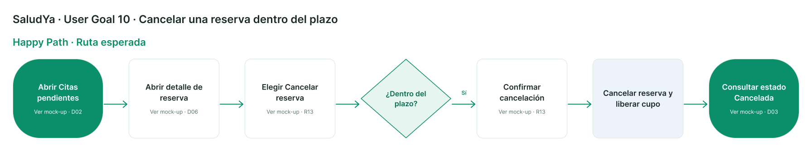

*Nota. Elaboración del equipo RuwaLabs para el proyecto SaludYa.*

**Unhappy Paths**

El rechazo, el vencimiento o un cupo ya tomado conservan la cita original. Cada estado permite volver a consultar la reserva actual, como se observa en la [Figura 95](#figura-95).

**Figura 95**

*Responder a una oferta de adelanto — errores y alternativas*

  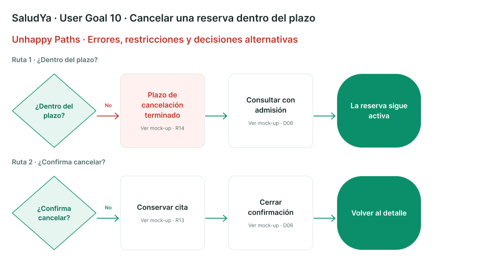

*Nota. Elaboración del equipo RuwaLabs para el proyecto SaludYa.*

- **User Goal 11:** Registrar llegada presencial mediante QR.

**Happy Path**

Al llegar al establecimiento, el titular selecciona su reserva o la del menor y escanea el QR del establecimiento. Si la cita y la ventana horaria son válidas, se confirma la presencia, se ingresa a la cola y se habilita el ticket, como se observa en la [Figura 96](#figura-96).

**Figura 96**

*Registrar llegada presencial mediante QR — recorrido esperado*

  

*Nota. Elaboración del equipo RuwaLabs para el proyecto SaludYa.*

**Unhappy Paths**

Un QR inválido o una reserva inactiva impiden registrar la llegada. Una llegada anticipada requiere esperar la ventana; una llegada fuera de tolerancia registra la inasistencia y activa la liberación del cupo, como se observa en la [Figura 97](#figura-97).

**Figura 97**

*Registrar llegada presencial mediante QR — errores y alternativas*

  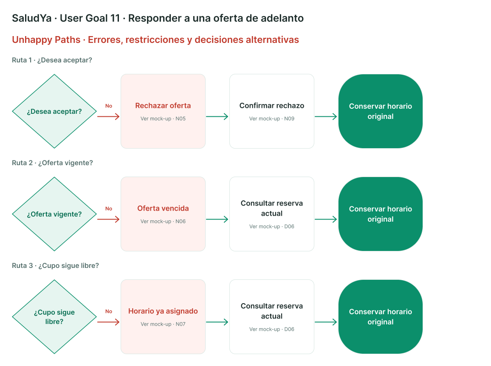

*Nota. Elaboración del equipo RuwaLabs para el proyecto SaludYa.*

- **User Goal 12:** Obtener el ticket digital de atención.

**Happy Path**

Después del check-in, el paciente obtiene su código de turno y consulta el ticket con los datos del beneficiario, profesional, sala y consultorio, como se observa en la [Figura 98](#figura-98).

**Figura 98**

*Obtener el ticket digital de atención — recorrido esperado*

  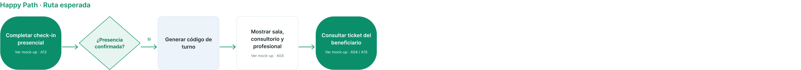

*Nota. Elaboración del equipo RuwaLabs para el proyecto SaludYa.*

**Unhappy Paths**

Sin presencia confirmada debe registrar primero la llegada. Si el turno ya finalizó o fue declarado ausente, consulta el estado correspondiente, como se observa en la [Figura 99](#figura-99).

**Figura 99**

*Obtener el ticket digital de atención — errores y alternativas*

  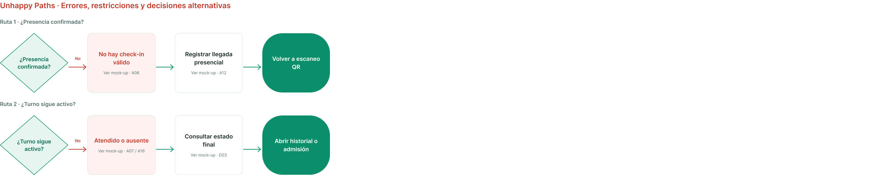

*Nota. Elaboración del equipo RuwaLabs para el proyecto SaludYa.*

- **User Goal 13:** Consultar posición o dejar la cola.

**Happy Path**

El paciente con check-in confirmado y turno activo consulta su posición y el total de pacientes, ordenados por llegada presencial. También puede confirmar que deja la cola, como se observa en la [Figura 100](#figura-100).

**Figura 100**

*Consultar posición o dejar la cola — recorrido esperado*

  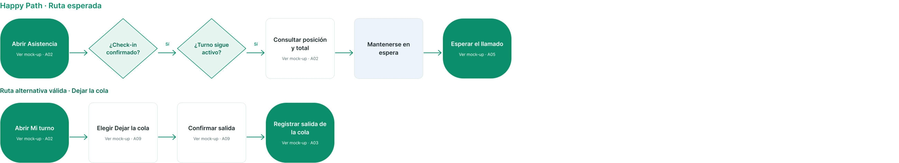

*Nota. Elaboración del equipo RuwaLabs para el proyecto SaludYa.*

**Unhappy Paths**

Sin check-in se solicita registrar la llegada. Un turno atendido o ausente muestra su estado final; cancelar la salida conserva al paciente en espera. No se incluye la variante de cola oculta, como se observa en la [Figura 101](#figura-101).

**Figura 101**

*Consultar posición o dejar la cola — errores y alternativas*

  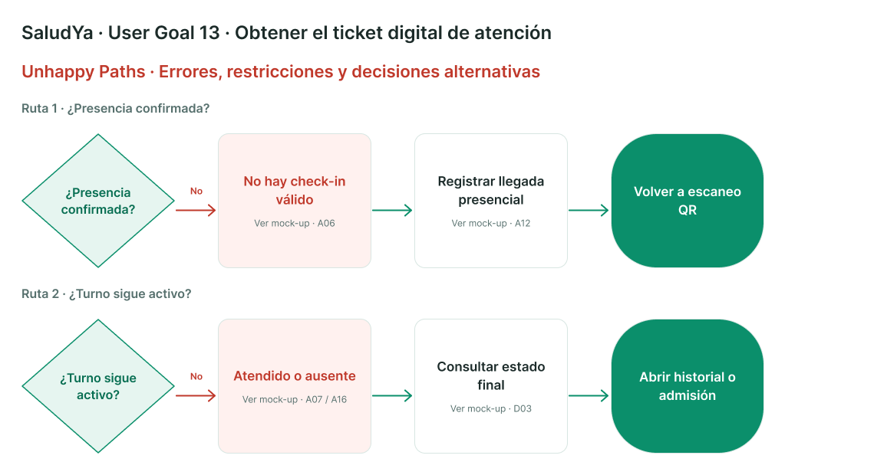

*Nota. Elaboración del equipo RuwaLabs para el proyecto SaludYa.*

- **User Goal 14:** Recibir el llamado y acudir al consultorio.

**Happy Path**

El paciente recibe el llamado, consulta el ticket y se dirige al consultorio dentro del margen establecido para su atención, como se observa en la [Figura 102](#figura-102).

**Figura 102**

*Recibir el llamado y acudir al consultorio — recorrido esperado*

  

*Nota. Elaboración del equipo RuwaLabs para el proyecto SaludYa.*

**Unhappy Paths**

Se contemplan turno aún no llamado, vencimiento del plazo posterior al llamado y falta de respuesta. La aplicación muestra el estado y orienta al paciente sobre el siguiente paso, como se observa en la [Figura 103](#figura-103).

**Figura 103**

*Recibir el llamado y acudir al consultorio — errores y alternativas*

  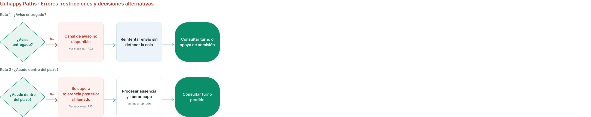

*Nota. Elaboración del equipo RuwaLabs para el proyecto SaludYa.*

- **User Goal 15:** Cerrar sesión o recuperar acceso a una sesión.

**Happy Path**

El paciente abre su perfil, solicita cerrar sesión y confirma. La aplicación finaliza la sesión y vuelve a Bienvenida, como se observa en la [Figura 104](#figura-104).

**Figura 104**

*Cerrar sesión o recuperar acceso a una sesión — recorrido esperado*

  

*Nota. Elaboración del equipo RuwaLabs para el proyecto SaludYa.*

**Unhappy Paths**

Cancelar el cierre conserva la sesión activa. Una sesión expirada requiere volver a ingresar con las credenciales del paciente, como se observa en la [Figura 105](#figura-105).

**Figura 105**

*Cerrar sesión o recuperar acceso a una sesión — errores y alternativas*

  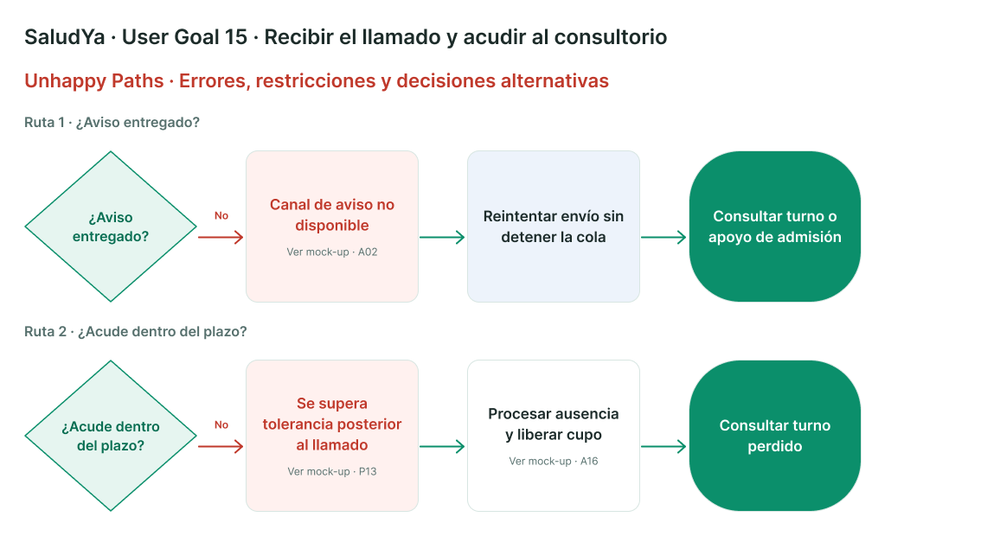

*Nota. Elaboración del equipo RuwaLabs para el proyecto SaludYa.*

**Archivo de diagramas**

[Mobile Applications User Flow Diagrams — SaludYa](https://www.figma.com/design/9Or15PiTxTluzSQouONYqH/Mobile-Application-Mockups?node-id=0-1)

#### 3.1.4.5. Mobile Applications Prototyping

En esta sección se presenta el prótotipo interactivo desarrollado en Figma para la aplicación móvil. El diseño y los flujos de navegación están alineados con la arquitectura de información y los user flow diagrams definidos.

A continuación, se adjunta el enlace al video de demostración, como se observa en la [Figura 106](#figura-106).

**Figura 106**

*Mobile applications prototyping*

  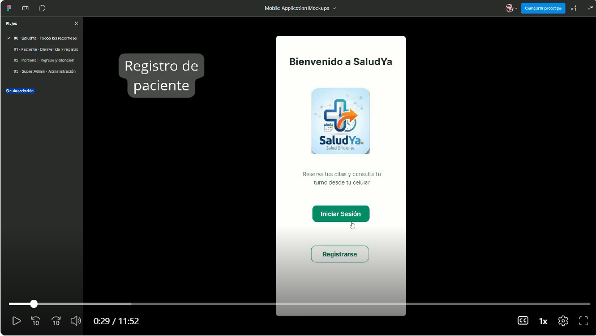

*Nota. Elaboración del equipo RuwaLabs para el proyecto SaludYa.*

[Video Mobile Applications Prototyping](https://l1nq.com/u85pwhp)

### 4.1.3. Source Code Style Guide & Conventions

En esta sección se establecen las convenciones de estilo y nomenclatura que el equipo **RuwaLabs** adopta para el desarrollo de la solución **SaludYa**, compuesta por el Landing Page, las aplicaciones móviles (pacientes y personal de salud) y los servicios web. El objetivo es garantizar la legibilidad, mantenibilidad y consistencia del código a lo largo del ciclo de vida del proyecto, así como facilitar la colaboración entre los miembros del equipo.

Todas las convenciones se aplican en **inglés** para nombres de archivos, variables, funciones, clases y comentarios, siguiendo las buenas prácticas de la industria y las guías oficiales de cada tecnología.

#### Landing Page

El Landing Page se desarrolla con **HTML5, CSS3 y JavaScript (ES6+)**, aplicando las siguientes convenciones:

**Tabla 84**

*Source Code Style Guide & Conventions — Landing Page*

| Elemento | Convención | Ejemplo |
|:---|:---|:---|
| Archivos HTML | kebab-case | `index.html` |
| Archivos CSS | kebab-case | `styles.css`, `responsive.css` |
| Archivos JS | kebab-case | `i18n.js`, `main.js` |
| Carpetas | kebab-case | `assets/css/`, `assets/img/`, `assets/locales/` |
| Variables CSS | kebab-case con prefijo `--` | `--color-primary`, `--space-4` |
| Clases CSS | BEM simplificado (bloque__elemento--modificador) | `.hero__title`, `.card--active` |
| IDs HTML | kebab-case | `#primary-nav`, `#hero-title` |
| Variables JS | camelCase | `currentLang`, `headerHeight` |
| Constantes JS | UPPER_SNAKE_CASE | `DEFAULT_LANG`, `STORAGE_KEY` |
| Funciones JS | camelCase | `detectInitialLang()`, `applyTranslations()` |
| Atributos `data-*` | kebab-case | `data-i18n`, `data-i18n-attr`, `data-lang` |

*Nota. Elaboración del equipo RuwaLabs para el proyecto SaludYa.*

Se adoptan las guías **Google HTML/CSS Style Guide** y **HTML Style Guide and Coding Conventions** (W3Schools), con las siguientes reglas adicionales, como se detalla en la [Tabla 84](#tabla-84):

- Indentación de 2 espacios.
- Uso de comillas dobles en HTML y comillas simples en JavaScript.
- Punto y coma obligatorio al final de cada sentencia en JavaScript.
- Declaración de variables con `const` por defecto y `let` cuando sea necesario; se evita `var`.
- Uso de `"use strict"` en cada archivo JavaScript.
- Comentarios en inglés con formato `/* ... */` para bloques y `// ...` para líneas.
- Separación de responsabilidades: estructura (HTML), presentación (CSS) y comportamiento (JS).
- Uso de `aria-*` y roles semánticos para accesibilidad.

#### Aplicaciones móviles

Las aplicaciones móviles se desarrollan con **Kotlin** (Android nativo) y **Kotlin Multiplatform (KMP)** para la lógica compartida con iOS, siguiendo las convenciones oficiales del lenguaje:

**Tabla 85**

*Source Code Style Guide & Conventions — Aplicaciones móviles*

| Elemento | Convención | Ejemplo |
|:---|:---|:---|
| Clases | PascalCase | `AppointmentRepository`, `PatientViewModel` |
| Interfaces | PascalCase con prefijo descriptivo | `AppointmentRepository` |
| Funciones | camelCase | `getAvailableSlots()` |
| Variables | camelCase | `availableSlots`, `patientId` |
| Constantes | UPPER_SNAKE_CASE | `MAX_WAITING_LIST_SIZE` |
| Paquetes | minúsculas separadas por punto | `pe.edu.upc.saludya.appointments` |
| Archivos Kotlin | PascalCase | `AppointmentViewModel.kt` |
| Recursos XML | snake_case | `activity_main.xml`, `ic_check_in.xml` |
| Strings | snake_case | `app_name`, `btn_reserve` |

*Nota. Elaboración del equipo RuwaLabs para el proyecto SaludYa.*

Se adoptan las guías **Android Kotlin Style Guide** y **Kotlin Coding Conventions**, con las siguientes reglas adicionales, como se detalla en la [Tabla 85](#tabla-85):

- Indentación de 4 espacios.
- Longitud máxima de línea: 100 caracteres.
- Uso de `val` por defecto y `var` solo cuando sea necesario.
- Uso de `data class` para modelos de dominio.
- Uso de `sealed class` para estados de UI.
- Uso de corrutinas para operaciones asíncronas.
- Nomenclatura en inglés para todos los identificadores.
- Comentarios KDoc para clases y funciones públicas.

#### Servicios web

Los servicios web se desarrollan con **Spring Boot** (Java) y **OpenAPI Specification** para la documentación, siguiendo las convenciones oficiales:

**Tabla 86**

*Source Code Style Guide & Conventions — Servicios web*

| Elemento | Convención | Ejemplo |
|:---|:---|:---|
| Clases | PascalCase | `AppointmentController`, `PatientService` |
| Métodos | camelCase | `createAppointment()`, `findPatientById()` |
| Variables | camelCase | `appointmentId`, `patientName` |
| Constantes | UPPER_SNAKE_CASE | `MAX_APPOINTMENTS_PER_DAY` |
| Paquetes | minúsculas separadas por punto | `pe.edu.upc.saludya.appointments` |
| Endpoints REST | kebab-case en plural | `/api/v1/appointments`, `/api/v1/patients` |
| Archivos `.feature` (Gherkin) | kebab-case | `reserve-appointment.feature` |
| Tablas de base de datos | snake_case en plural | `appointments`, `patients` |
| Columnas de base de datos | snake_case | `created_at`, `patient_id` |

*Nota. Elaboración del equipo RuwaLabs para el proyecto SaludYa.*

Se adoptan las guías **Google Java Style Guide** y **Spring Boot Features**, con las siguientes reglas adicionales, como se detalla en la [Tabla 86](#tabla-86):

- Indentación de 4 espacios.
- Uso de anotaciones de Spring (`@RestController`, `@Service`, `@Repository`).
- Uso de DTOs para la transferencia de datos entre capas.
- Uso de `Optional` para valores que pueden ser nulos.
- Documentación de endpoints con **OpenAPI** y **Swagger UI**.
- Criterios de aceptación en **Gherkin** con estructura Given-When-Then.

#### Convenciones de commits y ramas

El equipo aplica **Conventional Commits** para los mensajes de commit y **GitFlow** para la gestión de ramas, como se detalla en la [Tabla 87](#tabla-87):

**Tabla 87**

*Convenciones de commits*

| Tipo | Uso |
|:---|:---|
| `feat` | Nueva funcionalidad |
| `fix` | Corrección de error |
| `docs` | Cambios en documentación |
| `style` | Formato sin cambios de lógica |
| `refactor` | Reestructuración sin cambiar comportamiento |
| `test` | Añadir o modificar pruebas |
| `chore` | Tareas de mantenimiento |

*Nota. Elaboración del equipo RuwaLabs para el proyecto SaludYa.*

**Tabla 88**

*Convenciones de ramas*

| Rama | Uso |
|:---|:---|
| `main` | Versión estable en producción |
| `develop` | Rama de integración |
| `feature/<nombre>` | Nuevas funcionalidades |
| `release/<versión>` | Preparación de release |
| `hotfix/<nombre>` | Correcciones urgentes |

*Nota. Elaboración del equipo RuwaLabs para el proyecto SaludYa.*

Los releases se nombran aplicando **Semantic Versioning** (`MAJOR.MINOR.PATCH`), como se detalla en la [Tabla 88](#tabla-88).

### 4.1.4. Software Deployment Configuration

En esta sección se describe la configuración de despliegue de la solución **SaludYa**, incluyendo los pasos necesarios para publicar cada uno de los productos digitales que la componen: el Landing Page, las aplicaciones móviles (pacientes y personal de salud) y los servicios web. Asimismo, se presenta el **Deployment Diagram** del modelo C4, que ilustra la distribución física de los componentes de software sobre la infraestructura de hardware y servicios en la nube.

#### Landing Page

El Landing Page se despliega como un sitio estático alojado en **GitHub Pages**, aprovechando la integración directa con el repositorio de GitHub del equipo.

**Tabla 89**

*Software Deployment Configuration — Landing Page*

| Paso | Acción |
|:---|:---|
| 1 | Asegurar que el archivo `index.html` se encuentre en la raíz del repositorio `saludya-landing` |
| 2 | Acceder a **Settings → Pages** en el repositorio de GitHub |
| 3 | Seleccionar la rama `main` y la carpeta `/ (root)` como fuente |
| 4 | Guardar la configuración y esperar la publicación |
| 5 | Verificar el despliegue en la URL generada: `https://ruwalabs.github.io/saludya-landing/` |
| 6 | (Opcional) Configurar un dominio personalizado `saludya.pe` mediante registros CNAME |

*Nota. Elaboración del equipo RuwaLabs para el proyecto SaludYa.*

**Tecnologías involucradas:** HTML5, CSS3, JavaScript (ES6+), Font Awesome 6.5.2, como se detalla en la [Tabla 89](#tabla-89).

#### Aplicaciones móviles

Las aplicaciones móviles se distribuyen mediante **Firebase App Distribution** para las pruebas con usuarios de validación, y se publican en **Google Play Store** y **App Store** para la versión final.

**Tabla 90**

*Software Deployment Configuration — Aplicaciones móviles*

| Paso | Acción |
|:---|:---|
| 1 | Generar el APK/AAB firmado desde Android Studio (Android) o el archivo IPA desde Xcode (iOS) |
| 2 | Crear un proyecto en **Firebase Console** y habilitar **App Distribution** |
| 3 | Subir el APK/AAB o IPA a Firebase App Distribution |
| 4 | Invitar a los testers mediante correo electrónico o enlace público |
| 5 | Recopilar feedback de los usuarios de validación |
| 6 | Publicar la versión final en **Google Play Console** y **App Store Connect** |

*Nota. Elaboración del equipo RuwaLabs para el proyecto SaludYa.*

**Tecnologías involucradas:** Kotlin, Kotlin Multiplatform (KMP), Android Studio, Xcode, Firebase App Distribution, como se detalla en la [Tabla 90](#tabla-90).

#### Servicios web

Los servicios web se despliegan en **Railway** (o alternativamente **Render** o **Heroku**), con base de datos **PostgreSQL** gestionada por el mismo proveedor.

**Tabla 91**

*Software Deployment Configuration — Servicios web*

| Paso | Acción |
|:---|:---|
| 1 | Crear una cuenta en **Railway** y un nuevo proyecto |
| 2 | Conectar el repositorio de GitHub del backend (`saludya-web-services`) |
| 3 | Configurar las variables de entorno (credenciales de base de datos, claves JWT, etc.) |
| 4 | Provisionar una base de datos PostgreSQL desde el panel de Railway |
| 5 | Configurar el comando de build y el comando de inicio (`./mvnw spring-boot:run` o `java -jar app.jar`) |
| 6 | Desplegar y verificar la URL pública del servicio |
| 7 | Acceder a la documentación OpenAPI en `/swagger-ui.html` |

*Nota. Elaboración del equipo RuwaLabs para el proyecto SaludYa.*

**Tecnologías involucradas:** Spring Boot, Java, PostgreSQL, OpenAPI, Swagger UI, Railway, como se detalla en la [Tabla 91](#tabla-91).

#### Deployment Diagram (C4 Model)

El **Deployment Diagram** ilustra la distribución física de los componentes de SaludYa sobre la infraestructura de hardware y servicios en la nube, como se detalla en la [Tabla 92](#tabla-92):

**Tabla 92**

*Deployment Diagram (C4 Model)*

| Nodo | Tipo | Componentes desplegados |
|:---|:---|:---|
| Dispositivo del paciente | Hardware (móvil) | App pacientes (Kotlin/KMP) |
| Dispositivo del personal de salud | Hardware (móvil) | App personal de salud (Kotlin/KMP) |
| Navegador del visitante | Hardware (PC/móvil) | Landing Page (HTML/CSS/JS) |
| GitHub Pages | Cloud (static hosting) | Landing Page |
| Firebase App Distribution | Cloud (distribución) | APK/AAB/IPA de las apps |
| Railway / Render | Cloud (PaaS) | Servicios web (Spring Boot) |
| PostgreSQL (Railway) | Cloud (DBaaS) | Base de datos relacional |
| Firebase Cloud Messaging | Cloud (push) | Notificaciones push a las apps |

*Nota. Elaboración del equipo RuwaLabs para el proyecto SaludYa.*

**Relaciones entre nodos:**

- El navegador del visitante accede al Landing Page alojado en GitHub Pages vía HTTPS.
- Los dispositivos móviles descargan las apps desde Firebase App Distribution (pruebas) o las tiendas oficiales (producción).
- Las apps se comunican con los servicios web desplegados en Railway mediante HTTPS/REST.
- Los servicios web acceden a PostgreSQL para la persistencia de datos.
- Los servicios web envían notificaciones push a las apps a través de Firebase Cloud Messaging.

<!-- pdf-pagebreak -->

#### 4.2.1.4. Development Evidence for Sprint Review

Durante el Sprint 1 se avanzó en la implementación del backend, la aplicación móvil para pacientes y la landing page de SaludYa. El trabajo se distribuyó en ramas por funcionalidad, con commits que registran la construcción de los módulos y sus ajustes de integración.

En el backend, desarrollado con Java y Spring Boot, se implementaron las API de identidad y acceso, las reservas y la configuración operativa. La rama `develop` incorpora la integración de IAM con el registro de llegada, los ajustes de reasignación según la tolerancia de check-in y la verificación por correo mediante SMTP. Este último cambio reemplaza el envío de códigos por SMS. También se registraron avances en la recuperación de cuenta y la configuración de despliegue en Render.

En la aplicación Android, desarrollada con Kotlin y Jetpack Compose, se implementaron los recorridos de recuperación de acceso, la presentación y las capas de reservas, la consulta del QR de reserva, el ticket y la cola de atención. El módulo de configuración incorpora la validación y desvinculación de menores. Las ramas de dashboard y notificaciones registran avances en navegación y presentación; estos commits documentan ese alcance, sin implicar que todos sus recorridos estén integrados de extremo a extremo.

La landing page reúne la presentación del producto y recibió ajustes en la imagen principal y los vídeos. Su repositorio también contiene el flujo de publicación con GitHub Pages. Los avances de implementación se respaldan con los commits seleccionados de los tres repositorios, como se detalla en la [Tabla 93](#tabla-93).

**Tabla 93**

*Commits de implementación de SaludYa para la revisión del Sprint 1*

| Repository | Branch | Commit Id | Commit Message | Committed On |
|:---|:---|:---|:---|:---|
| [RuwaLabs/backend-saludya](https://github.com/RuwaLabs/backend-saludya) | `iam` | [d6101f67c169deea633099c9c4995b2396e156aa](https://github.com/RuwaLabs/backend-saludya/commit/d6101f67c169deea633099c9c4995b2396e156aa) | feat(iam): expose authorized REST APIs and context facade | 03/10/2026 |
| [RuwaLabs/backend-saludya](https://github.com/RuwaLabs/backend-saludya) | `booking` | [f5823addf79daa1c7bbd51820a0052df428a21ed](https://github.com/RuwaLabs/backend-saludya/commit/f5823addf79daa1c7bbd51820a0052df428a21ed) | feat: Booking DDD Complete | 03/10/2026 |
| [RuwaLabs/backend-saludya](https://github.com/RuwaLabs/backend-saludya) | `reassignment` | [d4daffc364ace3799c677c91c16b51b61f29e8e4](https://github.com/RuwaLabs/backend-saludya/commit/d4daffc364ace3799c677c91c16b51b61f29e8e4) | feat: ddd without acl impl | 26/09/2026 |
| [RuwaLabs/backend-saludya](https://github.com/RuwaLabs/backend-saludya) | `hospitalconfig` | [89934b6cd4f503e9b406cfc58ce2762f17f63d19](https://github.com/RuwaLabs/backend-saludya/commit/89934b6cd4f503e9b406cfc58ce2762f17f63d19) | feat(config): add configuration rest controller | 26/09/2026 |
| [RuwaLabs/backend-saludya](https://github.com/RuwaLabs/backend-saludya) | `develop` | [4fb041aac3b5912de3a32eac353fedc3b9947efe](https://github.com/RuwaLabs/backend-saludya/commit/4fb041aac3b5912de3a32eac353fedc3b9947efe) | feat: integrate IAM and Arrival with cross-context ACLs; complete patient/admin flows | 03/10/2026 |
| [RuwaLabs/backend-saludya](https://github.com/RuwaLabs/backend-saludya) | `develop` | [89c4529678231739c7ec2f1e5199a7fc3c7d54ab](https://github.com/RuwaLabs/backend-saludya/commit/89c4529678231739c7ec2f1e5199a7fc3c7d54ab) | feat: reassignment arrival by slot check-in tolerance and fix chain candidate selection | 03/10/2026 |
| [RuwaLabs/backend-saludya](https://github.com/RuwaLabs/backend-saludya) | `develop` | [8965e195d438b3c658b2ededa38bb76021b3e8ed](https://github.com/RuwaLabs/backend-saludya/commit/8965e195d438b3c658b2ededa38bb76021b3e8ed) | fix: auth smtp done, sms removed, flow reworked | 06/10/2026 |
| [RuwaLabs/backend-saludya](https://github.com/RuwaLabs/backend-saludya) | `develop` | [50e5453fe97c7f48229455812255f9ffed194bd4](https://github.com/RuwaLabs/backend-saludya/commit/50e5453fe97c7f48229455812255f9ffed194bd4) | feat: recovery account audition | 06/10/2026 |
| [RuwaLabs/backend-saludya](https://github.com/RuwaLabs/backend-saludya) | `develop` | [6a747f8b711abe3e697877f6ef362725e13de83f](https://github.com/RuwaLabs/backend-saludya/commit/6a747f8b711abe3e697877f6ef362725e13de83f) | chore: add Render deployment | 06/10/2026 |
| [RuwaLabs/frontend-kotlin-saludya](https://github.com/RuwaLabs/frontend-kotlin-saludya) | `iam` | [ca1cb00eceb91035cf759530d02c4d30b6ad8398](https://github.com/RuwaLabs/frontend-kotlin-saludya/commit/ca1cb00eceb91035cf759530d02c4d30b6ad8398) | feat(iam): add recovery screens and session confirmation flows | 07/10/2026 |
| [RuwaLabs/frontend-kotlin-saludya](https://github.com/RuwaLabs/frontend-kotlin-saludya) | `iam` | [9c5a3199d760155e0f2bbb52588253cf49c38ae6](https://github.com/RuwaLabs/frontend-kotlin-saludya/commit/9c5a3199d760155e0f2bbb52588253cf49c38ae6) | feat(iam): validate recovery links and reset patient passwords | 07/10/2026 |
| [RuwaLabs/frontend-kotlin-saludya](https://github.com/RuwaLabs/frontend-kotlin-saludya) | `iam` | [71074b8f6a4328ec18753c76f97beb2c2b1ec7ca](https://github.com/RuwaLabs/frontend-kotlin-saludya/commit/71074b8f6a4328ec18753c76f97beb2c2b1ec7ca) | feat(iam): register assisted account recovery requests | 07/10/2026 |
| [RuwaLabs/frontend-kotlin-saludya](https://github.com/RuwaLabs/frontend-kotlin-saludya) | `patient-reservations` | [a91f61d5996836674e200ea6d181233f87bbd1de](https://github.com/RuwaLabs/frontend-kotlin-saludya/commit/a91f61d5996836674e200ea6d181233f87bbd1de) | feat(patient-reservations): add domain, use cases and REST infrastructure | 06/10/2026 |
| [RuwaLabs/frontend-kotlin-saludya](https://github.com/RuwaLabs/frontend-kotlin-saludya) | `patient-reservations` | [10161af7987f2c04f8879d5c9577e667575f4991](https://github.com/RuwaLabs/frontend-kotlin-saludya/commit/10161af7987f2c04f8879d5c9577e667575f4991) | feat(patient-reservations): alinear presentacion con patrones del proyecto | 09/10/2026 |
| [RuwaLabs/frontend-kotlin-saludya](https://github.com/RuwaLabs/frontend-kotlin-saludya) | `patient-check-in` | [a07e6693820126151bc35a96a0109aaecbbfb036](https://github.com/RuwaLabs/frontend-kotlin-saludya/commit/a07e6693820126151bc35a96a0109aaecbbfb036) | feat(CheckIn): add Reservation QR code Lookup, Digital Service Ticket Inquiry, Service Queue, Call to the Consulting Room | 07/10/2026 |
| [RuwaLabs/frontend-kotlin-saludya](https://github.com/RuwaLabs/frontend-kotlin-saludya) | `patient-check-in` | [93f0b140cf2af30ef0257d7f58ba89620494a8e5](https://github.com/RuwaLabs/frontend-kotlin-saludya/commit/93f0b140cf2af30ef0257d7f58ba89620494a8e5) | fix(checkin): update us qr code, ticket, attention queue | 09/10/2026 |
| [RuwaLabs/frontend-kotlin-saludya](https://github.com/RuwaLabs/frontend-kotlin-saludya) | `patient-configuration` | [c52be13f80184c69761f8471499056cedd29997a](https://github.com/RuwaLabs/frontend-kotlin-saludya/commit/c52be13f80184c69761f8471499056cedd29997a) | feat(configuration): validate minor identity against admission records | 06/10/2026 |
| [RuwaLabs/frontend-kotlin-saludya](https://github.com/RuwaLabs/frontend-kotlin-saludya) | `patient-configuration` | [8cd77e9d6a86af270b1cf71945069eb2819ca412](https://github.com/RuwaLabs/frontend-kotlin-saludya/commit/8cd77e9d6a86af270b1cf71945069eb2819ca412) | feat(configuration): add confirm dialog and unlink flow to linked minor | 06/10/2026 |
| [RuwaLabs/frontend-kotlin-saludya](https://github.com/RuwaLabs/frontend-kotlin-saludya) | `patient-dashboard` | [b0a5ab82c4aae6a7ba8ce5a5e6730db90c72fd11](https://github.com/RuwaLabs/frontend-kotlin-saludya/commit/b0a5ab82c4aae6a7ba8ce5a5e6730db90c72fd11) | feat(designsystem): add BottomNavigationBar and bottom nav icons | 04/10/2026 |
| [RuwaLabs/frontend-kotlin-saludya](https://github.com/RuwaLabs/frontend-kotlin-saludya) | `notifications-reassignment` | [e4edf27e77712c18bb9a2c521764654ac9a172a4](https://github.com/RuwaLabs/frontend-kotlin-saludya/commit/e4edf27e77712c18bb9a2c521764654ac9a172a4) | feat: ui composables done, presentation almost done. Dashboard needs other bounded contexts | 09/10/2026 |
| [RuwaLabs/frontend-kotlin-saludya](https://github.com/RuwaLabs/frontend-kotlin-saludya) | `develop` | [8b721c467ba0c0e0c854bf45210a16e465c93488](https://github.com/RuwaLabs/frontend-kotlin-saludya/commit/8b721c467ba0c0e0c854bf45210a16e465c93488) | feat(main): custom tab indicator covering icon and label | 09/10/2026 |
| [RuwaLabs/saludya-landing](https://github.com/RuwaLabs/saludya-landing) | `main` | [28d248984503e0e8f18fa50ea1d00ea1bc05959b](https://github.com/RuwaLabs/saludya-landing/commit/28d248984503e0e8f18fa50ea1d00ea1bc05959b) | chore: initial commit - SaludYa landing page | 28/09/2026 |
| [RuwaLabs/saludya-landing](https://github.com/RuwaLabs/saludya-landing) | `main` | [4c1a8378572855facb6d824d2755e21adceaa909](https://github.com/RuwaLabs/saludya-landing/commit/4c1a8378572855facb6d824d2755e21adceaa909) | feat(hero): update hero img with best practices | 28/09/2026 |
| [RuwaLabs/saludya-landing](https://github.com/RuwaLabs/saludya-landing) | `main` | [e722cfdec71da9c8db4bee9d561988928ba72cce](https://github.com/RuwaLabs/saludya-landing/commit/e722cfdec71da9c8db4bee9d561988928ba72cce) | ci: add GitHub Pages deployment workflow | 03/10/2026 |
| [RuwaLabs/saludya-landing](https://github.com/RuwaLabs/saludya-landing) | `main` | [d90b6f674b999ef94eba3b2b920cb9cf59622049](https://github.com/RuwaLabs/saludya-landing/commit/d90b6f674b999ef94eba3b2b920cb9cf59622049) | feat: default videos updated | 09/10/2026 |

*Nota. Elaboración del equipo RuwaLabs a partir del historial de Git de los repositorios de SaludYa, consultado el 9 de octubre de 2026. Los mensajes se conservan tal como fueron registrados y las fechas corresponden a la fecha de commit. La columna Branch identifica una rama que contiene el commit; no atribuye su creación original a esa rama. Se presentan commits representativos de implementación, sin incluir los commits de edición del reporte.*

#### 4.2.1.5. Testing Suite Evidence for Sprint Review

Las pruebas del Sprint 1 verifican las reglas de identidad y acceso, los servicios REST y la protección de los recursos del paciente. En el backend de SaludYa se utiliza JUnit Jupiter con AssertJ para comprobar los componentes de seguridad y validación. Las pruebas de integración emplean Spring Boot Test y MockMvc para ejecutar solicitudes a los endpoints, revisar sus respuestas y comprobar los cambios en la persistencia con el perfil `test`.

La suite de IAM cubre el registro, la verificación por correo, el inicio de sesión, la recuperación de contraseña, el cierre y la expiración de sesión, y la vinculación de menores. Incluye casos de datos inválidos, correos duplicados, credenciales incorrectas, enlaces vencidos y acceso a información de otro paciente. La protección de recursos también se verifica para reservas, check-in y propuestas de reasignación.

El archivo `iam.feature` expresa escenarios de aceptación en Gherkin. Su cobertura automatizada se implementa en las clases JUnit de integración y seguridad; el archivo funciona como especificación de aceptación y no cuenta con un ejecutor Cucumber configurado en el proyecto. Algunos de sus escenarios contemplan roles internos, mientras que el alcance móvil de este entregable corresponde al paciente.

En Android se utilizan JUnit, pruebas de corrutinas y MockWebServer para validar formularios, ViewModels y repositorios HTTP. Las pruebas instrumentadas con Compose UI Test comprueban las pantallas de identidad, registro, acceso, recuperación y sesión. Los commits que incorporan o modifican estas pruebas se presentan con su repositorio, rama, identificador, mensaje original y fecha, como se detalla en la [Tabla 94](#tabla-94).

Repositorio de pruebas del backend y especificación BDD: [RuwaLabs/backend-saludya](https://github.com/RuwaLabs/backend-saludya/tree/develop/saludya/src/test).

Repositorio de pruebas Android: [RuwaLabs/frontend-kotlin-saludya](https://github.com/RuwaLabs/frontend-kotlin-saludya/tree/iam/app/src).

**Tabla 94**

*Commits relacionados con la suite de pruebas del Sprint 1*

| Repository | Branch | Commit Id | Commit Message | Committed On |
|:---|:---|:---|:---|:---|
| [RuwaLabs/backend-saludya](https://github.com/RuwaLabs/backend-saludya) | `iam` | [38265f3ed2efd7b08c5dd8e28bfcd47b458a85e2](https://github.com/RuwaLabs/backend-saludya/commit/38265f3ed2efd7b08c5dd8e28bfcd47b458a85e2) | test(iam): cover report scenarios on H2 and PostgreSQL | 03/10/2026 |
| [RuwaLabs/backend-saludya](https://github.com/RuwaLabs/backend-saludya) | `develop` | [4fb041aac3b5912de3a32eac353fedc3b9947efe](https://github.com/RuwaLabs/backend-saludya/commit/4fb041aac3b5912de3a32eac353fedc3b9947efe) | feat: integrate IAM and Arrival with cross-context ACLs; complete patient/admin flows | 03/10/2026 |
| [RuwaLabs/backend-saludya](https://github.com/RuwaLabs/backend-saludya) | `develop` | [8965e195d438b3c658b2ededa38bb76021b3e8ed](https://github.com/RuwaLabs/backend-saludya/commit/8965e195d438b3c658b2ededa38bb76021b3e8ed) | fix: auth smtp done, sms removed, flow reworked | 06/10/2026 |
| [RuwaLabs/frontend-kotlin-saludya](https://github.com/RuwaLabs/frontend-kotlin-saludya) | `iam` | [0c6ffdd50e27eafe346187c75956185f9f49766d](https://github.com/RuwaLabs/frontend-kotlin-saludya/commit/0c6ffdd50e27eafe346187c75956185f9f49766d) | feat(iam): validate patient registration credentials | 07/10/2026 |
| [RuwaLabs/frontend-kotlin-saludya](https://github.com/RuwaLabs/frontend-kotlin-saludya) | `iam` | [9c5a3199d760155e0f2bbb52588253cf49c38ae6](https://github.com/RuwaLabs/frontend-kotlin-saludya/commit/9c5a3199d760155e0f2bbb52588253cf49c38ae6) | feat(iam): validate recovery links and reset patient passwords | 07/10/2026 |
| [RuwaLabs/frontend-kotlin-saludya](https://github.com/RuwaLabs/frontend-kotlin-saludya) | `iam` | [71074b8f6a4328ec18753c76f97beb2c2b1ec7ca](https://github.com/RuwaLabs/frontend-kotlin-saludya/commit/71074b8f6a4328ec18753c76f97beb2c2b1ec7ca) | feat(iam): register assisted account recovery requests | 07/10/2026 |
| [RuwaLabs/frontend-kotlin-saludya](https://github.com/RuwaLabs/frontend-kotlin-saludya) | `iam` | [ca1cb00eceb91035cf759530d02c4d30b6ad8398](https://github.com/RuwaLabs/frontend-kotlin-saludya/commit/ca1cb00eceb91035cf759530d02c4d30b6ad8398) | feat(iam): add recovery screens and session confirmation flows | 07/10/2026 |

*Nota. Elaboración del equipo RuwaLabs a partir del historial de Git, consultado el 9 de octubre de 2026. Se verificaron los archivos de prueba modificados por cada commit. Los mensajes y fechas se conservan del repositorio; la rama indicada contiene el commit. Esta sección presenta la suite implementada; las capturas de los componentes publicados y las referencias visuales de la aplicación se presentan en el apartado 4.2.1.6.*

Los archivos de prueba y su alcance se organizan por componente y tipo de testing, como se detalla en la [Tabla 95](#tabla-95).

**Tabla 95**

*Suite de pruebas y escenarios de aceptación de SaludYa para el Sprint 1*

| Componente | Tipo de prueba | Archivos | Alcance relacionado |
|:---|:---|:---|:---|
| Backend IAM | Unitarias y de componentes | [IamSecurityTests.java](https://github.com/RuwaLabs/backend-saludya/blob/develop/saludya/src/test/java/com/ruwalabs/saludya/iam/IamSecurityTests.java) | DNI e identidad, indisponibilidad del proveedor, normalización de nombres, BCrypt, cifrado de notificaciones y límites de solicitudes. |
| Backend IAM | Integración REST y persistencia | [IamIntegrationTests.java](https://github.com/RuwaLabs/backend-saludya/blob/develop/saludya/src/test/java/com/ruwalabs/saludya/iam/IamIntegrationTests.java) | Registro y acceso (US-01 a US-04), menores (US-15 y US-17 a US-19), contacto (US-27), recuperación (US-23 a US-25) y sesión (US-28 y US-29). |
| Backend, recursos del paciente | Integración y autorización | [ResourceOwnershipSecurityTests.java](https://github.com/RuwaLabs/backend-saludya/blob/develop/saludya/src/test/java/com/ruwalabs/saludya/security/ResourceOwnershipSecurityTests.java) | Impedir consultas o acciones sobre reservas, check-in y ofertas de reasignación de otro paciente; rechazo de QR sin reserva válida. |
| Backend IAM | Especificación de aceptación en Gherkin | [iam.feature](https://github.com/RuwaLabs/backend-saludya/blob/develop/saludya/src/test/resources/features/iam.feature) | Escenarios Given/When/Then de registro, menores, recuperación y permisos; cobertura ejecutable en JUnit. |
| Android IAM | Unitarias de validación y estado | [Pruebas JVM de IAM](https://github.com/RuwaLabs/frontend-kotlin-saludya/tree/iam/app/src/test/java/pe/edu/upc/saludya/iam) | `IdentityValidatorTest`, `CredentialsValidatorTest`, `IdentityViewModelTest` y `RegistrationViewModelTest`: datos de identidad y credenciales (US-01 y US-02). |
| Android IAM | Repositorios HTTP, acceso y recuperación | [Pruebas JVM de IAM](https://github.com/RuwaLabs/frontend-kotlin-saludya/tree/iam/app/src/test/java/pe/edu/upc/saludya/iam) | Repositorios remotos, `AccessViewModelsTest`, `PasswordResetLinkTest`, `RecoveryActionsRepositoryTest` y `RecoveryAndSessionViewModelsTest`: verificación por correo, acceso, recuperación y sesión. |
| Android IAM | Interfaz instrumentada | [Pruebas de pantallas IAM](https://github.com/RuwaLabs/frontend-kotlin-saludya/tree/iam/app/src/androidTest/java/pe/edu/upc/saludya/iam) | `IdentityScreenTest`, `RegistrationScreenTest`, `AccessScreensTest` y `RecoveryAndSessionScreensTest`: formularios, mensajes y navegación de los recorridos de IAM. |

*Nota. Elaboración del equipo RuwaLabs a partir de los archivos de prueba del backend y la aplicación Android. La verificación de registro y acceso se realiza por correo, de acuerdo con el cambio implementado en IAM.*

#### 4.2.1.6. Execution Evidence for Sprint Review

En esta sección se presentan las vistas publicadas de la Landing Page y la documentación del backend de SaludYa, junto con las pantallas del paciente diseñadas para la aplicación Android. Las capturas permiten revisar la presentación de la solución, los contratos disponibles en Swagger y los recorridos previstos para el paciente durante el Sprint 1.

##### Landing Page

La Landing Page se encuentra publicada en GitHub Pages y presenta el problema, la propuesta de SaludYa y la información del equipo RuwaLabs. Las siguientes capturas corresponden a su visualización en un navegador de escritorio.

Enlace de despliegue: [Landing Page de SaludYa](https://ruwalabs.github.io/saludya-landing/).

###### Inicio de la Landing Page

La vista inicial presenta el mensaje «Citas médicas sin colas, sin madrugar, sin incertidumbre», la imagen principal y los accesos para conocer el producto y consultar su disponibilidad, como se observa en la [Figura 107](#figura-107).

**Figura 107**

*Inicio de la Landing Page — SaludYa*

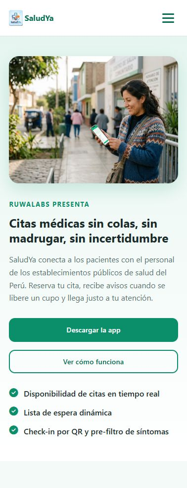

*Nota. Captura de la Landing Page publicada en GitHub Pages, tomada el 9 de octubre de 2026.*

###### Problema identificado

La sección describe la incertidumbre al buscar una cita y la pérdida de cupos por cancelaciones e inasistencias, como se observa en la [Figura 108](#figura-108).

**Figura 108**

*Problema identificado — SaludYa*

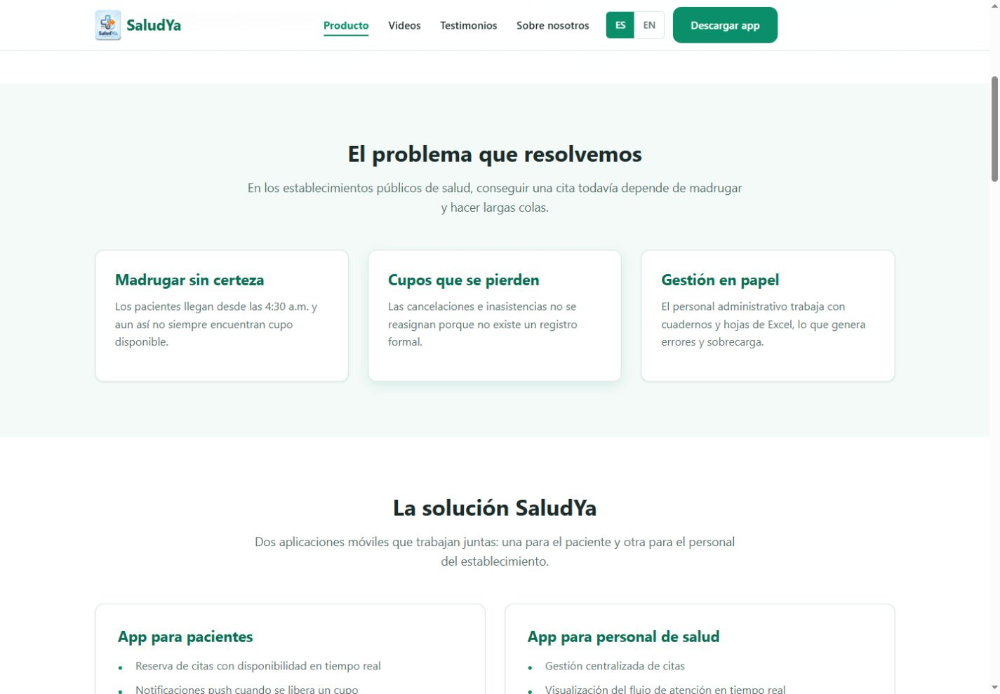

*Nota. Captura de la Landing Page publicada en GitHub Pages, tomada el 9 de octubre de 2026.*

###### Propuesta de solución

La sección reúne las funciones propuestas para el paciente, entre ellas la reserva de citas, la lista de espera, las notificaciones y el registro de llegada mediante QR; también presenta la aplicación para el personal de salud, como se observa en la [Figura 109](#figura-109).

**Figura 109**

*Propuesta de solución — SaludYa*

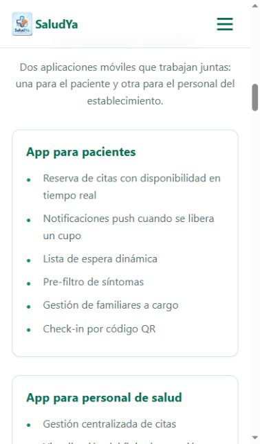

*Nota. Captura de la Landing Page publicada en GitHub Pages, tomada el 9 de octubre de 2026.*

###### Modelo de negocio

La página presenta el modelo propuesto de implementación institucional, convenios con redes de salud y soporte. Estos contenidos describen la propuesta comercial del proyecto, como se observa en la [Figura 110](#figura-110).

**Figura 110**

*Modelo de negocio — SaludYa*

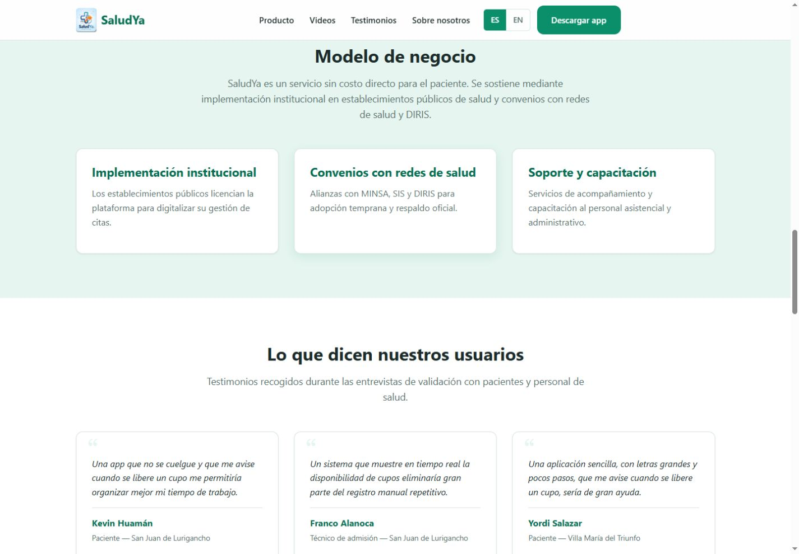

*Nota. Captura de la Landing Page publicada en GitHub Pages, tomada el 9 de octubre de 2026.*

###### Testimonios

Los testimonios publicados recogen opiniones sobre la disponibilidad de citas y la digitalización del registro, obtenidas durante las entrevistas de validación, como se observa en la [Figura 111](#figura-111).

**Figura 111**

*Testimonios — SaludYa*

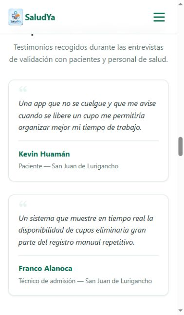

*Nota. Captura de la Landing Page publicada en GitHub Pages, tomada el 9 de octubre de 2026.*

###### Presentación de RuwaLabs

La sección explica el propósito del equipo y presenta la misión y visión de SaludYa, como se observa en la [Figura 112](#figura-112).

**Figura 112**

*Presentación de RuwaLabs — SaludYa*

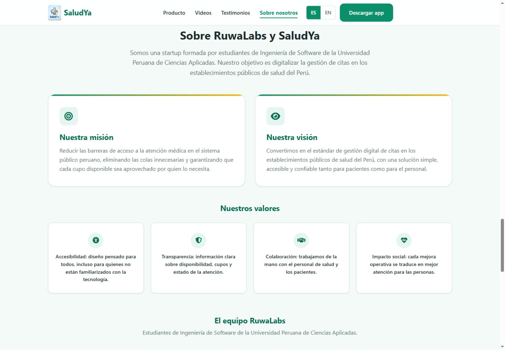

*Nota. Captura de la Landing Page publicada en GitHub Pages, tomada el 9 de octubre de 2026.*

###### Disponibilidad de la aplicación

La sección anuncia la próxima disponibilidad para Android e iOS y muestra los botones de las tiendas. En esta captura, estos accesos todavía corresponden al anuncio de disponibilidad futura, como se observa en la [Figura 113](#figura-113).

**Figura 113**

*Disponibilidad de la aplicación — SaludYa*

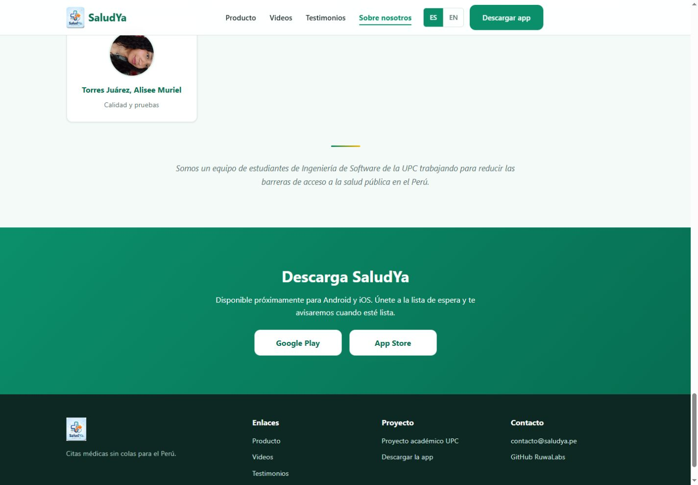

*Nota. Captura de la Landing Page publicada en GitHub Pages, tomada el 9 de octubre de 2026.*

##### Aplicación Android

La aplicación Android de SaludYa se distribuye mediante un APK de prueba generado a partir de la rama `develop` del repositorio Kotlin, commit `74a4b7f`. La compilación finalizó correctamente y se verificó la firma del paquete. Esta versión requiere Android 7.0 o superior y utiliza el backend publicado en `http://3.129.217.49:8080/`.

Enlace de despliegue: [Descargar APK de SaludYa para Android](https://github.com/RuwaLabs/upc-pre-202620-1acc0238-4945-RuwaLabs-report/raw/refs/heads/develop/assets/downloads/SaludYa-develop-debug.apk).

Las imágenes siguientes presentan las pantallas del paciente. Las notas de cada figura identifican su origen.

Archivo de interfaz: [SaludYa en Figma](https://www.figma.com/design/9Or15PiTxTluzSQouONYqH/Mobile-Application-Mockups?node-id=2-2).

###### Bienvenida

La pantalla presenta la identidad visual de SaludYa y los accesos para iniciar sesión o crear una cuenta, como se observa en la [Figura 114](#figura-114).

**Figura 114**

*Bienvenida — SaludYa*

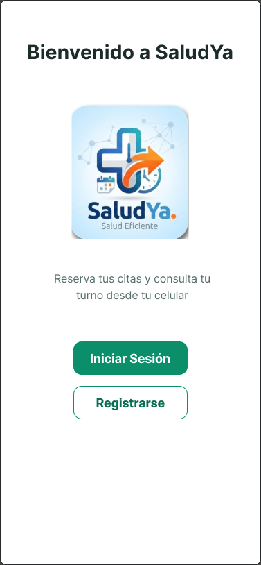

*Nota. Interfaz del paciente exportada de Figma; referencia visual, no captura de ejecución del APK.*

###### Verificación de identidad

El formulario solicita los datos de identidad del paciente antes de continuar con la creación de su cuenta, como se observa en la [Figura 115](#figura-115).

**Figura 115**

*Verificación de identidad — SaludYa*

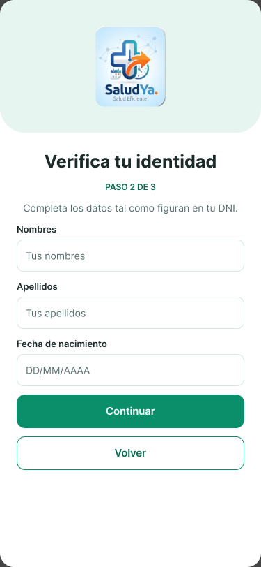

*Nota. Interfaz del paciente exportada de Figma; referencia visual, no captura de ejecución del APK.*

###### Registro de credenciales

El paciente registra su correo, contraseña y datos de contacto después de verificar su identidad, como se observa en la [Figura 116](#figura-116).

**Figura 116**

*Registro de credenciales — SaludYa*

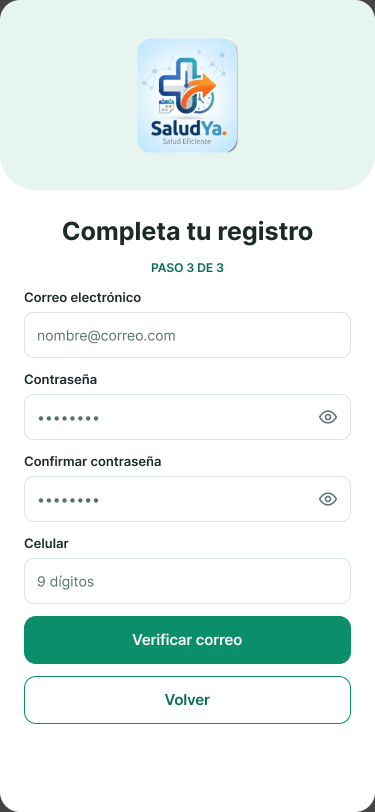

*Nota. Interfaz del paciente exportada de Figma; referencia visual, no captura de ejecución del APK.*

###### Verificación por correo

La pantalla solicita el código de verificación enviado al correo del paciente y permite reenviarlo, como se observa en la [Figura 117](#figura-117).

**Figura 117**

*Verificación por correo — SaludYa*

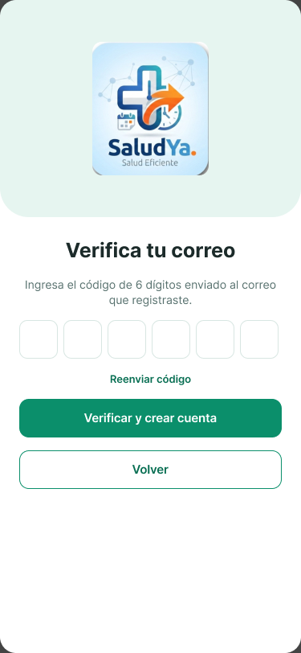

*Nota. Interfaz del paciente exportada de Figma; referencia visual, no captura de ejecución del APK.*

###### Inicio de sesión

El paciente ingresa su correo y contraseña para acceder a su cuenta, como se observa en la [Figura 118](#figura-118).

**Figura 118**

*Inicio de sesión — SaludYa*

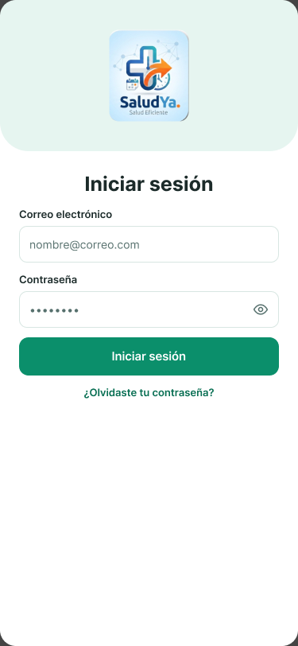

*Nota. Interfaz del paciente exportada de Figma; referencia visual, no captura de ejecución del APK.*

###### Recuperación de acceso

El formulario permite solicitar un enlace de recuperación al correo registrado, como se observa en la [Figura 119](#figura-119).

**Figura 119**

*Recuperación de acceso — SaludYa*

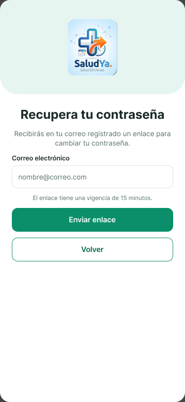

*Nota. Interfaz del paciente exportada de Figma; referencia visual, no captura de ejecución del APK.*

###### Restablecimiento de contraseña

El paciente define y confirma una nueva contraseña mediante el recorrido de recuperación, como se observa en la [Figura 120](#figura-120).

**Figura 120**

*Restablecimiento de contraseña — SaludYa*

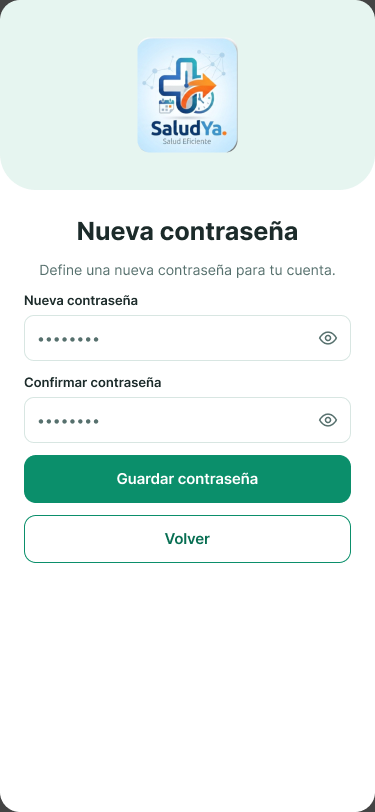

*Nota. Interfaz del paciente exportada de Figma; referencia visual, no captura de ejecución del APK.*

###### Inicio del paciente

La vista principal reúne las citas pendientes y los accesos al historial y a la reserva de una nueva cita, como se observa en la [Figura 121](#figura-121).

**Figura 121**

*Inicio del paciente — SaludYa*

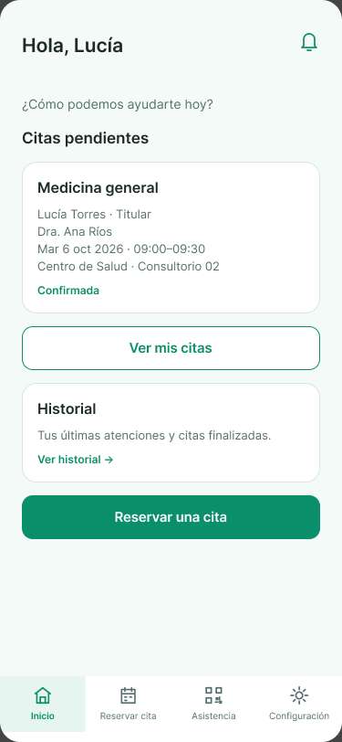

*Nota. Interfaz del paciente exportada de Figma; referencia visual, no captura de ejecución del APK.*

###### Reserva de cita

El recorrido de reserva presenta las opciones necesarias para elegir una cita según la disponibilidad del establecimiento, como se observa en la [Figura 122](#figura-122).

**Figura 122**

*Reserva de cita — SaludYa*

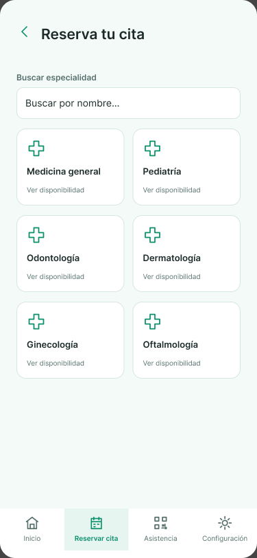

*Nota. Interfaz del paciente exportada de Figma; referencia visual, no captura de ejecución del APK.*

###### Confirmación de reserva

La pantalla presenta la confirmación y los datos de la cita seleccionada, como se observa en la [Figura 123](#figura-123).

**Figura 123**

*Confirmación de reserva — SaludYa*

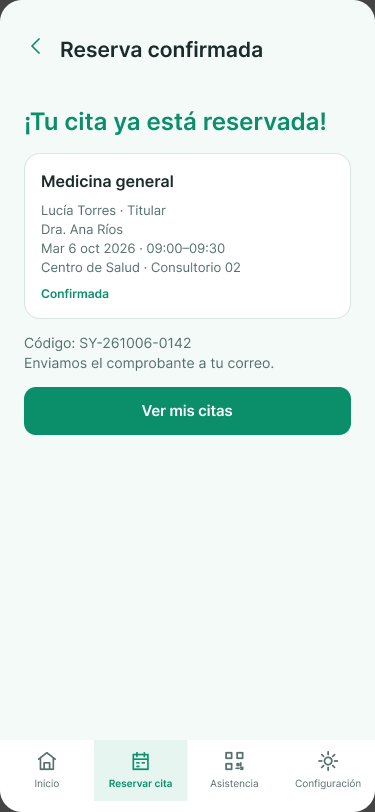

*Nota. Interfaz del paciente exportada de Figma; referencia visual, no captura de ejecución del APK.*

###### Registro de llegada

La interfaz indica al paciente que debe escanear el QR del establecimiento para registrar su llegada y confirmar su presencia, como se observa en la [Figura 124](#figura-124).

**Figura 124**

*Registro de llegada — SaludYa*

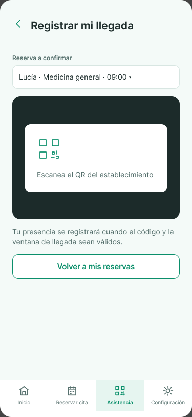

*Nota. Interfaz del paciente exportada de Figma; referencia visual, no captura de ejecución del APK.*

###### Ticket de atención

La pantalla presenta el ticket del paciente como parte del seguimiento de su turno de atención, como se observa en la [Figura 125](#figura-125).

**Figura 125**

*Ticket de atención — SaludYa*

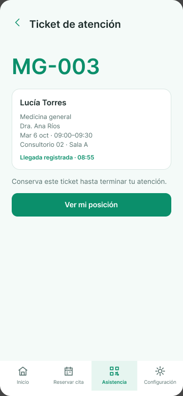

*Nota. Interfaz del paciente exportada de Figma; referencia visual, no captura de ejecución del APK.*

###### Perfil del paciente

El perfil reúne los datos personales y de contacto, junto con las acciones disponibles para la cuenta, como se observa en la [Figura 126](#figura-126).

**Figura 126**

*Perfil del paciente — SaludYa*

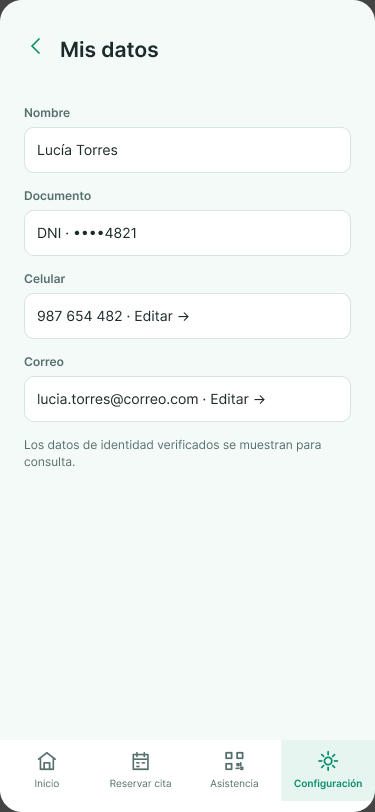

*Nota. Interfaz del paciente exportada de Figma; referencia visual, no captura de ejecución del APK.*

###### Menores vinculados

La vista permite consultar los menores vinculados al paciente y acceder a las acciones de gestión del vínculo, como se observa en la [Figura 127](#figura-127).

**Figura 127**

*Menores vinculados — SaludYa*

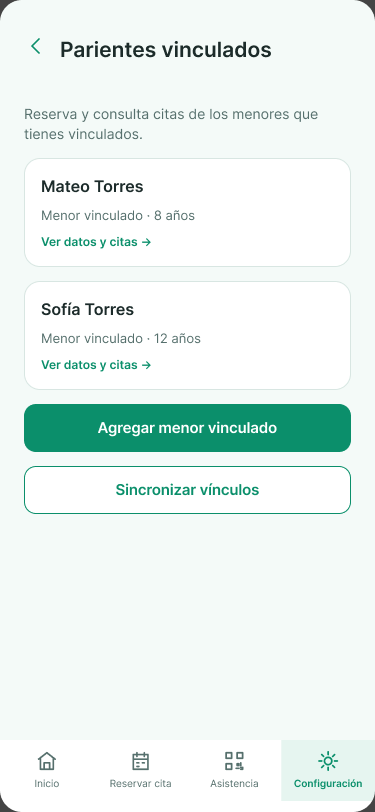

*Nota. Interfaz del paciente exportada de Figma; referencia visual, no captura de ejecución del APK.*

###### Notificaciones del paciente

La pantalla reúne los avisos dirigidos al paciente para consultar los cambios y novedades relacionados con sus citas, como se observa en la [Figura 128](#figura-128).

**Figura 128**

*Notificaciones del paciente — SaludYa*

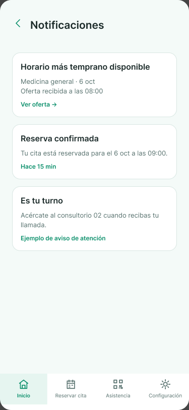

*Nota. Interfaz del paciente exportada de Figma; referencia visual, no captura de ejecución del APK.*

##### Backend: documentación publicada en Swagger

El backend dispone de una interfaz Swagger UI que presenta los endpoints y sus contratos HTTP. Las capturas muestran la documentación accesible del servicio desplegado; no constituyen resultados de pruebas ni acreditan por sí solas la ejecución exitosa de las operaciones de negocio.

Enlace de despliegue: [Swagger UI de SaludYa](http://3.129.217.49:8080/swagger-ui/index.html#/).

###### Vista general de Swagger

La interfaz identifica el servicio como SaludYa API y presenta el servidor y los grupos de endpoints publicados, como se observa en la [Figura 129](#figura-129).

**Figura 129**

*Vista general de Swagger — SaludYa*

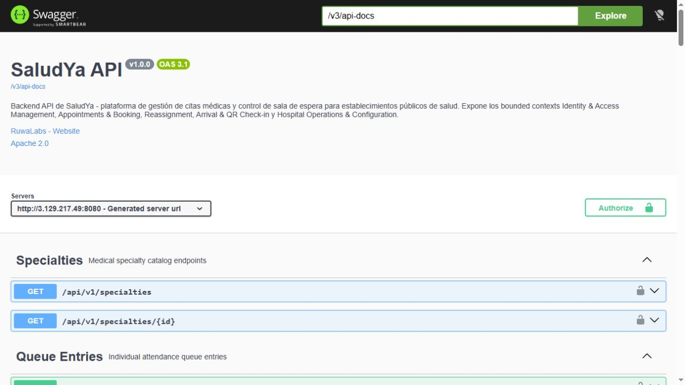

*Nota. Captura de Swagger UI del backend desplegado de SaludYa, tomada el 9 de octubre de 2026.*

###### Verificación de identidad en el backend

El grupo IAM - Identity verification documenta las operaciones para verificar la identidad y consultar la existencia de un DNI, como se observa en la [Figura 130](#figura-130).

**Figura 130**

*Verificación de identidad en el backend — SaludYa*

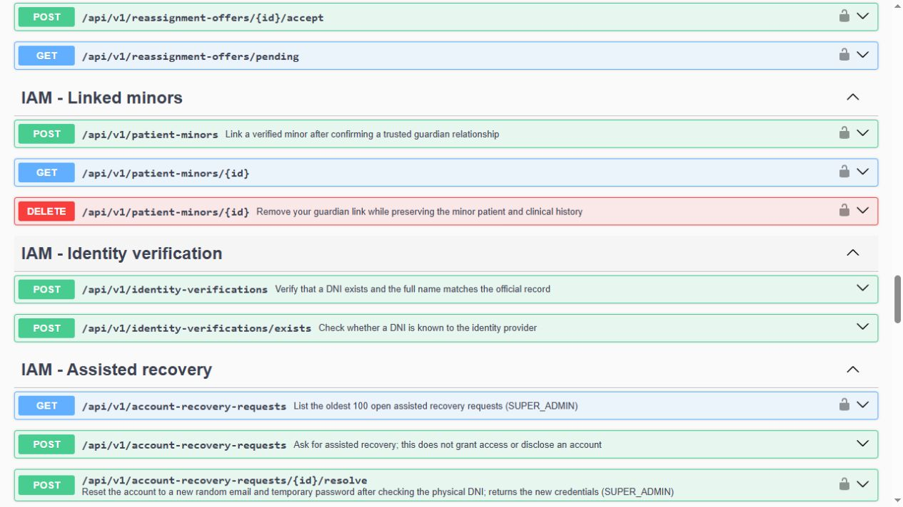

*Nota. Captura de Swagger UI del backend desplegado de SaludYa, tomada el 9 de octubre de 2026.*

###### Cuentas y credenciales

El grupo IAM - User accounts presenta los contratos de cuentas, registro y recuperación de acceso, como se observa en la [Figura 131](#figura-131).

**Figura 131**

*Cuentas y credenciales — SaludYa*

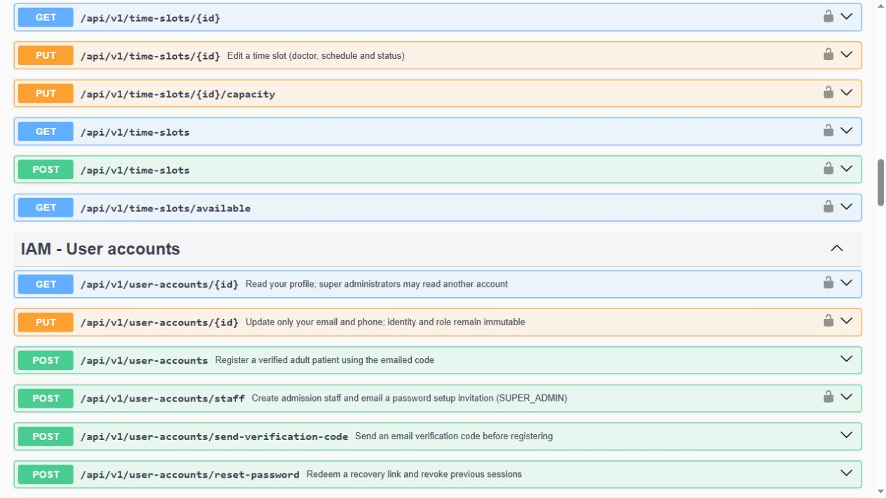

*Nota. Captura de Swagger UI del backend desplegado de SaludYa, tomada el 9 de octubre de 2026.*

###### Perfil del paciente

El grupo IAM - Patients documenta la consulta y actualización del perfil y la consulta de menores vinculados, como se observa en la [Figura 132](#figura-132).

**Figura 132**

*Perfil del paciente — SaludYa*

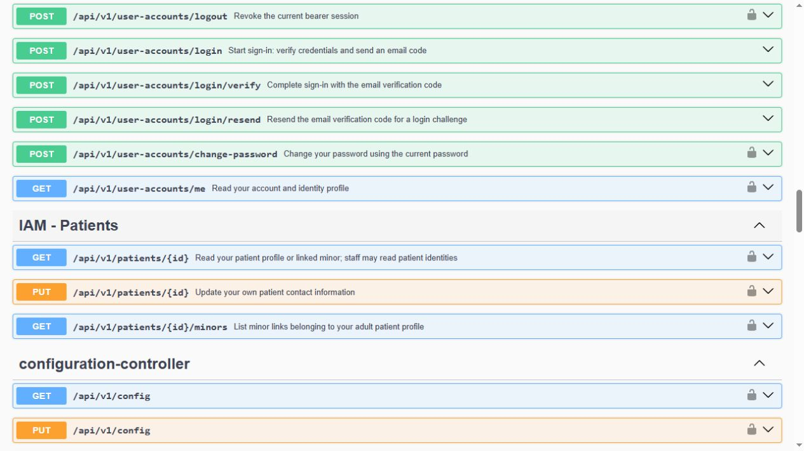

*Nota. Captura de Swagger UI del backend desplegado de SaludYa, tomada el 9 de octubre de 2026.*

###### Vinculación de menores

El grupo IAM - Linked minors presenta los contratos para crear, consultar y eliminar el vínculo con un menor, como se observa en la [Figura 133](#figura-133).

**Figura 133**

*Vinculación de menores — SaludYa*

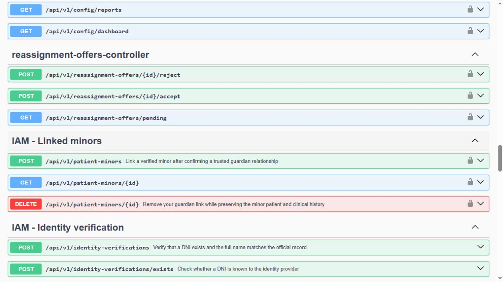

*Nota. Captura de Swagger UI del backend desplegado de SaludYa, tomada el 9 de octubre de 2026.*

###### Reservas de citas

El grupo Appointments presenta las operaciones para registrar y consultar reservas, cancelarlas y consultar las citas de un paciente, como se observa en la [Figura 134](#figura-134).

**Figura 134**

*Reservas de citas — SaludYa*

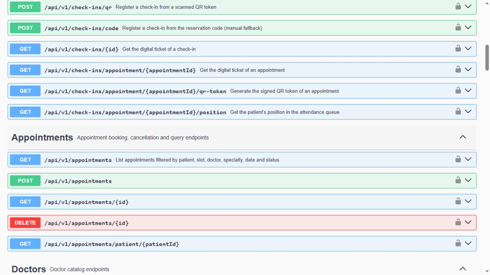

*Nota. Captura de Swagger UI del backend desplegado de SaludYa, tomada el 9 de octubre de 2026.*

###### Disponibilidad de horarios

El grupo Time Slots documenta la consulta de intervalos y disponibilidad para la reserva de citas, como se observa en la [Figura 135](#figura-135).

**Figura 135**

*Disponibilidad de horarios — SaludYa*

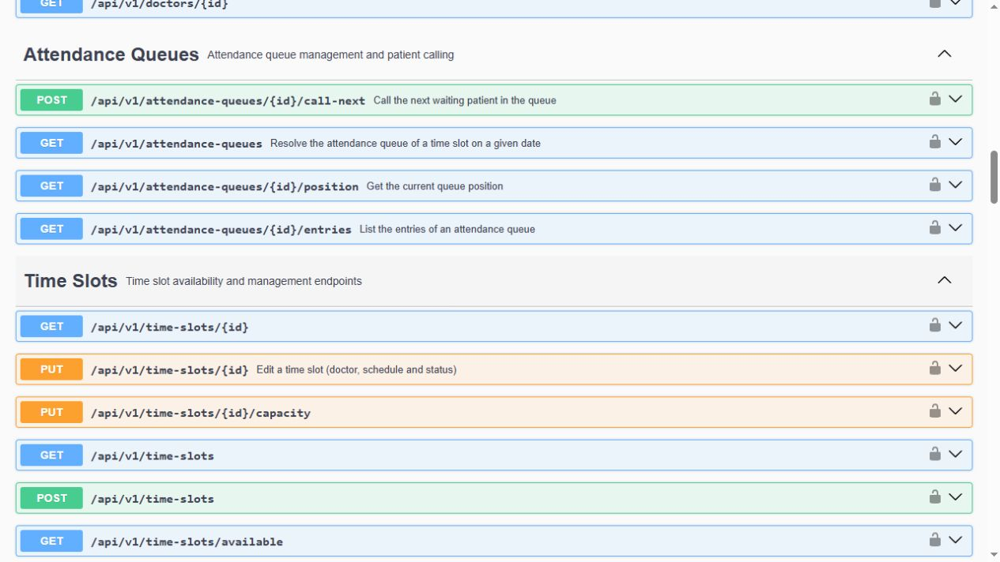

*Nota. Captura de Swagger UI del backend desplegado de SaludYa, tomada el 9 de octubre de 2026.*

###### Registro de asistencia

El grupo Check-ins presenta los contratos de registro de llegada por QR o código y las consultas relacionadas con el estado de asistencia, como se observa en la [Figura 136](#figura-136).

**Figura 136**

*Registro de asistencia — SaludYa*

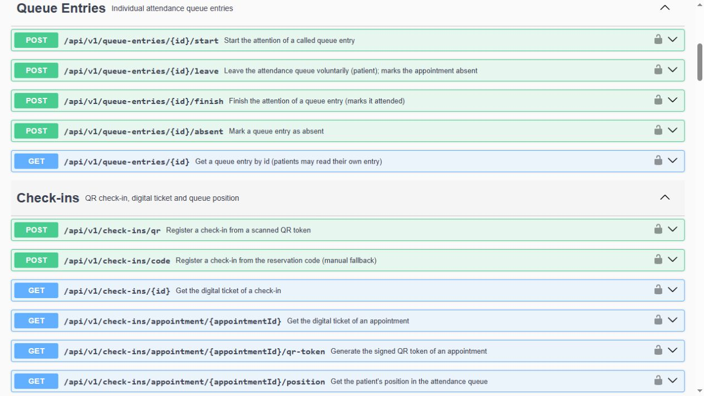

*Nota. Captura de Swagger UI del backend desplegado de SaludYa, tomada el 9 de octubre de 2026.*

###### Cola de atención

El grupo Attendance Queues documenta las consultas de cola, posición y pacientes en espera, junto con la operación de llamado, como se observa en la [Figura 137](#figura-137).

**Figura 137**

*Cola de atención — SaludYa*

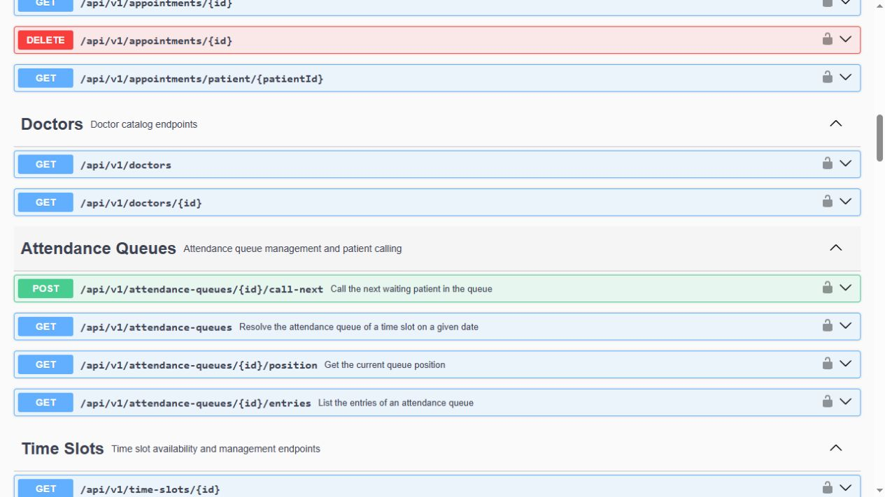

*Nota. Captura de Swagger UI del backend desplegado de SaludYa, tomada el 9 de octubre de 2026.*

###### Ofertas de reasignación

El grupo reassignment-offers-controller documenta la consulta de ofertas pendientes y las acciones para aceptar o rechazar una oferta, como se observa en la [Figura 138](#figura-138).

**Figura 138**

*Ofertas de reasignación — SaludYa*

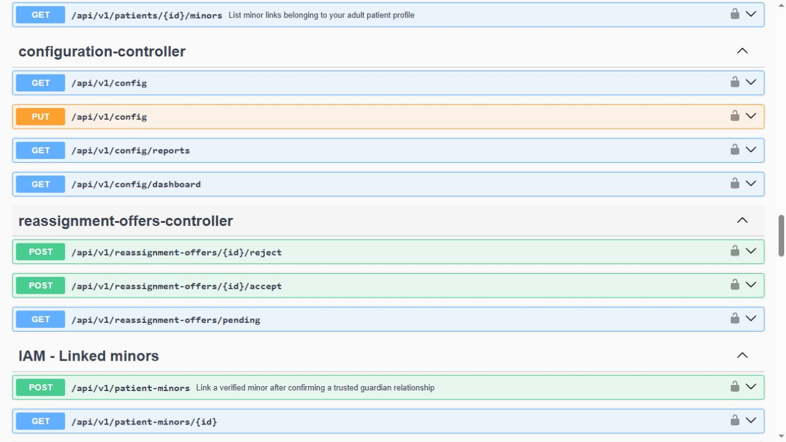

*Nota. Captura de Swagger UI del backend desplegado de SaludYa, tomada el 9 de octubre de 2026.*

# Conclusiones

## Conclusiones y recomendaciones

A partir del análisis realizado y de la validación de las hipótesis planteadas, se presentan las siguientes conclusiones y recomendaciones:

### Conclusiones

- La problemática planteada sobre la ineficiencia en el acceso a citas en establecimientos públicos de salud se confirmó a través del análisis de contexto y entrevistas, demostrando que la dependencia exclusiva de canales presenciales o telefónicos genera colas prolongadas y desinformación.

- El supuesto de negocio respecto a la demanda no atendida por soluciones digitales fue validado con éxito, dado que todos los pacientes entrevistados consideraron de alta utilidad consultar la disponibilidad de cupos en tiempo real desde sus dispositivos.

- Al contrastar las suposiciones con el comportamiento real del segmento de pacientes, se evidenció que la mayoría no ha utilizado aplicaciones médicas previamente. Sin embargo, se sienten cómodos realizando trámites desde sus celulares, lo que confirma la viabilidad de adopción de la plataforma.

- Las hipótesis operativas orientadas a mejorar el control del flujo de atención fueron validadas por el personal administrativo, quienes confirmaron que la gestión manual actual mediante cuadernos y hojas de cálculo provoca pérdida de información y desorganización operativa.

- Se concluye que la lista de espera dinámica y las notificaciones automatizadas responden directamente a los criterios de éxito del proyecto, asegurando el reaprovechamiento de cupos cancelados y mitigando los viajes innecesarios de los usuarios.

- La hipótesis sobre la reducción del tiempo de espera percibido es respaldada por la estructuración técnica del sistema, el cual incluye un mecanismo de registro de llegada (*check-in*) por código QR diseñado para descongestionar las ventanillas físicas.

### Recomendaciones

- **Despliegue incremental basado en el Product Backlog:** Se recomienda ejecutar la priorización del MVP definida en los Sprints 1 y 2, liberando inicialmente el motor de reservas (*Appointments & Booking*), la validación de identidad y el *check-in* por QR, debido a que estos componentes representan el núcleo de valor para descongestionar el flujo presencial de pacientes.

- **Evolución hacia la Reprogramación Inteligente:** Para futuras versiones, se recomienda integrar un sistema de sugerencias inteligentes de horarios y la posibilidad de reprogramación automática, con el objetivo de resolver de manera proactiva los cruces de agenda y mejorar la experiencia del módulo central de citas.

- **Ampliación de mecanismos de Check-in:** A partir de las oportunidades identificadas en el contexto *Arrival & QR Check-in*, se recomienda evaluar en futuras versiones mecanismos alternativos de validación, como el reconocimiento facial, para facilitar el acceso de pacientes que no cuenten con un dispositivo móvil al momento de su atención.

<!-- pdf-pagebreak -->

# Bibliografía #

Ministerio de Salud (MINSA). (2017, 16 de mayo). _Nuevo sistema “Web colas” reduce el tiempo de espera en hospitales_. Recuperado de [https://www.gob.pe/institucion/minsa/noticias/13263-nuevo-sistema-web-colas-reduce-el-tiempo-de-espera-en-hospitales](https://www.gob.pe/institucion/minsa/noticias/13263-nuevo-sistema-web-colas-reduce-el-tiempo-de-espera-en-hospitales)

Ministerio de Salud (MINSA). (2023, 19 de septiembre). _Minsa reduce tiempos de espera por atención en establecimientos de salud de Lima Metropolitana_. Recuperado de [https://www.gob.pe/institucion/minsa/noticias/831946-minsa-reduce-tiempos-de-espera-por-atencion-en-establecimientos-de-salud-de-lima-metropolitana](https://www.gob.pe/institucion/minsa/noticias/831946-minsa-reduce-tiempos-de-espera-por-atencion-en-establecimientos-de-salud-de-lima-metropolitana)

Ministerio de Salud (MINSA). (2024, 1 de marzo). _Minsa fortalece sistema de “Citas en Línea”_. Recuperado de [https://www.gob.pe/institucion/minsa/noticias/914419-minsa-fortalece-sistema-de-citas-en-linea](https://www.gob.pe/institucion/minsa/noticias/914419-minsa-fortalece-sistema-de-citas-en-linea)

Ministerio de Salud (MINSA). (2025, 2 de agosto). _Hospital San Juan de Lurigancho: más de 93 000 pacientes accedieron a sus citas por teléfono en el primer semestre de 2025_. Recuperado de [https://www.gob.pe/institucion/minsa/noticias/1224054-hospital-san-juan-de-lurigancho-mas-de-93-000-pacientes-accedieron-a-sus-citas-por-telefono-en-el-primer-semestre-de-2025](https://www.gob.pe/institucion/minsa/noticias/1224054-hospital-san-juan-de-lurigancho-mas-de-93-000-pacientes-accedieron-a-sus-citas-por-telefono-en-el-primer-semestre-de-2025)

Presidencia del Consejo de Ministros (PCM). (2026). _Obtener cita médica en un establecimiento del Minsa_. Plataforma del Estado Peruano. Recuperado de [https://www.gob.pe/20621-obtener-cita-medica-en-un-establecimiento-del-minsa](https://www.gob.pe/20621-obtener-cita-medica-en-un-establecimiento-del-minsa)

World Health Organization (WHO). (2025). _Global strategy on digital health 2020–2027_. World Health Organization. Recuperado de [https://www.who.int/publications/i/item/9789240116870](https://www.who.int/publications/i/item/9789240116870)

<!-- pdf-pagebreak -->
# Anexos

## Anexo A: Vídeos de entrevistas realizadas

Para la identificación de necesidades de los usuarios, se entrevistó a una pequeña parte del conjunto que forma a los segmentos objetivos.

### Segmento objetivo 1: Pacientes de zonas urbanas periféricas que acuden a establecimientos públicos de salud

- [Entrevista #1](https://upcedupe-my.sharepoint.com/:v:/g/personal/u202319950_upc_edu_pe/IQA1UOjt3ewoT49AZwwO8GtcASfbhFc_OfiWOZ0V9ZzQUvU?nav=eyJyZWZlcnJhbEluZm8iOnsicmVmZXJyYWxBcHAiOiJTdHJlYW1XZWJBcHAiLCJyZWZlcnJhbFZpZXciOiJTaGFyZURpYWxvZy1MaW5rIiwicmVmZXJyYWxBcHBQbGF0Zm9ybSI6IldlYiIsInJlZmVycmFsTW9kZSI6InZpZXcifX0%3D&e=VApkCW)

- [Entrevista #2](https://upcedupe-my.sharepoint.com/:v:/g/personal/u202319950_upc_edu_pe/IQCq6uLH5lxNSpoxEAN9q1qfAVF0qgEoHWEvug_aNrID100?nav=eyJyZWZlcnJhbEluZm8iOnsicmVmZXJyYWxBcHAiOiJTdHJlYW1XZWJBcHAiLCJyZWZlcnJhbFZpZXciOiJTaGFyZURpYWxvZy1MaW5rIiwicmVmZXJyYWxBcHBQbGF0Zm9ybSI6IldlYiIsInJlZmVycmFsTW9kZSI6InZpZXcifX0%3D&e=sXQwSj)

- [Entrevista #3](https://upcedupe-my.sharepoint.com/:v:/g/personal/u202319950_upc_edu_pe/IQAAwi-Crd0UR6aM_vPtIyU8AY5rcOh7FEgLdmqvsNkC1bU?e=JGBM7r&nav=eyJyZWZlcnJhbEluZm8iOnsicmVmZXJyYWxBcHAiOiJTdHJlYW1XZWJBcHAiLCJyZWZlcnJhbFZpZXciOiJTaGFyZURpYWxvZy1MaW5rIiwicmVmZXJyYWxBcHBQbGF0Zm9ybSI6IldlYiIsInJlZmVycmFsTW9kZSI6InZpZXcifX0%3D)

### Segmento objetivo 2: Personal asistencial y administrativo de establecimientos públicos de salud

- [Entrevista #1](https://upcedupe-my.sharepoint.com/:v:/g/personal/u202319950_upc_edu_pe/IQDwPo3p7nHzTo_3Q8Hdq5zRASpKzhsImRgOPsWf4awAsOU?e=pY3MtU&nav=eyJyZWZlcnJhbEluZm8iOnsicmVmZXJyYWxBcHAiOiJTdHJlYW1XZWJBcHAiLCJyZWZlcnJhbFZpZXciOiJTaGFyZURpYWxvZy1MaW5rIiwicmVmZXJyYWxBcHBQbGF0Zm9ybSI6IldlYiIsInJlZmVycmFsTW9kZSI6InZpZXcifX0%3D)

- [Entrevista #2](https://upcedupe-my.sharepoint.com/:v:/g/personal/u202319950_upc_edu_pe/IQBrqsrdMO0-QLVyjU8m37RyAcAk6_JKY5ZmpVbMa0_eAk8?nav=eyJyZWZlcnJhbEluZm8iOnsicmVmZXJyYWxBcHAiOiJTdHJlYW1XZWJBcHAiLCJyZWZlcnJhbFZpZXciOiJTaGFyZURpYWxvZy1MaW5rIiwicmVmZXJyYWxBcHBQbGF0Zm9ybSI6IldlYiIsInJlZmVycmFsTW9kZSI6InZpZXcifX0%3D&e=Rr8mOi)

- [Entrevista #3](https://upcedupe-my.sharepoint.com/:v:/g/personal/u202319950_upc_edu_pe/IQAxoPDUIPTuQou-upR_hnBwARbOntKKq5_cv4dAcDxMApU?nav=eyJyZWZlcnJhbEluZm8iOnsicmVmZXJyYWxBcHAiOiJTdHJlYW1XZWJBcHAiLCJyZWZlcnJhbFZpZXciOiJTaGFyZURpYWxvZy1MaW5rIiwicmVmZXJyYWxBcHBQbGF0Zm9ybSI6IldlYiIsInJlZmVycmFsTW9kZSI6IldlYiJ9fQ%3D%3D&e=JfXt3p)

